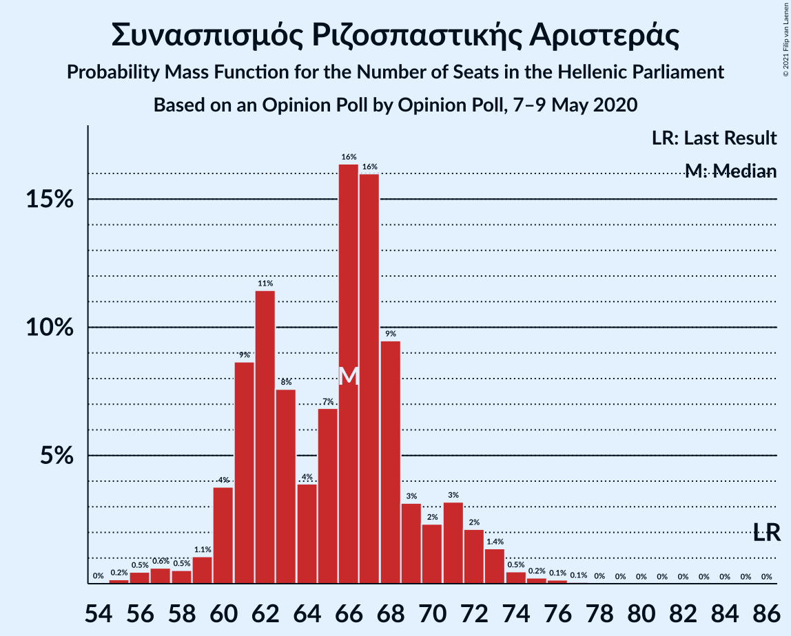
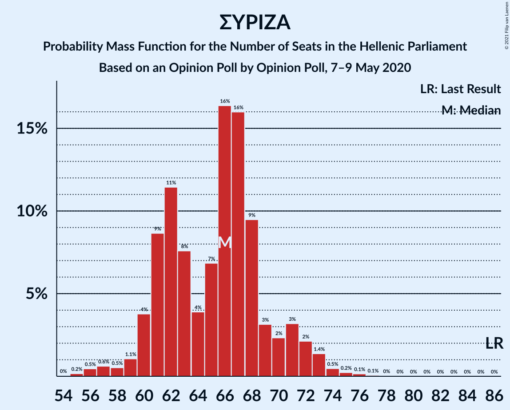

# Opinion Poll by Opinion Poll, 7–9 May 2020

<a href="#voting-intentions">Voting Intentions</a> | <a href="#seats">Seats</a> | <a href="#coalitions">Coalitions</a> | <a href="#technical-information">Technical Information</a>

## Voting Intentions

### Confidence Intervals

| Party | Last Result | Poll Result | 80% Confidence Interval | 90% Confidence Interval | 95% Confidence Interval | 99% Confidence Interval |
|:-----:|:-----------:|:-----------:|:-----------------------:|:-----------------------:|:-----------------------:|:-----------------------:|
| Νέα Δημοκρατία | 39.8% | 50.4% | 48.4–52.3% |47.9–52.9% |47.4–53.4% |46.5–54.3% |
| Συνασπισμός Ριζοσπαστικής Αριστεράς | 31.5% | 25.1% | 23.5–26.8% |23.0–27.3% |22.6–27.8% |21.8–28.6% |
| Κομμουνιστικό Κόμμα Ελλάδας | 5.3% | 6.3% | 5.4–7.3% |5.2–7.7% |5.0–7.9% |4.6–8.4% |
| Κίνημα Αλλαγής | 8.1% | 5.6% | 4.8–6.6% |4.5–6.8% |4.3–7.1% |4.0–7.6% |
| Ελληνική Λύση | 3.7% | 5.0% | 4.2–6.0% |4.0–6.2% |3.8–6.5% |3.5–7.0% |
| Μέτωπο Ευρωπαϊκής Ρεαλιστικής Ανυπακοής | 3.4% | 3.8% | 3.1–4.7% |3.0–4.9% |2.8–5.1% |2.5–5.6% |
| Χρυσή Αυγή | 2.9% | 1.4% | 1.0–2.0% |0.9–2.1% |0.8–2.3% |0.7–2.6% |

*Note:* The poll result column reflects the actual value used in the calculations. Published results may vary slightly, and in addition be rounded to fewer digits.

## Seats

### Confidence Intervals

| Party | Last Result | Median | 80% Confidence Interval | 90% Confidence Interval | 95% Confidence Interval | 99% Confidence Interval |
|:-----:|:-----------:|:------:|:-----------------------:|:-----------------------:|:-----------------------:|:-----------------------:|
| <a href="#νέα-δημοκρατία">Νέα Δημοκρατία</a> | 158 | 180 | 176–187 |173–188 |173–190 |170–192 |
| <a href="#συνασπισμός-ριζοσπαστικής-αριστεράς">Συνασπισμός Ριζοσπαστικής Αριστεράς</a> | 86 | 66 | 61–70 |60–71 |59–72 |56–75 |
| <a href="#κομμουνιστικό-κόμμα-ελλάδας">Κομμουνιστικό Κόμμα Ελλάδας</a> | 15 | 17 | 14–19 |13–20 |13–21 |12–22 |
| <a href="#κίνημα-αλλαγής">Κίνημα Αλλαγής</a> | 22 | 15 | 12–17 |12–18 |11–19 |10–20 |
| <a href="#ελληνική-λύση">Ελληνική Λύση</a> | 10 | 13 | 11–16 |11–16 |10–17 |9–18 |
| <a href="#μέτωπο-ευρωπαϊκής-ρεαλιστικής-ανυπακοής">Μέτωπο Ευρωπαϊκής Ρεαλιστικής Ανυπακοής</a> | 9 | 10 | 8–12 |0–13 |0–13 |0–14 |
| <a href="#χρυσή-αυγή">Χρυσή Αυγή</a> | 0 | 0 | 0 |0 |0 |0 |

### Νέα Δημοκρατία

*For a full overview of the results for this party, see the [Νέα Δημοκρατία](party-νέαδημοκρατία.html) page.*

| Number of Seats | Probability | Accumulated | Special Marks |
|:---------------:|:-----------:|:-----------:|:-------------:|
| 158 | 0% | 100% | Last Result |
| 159 | 0% | 100% |  |
| 160 | 0% | 100% |  |
| 161 | 0% | 100% |  |
| 162 | 0% | 100% |  |
| 163 | 0% | 100% |  |
| 164 | 0% | 100% |  |
| 165 | 0% | 100% |  |
| 166 | 0% | 100% |  |
| 167 | 0% | 100% |  |
| 168 | 0.1% | 100% |  |
| 169 | 0.2% | 99.9% |  |
| 170 | 0.2% | 99.7% |  |
| 171 | 0.1% | 99.5% |  |
| 172 | 1.0% | 99.4% |  |
| 173 | 4% | 98% |  |
| 174 | 2% | 95% |  |
| 175 | 2% | 92% |  |
| 176 | 1.4% | 91% |  |
| 177 | 7% | 89% |  |
| 178 | 19% | 82% |  |
| 179 | 12% | 63% |  |
| 180 | 3% | 51% | Median |
| 181 | 5% | 48% |  |
| 182 | 7% | 43% |  |
| 183 | 11% | 37% |  |
| 184 | 9% | 26% |  |
| 185 | 3% | 17% |  |
| 186 | 3% | 14% |  |
| 187 | 7% | 12% |  |
| 188 | 2% | 5% |  |
| 189 | 0.4% | 3% |  |
| 190 | 1.4% | 3% |  |
| 191 | 0.8% | 1.5% |  |
| 192 | 0.2% | 0.7% |  |
| 193 | 0.2% | 0.5% |  |
| 194 | 0% | 0.2% |  |
| 195 | 0% | 0.2% |  |
| 196 | 0.1% | 0.2% |  |
| 197 | 0% | 0% |  |

### Συνασπισμός Ριζοσπαστικής Αριστεράς

*For a full overview of the results for this party, see the [Συνασπισμός Ριζοσπαστικής Αριστεράς](party-συνασπισμόςριζοσπαστικήςαριστεράς.html) page.*

| Number of Seats | Probability | Accumulated | Special Marks |
|:---------------:|:-----------:|:-----------:|:-------------:|
| 55 | 0.2% | 100% |  |
| 56 | 0.6% | 99.7% |  |
| 57 | 0.4% | 99.2% |  |
| 58 | 0.4% | 98.8% |  |
| 59 | 1.3% | 98% |  |
| 60 | 5% | 97% |  |
| 61 | 4% | 92% |  |
| 62 | 16% | 87% |  |
| 63 | 6% | 71% |  |
| 64 | 3% | 65% |  |
| 65 | 6% | 62% |  |
| 66 | 20% | 56% | Median |
| 67 | 19% | 36% |  |
| 68 | 5% | 18% |  |
| 69 | 2% | 12% |  |
| 70 | 2% | 11% |  |
| 71 | 4% | 8% |  |
| 72 | 2% | 4% |  |
| 73 | 1.2% | 2% |  |
| 74 | 0.5% | 1.2% |  |
| 75 | 0.4% | 0.8% |  |
| 76 | 0.3% | 0.4% |  |
| 77 | 0% | 0.1% |  |
| 78 | 0% | 0% |  |
| 79 | 0% | 0% |  |
| 80 | 0% | 0% |  |
| 81 | 0% | 0% |  |
| 82 | 0% | 0% |  |
| 83 | 0% | 0% |  |
| 84 | 0% | 0% |  |
| 85 | 0% | 0% |  |
| 86 | 0% | 0% | Last Result |

### Κομμουνιστικό Κόμμα Ελλάδας

*For a full overview of the results for this party, see the [Κομμουνιστικό Κόμμα Ελλάδας](party-κομμουνιστικόκόμμαελλάδας.html) page.*

| Number of Seats | Probability | Accumulated | Special Marks |
|:---------------:|:-----------:|:-----------:|:-------------:|
| 11 | 0.1% | 100% |  |
| 12 | 1.3% | 99.8% |  |
| 13 | 4% | 98.6% |  |
| 14 | 13% | 94% |  |
| 15 | 9% | 81% | Last Result |
| 16 | 12% | 72% |  |
| 17 | 25% | 60% | Median |
| 18 | 21% | 35% |  |
| 19 | 6% | 14% |  |
| 20 | 4% | 7% |  |
| 21 | 2% | 3% |  |
| 22 | 0.9% | 1.1% |  |
| 23 | 0.1% | 0.2% |  |
| 24 | 0% | 0.1% |  |
| 25 | 0% | 0% |  |

### Κίνημα Αλλαγής

*For a full overview of the results for this party, see the [Κίνημα Αλλαγής](party-κίνημααλλαγής.html) page.*

| Number of Seats | Probability | Accumulated | Special Marks |
|:---------------:|:-----------:|:-----------:|:-------------:|
| 10 | 1.1% | 100% |  |
| 11 | 2% | 98.8% |  |
| 12 | 9% | 96% |  |
| 13 | 14% | 87% |  |
| 14 | 15% | 73% |  |
| 15 | 29% | 58% | Median |
| 16 | 10% | 29% |  |
| 17 | 12% | 19% |  |
| 18 | 4% | 6% |  |
| 19 | 2% | 3% |  |
| 20 | 0.4% | 0.6% |  |
| 21 | 0.1% | 0.2% |  |
| 22 | 0% | 0.1% | Last Result |
| 23 | 0% | 0% |  |

### Ελληνική Λύση

*For a full overview of the results for this party, see the [Ελληνική Λύση](party-ελληνικήλύση.html) page.*

| Number of Seats | Probability | Accumulated | Special Marks |
|:---------------:|:-----------:|:-----------:|:-------------:|
| 8 | 0.1% | 100% |  |
| 9 | 1.0% | 99.9% |  |
| 10 | 4% | 98.9% | Last Result |
| 11 | 9% | 95% |  |
| 12 | 21% | 86% |  |
| 13 | 25% | 65% | Median |
| 14 | 15% | 40% |  |
| 15 | 14% | 25% |  |
| 16 | 8% | 12% |  |
| 17 | 3% | 4% |  |
| 18 | 0.5% | 0.9% |  |
| 19 | 0.3% | 0.4% |  |
| 20 | 0.1% | 0.1% |  |
| 21 | 0% | 0% |  |

### Μέτωπο Ευρωπαϊκής Ρεαλιστικής Ανυπακοής

*For a full overview of the results for this party, see the [Μέτωπο Ευρωπαϊκής Ρεαλιστικής Ανυπακοής](party-μέτωποευρωπαϊκήςρεαλιστικήςανυπακοής.html) page.*

| Number of Seats | Probability | Accumulated | Special Marks |
|:---------------:|:-----------:|:-----------:|:-------------:|
| 0 | 8% | 100% |  |
| 1 | 0% | 92% |  |
| 2 | 0% | 92% |  |
| 3 | 0% | 92% |  |
| 4 | 0% | 92% |  |
| 5 | 0% | 92% |  |
| 6 | 0% | 92% |  |
| 7 | 0% | 92% |  |
| 8 | 7% | 92% |  |
| 9 | 25% | 85% | Last Result |
| 10 | 23% | 60% | Median |
| 11 | 21% | 37% |  |
| 12 | 10% | 16% |  |
| 13 | 4% | 6% |  |
| 14 | 2% | 2% |  |
| 15 | 0.4% | 0.4% |  |
| 16 | 0% | 0.1% |  |
| 17 | 0% | 0% |  |

### Χρυσή Αυγή

*For a full overview of the results for this party, see the [Χρυσή Αυγή](party-χρυσήαυγή.html) page.*

| Number of Seats | Probability | Accumulated | Special Marks |
|:---------------:|:-----------:|:-----------:|:-------------:|
| 0 | 100% | 100% | Last Result, Median |

## Coalitions

### Confidence Intervals

| Coalition | Last Result | Median | Majority? | 80% Confidence Interval | 90% Confidence Interval | 95% Confidence Interval | 99% Confidence Interval |
|:---------:|:-----------:|:------:|:---------:|:-----------------------:|:-----------------------:|:-----------------------:|:-----------------------:|
| Νέα Δημοκρατία – Κίνημα Αλλαγής | 180 | 195 | 100% | 191–201 | 188–202 | 187–204 | 185–206 |
| Νέα Δημοκρατία | 158 | 180 | 100% | 176–187 | 173–188 | 173–190 | 170–192 |
| Συνασπισμός Ριζοσπαστικής Αριστεράς – Μέτωπο Ευρωπαϊκής Ρεαλιστικής Ανυπακοής | 95 | 75 | 0% | 70–79 | 68–81 | 65–83 | 63–85 |
| Συνασπισμός Ριζοσπαστικής Αριστεράς | 86 | 66 | 0% | 61–70 | 60–71 | 59–72 | 56–75 |

### Νέα Δημοκρατία – Κίνημα Αλλαγής

| Number of Seats | Probability | Accumulated | Special Marks |
|:---------------:|:-----------:|:-----------:|:-------------:|
| 180 | 0% | 100% | Last Result |
| 181 | 0% | 100% |  |
| 182 | 0% | 100% |  |
| 183 | 0% | 99.9% |  |
| 184 | 0.1% | 99.9% |  |
| 185 | 0.4% | 99.8% |  |
| 186 | 1.0% | 99.4% |  |
| 187 | 2% | 98% |  |
| 188 | 2% | 96% |  |
| 189 | 2% | 94% |  |
| 190 | 3% | 93% |  |
| 191 | 5% | 90% |  |
| 192 | 9% | 85% |  |
| 193 | 13% | 76% |  |
| 194 | 11% | 64% |  |
| 195 | 9% | 53% | Median |
| 196 | 5% | 44% |  |
| 197 | 3% | 39% |  |
| 198 | 10% | 35% |  |
| 199 | 6% | 26% |  |
| 200 | 10% | 20% |  |
| 201 | 4% | 11% |  |
| 202 | 2% | 6% |  |
| 203 | 0.8% | 4% |  |
| 204 | 2% | 4% |  |
| 205 | 0.8% | 2% |  |
| 206 | 0.8% | 1.2% |  |
| 207 | 0.1% | 0.4% |  |
| 208 | 0.1% | 0.3% |  |
| 209 | 0% | 0.2% |  |
| 210 | 0.2% | 0.2% |  |
| 211 | 0% | 0% |  |

### Νέα Δημοκρατία

| Number of Seats | Probability | Accumulated | Special Marks |
|:---------------:|:-----------:|:-----------:|:-------------:|
| 158 | 0% | 100% | Last Result |
| 159 | 0% | 100% |  |
| 160 | 0% | 100% |  |
| 161 | 0% | 100% |  |
| 162 | 0% | 100% |  |
| 163 | 0% | 100% |  |
| 164 | 0% | 100% |  |
| 165 | 0% | 100% |  |
| 166 | 0% | 100% |  |
| 167 | 0% | 100% |  |
| 168 | 0.1% | 100% |  |
| 169 | 0.2% | 99.9% |  |
| 170 | 0.2% | 99.7% |  |
| 171 | 0.1% | 99.5% |  |
| 172 | 1.0% | 99.4% |  |
| 173 | 4% | 98% |  |
| 174 | 2% | 95% |  |
| 175 | 2% | 92% |  |
| 176 | 1.4% | 91% |  |
| 177 | 7% | 89% |  |
| 178 | 19% | 82% |  |
| 179 | 12% | 63% |  |
| 180 | 3% | 51% | Median |
| 181 | 5% | 48% |  |
| 182 | 7% | 43% |  |
| 183 | 11% | 37% |  |
| 184 | 9% | 26% |  |
| 185 | 3% | 17% |  |
| 186 | 3% | 14% |  |
| 187 | 7% | 12% |  |
| 188 | 2% | 5% |  |
| 189 | 0.4% | 3% |  |
| 190 | 1.4% | 3% |  |
| 191 | 0.8% | 1.5% |  |
| 192 | 0.2% | 0.7% |  |
| 193 | 0.2% | 0.5% |  |
| 194 | 0% | 0.2% |  |
| 195 | 0% | 0.2% |  |
| 196 | 0.1% | 0.2% |  |
| 197 | 0% | 0% |  |

### Συνασπισμός Ριζοσπαστικής Αριστεράς – Μέτωπο Ευρωπαϊκής Ρεαλιστικής Ανυπακοής

| Number of Seats | Probability | Accumulated | Special Marks |
|:---------------:|:-----------:|:-----------:|:-------------:|
| 59 | 0.1% | 100% |  |
| 60 | 0.1% | 99.9% |  |
| 61 | 0% | 99.8% |  |
| 62 | 0.1% | 99.8% |  |
| 63 | 0.7% | 99.7% |  |
| 64 | 0.4% | 99.0% |  |
| 65 | 2% | 98.6% |  |
| 66 | 0.7% | 97% |  |
| 67 | 0.5% | 96% |  |
| 68 | 2% | 96% |  |
| 69 | 1.4% | 94% |  |
| 70 | 4% | 92% |  |
| 71 | 12% | 88% |  |
| 72 | 8% | 76% |  |
| 73 | 6% | 68% |  |
| 74 | 5% | 61% |  |
| 75 | 8% | 57% |  |
| 76 | 11% | 48% | Median |
| 77 | 18% | 37% |  |
| 78 | 5% | 19% |  |
| 79 | 5% | 14% |  |
| 80 | 3% | 10% |  |
| 81 | 2% | 7% |  |
| 82 | 2% | 5% |  |
| 83 | 2% | 3% |  |
| 84 | 0.4% | 0.9% |  |
| 85 | 0.4% | 0.5% |  |
| 86 | 0.1% | 0.2% |  |
| 87 | 0% | 0.1% |  |
| 88 | 0% | 0% |  |
| 89 | 0% | 0% |  |
| 90 | 0% | 0% |  |
| 91 | 0% | 0% |  |
| 92 | 0% | 0% |  |
| 93 | 0% | 0% |  |
| 94 | 0% | 0% |  |
| 95 | 0% | 0% | Last Result |

### Συνασπισμός Ριζοσπαστικής Αριστεράς

| Number of Seats | Probability | Accumulated | Special Marks |
|:---------------:|:-----------:|:-----------:|:-------------:|
| 55 | 0.2% | 100% |  |
| 56 | 0.6% | 99.7% |  |
| 57 | 0.4% | 99.2% |  |
| 58 | 0.4% | 98.8% |  |
| 59 | 1.3% | 98% |  |
| 60 | 5% | 97% |  |
| 61 | 4% | 92% |  |
| 62 | 16% | 87% |  |
| 63 | 6% | 71% |  |
| 64 | 3% | 65% |  |
| 65 | 6% | 62% |  |
| 66 | 20% | 56% | Median |
| 67 | 19% | 36% |  |
| 68 | 5% | 18% |  |
| 69 | 2% | 12% |  |
| 70 | 2% | 11% |  |
| 71 | 4% | 8% |  |
| 72 | 2% | 4% |  |
| 73 | 1.2% | 2% |  |
| 74 | 0.5% | 1.2% |  |
| 75 | 0.4% | 0.8% |  |
| 76 | 0.3% | 0.4% |  |
| 77 | 0% | 0.1% |  |
| 78 | 0% | 0% |  |
| 79 | 0% | 0% |  |
| 80 | 0% | 0% |  |
| 81 | 0% | 0% |  |
| 82 | 0% | 0% |  |
| 83 | 0% | 0% |  |
| 84 | 0% | 0% |  |
| 85 | 0% | 0% |  |
| 86 | 0% | 0% | Last Result |

## Technical Information

### Opinion Poll

+ **Polling firm:** Opinion Poll
+ **Commissioner(s):** —
+ **Fieldwork period:** 7–9 May 2020

### Calculations

+ **Sample size:** 1080
+ **Simulations done:** 131,072
+ **Error estimate:** 1.40%

