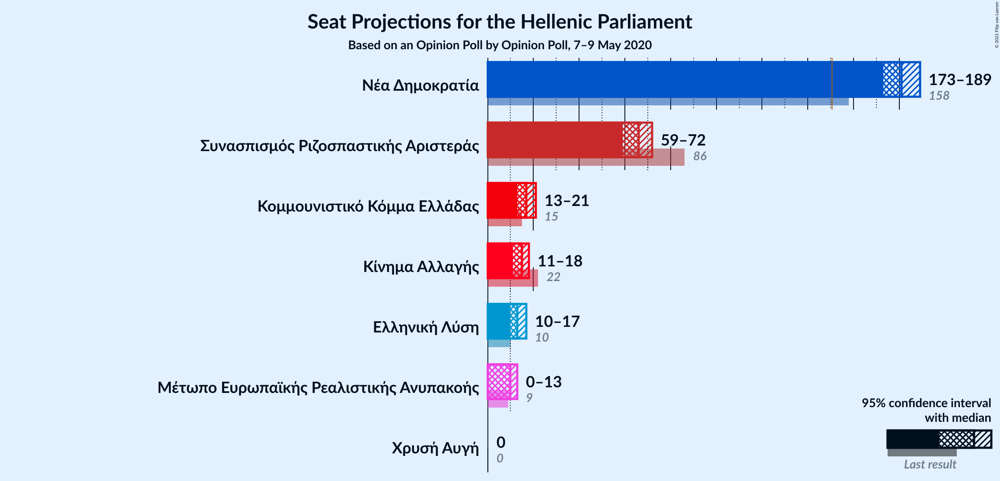
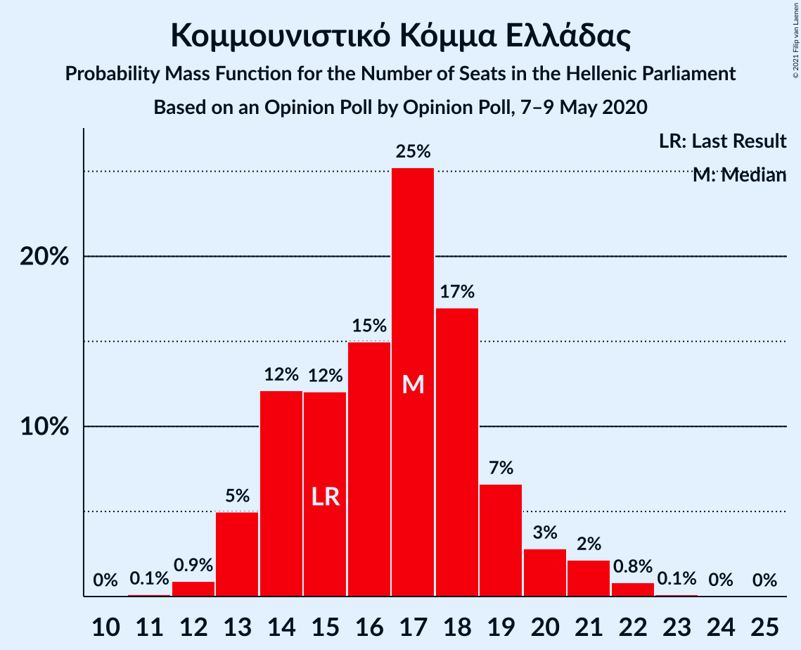
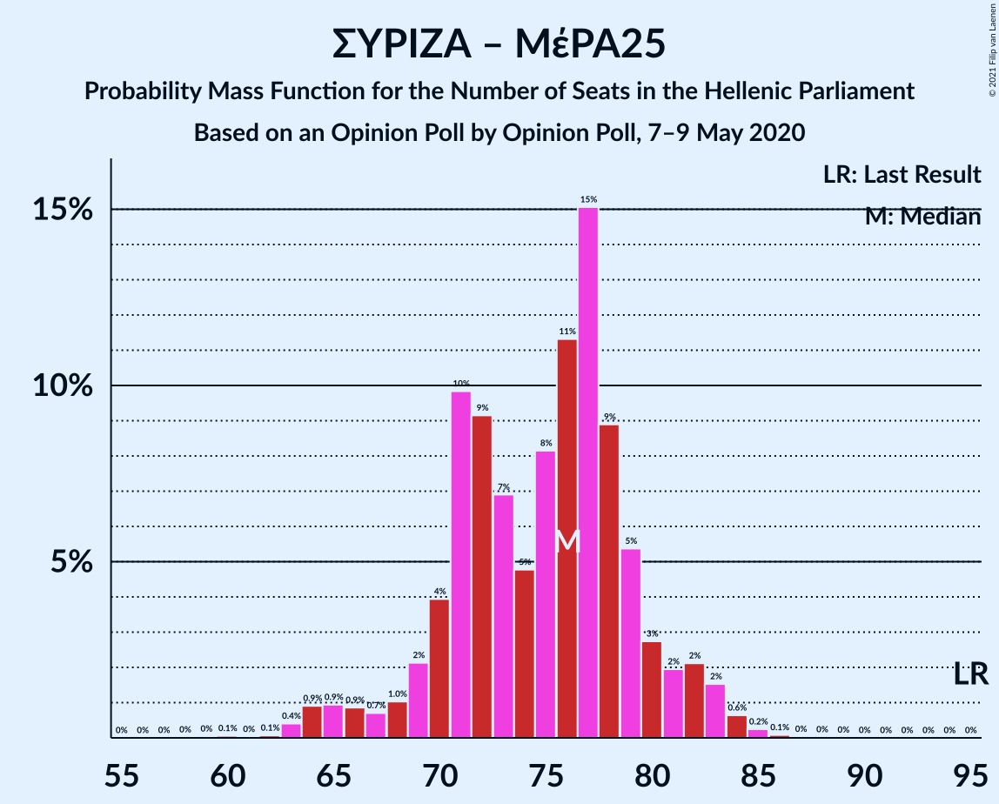

# Opinion Poll by Opinion Poll, 7–9 May 2020

<a href="#voting-intentions">Voting Intentions</a> | <a href="#seats">Seats</a> | <a href="#coalitions">Coalitions</a> | <a href="#technical-information">Technical Information</a>

## Voting Intentions

### Confidence Intervals

| Party | Last Result | Poll Result | 80% Confidence Interval | 90% Confidence Interval | 95% Confidence Interval | 99% Confidence Interval |
|:-----:|:-----------:|:-----------:|:-----------------------:|:-----------------------:|:-----------------------:|:-----------------------:|
| Νέα Δημοκρατία | 39.8% | 50.4% | 48.4–52.3% |47.9–52.9% |47.4–53.4% |46.5–54.3% |
| Συνασπισμός Ριζοσπαστικής Αριστεράς | 31.5% | 25.1% | 23.5–26.8% |23.0–27.3% |22.6–27.8% |21.8–28.6% |
| Κομμουνιστικό Κόμμα Ελλάδας | 5.3% | 6.3% | 5.4–7.3% |5.2–7.7% |5.0–7.9% |4.6–8.4% |
| Κίνημα Αλλαγής | 8.1% | 5.6% | 4.8–6.6% |4.5–6.8% |4.3–7.1% |4.0–7.6% |
| Ελληνική Λύση | 3.7% | 5.0% | 4.2–6.0% |4.0–6.2% |3.8–6.5% |3.5–7.0% |
| Μέτωπο Ευρωπαϊκής Ρεαλιστικής Ανυπακοής | 3.4% | 3.8% | 3.1–4.7% |3.0–4.9% |2.8–5.1% |2.5–5.6% |
| Χρυσή Αυγή | 2.9% | 1.4% | 1.0–2.0% |0.9–2.1% |0.8–2.3% |0.7–2.6% |

*Note:* The poll result column reflects the actual value used in the calculations. Published results may vary slightly, and in addition be rounded to fewer digits.

## Seats

### Confidence Intervals

| Party | Last Result | Median | 80% Confidence Interval | 90% Confidence Interval | 95% Confidence Interval | 99% Confidence Interval |
|:-----:|:-----------:|:------:|:-----------------------:|:-----------------------:|:-----------------------:|:-----------------------:|
| <a href="#νέα-δημοκρατία">Νέα Δημοκρατία</a> | 158 | 181 | 176–186 |174–188 |173–189 |170–192 |
| <a href="#συνασπισμός-ριζοσπαστικής-αριστεράς">Συνασπισμός Ριζοσπαστικής Αριστεράς</a> | 86 | 66 | 61–69 |60–71 |59–72 |56–74 |
| <a href="#κομμουνιστικό-κόμμα-ελλάδας">Κομμουνιστικό Κόμμα Ελλάδας</a> | 15 | 17 | 14–19 |13–20 |13–21 |12–22 |
| <a href="#κίνημα-αλλαγής">Κίνημα Αλλαγής</a> | 22 | 15 | 12–17 |12–18 |11–18 |10–20 |
| <a href="#ελληνική-λύση">Ελληνική Λύση</a> | 10 | 13 | 11–16 |10–16 |10–17 |9–18 |
| <a href="#μέτωπο-ευρωπαϊκής-ρεαλιστικής-ανυπακοής">Μέτωπο Ευρωπαϊκής Ρεαλιστικής Ανυπακοής</a> | 9 | 10 | 8–12 |0–13 |0–13 |0–14 |
| <a href="#χρυσή-αυγή">Χρυσή Αυγή</a> | 0 | 0 | 0 |0 |0 |0 |

### Νέα Δημοκρατία

*For a full overview of the results for this party, see the [Νέα Δημοκρατία](party-νέαδημοκρατία.html) page.*

| Number of Seats | Probability | Accumulated | Special Marks |
|:---------------:|:-----------:|:-----------:|:-------------:|
| 158 | 0% | 100% | Last Result |
| 159 | 0% | 100% |  |
| 160 | 0% | 100% |  |
| 161 | 0% | 100% |  |
| 162 | 0% | 100% |  |
| 163 | 0% | 100% |  |
| 164 | 0% | 100% |  |
| 165 | 0% | 100% |  |
| 166 | 0% | 100% |  |
| 167 | 0% | 100% |  |
| 168 | 0.1% | 100% |  |
| 169 | 0.1% | 99.9% |  |
| 170 | 0.3% | 99.8% |  |
| 171 | 0.6% | 99.5% |  |
| 172 | 0.9% | 98.9% |  |
| 173 | 2% | 98% |  |
| 174 | 2% | 96% |  |
| 175 | 3% | 94% |  |
| 176 | 4% | 91% |  |
| 177 | 7% | 87% |  |
| 178 | 11% | 80% |  |
| 179 | 11% | 69% |  |
| 180 | 7% | 58% |  |
| 181 | 10% | 51% | Median |
| 182 | 7% | 41% |  |
| 183 | 8% | 34% |  |
| 184 | 7% | 26% |  |
| 185 | 6% | 19% |  |
| 186 | 5% | 13% |  |
| 187 | 3% | 8% |  |
| 188 | 2% | 5% |  |
| 189 | 1.4% | 3% |  |
| 190 | 0.8% | 2% |  |
| 191 | 0.5% | 1.3% |  |
| 192 | 0.4% | 0.8% |  |
| 193 | 0.2% | 0.4% |  |
| 194 | 0.1% | 0.2% |  |
| 195 | 0% | 0.1% |  |
| 196 | 0% | 0.1% |  |
| 197 | 0% | 0% |  |

### Συνασπισμός Ριζοσπαστικής Αριστεράς

*For a full overview of the results for this party, see the [Συνασπισμός Ριζοσπαστικής Αριστεράς](party-συνασπισμόςριζοσπαστικήςαριστεράς.html) page.*

| Number of Seats | Probability | Accumulated | Special Marks |
|:---------------:|:-----------:|:-----------:|:-------------:|
| 55 | 0.2% | 100% |  |
| 56 | 0.5% | 99.8% |  |
| 57 | 0.6% | 99.3% |  |
| 58 | 0.5% | 98.7% |  |
| 59 | 1.1% | 98% |  |
| 60 | 4% | 97% |  |
| 61 | 9% | 93% |  |
| 62 | 11% | 85% |  |
| 63 | 8% | 73% |  |
| 64 | 4% | 66% |  |
| 65 | 7% | 62% |  |
| 66 | 16% | 55% | Median |
| 67 | 16% | 39% |  |
| 68 | 9% | 23% |  |
| 69 | 3% | 13% |  |
| 70 | 2% | 10% |  |
| 71 | 3% | 8% |  |
| 72 | 2% | 4% |  |
| 73 | 1.4% | 2% |  |
| 74 | 0.5% | 0.9% |  |
| 75 | 0.2% | 0.5% |  |
| 76 | 0.1% | 0.3% |  |
| 77 | 0.1% | 0.1% |  |
| 78 | 0% | 0% |  |
| 79 | 0% | 0% |  |
| 80 | 0% | 0% |  |
| 81 | 0% | 0% |  |
| 82 | 0% | 0% |  |
| 83 | 0% | 0% |  |
| 84 | 0% | 0% |  |
| 85 | 0% | 0% |  |
| 86 | 0% | 0% | Last Result |

### Κομμουνιστικό Κόμμα Ελλάδας

*For a full overview of the results for this party, see the [Κομμουνιστικό Κόμμα Ελλάδας](party-κομμουνιστικόκόμμαελλάδας.html) page.*

| Number of Seats | Probability | Accumulated | Special Marks |
|:---------------:|:-----------:|:-----------:|:-------------:|
| 11 | 0.1% | 100% |  |
| 12 | 0.9% | 99.8% |  |
| 13 | 5% | 98.9% |  |
| 14 | 12% | 94% |  |
| 15 | 12% | 82% | Last Result |
| 16 | 15% | 70% |  |
| 17 | 25% | 55% | Median |
| 18 | 17% | 30% |  |
| 19 | 7% | 13% |  |
| 20 | 3% | 6% |  |
| 21 | 2% | 3% |  |
| 22 | 0.8% | 1.0% |  |
| 23 | 0.1% | 0.2% |  |
| 24 | 0% | 0.1% |  |
| 25 | 0% | 0% |  |

### Κίνημα Αλλαγής

*For a full overview of the results for this party, see the [Κίνημα Αλλαγής](party-κίνημααλλαγής.html) page.*

| Number of Seats | Probability | Accumulated | Special Marks |
|:---------------:|:-----------:|:-----------:|:-------------:|
| 9 | 0.1% | 100% |  |
| 10 | 0.7% | 99.9% |  |
| 11 | 2% | 99.2% |  |
| 12 | 9% | 97% |  |
| 13 | 14% | 88% |  |
| 14 | 22% | 74% |  |
| 15 | 20% | 52% | Median |
| 16 | 17% | 32% |  |
| 17 | 8% | 15% |  |
| 18 | 4% | 7% |  |
| 19 | 1.5% | 2% |  |
| 20 | 0.6% | 0.7% |  |
| 21 | 0.1% | 0.2% |  |
| 22 | 0% | 0% | Last Result |

### Ελληνική Λύση

*For a full overview of the results for this party, see the [Ελληνική Λύση](party-ελληνικήλύση.html) page.*

| Number of Seats | Probability | Accumulated | Special Marks |
|:---------------:|:-----------:|:-----------:|:-------------:|
| 8 | 0.1% | 100% |  |
| 9 | 0.8% | 99.9% |  |
| 10 | 4% | 99.1% | Last Result |
| 11 | 12% | 95% |  |
| 12 | 19% | 83% |  |
| 13 | 22% | 64% | Median |
| 14 | 20% | 42% |  |
| 15 | 12% | 22% |  |
| 16 | 6% | 10% |  |
| 17 | 3% | 4% |  |
| 18 | 0.8% | 1.1% |  |
| 19 | 0.2% | 0.3% |  |
| 20 | 0% | 0.1% |  |
| 21 | 0% | 0% |  |

### Μέτωπο Ευρωπαϊκής Ρεαλιστικής Ανυπακοής

*For a full overview of the results for this party, see the [Μέτωπο Ευρωπαϊκής Ρεαλιστικής Ανυπακοής](party-μέτωποευρωπαϊκήςρεαλιστικήςανυπακοής.html) page.*

| Number of Seats | Probability | Accumulated | Special Marks |
|:---------------:|:-----------:|:-----------:|:-------------:|
| 0 | 6% | 100% |  |
| 1 | 0% | 94% |  |
| 2 | 0% | 94% |  |
| 3 | 0% | 94% |  |
| 4 | 0% | 94% |  |
| 5 | 0% | 94% |  |
| 6 | 0% | 94% |  |
| 7 | 0% | 94% |  |
| 8 | 9% | 94% |  |
| 9 | 22% | 85% | Last Result |
| 10 | 26% | 63% | Median |
| 11 | 20% | 37% |  |
| 12 | 11% | 17% |  |
| 13 | 4% | 6% |  |
| 14 | 1.3% | 2% |  |
| 15 | 0.3% | 0.4% |  |
| 16 | 0.1% | 0.1% |  |
| 17 | 0% | 0% |  |

### Χρυσή Αυγή

*For a full overview of the results for this party, see the [Χρυσή Αυγή](party-χρυσήαυγή.html) page.*

| Number of Seats | Probability | Accumulated | Special Marks |
|:---------------:|:-----------:|:-----------:|:-------------:|
| 0 | 100% | 100% | Last Result, Median |

## Coalitions

### Confidence Intervals

| Coalition | Last Result | Median | Majority? | 80% Confidence Interval | 90% Confidence Interval | 95% Confidence Interval | 99% Confidence Interval |
|:---------:|:-----------:|:------:|:---------:|:-----------------------:|:-----------------------:|:-----------------------:|:-----------------------:|
| Νέα Δημοκρατία – Κίνημα Αλλαγής | 180 | 195 | 100% | 191–200 | 189–202 | 187–204 | 185–207 |
| Νέα Δημοκρατία | 158 | 181 | 100% | 176–186 | 174–188 | 173–189 | 170–192 |
| Συνασπισμός Ριζοσπαστικής Αριστεράς – Μέτωπο Ευρωπαϊκής Ρεαλιστικής Ανυπακοής | 95 | 76 | 0% | 70–79 | 68–81 | 66–83 | 63–84 |
| Συνασπισμός Ριζοσπαστικής Αριστεράς | 86 | 66 | 0% | 61–69 | 60–71 | 59–72 | 56–74 |

### Νέα Δημοκρατία – Κίνημα Αλλαγής

| Number of Seats | Probability | Accumulated | Special Marks |
|:---------------:|:-----------:|:-----------:|:-------------:|
| 180 | 0% | 100% | Last Result |
| 181 | 0% | 100% |  |
| 182 | 0% | 100% |  |
| 183 | 0.1% | 99.9% |  |
| 184 | 0.2% | 99.9% |  |
| 185 | 0.4% | 99.7% |  |
| 186 | 0.8% | 99.3% |  |
| 187 | 1.3% | 98.5% |  |
| 188 | 2% | 97% |  |
| 189 | 2% | 96% |  |
| 190 | 3% | 93% |  |
| 191 | 5% | 90% |  |
| 192 | 8% | 85% |  |
| 193 | 12% | 77% |  |
| 194 | 12% | 65% |  |
| 195 | 8% | 54% |  |
| 196 | 8% | 46% | Median |
| 197 | 6% | 38% |  |
| 198 | 8% | 33% |  |
| 199 | 8% | 25% |  |
| 200 | 6% | 16% |  |
| 201 | 4% | 10% |  |
| 202 | 2% | 6% |  |
| 203 | 1.1% | 4% |  |
| 204 | 1.3% | 3% |  |
| 205 | 0.7% | 2% |  |
| 206 | 0.7% | 1.3% |  |
| 207 | 0.3% | 0.6% |  |
| 208 | 0.1% | 0.3% |  |
| 209 | 0.1% | 0.2% |  |
| 210 | 0.1% | 0.1% |  |
| 211 | 0% | 0.1% |  |
| 212 | 0% | 0% |  |

### Νέα Δημοκρατία

| Number of Seats | Probability | Accumulated | Special Marks |
|:---------------:|:-----------:|:-----------:|:-------------:|
| 158 | 0% | 100% | Last Result |
| 159 | 0% | 100% |  |
| 160 | 0% | 100% |  |
| 161 | 0% | 100% |  |
| 162 | 0% | 100% |  |
| 163 | 0% | 100% |  |
| 164 | 0% | 100% |  |
| 165 | 0% | 100% |  |
| 166 | 0% | 100% |  |
| 167 | 0% | 100% |  |
| 168 | 0.1% | 100% |  |
| 169 | 0.1% | 99.9% |  |
| 170 | 0.3% | 99.8% |  |
| 171 | 0.6% | 99.5% |  |
| 172 | 0.9% | 98.9% |  |
| 173 | 2% | 98% |  |
| 174 | 2% | 96% |  |
| 175 | 3% | 94% |  |
| 176 | 4% | 91% |  |
| 177 | 7% | 87% |  |
| 178 | 11% | 80% |  |
| 179 | 11% | 69% |  |
| 180 | 7% | 58% |  |
| 181 | 10% | 51% | Median |
| 182 | 7% | 41% |  |
| 183 | 8% | 34% |  |
| 184 | 7% | 26% |  |
| 185 | 6% | 19% |  |
| 186 | 5% | 13% |  |
| 187 | 3% | 8% |  |
| 188 | 2% | 5% |  |
| 189 | 1.4% | 3% |  |
| 190 | 0.8% | 2% |  |
| 191 | 0.5% | 1.3% |  |
| 192 | 0.4% | 0.8% |  |
| 193 | 0.2% | 0.4% |  |
| 194 | 0.1% | 0.2% |  |
| 195 | 0% | 0.1% |  |
| 196 | 0% | 0.1% |  |
| 197 | 0% | 0% |  |

### Συνασπισμός Ριζοσπαστικής Αριστεράς – Μέτωπο Ευρωπαϊκής Ρεαλιστικής Ανυπακοής

| Number of Seats | Probability | Accumulated | Special Marks |
|:---------------:|:-----------:|:-----------:|:-------------:|
| 59 | 0% | 100% |  |
| 60 | 0.1% | 99.9% |  |
| 61 | 0% | 99.9% |  |
| 62 | 0.1% | 99.8% |  |
| 63 | 0.4% | 99.8% |  |
| 64 | 0.9% | 99.4% |  |
| 65 | 0.9% | 98% |  |
| 66 | 0.9% | 98% |  |
| 67 | 0.7% | 97% |  |
| 68 | 1.0% | 96% |  |
| 69 | 2% | 95% |  |
| 70 | 4% | 93% |  |
| 71 | 10% | 89% |  |
| 72 | 9% | 79% |  |
| 73 | 7% | 70% |  |
| 74 | 5% | 63% |  |
| 75 | 8% | 58% |  |
| 76 | 11% | 50% | Median |
| 77 | 15% | 39% |  |
| 78 | 9% | 24% |  |
| 79 | 5% | 15% |  |
| 80 | 3% | 9% |  |
| 81 | 2% | 7% |  |
| 82 | 2% | 5% |  |
| 83 | 2% | 3% |  |
| 84 | 0.6% | 1.0% |  |
| 85 | 0.2% | 0.4% |  |
| 86 | 0.1% | 0.2% |  |
| 87 | 0% | 0.1% |  |
| 88 | 0% | 0% |  |
| 89 | 0% | 0% |  |
| 90 | 0% | 0% |  |
| 91 | 0% | 0% |  |
| 92 | 0% | 0% |  |
| 93 | 0% | 0% |  |
| 94 | 0% | 0% |  |
| 95 | 0% | 0% | Last Result |

### Συνασπισμός Ριζοσπαστικής Αριστεράς

| Number of Seats | Probability | Accumulated | Special Marks |
|:---------------:|:-----------:|:-----------:|:-------------:|
| 55 | 0.2% | 100% |  |
| 56 | 0.5% | 99.8% |  |
| 57 | 0.6% | 99.3% |  |
| 58 | 0.5% | 98.7% |  |
| 59 | 1.1% | 98% |  |
| 60 | 4% | 97% |  |
| 61 | 9% | 93% |  |
| 62 | 11% | 85% |  |
| 63 | 8% | 73% |  |
| 64 | 4% | 66% |  |
| 65 | 7% | 62% |  |
| 66 | 16% | 55% | Median |
| 67 | 16% | 39% |  |
| 68 | 9% | 23% |  |
| 69 | 3% | 13% |  |
| 70 | 2% | 10% |  |
| 71 | 3% | 8% |  |
| 72 | 2% | 4% |  |
| 73 | 1.4% | 2% |  |
| 74 | 0.5% | 0.9% |  |
| 75 | 0.2% | 0.5% |  |
| 76 | 0.1% | 0.3% |  |
| 77 | 0.1% | 0.1% |  |
| 78 | 0% | 0% |  |
| 79 | 0% | 0% |  |
| 80 | 0% | 0% |  |
| 81 | 0% | 0% |  |
| 82 | 0% | 0% |  |
| 83 | 0% | 0% |  |
| 84 | 0% | 0% |  |
| 85 | 0% | 0% |  |
| 86 | 0% | 0% | Last Result |

## Technical Information

### Opinion Poll

+ **Polling firm:** Opinion Poll
+ **Commissioner(s):** —
+ **Fieldwork period:** 7–9 May 2020

### Calculations

+ **Sample size:** 1080
+ **Simulations done:** 1,048,576
+ **Error estimate:** 0.47%

