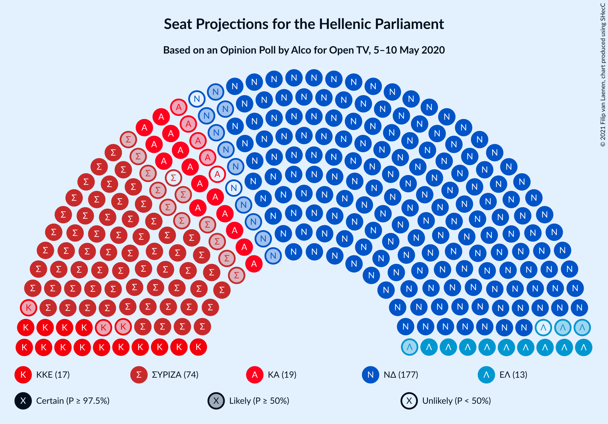
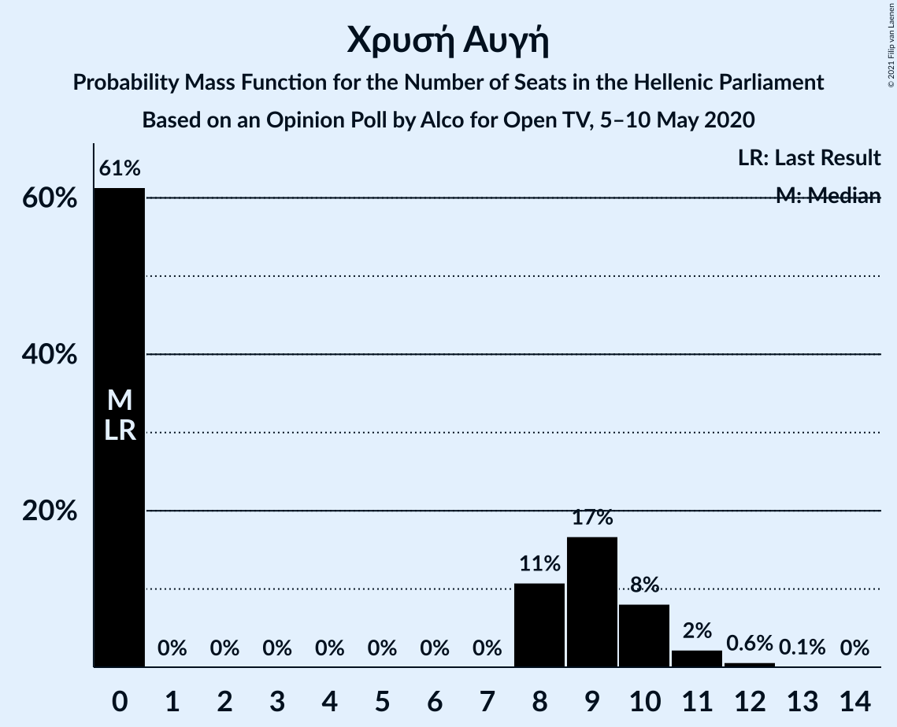
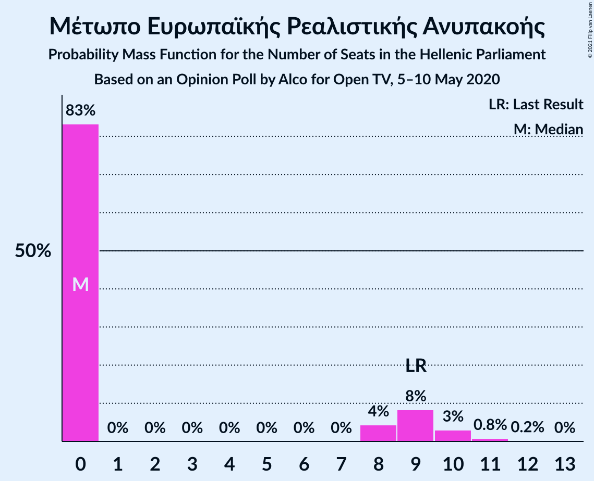
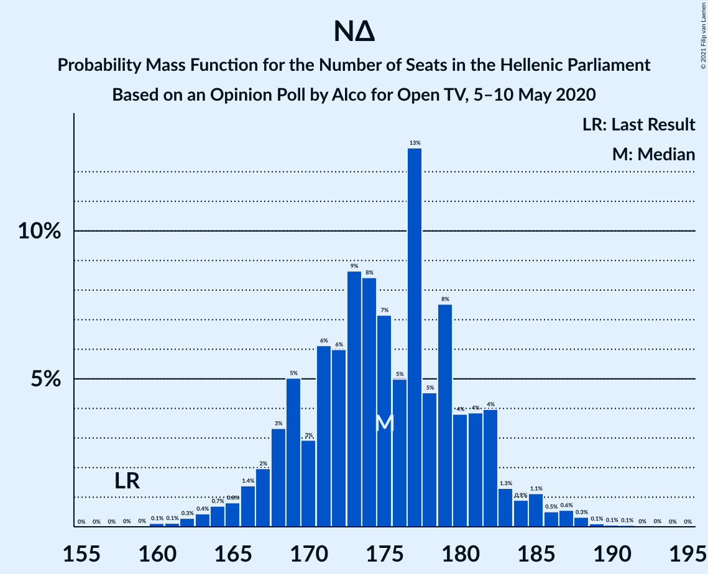

# Opinion Poll by Alco for Open TV, 5–10 May 2020

<a href="#voting-intentions">Voting Intentions</a> | <a href="#seats">Seats</a> | <a href="#coalitions">Coalitions</a> | <a href="#technical-information">Technical Information</a>

## Voting Intentions

### Confidence Intervals

| Party | Last Result | Poll Result | 80% Confidence Interval | 90% Confidence Interval | 95% Confidence Interval | 99% Confidence Interval |
|:-----:|:-----------:|:-----------:|:-----------------------:|:-----------------------:|:-----------------------:|:-----------------------:|
| Νέα Δημοκρατία | 39.8% | 46.2% | 44.2–48.2% |43.6–48.8% |43.1–49.3% |42.2–50.3% |
| Συνασπισμός Ριζοσπαστικής Αριστεράς | 31.5% | 26.1% | 24.4–27.9% |23.9–28.5% |23.5–28.9% |22.7–29.8% |
| Κίνημα Αλλαγής | 8.1% | 6.8% | 5.9–7.9% |5.6–8.3% |5.4–8.5% |5.0–9.1% |
| Κομμουνιστικό Κόμμα Ελλάδας | 5.3% | 6.4% | 5.5–7.5% |5.3–7.8% |5.0–8.1% |4.6–8.7% |
| Ελληνική Λύση | 3.7% | 4.4% | 3.7–5.3% |3.5–5.6% |3.3–5.9% |3.0–6.4% |
| Χρυσή Αυγή | 2.9% | 2.8% | 2.2–3.6% |2.1–3.8% |1.9–4.0% |1.7–4.4% |
| Μέτωπο Ευρωπαϊκής Ρεαλιστικής Ανυπακοής | 3.4% | 2.5% | 2.0–3.3% |1.8–3.5% |1.7–3.7% |1.5–4.1% |
| Πλεύση Ελευθερίας | 1.5% | 1.5% | 1.1–2.1% |1.0–2.3% |0.9–2.5% |0.7–2.8% |

*Note:* The poll result column reflects the actual value used in the calculations. Published results may vary slightly, and in addition be rounded to fewer digits.

## Seats

### Confidence Intervals

| Party | Last Result | Median | 80% Confidence Interval | 90% Confidence Interval | 95% Confidence Interval | 99% Confidence Interval |
|:-----:|:-----------:|:------:|:-----------------------:|:-----------------------:|:-----------------------:|:-----------------------:|
| <a href="#νέα-δημοκρατία">Νέα Δημοκρατία</a> | 158 | 175 | 169–181 |167–182 |165–185 |162–188 |
| <a href="#συνασπισμός-ριζοσπαστικής-αριστεράς">Συνασπισμός Ριζοσπαστικής Αριστεράς</a> | 86 | 73 | 65–78 |63–79 |62–80 |60–82 |
| <a href="#κίνημα-αλλαγής">Κίνημα Αλλαγής</a> | 22 | 18 | 16–21 |15–23 |14–23 |13–25 |
| <a href="#κομμουνιστικό-κόμμα-ελλάδας">Κομμουνιστικό Κόμμα Ελλάδας</a> | 15 | 17 | 15–20 |14–21 |14–22 |12–24 |
| <a href="#ελληνική-λύση">Ελληνική Λύση</a> | 10 | 12 | 10–14 |9–15 |9–16 |0–17 |
| <a href="#χρυσή-αυγή">Χρυσή Αυγή</a> | 0 | 0 | 0–10 |0–10 |0–11 |0–12 |
| <a href="#μέτωπο-ευρωπαϊκής-ρεαλιστικής-ανυπακοής">Μέτωπο Ευρωπαϊκής Ρεαλιστικής Ανυπακοής</a> | 9 | 0 | 0–9 |0–9 |0–10 |0–11 |
| <a href="#πλεύση-ελευθερίας">Πλεύση Ελευθερίας</a> | 0 | 0 | 0 |0 |0 |0 |

### Νέα Δημοκρατία

*For a full overview of the results for this party, see the [Νέα Δημοκρατία](party-νέαδημοκρατία.html) page.*

| Number of Seats | Probability | Accumulated | Special Marks |
|:---------------:|:-----------:|:-----------:|:-------------:|
| 158 | 0% | 100% | Last Result |
| 159 | 0% | 100% |  |
| 160 | 0.1% | 99.9% |  |
| 161 | 0.1% | 99.8% |  |
| 162 | 0.3% | 99.7% |  |
| 163 | 0.4% | 99.4% |  |
| 164 | 0.7% | 99.0% |  |
| 165 | 0.8% | 98% |  |
| 166 | 1.4% | 97% |  |
| 167 | 2% | 96% |  |
| 168 | 3% | 94% |  |
| 169 | 5% | 91% |  |
| 170 | 3% | 86% |  |
| 171 | 6% | 83% |  |
| 172 | 6% | 77% |  |
| 173 | 9% | 71% |  |
| 174 | 8% | 62% |  |
| 175 | 7% | 54% | Median |
| 176 | 5% | 46% |  |
| 177 | 13% | 41% |  |
| 178 | 5% | 29% |  |
| 179 | 8% | 24% |  |
| 180 | 4% | 17% |  |
| 181 | 4% | 13% |  |
| 182 | 4% | 9% |  |
| 183 | 1.3% | 5% |  |
| 184 | 0.9% | 4% |  |
| 185 | 1.1% | 3% |  |
| 186 | 0.5% | 2% |  |
| 187 | 0.6% | 1.1% |  |
| 188 | 0.3% | 0.6% |  |
| 189 | 0.1% | 0.3% |  |
| 190 | 0.1% | 0.1% |  |
| 191 | 0.1% | 0.1% |  |
| 192 | 0% | 0% |  |

### Συνασπισμός Ριζοσπαστικής Αριστεράς

*For a full overview of the results for this party, see the [Συνασπισμός Ριζοσπαστικής Αριστεράς](party-συνασπισμόςριζοσπαστικήςαριστεράς.html) page.*

| Number of Seats | Probability | Accumulated | Special Marks |
|:---------------:|:-----------:|:-----------:|:-------------:|
| 58 | 0.1% | 100% |  |
| 59 | 0.2% | 99.9% |  |
| 60 | 0.4% | 99.7% |  |
| 61 | 0.8% | 99.3% |  |
| 62 | 2% | 98% |  |
| 63 | 2% | 97% |  |
| 64 | 3% | 94% |  |
| 65 | 5% | 92% |  |
| 66 | 5% | 87% |  |
| 67 | 4% | 83% |  |
| 68 | 3% | 78% |  |
| 69 | 5% | 75% |  |
| 70 | 6% | 71% |  |
| 71 | 8% | 65% |  |
| 72 | 5% | 58% |  |
| 73 | 9% | 53% | Median |
| 74 | 10% | 44% |  |
| 75 | 10% | 34% |  |
| 76 | 7% | 25% |  |
| 77 | 5% | 17% |  |
| 78 | 7% | 12% |  |
| 79 | 2% | 6% |  |
| 80 | 2% | 3% |  |
| 81 | 1.0% | 2% |  |
| 82 | 0.4% | 0.7% |  |
| 83 | 0.2% | 0.3% |  |
| 84 | 0% | 0.1% |  |
| 85 | 0% | 0% |  |
| 86 | 0% | 0% | Last Result |

### Κίνημα Αλλαγής

*For a full overview of the results for this party, see the [Κίνημα Αλλαγής](party-κίνημααλλαγής.html) page.*

| Number of Seats | Probability | Accumulated | Special Marks |
|:---------------:|:-----------:|:-----------:|:-------------:|
| 12 | 0.1% | 100% |  |
| 13 | 0.6% | 99.9% |  |
| 14 | 2% | 99.3% |  |
| 15 | 5% | 97% |  |
| 16 | 14% | 92% |  |
| 17 | 16% | 78% |  |
| 18 | 17% | 62% | Median |
| 19 | 17% | 45% |  |
| 20 | 11% | 28% |  |
| 21 | 7% | 17% |  |
| 22 | 5% | 10% | Last Result |
| 23 | 3% | 5% |  |
| 24 | 1.2% | 2% |  |
| 25 | 0.7% | 1.0% |  |
| 26 | 0.2% | 0.4% |  |
| 27 | 0.1% | 0.1% |  |
| 28 | 0% | 0% |  |

### Κομμουνιστικό Κόμμα Ελλάδας

*For a full overview of the results for this party, see the [Κομμουνιστικό Κόμμα Ελλάδας](party-κομμουνιστικόκόμμαελλάδας.html) page.*

| Number of Seats | Probability | Accumulated | Special Marks |
|:---------------:|:-----------:|:-----------:|:-------------:|
| 11 | 0.1% | 100% |  |
| 12 | 0.5% | 99.9% |  |
| 13 | 1.5% | 99.4% |  |
| 14 | 4% | 98% |  |
| 15 | 10% | 94% | Last Result |
| 16 | 15% | 84% |  |
| 17 | 19% | 68% | Median |
| 18 | 16% | 49% |  |
| 19 | 17% | 33% |  |
| 20 | 8% | 16% |  |
| 21 | 5% | 8% |  |
| 22 | 2% | 4% |  |
| 23 | 0.8% | 1.4% |  |
| 24 | 0.4% | 0.6% |  |
| 25 | 0.1% | 0.2% |  |
| 26 | 0% | 0% |  |

### Ελληνική Λύση

*For a full overview of the results for this party, see the [Ελληνική Λύση](party-ελληνικήλύση.html) page.*

| Number of Seats | Probability | Accumulated | Special Marks |
|:---------------:|:-----------:|:-----------:|:-------------:|
| 0 | 0.7% | 100% |  |
| 1 | 0% | 99.3% |  |
| 2 | 0% | 99.3% |  |
| 3 | 0% | 99.3% |  |
| 4 | 0% | 99.3% |  |
| 5 | 0% | 99.3% |  |
| 6 | 0% | 99.3% |  |
| 7 | 0% | 99.3% |  |
| 8 | 0.7% | 99.3% |  |
| 9 | 4% | 98.6% |  |
| 10 | 13% | 94% | Last Result |
| 11 | 21% | 81% |  |
| 12 | 18% | 60% | Median |
| 13 | 19% | 42% |  |
| 14 | 13% | 23% |  |
| 15 | 7% | 10% |  |
| 16 | 2% | 3% |  |
| 17 | 1.0% | 1.3% |  |
| 18 | 0.3% | 0.4% |  |
| 19 | 0.1% | 0.1% |  |
| 20 | 0% | 0% |  |

### Χρυσή Αυγή

*For a full overview of the results for this party, see the [Χρυσή Αυγή](party-χρυσήαυγή.html) page.*

| Number of Seats | Probability | Accumulated | Special Marks |
|:---------------:|:-----------:|:-----------:|:-------------:|
| 0 | 61% | 100% | Last Result, Median |
| 1 | 0% | 39% |  |
| 2 | 0% | 39% |  |
| 3 | 0% | 39% |  |
| 4 | 0% | 39% |  |
| 5 | 0% | 39% |  |
| 6 | 0% | 39% |  |
| 7 | 0% | 39% |  |
| 8 | 11% | 39% |  |
| 9 | 17% | 28% |  |
| 10 | 8% | 11% |  |
| 11 | 2% | 3% |  |
| 12 | 0.6% | 0.8% |  |
| 13 | 0.1% | 0.1% |  |
| 14 | 0% | 0% |  |

### Μέτωπο Ευρωπαϊκής Ρεαλιστικής Ανυπακοής

*For a full overview of the results for this party, see the [Μέτωπο Ευρωπαϊκής Ρεαλιστικής Ανυπακοής](party-μέτωποευρωπαϊκήςρεαλιστικήςανυπακοής.html) page.*

| Number of Seats | Probability | Accumulated | Special Marks |
|:---------------:|:-----------:|:-----------:|:-------------:|
| 0 | 83% | 100% | Median |
| 1 | 0% | 17% |  |
| 2 | 0% | 17% |  |
| 3 | 0% | 17% |  |
| 4 | 0% | 17% |  |
| 5 | 0% | 17% |  |
| 6 | 0% | 17% |  |
| 7 | 0% | 17% |  |
| 8 | 4% | 17% |  |
| 9 | 8% | 12% | Last Result |
| 10 | 3% | 4% |  |
| 11 | 0.8% | 1.0% |  |
| 12 | 0.2% | 0.2% |  |
| 13 | 0% | 0% |  |

### Πλεύση Ελευθερίας

*For a full overview of the results for this party, see the [Πλεύση Ελευθερίας](party-πλεύσηελευθερίας.html) page.*

| Number of Seats | Probability | Accumulated | Special Marks |
|:---------------:|:-----------:|:-----------:|:-------------:|
| 0 | 99.8% | 100% | Last Result, Median |
| 1 | 0% | 0.2% |  |
| 2 | 0% | 0.2% |  |
| 3 | 0% | 0.2% |  |
| 4 | 0% | 0.2% |  |
| 5 | 0% | 0.2% |  |
| 6 | 0% | 0.2% |  |
| 7 | 0% | 0.2% |  |
| 8 | 0.1% | 0.2% |  |
| 9 | 0.1% | 0.1% |  |
| 10 | 0% | 0% |  |

## Coalitions

### Confidence Intervals

| Coalition | Last Result | Median | Majority? | 80% Confidence Interval | 90% Confidence Interval | 95% Confidence Interval | 99% Confidence Interval |
|:---------:|:-----------:|:------:|:---------:|:-----------------------:|:-----------------------:|:-----------------------:|:-----------------------:|
| Νέα Δημοκρατία – Κίνημα Αλλαγής | 180 | 194 | 100% | 187–200 | 185–203 | 184–204 | 180–208 |
| Νέα Δημοκρατία | 158 | 175 | 100% | 169–181 | 167–182 | 165–185 | 162–188 |
| Συνασπισμός Ριζοσπαστικής Αριστεράς – Μέτωπο Ευρωπαϊκής Ρεαλιστικής Ανυπακοής | 95 | 74 | 0% | 66–79 | 65–81 | 63–83 | 61–86 |
| Συνασπισμός Ριζοσπαστικής Αριστεράς | 86 | 73 | 0% | 65–78 | 63–79 | 62–80 | 60–82 |

### Νέα Δημοκρατία – Κίνημα Αλλαγής

| Number of Seats | Probability | Accumulated | Special Marks |
|:---------------:|:-----------:|:-----------:|:-------------:|
| 177 | 0% | 100% |  |
| 178 | 0.1% | 99.9% |  |
| 179 | 0.2% | 99.8% |  |
| 180 | 0.3% | 99.6% | Last Result |
| 181 | 0.4% | 99.3% |  |
| 182 | 0.6% | 98.9% |  |
| 183 | 0.6% | 98% |  |
| 184 | 3% | 98% |  |
| 185 | 1.5% | 95% |  |
| 186 | 3% | 94% |  |
| 187 | 4% | 91% |  |
| 188 | 5% | 87% |  |
| 189 | 5% | 83% |  |
| 190 | 6% | 77% |  |
| 191 | 6% | 71% |  |
| 192 | 6% | 65% |  |
| 193 | 8% | 59% | Median |
| 194 | 14% | 52% |  |
| 195 | 9% | 37% |  |
| 196 | 3% | 28% |  |
| 197 | 3% | 25% |  |
| 198 | 5% | 22% |  |
| 199 | 7% | 17% |  |
| 200 | 3% | 10% |  |
| 201 | 0.9% | 7% |  |
| 202 | 1.0% | 6% |  |
| 203 | 1.3% | 5% |  |
| 204 | 2% | 4% |  |
| 205 | 0.7% | 2% |  |
| 206 | 0.2% | 1.1% |  |
| 207 | 0.2% | 0.9% |  |
| 208 | 0.3% | 0.6% |  |
| 209 | 0.2% | 0.3% |  |
| 210 | 0.1% | 0.1% |  |
| 211 | 0% | 0% |  |

### Νέα Δημοκρατία

| Number of Seats | Probability | Accumulated | Special Marks |
|:---------------:|:-----------:|:-----------:|:-------------:|
| 158 | 0% | 100% | Last Result |
| 159 | 0% | 100% |  |
| 160 | 0.1% | 99.9% |  |
| 161 | 0.1% | 99.8% |  |
| 162 | 0.3% | 99.7% |  |
| 163 | 0.4% | 99.4% |  |
| 164 | 0.7% | 99.0% |  |
| 165 | 0.8% | 98% |  |
| 166 | 1.4% | 97% |  |
| 167 | 2% | 96% |  |
| 168 | 3% | 94% |  |
| 169 | 5% | 91% |  |
| 170 | 3% | 86% |  |
| 171 | 6% | 83% |  |
| 172 | 6% | 77% |  |
| 173 | 9% | 71% |  |
| 174 | 8% | 62% |  |
| 175 | 7% | 54% | Median |
| 176 | 5% | 46% |  |
| 177 | 13% | 41% |  |
| 178 | 5% | 29% |  |
| 179 | 8% | 24% |  |
| 180 | 4% | 17% |  |
| 181 | 4% | 13% |  |
| 182 | 4% | 9% |  |
| 183 | 1.3% | 5% |  |
| 184 | 0.9% | 4% |  |
| 185 | 1.1% | 3% |  |
| 186 | 0.5% | 2% |  |
| 187 | 0.6% | 1.1% |  |
| 188 | 0.3% | 0.6% |  |
| 189 | 0.1% | 0.3% |  |
| 190 | 0.1% | 0.1% |  |
| 191 | 0.1% | 0.1% |  |
| 192 | 0% | 0% |  |

### Συνασπισμός Ριζοσπαστικής Αριστεράς – Μέτωπο Ευρωπαϊκής Ρεαλιστικής Ανυπακοής

| Number of Seats | Probability | Accumulated | Special Marks |
|:---------------:|:-----------:|:-----------:|:-------------:|
| 59 | 0.1% | 100% |  |
| 60 | 0.2% | 99.8% |  |
| 61 | 0.3% | 99.6% |  |
| 62 | 0.8% | 99.3% |  |
| 63 | 1.2% | 98.5% |  |
| 64 | 2% | 97% |  |
| 65 | 3% | 96% |  |
| 66 | 3% | 93% |  |
| 67 | 2% | 90% |  |
| 68 | 2% | 88% |  |
| 69 | 5% | 86% |  |
| 70 | 6% | 81% |  |
| 71 | 8% | 76% |  |
| 72 | 5% | 68% |  |
| 73 | 9% | 63% | Median |
| 74 | 11% | 54% |  |
| 75 | 10% | 43% |  |
| 76 | 8% | 33% |  |
| 77 | 7% | 25% |  |
| 78 | 7% | 18% |  |
| 79 | 3% | 11% |  |
| 80 | 2% | 8% |  |
| 81 | 2% | 6% |  |
| 82 | 1.0% | 4% |  |
| 83 | 0.7% | 3% |  |
| 84 | 0.5% | 2% |  |
| 85 | 0.6% | 2% |  |
| 86 | 0.5% | 0.9% |  |
| 87 | 0.2% | 0.5% |  |
| 88 | 0.2% | 0.3% |  |
| 89 | 0.1% | 0.1% |  |
| 90 | 0% | 0.1% |  |
| 91 | 0% | 0% |  |
| 92 | 0% | 0% |  |
| 93 | 0% | 0% |  |
| 94 | 0% | 0% |  |
| 95 | 0% | 0% | Last Result |

### Συνασπισμός Ριζοσπαστικής Αριστεράς

| Number of Seats | Probability | Accumulated | Special Marks |
|:---------------:|:-----------:|:-----------:|:-------------:|
| 58 | 0.1% | 100% |  |
| 59 | 0.2% | 99.9% |  |
| 60 | 0.4% | 99.7% |  |
| 61 | 0.8% | 99.3% |  |
| 62 | 2% | 98% |  |
| 63 | 2% | 97% |  |
| 64 | 3% | 94% |  |
| 65 | 5% | 92% |  |
| 66 | 5% | 87% |  |
| 67 | 4% | 83% |  |
| 68 | 3% | 78% |  |
| 69 | 5% | 75% |  |
| 70 | 6% | 71% |  |
| 71 | 8% | 65% |  |
| 72 | 5% | 58% |  |
| 73 | 9% | 53% | Median |
| 74 | 10% | 44% |  |
| 75 | 10% | 34% |  |
| 76 | 7% | 25% |  |
| 77 | 5% | 17% |  |
| 78 | 7% | 12% |  |
| 79 | 2% | 6% |  |
| 80 | 2% | 3% |  |
| 81 | 1.0% | 2% |  |
| 82 | 0.4% | 0.7% |  |
| 83 | 0.2% | 0.3% |  |
| 84 | 0% | 0.1% |  |
| 85 | 0% | 0% |  |
| 86 | 0% | 0% | Last Result |

## Technical Information

### Opinion Poll

+ **Polling firm:** Alco
+ **Commissioner(s):** Open TV
+ **Fieldwork period:** 5–10 May 2020

### Calculations

+ **Sample size:** 1000
+ **Simulations done:** 1,048,576
+ **Error estimate:** 3.17%

