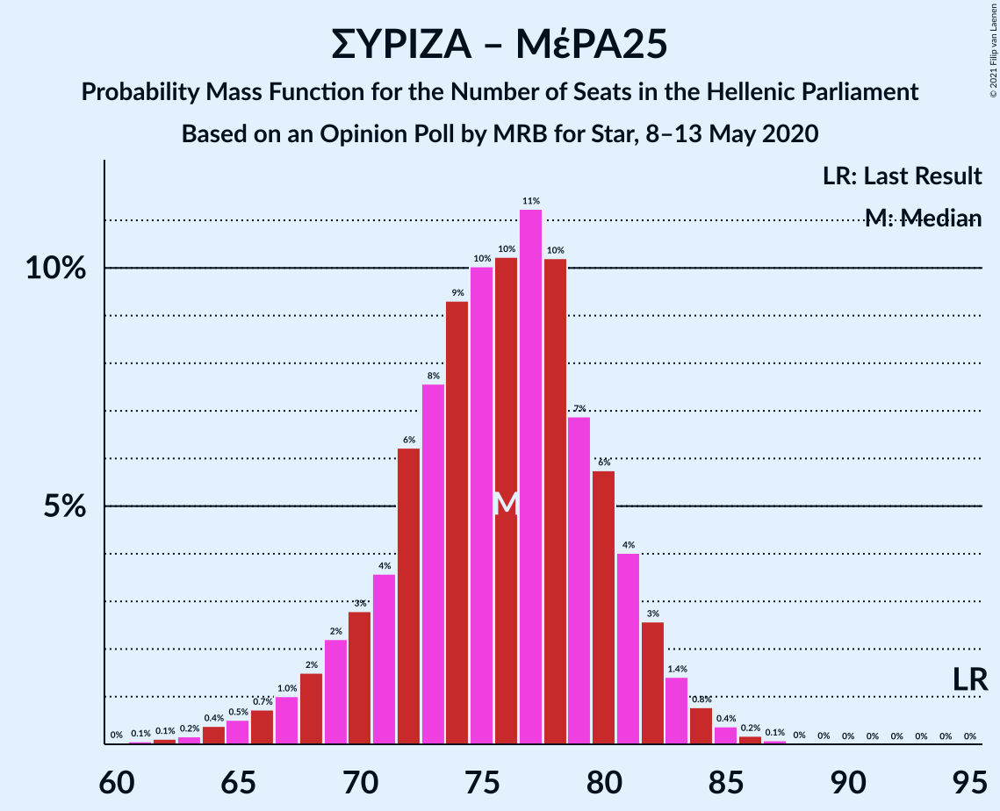

# Opinion Poll by MRB for Star, 8–13 May 2020

<a href="#voting-intentions">Voting Intentions</a> | <a href="#seats">Seats</a> | <a href="#coalitions">Coalitions</a> | <a href="#technical-information">Technical Information</a>

## Voting Intentions

### Confidence Intervals

| Party | Last Result | Poll Result | 80% Confidence Interval | 90% Confidence Interval | 95% Confidence Interval | 99% Confidence Interval |
|:-----:|:-----------:|:-----------:|:-----------------------:|:-----------------------:|:-----------------------:|:-----------------------:|
| Νέα Δημοκρατία | 39.8% | 49.7% | 47.8–51.5% |47.3–52.0% |46.9–52.5% |46.0–53.3% |
| Συνασπισμός Ριζοσπαστικής Αριστεράς | 31.5% | 25.2% | 23.6–26.8% |23.2–27.3% |22.8–27.7% |22.1–28.5% |
| Κίνημα Αλλαγής | 8.1% | 6.2% | 5.4–7.2% |5.2–7.4% |5.0–7.7% |4.6–8.2% |
| Κομμουνιστικό Κόμμα Ελλάδας | 5.3% | 5.3% | 4.6–6.2% |4.3–6.5% |4.2–6.7% |3.8–7.2% |
| Ελληνική Λύση | 3.7% | 4.8% | 4.1–5.7% |3.9–5.9% |3.7–6.2% |3.4–6.6% |
| Μέτωπο Ευρωπαϊκής Ρεαλιστικής Ανυπακοής | 3.4% | 3.7% | 3.1–4.5% |2.9–4.7% |2.7–4.9% |2.5–5.3% |

*Note:* The poll result column reflects the actual value used in the calculations. Published results may vary slightly, and in addition be rounded to fewer digits.

## Seats

### Confidence Intervals

| Party | Last Result | Median | 80% Confidence Interval | 90% Confidence Interval | 95% Confidence Interval | 99% Confidence Interval |
|:-----:|:-----------:|:------:|:-----------------------:|:-----------------------:|:-----------------------:|:-----------------------:|
| <a href="#νέα-δημοκρατία">Νέα Δημοκρατία</a> | 158 | 181 | 176–186 |174–188 |173–189 |171–192 |
| <a href="#συνασπισμός-ριζοσπαστικής-αριστεράς">Συνασπισμός Ριζοσπαστικής Αριστεράς</a> | 86 | 66 | 62–71 |61–72 |60–73 |58–75 |
| <a href="#κίνημα-αλλαγής">Κίνημα Αλλαγής</a> | 22 | 16 | 14–19 |14–20 |13–20 |12–22 |
| <a href="#κομμουνιστικό-κόμμα-ελλάδας">Κομμουνιστικό Κόμμα Ελλάδας</a> | 15 | 14 | 12–16 |11–17 |11–18 |10–19 |
| <a href="#ελληνική-λύση">Ελληνική Λύση</a> | 10 | 13 | 11–15 |10–16 |10–16 |9–17 |
| <a href="#μέτωπο-ευρωπαϊκής-ρεαλιστικής-ανυπακοής">Μέτωπο Ευρωπαϊκής Ρεαλιστικής Ανυπακοής</a> | 9 | 10 | 8–12 |0–12 |0–13 |0–14 |

### Νέα Δημοκρατία

*For a full overview of the results for this party, see the [Νέα Δημοκρατία](party-νέαδημοκρατία.html) page.*

| Number of Seats | Probability | Accumulated | Special Marks |
|:---------------:|:-----------:|:-----------:|:-------------:|
| 158 | 0% | 100% | Last Result |
| 159 | 0% | 100% |  |
| 160 | 0% | 100% |  |
| 161 | 0% | 100% |  |
| 162 | 0% | 100% |  |
| 163 | 0% | 100% |  |
| 164 | 0% | 100% |  |
| 165 | 0% | 100% |  |
| 166 | 0% | 100% |  |
| 167 | 0% | 100% |  |
| 168 | 0% | 100% |  |
| 169 | 0.1% | 100% |  |
| 170 | 0.2% | 99.9% |  |
| 171 | 0.3% | 99.7% |  |
| 172 | 0.6% | 99.4% |  |
| 173 | 2% | 98.8% |  |
| 174 | 2% | 97% |  |
| 175 | 3% | 95% |  |
| 176 | 4% | 92% |  |
| 177 | 7% | 88% |  |
| 178 | 10% | 81% |  |
| 179 | 7% | 71% |  |
| 180 | 8% | 63% |  |
| 181 | 12% | 55% | Median |
| 182 | 12% | 43% |  |
| 183 | 7% | 31% |  |
| 184 | 6% | 24% |  |
| 185 | 6% | 18% |  |
| 186 | 5% | 12% |  |
| 187 | 2% | 7% |  |
| 188 | 2% | 5% |  |
| 189 | 2% | 4% |  |
| 190 | 1.1% | 2% |  |
| 191 | 0.4% | 1.0% |  |
| 192 | 0.2% | 0.6% |  |
| 193 | 0.2% | 0.4% |  |
| 194 | 0.1% | 0.2% |  |
| 195 | 0% | 0.1% |  |
| 196 | 0% | 0% |  |

### Συνασπισμός Ριζοσπαστικής Αριστεράς

*For a full overview of the results for this party, see the [Συνασπισμός Ριζοσπαστικής Αριστεράς](party-συνασπισμόςριζοσπαστικήςαριστεράς.html) page.*

| Number of Seats | Probability | Accumulated | Special Marks |
|:---------------:|:-----------:|:-----------:|:-------------:|
| 56 | 0.1% | 100% |  |
| 57 | 0.2% | 99.9% |  |
| 58 | 0.4% | 99.7% |  |
| 59 | 0.9% | 99.3% |  |
| 60 | 2% | 98% |  |
| 61 | 3% | 97% |  |
| 62 | 5% | 94% |  |
| 63 | 7% | 88% |  |
| 64 | 11% | 81% |  |
| 65 | 10% | 71% |  |
| 66 | 12% | 60% | Median |
| 67 | 11% | 48% |  |
| 68 | 11% | 37% |  |
| 69 | 8% | 26% |  |
| 70 | 6% | 17% |  |
| 71 | 4% | 11% |  |
| 72 | 3% | 7% |  |
| 73 | 2% | 4% |  |
| 74 | 1.0% | 2% |  |
| 75 | 0.4% | 0.9% |  |
| 76 | 0.3% | 0.5% |  |
| 77 | 0.1% | 0.2% |  |
| 78 | 0% | 0.1% |  |
| 79 | 0% | 0% |  |
| 80 | 0% | 0% |  |
| 81 | 0% | 0% |  |
| 82 | 0% | 0% |  |
| 83 | 0% | 0% |  |
| 84 | 0% | 0% |  |
| 85 | 0% | 0% |  |
| 86 | 0% | 0% | Last Result |

### Κίνημα Αλλαγής

*For a full overview of the results for this party, see the [Κίνημα Αλλαγής](party-κίνημααλλαγής.html) page.*

| Number of Seats | Probability | Accumulated | Special Marks |
|:---------------:|:-----------:|:-----------:|:-------------:|
| 11 | 0.1% | 100% |  |
| 12 | 0.9% | 99.9% |  |
| 13 | 3% | 99.0% |  |
| 14 | 9% | 96% |  |
| 15 | 17% | 86% |  |
| 16 | 21% | 69% | Median |
| 17 | 20% | 48% |  |
| 18 | 14% | 28% |  |
| 19 | 8% | 14% |  |
| 20 | 4% | 6% |  |
| 21 | 1.4% | 2% |  |
| 22 | 0.4% | 0.5% | Last Result |
| 23 | 0.1% | 0.1% |  |
| 24 | 0% | 0% |  |

### Κομμουνιστικό Κόμμα Ελλάδας

*For a full overview of the results for this party, see the [Κομμουνιστικό Κόμμα Ελλάδας](party-κομμουνιστικόκόμμαελλάδας.html) page.*

| Number of Seats | Probability | Accumulated | Special Marks |
|:---------------:|:-----------:|:-----------:|:-------------:|
| 9 | 0.1% | 100% |  |
| 10 | 0.9% | 99.9% |  |
| 11 | 4% | 99.0% |  |
| 12 | 12% | 95% |  |
| 13 | 19% | 83% |  |
| 14 | 24% | 64% | Median |
| 15 | 19% | 40% | Last Result |
| 16 | 12% | 21% |  |
| 17 | 6% | 9% |  |
| 18 | 2% | 3% |  |
| 19 | 0.7% | 0.8% |  |
| 20 | 0.2% | 0.2% |  |
| 21 | 0% | 0% |  |

### Ελληνική Λύση

*For a full overview of the results for this party, see the [Ελληνική Λύση](party-ελληνικήλύση.html) page.*

| Number of Seats | Probability | Accumulated | Special Marks |
|:---------------:|:-----------:|:-----------:|:-------------:|
| 8 | 0.1% | 100% |  |
| 9 | 1.2% | 99.9% |  |
| 10 | 5% | 98.7% | Last Result |
| 11 | 14% | 93% |  |
| 12 | 21% | 79% |  |
| 13 | 25% | 58% | Median |
| 14 | 18% | 33% |  |
| 15 | 10% | 15% |  |
| 16 | 4% | 6% |  |
| 17 | 1.4% | 2% |  |
| 18 | 0.3% | 0.4% |  |
| 19 | 0.1% | 0.1% |  |
| 20 | 0% | 0% |  |

### Μέτωπο Ευρωπαϊκής Ρεαλιστικής Ανυπακοής

*For a full overview of the results for this party, see the [Μέτωπο Ευρωπαϊκής Ρεαλιστικής Ανυπακοής](party-μέτωποευρωπαϊκήςρεαλιστικήςανυπακοής.html) page.*

| Number of Seats | Probability | Accumulated | Special Marks |
|:---------------:|:-----------:|:-----------:|:-------------:|
| 0 | 8% | 100% |  |
| 1 | 0% | 92% |  |
| 2 | 0% | 92% |  |
| 3 | 0% | 92% |  |
| 4 | 0% | 92% |  |
| 5 | 0% | 92% |  |
| 6 | 0% | 92% |  |
| 7 | 0% | 92% |  |
| 8 | 9% | 92% |  |
| 9 | 25% | 83% | Last Result |
| 10 | 27% | 58% | Median |
| 11 | 19% | 31% |  |
| 12 | 9% | 12% |  |
| 13 | 3% | 4% |  |
| 14 | 0.7% | 0.9% |  |
| 15 | 0.1% | 0.2% |  |
| 16 | 0% | 0% |  |

## Coalitions

### Confidence Intervals

| Coalition | Last Result | Median | Majority? | 80% Confidence Interval | 90% Confidence Interval | 95% Confidence Interval | 99% Confidence Interval |
|:---------:|:-----------:|:------:|:---------:|:-----------------------:|:-----------------------:|:-----------------------:|:-----------------------:|
| Νέα Δημοκρατία – Κίνημα Αλλαγής | 180 | 197 | 100% | 192–202 | 191–204 | 190–206 | 188–209 |
| Νέα Δημοκρατία | 158 | 181 | 100% | 176–186 | 174–188 | 173–189 | 171–192 |
| Συνασπισμός Ριζοσπαστικής Αριστεράς – Μέτωπο Ευρωπαϊκής Ρεαλιστικής Ανυπακοής | 95 | 76 | 0% | 71–80 | 69–82 | 67–83 | 64–85 |
| Συνασπισμός Ριζοσπαστικής Αριστεράς | 86 | 66 | 0% | 62–71 | 61–72 | 60–73 | 58–75 |

### Νέα Δημοκρατία – Κίνημα Αλλαγής

| Number of Seats | Probability | Accumulated | Special Marks |
|:---------------:|:-----------:|:-----------:|:-------------:|
| 180 | 0% | 100% | Last Result |
| 181 | 0% | 100% |  |
| 182 | 0% | 100% |  |
| 183 | 0% | 100% |  |
| 184 | 0% | 100% |  |
| 185 | 0% | 100% |  |
| 186 | 0.1% | 99.9% |  |
| 187 | 0.3% | 99.8% |  |
| 188 | 0.5% | 99.6% |  |
| 189 | 1.0% | 99.1% |  |
| 190 | 2% | 98% |  |
| 191 | 3% | 96% |  |
| 192 | 4% | 94% |  |
| 193 | 6% | 90% |  |
| 194 | 7% | 84% |  |
| 195 | 9% | 77% |  |
| 196 | 10% | 68% |  |
| 197 | 11% | 58% | Median |
| 198 | 9% | 47% |  |
| 199 | 10% | 38% |  |
| 200 | 8% | 28% |  |
| 201 | 6% | 21% |  |
| 202 | 4% | 14% |  |
| 203 | 3% | 10% |  |
| 204 | 2% | 7% |  |
| 205 | 2% | 4% |  |
| 206 | 1.0% | 3% |  |
| 207 | 0.8% | 2% |  |
| 208 | 0.4% | 1.0% |  |
| 209 | 0.3% | 0.6% |  |
| 210 | 0.1% | 0.3% |  |
| 211 | 0.1% | 0.2% |  |
| 212 | 0% | 0.1% |  |
| 213 | 0% | 0% |  |

### Νέα Δημοκρατία

| Number of Seats | Probability | Accumulated | Special Marks |
|:---------------:|:-----------:|:-----------:|:-------------:|
| 158 | 0% | 100% | Last Result |
| 159 | 0% | 100% |  |
| 160 | 0% | 100% |  |
| 161 | 0% | 100% |  |
| 162 | 0% | 100% |  |
| 163 | 0% | 100% |  |
| 164 | 0% | 100% |  |
| 165 | 0% | 100% |  |
| 166 | 0% | 100% |  |
| 167 | 0% | 100% |  |
| 168 | 0% | 100% |  |
| 169 | 0.1% | 100% |  |
| 170 | 0.2% | 99.9% |  |
| 171 | 0.3% | 99.7% |  |
| 172 | 0.6% | 99.4% |  |
| 173 | 2% | 98.8% |  |
| 174 | 2% | 97% |  |
| 175 | 3% | 95% |  |
| 176 | 4% | 92% |  |
| 177 | 7% | 88% |  |
| 178 | 10% | 81% |  |
| 179 | 7% | 71% |  |
| 180 | 8% | 63% |  |
| 181 | 12% | 55% | Median |
| 182 | 12% | 43% |  |
| 183 | 7% | 31% |  |
| 184 | 6% | 24% |  |
| 185 | 6% | 18% |  |
| 186 | 5% | 12% |  |
| 187 | 2% | 7% |  |
| 188 | 2% | 5% |  |
| 189 | 2% | 4% |  |
| 190 | 1.1% | 2% |  |
| 191 | 0.4% | 1.0% |  |
| 192 | 0.2% | 0.6% |  |
| 193 | 0.2% | 0.4% |  |
| 194 | 0.1% | 0.2% |  |
| 195 | 0% | 0.1% |  |
| 196 | 0% | 0% |  |

### Συνασπισμός Ριζοσπαστικής Αριστεράς – Μέτωπο Ευρωπαϊκής Ρεαλιστικής Ανυπακοής

| Number of Seats | Probability | Accumulated | Special Marks |
|:---------------:|:-----------:|:-----------:|:-------------:|
| 61 | 0.1% | 100% |  |
| 62 | 0.1% | 99.9% |  |
| 63 | 0.2% | 99.8% |  |
| 64 | 0.4% | 99.6% |  |
| 65 | 0.5% | 99.2% |  |
| 66 | 0.7% | 98.7% |  |
| 67 | 1.0% | 98% |  |
| 68 | 2% | 97% |  |
| 69 | 2% | 95% |  |
| 70 | 3% | 93% |  |
| 71 | 4% | 90% |  |
| 72 | 6% | 87% |  |
| 73 | 8% | 81% |  |
| 74 | 9% | 73% |  |
| 75 | 10% | 64% |  |
| 76 | 10% | 54% | Median |
| 77 | 11% | 44% |  |
| 78 | 10% | 32% |  |
| 79 | 7% | 22% |  |
| 80 | 6% | 15% |  |
| 81 | 4% | 9% |  |
| 82 | 3% | 5% |  |
| 83 | 1.4% | 3% |  |
| 84 | 0.8% | 1.5% |  |
| 85 | 0.4% | 0.7% |  |
| 86 | 0.2% | 0.3% |  |
| 87 | 0.1% | 0.1% |  |
| 88 | 0% | 0% |  |
| 89 | 0% | 0% |  |
| 90 | 0% | 0% |  |
| 91 | 0% | 0% |  |
| 92 | 0% | 0% |  |
| 93 | 0% | 0% |  |
| 94 | 0% | 0% |  |
| 95 | 0% | 0% | Last Result |

### Συνασπισμός Ριζοσπαστικής Αριστεράς

| Number of Seats | Probability | Accumulated | Special Marks |
|:---------------:|:-----------:|:-----------:|:-------------:|
| 56 | 0.1% | 100% |  |
| 57 | 0.2% | 99.9% |  |
| 58 | 0.4% | 99.7% |  |
| 59 | 0.9% | 99.3% |  |
| 60 | 2% | 98% |  |
| 61 | 3% | 97% |  |
| 62 | 5% | 94% |  |
| 63 | 7% | 88% |  |
| 64 | 11% | 81% |  |
| 65 | 10% | 71% |  |
| 66 | 12% | 60% | Median |
| 67 | 11% | 48% |  |
| 68 | 11% | 37% |  |
| 69 | 8% | 26% |  |
| 70 | 6% | 17% |  |
| 71 | 4% | 11% |  |
| 72 | 3% | 7% |  |
| 73 | 2% | 4% |  |
| 74 | 1.0% | 2% |  |
| 75 | 0.4% | 0.9% |  |
| 76 | 0.3% | 0.5% |  |
| 77 | 0.1% | 0.2% |  |
| 78 | 0% | 0.1% |  |
| 79 | 0% | 0% |  |
| 80 | 0% | 0% |  |
| 81 | 0% | 0% |  |
| 82 | 0% | 0% |  |
| 83 | 0% | 0% |  |
| 84 | 0% | 0% |  |
| 85 | 0% | 0% |  |
| 86 | 0% | 0% | Last Result |

## Technical Information

### Opinion Poll

+ **Polling firm:** MRB
+ **Commissioner(s):** Star
+ **Fieldwork period:** 8–13 May 2020

### Calculations

+ **Sample size:** 1228
+ **Simulations done:** 1,048,576
+ **Error estimate:** 0.59%

