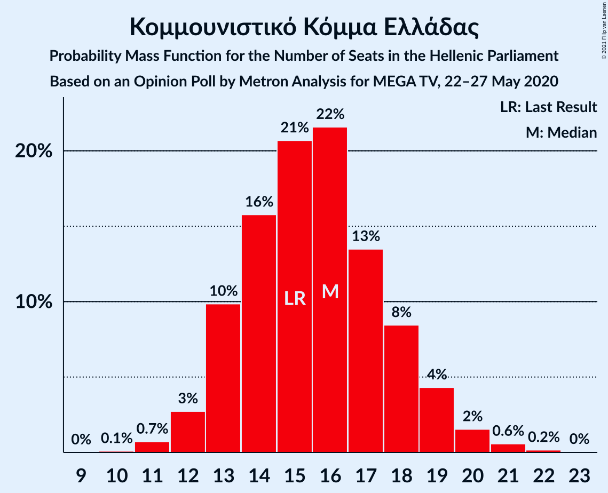
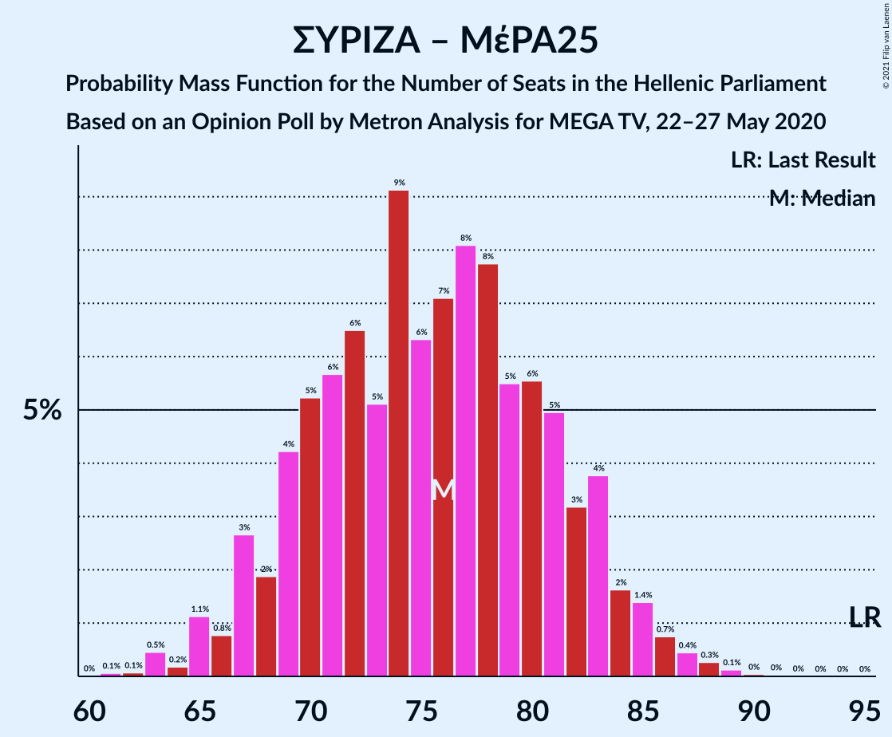
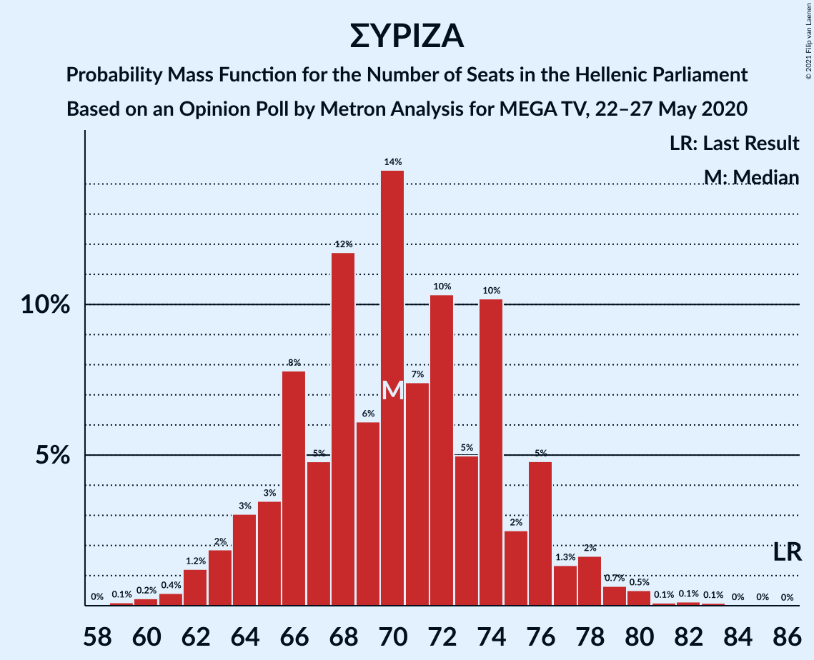

# Opinion Poll by Metron Analysis for MEGA TV, 22–27 May 2020

<a href="#voting-intentions">Voting Intentions</a> | <a href="#seats">Seats</a> | <a href="#coalitions">Coalitions</a> | <a href="#technical-information">Technical Information</a>

## Voting Intentions

### Confidence Intervals

| Party | Last Result | Poll Result | 80% Confidence Interval | 90% Confidence Interval | 95% Confidence Interval | 99% Confidence Interval |
|:-----:|:-----------:|:-----------:|:-----------------------:|:-----------------------:|:-----------------------:|:-----------------------:|
| Νέα Δημοκρατία | 39.8% | 49.6% | 47.8–51.5% |47.2–52.0% |46.8–52.5% |45.9–53.3% |
| Συνασπισμός Ριζοσπαστικής Αριστεράς | 31.5% | 25.7% | 24.2–27.4% |23.7–27.9% |23.3–28.3% |22.6–29.1% |
| Κίνημα Αλλαγής | 8.1% | 6.3% | 5.5–7.3% |5.3–7.6% |5.1–7.9% |4.7–8.4% |
| Κομμουνιστικό Κόμμα Ελλάδας | 5.3% | 5.7% | 4.9–6.6% |4.7–6.9% |4.5–7.1% |4.1–7.6% |
| Ελληνική Λύση | 3.7% | 3.2% | 2.6–3.9% |2.4–4.1% |2.3–4.3% |2.1–4.7% |
| Μέτωπο Ευρωπαϊκής Ρεαλιστικής Ανυπακοής | 3.4% | 3.1% | 2.5–3.8% |2.4–4.0% |2.2–4.2% |2.0–4.6% |
| Χρυσή Αυγή | 2.9% | 2.0% | 1.6–2.6% |1.4–2.8% |1.3–3.0% |1.2–3.3% |

*Note:* The poll result column reflects the actual value used in the calculations. Published results may vary slightly, and in addition be rounded to fewer digits.

## Seats

### Confidence Intervals

| Party | Last Result | Median | 80% Confidence Interval | 90% Confidence Interval | 95% Confidence Interval | 99% Confidence Interval |
|:-----:|:-----------:|:------:|:-----------------------:|:-----------------------:|:-----------------------:|:-----------------------:|
| <a href="#νέα-δημοκρατία">Νέα Δημοκρατία</a> | 158 | 184 | 178–191 |177–192 |176–194 |173–197 |
| <a href="#συνασπισμός-ριζοσπαστικής-αριστεράς">Συνασπισμός Ριζοσπαστικής Αριστεράς</a> | 86 | 70 | 66–74 |64–76 |63–78 |61–80 |
| <a href="#κίνημα-αλλαγής">Κίνημα Αλλαγής</a> | 22 | 18 | 15–20 |14–21 |14–22 |13–23 |
| <a href="#κομμουνιστικό-κόμμα-ελλάδας">Κομμουνιστικό Κόμμα Ελλάδας</a> | 15 | 15 | 13–18 |13–19 |12–19 |11–21 |
| <a href="#ελληνική-λύση">Ελληνική Λύση</a> | 10 | 9 | 0–11 |0–11 |0–12 |0–13 |
| <a href="#μέτωπο-ευρωπαϊκής-ρεαλιστικής-ανυπακοής">Μέτωπο Ευρωπαϊκής Ρεαλιστικής Ανυπακοής</a> | 9 | 9 | 0–10 |0–11 |0–11 |0–12 |
| <a href="#χρυσή-αυγή">Χρυσή Αυγή</a> | 0 | 0 | 0 |0 |0 |0–9 |

### Νέα Δημοκρατία

*For a full overview of the results for this party, see the [Νέα Δημοκρατία](party-νέαδημοκρατία.html) page.*

| Number of Seats | Probability | Accumulated | Special Marks |
|:---------------:|:-----------:|:-----------:|:-------------:|
| 158 | 0% | 100% | Last Result |
| 159 | 0% | 100% |  |
| 160 | 0% | 100% |  |
| 161 | 0% | 100% |  |
| 162 | 0% | 100% |  |
| 163 | 0% | 100% |  |
| 164 | 0% | 100% |  |
| 165 | 0% | 100% |  |
| 166 | 0% | 100% |  |
| 167 | 0% | 100% |  |
| 168 | 0% | 100% |  |
| 169 | 0% | 100% |  |
| 170 | 0% | 99.9% |  |
| 171 | 0.1% | 99.9% |  |
| 172 | 0.3% | 99.8% |  |
| 173 | 0.4% | 99.6% |  |
| 174 | 0.6% | 99.2% |  |
| 175 | 0.8% | 98.6% |  |
| 176 | 2% | 98% |  |
| 177 | 5% | 96% |  |
| 178 | 1.1% | 91% |  |
| 179 | 2% | 90% |  |
| 180 | 4% | 88% |  |
| 181 | 8% | 84% |  |
| 182 | 15% | 76% |  |
| 183 | 8% | 61% |  |
| 184 | 7% | 52% | Median |
| 185 | 6% | 45% |  |
| 186 | 9% | 39% |  |
| 187 | 2% | 30% |  |
| 188 | 8% | 28% |  |
| 189 | 2% | 20% |  |
| 190 | 3% | 18% |  |
| 191 | 9% | 15% |  |
| 192 | 3% | 7% |  |
| 193 | 0.7% | 3% |  |
| 194 | 1.1% | 3% |  |
| 195 | 0.6% | 2% |  |
| 196 | 0.4% | 1.1% |  |
| 197 | 0.4% | 0.7% |  |
| 198 | 0.1% | 0.4% |  |
| 199 | 0.1% | 0.3% |  |
| 200 | 0.1% | 0.2% |  |
| 201 | 0.1% | 0.1% |  |
| 202 | 0% | 0.1% |  |
| 203 | 0% | 0% |  |

### Συνασπισμός Ριζοσπαστικής Αριστεράς

*For a full overview of the results for this party, see the [Συνασπισμός Ριζοσπαστικής Αριστεράς](party-συνασπισμόςριζοσπαστικήςαριστεράς.html) page.*

| Number of Seats | Probability | Accumulated | Special Marks |
|:---------------:|:-----------:|:-----------:|:-------------:|
| 59 | 0% | 100% |  |
| 60 | 0.3% | 99.9% |  |
| 61 | 0.3% | 99.6% |  |
| 62 | 1.2% | 99.3% |  |
| 63 | 2% | 98% |  |
| 64 | 1.4% | 96% |  |
| 65 | 5% | 95% |  |
| 66 | 8% | 90% |  |
| 67 | 3% | 82% |  |
| 68 | 16% | 79% |  |
| 69 | 3% | 63% |  |
| 70 | 19% | 61% | Median |
| 71 | 8% | 42% |  |
| 72 | 5% | 34% |  |
| 73 | 4% | 28% |  |
| 74 | 15% | 25% |  |
| 75 | 2% | 10% |  |
| 76 | 4% | 8% |  |
| 77 | 1.3% | 4% |  |
| 78 | 1.0% | 3% |  |
| 79 | 1.2% | 2% |  |
| 80 | 0.5% | 0.8% |  |
| 81 | 0.2% | 0.3% |  |
| 82 | 0.1% | 0.2% |  |
| 83 | 0% | 0.1% |  |
| 84 | 0% | 0% |  |
| 85 | 0% | 0% |  |
| 86 | 0% | 0% | Last Result |

### Κίνημα Αλλαγής

*For a full overview of the results for this party, see the [Κίνημα Αλλαγής](party-κίνημααλλαγής.html) page.*

| Number of Seats | Probability | Accumulated | Special Marks |
|:---------------:|:-----------:|:-----------:|:-------------:|
| 12 | 0.2% | 100% |  |
| 13 | 0.9% | 99.7% |  |
| 14 | 4% | 98.8% |  |
| 15 | 7% | 95% |  |
| 16 | 13% | 88% |  |
| 17 | 18% | 75% |  |
| 18 | 35% | 57% | Median |
| 19 | 9% | 22% |  |
| 20 | 7% | 13% |  |
| 21 | 3% | 6% |  |
| 22 | 2% | 3% | Last Result |
| 23 | 0.7% | 0.9% |  |
| 24 | 0.2% | 0.2% |  |
| 25 | 0% | 0% |  |

### Κομμουνιστικό Κόμμα Ελλάδας

*For a full overview of the results for this party, see the [Κομμουνιστικό Κόμμα Ελλάδας](party-κομμουνιστικόκόμμαελλάδας.html) page.*

| Number of Seats | Probability | Accumulated | Special Marks |
|:---------------:|:-----------:|:-----------:|:-------------:|
| 10 | 0.1% | 100% |  |
| 11 | 0.7% | 99.9% |  |
| 12 | 3% | 99.2% |  |
| 13 | 9% | 97% |  |
| 14 | 18% | 87% |  |
| 15 | 25% | 70% | Last Result, Median |
| 16 | 21% | 44% |  |
| 17 | 11% | 23% |  |
| 18 | 6% | 12% |  |
| 19 | 4% | 5% |  |
| 20 | 1.0% | 2% |  |
| 21 | 0.3% | 0.5% |  |
| 22 | 0.1% | 0.2% |  |
| 23 | 0% | 0.1% |  |
| 24 | 0% | 0% |  |

### Ελληνική Λύση

*For a full overview of the results for this party, see the [Ελληνική Λύση](party-ελληνικήλύση.html) page.*

| Number of Seats | Probability | Accumulated | Special Marks |
|:---------------:|:-----------:|:-----------:|:-------------:|
| 0 | 31% | 100% |  |
| 1 | 0% | 69% |  |
| 2 | 0% | 69% |  |
| 3 | 0% | 69% |  |
| 4 | 0% | 69% |  |
| 5 | 0% | 69% |  |
| 6 | 0% | 69% |  |
| 7 | 0% | 69% |  |
| 8 | 19% | 69% |  |
| 9 | 22% | 50% | Median |
| 10 | 14% | 28% | Last Result |
| 11 | 11% | 14% |  |
| 12 | 3% | 3% |  |
| 13 | 0.5% | 0.7% |  |
| 14 | 0.2% | 0.2% |  |
| 15 | 0% | 0% |  |

### Μέτωπο Ευρωπαϊκής Ρεαλιστικής Ανυπακοής

*For a full overview of the results for this party, see the [Μέτωπο Ευρωπαϊκής Ρεαλιστικής Ανυπακοής](party-μέτωποευρωπαϊκήςρεαλιστικήςανυπακοής.html) page.*

| Number of Seats | Probability | Accumulated | Special Marks |
|:---------------:|:-----------:|:-----------:|:-------------:|
| 0 | 38% | 100% |  |
| 1 | 0% | 62% |  |
| 2 | 0% | 62% |  |
| 3 | 0% | 62% |  |
| 4 | 0% | 62% |  |
| 5 | 0% | 62% |  |
| 6 | 0% | 62% |  |
| 7 | 0% | 62% |  |
| 8 | 8% | 62% |  |
| 9 | 39% | 54% | Last Result, Median |
| 10 | 8% | 15% |  |
| 11 | 5% | 7% |  |
| 12 | 2% | 2% |  |
| 13 | 0.1% | 0.2% |  |
| 14 | 0.1% | 0.1% |  |
| 15 | 0% | 0% |  |

### Χρυσή Αυγή

*For a full overview of the results for this party, see the [Χρυσή Αυγή](party-χρυσήαυγή.html) page.*

| Number of Seats | Probability | Accumulated | Special Marks |
|:---------------:|:-----------:|:-----------:|:-------------:|
| 0 | 98% | 100% | Last Result, Median |
| 1 | 0% | 2% |  |
| 2 | 0% | 2% |  |
| 3 | 0% | 2% |  |
| 4 | 0% | 2% |  |
| 5 | 0% | 2% |  |
| 6 | 0% | 2% |  |
| 7 | 0% | 2% |  |
| 8 | 0.7% | 2% |  |
| 9 | 0.7% | 0.8% |  |
| 10 | 0.1% | 0.1% |  |
| 11 | 0% | 0% |  |

## Coalitions

### Confidence Intervals

| Coalition | Last Result | Median | Majority? | 80% Confidence Interval | 90% Confidence Interval | 95% Confidence Interval | 99% Confidence Interval |
|:---------:|:-----------:|:------:|:---------:|:-----------------------:|:-----------------------:|:-----------------------:|:-----------------------:|
| Νέα Δημοκρατία – Κίνημα Αλλαγής | 180 | 202 | 100% | 196–209 | 195–209 | 192–211 | 190–215 |
| Νέα Δημοκρατία | 158 | 184 | 100% | 178–191 | 177–192 | 176–194 | 173–197 |
| Συνασπισμός Ριζοσπαστικής Αριστεράς – Μέτωπο Ευρωπαϊκής Ρεαλιστικής Ανυπακοής | 95 | 76 | 0% | 71–80 | 69–83 | 67–85 | 63–88 |
| Συνασπισμός Ριζοσπαστικής Αριστεράς | 86 | 70 | 0% | 66–74 | 64–76 | 63–78 | 61–80 |

### Νέα Δημοκρατία – Κίνημα Αλλαγής

| Number of Seats | Probability | Accumulated | Special Marks |
|:---------------:|:-----------:|:-----------:|:-------------:|
| 180 | 0% | 100% | Last Result |
| 181 | 0% | 100% |  |
| 182 | 0% | 100% |  |
| 183 | 0% | 100% |  |
| 184 | 0% | 100% |  |
| 185 | 0% | 100% |  |
| 186 | 0% | 100% |  |
| 187 | 0.1% | 99.9% |  |
| 188 | 0.1% | 99.9% |  |
| 189 | 0.2% | 99.8% |  |
| 190 | 0.5% | 99.5% |  |
| 191 | 1.1% | 99.0% |  |
| 192 | 0.7% | 98% |  |
| 193 | 1.2% | 97% |  |
| 194 | 0.5% | 96% |  |
| 195 | 4% | 95% |  |
| 196 | 2% | 92% |  |
| 197 | 4% | 90% |  |
| 198 | 3% | 86% |  |
| 199 | 16% | 83% |  |
| 200 | 13% | 67% |  |
| 201 | 3% | 54% |  |
| 202 | 10% | 52% | Median |
| 203 | 8% | 41% |  |
| 204 | 3% | 33% |  |
| 205 | 4% | 31% |  |
| 206 | 8% | 27% |  |
| 207 | 4% | 19% |  |
| 208 | 4% | 15% |  |
| 209 | 7% | 11% |  |
| 210 | 2% | 5% |  |
| 211 | 0.7% | 3% |  |
| 212 | 0.7% | 2% |  |
| 213 | 0.7% | 2% |  |
| 214 | 0.3% | 0.9% |  |
| 215 | 0.2% | 0.6% |  |
| 216 | 0% | 0.4% |  |
| 217 | 0.1% | 0.4% |  |
| 218 | 0.1% | 0.3% |  |
| 219 | 0.1% | 0.1% |  |
| 220 | 0% | 0% |  |

### Νέα Δημοκρατία

| Number of Seats | Probability | Accumulated | Special Marks |
|:---------------:|:-----------:|:-----------:|:-------------:|
| 158 | 0% | 100% | Last Result |
| 159 | 0% | 100% |  |
| 160 | 0% | 100% |  |
| 161 | 0% | 100% |  |
| 162 | 0% | 100% |  |
| 163 | 0% | 100% |  |
| 164 | 0% | 100% |  |
| 165 | 0% | 100% |  |
| 166 | 0% | 100% |  |
| 167 | 0% | 100% |  |
| 168 | 0% | 100% |  |
| 169 | 0% | 100% |  |
| 170 | 0% | 99.9% |  |
| 171 | 0.1% | 99.9% |  |
| 172 | 0.3% | 99.8% |  |
| 173 | 0.4% | 99.6% |  |
| 174 | 0.6% | 99.2% |  |
| 175 | 0.8% | 98.6% |  |
| 176 | 2% | 98% |  |
| 177 | 5% | 96% |  |
| 178 | 1.1% | 91% |  |
| 179 | 2% | 90% |  |
| 180 | 4% | 88% |  |
| 181 | 8% | 84% |  |
| 182 | 15% | 76% |  |
| 183 | 8% | 61% |  |
| 184 | 7% | 52% | Median |
| 185 | 6% | 45% |  |
| 186 | 9% | 39% |  |
| 187 | 2% | 30% |  |
| 188 | 8% | 28% |  |
| 189 | 2% | 20% |  |
| 190 | 3% | 18% |  |
| 191 | 9% | 15% |  |
| 192 | 3% | 7% |  |
| 193 | 0.7% | 3% |  |
| 194 | 1.1% | 3% |  |
| 195 | 0.6% | 2% |  |
| 196 | 0.4% | 1.1% |  |
| 197 | 0.4% | 0.7% |  |
| 198 | 0.1% | 0.4% |  |
| 199 | 0.1% | 0.3% |  |
| 200 | 0.1% | 0.2% |  |
| 201 | 0.1% | 0.1% |  |
| 202 | 0% | 0.1% |  |
| 203 | 0% | 0% |  |

### Συνασπισμός Ριζοσπαστικής Αριστεράς – Μέτωπο Ευρωπαϊκής Ρεαλιστικής Ανυπακοής

| Number of Seats | Probability | Accumulated | Special Marks |
|:---------------:|:-----------:|:-----------:|:-------------:|
| 61 | 0% | 100% |  |
| 62 | 0.1% | 99.9% |  |
| 63 | 0.6% | 99.9% |  |
| 64 | 0.1% | 99.3% |  |
| 65 | 1.1% | 99.3% |  |
| 66 | 0.7% | 98% |  |
| 67 | 2% | 98% |  |
| 68 | 0.9% | 96% |  |
| 69 | 2% | 95% |  |
| 70 | 2% | 93% |  |
| 71 | 5% | 91% |  |
| 72 | 4% | 86% |  |
| 73 | 5% | 82% |  |
| 74 | 18% | 78% |  |
| 75 | 3% | 60% |  |
| 76 | 7% | 57% |  |
| 77 | 16% | 50% |  |
| 78 | 3% | 34% |  |
| 79 | 15% | 31% | Median |
| 80 | 7% | 16% |  |
| 81 | 2% | 9% |  |
| 82 | 2% | 7% |  |
| 83 | 2% | 6% |  |
| 84 | 0.7% | 4% |  |
| 85 | 2% | 4% |  |
| 86 | 0.2% | 1.2% |  |
| 87 | 0.3% | 0.9% |  |
| 88 | 0.3% | 0.6% |  |
| 89 | 0.1% | 0.3% |  |
| 90 | 0.1% | 0.2% |  |
| 91 | 0.1% | 0.1% |  |
| 92 | 0% | 0% |  |
| 93 | 0% | 0% |  |
| 94 | 0% | 0% |  |
| 95 | 0% | 0% | Last Result |

### Συνασπισμός Ριζοσπαστικής Αριστεράς

| Number of Seats | Probability | Accumulated | Special Marks |
|:---------------:|:-----------:|:-----------:|:-------------:|
| 59 | 0% | 100% |  |
| 60 | 0.3% | 99.9% |  |
| 61 | 0.3% | 99.6% |  |
| 62 | 1.2% | 99.3% |  |
| 63 | 2% | 98% |  |
| 64 | 1.4% | 96% |  |
| 65 | 5% | 95% |  |
| 66 | 8% | 90% |  |
| 67 | 3% | 82% |  |
| 68 | 16% | 79% |  |
| 69 | 3% | 63% |  |
| 70 | 19% | 61% | Median |
| 71 | 8% | 42% |  |
| 72 | 5% | 34% |  |
| 73 | 4% | 28% |  |
| 74 | 15% | 25% |  |
| 75 | 2% | 10% |  |
| 76 | 4% | 8% |  |
| 77 | 1.3% | 4% |  |
| 78 | 1.0% | 3% |  |
| 79 | 1.2% | 2% |  |
| 80 | 0.5% | 0.8% |  |
| 81 | 0.2% | 0.3% |  |
| 82 | 0.1% | 0.2% |  |
| 83 | 0% | 0.1% |  |
| 84 | 0% | 0% |  |
| 85 | 0% | 0% |  |
| 86 | 0% | 0% | Last Result |

## Technical Information

### Opinion Poll

+ **Polling firm:** Metron Analysis
+ **Commissioner(s):** MEGA TV
+ **Fieldwork period:** 22–27 May 2020

### Calculations

+ **Sample size:** 1201
+ **Simulations done:** 131,072
+ **Error estimate:** 0.72%

