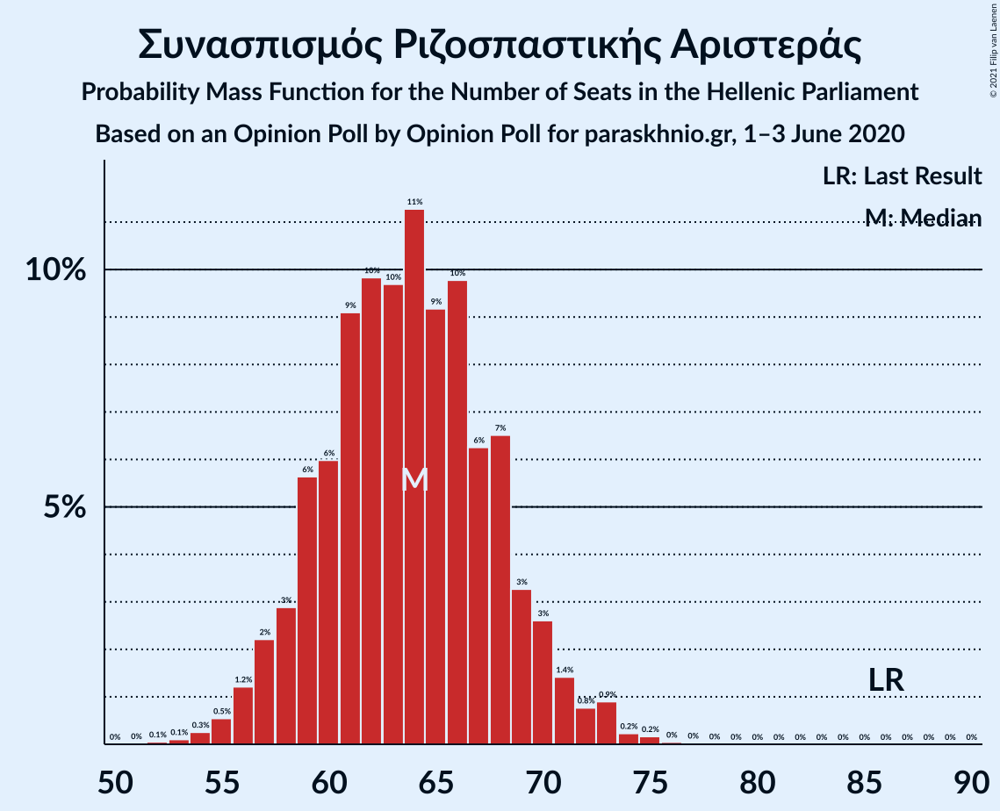
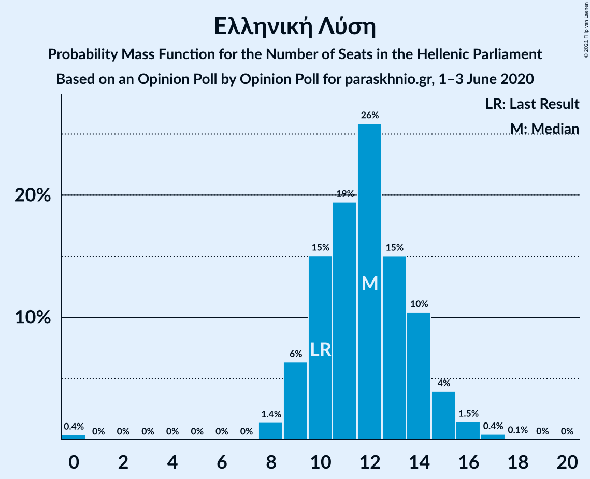
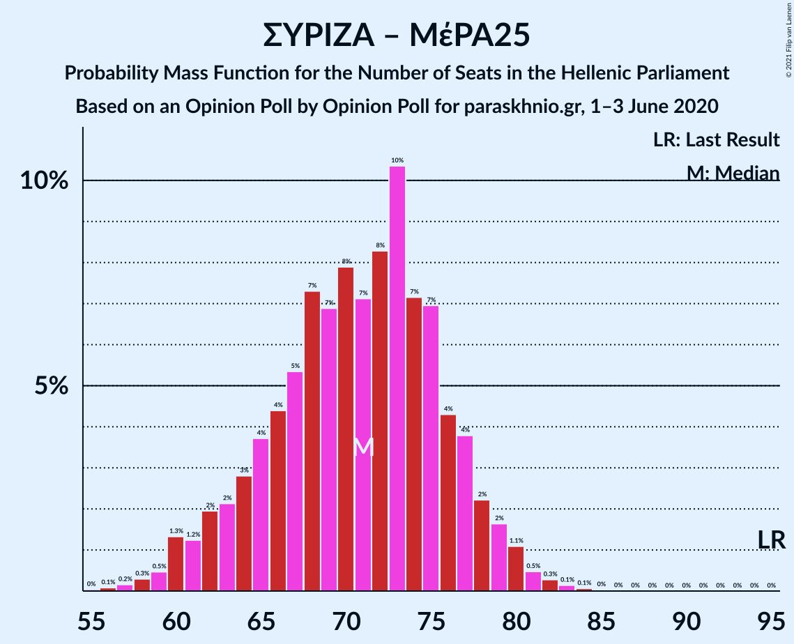

# Opinion Poll by Opinion Poll for paraskhnio.gr, 1–3 June 2020

<a href="#voting-intentions">Voting Intentions</a> | <a href="#seats">Seats</a> | <a href="#coalitions">Coalitions</a> | <a href="#technical-information">Technical Information</a>

## Voting Intentions

### Confidence Intervals

| Party | Last Result | Poll Result | 80% Confidence Interval | 90% Confidence Interval | 95% Confidence Interval | 99% Confidence Interval |
|:-----:|:-----------:|:-----------:|:-----------------------:|:-----------------------:|:-----------------------:|:-----------------------:|
| Νέα Δημοκρατία | 39.8% | 50.9% | 49.0–52.9% |48.4–53.5% |47.9–54.0% |47.0–54.9% |
| Συνασπισμός Ριζοσπαστικής Αριστεράς | 31.5% | 24.3% | 22.7–26.1% |22.2–26.6% |21.8–27.0% |21.1–27.9% |
| Κίνημα Αλλαγής | 8.1% | 6.4% | 5.5–7.5% |5.3–7.8% |5.1–8.1% |4.7–8.6% |
| Κομμουνιστικό Κόμμα Ελλάδας | 5.3% | 5.9% | 5.1–7.0% |4.9–7.3% |4.7–7.5% |4.3–8.1% |
| Ελληνική Λύση | 3.7% | 4.4% | 3.7–5.4% |3.5–5.6% |3.4–5.9% |3.0–6.3% |
| Μέτωπο Ευρωπαϊκής Ρεαλιστικής Ανυπακοής | 3.4% | 3.3% | 2.7–4.1% |2.5–4.4% |2.4–4.6% |2.1–5.0% |
| Χρυσή Αυγή | 2.9% | 2.5% | 2.0–3.3% |1.9–3.5% |1.8–3.7% |1.5–4.1% |

*Note:* The poll result column reflects the actual value used in the calculations. Published results may vary slightly, and in addition be rounded to fewer digits.

## Seats

### Confidence Intervals

| Party | Last Result | Median | 80% Confidence Interval | 90% Confidence Interval | 95% Confidence Interval | 99% Confidence Interval |
|:-----:|:-----------:|:------:|:-----------------------:|:-----------------------:|:-----------------------:|:-----------------------:|
| <a href="#νέα-δημοκρατία">Νέα Δημοκρατία</a> | 158 | 184 | 176–189 |175–192 |174–192 |171–195 |
| <a href="#συνασπισμός-ριζοσπαστικής-αριστεράς">Συνασπισμός Ριζοσπαστικής Αριστεράς</a> | 86 | 64 | 60–68 |58–70 |58–71 |55–73 |
| <a href="#κίνημα-αλλαγής">Κίνημα Αλλαγής</a> | 22 | 17 | 15–20 |14–20 |13–21 |12–22 |
| <a href="#κομμουνιστικό-κόμμα-ελλάδας">Κομμουνιστικό Κόμμα Ελλάδας</a> | 15 | 16 | 14–18 |13–19 |13–20 |11–21 |
| <a href="#ελληνική-λύση">Ελληνική Λύση</a> | 10 | 12 | 10–14 |9–15 |9–15 |8–17 |
| <a href="#μέτωπο-ευρωπαϊκής-ρεαλιστικής-ανυπακοής">Μέτωπο Ευρωπαϊκής Ρεαλιστικής Ανυπακοής</a> | 9 | 9 | 0–10 |0–11 |0–11 |0–12 |
| <a href="#χρυσή-αυγή">Χρυσή Αυγή</a> | 0 | 0 | 0–8 |0–8 |0–9 |0–10 |

### Νέα Δημοκρατία

*For a full overview of the results for this party, see the [Νέα Δημοκρατία](party-νέαδημοκρατία.html) page.*

| Number of Seats | Probability | Accumulated | Special Marks |
|:---------------:|:-----------:|:-----------:|:-------------:|
| 158 | 0% | 100% | Last Result |
| 159 | 0% | 100% |  |
| 160 | 0% | 100% |  |
| 161 | 0% | 100% |  |
| 162 | 0% | 100% |  |
| 163 | 0% | 100% |  |
| 164 | 0% | 100% |  |
| 165 | 0% | 100% |  |
| 166 | 0% | 100% |  |
| 167 | 0% | 100% |  |
| 168 | 0% | 100% |  |
| 169 | 0.1% | 99.9% |  |
| 170 | 0.1% | 99.8% |  |
| 171 | 0.4% | 99.7% |  |
| 172 | 0.4% | 99.3% |  |
| 173 | 0.9% | 98.9% |  |
| 174 | 1.2% | 98% |  |
| 175 | 4% | 97% |  |
| 176 | 3% | 93% |  |
| 177 | 3% | 90% |  |
| 178 | 3% | 87% |  |
| 179 | 4% | 84% |  |
| 180 | 4% | 80% |  |
| 181 | 9% | 76% |  |
| 182 | 9% | 67% |  |
| 183 | 8% | 59% |  |
| 184 | 11% | 51% | Median |
| 185 | 7% | 40% |  |
| 186 | 5% | 33% |  |
| 187 | 9% | 28% |  |
| 188 | 5% | 19% |  |
| 189 | 4% | 13% |  |
| 190 | 3% | 10% |  |
| 191 | 0.9% | 6% |  |
| 192 | 3% | 5% |  |
| 193 | 0.6% | 2% |  |
| 194 | 1.1% | 2% |  |
| 195 | 0.3% | 0.8% |  |
| 196 | 0.1% | 0.5% |  |
| 197 | 0.1% | 0.4% |  |
| 198 | 0.1% | 0.2% |  |
| 199 | 0.1% | 0.1% |  |
| 200 | 0% | 0% |  |

### Συνασπισμός Ριζοσπαστικής Αριστεράς

*For a full overview of the results for this party, see the [Συνασπισμός Ριζοσπαστικής Αριστεράς](party-συνασπισμόςριζοσπαστικήςαριστεράς.html) page.*

| Number of Seats | Probability | Accumulated | Special Marks |
|:---------------:|:-----------:|:-----------:|:-------------:|
| 52 | 0.1% | 100% |  |
| 53 | 0% | 99.9% |  |
| 54 | 0.1% | 99.9% |  |
| 55 | 0.3% | 99.8% |  |
| 56 | 0.6% | 99.4% |  |
| 57 | 1.2% | 98.8% |  |
| 58 | 3% | 98% |  |
| 59 | 3% | 95% |  |
| 60 | 6% | 92% |  |
| 61 | 14% | 86% |  |
| 62 | 8% | 72% |  |
| 63 | 5% | 64% |  |
| 64 | 10% | 59% | Median |
| 65 | 12% | 49% |  |
| 66 | 12% | 36% |  |
| 67 | 10% | 25% |  |
| 68 | 5% | 14% |  |
| 69 | 2% | 9% |  |
| 70 | 3% | 6% |  |
| 71 | 0.9% | 3% |  |
| 72 | 0.7% | 2% |  |
| 73 | 1.1% | 1.4% |  |
| 74 | 0.1% | 0.2% |  |
| 75 | 0.1% | 0.1% |  |
| 76 | 0.1% | 0.1% |  |
| 77 | 0% | 0% |  |
| 78 | 0% | 0% |  |
| 79 | 0% | 0% |  |
| 80 | 0% | 0% |  |
| 81 | 0% | 0% |  |
| 82 | 0% | 0% |  |
| 83 | 0% | 0% |  |
| 84 | 0% | 0% |  |
| 85 | 0% | 0% |  |
| 86 | 0% | 0% | Last Result |

### Κίνημα Αλλαγής

*For a full overview of the results for this party, see the [Κίνημα Αλλαγής](party-κίνημααλλαγής.html) page.*

| Number of Seats | Probability | Accumulated | Special Marks |
|:---------------:|:-----------:|:-----------:|:-------------:|
| 11 | 0.1% | 100% |  |
| 12 | 0.6% | 99.9% |  |
| 13 | 2% | 99.3% |  |
| 14 | 5% | 97% |  |
| 15 | 18% | 92% |  |
| 16 | 17% | 74% |  |
| 17 | 17% | 57% | Median |
| 18 | 22% | 40% |  |
| 19 | 7% | 18% |  |
| 20 | 7% | 11% |  |
| 21 | 3% | 4% |  |
| 22 | 0.8% | 1.1% | Last Result |
| 23 | 0.2% | 0.4% |  |
| 24 | 0.1% | 0.1% |  |
| 25 | 0% | 0% |  |

### Κομμουνιστικό Κόμμα Ελλάδας

*For a full overview of the results for this party, see the [Κομμουνιστικό Κόμμα Ελλάδας](party-κομμουνιστικόκόμμαελλάδας.html) page.*

| Number of Seats | Probability | Accumulated | Special Marks |
|:---------------:|:-----------:|:-----------:|:-------------:|
| 10 | 0.2% | 100% |  |
| 11 | 1.1% | 99.8% |  |
| 12 | 1.1% | 98.7% |  |
| 13 | 7% | 98% |  |
| 14 | 29% | 91% |  |
| 15 | 9% | 62% | Last Result |
| 16 | 11% | 53% | Median |
| 17 | 29% | 42% |  |
| 18 | 8% | 13% |  |
| 19 | 1.2% | 5% |  |
| 20 | 3% | 4% |  |
| 21 | 0.9% | 1.2% |  |
| 22 | 0.2% | 0.3% |  |
| 23 | 0% | 0.1% |  |
| 24 | 0% | 0% |  |

### Ελληνική Λύση

*For a full overview of the results for this party, see the [Ελληνική Λύση](party-ελληνικήλύση.html) page.*

| Number of Seats | Probability | Accumulated | Special Marks |
|:---------------:|:-----------:|:-----------:|:-------------:|
| 0 | 0.3% | 100% |  |
| 1 | 0% | 99.7% |  |
| 2 | 0% | 99.7% |  |
| 3 | 0% | 99.7% |  |
| 4 | 0% | 99.7% |  |
| 5 | 0% | 99.7% |  |
| 6 | 0% | 99.7% |  |
| 7 | 0% | 99.7% |  |
| 8 | 2% | 99.7% |  |
| 9 | 5% | 98% |  |
| 10 | 10% | 93% | Last Result |
| 11 | 21% | 83% |  |
| 12 | 32% | 62% | Median |
| 13 | 14% | 30% |  |
| 14 | 10% | 16% |  |
| 15 | 4% | 6% |  |
| 16 | 0.9% | 2% |  |
| 17 | 0.8% | 1.0% |  |
| 18 | 0.1% | 0.1% |  |
| 19 | 0% | 0% |  |

### Μέτωπο Ευρωπαϊκής Ρεαλιστικής Ανυπακοής

*For a full overview of the results for this party, see the [Μέτωπο Ευρωπαϊκής Ρεαλιστικής Ανυπακοής](party-μέτωποευρωπαϊκήςρεαλιστικήςανυπακοής.html) page.*

| Number of Seats | Probability | Accumulated | Special Marks |
|:---------------:|:-----------:|:-----------:|:-------------:|
| 0 | 26% | 100% |  |
| 1 | 0% | 74% |  |
| 2 | 0% | 74% |  |
| 3 | 0% | 74% |  |
| 4 | 0% | 74% |  |
| 5 | 0% | 74% |  |
| 6 | 0% | 74% |  |
| 7 | 0% | 74% |  |
| 8 | 16% | 74% |  |
| 9 | 27% | 58% | Last Result, Median |
| 10 | 24% | 31% |  |
| 11 | 5% | 7% |  |
| 12 | 1.2% | 2% |  |
| 13 | 0.3% | 0.4% |  |
| 14 | 0.1% | 0.1% |  |
| 15 | 0% | 0% |  |

### Χρυσή Αυγή

*For a full overview of the results for this party, see the [Χρυσή Αυγή](party-χρυσήαυγή.html) page.*

| Number of Seats | Probability | Accumulated | Special Marks |
|:---------------:|:-----------:|:-----------:|:-------------:|
| 0 | 86% | 100% | Last Result, Median |
| 1 | 0% | 14% |  |
| 2 | 0% | 14% |  |
| 3 | 0% | 14% |  |
| 4 | 0% | 14% |  |
| 5 | 0% | 14% |  |
| 6 | 0% | 14% |  |
| 7 | 0% | 14% |  |
| 8 | 9% | 14% |  |
| 9 | 2% | 4% |  |
| 10 | 1.3% | 2% |  |
| 11 | 0.3% | 0.3% |  |
| 12 | 0% | 0% |  |

## Coalitions

### Confidence Intervals

| Coalition | Last Result | Median | Majority? | 80% Confidence Interval | 90% Confidence Interval | 95% Confidence Interval | 99% Confidence Interval |
|:---------:|:-----------:|:------:|:---------:|:-----------------------:|:-----------------------:|:-----------------------:|:-----------------------:|
| Νέα Δημοκρατία – Κίνημα Αλλαγής | 180 | 200 | 100% | 194–207 | 193–208 | 191–210 | 188–213 |
| Νέα Δημοκρατία | 158 | 184 | 100% | 176–189 | 175–192 | 174–192 | 171–195 |
| Συνασπισμός Ριζοσπαστικής Αριστεράς – Μέτωπο Ευρωπαϊκής Ρεαλιστικής Ανυπακοής | 95 | 71 | 0% | 65–76 | 62–78 | 60–80 | 59–82 |
| Συνασπισμός Ριζοσπαστικής Αριστεράς | 86 | 64 | 0% | 60–68 | 58–70 | 58–71 | 55–73 |

### Νέα Δημοκρατία – Κίνημα Αλλαγής

| Number of Seats | Probability | Accumulated | Special Marks |
|:---------------:|:-----------:|:-----------:|:-------------:|
| 180 | 0% | 100% | Last Result |
| 181 | 0% | 100% |  |
| 182 | 0% | 100% |  |
| 183 | 0% | 100% |  |
| 184 | 0% | 100% |  |
| 185 | 0.1% | 99.9% |  |
| 186 | 0.1% | 99.9% |  |
| 187 | 0.1% | 99.8% |  |
| 188 | 0.5% | 99.7% |  |
| 189 | 0.4% | 99.2% |  |
| 190 | 0.8% | 98.8% |  |
| 191 | 1.3% | 98% |  |
| 192 | 1.2% | 97% |  |
| 193 | 5% | 96% |  |
| 194 | 6% | 91% |  |
| 195 | 3% | 85% |  |
| 196 | 6% | 83% |  |
| 197 | 6% | 77% |  |
| 198 | 4% | 71% |  |
| 199 | 12% | 67% |  |
| 200 | 9% | 55% |  |
| 201 | 8% | 46% | Median |
| 202 | 5% | 38% |  |
| 203 | 4% | 33% |  |
| 204 | 3% | 29% |  |
| 205 | 11% | 26% |  |
| 206 | 4% | 15% |  |
| 207 | 5% | 12% |  |
| 208 | 2% | 6% |  |
| 209 | 0.9% | 4% |  |
| 210 | 1.2% | 3% |  |
| 211 | 0.5% | 2% |  |
| 212 | 0.9% | 2% |  |
| 213 | 0.2% | 0.6% |  |
| 214 | 0.2% | 0.4% |  |
| 215 | 0.1% | 0.2% |  |
| 216 | 0% | 0.1% |  |
| 217 | 0.1% | 0.1% |  |
| 218 | 0% | 0% |  |

### Νέα Δημοκρατία

| Number of Seats | Probability | Accumulated | Special Marks |
|:---------------:|:-----------:|:-----------:|:-------------:|
| 158 | 0% | 100% | Last Result |
| 159 | 0% | 100% |  |
| 160 | 0% | 100% |  |
| 161 | 0% | 100% |  |
| 162 | 0% | 100% |  |
| 163 | 0% | 100% |  |
| 164 | 0% | 100% |  |
| 165 | 0% | 100% |  |
| 166 | 0% | 100% |  |
| 167 | 0% | 100% |  |
| 168 | 0% | 100% |  |
| 169 | 0.1% | 99.9% |  |
| 170 | 0.1% | 99.8% |  |
| 171 | 0.4% | 99.7% |  |
| 172 | 0.4% | 99.3% |  |
| 173 | 0.9% | 98.9% |  |
| 174 | 1.2% | 98% |  |
| 175 | 4% | 97% |  |
| 176 | 3% | 93% |  |
| 177 | 3% | 90% |  |
| 178 | 3% | 87% |  |
| 179 | 4% | 84% |  |
| 180 | 4% | 80% |  |
| 181 | 9% | 76% |  |
| 182 | 9% | 67% |  |
| 183 | 8% | 59% |  |
| 184 | 11% | 51% | Median |
| 185 | 7% | 40% |  |
| 186 | 5% | 33% |  |
| 187 | 9% | 28% |  |
| 188 | 5% | 19% |  |
| 189 | 4% | 13% |  |
| 190 | 3% | 10% |  |
| 191 | 0.9% | 6% |  |
| 192 | 3% | 5% |  |
| 193 | 0.6% | 2% |  |
| 194 | 1.1% | 2% |  |
| 195 | 0.3% | 0.8% |  |
| 196 | 0.1% | 0.5% |  |
| 197 | 0.1% | 0.4% |  |
| 198 | 0.1% | 0.2% |  |
| 199 | 0.1% | 0.1% |  |
| 200 | 0% | 0% |  |

### Συνασπισμός Ριζοσπαστικής Αριστεράς – Μέτωπο Ευρωπαϊκής Ρεαλιστικής Ανυπακοής

| Number of Seats | Probability | Accumulated | Special Marks |
|:---------------:|:-----------:|:-----------:|:-------------:|
| 56 | 0% | 100% |  |
| 57 | 0.1% | 99.9% |  |
| 58 | 0.3% | 99.8% |  |
| 59 | 0.3% | 99.6% |  |
| 60 | 2% | 99.2% |  |
| 61 | 1.5% | 97% |  |
| 62 | 0.8% | 96% |  |
| 63 | 1.2% | 95% |  |
| 64 | 2% | 94% |  |
| 65 | 4% | 91% |  |
| 66 | 7% | 88% |  |
| 67 | 4% | 81% |  |
| 68 | 6% | 77% |  |
| 69 | 7% | 71% |  |
| 70 | 13% | 64% |  |
| 71 | 5% | 52% |  |
| 72 | 3% | 46% |  |
| 73 | 11% | 43% | Median |
| 74 | 3% | 32% |  |
| 75 | 13% | 29% |  |
| 76 | 8% | 17% |  |
| 77 | 4% | 9% |  |
| 78 | 2% | 6% |  |
| 79 | 2% | 4% |  |
| 80 | 0.9% | 3% |  |
| 81 | 1.1% | 2% |  |
| 82 | 0.5% | 0.6% |  |
| 83 | 0% | 0.1% |  |
| 84 | 0.1% | 0.1% |  |
| 85 | 0% | 0% |  |
| 86 | 0% | 0% |  |
| 87 | 0% | 0% |  |
| 88 | 0% | 0% |  |
| 89 | 0% | 0% |  |
| 90 | 0% | 0% |  |
| 91 | 0% | 0% |  |
| 92 | 0% | 0% |  |
| 93 | 0% | 0% |  |
| 94 | 0% | 0% |  |
| 95 | 0% | 0% | Last Result |

### Συνασπισμός Ριζοσπαστικής Αριστεράς

| Number of Seats | Probability | Accumulated | Special Marks |
|:---------------:|:-----------:|:-----------:|:-------------:|
| 52 | 0.1% | 100% |  |
| 53 | 0% | 99.9% |  |
| 54 | 0.1% | 99.9% |  |
| 55 | 0.3% | 99.8% |  |
| 56 | 0.6% | 99.4% |  |
| 57 | 1.2% | 98.8% |  |
| 58 | 3% | 98% |  |
| 59 | 3% | 95% |  |
| 60 | 6% | 92% |  |
| 61 | 14% | 86% |  |
| 62 | 8% | 72% |  |
| 63 | 5% | 64% |  |
| 64 | 10% | 59% | Median |
| 65 | 12% | 49% |  |
| 66 | 12% | 36% |  |
| 67 | 10% | 25% |  |
| 68 | 5% | 14% |  |
| 69 | 2% | 9% |  |
| 70 | 3% | 6% |  |
| 71 | 0.9% | 3% |  |
| 72 | 0.7% | 2% |  |
| 73 | 1.1% | 1.4% |  |
| 74 | 0.1% | 0.2% |  |
| 75 | 0.1% | 0.1% |  |
| 76 | 0.1% | 0.1% |  |
| 77 | 0% | 0% |  |
| 78 | 0% | 0% |  |
| 79 | 0% | 0% |  |
| 80 | 0% | 0% |  |
| 81 | 0% | 0% |  |
| 82 | 0% | 0% |  |
| 83 | 0% | 0% |  |
| 84 | 0% | 0% |  |
| 85 | 0% | 0% |  |
| 86 | 0% | 0% | Last Result |

## Technical Information

### Opinion Poll

+ **Polling firm:** Opinion Poll
+ **Commissioner(s):** paraskhnio.gr
+ **Fieldwork period:** 1–3 June 2020

### Calculations

+ **Sample size:** 1060
+ **Simulations done:** 131,072
+ **Error estimate:** 1.22%

