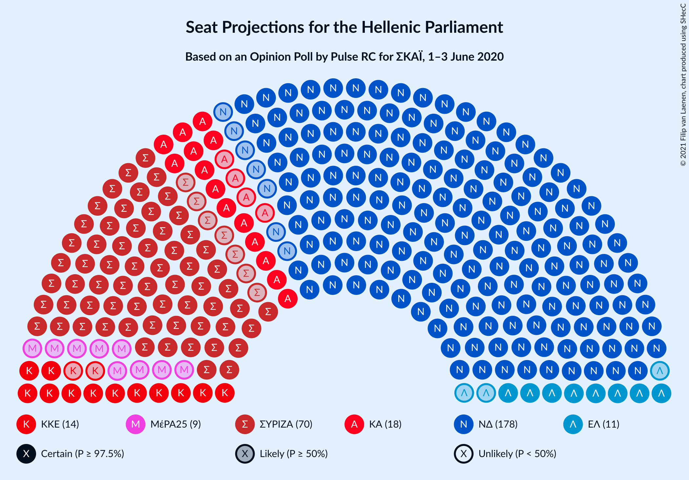
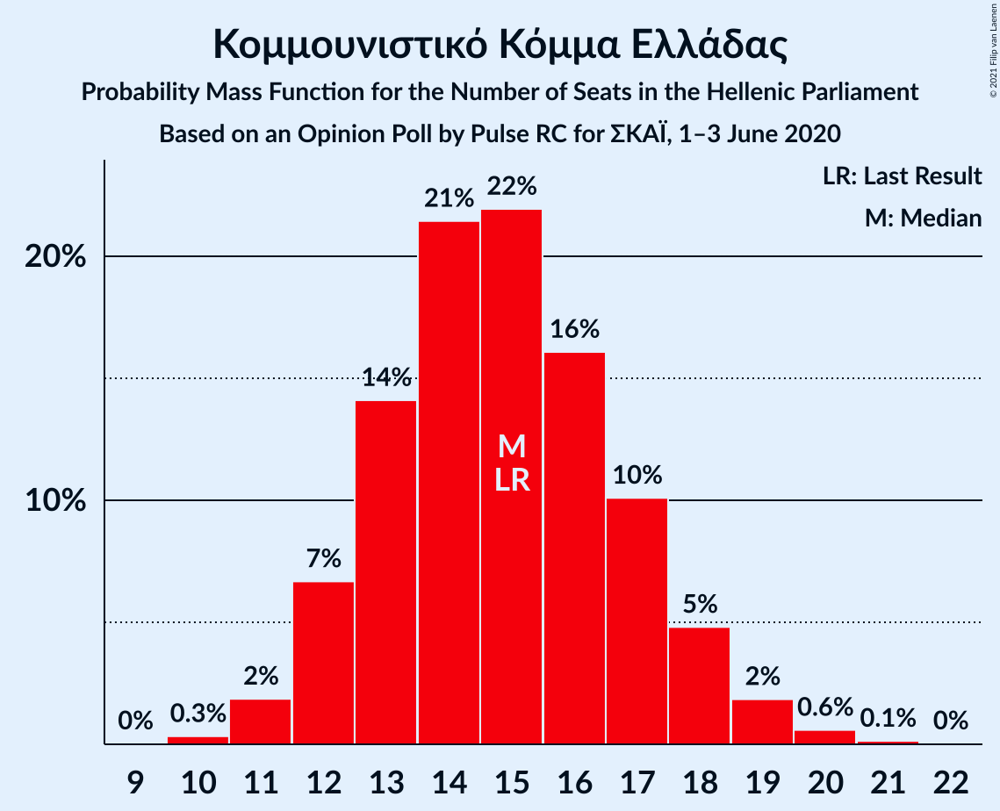
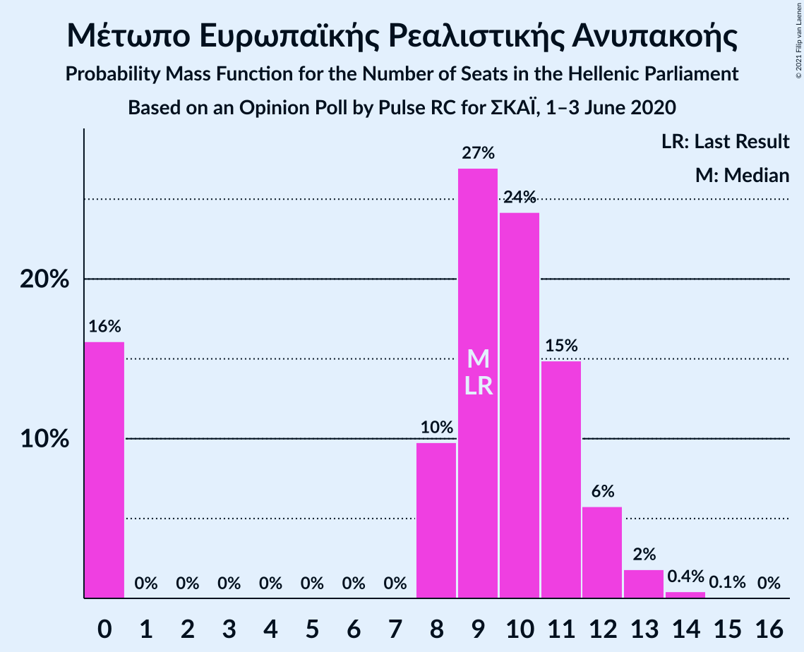
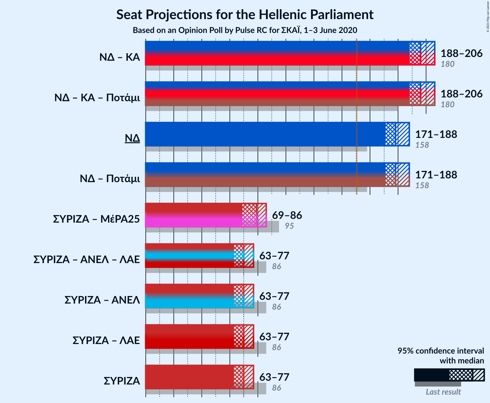
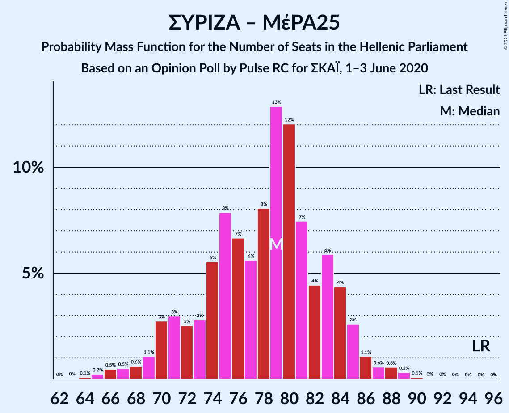

# Opinion Poll by Pulse RC for ΣΚΑΪ, 1–3 June 2020

<a href="#voting-intentions">Voting Intentions</a> | <a href="#seats">Seats</a> | <a href="#coalitions">Coalitions</a> | <a href="#technical-information">Technical Information</a>

## Voting Intentions

### Confidence Intervals

| Party | Last Result | Poll Result | 80% Confidence Interval | 90% Confidence Interval | 95% Confidence Interval | 99% Confidence Interval |
|:-----:|:-----------:|:-----------:|:-----------------------:|:-----------------------:|:-----------------------:|:-----------------------:|
| Νέα Δημοκρατία | 39.8% | 48.0% | 46.2–49.9% |45.6–50.4% |45.2–50.8% |44.3–51.7% |
| Συνασπισμός Ριζοσπαστικής Αριστεράς | 31.5% | 26.0% | 24.4–27.7% |24.0–28.1% |23.6–28.5% |22.8–29.4% |
| Κίνημα Αλλαγής | 8.1% | 6.5% | 5.7–7.5% |5.5–7.8% |5.3–8.1% |4.9–8.6% |
| Κομμουνιστικό Κόμμα Ελλάδας | 5.3% | 5.5% | 4.7–6.4% |4.5–6.7% |4.3–6.9% |4.0–7.4% |
| Ελληνική Λύση | 3.7% | 4.0% | 3.3–4.8% |3.2–5.0% |3.0–5.2% |2.7–5.7% |
| Μέτωπο Ευρωπαϊκής Ρεαλιστικής Ανυπακοής | 3.4% | 3.5% | 2.9–4.3% |2.7–4.5% |2.6–4.7% |2.3–5.1% |

*Note:* The poll result column reflects the actual value used in the calculations. Published results may vary slightly, and in addition be rounded to fewer digits.

## Seats

### Confidence Intervals

| Party | Last Result | Median | 80% Confidence Interval | 90% Confidence Interval | 95% Confidence Interval | 99% Confidence Interval |
|:-----:|:-----------:|:------:|:-----------------------:|:-----------------------:|:-----------------------:|:-----------------------:|
| <a href="#νέα-δημοκρατία">Νέα Δημοκρατία</a> | 158 | 178 | 174–184 |172–186 |171–188 |168–190 |
| <a href="#συνασπισμός-ριζοσπαστικής-αριστεράς">Συνασπισμός Ριζοσπαστικής Αριστεράς</a> | 86 | 70 | 65–74 |64–76 |63–77 |61–80 |
| <a href="#κίνημα-αλλαγής">Κίνημα Αλλαγής</a> | 22 | 18 | 15–20 |15–21 |14–22 |13–23 |
| <a href="#κομμουνιστικό-κόμμα-ελλάδας">Κομμουνιστικό Κόμμα Ελλάδας</a> | 15 | 15 | 13–17 |12–18 |12–19 |11–20 |
| <a href="#ελληνική-λύση">Ελληνική Λύση</a> | 10 | 11 | 9–13 |8–14 |8–14 |0–15 |
| <a href="#μέτωπο-ευρωπαϊκής-ρεαλιστικής-ανυπακοής">Μέτωπο Ευρωπαϊκής Ρεαλιστικής Ανυπακοής</a> | 9 | 9 | 0–11 |0–12 |0–12 |0–14 |

### Νέα Δημοκρατία

*For a full overview of the results for this party, see the [Νέα Δημοκρατία](party-νέαδημοκρατία.html) page.*

| Number of Seats | Probability | Accumulated | Special Marks |
|:---------------:|:-----------:|:-----------:|:-------------:|
| 158 | 0% | 100% | Last Result |
| 159 | 0% | 100% |  |
| 160 | 0% | 100% |  |
| 161 | 0% | 100% |  |
| 162 | 0% | 100% |  |
| 163 | 0% | 100% |  |
| 164 | 0% | 100% |  |
| 165 | 0% | 100% |  |
| 166 | 0.1% | 100% |  |
| 167 | 0.1% | 99.9% |  |
| 168 | 0.3% | 99.8% |  |
| 169 | 0.5% | 99.5% |  |
| 170 | 1.2% | 99.0% |  |
| 171 | 1.3% | 98% |  |
| 172 | 4% | 97% |  |
| 173 | 3% | 93% |  |
| 174 | 8% | 90% |  |
| 175 | 4% | 83% |  |
| 176 | 12% | 79% |  |
| 177 | 5% | 67% |  |
| 178 | 14% | 62% | Median |
| 179 | 6% | 49% |  |
| 180 | 13% | 43% |  |
| 181 | 4% | 30% |  |
| 182 | 9% | 26% |  |
| 183 | 3% | 17% |  |
| 184 | 5% | 14% |  |
| 185 | 2% | 9% |  |
| 186 | 3% | 7% |  |
| 187 | 0.9% | 4% |  |
| 188 | 2% | 3% |  |
| 189 | 0.5% | 2% |  |
| 190 | 0.5% | 1.0% |  |
| 191 | 0.2% | 0.5% |  |
| 192 | 0.1% | 0.3% |  |
| 193 | 0.1% | 0.2% |  |
| 194 | 0% | 0.1% |  |
| 195 | 0% | 0.1% |  |
| 196 | 0% | 0% |  |

### Συνασπισμός Ριζοσπαστικής Αριστεράς

*For a full overview of the results for this party, see the [Συνασπισμός Ριζοσπαστικής Αριστεράς](party-συνασπισμόςριζοσπαστικήςαριστεράς.html) page.*

| Number of Seats | Probability | Accumulated | Special Marks |
|:---------------:|:-----------:|:-----------:|:-------------:|
| 59 | 0.1% | 100% |  |
| 60 | 0.2% | 99.9% |  |
| 61 | 0.4% | 99.7% |  |
| 62 | 0.9% | 99.3% |  |
| 63 | 2% | 98% |  |
| 64 | 3% | 97% |  |
| 65 | 5% | 94% |  |
| 66 | 7% | 89% |  |
| 67 | 8% | 82% |  |
| 68 | 10% | 74% |  |
| 69 | 10% | 64% |  |
| 70 | 11% | 54% | Median |
| 71 | 13% | 43% |  |
| 72 | 9% | 30% |  |
| 73 | 6% | 21% |  |
| 74 | 5% | 14% |  |
| 75 | 4% | 10% |  |
| 76 | 3% | 6% |  |
| 77 | 2% | 3% |  |
| 78 | 0.6% | 2% |  |
| 79 | 0.4% | 1.0% |  |
| 80 | 0.3% | 0.5% |  |
| 81 | 0.2% | 0.2% |  |
| 82 | 0% | 0.1% |  |
| 83 | 0% | 0% |  |
| 84 | 0% | 0% |  |
| 85 | 0% | 0% |  |
| 86 | 0% | 0% | Last Result |

### Κίνημα Αλλαγής

*For a full overview of the results for this party, see the [Κίνημα Αλλαγής](party-κίνημααλλαγής.html) page.*

| Number of Seats | Probability | Accumulated | Special Marks |
|:---------------:|:-----------:|:-----------:|:-------------:|
| 12 | 0.1% | 100% |  |
| 13 | 0.8% | 99.9% |  |
| 14 | 3% | 99.1% |  |
| 15 | 8% | 96% |  |
| 16 | 15% | 87% |  |
| 17 | 19% | 73% |  |
| 18 | 21% | 54% | Median |
| 19 | 15% | 33% |  |
| 20 | 10% | 18% |  |
| 21 | 5% | 8% |  |
| 22 | 2% | 3% | Last Result |
| 23 | 0.7% | 1.0% |  |
| 24 | 0.3% | 0.3% |  |
| 25 | 0.1% | 0.1% |  |
| 26 | 0% | 0% |  |

### Κομμουνιστικό Κόμμα Ελλάδας

*For a full overview of the results for this party, see the [Κομμουνιστικό Κόμμα Ελλάδας](party-κομμουνιστικόκόμμαελλάδας.html) page.*

| Number of Seats | Probability | Accumulated | Special Marks |
|:---------------:|:-----------:|:-----------:|:-------------:|
| 10 | 0.3% | 100% |  |
| 11 | 2% | 99.6% |  |
| 12 | 7% | 98% |  |
| 13 | 14% | 91% |  |
| 14 | 21% | 77% |  |
| 15 | 22% | 56% | Last Result, Median |
| 16 | 16% | 34% |  |
| 17 | 10% | 18% |  |
| 18 | 5% | 7% |  |
| 19 | 2% | 3% |  |
| 20 | 0.6% | 0.8% |  |
| 21 | 0.1% | 0.2% |  |
| 22 | 0% | 0% |  |

### Ελληνική Λύση

*For a full overview of the results for this party, see the [Ελληνική Λύση](party-ελληνικήλύση.html) page.*

| Number of Seats | Probability | Accumulated | Special Marks |
|:---------------:|:-----------:|:-----------:|:-------------:|
| 0 | 2% | 100% |  |
| 1 | 0% | 98% |  |
| 2 | 0% | 98% |  |
| 3 | 0% | 98% |  |
| 4 | 0% | 98% |  |
| 5 | 0% | 98% |  |
| 6 | 0% | 98% |  |
| 7 | 0% | 98% |  |
| 8 | 3% | 98% |  |
| 9 | 14% | 95% |  |
| 10 | 23% | 81% | Last Result |
| 11 | 26% | 58% | Median |
| 12 | 18% | 32% |  |
| 13 | 9% | 14% |  |
| 14 | 4% | 5% |  |
| 15 | 1.1% | 1.4% |  |
| 16 | 0.2% | 0.3% |  |
| 17 | 0% | 0.1% |  |
| 18 | 0% | 0% |  |

### Μέτωπο Ευρωπαϊκής Ρεαλιστικής Ανυπακοής

*For a full overview of the results for this party, see the [Μέτωπο Ευρωπαϊκής Ρεαλιστικής Ανυπακοής](party-μέτωποευρωπαϊκήςρεαλιστικήςανυπακοής.html) page.*

| Number of Seats | Probability | Accumulated | Special Marks |
|:---------------:|:-----------:|:-----------:|:-------------:|
| 0 | 16% | 100% |  |
| 1 | 0% | 84% |  |
| 2 | 0% | 84% |  |
| 3 | 0% | 84% |  |
| 4 | 0% | 84% |  |
| 5 | 0% | 84% |  |
| 6 | 0% | 84% |  |
| 7 | 0% | 84% |  |
| 8 | 10% | 84% |  |
| 9 | 27% | 74% | Last Result, Median |
| 10 | 24% | 47% |  |
| 11 | 15% | 23% |  |
| 12 | 6% | 8% |  |
| 13 | 2% | 2% |  |
| 14 | 0.4% | 0.5% |  |
| 15 | 0.1% | 0.1% |  |
| 16 | 0% | 0% |  |

## Coalitions

### Confidence Intervals

| Coalition | Last Result | Median | Majority? | 80% Confidence Interval | 90% Confidence Interval | 95% Confidence Interval | 99% Confidence Interval |
|:---------:|:-----------:|:------:|:---------:|:-----------------------:|:-----------------------:|:-----------------------:|:-----------------------:|
| Νέα Δημοκρατία – Κίνημα Αλλαγής | 180 | 196 | 100% | 191–202 | 190–204 | 188–206 | 186–209 |
| Νέα Δημοκρατία | 158 | 178 | 100% | 174–184 | 172–186 | 171–188 | 168–190 |
| Συνασπισμός Ριζοσπαστικής Αριστεράς – Μέτωπο Ευρωπαϊκής Ρεαλιστικής Ανυπακοής | 95 | 79 | 0% | 72–83 | 70–85 | 69–86 | 66–88 |
| Συνασπισμός Ριζοσπαστικής Αριστεράς | 86 | 70 | 0% | 65–74 | 64–76 | 63–77 | 61–80 |

### Νέα Δημοκρατία – Κίνημα Αλλαγής

| Number of Seats | Probability | Accumulated | Special Marks |
|:---------------:|:-----------:|:-----------:|:-------------:|
| 180 | 0% | 100% | Last Result |
| 181 | 0% | 100% |  |
| 182 | 0% | 100% |  |
| 183 | 0% | 100% |  |
| 184 | 0.1% | 100% |  |
| 185 | 0.2% | 99.9% |  |
| 186 | 0.3% | 99.7% |  |
| 187 | 0.7% | 99.4% |  |
| 188 | 1.3% | 98.7% |  |
| 189 | 2% | 97% |  |
| 190 | 3% | 96% |  |
| 191 | 5% | 92% |  |
| 192 | 6% | 88% |  |
| 193 | 7% | 82% |  |
| 194 | 9% | 75% |  |
| 195 | 9% | 66% |  |
| 196 | 10% | 57% | Median |
| 197 | 9% | 47% |  |
| 198 | 8% | 38% |  |
| 199 | 7% | 30% |  |
| 200 | 6% | 23% |  |
| 201 | 5% | 17% |  |
| 202 | 3% | 13% |  |
| 203 | 3% | 9% |  |
| 204 | 2% | 6% |  |
| 205 | 1.4% | 4% |  |
| 206 | 1.1% | 3% |  |
| 207 | 0.7% | 2% |  |
| 208 | 0.4% | 1.1% |  |
| 209 | 0.3% | 0.7% |  |
| 210 | 0.2% | 0.4% |  |
| 211 | 0.1% | 0.2% |  |
| 212 | 0.1% | 0.1% |  |
| 213 | 0% | 0.1% |  |
| 214 | 0% | 0% |  |

### Νέα Δημοκρατία

| Number of Seats | Probability | Accumulated | Special Marks |
|:---------------:|:-----------:|:-----------:|:-------------:|
| 158 | 0% | 100% | Last Result |
| 159 | 0% | 100% |  |
| 160 | 0% | 100% |  |
| 161 | 0% | 100% |  |
| 162 | 0% | 100% |  |
| 163 | 0% | 100% |  |
| 164 | 0% | 100% |  |
| 165 | 0% | 100% |  |
| 166 | 0.1% | 100% |  |
| 167 | 0.1% | 99.9% |  |
| 168 | 0.3% | 99.8% |  |
| 169 | 0.5% | 99.5% |  |
| 170 | 1.2% | 99.0% |  |
| 171 | 1.3% | 98% |  |
| 172 | 4% | 97% |  |
| 173 | 3% | 93% |  |
| 174 | 8% | 90% |  |
| 175 | 4% | 83% |  |
| 176 | 12% | 79% |  |
| 177 | 5% | 67% |  |
| 178 | 14% | 62% | Median |
| 179 | 6% | 49% |  |
| 180 | 13% | 43% |  |
| 181 | 4% | 30% |  |
| 182 | 9% | 26% |  |
| 183 | 3% | 17% |  |
| 184 | 5% | 14% |  |
| 185 | 2% | 9% |  |
| 186 | 3% | 7% |  |
| 187 | 0.9% | 4% |  |
| 188 | 2% | 3% |  |
| 189 | 0.5% | 2% |  |
| 190 | 0.5% | 1.0% |  |
| 191 | 0.2% | 0.5% |  |
| 192 | 0.1% | 0.3% |  |
| 193 | 0.1% | 0.2% |  |
| 194 | 0% | 0.1% |  |
| 195 | 0% | 0.1% |  |
| 196 | 0% | 0% |  |

### Συνασπισμός Ριζοσπαστικής Αριστεράς – Μέτωπο Ευρωπαϊκής Ρεαλιστικής Ανυπακοής

| Number of Seats | Probability | Accumulated | Special Marks |
|:---------------:|:-----------:|:-----------:|:-------------:|
| 63 | 0% | 100% |  |
| 64 | 0.1% | 99.9% |  |
| 65 | 0.2% | 99.9% |  |
| 66 | 0.5% | 99.6% |  |
| 67 | 0.5% | 99.2% |  |
| 68 | 0.6% | 98.7% |  |
| 69 | 1.1% | 98% |  |
| 70 | 3% | 97% |  |
| 71 | 3% | 94% |  |
| 72 | 3% | 91% |  |
| 73 | 3% | 89% |  |
| 74 | 6% | 86% |  |
| 75 | 8% | 80% |  |
| 76 | 7% | 73% |  |
| 77 | 6% | 66% |  |
| 78 | 8% | 60% |  |
| 79 | 13% | 52% | Median |
| 80 | 12% | 39% |  |
| 81 | 7% | 27% |  |
| 82 | 4% | 20% |  |
| 83 | 6% | 15% |  |
| 84 | 4% | 10% |  |
| 85 | 3% | 5% |  |
| 86 | 1.1% | 3% |  |
| 87 | 0.6% | 2% |  |
| 88 | 0.6% | 1.0% |  |
| 89 | 0.3% | 0.5% |  |
| 90 | 0.1% | 0.1% |  |
| 91 | 0% | 0.1% |  |
| 92 | 0% | 0% |  |
| 93 | 0% | 0% |  |
| 94 | 0% | 0% |  |
| 95 | 0% | 0% | Last Result |

### Συνασπισμός Ριζοσπαστικής Αριστεράς

| Number of Seats | Probability | Accumulated | Special Marks |
|:---------------:|:-----------:|:-----------:|:-------------:|
| 59 | 0.1% | 100% |  |
| 60 | 0.2% | 99.9% |  |
| 61 | 0.4% | 99.7% |  |
| 62 | 0.9% | 99.3% |  |
| 63 | 2% | 98% |  |
| 64 | 3% | 97% |  |
| 65 | 5% | 94% |  |
| 66 | 7% | 89% |  |
| 67 | 8% | 82% |  |
| 68 | 10% | 74% |  |
| 69 | 10% | 64% |  |
| 70 | 11% | 54% | Median |
| 71 | 13% | 43% |  |
| 72 | 9% | 30% |  |
| 73 | 6% | 21% |  |
| 74 | 5% | 14% |  |
| 75 | 4% | 10% |  |
| 76 | 3% | 6% |  |
| 77 | 2% | 3% |  |
| 78 | 0.6% | 2% |  |
| 79 | 0.4% | 1.0% |  |
| 80 | 0.3% | 0.5% |  |
| 81 | 0.2% | 0.2% |  |
| 82 | 0% | 0.1% |  |
| 83 | 0% | 0% |  |
| 84 | 0% | 0% |  |
| 85 | 0% | 0% |  |
| 86 | 0% | 0% | Last Result |

## Technical Information

### Opinion Poll

+ **Polling firm:** Pulse RC
+ **Commissioner(s):** ΣΚΑΪ
+ **Fieldwork period:** 1–3 June 2020

### Calculations

+ **Sample size:** 1208
+ **Simulations done:** 1,048,576
+ **Error estimate:** 0.35%

