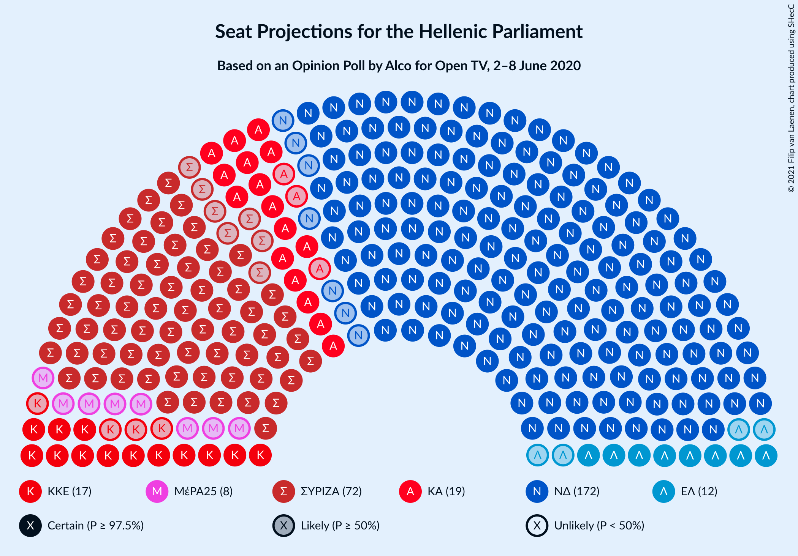
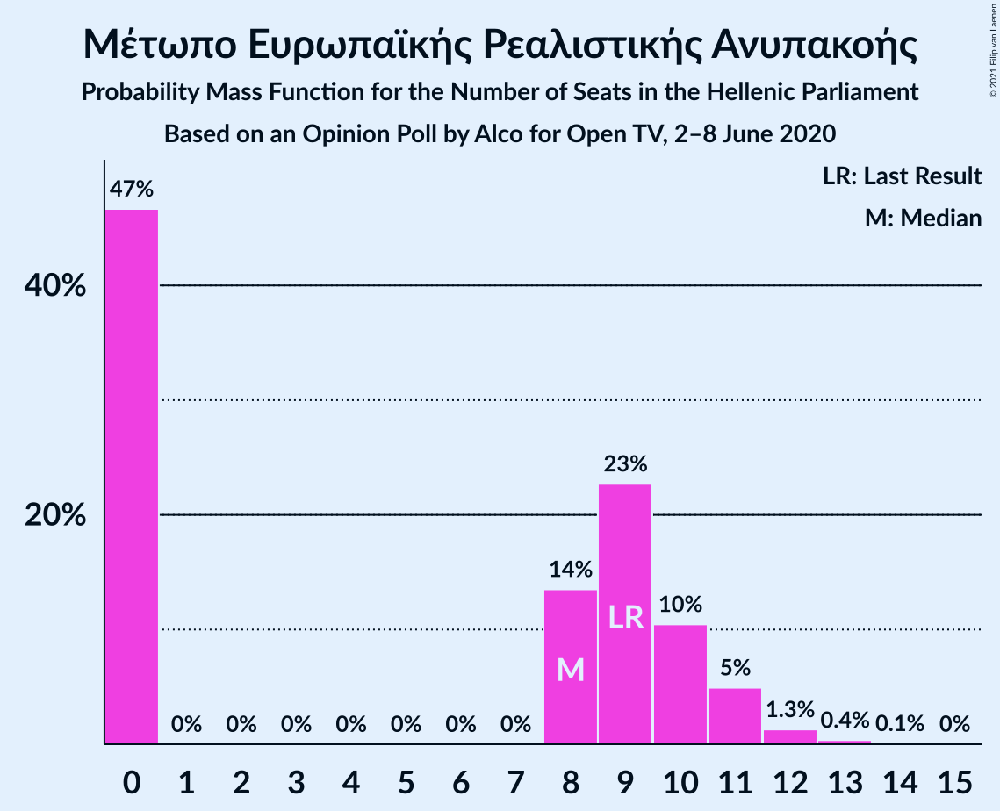
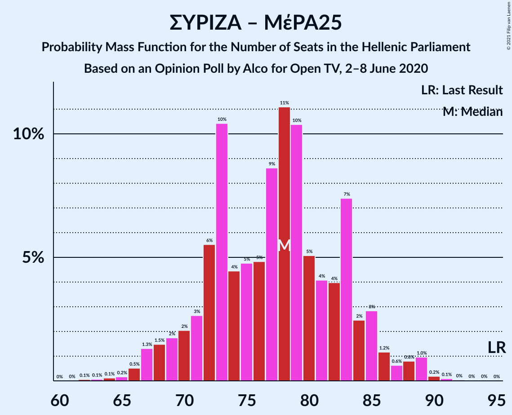

# Opinion Poll by Alco for Open TV, 2–8 June 2020

<a href="#voting-intentions">Voting Intentions</a> | <a href="#seats">Seats</a> | <a href="#coalitions">Coalitions</a> | <a href="#technical-information">Technical Information</a>

## Voting Intentions

### Confidence Intervals

| Party | Last Result | Poll Result | 80% Confidence Interval | 90% Confidence Interval | 95% Confidence Interval | 99% Confidence Interval |
|:-----:|:-----------:|:-----------:|:-----------------------:|:-----------------------:|:-----------------------:|:-----------------------:|
| Νέα Δημοκρατία | 39.8% | 46.1% | 44.1–48.1% |43.5–48.7% |43.0–49.2% |42.1–50.2% |
| Συνασπισμός Ριζοσπαστικής Αριστεράς | 31.5% | 26.8% | 25.1–28.7% |24.6–29.2% |24.1–29.6% |23.3–30.5% |
| Κίνημα Αλλαγής | 8.1% | 7.4% | 6.4–8.6% |6.2–8.9% |5.9–9.2% |5.5–9.8% |
| Κομμουνιστικό Κόμμα Ελλάδας | 5.3% | 6.1% | 5.2–7.2% |5.0–7.5% |4.8–7.8% |4.4–8.3% |
| Ελληνική Λύση | 3.7% | 4.2% | 3.5–5.1% |3.3–5.4% |3.1–5.6% |2.8–6.1% |
| Μέτωπο Ευρωπαϊκής Ρεαλιστικής Ανυπακοής | 3.4% | 3.0% | 2.4–3.8% |2.2–4.1% |2.1–4.3% |1.9–4.7% |
| Χρυσή Αυγή | 2.9% | 1.6% | 1.2–2.2% |1.1–2.4% |1.0–2.6% |0.8–2.9% |
| Πλεύση Ελευθερίας | 1.5% | 1.2% | 0.9–1.8% |0.8–1.9% |0.7–2.1% |0.5–2.4% |

*Note:* The poll result column reflects the actual value used in the calculations. Published results may vary slightly, and in addition be rounded to fewer digits.

## Seats

### Confidence Intervals

| Party | Last Result | Median | 80% Confidence Interval | 90% Confidence Interval | 95% Confidence Interval | 99% Confidence Interval |
|:-----:|:-----------:|:------:|:-----------------------:|:-----------------------:|:-----------------------:|:-----------------------:|
| <a href="#νέα-δημοκρατία">Νέα Δημοκρατία</a> | 158 | 175 | 168–180 |165–182 |164–185 |163–187 |
| <a href="#συνασπισμός-ριζοσπαστικής-αριστεράς">Συνασπισμός Ριζοσπαστικής Αριστεράς</a> | 86 | 73 | 68–78 |66–80 |66–82 |62–83 |
| <a href="#κίνημα-αλλαγής">Κίνημα Αλλαγής</a> | 22 | 20 | 17–24 |16–24 |16–25 |15–26 |
| <a href="#κομμουνιστικό-κόμμα-ελλάδας">Κομμουνιστικό Κόμμα Ελλάδας</a> | 15 | 18 | 14–20 |14–20 |13–21 |12–22 |
| <a href="#ελληνική-λύση">Ελληνική Λύση</a> | 10 | 11 | 10–14 |9–14 |0–15 |0–16 |
| <a href="#μέτωπο-ευρωπαϊκής-ρεαλιστικής-ανυπακοής">Μέτωπο Ευρωπαϊκής Ρεαλιστικής Ανυπακοής</a> | 9 | 0 | 0–10 |0–11 |0–11 |0–13 |
| <a href="#χρυσή-αυγή">Χρυσή Αυγή</a> | 0 | 0 | 0 |0 |0 |0 |
| <a href="#πλεύση-ελευθερίας">Πλεύση Ελευθερίας</a> | 0 | 0 | 0 |0 |0 |0 |

### Νέα Δημοκρατία

*For a full overview of the results for this party, see the [Νέα Δημοκρατία](party-νέαδημοκρατία.html) page.*

| Number of Seats | Probability | Accumulated | Special Marks |
|:---------------:|:-----------:|:-----------:|:-------------:|
| 158 | 0% | 100% | Last Result |
| 159 | 0% | 100% |  |
| 160 | 0% | 100% |  |
| 161 | 0.2% | 99.9% |  |
| 162 | 0.1% | 99.8% |  |
| 163 | 0.7% | 99.7% |  |
| 164 | 2% | 99.0% |  |
| 165 | 2% | 96% |  |
| 166 | 2% | 94% |  |
| 167 | 0.7% | 92% |  |
| 168 | 1.4% | 91% |  |
| 169 | 2% | 90% |  |
| 170 | 8% | 88% |  |
| 171 | 6% | 80% |  |
| 172 | 3% | 73% |  |
| 173 | 4% | 70% |  |
| 174 | 9% | 66% |  |
| 175 | 10% | 57% | Median |
| 176 | 18% | 47% |  |
| 177 | 10% | 29% |  |
| 178 | 7% | 20% |  |
| 179 | 2% | 13% |  |
| 180 | 2% | 10% |  |
| 181 | 1.3% | 8% |  |
| 182 | 3% | 7% |  |
| 183 | 0.5% | 5% |  |
| 184 | 0.3% | 4% |  |
| 185 | 2% | 4% |  |
| 186 | 0.5% | 1.3% |  |
| 187 | 0.7% | 0.9% |  |
| 188 | 0.1% | 0.2% |  |
| 189 | 0% | 0.1% |  |
| 190 | 0% | 0.1% |  |
| 191 | 0% | 0% |  |

### Συνασπισμός Ριζοσπαστικής Αριστεράς

*For a full overview of the results for this party, see the [Συνασπισμός Ριζοσπαστικής Αριστεράς](party-συνασπισμόςριζοσπαστικήςαριστεράς.html) page.*

| Number of Seats | Probability | Accumulated | Special Marks |
|:---------------:|:-----------:|:-----------:|:-------------:|
| 60 | 0.1% | 100% |  |
| 61 | 0.1% | 99.9% |  |
| 62 | 0.5% | 99.8% |  |
| 63 | 0.2% | 99.3% |  |
| 64 | 0.5% | 99.1% |  |
| 65 | 0.9% | 98.6% |  |
| 66 | 3% | 98% |  |
| 67 | 4% | 95% |  |
| 68 | 2% | 91% |  |
| 69 | 12% | 88% |  |
| 70 | 2% | 76% |  |
| 71 | 6% | 74% |  |
| 72 | 15% | 67% |  |
| 73 | 21% | 52% | Median |
| 74 | 6% | 31% |  |
| 75 | 3% | 26% |  |
| 76 | 5% | 23% |  |
| 77 | 5% | 18% |  |
| 78 | 3% | 13% |  |
| 79 | 1.4% | 9% |  |
| 80 | 4% | 8% |  |
| 81 | 0.8% | 3% |  |
| 82 | 2% | 3% |  |
| 83 | 0.6% | 0.8% |  |
| 84 | 0.1% | 0.2% |  |
| 85 | 0% | 0.1% |  |
| 86 | 0.1% | 0.1% | Last Result |
| 87 | 0% | 0% |  |

### Κίνημα Αλλαγής

*For a full overview of the results for this party, see the [Κίνημα Αλλαγής](party-κίνημααλλαγής.html) page.*

| Number of Seats | Probability | Accumulated | Special Marks |
|:---------------:|:-----------:|:-----------:|:-------------:|
| 14 | 0.4% | 100% |  |
| 15 | 0.6% | 99.6% |  |
| 16 | 4% | 98.9% |  |
| 17 | 9% | 95% |  |
| 18 | 9% | 86% |  |
| 19 | 7% | 77% |  |
| 20 | 28% | 70% | Median |
| 21 | 15% | 42% |  |
| 22 | 13% | 27% | Last Result |
| 23 | 3% | 14% |  |
| 24 | 7% | 11% |  |
| 25 | 3% | 4% |  |
| 26 | 0.9% | 1.3% |  |
| 27 | 0.2% | 0.4% |  |
| 28 | 0.2% | 0.2% |  |
| 29 | 0% | 0% |  |

### Κομμουνιστικό Κόμμα Ελλάδας

*For a full overview of the results for this party, see the [Κομμουνιστικό Κόμμα Ελλάδας](party-κομμουνιστικόκόμμαελλάδας.html) page.*

| Number of Seats | Probability | Accumulated | Special Marks |
|:---------------:|:-----------:|:-----------:|:-------------:|
| 11 | 0.2% | 100% |  |
| 12 | 1.3% | 99.8% |  |
| 13 | 2% | 98.5% |  |
| 14 | 9% | 96% |  |
| 15 | 7% | 87% | Last Result |
| 16 | 11% | 80% |  |
| 17 | 13% | 69% |  |
| 18 | 28% | 56% | Median |
| 19 | 10% | 28% |  |
| 20 | 14% | 17% |  |
| 21 | 3% | 4% |  |
| 22 | 0.8% | 1.2% |  |
| 23 | 0.3% | 0.4% |  |
| 24 | 0.1% | 0.1% |  |
| 25 | 0% | 0.1% |  |
| 26 | 0% | 0% |  |

### Ελληνική Λύση

*For a full overview of the results for this party, see the [Ελληνική Λύση](party-ελληνικήλύση.html) page.*

| Number of Seats | Probability | Accumulated | Special Marks |
|:---------------:|:-----------:|:-----------:|:-------------:|
| 0 | 3% | 100% |  |
| 1 | 0% | 97% |  |
| 2 | 0% | 97% |  |
| 3 | 0% | 97% |  |
| 4 | 0% | 97% |  |
| 5 | 0% | 97% |  |
| 6 | 0% | 97% |  |
| 7 | 0% | 97% |  |
| 8 | 0.5% | 97% |  |
| 9 | 5% | 96% |  |
| 10 | 18% | 91% | Last Result |
| 11 | 28% | 74% | Median |
| 12 | 9% | 45% |  |
| 13 | 25% | 36% |  |
| 14 | 7% | 11% |  |
| 15 | 3% | 4% |  |
| 16 | 1.2% | 2% |  |
| 17 | 0.2% | 0.3% |  |
| 18 | 0.1% | 0.1% |  |
| 19 | 0% | 0% |  |

### Μέτωπο Ευρωπαϊκής Ρεαλιστικής Ανυπακοής

*For a full overview of the results for this party, see the [Μέτωπο Ευρωπαϊκής Ρεαλιστικής Ανυπακοής](party-μέτωποευρωπαϊκήςρεαλιστικήςανυπακοής.html) page.*

| Number of Seats | Probability | Accumulated | Special Marks |
|:---------------:|:-----------:|:-----------:|:-------------:|
| 0 | 59% | 100% | Median |
| 1 | 0% | 41% |  |
| 2 | 0% | 41% |  |
| 3 | 0% | 41% |  |
| 4 | 0% | 41% |  |
| 5 | 0% | 41% |  |
| 6 | 0% | 41% |  |
| 7 | 0% | 41% |  |
| 8 | 8% | 41% |  |
| 9 | 20% | 33% | Last Result |
| 10 | 7% | 13% |  |
| 11 | 4% | 6% |  |
| 12 | 2% | 2% |  |
| 13 | 0.4% | 0.5% |  |
| 14 | 0.1% | 0.1% |  |
| 15 | 0% | 0% |  |

### Χρυσή Αυγή

*For a full overview of the results for this party, see the [Χρυσή Αυγή](party-χρυσήαυγή.html) page.*

| Number of Seats | Probability | Accumulated | Special Marks |
|:---------------:|:-----------:|:-----------:|:-------------:|
| 0 | 99.6% | 100% | Last Result, Median |
| 1 | 0% | 0.4% |  |
| 2 | 0% | 0.4% |  |
| 3 | 0% | 0.4% |  |
| 4 | 0% | 0.4% |  |
| 5 | 0% | 0.4% |  |
| 6 | 0% | 0.4% |  |
| 7 | 0% | 0.4% |  |
| 8 | 0.3% | 0.4% |  |
| 9 | 0.1% | 0.1% |  |
| 10 | 0% | 0% |  |

### Πλεύση Ελευθερίας

*For a full overview of the results for this party, see the [Πλεύση Ελευθερίας](party-πλεύσηελευθερίας.html) page.*

| Number of Seats | Probability | Accumulated | Special Marks |
|:---------------:|:-----------:|:-----------:|:-------------:|
| 0 | 100% | 100% | Last Result, Median |

## Coalitions

### Confidence Intervals

| Coalition | Last Result | Median | Majority? | 80% Confidence Interval | 90% Confidence Interval | 95% Confidence Interval | 99% Confidence Interval |
|:---------:|:-----------:|:------:|:---------:|:-----------------------:|:-----------------------:|:-----------------------:|:-----------------------:|
| Νέα Δημοκρατία – Κίνημα Αλλαγής | 180 | 196 | 100% | 188–200 | 185–203 | 183–205 | 183–207 |
| Νέα Δημοκρατία | 158 | 175 | 100% | 168–180 | 165–182 | 164–185 | 163–187 |
| Συνασπισμός Ριζοσπαστικής Αριστεράς – Μέτωπο Ευρωπαϊκής Ρεαλιστικής Ανυπακοής | 95 | 76 | 0% | 72–83 | 70–87 | 67–88 | 66–89 |
| Συνασπισμός Ριζοσπαστικής Αριστεράς | 86 | 73 | 0% | 68–78 | 66–80 | 66–82 | 62–83 |

### Νέα Δημοκρατία – Κίνημα Αλλαγής

| Number of Seats | Probability | Accumulated | Special Marks |
|:---------------:|:-----------:|:-----------:|:-------------:|
| 180 | 0% | 100% | Last Result |
| 181 | 0.1% | 99.9% |  |
| 182 | 0.3% | 99.8% |  |
| 183 | 2% | 99.5% |  |
| 184 | 0.5% | 97% |  |
| 185 | 4% | 97% |  |
| 186 | 1.1% | 93% |  |
| 187 | 1.1% | 92% |  |
| 188 | 3% | 91% |  |
| 189 | 1.5% | 89% |  |
| 190 | 3% | 87% |  |
| 191 | 7% | 84% |  |
| 192 | 10% | 78% |  |
| 193 | 4% | 68% |  |
| 194 | 9% | 64% |  |
| 195 | 3% | 54% | Median |
| 196 | 20% | 52% |  |
| 197 | 5% | 31% |  |
| 198 | 4% | 27% |  |
| 199 | 12% | 23% |  |
| 200 | 2% | 11% |  |
| 201 | 0.9% | 8% |  |
| 202 | 0.5% | 7% |  |
| 203 | 2% | 7% |  |
| 204 | 1.1% | 4% |  |
| 205 | 2% | 3% |  |
| 206 | 0.4% | 1.1% |  |
| 207 | 0.3% | 0.7% |  |
| 208 | 0.3% | 0.4% |  |
| 209 | 0.1% | 0.2% |  |
| 210 | 0% | 0.1% |  |
| 211 | 0% | 0.1% |  |
| 212 | 0% | 0% |  |

### Νέα Δημοκρατία

| Number of Seats | Probability | Accumulated | Special Marks |
|:---------------:|:-----------:|:-----------:|:-------------:|
| 158 | 0% | 100% | Last Result |
| 159 | 0% | 100% |  |
| 160 | 0% | 100% |  |
| 161 | 0.2% | 99.9% |  |
| 162 | 0.1% | 99.8% |  |
| 163 | 0.7% | 99.7% |  |
| 164 | 2% | 99.0% |  |
| 165 | 2% | 96% |  |
| 166 | 2% | 94% |  |
| 167 | 0.7% | 92% |  |
| 168 | 1.4% | 91% |  |
| 169 | 2% | 90% |  |
| 170 | 8% | 88% |  |
| 171 | 6% | 80% |  |
| 172 | 3% | 73% |  |
| 173 | 4% | 70% |  |
| 174 | 9% | 66% |  |
| 175 | 10% | 57% | Median |
| 176 | 18% | 47% |  |
| 177 | 10% | 29% |  |
| 178 | 7% | 20% |  |
| 179 | 2% | 13% |  |
| 180 | 2% | 10% |  |
| 181 | 1.3% | 8% |  |
| 182 | 3% | 7% |  |
| 183 | 0.5% | 5% |  |
| 184 | 0.3% | 4% |  |
| 185 | 2% | 4% |  |
| 186 | 0.5% | 1.3% |  |
| 187 | 0.7% | 0.9% |  |
| 188 | 0.1% | 0.2% |  |
| 189 | 0% | 0.1% |  |
| 190 | 0% | 0.1% |  |
| 191 | 0% | 0% |  |

### Συνασπισμός Ριζοσπαστικής Αριστεράς – Μέτωπο Ευρωπαϊκής Ρεαλιστικής Ανυπακοής

| Number of Seats | Probability | Accumulated | Special Marks |
|:---------------:|:-----------:|:-----------:|:-------------:|
| 63 | 0.1% | 100% |  |
| 64 | 0.1% | 99.9% |  |
| 65 | 0.1% | 99.8% |  |
| 66 | 0.5% | 99.8% |  |
| 67 | 2% | 99.3% |  |
| 68 | 0.6% | 97% |  |
| 69 | 1.2% | 97% |  |
| 70 | 1.1% | 96% |  |
| 71 | 3% | 94% |  |
| 72 | 10% | 91% |  |
| 73 | 21% | 81% | Median |
| 74 | 4% | 60% |  |
| 75 | 4% | 57% |  |
| 76 | 5% | 53% |  |
| 77 | 7% | 48% |  |
| 78 | 8% | 41% |  |
| 79 | 6% | 32% |  |
| 80 | 6% | 27% |  |
| 81 | 5% | 21% |  |
| 82 | 2% | 16% |  |
| 83 | 4% | 13% |  |
| 84 | 3% | 9% |  |
| 85 | 1.0% | 7% |  |
| 86 | 0.5% | 6% |  |
| 87 | 0.8% | 5% |  |
| 88 | 2% | 5% |  |
| 89 | 2% | 2% |  |
| 90 | 0.3% | 0.4% |  |
| 91 | 0.1% | 0.2% |  |
| 92 | 0% | 0.1% |  |
| 93 | 0% | 0% |  |
| 94 | 0% | 0% |  |
| 95 | 0% | 0% | Last Result |

### Συνασπισμός Ριζοσπαστικής Αριστεράς

| Number of Seats | Probability | Accumulated | Special Marks |
|:---------------:|:-----------:|:-----------:|:-------------:|
| 60 | 0.1% | 100% |  |
| 61 | 0.1% | 99.9% |  |
| 62 | 0.5% | 99.8% |  |
| 63 | 0.2% | 99.3% |  |
| 64 | 0.5% | 99.1% |  |
| 65 | 0.9% | 98.6% |  |
| 66 | 3% | 98% |  |
| 67 | 4% | 95% |  |
| 68 | 2% | 91% |  |
| 69 | 12% | 88% |  |
| 70 | 2% | 76% |  |
| 71 | 6% | 74% |  |
| 72 | 15% | 67% |  |
| 73 | 21% | 52% | Median |
| 74 | 6% | 31% |  |
| 75 | 3% | 26% |  |
| 76 | 5% | 23% |  |
| 77 | 5% | 18% |  |
| 78 | 3% | 13% |  |
| 79 | 1.4% | 9% |  |
| 80 | 4% | 8% |  |
| 81 | 0.8% | 3% |  |
| 82 | 2% | 3% |  |
| 83 | 0.6% | 0.8% |  |
| 84 | 0.1% | 0.2% |  |
| 85 | 0% | 0.1% |  |
| 86 | 0.1% | 0.1% | Last Result |
| 87 | 0% | 0% |  |

## Technical Information

### Opinion Poll

+ **Polling firm:** Alco
+ **Commissioner(s):** Open TV
+ **Fieldwork period:** 2–8 June 2020

### Calculations

+ **Sample size:** 1000
+ **Simulations done:** 131,072
+ **Error estimate:** 1.46%

