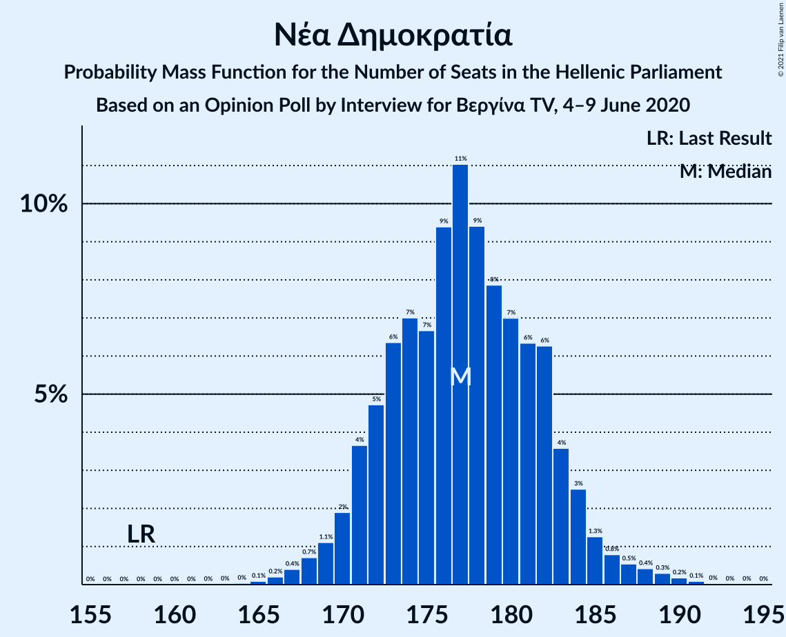
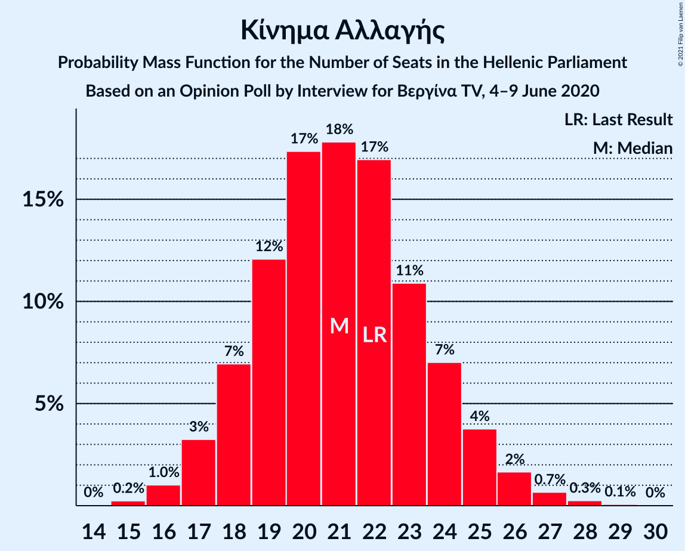

# Opinion Poll by Interview for Βεργίνα TV, 4–9 June 2020

<a href="#voting-intentions">Voting Intentions</a> | <a href="#seats">Seats</a> | <a href="#coalitions">Coalitions</a> | <a href="#technical-information">Technical Information</a>

## Voting Intentions

### Confidence Intervals

| Party | Last Result | Poll Result | 80% Confidence Interval | 90% Confidence Interval | 95% Confidence Interval | 99% Confidence Interval |
|:-----:|:-----------:|:-----------:|:-----------------------:|:-----------------------:|:-----------------------:|:-----------------------:|
| Νέα Δημοκρατία | 39.8% | 47.1% | 45.2–49.0% |44.6–49.6% |44.2–50.1% |43.2–51.0% |
| Συνασπισμός Ριζοσπαστικής Αριστεράς | 31.5% | 23.6% | 22.0–25.3% |21.6–25.8% |21.2–26.2% |20.5–27.1% |
| Κίνημα Αλλαγής | 8.1% | 7.7% | 6.8–8.9% |6.5–9.2% |6.3–9.5% |5.9–10.0% |
| Ελληνική Λύση | 3.7% | 5.2% | 4.4–6.1% |4.2–6.4% |4.0–6.7% |3.7–7.1% |
| Κομμουνιστικό Κόμμα Ελλάδας | 5.3% | 5.0% | 4.3–6.0% |4.0–6.2% |3.9–6.5% |3.5–7.0% |
| Μέτωπο Ευρωπαϊκής Ρεαλιστικής Ανυπακοής | 3.4% | 3.7% | 3.1–4.6% |2.9–4.8% |2.8–5.0% |2.5–5.5% |

*Note:* The poll result column reflects the actual value used in the calculations. Published results may vary slightly, and in addition be rounded to fewer digits.

## Seats

### Confidence Intervals

| Party | Last Result | Median | 80% Confidence Interval | 90% Confidence Interval | 95% Confidence Interval | 99% Confidence Interval |
|:-----:|:-----------:|:------:|:-----------------------:|:-----------------------:|:-----------------------:|:-----------------------:|
| <a href="#νέα-δημοκρατία">Νέα Δημοκρατία</a> | 158 | 176 | 173–183 |172–184 |170–185 |166–188 |
| <a href="#συνασπισμός-ριζοσπαστικής-αριστεράς">Συνασπισμός Ριζοσπαστικής Αριστεράς</a> | 86 | 64 | 59–69 |58–70 |57–72 |56–73 |
| <a href="#κίνημα-αλλαγής">Κίνημα Αλλαγής</a> | 22 | 21 | 18–24 |18–25 |17–26 |16–27 |
| <a href="#ελληνική-λύση">Ελληνική Λύση</a> | 10 | 15 | 12–16 |12–18 |12–18 |10–19 |
| <a href="#κομμουνιστικό-κόμμα-ελλάδας">Κομμουνιστικό Κόμμα Ελλάδας</a> | 15 | 14 | 11–16 |11–17 |10–18 |10–19 |
| <a href="#μέτωπο-ευρωπαϊκής-ρεαλιστικής-ανυπακοής">Μέτωπο Ευρωπαϊκής Ρεαλιστικής Ανυπακοής</a> | 9 | 10 | 8–12 |0–13 |0–13 |0–15 |

### Νέα Δημοκρατία

*For a full overview of the results for this party, see the [Νέα Δημοκρατία](party-νέαδημοκρατία.html) page.*

| Number of Seats | Probability | Accumulated | Special Marks |
|:---------------:|:-----------:|:-----------:|:-------------:|
| 158 | 0% | 100% | Last Result |
| 159 | 0% | 100% |  |
| 160 | 0% | 100% |  |
| 161 | 0% | 100% |  |
| 162 | 0% | 100% |  |
| 163 | 0% | 100% |  |
| 164 | 0.1% | 100% |  |
| 165 | 0.1% | 99.9% |  |
| 166 | 0.4% | 99.8% |  |
| 167 | 0.6% | 99.4% |  |
| 168 | 0.7% | 98.8% |  |
| 169 | 0.5% | 98% |  |
| 170 | 0.3% | 98% |  |
| 171 | 1.0% | 97% |  |
| 172 | 4% | 96% |  |
| 173 | 9% | 93% |  |
| 174 | 16% | 84% |  |
| 175 | 12% | 68% |  |
| 176 | 9% | 55% | Median |
| 177 | 7% | 46% |  |
| 178 | 3% | 39% |  |
| 179 | 3% | 37% |  |
| 180 | 4% | 33% |  |
| 181 | 7% | 29% |  |
| 182 | 9% | 22% |  |
| 183 | 7% | 13% |  |
| 184 | 4% | 7% |  |
| 185 | 1.4% | 3% |  |
| 186 | 0.6% | 1.5% |  |
| 187 | 0.2% | 0.9% |  |
| 188 | 0.2% | 0.7% |  |
| 189 | 0.2% | 0.5% |  |
| 190 | 0.1% | 0.2% |  |
| 191 | 0.1% | 0.1% |  |
| 192 | 0% | 0.1% |  |
| 193 | 0% | 0% |  |

### Συνασπισμός Ριζοσπαστικής Αριστεράς

*For a full overview of the results for this party, see the [Συνασπισμός Ριζοσπαστικής Αριστεράς](party-συνασπισμόςριζοσπαστικήςαριστεράς.html) page.*

| Number of Seats | Probability | Accumulated | Special Marks |
|:---------------:|:-----------:|:-----------:|:-------------:|
| 53 | 0% | 100% |  |
| 54 | 0.1% | 99.9% |  |
| 55 | 0.3% | 99.8% |  |
| 56 | 0.9% | 99.6% |  |
| 57 | 2% | 98.6% |  |
| 58 | 4% | 96% |  |
| 59 | 4% | 92% |  |
| 60 | 5% | 88% |  |
| 61 | 6% | 83% |  |
| 62 | 8% | 77% |  |
| 63 | 9% | 69% |  |
| 64 | 12% | 61% | Median |
| 65 | 12% | 49% |  |
| 66 | 8% | 37% |  |
| 67 | 9% | 29% |  |
| 68 | 9% | 20% |  |
| 69 | 4% | 11% |  |
| 70 | 3% | 7% |  |
| 71 | 2% | 4% |  |
| 72 | 2% | 3% |  |
| 73 | 0.8% | 1.1% |  |
| 74 | 0.2% | 0.3% |  |
| 75 | 0.1% | 0.2% |  |
| 76 | 0% | 0.1% |  |
| 77 | 0% | 0% |  |
| 78 | 0% | 0% |  |
| 79 | 0% | 0% |  |
| 80 | 0% | 0% |  |
| 81 | 0% | 0% |  |
| 82 | 0% | 0% |  |
| 83 | 0% | 0% |  |
| 84 | 0% | 0% |  |
| 85 | 0% | 0% |  |
| 86 | 0% | 0% | Last Result |

### Κίνημα Αλλαγής

*For a full overview of the results for this party, see the [Κίνημα Αλλαγής](party-κίνημααλλαγής.html) page.*

| Number of Seats | Probability | Accumulated | Special Marks |
|:---------------:|:-----------:|:-----------:|:-------------:|
| 15 | 0.2% | 100% |  |
| 16 | 1.0% | 99.7% |  |
| 17 | 3% | 98.7% |  |
| 18 | 8% | 95% |  |
| 19 | 12% | 88% |  |
| 20 | 18% | 75% |  |
| 21 | 18% | 58% | Median |
| 22 | 17% | 40% | Last Result |
| 23 | 10% | 23% |  |
| 24 | 7% | 13% |  |
| 25 | 3% | 6% |  |
| 26 | 2% | 3% |  |
| 27 | 0.5% | 1.0% |  |
| 28 | 0.3% | 0.4% |  |
| 29 | 0.1% | 0.1% |  |
| 30 | 0% | 0% |  |

### Ελληνική Λύση

*For a full overview of the results for this party, see the [Ελληνική Λύση](party-ελληνικήλύση.html) page.*

| Number of Seats | Probability | Accumulated | Special Marks |
|:---------------:|:-----------:|:-----------:|:-------------:|
| 9 | 0.4% | 100% |  |
| 10 | 0.7% | 99.6% | Last Result |
| 11 | 1.2% | 98.9% |  |
| 12 | 25% | 98% |  |
| 13 | 15% | 73% |  |
| 14 | 4% | 57% |  |
| 15 | 31% | 53% | Median |
| 16 | 15% | 23% |  |
| 17 | 1.2% | 8% |  |
| 18 | 5% | 7% |  |
| 19 | 2% | 2% |  |
| 20 | 0.1% | 0.2% |  |
| 21 | 0.1% | 0.1% |  |
| 22 | 0% | 0% |  |

### Κομμουνιστικό Κόμμα Ελλάδας

*For a full overview of the results for this party, see the [Κομμουνιστικό Κόμμα Ελλάδας](party-κομμουνιστικόκόμμαελλάδας.html) page.*

| Number of Seats | Probability | Accumulated | Special Marks |
|:---------------:|:-----------:|:-----------:|:-------------:|
| 8 | 0% | 100% |  |
| 9 | 0.3% | 99.9% |  |
| 10 | 2% | 99.6% |  |
| 11 | 8% | 97% |  |
| 12 | 15% | 89% |  |
| 13 | 21% | 75% |  |
| 14 | 21% | 53% | Median |
| 15 | 16% | 32% | Last Result |
| 16 | 9% | 16% |  |
| 17 | 4% | 7% |  |
| 18 | 2% | 3% |  |
| 19 | 0.5% | 0.7% |  |
| 20 | 0.1% | 0.2% |  |
| 21 | 0% | 0% |  |

### Μέτωπο Ευρωπαϊκής Ρεαλιστικής Ανυπακοής

*For a full overview of the results for this party, see the [Μέτωπο Ευρωπαϊκής Ρεαλιστικής Ανυπακοής](party-μέτωποευρωπαϊκήςρεαλιστικήςανυπακοής.html) page.*

| Number of Seats | Probability | Accumulated | Special Marks |
|:---------------:|:-----------:|:-----------:|:-------------:|
| 0 | 9% | 100% |  |
| 1 | 0% | 91% |  |
| 2 | 0% | 91% |  |
| 3 | 0% | 91% |  |
| 4 | 0% | 91% |  |
| 5 | 0% | 91% |  |
| 6 | 0% | 91% |  |
| 7 | 0% | 91% |  |
| 8 | 5% | 91% |  |
| 9 | 23% | 86% | Last Result |
| 10 | 17% | 63% | Median |
| 11 | 23% | 47% |  |
| 12 | 17% | 24% |  |
| 13 | 5% | 7% |  |
| 14 | 1.5% | 2% |  |
| 15 | 0.6% | 0.7% |  |
| 16 | 0.1% | 0.2% |  |
| 17 | 0% | 0% |  |

## Coalitions

### Confidence Intervals

| Coalition | Last Result | Median | Majority? | 80% Confidence Interval | 90% Confidence Interval | 95% Confidence Interval | 99% Confidence Interval |
|:---------:|:-----------:|:------:|:---------:|:-----------------------:|:-----------------------:|:-----------------------:|:-----------------------:|
| Νέα Δημοκρατία – Κίνημα Αλλαγής | 180 | 197 | 100% | 193–204 | 192–205 | 191–206 | 187–209 |
| Νέα Δημοκρατία | 158 | 176 | 100% | 173–183 | 172–184 | 170–185 | 166–188 |
| Συνασπισμός Ριζοσπαστικής Αριστεράς – Μέτωπο Ευρωπαϊκής Ρεαλιστικής Ανυπακοής | 95 | 74 | 0% | 68–79 | 67–80 | 66–81 | 61–83 |
| Συνασπισμός Ριζοσπαστικής Αριστεράς | 86 | 64 | 0% | 59–69 | 58–70 | 57–72 | 56–73 |

### Νέα Δημοκρατία – Κίνημα Αλλαγής

| Number of Seats | Probability | Accumulated | Special Marks |
|:---------------:|:-----------:|:-----------:|:-------------:|
| 180 | 0% | 100% | Last Result |
| 181 | 0% | 100% |  |
| 182 | 0% | 100% |  |
| 183 | 0% | 100% |  |
| 184 | 0% | 100% |  |
| 185 | 0% | 100% |  |
| 186 | 0.2% | 99.9% |  |
| 187 | 0.3% | 99.8% |  |
| 188 | 0.4% | 99.5% |  |
| 189 | 0.5% | 99.0% |  |
| 190 | 0.6% | 98.5% |  |
| 191 | 0.8% | 98% |  |
| 192 | 2% | 97% |  |
| 193 | 6% | 95% |  |
| 194 | 8% | 89% |  |
| 195 | 12% | 81% |  |
| 196 | 11% | 69% |  |
| 197 | 9% | 58% | Median |
| 198 | 7% | 49% |  |
| 199 | 4% | 41% |  |
| 200 | 5% | 38% |  |
| 201 | 6% | 33% |  |
| 202 | 8% | 27% |  |
| 203 | 6% | 19% |  |
| 204 | 5% | 13% |  |
| 205 | 4% | 8% |  |
| 206 | 2% | 4% |  |
| 207 | 1.1% | 2% |  |
| 208 | 0.2% | 0.9% |  |
| 209 | 0.3% | 0.7% |  |
| 210 | 0.2% | 0.4% |  |
| 211 | 0.1% | 0.2% |  |
| 212 | 0% | 0.1% |  |
| 213 | 0% | 0.1% |  |
| 214 | 0% | 0.1% |  |
| 215 | 0% | 0% |  |

### Νέα Δημοκρατία

| Number of Seats | Probability | Accumulated | Special Marks |
|:---------------:|:-----------:|:-----------:|:-------------:|
| 158 | 0% | 100% | Last Result |
| 159 | 0% | 100% |  |
| 160 | 0% | 100% |  |
| 161 | 0% | 100% |  |
| 162 | 0% | 100% |  |
| 163 | 0% | 100% |  |
| 164 | 0.1% | 100% |  |
| 165 | 0.1% | 99.9% |  |
| 166 | 0.4% | 99.8% |  |
| 167 | 0.6% | 99.4% |  |
| 168 | 0.7% | 98.8% |  |
| 169 | 0.5% | 98% |  |
| 170 | 0.3% | 98% |  |
| 171 | 1.0% | 97% |  |
| 172 | 4% | 96% |  |
| 173 | 9% | 93% |  |
| 174 | 16% | 84% |  |
| 175 | 12% | 68% |  |
| 176 | 9% | 55% | Median |
| 177 | 7% | 46% |  |
| 178 | 3% | 39% |  |
| 179 | 3% | 37% |  |
| 180 | 4% | 33% |  |
| 181 | 7% | 29% |  |
| 182 | 9% | 22% |  |
| 183 | 7% | 13% |  |
| 184 | 4% | 7% |  |
| 185 | 1.4% | 3% |  |
| 186 | 0.6% | 1.5% |  |
| 187 | 0.2% | 0.9% |  |
| 188 | 0.2% | 0.7% |  |
| 189 | 0.2% | 0.5% |  |
| 190 | 0.1% | 0.2% |  |
| 191 | 0.1% | 0.1% |  |
| 192 | 0% | 0.1% |  |
| 193 | 0% | 0% |  |

### Συνασπισμός Ριζοσπαστικής Αριστεράς – Μέτωπο Ευρωπαϊκής Ρεαλιστικής Ανυπακοής

| Number of Seats | Probability | Accumulated | Special Marks |
|:---------------:|:-----------:|:-----------:|:-------------:|
| 58 | 0% | 100% |  |
| 59 | 0.1% | 99.9% |  |
| 60 | 0.2% | 99.9% |  |
| 61 | 0.4% | 99.7% |  |
| 62 | 0.1% | 99.3% |  |
| 63 | 0.1% | 99.1% |  |
| 64 | 0.6% | 99.0% |  |
| 65 | 1.0% | 98% |  |
| 66 | 2% | 98% |  |
| 67 | 3% | 96% |  |
| 68 | 5% | 93% |  |
| 69 | 5% | 88% |  |
| 70 | 6% | 84% |  |
| 71 | 6% | 78% |  |
| 72 | 8% | 72% |  |
| 73 | 6% | 63% |  |
| 74 | 9% | 57% | Median |
| 75 | 11% | 49% |  |
| 76 | 6% | 38% |  |
| 77 | 12% | 32% |  |
| 78 | 8% | 19% |  |
| 79 | 5% | 12% |  |
| 80 | 3% | 7% |  |
| 81 | 1.4% | 3% |  |
| 82 | 1.0% | 2% |  |
| 83 | 0.5% | 1.0% |  |
| 84 | 0.2% | 0.5% |  |
| 85 | 0.1% | 0.2% |  |
| 86 | 0.1% | 0.1% |  |
| 87 | 0% | 0% |  |
| 88 | 0% | 0% |  |
| 89 | 0% | 0% |  |
| 90 | 0% | 0% |  |
| 91 | 0% | 0% |  |
| 92 | 0% | 0% |  |
| 93 | 0% | 0% |  |
| 94 | 0% | 0% |  |
| 95 | 0% | 0% | Last Result |

### Συνασπισμός Ριζοσπαστικής Αριστεράς

| Number of Seats | Probability | Accumulated | Special Marks |
|:---------------:|:-----------:|:-----------:|:-------------:|
| 53 | 0% | 100% |  |
| 54 | 0.1% | 99.9% |  |
| 55 | 0.3% | 99.8% |  |
| 56 | 0.9% | 99.6% |  |
| 57 | 2% | 98.6% |  |
| 58 | 4% | 96% |  |
| 59 | 4% | 92% |  |
| 60 | 5% | 88% |  |
| 61 | 6% | 83% |  |
| 62 | 8% | 77% |  |
| 63 | 9% | 69% |  |
| 64 | 12% | 61% | Median |
| 65 | 12% | 49% |  |
| 66 | 8% | 37% |  |
| 67 | 9% | 29% |  |
| 68 | 9% | 20% |  |
| 69 | 4% | 11% |  |
| 70 | 3% | 7% |  |
| 71 | 2% | 4% |  |
| 72 | 2% | 3% |  |
| 73 | 0.8% | 1.1% |  |
| 74 | 0.2% | 0.3% |  |
| 75 | 0.1% | 0.2% |  |
| 76 | 0% | 0.1% |  |
| 77 | 0% | 0% |  |
| 78 | 0% | 0% |  |
| 79 | 0% | 0% |  |
| 80 | 0% | 0% |  |
| 81 | 0% | 0% |  |
| 82 | 0% | 0% |  |
| 83 | 0% | 0% |  |
| 84 | 0% | 0% |  |
| 85 | 0% | 0% |  |
| 86 | 0% | 0% | Last Result |

## Technical Information

### Opinion Poll

+ **Polling firm:** Interview
+ **Commissioner(s):** Βεργίνα TV
+ **Fieldwork period:** 4–9 June 2020

### Calculations

+ **Sample size:** 1100
+ **Simulations done:** 131,072
+ **Error estimate:** 0.81%

