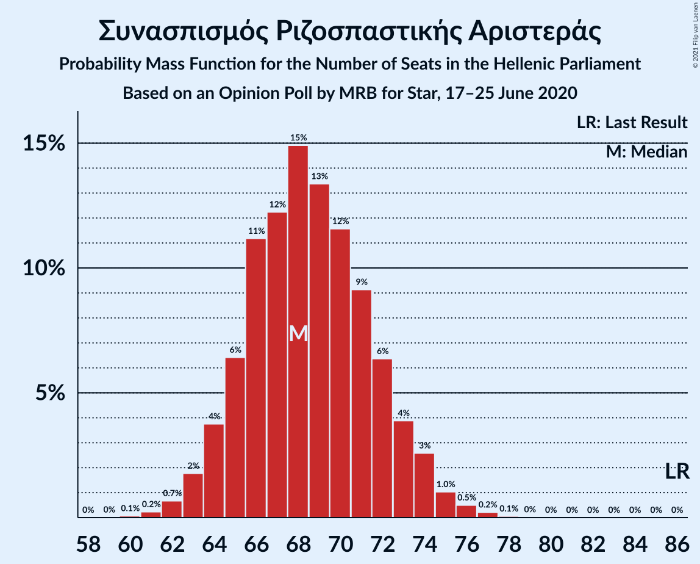
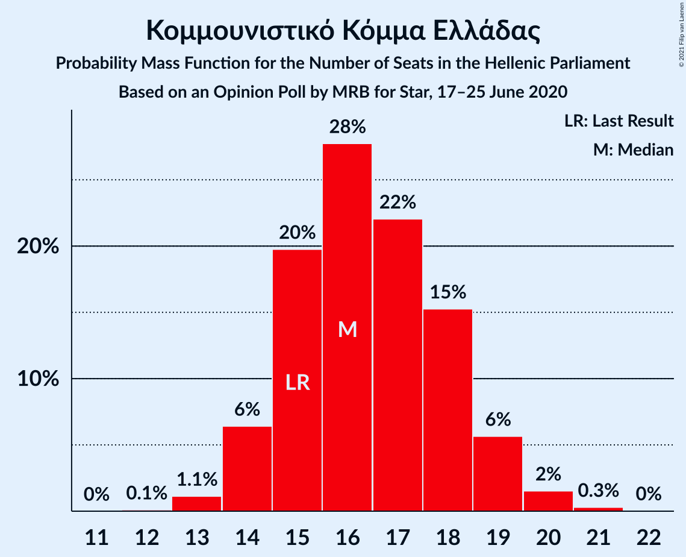
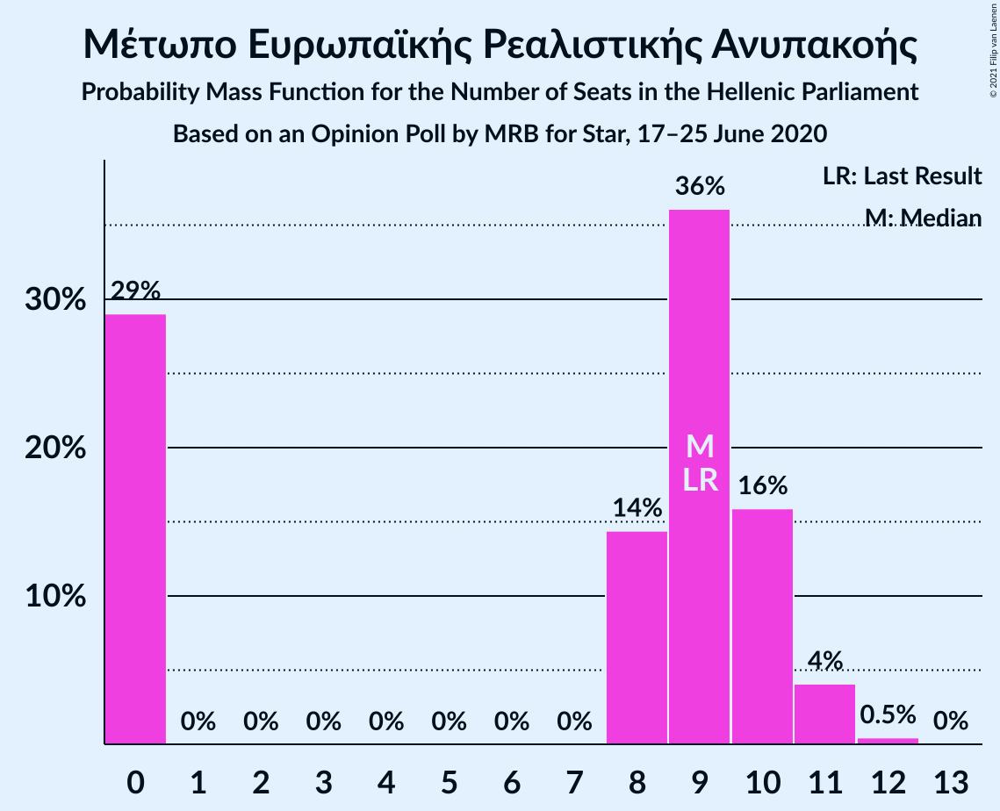
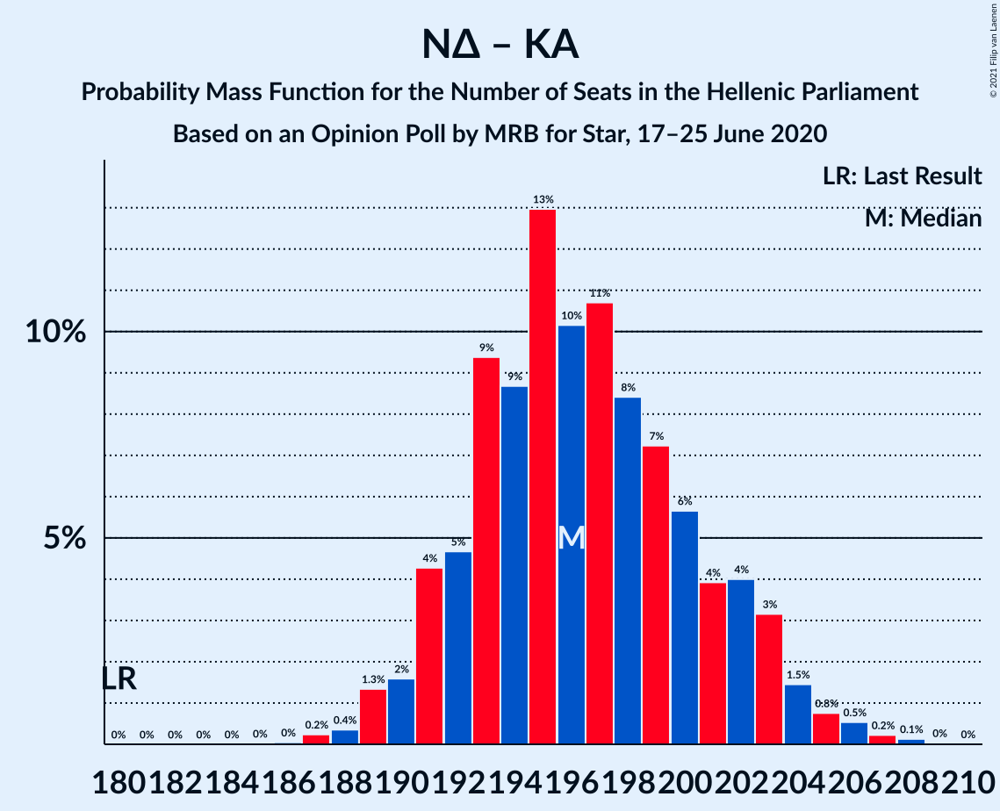
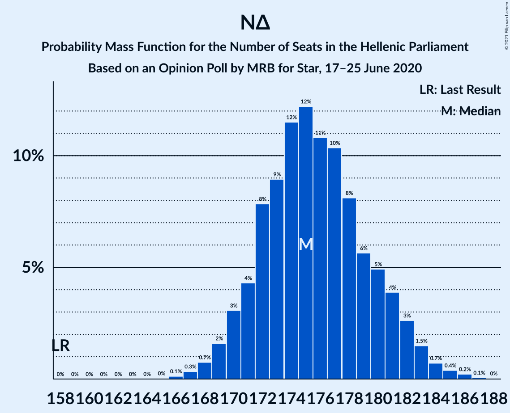
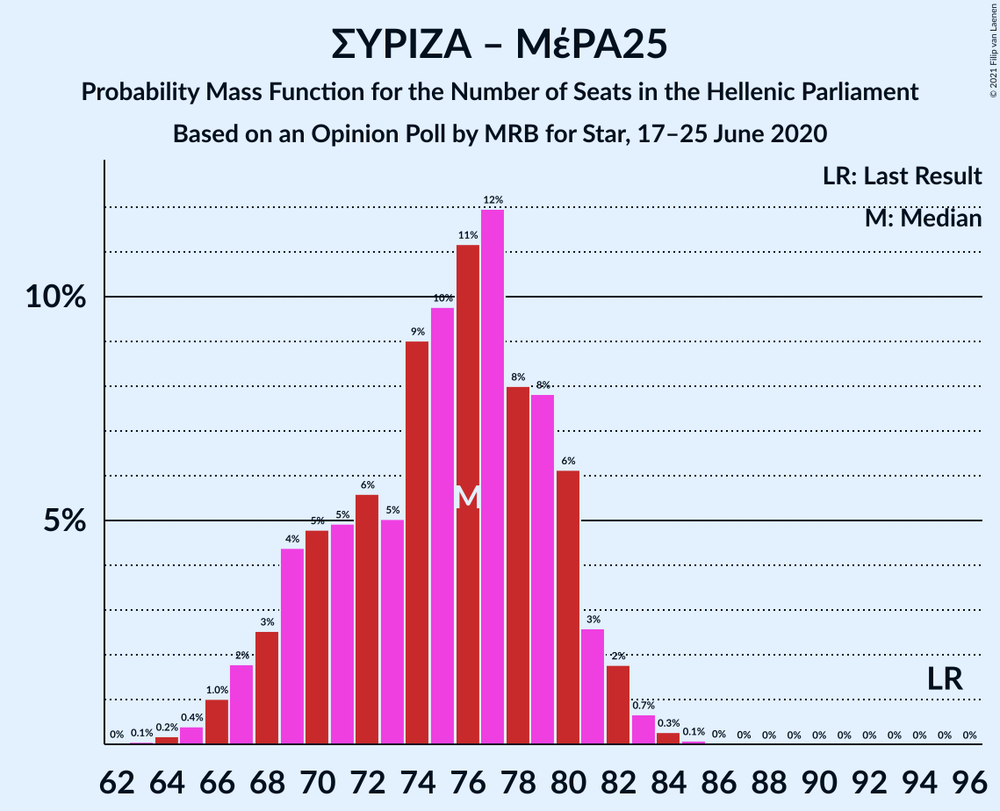

# Opinion Poll by MRB for Star, 17–25 June 2020

<a href="#voting-intentions">Voting Intentions</a> | <a href="#seats">Seats</a> | <a href="#coalitions">Coalitions</a> | <a href="#technical-information">Technical Information</a>

## Voting Intentions

### Confidence Intervals

| Party | Last Result | Poll Result | 80% Confidence Interval | 90% Confidence Interval | 95% Confidence Interval | 99% Confidence Interval |
|:-----:|:-----------:|:-----------:|:-----------------------:|:-----------------------:|:-----------------------:|:-----------------------:|
| Νέα Δημοκρατία | 39.8% | 46.2% | 44.8–47.6% |44.4–47.9% |44.1–48.3% |43.5–48.9% |
| Συνασπισμός Ριζοσπαστικής Αριστεράς | 31.5% | 25.2% | 24.0–26.4% |23.7–26.7% |23.4–27.0% |22.9–27.6% |
| Κίνημα Αλλαγής | 8.1% | 7.6% | 6.9–8.4% |6.7–8.6% |6.6–8.8% |6.2–9.2% |
| Κομμουνιστικό Κόμμα Ελλάδας | 5.3% | 6.0% | 5.4–6.7% |5.2–6.9% |5.1–7.1% |4.8–7.4% |
| Ελληνική Λύση | 3.7% | 4.4% | 3.9–5.0% |3.7–5.2% |3.6–5.4% |3.4–5.7% |
| Μέτωπο Ευρωπαϊκής Ρεαλιστικής Ανυπακοής | 3.4% | 3.2% | 2.7–3.7% |2.6–3.9% |2.5–4.0% |2.3–4.3% |
| Χρυσή Αυγή | 2.9% | 1.7% | 1.4–2.1% |1.3–2.2% |1.2–2.3% |1.1–2.5% |

*Note:* The poll result column reflects the actual value used in the calculations. Published results may vary slightly, and in addition be rounded to fewer digits.

## Seats

### Confidence Intervals

| Party | Last Result | Median | 80% Confidence Interval | 90% Confidence Interval | 95% Confidence Interval | 99% Confidence Interval |
|:-----:|:-----------:|:------:|:-----------------------:|:-----------------------:|:-----------------------:|:-----------------------:|
| <a href="#νέα-δημοκρατία">Νέα Δημοκρατία</a> | 158 | 176 | 172–180 |170–181 |169–183 |168–184 |
| <a href="#συνασπισμός-ριζοσπαστικής-αριστεράς">Συνασπισμός Ριζοσπαστικής Αριστεράς</a> | 86 | 68 | 65–72 |64–73 |63–74 |62–76 |
| <a href="#κίνημα-αλλαγής">Κίνημα Αλλαγής</a> | 22 | 21 | 19–23 |18–23 |18–24 |17–25 |
| <a href="#κομμουνιστικό-κόμμα-ελλάδας">Κομμουνιστικό Κόμμα Ελλάδας</a> | 15 | 16 | 15–18 |14–19 |14–20 |13–20 |
| <a href="#ελληνική-λύση">Ελληνική Λύση</a> | 10 | 12 | 11–14 |10–14 |10–15 |9–16 |
| <a href="#μέτωπο-ευρωπαϊκής-ρεαλιστικής-ανυπακοής">Μέτωπο Ευρωπαϊκής Ρεαλιστικής Ανυπακοής</a> | 9 | 9 | 0–10 |0–10 |0–11 |0–11 |
| <a href="#χρυσή-αυγή">Χρυσή Αυγή</a> | 0 | 0 | 0 |0 |0 |0 |

### Νέα Δημοκρατία

*For a full overview of the results for this party, see the [Νέα Δημοκρατία](party-νέαδημοκρατία.html) page.*

| Number of Seats | Probability | Accumulated | Special Marks |
|:---------------:|:-----------:|:-----------:|:-------------:|
| 158 | 0% | 100% | Last Result |
| 159 | 0% | 100% |  |
| 160 | 0% | 100% |  |
| 161 | 0% | 100% |  |
| 162 | 0% | 100% |  |
| 163 | 0% | 100% |  |
| 164 | 0% | 100% |  |
| 165 | 0% | 100% |  |
| 166 | 0.1% | 100% |  |
| 167 | 0.3% | 99.9% |  |
| 168 | 0.5% | 99.6% |  |
| 169 | 2% | 99.1% |  |
| 170 | 2% | 97% |  |
| 171 | 3% | 95% |  |
| 172 | 12% | 92% |  |
| 173 | 6% | 79% |  |
| 174 | 7% | 73% |  |
| 175 | 14% | 66% |  |
| 176 | 13% | 52% | Median |
| 177 | 10% | 39% |  |
| 178 | 11% | 29% |  |
| 179 | 5% | 18% |  |
| 180 | 6% | 12% |  |
| 181 | 3% | 7% |  |
| 182 | 1.1% | 4% |  |
| 183 | 1.4% | 3% |  |
| 184 | 0.9% | 1.4% |  |
| 185 | 0.1% | 0.5% |  |
| 186 | 0.3% | 0.4% |  |
| 187 | 0.1% | 0.1% |  |
| 188 | 0% | 0.1% |  |
| 189 | 0% | 0% |  |

### Συνασπισμός Ριζοσπαστικής Αριστεράς

*For a full overview of the results for this party, see the [Συνασπισμός Ριζοσπαστικής Αριστεράς](party-συνασπισμόςριζοσπαστικήςαριστεράς.html) page.*

| Number of Seats | Probability | Accumulated | Special Marks |
|:---------------:|:-----------:|:-----------:|:-------------:|
| 60 | 0.1% | 100% |  |
| 61 | 0.3% | 99.9% |  |
| 62 | 0.9% | 99.5% |  |
| 63 | 2% | 98.7% |  |
| 64 | 2% | 97% |  |
| 65 | 8% | 95% |  |
| 66 | 15% | 87% |  |
| 67 | 15% | 73% |  |
| 68 | 10% | 57% | Median |
| 69 | 14% | 47% |  |
| 70 | 9% | 34% |  |
| 71 | 7% | 25% |  |
| 72 | 9% | 18% |  |
| 73 | 4% | 9% |  |
| 74 | 3% | 5% |  |
| 75 | 0.6% | 2% |  |
| 76 | 1.2% | 2% |  |
| 77 | 0.4% | 0.5% |  |
| 78 | 0% | 0.1% |  |
| 79 | 0% | 0.1% |  |
| 80 | 0% | 0% |  |
| 81 | 0% | 0% |  |
| 82 | 0% | 0% |  |
| 83 | 0% | 0% |  |
| 84 | 0% | 0% |  |
| 85 | 0% | 0% |  |
| 86 | 0% | 0% | Last Result |

### Κίνημα Αλλαγής

*For a full overview of the results for this party, see the [Κίνημα Αλλαγής](party-κίνημααλλαγής.html) page.*

| Number of Seats | Probability | Accumulated | Special Marks |
|:---------------:|:-----------:|:-----------:|:-------------:|
| 16 | 0.2% | 100% |  |
| 17 | 1.0% | 99.8% |  |
| 18 | 7% | 98.8% |  |
| 19 | 18% | 92% |  |
| 20 | 18% | 74% |  |
| 21 | 24% | 56% | Median |
| 22 | 21% | 33% | Last Result |
| 23 | 8% | 11% |  |
| 24 | 2% | 4% |  |
| 25 | 1.0% | 1.3% |  |
| 26 | 0.2% | 0.2% |  |
| 27 | 0% | 0% |  |

### Κομμουνιστικό Κόμμα Ελλάδας

*For a full overview of the results for this party, see the [Κομμουνιστικό Κόμμα Ελλάδας](party-κομμουνιστικόκόμμαελλάδας.html) page.*

| Number of Seats | Probability | Accumulated | Special Marks |
|:---------------:|:-----------:|:-----------:|:-------------:|
| 12 | 0.1% | 100% |  |
| 13 | 1.1% | 99.9% |  |
| 14 | 5% | 98.8% |  |
| 15 | 20% | 93% | Last Result |
| 16 | 29% | 74% | Median |
| 17 | 28% | 45% |  |
| 18 | 10% | 17% |  |
| 19 | 4% | 7% |  |
| 20 | 2% | 3% |  |
| 21 | 0.3% | 0.4% |  |
| 22 | 0.1% | 0.1% |  |
| 23 | 0% | 0% |  |

### Ελληνική Λύση

*For a full overview of the results for this party, see the [Ελληνική Λύση](party-ελληνικήλύση.html) page.*

| Number of Seats | Probability | Accumulated | Special Marks |
|:---------------:|:-----------:|:-----------:|:-------------:|
| 9 | 0.9% | 100% |  |
| 10 | 7% | 99.0% | Last Result |
| 11 | 23% | 92% |  |
| 12 | 33% | 70% | Median |
| 13 | 26% | 37% |  |
| 14 | 8% | 11% |  |
| 15 | 2% | 3% |  |
| 16 | 0.5% | 0.6% |  |
| 17 | 0% | 0% |  |

### Μέτωπο Ευρωπαϊκής Ρεαλιστικής Ανυπακοής

*For a full overview of the results for this party, see the [Μέτωπο Ευρωπαϊκής Ρεαλιστικής Ανυπακοής](party-μέτωποευρωπαϊκήςρεαλιστικήςανυπακοής.html) page.*

| Number of Seats | Probability | Accumulated | Special Marks |
|:---------------:|:-----------:|:-----------:|:-------------:|
| 0 | 27% | 100% |  |
| 1 | 0% | 73% |  |
| 2 | 0% | 73% |  |
| 3 | 0% | 73% |  |
| 4 | 0% | 73% |  |
| 5 | 0% | 73% |  |
| 6 | 0% | 73% |  |
| 7 | 0% | 73% |  |
| 8 | 20% | 73% |  |
| 9 | 36% | 53% | Last Result, Median |
| 10 | 12% | 17% |  |
| 11 | 4% | 5% |  |
| 12 | 0.5% | 0.5% |  |
| 13 | 0% | 0% |  |

### Χρυσή Αυγή

*For a full overview of the results for this party, see the [Χρυσή Αυγή](party-χρυσήαυγή.html) page.*

| Number of Seats | Probability | Accumulated | Special Marks |
|:---------------:|:-----------:|:-----------:|:-------------:|
| 0 | 100% | 100% | Last Result, Median |

## Coalitions

### Confidence Intervals

| Coalition | Last Result | Median | Majority? | 80% Confidence Interval | 90% Confidence Interval | 95% Confidence Interval | 99% Confidence Interval |
|:---------:|:-----------:|:------:|:---------:|:-----------------------:|:-----------------------:|:-----------------------:|:-----------------------:|
| Νέα Δημοκρατία – Κίνημα Αλλαγής | 180 | 196 | 100% | 192–201 | 191–203 | 190–204 | 188–206 |
| Νέα Δημοκρατία | 158 | 176 | 100% | 172–180 | 170–181 | 169–183 | 168–184 |
| Συνασπισμός Ριζοσπαστικής Αριστεράς – Μέτωπο Ευρωπαϊκής Ρεαλιστικής Ανυπακοής | 95 | 75 | 0% | 70–80 | 69–81 | 67–82 | 65–83 |
| Συνασπισμός Ριζοσπαστικής Αριστεράς | 86 | 68 | 0% | 65–72 | 64–73 | 63–74 | 62–76 |

### Νέα Δημοκρατία – Κίνημα Αλλαγής

| Number of Seats | Probability | Accumulated | Special Marks |
|:---------------:|:-----------:|:-----------:|:-------------:|
| 180 | 0% | 100% | Last Result |
| 181 | 0% | 100% |  |
| 182 | 0% | 100% |  |
| 183 | 0% | 100% |  |
| 184 | 0% | 100% |  |
| 185 | 0% | 100% |  |
| 186 | 0% | 100% |  |
| 187 | 0.2% | 99.9% |  |
| 188 | 0.3% | 99.8% |  |
| 189 | 1.3% | 99.5% |  |
| 190 | 2% | 98% |  |
| 191 | 4% | 96% |  |
| 192 | 5% | 92% |  |
| 193 | 10% | 87% |  |
| 194 | 7% | 77% |  |
| 195 | 7% | 70% |  |
| 196 | 15% | 63% |  |
| 197 | 9% | 48% | Median |
| 198 | 16% | 39% |  |
| 199 | 6% | 23% |  |
| 200 | 5% | 17% |  |
| 201 | 4% | 11% |  |
| 202 | 2% | 8% |  |
| 203 | 3% | 6% |  |
| 204 | 0.5% | 3% |  |
| 205 | 1.4% | 2% |  |
| 206 | 0.1% | 0.6% |  |
| 207 | 0.3% | 0.4% |  |
| 208 | 0.1% | 0.1% |  |
| 209 | 0% | 0% |  |

### Νέα Δημοκρατία

| Number of Seats | Probability | Accumulated | Special Marks |
|:---------------:|:-----------:|:-----------:|:-------------:|
| 158 | 0% | 100% | Last Result |
| 159 | 0% | 100% |  |
| 160 | 0% | 100% |  |
| 161 | 0% | 100% |  |
| 162 | 0% | 100% |  |
| 163 | 0% | 100% |  |
| 164 | 0% | 100% |  |
| 165 | 0% | 100% |  |
| 166 | 0.1% | 100% |  |
| 167 | 0.3% | 99.9% |  |
| 168 | 0.5% | 99.6% |  |
| 169 | 2% | 99.1% |  |
| 170 | 2% | 97% |  |
| 171 | 3% | 95% |  |
| 172 | 12% | 92% |  |
| 173 | 6% | 79% |  |
| 174 | 7% | 73% |  |
| 175 | 14% | 66% |  |
| 176 | 13% | 52% | Median |
| 177 | 10% | 39% |  |
| 178 | 11% | 29% |  |
| 179 | 5% | 18% |  |
| 180 | 6% | 12% |  |
| 181 | 3% | 7% |  |
| 182 | 1.1% | 4% |  |
| 183 | 1.4% | 3% |  |
| 184 | 0.9% | 1.4% |  |
| 185 | 0.1% | 0.5% |  |
| 186 | 0.3% | 0.4% |  |
| 187 | 0.1% | 0.1% |  |
| 188 | 0% | 0.1% |  |
| 189 | 0% | 0% |  |

### Συνασπισμός Ριζοσπαστικής Αριστεράς – Μέτωπο Ευρωπαϊκής Ρεαλιστικής Ανυπακοής

| Number of Seats | Probability | Accumulated | Special Marks |
|:---------------:|:-----------:|:-----------:|:-------------:|
| 63 | 0% | 100% |  |
| 64 | 0.1% | 99.9% |  |
| 65 | 0.3% | 99.8% |  |
| 66 | 1.1% | 99.5% |  |
| 67 | 2% | 98% |  |
| 68 | 1.0% | 96% |  |
| 69 | 3% | 95% |  |
| 70 | 4% | 93% |  |
| 71 | 4% | 89% |  |
| 72 | 6% | 84% |  |
| 73 | 5% | 79% |  |
| 74 | 16% | 74% |  |
| 75 | 11% | 58% |  |
| 76 | 12% | 46% |  |
| 77 | 7% | 34% | Median |
| 78 | 10% | 28% |  |
| 79 | 7% | 18% |  |
| 80 | 4% | 11% |  |
| 81 | 4% | 7% |  |
| 82 | 2% | 3% |  |
| 83 | 0.7% | 1.1% |  |
| 84 | 0.3% | 0.4% |  |
| 85 | 0% | 0.1% |  |
| 86 | 0% | 0% |  |
| 87 | 0% | 0% |  |
| 88 | 0% | 0% |  |
| 89 | 0% | 0% |  |
| 90 | 0% | 0% |  |
| 91 | 0% | 0% |  |
| 92 | 0% | 0% |  |
| 93 | 0% | 0% |  |
| 94 | 0% | 0% |  |
| 95 | 0% | 0% | Last Result |

### Συνασπισμός Ριζοσπαστικής Αριστεράς

| Number of Seats | Probability | Accumulated | Special Marks |
|:---------------:|:-----------:|:-----------:|:-------------:|
| 60 | 0.1% | 100% |  |
| 61 | 0.3% | 99.9% |  |
| 62 | 0.9% | 99.5% |  |
| 63 | 2% | 98.7% |  |
| 64 | 2% | 97% |  |
| 65 | 8% | 95% |  |
| 66 | 15% | 87% |  |
| 67 | 15% | 73% |  |
| 68 | 10% | 57% | Median |
| 69 | 14% | 47% |  |
| 70 | 9% | 34% |  |
| 71 | 7% | 25% |  |
| 72 | 9% | 18% |  |
| 73 | 4% | 9% |  |
| 74 | 3% | 5% |  |
| 75 | 0.6% | 2% |  |
| 76 | 1.2% | 2% |  |
| 77 | 0.4% | 0.5% |  |
| 78 | 0% | 0.1% |  |
| 79 | 0% | 0.1% |  |
| 80 | 0% | 0% |  |
| 81 | 0% | 0% |  |
| 82 | 0% | 0% |  |
| 83 | 0% | 0% |  |
| 84 | 0% | 0% |  |
| 85 | 0% | 0% |  |
| 86 | 0% | 0% | Last Result |

## Technical Information

### Opinion Poll

+ **Polling firm:** MRB
+ **Commissioner(s):** Star
+ **Fieldwork period:** 17–25 June 2020

### Calculations

+ **Sample size:** 2200
+ **Simulations done:** 131,072
+ **Error estimate:** 1.17%

