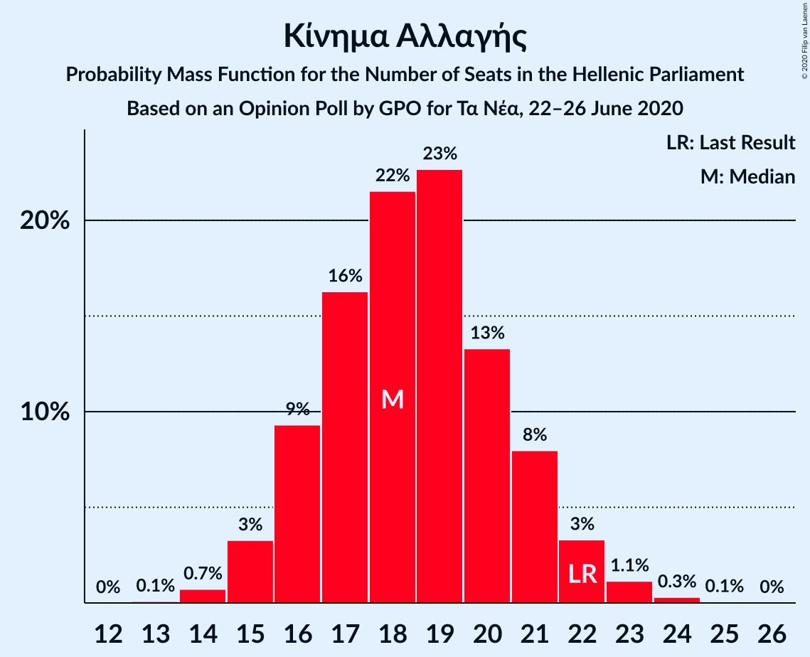
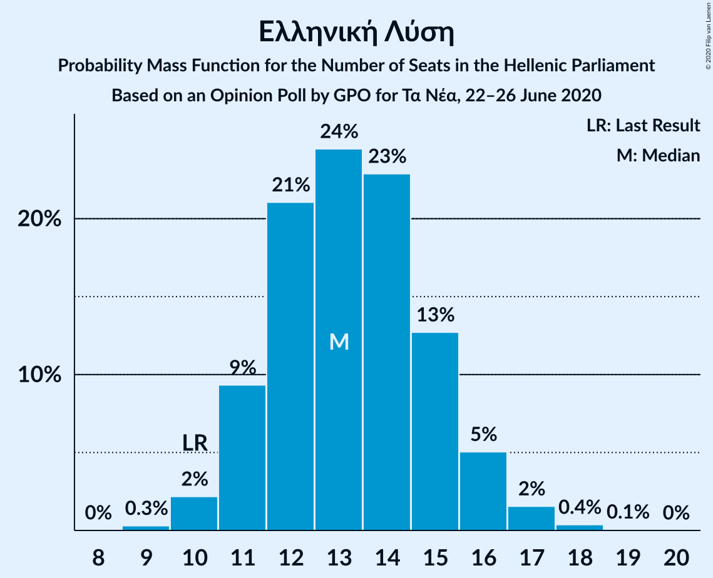
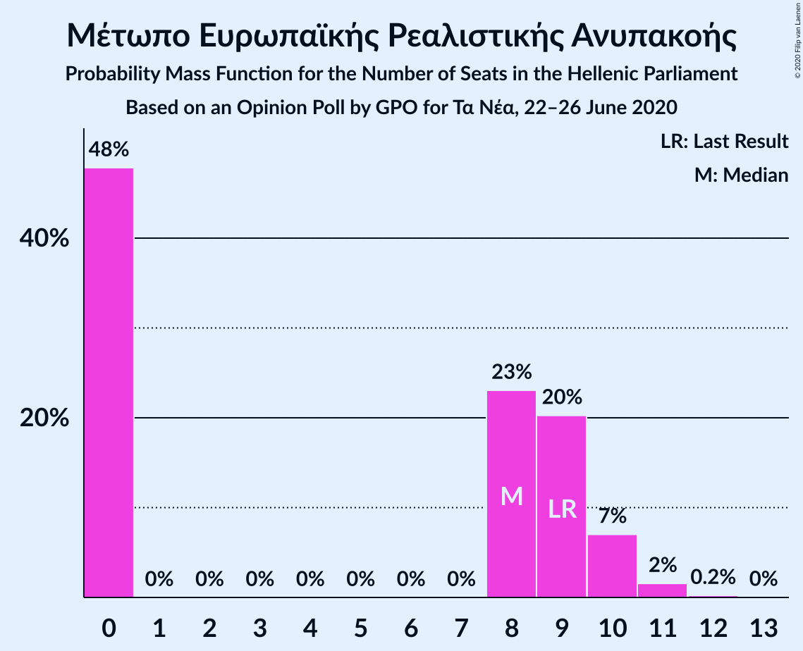
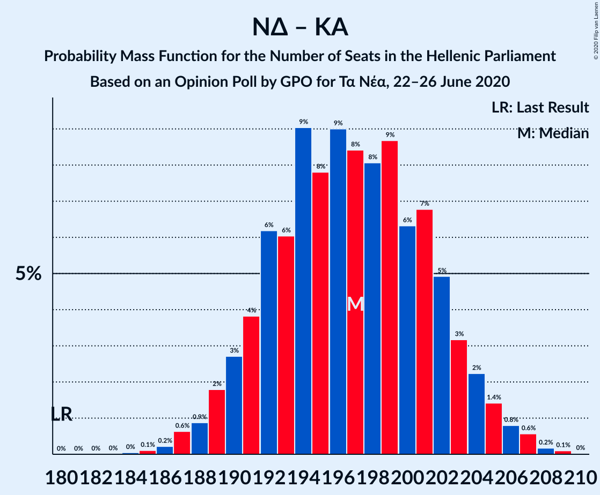
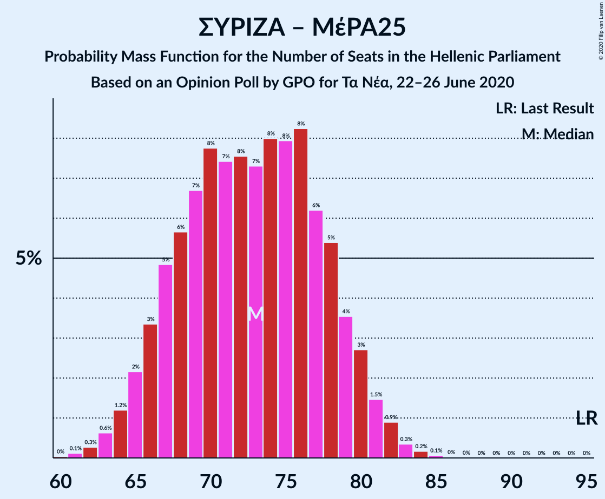

# Opinion Poll by GPO for Τα Νέα, 22–26 June 2020

<a href="#voting-intentions">Voting Intentions</a> | <a href="#seats">Seats</a> | <a href="#coalitions">Coalitions</a> | <a href="#technical-information">Technical Information</a>

## Voting Intentions

### Confidence Intervals

| Party | Last Result | Poll Result | 80% Confidence Interval | 90% Confidence Interval | 95% Confidence Interval | 99% Confidence Interval |
|:-----:|:-----------:|:-----------:|:-----------------------:|:-----------------------:|:-----------------------:|:-----------------------:|
| Νέα Δημοκρατία | 39.8% | 49.0% | 47.3–50.7% |46.9–51.1% |46.5–51.5% |45.7–52.3% |
| Συνασπισμός Ριζοσπαστικής Αριστεράς | 31.5% | 26.0% | 24.6–27.5% |24.2–27.9% |23.8–28.3% |23.2–29.0% |
| Κίνημα Αλλαγής | 8.1% | 7.0% | 6.2–7.9% |6.0–8.2% |5.8–8.4% |5.5–8.9% |
| Κομμουνιστικό Κόμμα Ελλάδας | 5.3% | 6.5% | 5.8–7.4% |5.6–7.7% |5.4–7.9% |5.0–8.4% |
| Ελληνική Λύση | 3.7% | 5.0% | 4.3–5.8% |4.2–6.0% |4.0–6.2% |3.7–6.6% |
| Μέτωπο Ευρωπαϊκής Ρεαλιστικής Ανυπακοής | 3.4% | 3.0% | 2.5–3.7% |2.4–3.8% |2.2–4.0% |2.0–4.3% |

*Note:* The poll result column reflects the actual value used in the calculations. Published results may vary slightly, and in addition be rounded to fewer digits.

## Seats

### Confidence Intervals

| Party | Last Result | Median | 80% Confidence Interval | 90% Confidence Interval | 95% Confidence Interval | 99% Confidence Interval |
|:-----:|:-----------:|:------:|:-----------------------:|:-----------------------:|:-----------------------:|:-----------------------:|
| <a href="#νέα-δημοκρατία">Νέα Δημοκρατία</a> | 158 | 178 | 173–183 |172–185 |171–186 |168–188 |
| <a href="#συνασπισμός-ριζοσπαστικής-αριστεράς">Συνασπισμός Ριζοσπαστικής Αριστεράς</a> | 86 | 68 | 64–72 |63–73 |62–75 |61–76 |
| <a href="#κίνημα-αλλαγής">Κίνημα Αλλαγής</a> | 22 | 18 | 16–21 |16–21 |15–22 |14–23 |
| <a href="#κομμουνιστικό-κόμμα-ελλάδας">Κομμουνιστικό Κόμμα Ελλάδας</a> | 15 | 17 | 15–20 |14–20 |14–21 |13–22 |
| <a href="#ελληνική-λύση">Ελληνική Λύση</a> | 10 | 13 | 11–15 |11–16 |10–16 |10–17 |
| <a href="#μέτωπο-ευρωπαϊκής-ρεαλιστικής-ανυπακοής">Μέτωπο Ευρωπαϊκής Ρεαλιστικής Ανυπακοής</a> | 9 | 8 | 0–9 |0–10 |0–10 |0–11 |

### Νέα Δημοκρατία

*For a full overview of the results for this party, see the [Νέα Δημοκρατία](party-νέαδημοκρατία.html) page.*

| Number of Seats | Probability | Accumulated | Special Marks |
|:---------------:|:-----------:|:-----------:|:-------------:|
| 158 | 0% | 100% | Last Result |
| 159 | 0% | 100% |  |
| 160 | 0% | 100% |  |
| 161 | 0% | 100% |  |
| 162 | 0% | 100% |  |
| 163 | 0% | 100% |  |
| 164 | 0% | 100% |  |
| 165 | 0% | 100% |  |
| 166 | 0.1% | 100% |  |
| 167 | 0.1% | 99.9% |  |
| 168 | 0.3% | 99.8% |  |
| 169 | 0.7% | 99.5% |  |
| 170 | 1.0% | 98.8% |  |
| 171 | 2% | 98% |  |
| 172 | 4% | 96% |  |
| 173 | 4% | 92% |  |
| 174 | 7% | 89% |  |
| 175 | 6% | 81% |  |
| 176 | 9% | 75% |  |
| 177 | 9% | 65% |  |
| 178 | 9% | 56% | Median |
| 179 | 11% | 47% |  |
| 180 | 7% | 36% |  |
| 181 | 6% | 29% |  |
| 182 | 9% | 23% |  |
| 183 | 5% | 14% |  |
| 184 | 3% | 9% |  |
| 185 | 2% | 6% |  |
| 186 | 2% | 4% |  |
| 187 | 0.9% | 2% |  |
| 188 | 0.4% | 0.7% |  |
| 189 | 0.1% | 0.3% |  |
| 190 | 0.1% | 0.2% |  |
| 191 | 0.1% | 0.1% |  |
| 192 | 0% | 0% |  |

### Συνασπισμός Ριζοσπαστικής Αριστεράς

*For a full overview of the results for this party, see the [Συνασπισμός Ριζοσπαστικής Αριστεράς](party-συνασπισμόςριζοσπαστικήςαριστεράς.html) page.*

| Number of Seats | Probability | Accumulated | Special Marks |
|:---------------:|:-----------:|:-----------:|:-------------:|
| 58 | 0.1% | 100% |  |
| 59 | 0.2% | 99.9% |  |
| 60 | 0.2% | 99.8% |  |
| 61 | 0.8% | 99.5% |  |
| 62 | 2% | 98.7% |  |
| 63 | 4% | 97% |  |
| 64 | 6% | 93% |  |
| 65 | 8% | 87% |  |
| 66 | 9% | 79% |  |
| 67 | 16% | 70% |  |
| 68 | 10% | 54% | Median |
| 69 | 9% | 44% |  |
| 70 | 11% | 35% |  |
| 71 | 10% | 24% |  |
| 72 | 6% | 14% |  |
| 73 | 3% | 7% |  |
| 74 | 2% | 4% |  |
| 75 | 1.5% | 3% |  |
| 76 | 0.8% | 1.3% |  |
| 77 | 0.3% | 0.5% |  |
| 78 | 0.1% | 0.2% |  |
| 79 | 0% | 0.1% |  |
| 80 | 0% | 0% |  |
| 81 | 0% | 0% |  |
| 82 | 0% | 0% |  |
| 83 | 0% | 0% |  |
| 84 | 0% | 0% |  |
| 85 | 0% | 0% |  |
| 86 | 0% | 0% | Last Result |

### Κίνημα Αλλαγής

*For a full overview of the results for this party, see the [Κίνημα Αλλαγής](party-κίνημααλλαγής.html) page.*

| Number of Seats | Probability | Accumulated | Special Marks |
|:---------------:|:-----------:|:-----------:|:-------------:|
| 13 | 0.1% | 100% |  |
| 14 | 0.6% | 99.9% |  |
| 15 | 3% | 99.3% |  |
| 16 | 12% | 96% |  |
| 17 | 17% | 84% |  |
| 18 | 18% | 67% | Median |
| 19 | 20% | 49% |  |
| 20 | 14% | 29% |  |
| 21 | 11% | 15% |  |
| 22 | 2% | 4% | Last Result |
| 23 | 1.0% | 2% |  |
| 24 | 0.4% | 0.5% |  |
| 25 | 0.1% | 0.1% |  |
| 26 | 0% | 0% |  |

### Κομμουνιστικό Κόμμα Ελλάδας

*For a full overview of the results for this party, see the [Κομμουνιστικό Κόμμα Ελλάδας](party-κομμουνιστικόκόμμαελλάδας.html) page.*

| Number of Seats | Probability | Accumulated | Special Marks |
|:---------------:|:-----------:|:-----------:|:-------------:|
| 12 | 0.1% | 100% |  |
| 13 | 1.0% | 99.9% |  |
| 14 | 4% | 99.0% |  |
| 15 | 8% | 95% | Last Result |
| 16 | 19% | 87% |  |
| 17 | 27% | 67% | Median |
| 18 | 15% | 40% |  |
| 19 | 14% | 25% |  |
| 20 | 7% | 10% |  |
| 21 | 2% | 3% |  |
| 22 | 0.8% | 1.1% |  |
| 23 | 0.2% | 0.2% |  |
| 24 | 0% | 0% |  |

### Ελληνική Λύση

*For a full overview of the results for this party, see the [Ελληνική Λύση](party-ελληνικήλύση.html) page.*

| Number of Seats | Probability | Accumulated | Special Marks |
|:---------------:|:-----------:|:-----------:|:-------------:|
| 9 | 0.3% | 100% |  |
| 10 | 2% | 99.7% | Last Result |
| 11 | 9% | 97% |  |
| 12 | 20% | 89% |  |
| 13 | 28% | 69% | Median |
| 14 | 19% | 41% |  |
| 15 | 16% | 23% |  |
| 16 | 5% | 7% |  |
| 17 | 2% | 2% |  |
| 18 | 0.4% | 0.5% |  |
| 19 | 0.1% | 0.1% |  |
| 20 | 0% | 0% |  |

### Μέτωπο Ευρωπαϊκής Ρεαλιστικής Ανυπακοής

*For a full overview of the results for this party, see the [Μέτωπο Ευρωπαϊκής Ρεαλιστικής Ανυπακοής](party-μέτωποευρωπαϊκήςρεαλιστικήςανυπακοής.html) page.*

| Number of Seats | Probability | Accumulated | Special Marks |
|:---------------:|:-----------:|:-----------:|:-------------:|
| 0 | 46% | 100% |  |
| 1 | 0% | 54% |  |
| 2 | 0% | 54% |  |
| 3 | 0% | 54% |  |
| 4 | 0% | 54% |  |
| 5 | 0% | 54% |  |
| 6 | 0% | 54% |  |
| 7 | 0% | 54% |  |
| 8 | 25% | 54% | Median |
| 9 | 20% | 29% | Last Result |
| 10 | 7% | 9% |  |
| 11 | 2% | 2% |  |
| 12 | 0.3% | 0.3% |  |
| 13 | 0% | 0% |  |

## Coalitions

### Confidence Intervals

| Coalition | Last Result | Median | Majority? | 80% Confidence Interval | 90% Confidence Interval | 95% Confidence Interval | 99% Confidence Interval |
|:---------:|:-----------:|:------:|:---------:|:-----------------------:|:-----------------------:|:-----------------------:|:-----------------------:|
| Νέα Δημοκρατία – Κίνημα Αλλαγής | 180 | 197 | 100% | 191–202 | 190–203 | 189–205 | 187–207 |
| Νέα Δημοκρατία | 158 | 178 | 100% | 173–183 | 172–185 | 171–186 | 168–188 |
| Συνασπισμός Ριζοσπαστικής Αριστεράς – Μέτωπο Ευρωπαϊκής Ρεαλιστικής Ανυπακοής | 95 | 73 | 0% | 67–79 | 66–80 | 65–81 | 62–82 |
| Συνασπισμός Ριζοσπαστικής Αριστεράς | 86 | 68 | 0% | 64–72 | 63–73 | 62–75 | 61–76 |

### Νέα Δημοκρατία – Κίνημα Αλλαγής

| Number of Seats | Probability | Accumulated | Special Marks |
|:---------------:|:-----------:|:-----------:|:-------------:|
| 180 | 0% | 100% | Last Result |
| 181 | 0% | 100% |  |
| 182 | 0% | 100% |  |
| 183 | 0% | 100% |  |
| 184 | 0% | 100% |  |
| 185 | 0.1% | 99.9% |  |
| 186 | 0.2% | 99.8% |  |
| 187 | 0.7% | 99.6% |  |
| 188 | 0.8% | 98.9% |  |
| 189 | 2% | 98% |  |
| 190 | 3% | 96% |  |
| 191 | 3% | 93% |  |
| 192 | 8% | 90% |  |
| 193 | 5% | 81% |  |
| 194 | 9% | 76% |  |
| 195 | 5% | 67% |  |
| 196 | 11% | 62% | Median |
| 197 | 8% | 51% |  |
| 198 | 8% | 43% |  |
| 199 | 11% | 35% |  |
| 200 | 5% | 24% |  |
| 201 | 7% | 19% |  |
| 202 | 3% | 12% |  |
| 203 | 5% | 10% |  |
| 204 | 2% | 5% |  |
| 205 | 2% | 3% |  |
| 206 | 0.6% | 1.3% |  |
| 207 | 0.5% | 0.8% |  |
| 208 | 0.1% | 0.3% |  |
| 209 | 0.1% | 0.1% |  |
| 210 | 0% | 0% |  |

### Νέα Δημοκρατία

| Number of Seats | Probability | Accumulated | Special Marks |
|:---------------:|:-----------:|:-----------:|:-------------:|
| 158 | 0% | 100% | Last Result |
| 159 | 0% | 100% |  |
| 160 | 0% | 100% |  |
| 161 | 0% | 100% |  |
| 162 | 0% | 100% |  |
| 163 | 0% | 100% |  |
| 164 | 0% | 100% |  |
| 165 | 0% | 100% |  |
| 166 | 0.1% | 100% |  |
| 167 | 0.1% | 99.9% |  |
| 168 | 0.3% | 99.8% |  |
| 169 | 0.7% | 99.5% |  |
| 170 | 1.0% | 98.8% |  |
| 171 | 2% | 98% |  |
| 172 | 4% | 96% |  |
| 173 | 4% | 92% |  |
| 174 | 7% | 89% |  |
| 175 | 6% | 81% |  |
| 176 | 9% | 75% |  |
| 177 | 9% | 65% |  |
| 178 | 9% | 56% | Median |
| 179 | 11% | 47% |  |
| 180 | 7% | 36% |  |
| 181 | 6% | 29% |  |
| 182 | 9% | 23% |  |
| 183 | 5% | 14% |  |
| 184 | 3% | 9% |  |
| 185 | 2% | 6% |  |
| 186 | 2% | 4% |  |
| 187 | 0.9% | 2% |  |
| 188 | 0.4% | 0.7% |  |
| 189 | 0.1% | 0.3% |  |
| 190 | 0.1% | 0.2% |  |
| 191 | 0.1% | 0.1% |  |
| 192 | 0% | 0% |  |

### Συνασπισμός Ριζοσπαστικής Αριστεράς – Μέτωπο Ευρωπαϊκής Ρεαλιστικής Ανυπακοής

| Number of Seats | Probability | Accumulated | Special Marks |
|:---------------:|:-----------:|:-----------:|:-------------:|
| 61 | 0.2% | 100% |  |
| 62 | 0.3% | 99.8% |  |
| 63 | 0.6% | 99.5% |  |
| 64 | 1.2% | 98.9% |  |
| 65 | 2% | 98% |  |
| 66 | 3% | 96% |  |
| 67 | 6% | 93% |  |
| 68 | 5% | 87% |  |
| 69 | 5% | 82% |  |
| 70 | 9% | 77% |  |
| 71 | 8% | 68% |  |
| 72 | 9% | 60% |  |
| 73 | 6% | 51% |  |
| 74 | 7% | 45% |  |
| 75 | 8% | 38% |  |
| 76 | 11% | 30% | Median |
| 77 | 5% | 19% |  |
| 78 | 3% | 14% |  |
| 79 | 3% | 11% |  |
| 80 | 4% | 8% |  |
| 81 | 3% | 4% |  |
| 82 | 0.5% | 1.0% |  |
| 83 | 0.2% | 0.5% |  |
| 84 | 0.1% | 0.2% |  |
| 85 | 0.1% | 0.1% |  |
| 86 | 0% | 0% |  |
| 87 | 0% | 0% |  |
| 88 | 0% | 0% |  |
| 89 | 0% | 0% |  |
| 90 | 0% | 0% |  |
| 91 | 0% | 0% |  |
| 92 | 0% | 0% |  |
| 93 | 0% | 0% |  |
| 94 | 0% | 0% |  |
| 95 | 0% | 0% | Last Result |

### Συνασπισμός Ριζοσπαστικής Αριστεράς

| Number of Seats | Probability | Accumulated | Special Marks |
|:---------------:|:-----------:|:-----------:|:-------------:|
| 58 | 0.1% | 100% |  |
| 59 | 0.2% | 99.9% |  |
| 60 | 0.2% | 99.8% |  |
| 61 | 0.8% | 99.5% |  |
| 62 | 2% | 98.7% |  |
| 63 | 4% | 97% |  |
| 64 | 6% | 93% |  |
| 65 | 8% | 87% |  |
| 66 | 9% | 79% |  |
| 67 | 16% | 70% |  |
| 68 | 10% | 54% | Median |
| 69 | 9% | 44% |  |
| 70 | 11% | 35% |  |
| 71 | 10% | 24% |  |
| 72 | 6% | 14% |  |
| 73 | 3% | 7% |  |
| 74 | 2% | 4% |  |
| 75 | 1.5% | 3% |  |
| 76 | 0.8% | 1.3% |  |
| 77 | 0.3% | 0.5% |  |
| 78 | 0.1% | 0.2% |  |
| 79 | 0% | 0.1% |  |
| 80 | 0% | 0% |  |
| 81 | 0% | 0% |  |
| 82 | 0% | 0% |  |
| 83 | 0% | 0% |  |
| 84 | 0% | 0% |  |
| 85 | 0% | 0% |  |
| 86 | 0% | 0% | Last Result |

## Technical Information

### Opinion Poll

+ **Polling firm:** GPO
+ **Commissioner(s):** Τα Νέα
+ **Fieldwork period:** 22–26 June 2020

### Calculations

+ **Sample size:** 1500
+ **Simulations done:** 131,072
+ **Error estimate:** 1.13%

