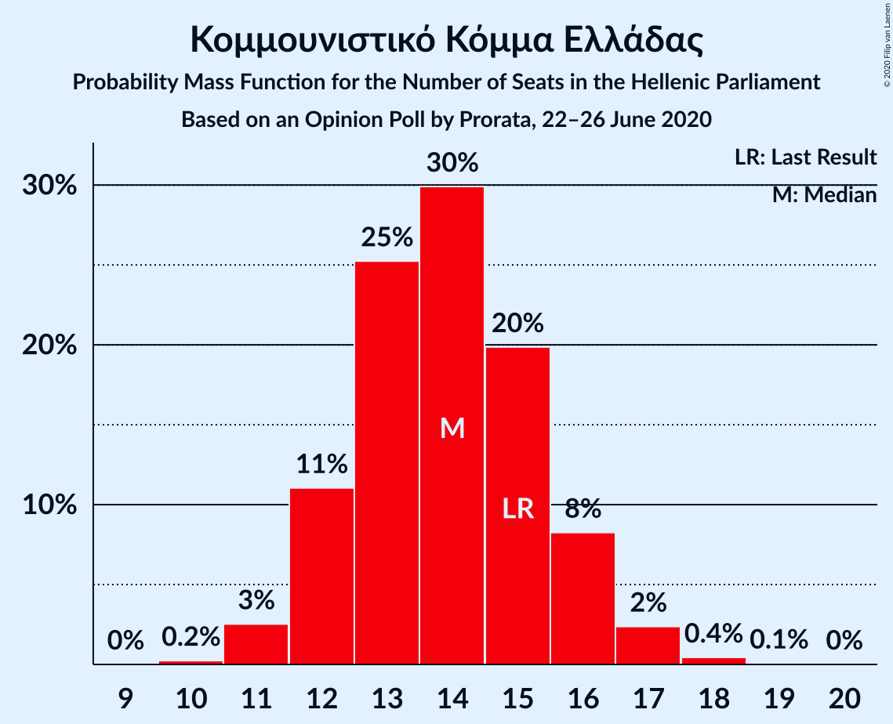
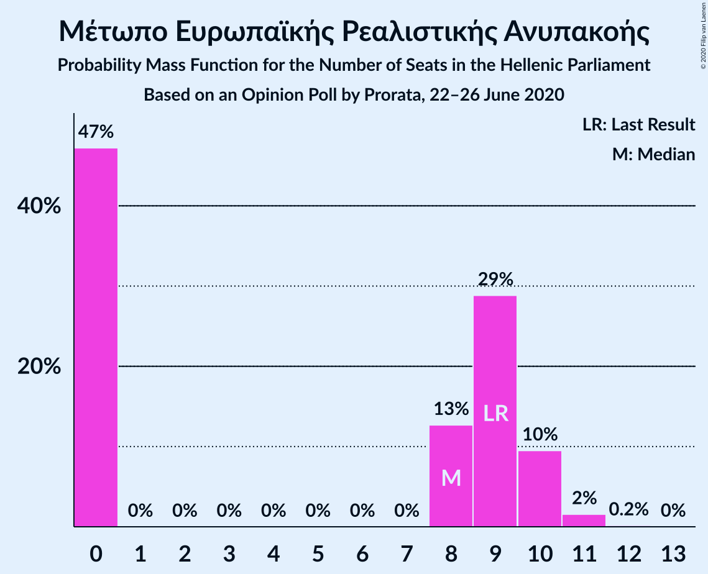

# Opinion Poll by Prorata, 22–26 June 2020

<a href="#voting-intentions">Voting Intentions</a> | <a href="#seats">Seats</a> | <a href="#coalitions">Coalitions</a> | <a href="#technical-information">Technical Information</a>

## Voting Intentions

### Confidence Intervals

| Party | Last Result | Poll Result | 80% Confidence Interval | 90% Confidence Interval | 95% Confidence Interval | 99% Confidence Interval |
|:-----:|:-----------:|:-----------:|:-----------------------:|:-----------------------:|:-----------------------:|:-----------------------:|
| Νέα Δημοκρατία | 39.8% | 46.0% | 44.6–47.4% |44.2–47.8% |43.9–48.1% |43.3–48.8% |
| Συνασπισμός Ριζοσπαστικής Αριστεράς | 31.5% | 28.5% | 27.3–29.8% |26.9–30.1% |26.6–30.4% |26.1–31.0% |
| Κίνημα Αλλαγής | 8.1% | 6.0% | 5.4–6.7% |5.2–6.9% |5.1–7.1% |4.8–7.4% |
| Κομμουνιστικό Κόμμα Ελλάδας | 5.3% | 5.0% | 4.5–5.7% |4.3–5.8% |4.2–6.0% |3.9–6.3% |
| Ελληνική Λύση | 3.7% | 3.5% | 3.0–4.1% |2.9–4.2% |2.8–4.4% |2.6–4.6% |
| Μέτωπο Ευρωπαϊκής Ρεαλιστικής Ανυπακοής | 3.4% | 3.0% | 2.6–3.5% |2.5–3.7% |2.4–3.8% |2.2–4.1% |
| Χρυσή Αυγή | 2.9% | 1.0% | 0.8–1.3% |0.7–1.4% |0.7–1.5% |0.6–1.7% |

*Note:* The poll result column reflects the actual value used in the calculations. Published results may vary slightly, and in addition be rounded to fewer digits.

## Seats

### Confidence Intervals

| Party | Last Result | Median | 80% Confidence Interval | 90% Confidence Interval | 95% Confidence Interval | 99% Confidence Interval |
|:-----:|:-----------:|:------:|:-----------------------:|:-----------------------:|:-----------------------:|:-----------------------:|
| <a href="#νέα-δημοκρατία">Νέα Δημοκρατία</a> | 158 | 176 | 172–182 |171–183 |170–184 |168–187 |
| <a href="#συνασπισμός-ριζοσπαστικής-αριστεράς">Συνασπισμός Ριζοσπαστικής Αριστεράς</a> | 86 | 79 | 75–83 |74–84 |73–85 |71–87 |
| <a href="#κίνημα-αλλαγής">Κίνημα Αλλαγής</a> | 22 | 16 | 15–18 |14–19 |14–20 |13–21 |
| <a href="#κομμουνιστικό-κόμμα-ελλάδας">Κομμουνιστικό Κόμμα Ελλάδας</a> | 15 | 14 | 12–15 |12–16 |11–17 |11–18 |
| <a href="#ελληνική-λύση">Ελληνική Λύση</a> | 10 | 10 | 8–11 |0–11 |0–12 |0–13 |
| <a href="#μέτωπο-ευρωπαϊκής-ρεαλιστικής-ανυπακοής">Μέτωπο Ευρωπαϊκής Ρεαλιστικής Ανυπακοής</a> | 9 | 8 | 0–10 |0–10 |0–10 |0–11 |
| <a href="#χρυσή-αυγή">Χρυσή Αυγή</a> | 0 | 0 | 0 |0 |0 |0 |

### Νέα Δημοκρατία

*For a full overview of the results for this party, see the [Νέα Δημοκρατία](party-νέαδημοκρατία.html) page.*

| Number of Seats | Probability | Accumulated | Special Marks |
|:---------------:|:-----------:|:-----------:|:-------------:|
| 158 | 0% | 100% | Last Result |
| 159 | 0% | 100% |  |
| 160 | 0% | 100% |  |
| 161 | 0% | 100% |  |
| 162 | 0% | 100% |  |
| 163 | 0% | 100% |  |
| 164 | 0% | 100% |  |
| 165 | 0% | 100% |  |
| 166 | 0% | 100% |  |
| 167 | 0.2% | 99.9% |  |
| 168 | 0.4% | 99.7% |  |
| 169 | 0.4% | 99.3% |  |
| 170 | 3% | 98.9% |  |
| 171 | 3% | 96% |  |
| 172 | 14% | 93% |  |
| 173 | 2% | 80% |  |
| 174 | 15% | 78% |  |
| 175 | 3% | 63% |  |
| 176 | 15% | 60% | Median |
| 177 | 6% | 45% |  |
| 178 | 6% | 39% |  |
| 179 | 4% | 33% |  |
| 180 | 6% | 29% |  |
| 181 | 12% | 23% |  |
| 182 | 1.5% | 11% |  |
| 183 | 6% | 10% |  |
| 184 | 2% | 4% |  |
| 185 | 1.0% | 2% |  |
| 186 | 0.6% | 1.4% |  |
| 187 | 0.5% | 0.8% |  |
| 188 | 0% | 0.3% |  |
| 189 | 0% | 0.2% |  |
| 190 | 0.1% | 0.2% |  |
| 191 | 0% | 0% |  |

### Συνασπισμός Ριζοσπαστικής Αριστεράς

*For a full overview of the results for this party, see the [Συνασπισμός Ριζοσπαστικής Αριστεράς](party-συνασπισμόςριζοσπαστικήςαριστεράς.html) page.*

| Number of Seats | Probability | Accumulated | Special Marks |
|:---------------:|:-----------:|:-----------:|:-------------:|
| 69 | 0% | 100% |  |
| 70 | 0.1% | 99.9% |  |
| 71 | 0.6% | 99.8% |  |
| 72 | 1.3% | 99.2% |  |
| 73 | 2% | 98% |  |
| 74 | 2% | 96% |  |
| 75 | 4% | 94% |  |
| 76 | 5% | 89% |  |
| 77 | 17% | 84% |  |
| 78 | 8% | 67% |  |
| 79 | 23% | 58% | Median |
| 80 | 9% | 35% |  |
| 81 | 10% | 26% |  |
| 82 | 3% | 17% |  |
| 83 | 8% | 14% |  |
| 84 | 3% | 5% |  |
| 85 | 2% | 3% |  |
| 86 | 0.3% | 0.8% | Last Result |
| 87 | 0.3% | 0.6% |  |
| 88 | 0.1% | 0.2% |  |
| 89 | 0.1% | 0.2% |  |
| 90 | 0.1% | 0.1% |  |
| 91 | 0% | 0% |  |

### Κίνημα Αλλαγής

*For a full overview of the results for this party, see the [Κίνημα Αλλαγής](party-κίνημααλλαγής.html) page.*

| Number of Seats | Probability | Accumulated | Special Marks |
|:---------------:|:-----------:|:-----------:|:-------------:|
| 12 | 0.1% | 100% |  |
| 13 | 0.9% | 99.9% |  |
| 14 | 9% | 99.0% |  |
| 15 | 12% | 90% |  |
| 16 | 31% | 78% | Median |
| 17 | 21% | 47% |  |
| 18 | 18% | 26% |  |
| 19 | 5% | 8% |  |
| 20 | 2% | 3% |  |
| 21 | 0.7% | 0.8% |  |
| 22 | 0.1% | 0.1% | Last Result |
| 23 | 0% | 0% |  |

### Κομμουνιστικό Κόμμα Ελλάδας

*For a full overview of the results for this party, see the [Κομμουνιστικό Κόμμα Ελλάδας](party-κομμουνιστικόκόμμαελλάδας.html) page.*

| Number of Seats | Probability | Accumulated | Special Marks |
|:---------------:|:-----------:|:-----------:|:-------------:|
| 10 | 0.1% | 100% |  |
| 11 | 2% | 99.8% |  |
| 12 | 15% | 97% |  |
| 13 | 13% | 82% |  |
| 14 | 34% | 69% | Median |
| 15 | 27% | 35% | Last Result |
| 16 | 4% | 8% |  |
| 17 | 3% | 3% |  |
| 18 | 0.5% | 0.5% |  |
| 19 | 0% | 0% |  |

### Ελληνική Λύση

*For a full overview of the results for this party, see the [Ελληνική Λύση](party-ελληνικήλύση.html) page.*

| Number of Seats | Probability | Accumulated | Special Marks |
|:---------------:|:-----------:|:-----------:|:-------------:|
| 0 | 8% | 100% |  |
| 1 | 0% | 92% |  |
| 2 | 0% | 92% |  |
| 3 | 0% | 92% |  |
| 4 | 0% | 92% |  |
| 5 | 0% | 92% |  |
| 6 | 0% | 92% |  |
| 7 | 0% | 92% |  |
| 8 | 3% | 92% |  |
| 9 | 34% | 89% |  |
| 10 | 30% | 55% | Last Result, Median |
| 11 | 20% | 25% |  |
| 12 | 3% | 5% |  |
| 13 | 1.1% | 1.3% |  |
| 14 | 0.1% | 0.1% |  |
| 15 | 0% | 0% |  |

### Μέτωπο Ευρωπαϊκής Ρεαλιστικής Ανυπακοής

*For a full overview of the results for this party, see the [Μέτωπο Ευρωπαϊκής Ρεαλιστικής Ανυπακοής](party-μέτωποευρωπαϊκήςρεαλιστικήςανυπακοής.html) page.*

| Number of Seats | Probability | Accumulated | Special Marks |
|:---------------:|:-----------:|:-----------:|:-------------:|
| 0 | 45% | 100% |  |
| 1 | 0% | 55% |  |
| 2 | 0% | 55% |  |
| 3 | 0% | 55% |  |
| 4 | 0% | 55% |  |
| 5 | 0% | 55% |  |
| 6 | 0% | 55% |  |
| 7 | 0% | 55% |  |
| 8 | 17% | 55% | Median |
| 9 | 27% | 38% | Last Result |
| 10 | 9% | 11% |  |
| 11 | 1.3% | 2% |  |
| 12 | 0.2% | 0.2% |  |
| 13 | 0% | 0% |  |

### Χρυσή Αυγή

*For a full overview of the results for this party, see the [Χρυσή Αυγή](party-χρυσήαυγή.html) page.*

| Number of Seats | Probability | Accumulated | Special Marks |
|:---------------:|:-----------:|:-----------:|:-------------:|
| 0 | 100% | 100% | Last Result, Median |

## Coalitions

### Confidence Intervals

| Coalition | Last Result | Median | Majority? | 80% Confidence Interval | 90% Confidence Interval | 95% Confidence Interval | 99% Confidence Interval |
|:---------:|:-----------:|:------:|:---------:|:-----------------------:|:-----------------------:|:-----------------------:|:-----------------------:|
| Νέα Δημοκρατία – Κίνημα Αλλαγής | 180 | 193 | 100% | 188–199 | 188–200 | 187–201 | 184–204 |
| Νέα Δημοκρατία | 158 | 176 | 100% | 172–182 | 171–183 | 170–184 | 168–187 |
| Συνασπισμός Ριζοσπαστικής Αριστεράς – Μέτωπο Ευρωπαϊκής Ρεαλιστικής Ανυπακοής | 95 | 84 | 0% | 78–89 | 77–90 | 76–90 | 75–93 |
| Συνασπισμός Ριζοσπαστικής Αριστεράς | 86 | 79 | 0% | 75–83 | 74–84 | 73–85 | 71–87 |

### Νέα Δημοκρατία – Κίνημα Αλλαγής

| Number of Seats | Probability | Accumulated | Special Marks |
|:---------------:|:-----------:|:-----------:|:-------------:|
| 180 | 0% | 100% | Last Result |
| 181 | 0% | 100% |  |
| 182 | 0.1% | 100% |  |
| 183 | 0.2% | 99.9% |  |
| 184 | 0.3% | 99.7% |  |
| 185 | 0.2% | 99.4% |  |
| 186 | 0.6% | 99.2% |  |
| 187 | 3% | 98.6% |  |
| 188 | 9% | 95% |  |
| 189 | 12% | 86% |  |
| 190 | 12% | 75% |  |
| 191 | 4% | 62% |  |
| 192 | 5% | 58% | Median |
| 193 | 10% | 53% |  |
| 194 | 9% | 43% |  |
| 195 | 2% | 34% |  |
| 196 | 4% | 32% |  |
| 197 | 7% | 29% |  |
| 198 | 4% | 22% |  |
| 199 | 13% | 18% |  |
| 200 | 0.9% | 5% |  |
| 201 | 2% | 4% |  |
| 202 | 0.7% | 2% |  |
| 203 | 1.2% | 2% |  |
| 204 | 0.2% | 0.6% |  |
| 205 | 0% | 0.3% |  |
| 206 | 0.2% | 0.3% |  |
| 207 | 0% | 0.1% |  |
| 208 | 0% | 0.1% |  |
| 209 | 0% | 0.1% |  |
| 210 | 0% | 0% |  |

### Νέα Δημοκρατία

| Number of Seats | Probability | Accumulated | Special Marks |
|:---------------:|:-----------:|:-----------:|:-------------:|
| 158 | 0% | 100% | Last Result |
| 159 | 0% | 100% |  |
| 160 | 0% | 100% |  |
| 161 | 0% | 100% |  |
| 162 | 0% | 100% |  |
| 163 | 0% | 100% |  |
| 164 | 0% | 100% |  |
| 165 | 0% | 100% |  |
| 166 | 0% | 100% |  |
| 167 | 0.2% | 99.9% |  |
| 168 | 0.4% | 99.7% |  |
| 169 | 0.4% | 99.3% |  |
| 170 | 3% | 98.9% |  |
| 171 | 3% | 96% |  |
| 172 | 14% | 93% |  |
| 173 | 2% | 80% |  |
| 174 | 15% | 78% |  |
| 175 | 3% | 63% |  |
| 176 | 15% | 60% | Median |
| 177 | 6% | 45% |  |
| 178 | 6% | 39% |  |
| 179 | 4% | 33% |  |
| 180 | 6% | 29% |  |
| 181 | 12% | 23% |  |
| 182 | 1.5% | 11% |  |
| 183 | 6% | 10% |  |
| 184 | 2% | 4% |  |
| 185 | 1.0% | 2% |  |
| 186 | 0.6% | 1.4% |  |
| 187 | 0.5% | 0.8% |  |
| 188 | 0% | 0.3% |  |
| 189 | 0% | 0.2% |  |
| 190 | 0.1% | 0.2% |  |
| 191 | 0% | 0% |  |

### Συνασπισμός Ριζοσπαστικής Αριστεράς – Μέτωπο Ευρωπαϊκής Ρεαλιστικής Ανυπακοής

| Number of Seats | Probability | Accumulated | Special Marks |
|:---------------:|:-----------:|:-----------:|:-------------:|
| 72 | 0.1% | 100% |  |
| 73 | 0.1% | 99.9% |  |
| 74 | 0.3% | 99.8% |  |
| 75 | 2% | 99.5% |  |
| 76 | 1.0% | 98% |  |
| 77 | 6% | 97% |  |
| 78 | 3% | 91% |  |
| 79 | 9% | 88% |  |
| 80 | 6% | 79% |  |
| 81 | 6% | 73% |  |
| 82 | 5% | 67% |  |
| 83 | 7% | 62% |  |
| 84 | 5% | 54% |  |
| 85 | 6% | 50% |  |
| 86 | 11% | 43% |  |
| 87 | 13% | 32% | Median |
| 88 | 7% | 19% |  |
| 89 | 5% | 12% |  |
| 90 | 4% | 7% |  |
| 91 | 0.3% | 2% |  |
| 92 | 2% | 2% |  |
| 93 | 0.2% | 0.5% |  |
| 94 | 0.2% | 0.4% |  |
| 95 | 0.1% | 0.1% | Last Result |
| 96 | 0% | 0% |  |

### Συνασπισμός Ριζοσπαστικής Αριστεράς

| Number of Seats | Probability | Accumulated | Special Marks |
|:---------------:|:-----------:|:-----------:|:-------------:|
| 69 | 0% | 100% |  |
| 70 | 0.1% | 99.9% |  |
| 71 | 0.6% | 99.8% |  |
| 72 | 1.3% | 99.2% |  |
| 73 | 2% | 98% |  |
| 74 | 2% | 96% |  |
| 75 | 4% | 94% |  |
| 76 | 5% | 89% |  |
| 77 | 17% | 84% |  |
| 78 | 8% | 67% |  |
| 79 | 23% | 58% | Median |
| 80 | 9% | 35% |  |
| 81 | 10% | 26% |  |
| 82 | 3% | 17% |  |
| 83 | 8% | 14% |  |
| 84 | 3% | 5% |  |
| 85 | 2% | 3% |  |
| 86 | 0.3% | 0.8% | Last Result |
| 87 | 0.3% | 0.6% |  |
| 88 | 0.1% | 0.2% |  |
| 89 | 0.1% | 0.2% |  |
| 90 | 0.1% | 0.1% |  |
| 91 | 0% | 0% |  |

## Technical Information

### Opinion Poll

+ **Polling firm:** Prorata
+ **Commissioner(s):** —
+ **Fieldwork period:** 22–26 June 2020

### Calculations

+ **Sample size:** 2200
+ **Simulations done:** 131,072
+ **Error estimate:** 1.14%

