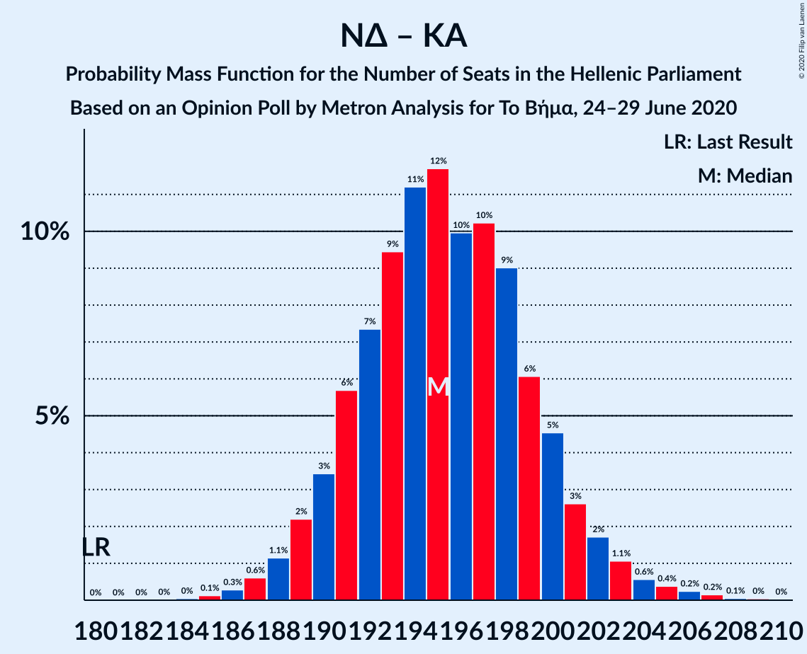

# Opinion Poll by Metron Analysis for Το Βήμα, 24–29 June 2020

<a href="#voting-intentions">Voting Intentions</a> | <a href="#seats">Seats</a> | <a href="#coalitions">Coalitions</a> | <a href="#technical-information">Technical Information</a>

## Voting Intentions

### Confidence Intervals

| Party | Last Result | Poll Result | 80% Confidence Interval | 90% Confidence Interval | 95% Confidence Interval | 99% Confidence Interval |
|:-----:|:-----------:|:-----------:|:-----------------------:|:-----------------------:|:-----------------------:|:-----------------------:|
| Νέα Δημοκρατία | 39.8% | 50.4% | 48.7–52.2% |48.2–52.6% |47.8–53.1% |47.0–53.9% |
| Συνασπισμός Ριζοσπαστικής Αριστεράς | 31.5% | 25.8% | 24.3–27.3% |23.9–27.8% |23.5–28.2% |22.9–28.9% |
| Κομμουνιστικό Κόμμα Ελλάδας | 5.3% | 7.6% | 6.7–8.6% |6.5–8.8% |6.3–9.1% |5.9–9.6% |
| Κίνημα Αλλαγής | 8.1% | 7.0% | 6.2–8.0% |5.9–8.2% |5.8–8.5% |5.4–8.9% |
| Μέτωπο Ευρωπαϊκής Ρεαλιστικής Ανυπακοής | 3.4% | 4.0% | 3.4–4.8% |3.3–5.0% |3.1–5.2% |2.9–5.6% |
| Ελληνική Λύση | 3.7% | 3.9% | 3.3–4.6% |3.1–4.9% |3.0–5.0% |2.7–5.4% |

*Note:* The poll result column reflects the actual value used in the calculations. Published results may vary slightly, and in addition be rounded to fewer digits.

## Seats

### Confidence Intervals

| Party | Last Result | Median | 80% Confidence Interval | 90% Confidence Interval | 95% Confidence Interval | 99% Confidence Interval |
|:-----:|:-----------:|:------:|:-----------------------:|:-----------------------:|:-----------------------:|:-----------------------:|
| <a href="#νέα-δημοκρατία">Νέα Δημοκρατία</a> | 158 | 177 | 173–182 |172–183 |171–184 |169–187 |
| <a href="#συνασπισμός-ριζοσπαστικής-αριστεράς">Συνασπισμός Ριζοσπαστικής Αριστεράς</a> | 86 | 65 | 61–69 |60–70 |60–71 |58–73 |
| <a href="#κομμουνιστικό-κόμμα-ελλάδας">Κομμουνιστικό Κόμμα Ελλάδας</a> | 15 | 19 | 17–22 |16–22 |16–23 |15–24 |
| <a href="#κίνημα-αλλαγής">Κίνημα Αλλαγής</a> | 22 | 18 | 16–20 |15–21 |15–21 |14–23 |
| <a href="#μέτωπο-ευρωπαϊκής-ρεαλιστικής-ανυπακοής">Μέτωπο Ευρωπαϊκής Ρεαλιστικής Ανυπακοής</a> | 9 | 10 | 9–12 |8–13 |8–13 |0–14 |
| <a href="#ελληνική-λύση">Ελληνική Λύση</a> | 10 | 10 | 8–12 |8–12 |0–13 |0–14 |

### Νέα Δημοκρατία

*For a full overview of the results for this party, see the [Νέα Δημοκρατία](party-νέαδημοκρατία.html) page.*

| Number of Seats | Probability | Accumulated | Special Marks |
|:---------------:|:-----------:|:-----------:|:-------------:|
| 158 | 0% | 100% | Last Result |
| 159 | 0% | 100% |  |
| 160 | 0% | 100% |  |
| 161 | 0% | 100% |  |
| 162 | 0% | 100% |  |
| 163 | 0% | 100% |  |
| 164 | 0% | 100% |  |
| 165 | 0% | 100% |  |
| 166 | 0% | 100% |  |
| 167 | 0.1% | 99.9% |  |
| 168 | 0.2% | 99.8% |  |
| 169 | 0.5% | 99.6% |  |
| 170 | 1.1% | 99.0% |  |
| 171 | 2% | 98% |  |
| 172 | 3% | 96% |  |
| 173 | 6% | 94% |  |
| 174 | 8% | 88% |  |
| 175 | 9% | 80% |  |
| 176 | 10% | 71% |  |
| 177 | 13% | 61% | Median |
| 178 | 11% | 48% |  |
| 179 | 11% | 37% |  |
| 180 | 8% | 26% |  |
| 181 | 7% | 18% |  |
| 182 | 4% | 11% |  |
| 183 | 3% | 7% |  |
| 184 | 2% | 4% |  |
| 185 | 1.0% | 2% |  |
| 186 | 0.6% | 1.4% |  |
| 187 | 0.4% | 0.8% |  |
| 188 | 0.2% | 0.4% |  |
| 189 | 0.1% | 0.2% |  |
| 190 | 0.1% | 0.1% |  |
| 191 | 0% | 0% |  |

### Συνασπισμός Ριζοσπαστικής Αριστεράς

*For a full overview of the results for this party, see the [Συνασπισμός Ριζοσπαστικής Αριστεράς](party-συνασπισμόςριζοσπαστικήςαριστεράς.html) page.*

| Number of Seats | Probability | Accumulated | Special Marks |
|:---------------:|:-----------:|:-----------:|:-------------:|
| 56 | 0.1% | 100% |  |
| 57 | 0.2% | 99.9% |  |
| 58 | 0.7% | 99.7% |  |
| 59 | 1.2% | 99.0% |  |
| 60 | 3% | 98% |  |
| 61 | 5% | 95% |  |
| 62 | 6% | 90% |  |
| 63 | 11% | 84% |  |
| 64 | 13% | 73% |  |
| 65 | 14% | 60% | Median |
| 66 | 13% | 46% |  |
| 67 | 9% | 33% |  |
| 68 | 8% | 23% |  |
| 69 | 8% | 15% |  |
| 70 | 3% | 8% |  |
| 71 | 2% | 4% |  |
| 72 | 1.1% | 2% |  |
| 73 | 0.5% | 0.9% |  |
| 74 | 0.3% | 0.4% |  |
| 75 | 0.1% | 0.2% |  |
| 76 | 0% | 0.1% |  |
| 77 | 0% | 0% |  |
| 78 | 0% | 0% |  |
| 79 | 0% | 0% |  |
| 80 | 0% | 0% |  |
| 81 | 0% | 0% |  |
| 82 | 0% | 0% |  |
| 83 | 0% | 0% |  |
| 84 | 0% | 0% |  |
| 85 | 0% | 0% |  |
| 86 | 0% | 0% | Last Result |

### Κομμουνιστικό Κόμμα Ελλάδας

*For a full overview of the results for this party, see the [Κομμουνιστικό Κόμμα Ελλάδας](party-κομμουνιστικόκόμμαελλάδας.html) page.*

| Number of Seats | Probability | Accumulated | Special Marks |
|:---------------:|:-----------:|:-----------:|:-------------:|
| 14 | 0.2% | 100% |  |
| 15 | 1.3% | 99.8% | Last Result |
| 16 | 5% | 98.5% |  |
| 17 | 7% | 93% |  |
| 18 | 19% | 86% |  |
| 19 | 20% | 67% | Median |
| 20 | 22% | 47% |  |
| 21 | 14% | 24% |  |
| 22 | 6% | 10% |  |
| 23 | 3% | 5% |  |
| 24 | 1.0% | 1.3% |  |
| 25 | 0.2% | 0.3% |  |
| 26 | 0.1% | 0.1% |  |
| 27 | 0% | 0% |  |

### Κίνημα Αλλαγής

*For a full overview of the results for this party, see the [Κίνημα Αλλαγής](party-κίνημααλλαγής.html) page.*

| Number of Seats | Probability | Accumulated | Special Marks |
|:---------------:|:-----------:|:-----------:|:-------------:|
| 13 | 0.2% | 100% |  |
| 14 | 2% | 99.7% |  |
| 15 | 7% | 98% |  |
| 16 | 13% | 91% |  |
| 17 | 19% | 77% |  |
| 18 | 24% | 59% | Median |
| 19 | 19% | 35% |  |
| 20 | 10% | 16% |  |
| 21 | 4% | 6% |  |
| 22 | 2% | 2% | Last Result |
| 23 | 0.4% | 0.5% |  |
| 24 | 0.1% | 0.1% |  |
| 25 | 0% | 0% |  |

### Μέτωπο Ευρωπαϊκής Ρεαλιστικής Ανυπακοής

*For a full overview of the results for this party, see the [Μέτωπο Ευρωπαϊκής Ρεαλιστικής Ανυπακοής](party-μέτωποευρωπαϊκήςρεαλιστικήςανυπακοής.html) page.*

| Number of Seats | Probability | Accumulated | Special Marks |
|:---------------:|:-----------:|:-----------:|:-------------:|
| 0 | 1.2% | 100% |  |
| 1 | 0% | 98.8% |  |
| 2 | 0% | 98.8% |  |
| 3 | 0% | 98.8% |  |
| 4 | 0% | 98.8% |  |
| 5 | 0% | 98.8% |  |
| 6 | 0% | 98.8% |  |
| 7 | 0% | 98.8% |  |
| 8 | 5% | 98.8% |  |
| 9 | 18% | 94% | Last Result |
| 10 | 32% | 76% | Median |
| 11 | 26% | 44% |  |
| 12 | 13% | 18% |  |
| 13 | 4% | 5% |  |
| 14 | 1.2% | 2% |  |
| 15 | 0.3% | 0.3% |  |
| 16 | 0% | 0% |  |

### Ελληνική Λύση

*For a full overview of the results for this party, see the [Ελληνική Λύση](party-ελληνικήλύση.html) page.*

| Number of Seats | Probability | Accumulated | Special Marks |
|:---------------:|:-----------:|:-----------:|:-------------:|
| 0 | 3% | 100% |  |
| 1 | 0% | 97% |  |
| 2 | 0% | 97% |  |
| 3 | 0% | 97% |  |
| 4 | 0% | 97% |  |
| 5 | 0% | 97% |  |
| 6 | 0% | 97% |  |
| 7 | 0% | 97% |  |
| 8 | 9% | 97% |  |
| 9 | 26% | 88% |  |
| 10 | 30% | 62% | Last Result, Median |
| 11 | 21% | 32% |  |
| 12 | 7% | 12% |  |
| 13 | 3% | 4% |  |
| 14 | 0.6% | 0.8% |  |
| 15 | 0.1% | 0.1% |  |
| 16 | 0% | 0% |  |

## Coalitions

### Confidence Intervals

| Coalition | Last Result | Median | Majority? | 80% Confidence Interval | 90% Confidence Interval | 95% Confidence Interval | 99% Confidence Interval |
|:---------:|:-----------:|:------:|:---------:|:-----------------------:|:-----------------------:|:-----------------------:|:-----------------------:|
| Νέα Δημοκρατία – Κίνημα Αλλαγής | 180 | 195 | 100% | 191–200 | 190–201 | 189–202 | 186–206 |
| Νέα Δημοκρατία | 158 | 177 | 100% | 173–182 | 172–183 | 171–184 | 169–187 |
| Συνασπισμός Ριζοσπαστικής Αριστεράς – Μέτωπο Ευρωπαϊκής Ρεαλιστικής Ανυπακοής | 95 | 75 | 0% | 72–80 | 70–81 | 69–82 | 66–84 |
| Συνασπισμός Ριζοσπαστικής Αριστεράς | 86 | 65 | 0% | 61–69 | 60–70 | 60–71 | 58–73 |

### Νέα Δημοκρατία – Κίνημα Αλλαγής

| Number of Seats | Probability | Accumulated | Special Marks |
|:---------------:|:-----------:|:-----------:|:-------------:|
| 180 | 0% | 100% | Last Result |
| 181 | 0% | 100% |  |
| 182 | 0% | 100% |  |
| 183 | 0% | 100% |  |
| 184 | 0.1% | 100% |  |
| 185 | 0.2% | 99.9% |  |
| 186 | 0.3% | 99.8% |  |
| 187 | 0.7% | 99.5% |  |
| 188 | 0.9% | 98.8% |  |
| 189 | 2% | 98% |  |
| 190 | 3% | 96% |  |
| 191 | 7% | 93% |  |
| 192 | 8% | 86% |  |
| 193 | 10% | 78% |  |
| 194 | 10% | 68% |  |
| 195 | 12% | 58% | Median |
| 196 | 11% | 47% |  |
| 197 | 8% | 36% |  |
| 198 | 11% | 28% |  |
| 199 | 7% | 17% |  |
| 200 | 5% | 10% |  |
| 201 | 2% | 6% |  |
| 202 | 1.3% | 4% |  |
| 203 | 0.9% | 2% |  |
| 204 | 0.5% | 1.4% |  |
| 205 | 0.3% | 0.9% |  |
| 206 | 0.3% | 0.5% |  |
| 207 | 0.1% | 0.2% |  |
| 208 | 0% | 0.1% |  |
| 209 | 0.1% | 0.1% |  |
| 210 | 0% | 0% |  |

### Νέα Δημοκρατία

| Number of Seats | Probability | Accumulated | Special Marks |
|:---------------:|:-----------:|:-----------:|:-------------:|
| 158 | 0% | 100% | Last Result |
| 159 | 0% | 100% |  |
| 160 | 0% | 100% |  |
| 161 | 0% | 100% |  |
| 162 | 0% | 100% |  |
| 163 | 0% | 100% |  |
| 164 | 0% | 100% |  |
| 165 | 0% | 100% |  |
| 166 | 0% | 100% |  |
| 167 | 0.1% | 99.9% |  |
| 168 | 0.2% | 99.8% |  |
| 169 | 0.5% | 99.6% |  |
| 170 | 1.1% | 99.0% |  |
| 171 | 2% | 98% |  |
| 172 | 3% | 96% |  |
| 173 | 6% | 94% |  |
| 174 | 8% | 88% |  |
| 175 | 9% | 80% |  |
| 176 | 10% | 71% |  |
| 177 | 13% | 61% | Median |
| 178 | 11% | 48% |  |
| 179 | 11% | 37% |  |
| 180 | 8% | 26% |  |
| 181 | 7% | 18% |  |
| 182 | 4% | 11% |  |
| 183 | 3% | 7% |  |
| 184 | 2% | 4% |  |
| 185 | 1.0% | 2% |  |
| 186 | 0.6% | 1.4% |  |
| 187 | 0.4% | 0.8% |  |
| 188 | 0.2% | 0.4% |  |
| 189 | 0.1% | 0.2% |  |
| 190 | 0.1% | 0.1% |  |
| 191 | 0% | 0% |  |

### Συνασπισμός Ριζοσπαστικής Αριστεράς – Μέτωπο Ευρωπαϊκής Ρεαλιστικής Ανυπακοής

| Number of Seats | Probability | Accumulated | Special Marks |
|:---------------:|:-----------:|:-----------:|:-------------:|
| 63 | 0.1% | 100% |  |
| 64 | 0% | 99.9% |  |
| 65 | 0.1% | 99.8% |  |
| 66 | 0.5% | 99.8% |  |
| 67 | 0.3% | 99.3% |  |
| 68 | 0.6% | 99.0% |  |
| 69 | 1.4% | 98% |  |
| 70 | 2% | 97% |  |
| 71 | 4% | 95% |  |
| 72 | 8% | 91% |  |
| 73 | 7% | 83% |  |
| 74 | 9% | 75% |  |
| 75 | 17% | 66% | Median |
| 76 | 13% | 49% |  |
| 77 | 8% | 37% |  |
| 78 | 11% | 29% |  |
| 79 | 8% | 18% |  |
| 80 | 4% | 10% |  |
| 81 | 3% | 6% |  |
| 82 | 2% | 4% |  |
| 83 | 0.7% | 2% |  |
| 84 | 0.6% | 0.9% |  |
| 85 | 0.2% | 0.3% |  |
| 86 | 0.1% | 0.1% |  |
| 87 | 0% | 0.1% |  |
| 88 | 0% | 0% |  |
| 89 | 0% | 0% |  |
| 90 | 0% | 0% |  |
| 91 | 0% | 0% |  |
| 92 | 0% | 0% |  |
| 93 | 0% | 0% |  |
| 94 | 0% | 0% |  |
| 95 | 0% | 0% | Last Result |

### Συνασπισμός Ριζοσπαστικής Αριστεράς

| Number of Seats | Probability | Accumulated | Special Marks |
|:---------------:|:-----------:|:-----------:|:-------------:|
| 56 | 0.1% | 100% |  |
| 57 | 0.2% | 99.9% |  |
| 58 | 0.7% | 99.7% |  |
| 59 | 1.2% | 99.0% |  |
| 60 | 3% | 98% |  |
| 61 | 5% | 95% |  |
| 62 | 6% | 90% |  |
| 63 | 11% | 84% |  |
| 64 | 13% | 73% |  |
| 65 | 14% | 60% | Median |
| 66 | 13% | 46% |  |
| 67 | 9% | 33% |  |
| 68 | 8% | 23% |  |
| 69 | 8% | 15% |  |
| 70 | 3% | 8% |  |
| 71 | 2% | 4% |  |
| 72 | 1.1% | 2% |  |
| 73 | 0.5% | 0.9% |  |
| 74 | 0.3% | 0.4% |  |
| 75 | 0.1% | 0.2% |  |
| 76 | 0% | 0.1% |  |
| 77 | 0% | 0% |  |
| 78 | 0% | 0% |  |
| 79 | 0% | 0% |  |
| 80 | 0% | 0% |  |
| 81 | 0% | 0% |  |
| 82 | 0% | 0% |  |
| 83 | 0% | 0% |  |
| 84 | 0% | 0% |  |
| 85 | 0% | 0% |  |
| 86 | 0% | 0% | Last Result |

## Technical Information

### Opinion Poll

+ **Polling firm:** Metron Analysis
+ **Commissioner(s):** Το Βήμα
+ **Fieldwork period:** 24–29 June 2020

### Calculations

+ **Sample size:** 1388
+ **Simulations done:** 131,072
+ **Error estimate:** 1.20%

