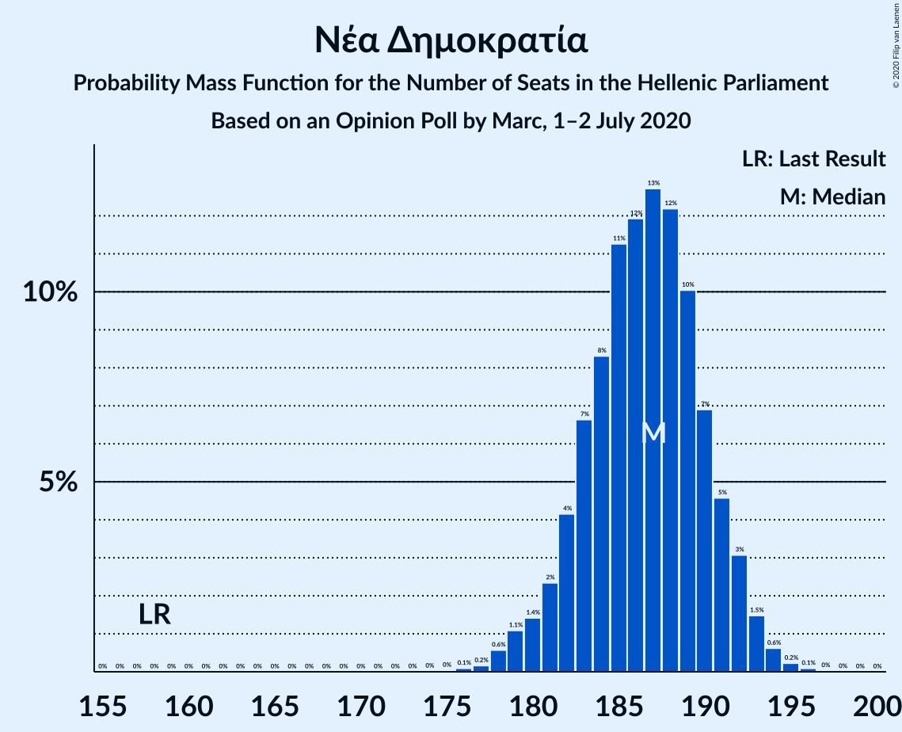
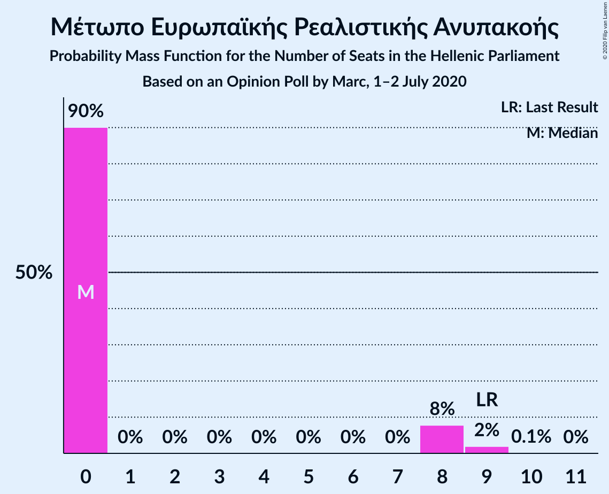

# Opinion Poll by Marc, 1–2 July 2020

<a href="#voting-intentions">Voting Intentions</a> | <a href="#seats">Seats</a> | <a href="#coalitions">Coalitions</a> | <a href="#technical-information">Technical Information</a>

## Voting Intentions

### Confidence Intervals

| Party | Last Result | Poll Result | 80% Confidence Interval | 90% Confidence Interval | 95% Confidence Interval | 99% Confidence Interval |
|:-----:|:-----------:|:-----------:|:-----------------------:|:-----------------------:|:-----------------------:|:-----------------------:|
| Νέα Δημοκρατία | 39.8% | 52.2% | 50.8–53.6% |50.4–54.0% |50.0–54.4% |49.3–55.1% |
| Συνασπισμός Ριζοσπαστικής Αριστεράς | 31.5% | 25.5% | 24.3–26.8% |23.9–27.1% |23.6–27.5% |23.1–28.1% |
| Κίνημα Αλλαγής | 8.1% | 7.0% | 6.3–7.8% |6.1–8.0% |6.0–8.2% |5.6–8.6% |
| Κομμουνιστικό Κόμμα Ελλάδας | 5.3% | 6.0% | 5.4–6.7% |5.2–7.0% |5.0–7.1% |4.8–7.5% |
| Ελληνική Λύση | 3.7% | 4.4% | 3.9–5.0% |3.7–5.2% |3.6–5.4% |3.3–5.7% |
| Μέτωπο Ευρωπαϊκής Ρεαλιστικής Ανυπακοής | 3.4% | 2.5% | 2.1–3.0% |2.0–3.2% |1.9–3.3% |1.7–3.6% |

*Note:* The poll result column reflects the actual value used in the calculations. Published results may vary slightly, and in addition be rounded to fewer digits.

## Seats

### Confidence Intervals

| Party | Last Result | Median | 80% Confidence Interval | 90% Confidence Interval | 95% Confidence Interval | 99% Confidence Interval |
|:-----:|:-----------:|:------:|:-----------------------:|:-----------------------:|:-----------------------:|:-----------------------:|
| <a href="#νέα-δημοκρατία">Νέα Δημοκρατία</a> | 158 | 186 | 182–191 |181–191 |180–192 |178–194 |
| <a href="#συνασπισμός-ριζοσπαστικής-αριστεράς">Συνασπισμός Ριζοσπαστικής Αριστεράς</a> | 86 | 67 | 63–70 |62–71 |62–72 |60–74 |
| <a href="#κίνημα-αλλαγής">Κίνημα Αλλαγής</a> | 22 | 18 | 17–20 |16–21 |16–22 |15–22 |
| <a href="#κομμουνιστικό-κόμμα-ελλάδας">Κομμουνιστικό Κόμμα Ελλάδας</a> | 15 | 16 | 14–18 |14–18 |13–19 |12–20 |
| <a href="#ελληνική-λύση">Ελληνική Λύση</a> | 10 | 12 | 10–13 |10–14 |9–14 |9–15 |
| <a href="#μέτωπο-ευρωπαϊκής-ρεαλιστικής-ανυπακοής">Μέτωπο Ευρωπαϊκής Ρεαλιστικής Ανυπακοής</a> | 9 | 0 | 0–8 |0–8 |0–8 |0–9 |

### Νέα Δημοκρατία

*For a full overview of the results for this party, see the [Νέα Δημοκρατία](party-νέαδημοκρατία.html) page.*

| Number of Seats | Probability | Accumulated | Special Marks |
|:---------------:|:-----------:|:-----------:|:-------------:|
| 158 | 0% | 100% | Last Result |
| 159 | 0% | 100% |  |
| 160 | 0% | 100% |  |
| 161 | 0% | 100% |  |
| 162 | 0% | 100% |  |
| 163 | 0% | 100% |  |
| 164 | 0% | 100% |  |
| 165 | 0% | 100% |  |
| 166 | 0% | 100% |  |
| 167 | 0% | 100% |  |
| 168 | 0% | 100% |  |
| 169 | 0% | 100% |  |
| 170 | 0% | 100% |  |
| 171 | 0% | 100% |  |
| 172 | 0% | 100% |  |
| 173 | 0% | 100% |  |
| 174 | 0% | 100% |  |
| 175 | 0% | 100% |  |
| 176 | 0.1% | 99.9% |  |
| 177 | 0.2% | 99.9% |  |
| 178 | 0.5% | 99.6% |  |
| 179 | 1.3% | 99.1% |  |
| 180 | 2% | 98% |  |
| 181 | 2% | 96% |  |
| 182 | 5% | 94% |  |
| 183 | 6% | 89% |  |
| 184 | 8% | 83% |  |
| 185 | 14% | 75% |  |
| 186 | 13% | 61% | Median |
| 187 | 10% | 48% |  |
| 188 | 11% | 38% |  |
| 189 | 9% | 27% |  |
| 190 | 8% | 18% |  |
| 191 | 6% | 11% |  |
| 192 | 3% | 5% |  |
| 193 | 1.3% | 2% |  |
| 194 | 0.5% | 0.9% |  |
| 195 | 0.3% | 0.4% |  |
| 196 | 0.1% | 0.1% |  |
| 197 | 0% | 0% |  |

### Συνασπισμός Ριζοσπαστικής Αριστεράς

*For a full overview of the results for this party, see the [Συνασπισμός Ριζοσπαστικής Αριστεράς](party-συνασπισμόςριζοσπαστικήςαριστεράς.html) page.*

| Number of Seats | Probability | Accumulated | Special Marks |
|:---------------:|:-----------:|:-----------:|:-------------:|
| 58 | 0.1% | 100% |  |
| 59 | 0.2% | 99.9% |  |
| 60 | 0.9% | 99.7% |  |
| 61 | 1.3% | 98.8% |  |
| 62 | 3% | 98% |  |
| 63 | 8% | 95% |  |
| 64 | 9% | 87% |  |
| 65 | 9% | 79% |  |
| 66 | 15% | 69% |  |
| 67 | 15% | 54% | Median |
| 68 | 13% | 40% |  |
| 69 | 11% | 27% |  |
| 70 | 8% | 16% |  |
| 71 | 4% | 8% |  |
| 72 | 2% | 4% |  |
| 73 | 1.1% | 2% |  |
| 74 | 0.4% | 0.5% |  |
| 75 | 0.1% | 0.2% |  |
| 76 | 0% | 0.1% |  |
| 77 | 0% | 0% |  |
| 78 | 0% | 0% |  |
| 79 | 0% | 0% |  |
| 80 | 0% | 0% |  |
| 81 | 0% | 0% |  |
| 82 | 0% | 0% |  |
| 83 | 0% | 0% |  |
| 84 | 0% | 0% |  |
| 85 | 0% | 0% |  |
| 86 | 0% | 0% | Last Result |

### Κίνημα Αλλαγής

*For a full overview of the results for this party, see the [Κίνημα Αλλαγής](party-κίνημααλλαγής.html) page.*

| Number of Seats | Probability | Accumulated | Special Marks |
|:---------------:|:-----------:|:-----------:|:-------------:|
| 14 | 0.2% | 100% |  |
| 15 | 2% | 99.8% |  |
| 16 | 7% | 98% |  |
| 17 | 19% | 90% |  |
| 18 | 22% | 71% | Median |
| 19 | 25% | 49% |  |
| 20 | 16% | 24% |  |
| 21 | 6% | 9% |  |
| 22 | 2% | 3% | Last Result |
| 23 | 0.4% | 0.5% |  |
| 24 | 0.1% | 0.1% |  |
| 25 | 0% | 0% |  |

### Κομμουνιστικό Κόμμα Ελλάδας

*For a full overview of the results for this party, see the [Κομμουνιστικό Κόμμα Ελλάδας](party-κομμουνιστικόκόμμαελλάδας.html) page.*

| Number of Seats | Probability | Accumulated | Special Marks |
|:---------------:|:-----------:|:-----------:|:-------------:|
| 12 | 0.5% | 100% |  |
| 13 | 4% | 99.4% |  |
| 14 | 16% | 95% |  |
| 15 | 23% | 79% | Last Result |
| 16 | 21% | 56% | Median |
| 17 | 21% | 35% |  |
| 18 | 12% | 15% |  |
| 19 | 2% | 3% |  |
| 20 | 0.5% | 0.6% |  |
| 21 | 0.1% | 0.1% |  |
| 22 | 0% | 0% |  |

### Ελληνική Λύση

*For a full overview of the results for this party, see the [Ελληνική Λύση](party-ελληνικήλύση.html) page.*

| Number of Seats | Probability | Accumulated | Special Marks |
|:---------------:|:-----------:|:-----------:|:-------------:|
| 8 | 0.2% | 100% |  |
| 9 | 3% | 99.8% |  |
| 10 | 15% | 97% | Last Result |
| 11 | 30% | 81% |  |
| 12 | 29% | 51% | Median |
| 13 | 16% | 22% |  |
| 14 | 5% | 6% |  |
| 15 | 1.2% | 1.3% |  |
| 16 | 0.1% | 0.2% |  |
| 17 | 0% | 0% |  |

### Μέτωπο Ευρωπαϊκής Ρεαλιστικής Ανυπακοής

*For a full overview of the results for this party, see the [Μέτωπο Ευρωπαϊκής Ρεαλιστικής Ανυπακοής](party-μέτωποευρωπαϊκήςρεαλιστικήςανυπακοής.html) page.*

| Number of Seats | Probability | Accumulated | Special Marks |
|:---------------:|:-----------:|:-----------:|:-------------:|
| 0 | 89% | 100% | Median |
| 1 | 0% | 11% |  |
| 2 | 0% | 11% |  |
| 3 | 0% | 11% |  |
| 4 | 0% | 11% |  |
| 5 | 0% | 11% |  |
| 6 | 0% | 11% |  |
| 7 | 0% | 11% |  |
| 8 | 9% | 11% |  |
| 9 | 2% | 2% | Last Result |
| 10 | 0.2% | 0.2% |  |
| 11 | 0% | 0% |  |

## Coalitions

### Confidence Intervals

| Coalition | Last Result | Median | Majority? | 80% Confidence Interval | 90% Confidence Interval | 95% Confidence Interval | 99% Confidence Interval |
|:---------:|:-----------:|:------:|:---------:|:-----------------------:|:-----------------------:|:-----------------------:|:-----------------------:|
| Νέα Δημοκρατία – Κίνημα Αλλαγής | 180 | 205 | 100% | 201–209 | 199–210 | 198–211 | 196–212 |
| Νέα Δημοκρατία | 158 | 186 | 100% | 182–191 | 181–191 | 180–192 | 178–194 |
| Συνασπισμός Ριζοσπαστικής Αριστεράς – Μέτωπο Ευρωπαϊκής Ρεαλιστικής Ανυπακοής | 95 | 67 | 0% | 64–72 | 63–74 | 62–75 | 61–77 |
| Συνασπισμός Ριζοσπαστικής Αριστεράς | 86 | 67 | 0% | 63–70 | 62–71 | 62–72 | 60–74 |

### Νέα Δημοκρατία – Κίνημα Αλλαγής

| Number of Seats | Probability | Accumulated | Special Marks |
|:---------------:|:-----------:|:-----------:|:-------------:|
| 180 | 0% | 100% | Last Result |
| 181 | 0% | 100% |  |
| 182 | 0% | 100% |  |
| 183 | 0% | 100% |  |
| 184 | 0% | 100% |  |
| 185 | 0% | 100% |  |
| 186 | 0% | 100% |  |
| 187 | 0% | 100% |  |
| 188 | 0% | 100% |  |
| 189 | 0% | 100% |  |
| 190 | 0% | 100% |  |
| 191 | 0% | 100% |  |
| 192 | 0% | 100% |  |
| 193 | 0% | 100% |  |
| 194 | 0.1% | 100% |  |
| 195 | 0.2% | 99.9% |  |
| 196 | 0.4% | 99.6% |  |
| 197 | 0.9% | 99.3% |  |
| 198 | 1.5% | 98% |  |
| 199 | 2% | 97% |  |
| 200 | 3% | 94% |  |
| 201 | 5% | 91% |  |
| 202 | 7% | 86% |  |
| 203 | 13% | 79% |  |
| 204 | 13% | 67% | Median |
| 205 | 10% | 54% |  |
| 206 | 11% | 44% |  |
| 207 | 12% | 33% |  |
| 208 | 7% | 21% |  |
| 209 | 7% | 14% |  |
| 210 | 3% | 7% |  |
| 211 | 2% | 4% |  |
| 212 | 0.7% | 1.2% |  |
| 213 | 0.3% | 0.5% |  |
| 214 | 0.1% | 0.2% |  |
| 215 | 0% | 0.1% |  |
| 216 | 0% | 0% |  |

### Νέα Δημοκρατία

| Number of Seats | Probability | Accumulated | Special Marks |
|:---------------:|:-----------:|:-----------:|:-------------:|
| 158 | 0% | 100% | Last Result |
| 159 | 0% | 100% |  |
| 160 | 0% | 100% |  |
| 161 | 0% | 100% |  |
| 162 | 0% | 100% |  |
| 163 | 0% | 100% |  |
| 164 | 0% | 100% |  |
| 165 | 0% | 100% |  |
| 166 | 0% | 100% |  |
| 167 | 0% | 100% |  |
| 168 | 0% | 100% |  |
| 169 | 0% | 100% |  |
| 170 | 0% | 100% |  |
| 171 | 0% | 100% |  |
| 172 | 0% | 100% |  |
| 173 | 0% | 100% |  |
| 174 | 0% | 100% |  |
| 175 | 0% | 100% |  |
| 176 | 0.1% | 99.9% |  |
| 177 | 0.2% | 99.9% |  |
| 178 | 0.5% | 99.6% |  |
| 179 | 1.3% | 99.1% |  |
| 180 | 2% | 98% |  |
| 181 | 2% | 96% |  |
| 182 | 5% | 94% |  |
| 183 | 6% | 89% |  |
| 184 | 8% | 83% |  |
| 185 | 14% | 75% |  |
| 186 | 13% | 61% | Median |
| 187 | 10% | 48% |  |
| 188 | 11% | 38% |  |
| 189 | 9% | 27% |  |
| 190 | 8% | 18% |  |
| 191 | 6% | 11% |  |
| 192 | 3% | 5% |  |
| 193 | 1.3% | 2% |  |
| 194 | 0.5% | 0.9% |  |
| 195 | 0.3% | 0.4% |  |
| 196 | 0.1% | 0.1% |  |
| 197 | 0% | 0% |  |

### Συνασπισμός Ριζοσπαστικής Αριστεράς – Μέτωπο Ευρωπαϊκής Ρεαλιστικής Ανυπακοής

| Number of Seats | Probability | Accumulated | Special Marks |
|:---------------:|:-----------:|:-----------:|:-------------:|
| 59 | 0.1% | 100% |  |
| 60 | 0.3% | 99.9% |  |
| 61 | 0.8% | 99.6% |  |
| 62 | 2% | 98.8% |  |
| 63 | 6% | 97% |  |
| 64 | 7% | 91% |  |
| 65 | 8% | 85% |  |
| 66 | 14% | 76% |  |
| 67 | 14% | 63% | Median |
| 68 | 13% | 49% |  |
| 69 | 11% | 36% |  |
| 70 | 9% | 26% |  |
| 71 | 5% | 17% |  |
| 72 | 4% | 11% |  |
| 73 | 2% | 7% |  |
| 74 | 2% | 5% |  |
| 75 | 1.2% | 3% |  |
| 76 | 1.4% | 2% |  |
| 77 | 0.7% | 0.9% |  |
| 78 | 0.1% | 0.3% |  |
| 79 | 0.1% | 0.2% |  |
| 80 | 0% | 0% |  |
| 81 | 0% | 0% |  |
| 82 | 0% | 0% |  |
| 83 | 0% | 0% |  |
| 84 | 0% | 0% |  |
| 85 | 0% | 0% |  |
| 86 | 0% | 0% |  |
| 87 | 0% | 0% |  |
| 88 | 0% | 0% |  |
| 89 | 0% | 0% |  |
| 90 | 0% | 0% |  |
| 91 | 0% | 0% |  |
| 92 | 0% | 0% |  |
| 93 | 0% | 0% |  |
| 94 | 0% | 0% |  |
| 95 | 0% | 0% | Last Result |

### Συνασπισμός Ριζοσπαστικής Αριστεράς

| Number of Seats | Probability | Accumulated | Special Marks |
|:---------------:|:-----------:|:-----------:|:-------------:|
| 58 | 0.1% | 100% |  |
| 59 | 0.2% | 99.9% |  |
| 60 | 0.9% | 99.7% |  |
| 61 | 1.3% | 98.8% |  |
| 62 | 3% | 98% |  |
| 63 | 8% | 95% |  |
| 64 | 9% | 87% |  |
| 65 | 9% | 79% |  |
| 66 | 15% | 69% |  |
| 67 | 15% | 54% | Median |
| 68 | 13% | 40% |  |
| 69 | 11% | 27% |  |
| 70 | 8% | 16% |  |
| 71 | 4% | 8% |  |
| 72 | 2% | 4% |  |
| 73 | 1.1% | 2% |  |
| 74 | 0.4% | 0.5% |  |
| 75 | 0.1% | 0.2% |  |
| 76 | 0% | 0.1% |  |
| 77 | 0% | 0% |  |
| 78 | 0% | 0% |  |
| 79 | 0% | 0% |  |
| 80 | 0% | 0% |  |
| 81 | 0% | 0% |  |
| 82 | 0% | 0% |  |
| 83 | 0% | 0% |  |
| 84 | 0% | 0% |  |
| 85 | 0% | 0% |  |
| 86 | 0% | 0% | Last Result |

## Technical Information

### Opinion Poll

+ **Polling firm:** Marc
+ **Commissioner(s):** —
+ **Fieldwork period:** 1–2 July 2020

### Calculations

+ **Sample size:** 2000
+ **Simulations done:** 131,072
+ **Error estimate:** 0.81%

