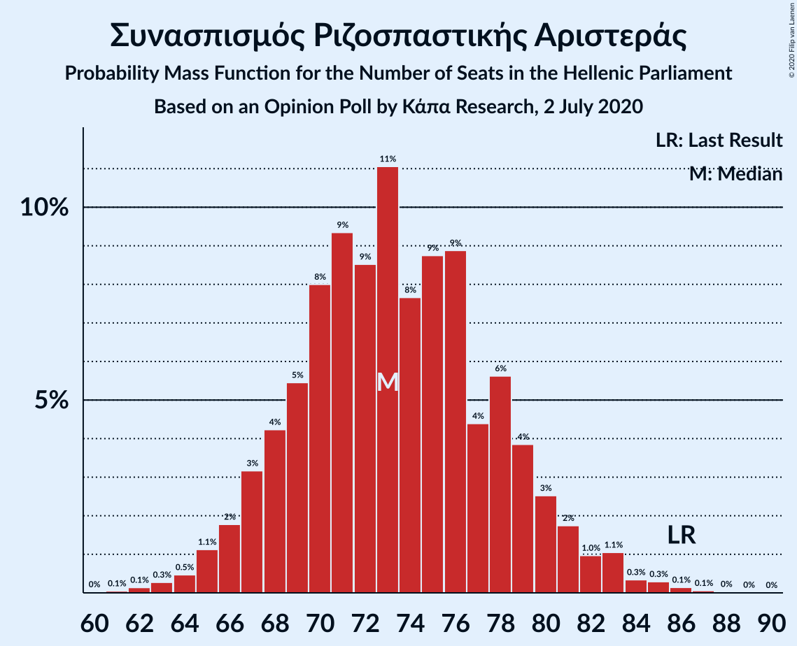
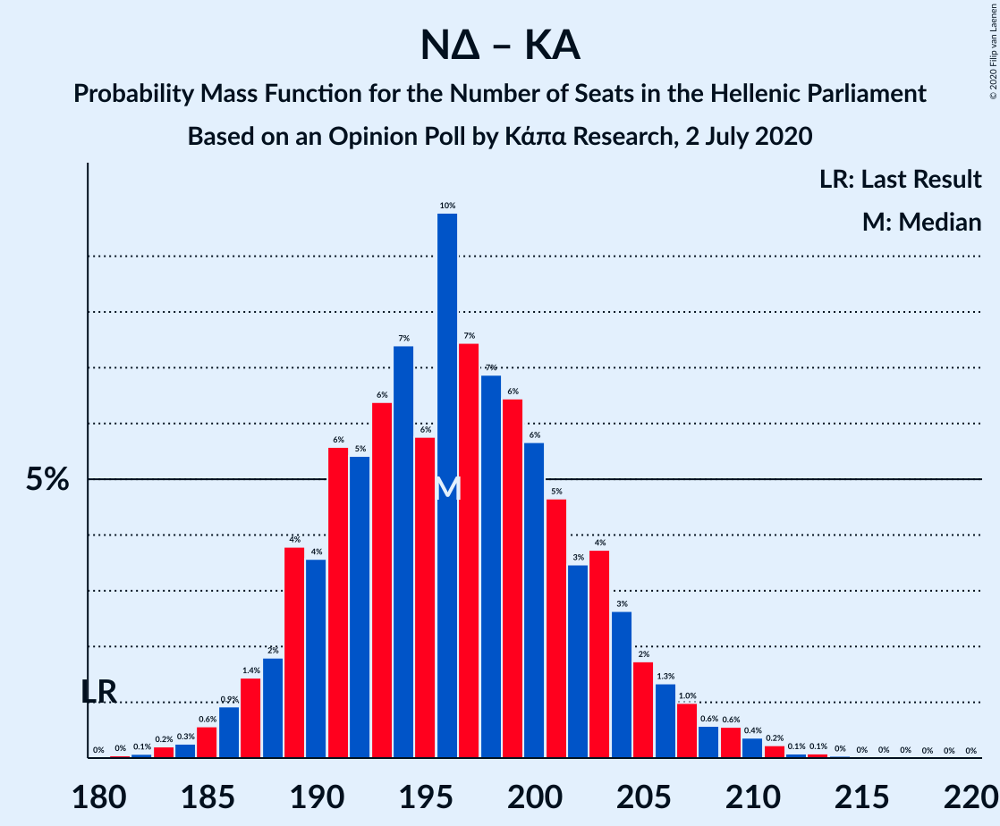

# Opinion Poll by Κάπα Research, 2 July 2020

<a href="#voting-intentions">Voting Intentions</a> | <a href="#seats">Seats</a> | <a href="#coalitions">Coalitions</a> | <a href="#technical-information">Technical Information</a>

## Voting Intentions

### Confidence Intervals

| Party | Last Result | Poll Result | 80% Confidence Interval | 90% Confidence Interval | 95% Confidence Interval | 99% Confidence Interval |
|:-----:|:-----------:|:-----------:|:-----------------------:|:-----------------------:|:-----------------------:|:-----------------------:|
| Νέα Δημοκρατία | 39.8% | 47.3% | 45.3–49.3% |44.7–49.9% |44.2–50.4% |43.3–51.4% |
| Συνασπισμός Ριζοσπαστικής Αριστεράς | 31.5% | 27.0% | 25.3–28.9% |24.8–29.4% |24.3–29.8% |23.5–30.7% |
| Κίνημα Αλλαγής | 8.1% | 6.5% | 5.6–7.6% |5.3–7.9% |5.1–8.2% |4.7–8.8% |
| Κομμουνιστικό Κόμμα Ελλάδας | 5.3% | 5.2% | 4.4–6.2% |4.2–6.5% |4.0–6.8% |3.6–7.3% |
| Ελληνική Λύση | 3.7% | 3.8% | 3.1–4.7% |2.9–5.0% |2.8–5.2% |2.5–5.6% |
| Μέτωπο Ευρωπαϊκής Ρεαλιστικής Ανυπακοής | 3.4% | 3.1% | 2.5–3.9% |2.3–4.2% |2.2–4.4% |1.9–4.8% |
| Χρυσή Αυγή | 2.9% | 1.7% | 1.3–2.4% |1.2–2.5% |1.1–2.7% |0.9–3.1% |

*Note:* The poll result column reflects the actual value used in the calculations. Published results may vary slightly, and in addition be rounded to fewer digits.

## Seats

### Confidence Intervals

| Party | Last Result | Median | 80% Confidence Interval | 90% Confidence Interval | 95% Confidence Interval | 99% Confidence Interval |
|:-----:|:-----------:|:------:|:-----------------------:|:-----------------------:|:-----------------------:|:-----------------------:|
| <a href="#νέα-δημοκρατία">Νέα Δημοκρατία</a> | 158 | 178 | 172–185 |171–187 |169–189 |167–192 |
| <a href="#συνασπισμός-ριζοσπαστικής-αριστεράς">Συνασπισμός Ριζοσπαστικής Αριστεράς</a> | 86 | 73 | 68–79 |67–80 |66–82 |63–85 |
| <a href="#κίνημα-αλλαγής">Κίνημα Αλλαγής</a> | 22 | 18 | 15–21 |14–22 |14–22 |13–24 |
| <a href="#κομμουνιστικό-κόμμα-ελλάδας">Κομμουνιστικό Κόμμα Ελλάδας</a> | 15 | 14 | 12–17 |11–18 |11–18 |10–20 |
| <a href="#ελληνική-λύση">Ελληνική Λύση</a> | 10 | 10 | 8–13 |0–13 |0–14 |0–15 |
| <a href="#μέτωπο-ευρωπαϊκής-ρεαλιστικής-ανυπακοής">Μέτωπο Ευρωπαϊκής Ρεαλιστικής Ανυπακοής</a> | 9 | 9 | 0–11 |0–11 |0–12 |0–13 |
| <a href="#χρυσή-αυγή">Χρυσή Αυγή</a> | 0 | 0 | 0 |0 |0 |0–8 |

### Νέα Δημοκρατία

*For a full overview of the results for this party, see the [Νέα Δημοκρατία](party-νέαδημοκρατία.html) page.*

| Number of Seats | Probability | Accumulated | Special Marks |
|:---------------:|:-----------:|:-----------:|:-------------:|
| 158 | 0% | 100% | Last Result |
| 159 | 0% | 100% |  |
| 160 | 0% | 100% |  |
| 161 | 0% | 100% |  |
| 162 | 0% | 100% |  |
| 163 | 0% | 100% |  |
| 164 | 0.1% | 99.9% |  |
| 165 | 0.1% | 99.9% |  |
| 166 | 0.2% | 99.8% |  |
| 167 | 0.5% | 99.5% |  |
| 168 | 0.7% | 99.1% |  |
| 169 | 1.2% | 98% |  |
| 170 | 2% | 97% |  |
| 171 | 3% | 95% |  |
| 172 | 4% | 92% |  |
| 173 | 4% | 89% |  |
| 174 | 5% | 84% |  |
| 175 | 7% | 79% |  |
| 176 | 7% | 72% |  |
| 177 | 9% | 65% |  |
| 178 | 7% | 56% | Median |
| 179 | 9% | 49% |  |
| 180 | 9% | 40% |  |
| 181 | 6% | 32% |  |
| 182 | 6% | 26% |  |
| 183 | 5% | 20% |  |
| 184 | 4% | 16% |  |
| 185 | 3% | 12% |  |
| 186 | 3% | 9% |  |
| 187 | 2% | 6% |  |
| 188 | 1.4% | 4% |  |
| 189 | 1.0% | 3% |  |
| 190 | 0.5% | 2% |  |
| 191 | 0.4% | 1.1% |  |
| 192 | 0.3% | 0.7% |  |
| 193 | 0.2% | 0.4% |  |
| 194 | 0.1% | 0.2% |  |
| 195 | 0% | 0.1% |  |
| 196 | 0% | 0.1% |  |
| 197 | 0% | 0% |  |

### Συνασπισμός Ριζοσπαστικής Αριστεράς

*For a full overview of the results for this party, see the [Συνασπισμός Ριζοσπαστικής Αριστεράς](party-συνασπισμόςριζοσπαστικήςαριστεράς.html) page.*

| Number of Seats | Probability | Accumulated | Special Marks |
|:---------------:|:-----------:|:-----------:|:-------------:|
| 61 | 0.1% | 100% |  |
| 62 | 0.1% | 99.9% |  |
| 63 | 0.3% | 99.8% |  |
| 64 | 0.5% | 99.5% |  |
| 65 | 1.1% | 99.0% |  |
| 66 | 2% | 98% |  |
| 67 | 3% | 96% |  |
| 68 | 4% | 93% |  |
| 69 | 5% | 89% |  |
| 70 | 8% | 83% |  |
| 71 | 9% | 75% |  |
| 72 | 9% | 66% |  |
| 73 | 11% | 57% | Median |
| 74 | 8% | 46% |  |
| 75 | 9% | 39% |  |
| 76 | 9% | 30% |  |
| 77 | 4% | 21% |  |
| 78 | 6% | 17% |  |
| 79 | 4% | 11% |  |
| 80 | 3% | 7% |  |
| 81 | 2% | 5% |  |
| 82 | 1.0% | 3% |  |
| 83 | 1.1% | 2% |  |
| 84 | 0.3% | 0.9% |  |
| 85 | 0.3% | 0.6% |  |
| 86 | 0.1% | 0.3% | Last Result |
| 87 | 0.1% | 0.1% |  |
| 88 | 0% | 0.1% |  |
| 89 | 0% | 0% |  |

### Κίνημα Αλλαγής

*For a full overview of the results for this party, see the [Κίνημα Αλλαγής](party-κίνημααλλαγής.html) page.*

| Number of Seats | Probability | Accumulated | Special Marks |
|:---------------:|:-----------:|:-----------:|:-------------:|
| 12 | 0.2% | 100% |  |
| 13 | 1.2% | 99.7% |  |
| 14 | 4% | 98.5% |  |
| 15 | 8% | 95% |  |
| 16 | 15% | 87% |  |
| 17 | 18% | 72% |  |
| 18 | 16% | 55% | Median |
| 19 | 16% | 38% |  |
| 20 | 11% | 22% |  |
| 21 | 5% | 11% |  |
| 22 | 4% | 6% | Last Result |
| 23 | 1.4% | 2% |  |
| 24 | 0.5% | 0.8% |  |
| 25 | 0.2% | 0.3% |  |
| 26 | 0.1% | 0.1% |  |
| 27 | 0% | 0% |  |

### Κομμουνιστικό Κόμμα Ελλάδας

*For a full overview of the results for this party, see the [Κομμουνιστικό Κόμμα Ελλάδας](party-κομμουνιστικόκόμμαελλάδας.html) page.*

| Number of Seats | Probability | Accumulated | Special Marks |
|:---------------:|:-----------:|:-----------:|:-------------:|
| 9 | 0.2% | 100% |  |
| 10 | 1.3% | 99.7% |  |
| 11 | 4% | 98% |  |
| 12 | 11% | 94% |  |
| 13 | 18% | 83% |  |
| 14 | 21% | 66% | Median |
| 15 | 17% | 45% | Last Result |
| 16 | 14% | 28% |  |
| 17 | 8% | 14% |  |
| 18 | 4% | 6% |  |
| 19 | 1.5% | 2% |  |
| 20 | 0.5% | 0.8% |  |
| 21 | 0.2% | 0.3% |  |
| 22 | 0% | 0.1% |  |
| 23 | 0% | 0% |  |

### Ελληνική Λύση

*For a full overview of the results for this party, see the [Ελληνική Λύση](party-ελληνικήλύση.html) page.*

| Number of Seats | Probability | Accumulated | Special Marks |
|:---------------:|:-----------:|:-----------:|:-------------:|
| 0 | 7% | 100% |  |
| 1 | 0% | 93% |  |
| 2 | 0% | 93% |  |
| 3 | 0% | 93% |  |
| 4 | 0% | 93% |  |
| 5 | 0% | 93% |  |
| 6 | 0% | 93% |  |
| 7 | 0% | 93% |  |
| 8 | 4% | 93% |  |
| 9 | 16% | 89% |  |
| 10 | 25% | 73% | Last Result, Median |
| 11 | 21% | 48% |  |
| 12 | 15% | 27% |  |
| 13 | 8% | 13% |  |
| 14 | 3% | 4% |  |
| 15 | 1.1% | 1.4% |  |
| 16 | 0.3% | 0.4% |  |
| 17 | 0.1% | 0.1% |  |
| 18 | 0% | 0% |  |

### Μέτωπο Ευρωπαϊκής Ρεαλιστικής Ανυπακοής

*For a full overview of the results for this party, see the [Μέτωπο Ευρωπαϊκής Ρεαλιστικής Ανυπακοής](party-μέτωποευρωπαϊκήςρεαλιστικήςανυπακοής.html) page.*

| Number of Seats | Probability | Accumulated | Special Marks |
|:---------------:|:-----------:|:-----------:|:-------------:|
| 0 | 38% | 100% |  |
| 1 | 0% | 62% |  |
| 2 | 0% | 62% |  |
| 3 | 0% | 62% |  |
| 4 | 0% | 62% |  |
| 5 | 0% | 62% |  |
| 6 | 0% | 62% |  |
| 7 | 0% | 62% |  |
| 8 | 11% | 62% |  |
| 9 | 24% | 50% | Last Result, Median |
| 10 | 16% | 26% |  |
| 11 | 7% | 11% |  |
| 12 | 2% | 3% |  |
| 13 | 0.8% | 1.0% |  |
| 14 | 0.2% | 0.2% |  |
| 15 | 0% | 0% |  |

### Χρυσή Αυγή

*For a full overview of the results for this party, see the [Χρυσή Αυγή](party-χρυσήαυγή.html) page.*

| Number of Seats | Probability | Accumulated | Special Marks |
|:---------------:|:-----------:|:-----------:|:-------------:|
| 0 | 99.4% | 100% | Last Result, Median |
| 1 | 0% | 0.6% |  |
| 2 | 0% | 0.6% |  |
| 3 | 0% | 0.6% |  |
| 4 | 0% | 0.6% |  |
| 5 | 0% | 0.6% |  |
| 6 | 0% | 0.6% |  |
| 7 | 0% | 0.6% |  |
| 8 | 0.3% | 0.6% |  |
| 9 | 0.2% | 0.3% |  |
| 10 | 0% | 0% |  |

## Coalitions

### Confidence Intervals

| Coalition | Last Result | Median | Majority? | 80% Confidence Interval | 90% Confidence Interval | 95% Confidence Interval | 99% Confidence Interval |
|:---------:|:-----------:|:------:|:---------:|:-----------------------:|:-----------------------:|:-----------------------:|:-----------------------:|
| Νέα Δημοκρατία – Κίνημα Αλλαγής | 180 | 196 | 100% | 190–203 | 188–205 | 187–207 | 184–210 |
| Νέα Δημοκρατία | 158 | 178 | 100% | 172–185 | 171–187 | 169–189 | 167–192 |
| Συνασπισμός Ριζοσπαστικής Αριστεράς – Μέτωπο Ευρωπαϊκής Ρεαλιστικής Ανυπακοής | 95 | 79 | 0% | 73–86 | 71–87 | 69–89 | 66–91 |
| Συνασπισμός Ριζοσπαστικής Αριστεράς | 86 | 73 | 0% | 68–79 | 67–80 | 66–82 | 63–85 |

### Νέα Δημοκρατία – Κίνημα Αλλαγής

| Number of Seats | Probability | Accumulated | Special Marks |
|:---------------:|:-----------:|:-----------:|:-------------:|
| 180 | 0% | 100% | Last Result |
| 181 | 0% | 100% |  |
| 182 | 0.1% | 99.9% |  |
| 183 | 0.2% | 99.8% |  |
| 184 | 0.3% | 99.6% |  |
| 185 | 0.6% | 99.4% |  |
| 186 | 0.9% | 98.8% |  |
| 187 | 1.4% | 98% |  |
| 188 | 2% | 96% |  |
| 189 | 4% | 95% |  |
| 190 | 4% | 91% |  |
| 191 | 6% | 87% |  |
| 192 | 5% | 82% |  |
| 193 | 6% | 76% |  |
| 194 | 7% | 70% |  |
| 195 | 6% | 63% |  |
| 196 | 10% | 57% | Median |
| 197 | 7% | 47% |  |
| 198 | 7% | 40% |  |
| 199 | 6% | 33% |  |
| 200 | 6% | 26% |  |
| 201 | 5% | 21% |  |
| 202 | 3% | 16% |  |
| 203 | 4% | 12% |  |
| 204 | 3% | 9% |  |
| 205 | 2% | 6% |  |
| 206 | 1.3% | 4% |  |
| 207 | 1.0% | 3% |  |
| 208 | 0.6% | 2% |  |
| 209 | 0.6% | 1.4% |  |
| 210 | 0.4% | 0.9% |  |
| 211 | 0.2% | 0.5% |  |
| 212 | 0.1% | 0.3% |  |
| 213 | 0.1% | 0.2% |  |
| 214 | 0% | 0.1% |  |
| 215 | 0% | 0.1% |  |
| 216 | 0% | 0% |  |

### Νέα Δημοκρατία

| Number of Seats | Probability | Accumulated | Special Marks |
|:---------------:|:-----------:|:-----------:|:-------------:|
| 158 | 0% | 100% | Last Result |
| 159 | 0% | 100% |  |
| 160 | 0% | 100% |  |
| 161 | 0% | 100% |  |
| 162 | 0% | 100% |  |
| 163 | 0% | 100% |  |
| 164 | 0.1% | 99.9% |  |
| 165 | 0.1% | 99.9% |  |
| 166 | 0.2% | 99.8% |  |
| 167 | 0.5% | 99.5% |  |
| 168 | 0.7% | 99.1% |  |
| 169 | 1.2% | 98% |  |
| 170 | 2% | 97% |  |
| 171 | 3% | 95% |  |
| 172 | 4% | 92% |  |
| 173 | 4% | 89% |  |
| 174 | 5% | 84% |  |
| 175 | 7% | 79% |  |
| 176 | 7% | 72% |  |
| 177 | 9% | 65% |  |
| 178 | 7% | 56% | Median |
| 179 | 9% | 49% |  |
| 180 | 9% | 40% |  |
| 181 | 6% | 32% |  |
| 182 | 6% | 26% |  |
| 183 | 5% | 20% |  |
| 184 | 4% | 16% |  |
| 185 | 3% | 12% |  |
| 186 | 3% | 9% |  |
| 187 | 2% | 6% |  |
| 188 | 1.4% | 4% |  |
| 189 | 1.0% | 3% |  |
| 190 | 0.5% | 2% |  |
| 191 | 0.4% | 1.1% |  |
| 192 | 0.3% | 0.7% |  |
| 193 | 0.2% | 0.4% |  |
| 194 | 0.1% | 0.2% |  |
| 195 | 0% | 0.1% |  |
| 196 | 0% | 0.1% |  |
| 197 | 0% | 0% |  |

### Συνασπισμός Ριζοσπαστικής Αριστεράς – Μέτωπο Ευρωπαϊκής Ρεαλιστικής Ανυπακοής

| Number of Seats | Probability | Accumulated | Special Marks |
|:---------------:|:-----------:|:-----------:|:-------------:|
| 64 | 0.1% | 100% |  |
| 65 | 0.1% | 99.9% |  |
| 66 | 0.3% | 99.8% |  |
| 67 | 0.4% | 99.5% |  |
| 68 | 0.7% | 99.1% |  |
| 69 | 2% | 98% |  |
| 70 | 0.9% | 97% |  |
| 71 | 4% | 96% |  |
| 72 | 2% | 92% |  |
| 73 | 5% | 90% |  |
| 74 | 4% | 86% |  |
| 75 | 4% | 81% |  |
| 76 | 7% | 77% |  |
| 77 | 6% | 70% |  |
| 78 | 6% | 64% |  |
| 79 | 8% | 58% |  |
| 80 | 10% | 50% |  |
| 81 | 7% | 40% |  |
| 82 | 5% | 33% | Median |
| 83 | 7% | 28% |  |
| 84 | 6% | 21% |  |
| 85 | 4% | 15% |  |
| 86 | 4% | 11% |  |
| 87 | 3% | 7% |  |
| 88 | 2% | 4% |  |
| 89 | 1.1% | 3% |  |
| 90 | 0.5% | 1.4% |  |
| 91 | 0.4% | 0.9% |  |
| 92 | 0.2% | 0.5% |  |
| 93 | 0.1% | 0.2% |  |
| 94 | 0% | 0.1% |  |
| 95 | 0% | 0.1% | Last Result |
| 96 | 0% | 0% |  |

### Συνασπισμός Ριζοσπαστικής Αριστεράς

| Number of Seats | Probability | Accumulated | Special Marks |
|:---------------:|:-----------:|:-----------:|:-------------:|
| 61 | 0.1% | 100% |  |
| 62 | 0.1% | 99.9% |  |
| 63 | 0.3% | 99.8% |  |
| 64 | 0.5% | 99.5% |  |
| 65 | 1.1% | 99.0% |  |
| 66 | 2% | 98% |  |
| 67 | 3% | 96% |  |
| 68 | 4% | 93% |  |
| 69 | 5% | 89% |  |
| 70 | 8% | 83% |  |
| 71 | 9% | 75% |  |
| 72 | 9% | 66% |  |
| 73 | 11% | 57% | Median |
| 74 | 8% | 46% |  |
| 75 | 9% | 39% |  |
| 76 | 9% | 30% |  |
| 77 | 4% | 21% |  |
| 78 | 6% | 17% |  |
| 79 | 4% | 11% |  |
| 80 | 3% | 7% |  |
| 81 | 2% | 5% |  |
| 82 | 1.0% | 3% |  |
| 83 | 1.1% | 2% |  |
| 84 | 0.3% | 0.9% |  |
| 85 | 0.3% | 0.6% |  |
| 86 | 0.1% | 0.3% | Last Result |
| 87 | 0.1% | 0.1% |  |
| 88 | 0% | 0.1% |  |
| 89 | 0% | 0% |  |

## Technical Information

### Opinion Poll

+ **Polling firm:** Κάπα Research
+ **Commissioner(s):** —
+ **Fieldwork period:** 2 July 2020

### Calculations

+ **Sample size:** 1000
+ **Simulations done:** 1,048,576
+ **Error estimate:** 1.22%

