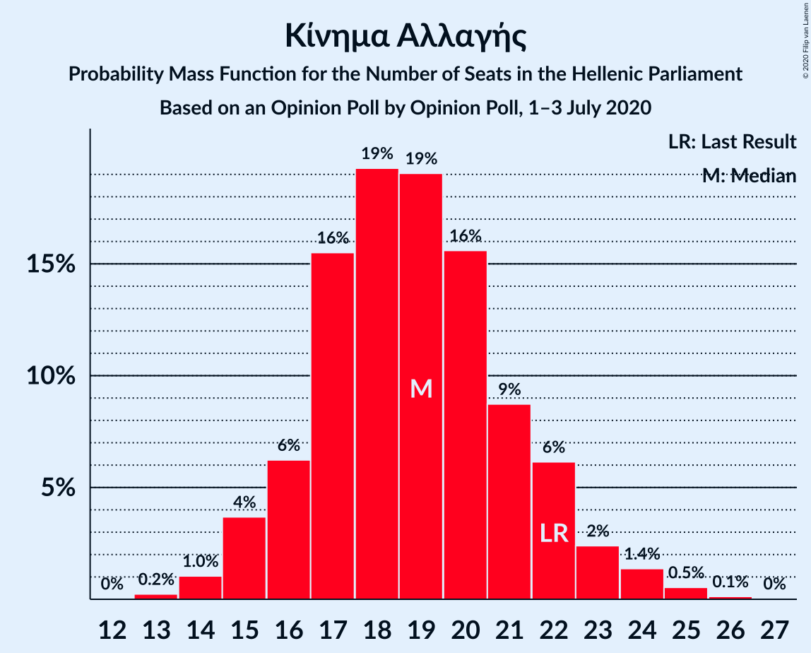
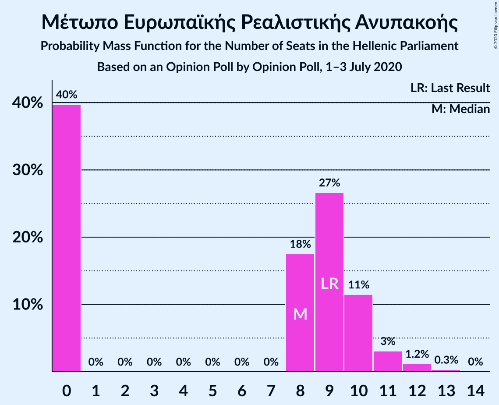

# Opinion Poll by Opinion Poll, 1–3 July 2020

<a href="#voting-intentions">Voting Intentions</a> | <a href="#seats">Seats</a> | <a href="#coalitions">Coalitions</a> | <a href="#technical-information">Technical Information</a>

## Voting Intentions

### Confidence Intervals

| Party | Last Result | Poll Result | 80% Confidence Interval | 90% Confidence Interval | 95% Confidence Interval | 99% Confidence Interval |
|:-----:|:-----------:|:-----------:|:-----------------------:|:-----------------------:|:-----------------------:|:-----------------------:|
| Νέα Δημοκρατία | 39.8% | 49.1% | 47.2–51.0% |46.6–51.6% |46.1–52.0% |45.2–53.0% |
| Συνασπισμός Ριζοσπαστικής Αριστεράς | 31.5% | 24.7% | 23.1–26.5% |22.6–26.9% |22.3–27.4% |21.5–28.2% |
| Κίνημα Αλλαγής | 8.1% | 6.9% | 6.0–8.0% |5.8–8.3% |5.5–8.6% |5.2–9.1% |
| Κομμουνιστικό Κόμμα Ελλάδας | 5.3% | 6.0% | 5.2–7.0% |4.9–7.3% |4.7–7.6% |4.4–8.1% |
| Ελληνική Λύση | 3.7% | 4.2% | 3.5–5.1% |3.3–5.3% |3.1–5.5% |2.9–6.0% |
| Μέτωπο Ευρωπαϊκής Ρεαλιστικής Ανυπακοής | 3.4% | 3.0% | 2.4–3.8% |2.3–4.0% |2.1–4.2% |1.9–4.6% |
| Χρυσή Αυγή | 2.9% | 1.4% | 1.0–1.9% |0.9–2.1% |0.8–2.2% |0.7–2.5% |
| Πλεύση Ελευθερίας | 1.5% | 1.4% | 1.0–1.9% |0.9–2.1% |0.8–2.2% |0.7–2.5% |

*Note:* The poll result column reflects the actual value used in the calculations. Published results may vary slightly, and in addition be rounded to fewer digits.

## Seats

### Confidence Intervals

| Party | Last Result | Median | 80% Confidence Interval | 90% Confidence Interval | 95% Confidence Interval | 99% Confidence Interval |
|:-----:|:-----------:|:------:|:-----------------------:|:-----------------------:|:-----------------------:|:-----------------------:|
| <a href="#νέα-δημοκρατία">Νέα Δημοκρατία</a> | 158 | 180 | 177–188 |176–192 |175–193 |170–193 |
| <a href="#συνασπισμός-ριζοσπαστικής-αριστεράς">Συνασπισμός Ριζοσπαστικής Αριστεράς</a> | 86 | 68 | 61–71 |60–73 |59–74 |56–76 |
| <a href="#κίνημα-αλλαγής">Κίνημα Αλλαγής</a> | 22 | 19 | 16–22 |15–22 |15–23 |14–25 |
| <a href="#κομμουνιστικό-κόμμα-ελλάδας">Κομμουνιστικό Κόμμα Ελλάδας</a> | 15 | 16 | 14–19 |13–20 |13–21 |12–22 |
| <a href="#ελληνική-λύση">Ελληνική Λύση</a> | 10 | 11 | 10–14 |9–15 |8–15 |0–16 |
| <a href="#μέτωπο-ευρωπαϊκής-ρεαλιστικής-ανυπακοής">Μέτωπο Ευρωπαϊκής Ρεαλιστικής Ανυπακοής</a> | 9 | 8 | 0–10 |0–10 |0–12 |0–12 |
| <a href="#χρυσή-αυγή">Χρυσή Αυγή</a> | 0 | 0 | 0 |0 |0 |0 |
| <a href="#πλεύση-ελευθερίας">Πλεύση Ελευθερίας</a> | 0 | 0 | 0 |0 |0 |0 |

### Νέα Δημοκρατία

*For a full overview of the results for this party, see the [Νέα Δημοκρατία](party-νέαδημοκρατία.html) page.*

| Number of Seats | Probability | Accumulated | Special Marks |
|:---------------:|:-----------:|:-----------:|:-------------:|
| 158 | 0% | 100% | Last Result |
| 159 | 0% | 100% |  |
| 160 | 0% | 100% |  |
| 161 | 0% | 100% |  |
| 162 | 0% | 100% |  |
| 163 | 0% | 100% |  |
| 164 | 0% | 100% |  |
| 165 | 0% | 100% |  |
| 166 | 0% | 100% |  |
| 167 | 0% | 100% |  |
| 168 | 0.3% | 100% |  |
| 169 | 0.1% | 99.7% |  |
| 170 | 0.2% | 99.6% |  |
| 171 | 0.2% | 99.4% |  |
| 172 | 0.4% | 99.1% |  |
| 173 | 0.5% | 98.8% |  |
| 174 | 0.6% | 98% |  |
| 175 | 2% | 98% |  |
| 176 | 2% | 96% |  |
| 177 | 9% | 94% |  |
| 178 | 21% | 84% |  |
| 179 | 9% | 63% |  |
| 180 | 5% | 54% | Median |
| 181 | 5% | 49% |  |
| 182 | 11% | 44% |  |
| 183 | 6% | 33% |  |
| 184 | 6% | 27% |  |
| 185 | 5% | 21% |  |
| 186 | 2% | 16% |  |
| 187 | 1.3% | 14% |  |
| 188 | 4% | 13% |  |
| 189 | 0.6% | 9% |  |
| 190 | 1.0% | 9% |  |
| 191 | 0.3% | 8% |  |
| 192 | 3% | 7% |  |
| 193 | 4% | 4% |  |
| 194 | 0.1% | 0.2% |  |
| 195 | 0% | 0.1% |  |
| 196 | 0.1% | 0.1% |  |
| 197 | 0% | 0% |  |

### Συνασπισμός Ριζοσπαστικής Αριστεράς

*For a full overview of the results for this party, see the [Συνασπισμός Ριζοσπαστικής Αριστεράς](party-συνασπισμόςριζοσπαστικήςαριστεράς.html) page.*

| Number of Seats | Probability | Accumulated | Special Marks |
|:---------------:|:-----------:|:-----------:|:-------------:|
| 55 | 0.3% | 100% |  |
| 56 | 0.2% | 99.7% |  |
| 57 | 0.4% | 99.5% |  |
| 58 | 1.1% | 99.1% |  |
| 59 | 0.9% | 98% |  |
| 60 | 4% | 97% |  |
| 61 | 4% | 93% |  |
| 62 | 2% | 89% |  |
| 63 | 6% | 87% |  |
| 64 | 5% | 81% |  |
| 65 | 7% | 76% |  |
| 66 | 7% | 69% |  |
| 67 | 9% | 63% |  |
| 68 | 29% | 54% | Median |
| 69 | 3% | 25% |  |
| 70 | 9% | 21% |  |
| 71 | 4% | 12% |  |
| 72 | 3% | 8% |  |
| 73 | 3% | 6% |  |
| 74 | 1.1% | 3% |  |
| 75 | 0.7% | 2% |  |
| 76 | 0.8% | 1.3% |  |
| 77 | 0.2% | 0.4% |  |
| 78 | 0.1% | 0.3% |  |
| 79 | 0.1% | 0.2% |  |
| 80 | 0.1% | 0.1% |  |
| 81 | 0% | 0% |  |
| 82 | 0% | 0% |  |
| 83 | 0% | 0% |  |
| 84 | 0% | 0% |  |
| 85 | 0% | 0% |  |
| 86 | 0% | 0% | Last Result |

### Κίνημα Αλλαγής

*For a full overview of the results for this party, see the [Κίνημα Αλλαγής](party-κίνημααλλαγής.html) page.*

| Number of Seats | Probability | Accumulated | Special Marks |
|:---------------:|:-----------:|:-----------:|:-------------:|
| 13 | 0.2% | 100% |  |
| 14 | 1.3% | 99.8% |  |
| 15 | 4% | 98.5% |  |
| 16 | 6% | 95% |  |
| 17 | 12% | 88% |  |
| 18 | 24% | 76% |  |
| 19 | 20% | 52% | Median |
| 20 | 9% | 31% |  |
| 21 | 10% | 22% |  |
| 22 | 8% | 12% | Last Result |
| 23 | 3% | 5% |  |
| 24 | 1.2% | 2% |  |
| 25 | 0.4% | 0.5% |  |
| 26 | 0.1% | 0.1% |  |
| 27 | 0% | 0% |  |

### Κομμουνιστικό Κόμμα Ελλάδας

*For a full overview of the results for this party, see the [Κομμουνιστικό Κόμμα Ελλάδας](party-κομμουνιστικόκόμμαελλάδας.html) page.*

| Number of Seats | Probability | Accumulated | Special Marks |
|:---------------:|:-----------:|:-----------:|:-------------:|
| 11 | 0.2% | 100% |  |
| 12 | 2% | 99.8% |  |
| 13 | 4% | 98% |  |
| 14 | 9% | 94% |  |
| 15 | 14% | 84% | Last Result |
| 16 | 28% | 71% | Median |
| 17 | 15% | 42% |  |
| 18 | 17% | 27% |  |
| 19 | 5% | 10% |  |
| 20 | 2% | 5% |  |
| 21 | 3% | 3% |  |
| 22 | 0.5% | 0.6% |  |
| 23 | 0.1% | 0.1% |  |
| 24 | 0% | 0% |  |

### Ελληνική Λύση

*For a full overview of the results for this party, see the [Ελληνική Λύση](party-ελληνικήλύση.html) page.*

| Number of Seats | Probability | Accumulated | Special Marks |
|:---------------:|:-----------:|:-----------:|:-------------:|
| 0 | 1.1% | 100% |  |
| 1 | 0% | 98.9% |  |
| 2 | 0% | 98.9% |  |
| 3 | 0% | 98.9% |  |
| 4 | 0% | 98.9% |  |
| 5 | 0% | 98.9% |  |
| 6 | 0% | 98.9% |  |
| 7 | 0% | 98.9% |  |
| 8 | 2% | 98.9% |  |
| 9 | 6% | 97% |  |
| 10 | 17% | 91% | Last Result |
| 11 | 27% | 73% | Median |
| 12 | 27% | 46% |  |
| 13 | 7% | 19% |  |
| 14 | 6% | 11% |  |
| 15 | 4% | 5% |  |
| 16 | 1.1% | 1.3% |  |
| 17 | 0.2% | 0.2% |  |
| 18 | 0.1% | 0.1% |  |
| 19 | 0% | 0% |  |

### Μέτωπο Ευρωπαϊκής Ρεαλιστικής Ανυπακοής

*For a full overview of the results for this party, see the [Μέτωπο Ευρωπαϊκής Ρεαλιστικής Ανυπακοής](party-μέτωποευρωπαϊκήςρεαλιστικήςανυπακοής.html) page.*

| Number of Seats | Probability | Accumulated | Special Marks |
|:---------------:|:-----------:|:-----------:|:-------------:|
| 0 | 44% | 100% |  |
| 1 | 0% | 56% |  |
| 2 | 0% | 56% |  |
| 3 | 0% | 56% |  |
| 4 | 0% | 56% |  |
| 5 | 0% | 56% |  |
| 6 | 0% | 56% |  |
| 7 | 0% | 56% |  |
| 8 | 7% | 56% | Median |
| 9 | 32% | 49% | Last Result |
| 10 | 12% | 17% |  |
| 11 | 2% | 5% |  |
| 12 | 2% | 3% |  |
| 13 | 0.1% | 0.2% |  |
| 14 | 0% | 0% |  |

### Χρυσή Αυγή

*For a full overview of the results for this party, see the [Χρυσή Αυγή](party-χρυσήαυγή.html) page.*

| Number of Seats | Probability | Accumulated | Special Marks |
|:---------------:|:-----------:|:-----------:|:-------------:|
| 0 | 100% | 100% | Last Result, Median |

### Πλεύση Ελευθερίας

*For a full overview of the results for this party, see the [Πλεύση Ελευθερίας](party-πλεύσηελευθερίας.html) page.*

| Number of Seats | Probability | Accumulated | Special Marks |
|:---------------:|:-----------:|:-----------:|:-------------:|
| 0 | 100% | 100% | Last Result, Median |

## Coalitions

### Confidence Intervals

| Coalition | Last Result | Median | Majority? | 80% Confidence Interval | 90% Confidence Interval | 95% Confidence Interval | 99% Confidence Interval |
|:---------:|:-----------:|:------:|:---------:|:-----------------------:|:-----------------------:|:-----------------------:|:-----------------------:|
| Νέα Δημοκρατία – Κίνημα Αλλαγής | 180 | 199 | 100% | 194–208 | 194–211 | 193–212 | 189–214 |
| Νέα Δημοκρατία | 158 | 180 | 100% | 177–188 | 176–192 | 175–193 | 170–193 |
| Συνασπισμός Ριζοσπαστικής Αριστεράς – Μέτωπο Ευρωπαϊκής Ρεαλιστικής Ανυπακοής | 95 | 73 | 0% | 64–78 | 63–80 | 61–80 | 60–83 |
| Συνασπισμός Ριζοσπαστικής Αριστεράς | 86 | 68 | 0% | 61–71 | 60–73 | 59–74 | 56–76 |

### Νέα Δημοκρατία – Κίνημα Αλλαγής

| Number of Seats | Probability | Accumulated | Special Marks |
|:---------------:|:-----------:|:-----------:|:-------------:|
| 180 | 0% | 100% | Last Result |
| 181 | 0% | 100% |  |
| 182 | 0% | 100% |  |
| 183 | 0% | 100% |  |
| 184 | 0% | 100% |  |
| 185 | 0% | 100% |  |
| 186 | 0.2% | 100% |  |
| 187 | 0.1% | 99.8% |  |
| 188 | 0.2% | 99.7% |  |
| 189 | 0.1% | 99.5% |  |
| 190 | 0.2% | 99.4% |  |
| 191 | 0.5% | 99.2% |  |
| 192 | 0.9% | 98.8% |  |
| 193 | 1.3% | 98% |  |
| 194 | 7% | 97% |  |
| 195 | 7% | 90% |  |
| 196 | 16% | 83% |  |
| 197 | 9% | 68% |  |
| 198 | 4% | 58% |  |
| 199 | 4% | 54% | Median |
| 200 | 5% | 50% |  |
| 201 | 4% | 44% |  |
| 202 | 7% | 40% |  |
| 203 | 11% | 33% |  |
| 204 | 2% | 21% |  |
| 205 | 4% | 19% |  |
| 206 | 2% | 15% |  |
| 207 | 2% | 13% |  |
| 208 | 3% | 12% |  |
| 209 | 1.0% | 9% |  |
| 210 | 1.0% | 8% |  |
| 211 | 3% | 7% |  |
| 212 | 3% | 4% |  |
| 213 | 0.1% | 0.7% |  |
| 214 | 0.7% | 0.7% |  |
| 215 | 0% | 0% |  |

### Νέα Δημοκρατία

| Number of Seats | Probability | Accumulated | Special Marks |
|:---------------:|:-----------:|:-----------:|:-------------:|
| 158 | 0% | 100% | Last Result |
| 159 | 0% | 100% |  |
| 160 | 0% | 100% |  |
| 161 | 0% | 100% |  |
| 162 | 0% | 100% |  |
| 163 | 0% | 100% |  |
| 164 | 0% | 100% |  |
| 165 | 0% | 100% |  |
| 166 | 0% | 100% |  |
| 167 | 0% | 100% |  |
| 168 | 0.3% | 100% |  |
| 169 | 0.1% | 99.7% |  |
| 170 | 0.2% | 99.6% |  |
| 171 | 0.2% | 99.4% |  |
| 172 | 0.4% | 99.1% |  |
| 173 | 0.5% | 98.8% |  |
| 174 | 0.6% | 98% |  |
| 175 | 2% | 98% |  |
| 176 | 2% | 96% |  |
| 177 | 9% | 94% |  |
| 178 | 21% | 84% |  |
| 179 | 9% | 63% |  |
| 180 | 5% | 54% | Median |
| 181 | 5% | 49% |  |
| 182 | 11% | 44% |  |
| 183 | 6% | 33% |  |
| 184 | 6% | 27% |  |
| 185 | 5% | 21% |  |
| 186 | 2% | 16% |  |
| 187 | 1.3% | 14% |  |
| 188 | 4% | 13% |  |
| 189 | 0.6% | 9% |  |
| 190 | 1.0% | 9% |  |
| 191 | 0.3% | 8% |  |
| 192 | 3% | 7% |  |
| 193 | 4% | 4% |  |
| 194 | 0.1% | 0.2% |  |
| 195 | 0% | 0.1% |  |
| 196 | 0.1% | 0.1% |  |
| 197 | 0% | 0% |  |

### Συνασπισμός Ριζοσπαστικής Αριστεράς – Μέτωπο Ευρωπαϊκής Ρεαλιστικής Ανυπακοής

| Number of Seats | Probability | Accumulated | Special Marks |
|:---------------:|:-----------:|:-----------:|:-------------:|
| 58 | 0.1% | 100% |  |
| 59 | 0% | 99.9% |  |
| 60 | 0.5% | 99.9% |  |
| 61 | 3% | 99.4% |  |
| 62 | 0.8% | 96% |  |
| 63 | 4% | 96% |  |
| 64 | 2% | 92% |  |
| 65 | 3% | 89% |  |
| 66 | 5% | 86% |  |
| 67 | 3% | 82% |  |
| 68 | 10% | 78% |  |
| 69 | 4% | 68% |  |
| 70 | 4% | 64% |  |
| 71 | 5% | 60% |  |
| 72 | 4% | 55% |  |
| 73 | 6% | 51% |  |
| 74 | 2% | 45% |  |
| 75 | 3% | 43% |  |
| 76 | 8% | 39% | Median |
| 77 | 20% | 32% |  |
| 78 | 3% | 12% |  |
| 79 | 0.8% | 8% |  |
| 80 | 5% | 8% |  |
| 81 | 2% | 2% |  |
| 82 | 0.2% | 0.8% |  |
| 83 | 0.3% | 0.6% |  |
| 84 | 0.2% | 0.3% |  |
| 85 | 0.1% | 0.1% |  |
| 86 | 0% | 0% |  |
| 87 | 0% | 0% |  |
| 88 | 0% | 0% |  |
| 89 | 0% | 0% |  |
| 90 | 0% | 0% |  |
| 91 | 0% | 0% |  |
| 92 | 0% | 0% |  |
| 93 | 0% | 0% |  |
| 94 | 0% | 0% |  |
| 95 | 0% | 0% | Last Result |

### Συνασπισμός Ριζοσπαστικής Αριστεράς

| Number of Seats | Probability | Accumulated | Special Marks |
|:---------------:|:-----------:|:-----------:|:-------------:|
| 55 | 0.3% | 100% |  |
| 56 | 0.2% | 99.7% |  |
| 57 | 0.4% | 99.5% |  |
| 58 | 1.1% | 99.1% |  |
| 59 | 0.9% | 98% |  |
| 60 | 4% | 97% |  |
| 61 | 4% | 93% |  |
| 62 | 2% | 89% |  |
| 63 | 6% | 87% |  |
| 64 | 5% | 81% |  |
| 65 | 7% | 76% |  |
| 66 | 7% | 69% |  |
| 67 | 9% | 63% |  |
| 68 | 29% | 54% | Median |
| 69 | 3% | 25% |  |
| 70 | 9% | 21% |  |
| 71 | 4% | 12% |  |
| 72 | 3% | 8% |  |
| 73 | 3% | 6% |  |
| 74 | 1.1% | 3% |  |
| 75 | 0.7% | 2% |  |
| 76 | 0.8% | 1.3% |  |
| 77 | 0.2% | 0.4% |  |
| 78 | 0.1% | 0.3% |  |
| 79 | 0.1% | 0.2% |  |
| 80 | 0.1% | 0.1% |  |
| 81 | 0% | 0% |  |
| 82 | 0% | 0% |  |
| 83 | 0% | 0% |  |
| 84 | 0% | 0% |  |
| 85 | 0% | 0% |  |
| 86 | 0% | 0% | Last Result |

## Technical Information

### Opinion Poll

+ **Polling firm:** Opinion Poll
+ **Commissioner(s):** —
+ **Fieldwork period:** 1–3 July 2020

### Calculations

+ **Sample size:** 1100
+ **Simulations done:** 131,072
+ **Error estimate:** 1.14%

