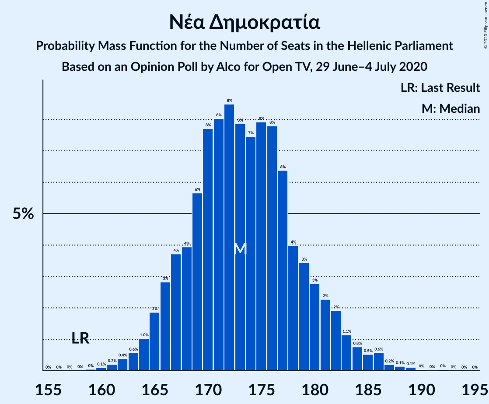
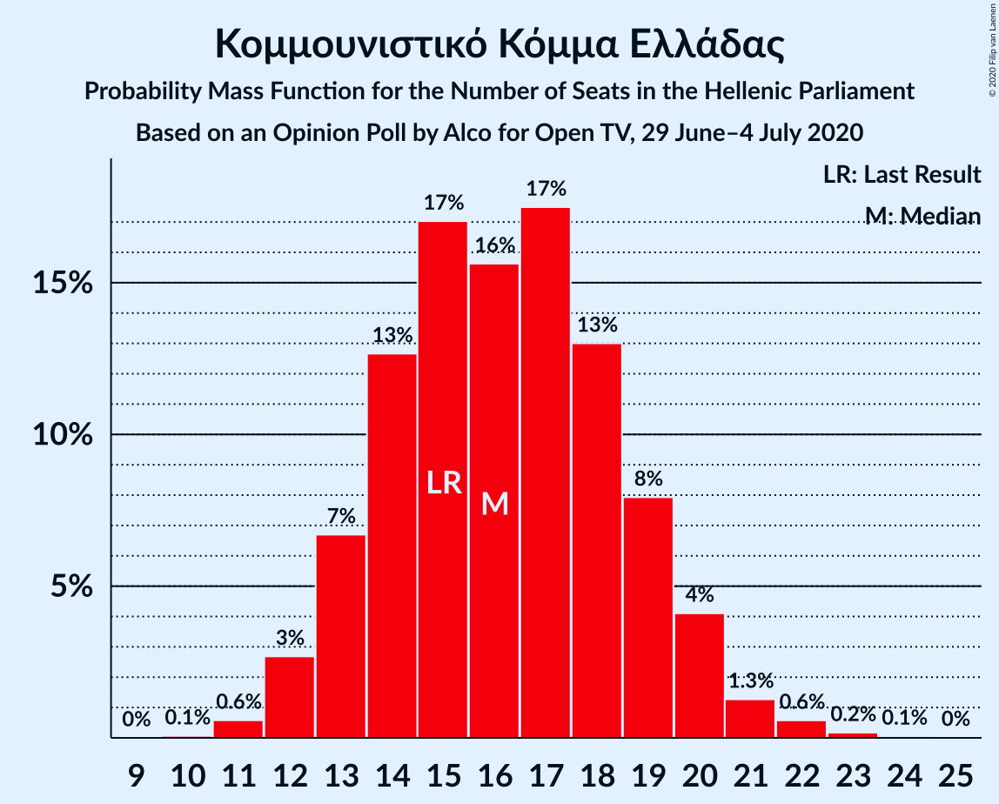
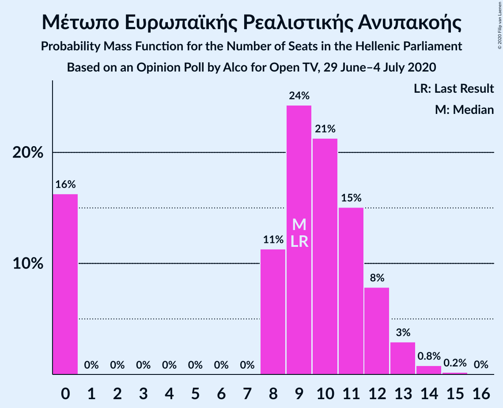
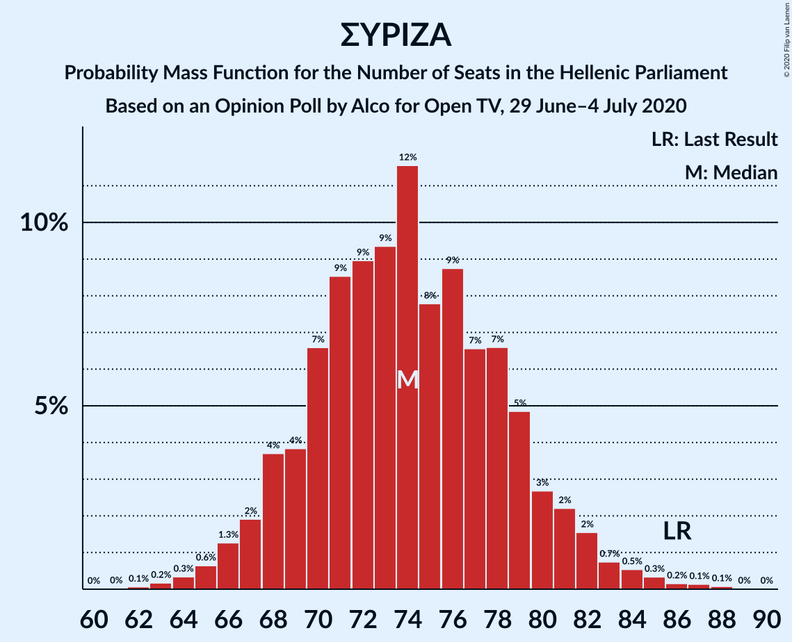

# Opinion Poll by Alco for Open TV, 29 June–4 July 2020

<a href="#voting-intentions">Voting Intentions</a> | <a href="#seats">Seats</a> | <a href="#coalitions">Coalitions</a> | <a href="#technical-information">Technical Information</a>

## Voting Intentions

### Confidence Intervals

| Party | Last Result | Poll Result | 80% Confidence Interval | 90% Confidence Interval | 95% Confidence Interval | 99% Confidence Interval |
|:-----:|:-----------:|:-----------:|:-----------------------:|:-----------------------:|:-----------------------:|:-----------------------:|
| Νέα Δημοκρατία | 39.8% | 46.1% | 44.1–48.1% |43.5–48.7% |43.0–49.2% |42.1–50.2% |
| Συνασπισμός Ριζοσπαστικής Αριστεράς | 31.5% | 27.7% | 25.9–29.6% |25.4–30.1% |25.0–30.6% |24.2–31.5% |
| Κίνημα Αλλαγής | 8.1% | 6.9% | 6.0–8.0% |5.7–8.4% |5.5–8.7% |5.1–9.2% |
| Κομμουνιστικό Κόμμα Ελλάδας | 5.3% | 6.0% | 5.1–7.1% |4.9–7.4% |4.7–7.7% |4.3–8.2% |
| Ελληνική Λύση | 3.7% | 3.7% | 3.0–4.6% |2.9–4.8% |2.7–5.1% |2.4–5.5% |
| Μέτωπο Ευρωπαϊκής Ρεαλιστικής Ανυπακοής | 3.4% | 3.5% | 2.9–4.4% |2.7–4.6% |2.5–4.8% |2.2–5.3% |
| Πλεύση Ελευθερίας | 1.5% | 1.3% | 0.9–1.9% |0.8–2.1% |0.8–2.2% |0.6–2.5% |

*Note:* The poll result column reflects the actual value used in the calculations. Published results may vary slightly, and in addition be rounded to fewer digits.

## Seats

### Confidence Intervals

| Party | Last Result | Median | 80% Confidence Interval | 90% Confidence Interval | 95% Confidence Interval | 99% Confidence Interval |
|:-----:|:-----------:|:------:|:-----------------------:|:-----------------------:|:-----------------------:|:-----------------------:|
| <a href="#νέα-δημοκρατία">Νέα Δημοκρατία</a> | 158 | 177 | 172–182 |168–184 |165–186 |161–192 |
| <a href="#συνασπισμός-ριζοσπαστικής-αριστεράς">Συνασπισμός Ριζοσπαστικής Αριστεράς</a> | 86 | 72 | 68–77 |67–81 |66–81 |63–83 |
| <a href="#κίνημα-αλλαγής">Κίνημα Αλλαγής</a> | 22 | 18 | 16–22 |15–22 |14–23 |13–24 |
| <a href="#κομμουνιστικό-κόμμα-ελλάδας">Κομμουνιστικό Κόμμα Ελλάδας</a> | 15 | 14 | 12–16 |12–19 |12–20 |11–23 |
| <a href="#ελληνική-λύση">Ελληνική Λύση</a> | 10 | 10 | 8–12 |0–13 |0–13 |0–15 |
| <a href="#μέτωπο-ευρωπαϊκής-ρεαλιστικής-ανυπακοής">Μέτωπο Ευρωπαϊκής Ρεαλιστικής Ανυπακοής</a> | 9 | 9 | 0–11 |0–12 |0–13 |0–14 |
| <a href="#πλεύση-ελευθερίας">Πλεύση Ελευθερίας</a> | 0 | 0 | 0 |0 |0 |0 |

### Νέα Δημοκρατία

*For a full overview of the results for this party, see the [Νέα Δημοκρατία](party-νέαδημοκρατία.html) page.*

| Number of Seats | Probability | Accumulated | Special Marks |
|:---------------:|:-----------:|:-----------:|:-------------:|
| 157 | 0% | 100% |  |
| 158 | 0% | 99.9% | Last Result |
| 159 | 0.1% | 99.9% |  |
| 160 | 0.1% | 99.8% |  |
| 161 | 0.3% | 99.7% |  |
| 162 | 0.4% | 99.4% |  |
| 163 | 0.4% | 99.1% |  |
| 164 | 0.9% | 98.7% |  |
| 165 | 0.9% | 98% |  |
| 166 | 0.7% | 97% |  |
| 167 | 1.2% | 96% |  |
| 168 | 0.4% | 95% |  |
| 169 | 0.9% | 95% |  |
| 170 | 0.8% | 94% |  |
| 171 | 0.9% | 93% |  |
| 172 | 5% | 92% |  |
| 173 | 2% | 87% |  |
| 174 | 7% | 86% |  |
| 175 | 5% | 79% |  |
| 176 | 20% | 74% |  |
| 177 | 15% | 55% | Median |
| 178 | 13% | 40% |  |
| 179 | 6% | 27% |  |
| 180 | 5% | 21% |  |
| 181 | 3% | 16% |  |
| 182 | 4% | 13% |  |
| 183 | 3% | 10% |  |
| 184 | 1.3% | 6% |  |
| 185 | 0.8% | 5% |  |
| 186 | 2% | 4% |  |
| 187 | 0.8% | 2% |  |
| 188 | 0.3% | 2% |  |
| 189 | 0.4% | 1.4% |  |
| 190 | 0.1% | 1.0% |  |
| 191 | 0.2% | 0.9% |  |
| 192 | 0.5% | 0.7% |  |
| 193 | 0.1% | 0.1% |  |
| 194 | 0% | 0% |  |

### Συνασπισμός Ριζοσπαστικής Αριστεράς

*For a full overview of the results for this party, see the [Συνασπισμός Ριζοσπαστικής Αριστεράς](party-συνασπισμόςριζοσπαστικήςαριστεράς.html) page.*

| Number of Seats | Probability | Accumulated | Special Marks |
|:---------------:|:-----------:|:-----------:|:-------------:|
| 61 | 0.1% | 100% |  |
| 62 | 0.2% | 99.9% |  |
| 63 | 0.2% | 99.7% |  |
| 64 | 0.9% | 99.5% |  |
| 65 | 1.0% | 98.5% |  |
| 66 | 1.4% | 98% |  |
| 67 | 3% | 96% |  |
| 68 | 6% | 93% |  |
| 69 | 7% | 87% |  |
| 70 | 11% | 80% |  |
| 71 | 6% | 69% |  |
| 72 | 14% | 63% | Median |
| 73 | 6% | 49% |  |
| 74 | 8% | 42% |  |
| 75 | 9% | 35% |  |
| 76 | 12% | 26% |  |
| 77 | 3% | 13% |  |
| 78 | 2% | 10% |  |
| 79 | 1.1% | 8% |  |
| 80 | 2% | 7% |  |
| 81 | 4% | 5% |  |
| 82 | 0.7% | 2% |  |
| 83 | 0.3% | 0.8% |  |
| 84 | 0.2% | 0.5% |  |
| 85 | 0.1% | 0.3% |  |
| 86 | 0.1% | 0.2% | Last Result |
| 87 | 0% | 0.1% |  |
| 88 | 0% | 0% |  |

### Κίνημα Αλλαγής

*For a full overview of the results for this party, see the [Κίνημα Αλλαγής](party-κίνημααλλαγής.html) page.*

| Number of Seats | Probability | Accumulated | Special Marks |
|:---------------:|:-----------:|:-----------:|:-------------:|
| 12 | 0.2% | 100% |  |
| 13 | 0.5% | 99.8% |  |
| 14 | 3% | 99.4% |  |
| 15 | 5% | 96% |  |
| 16 | 9% | 90% |  |
| 17 | 13% | 81% |  |
| 18 | 22% | 68% | Median |
| 19 | 16% | 46% |  |
| 20 | 13% | 30% |  |
| 21 | 6% | 16% |  |
| 22 | 5% | 10% | Last Result |
| 23 | 4% | 5% |  |
| 24 | 0.7% | 1.0% |  |
| 25 | 0.2% | 0.3% |  |
| 26 | 0.1% | 0.1% |  |
| 27 | 0% | 0% |  |

### Κομμουνιστικό Κόμμα Ελλάδας

*For a full overview of the results for this party, see the [Κομμουνιστικό Κόμμα Ελλάδας](party-κομμουνιστικόκόμμαελλάδας.html) page.*

| Number of Seats | Probability | Accumulated | Special Marks |
|:---------------:|:-----------:|:-----------:|:-------------:|
| 10 | 0.3% | 100% |  |
| 11 | 2% | 99.7% |  |
| 12 | 13% | 98% |  |
| 13 | 13% | 85% |  |
| 14 | 38% | 72% | Median |
| 15 | 17% | 34% | Last Result |
| 16 | 7% | 17% |  |
| 17 | 2% | 10% |  |
| 18 | 2% | 7% |  |
| 19 | 1.1% | 5% |  |
| 20 | 2% | 4% |  |
| 21 | 0.8% | 2% |  |
| 22 | 0.8% | 1.5% |  |
| 23 | 0.4% | 0.6% |  |
| 24 | 0.1% | 0.2% |  |
| 25 | 0.1% | 0.1% |  |
| 26 | 0% | 0% |  |

### Ελληνική Λύση

*For a full overview of the results for this party, see the [Ελληνική Λύση](party-ελληνικήλύση.html) page.*

| Number of Seats | Probability | Accumulated | Special Marks |
|:---------------:|:-----------:|:-----------:|:-------------:|
| 0 | 9% | 100% |  |
| 1 | 0% | 91% |  |
| 2 | 0% | 91% |  |
| 3 | 0% | 91% |  |
| 4 | 0% | 91% |  |
| 5 | 0% | 91% |  |
| 6 | 0% | 91% |  |
| 7 | 0% | 91% |  |
| 8 | 5% | 91% |  |
| 9 | 28% | 86% |  |
| 10 | 26% | 58% | Last Result, Median |
| 11 | 15% | 32% |  |
| 12 | 9% | 17% |  |
| 13 | 6% | 8% |  |
| 14 | 1.2% | 2% |  |
| 15 | 0.5% | 0.6% |  |
| 16 | 0.1% | 0.1% |  |
| 17 | 0% | 0% |  |

### Μέτωπο Ευρωπαϊκής Ρεαλιστικής Ανυπακοής

*For a full overview of the results for this party, see the [Μέτωπο Ευρωπαϊκής Ρεαλιστικής Ανυπακοής](party-μέτωποευρωπαϊκήςρεαλιστικήςανυπακοής.html) page.*

| Number of Seats | Probability | Accumulated | Special Marks |
|:---------------:|:-----------:|:-----------:|:-------------:|
| 0 | 17% | 100% |  |
| 1 | 0% | 83% |  |
| 2 | 0% | 83% |  |
| 3 | 0% | 83% |  |
| 4 | 0% | 83% |  |
| 5 | 0% | 83% |  |
| 6 | 0% | 83% |  |
| 7 | 0% | 83% |  |
| 8 | 9% | 83% |  |
| 9 | 25% | 74% | Last Result, Median |
| 10 | 29% | 48% |  |
| 11 | 11% | 20% |  |
| 12 | 6% | 9% |  |
| 13 | 2% | 3% |  |
| 14 | 0.8% | 0.9% |  |
| 15 | 0.1% | 0.1% |  |
| 16 | 0% | 0% |  |

### Πλεύση Ελευθερίας

*For a full overview of the results for this party, see the [Πλεύση Ελευθερίας](party-πλεύσηελευθερίας.html) page.*

| Number of Seats | Probability | Accumulated | Special Marks |
|:---------------:|:-----------:|:-----------:|:-------------:|
| 0 | 99.9% | 100% | Last Result, Median |
| 1 | 0% | 0.1% |  |
| 2 | 0% | 0.1% |  |
| 3 | 0% | 0.1% |  |
| 4 | 0% | 0.1% |  |
| 5 | 0% | 0.1% |  |
| 6 | 0% | 0.1% |  |
| 7 | 0% | 0.1% |  |
| 8 | 0.1% | 0.1% |  |
| 9 | 0% | 0% |  |

## Coalitions

### Confidence Intervals

| Coalition | Last Result | Median | Majority? | 80% Confidence Interval | 90% Confidence Interval | 95% Confidence Interval | 99% Confidence Interval |
|:---------:|:-----------:|:------:|:---------:|:-----------------------:|:-----------------------:|:-----------------------:|:-----------------------:|
| Νέα Δημοκρατία – Κίνημα Αλλαγής | 180 | 195 | 100% | 190–201 | 187–203 | 183–205 | 180–209 |
| Νέα Δημοκρατία | 158 | 177 | 100% | 172–182 | 168–184 | 165–186 | 161–192 |
| Συνασπισμός Ριζοσπαστικής Αριστεράς – Μέτωπο Ευρωπαϊκής Ρεαλιστικής Ανυπακοής | 95 | 82 | 0% | 75–87 | 73–88 | 72–90 | 68–93 |
| Συνασπισμός Ριζοσπαστικής Αριστεράς | 86 | 72 | 0% | 68–77 | 67–81 | 66–81 | 63–83 |

### Νέα Δημοκρατία – Κίνημα Αλλαγής

| Number of Seats | Probability | Accumulated | Special Marks |
|:---------------:|:-----------:|:-----------:|:-------------:|
| 177 | 0.1% | 100% |  |
| 178 | 0.1% | 99.9% |  |
| 179 | 0.2% | 99.8% |  |
| 180 | 0.3% | 99.6% | Last Result |
| 181 | 0.4% | 99.3% |  |
| 182 | 0.5% | 99.0% |  |
| 183 | 1.0% | 98% |  |
| 184 | 0.8% | 97% |  |
| 185 | 0.3% | 97% |  |
| 186 | 1.1% | 96% |  |
| 187 | 0.4% | 95% |  |
| 188 | 1.4% | 95% |  |
| 189 | 3% | 93% |  |
| 190 | 4% | 90% |  |
| 191 | 2% | 86% |  |
| 192 | 7% | 84% |  |
| 193 | 6% | 77% |  |
| 194 | 11% | 72% |  |
| 195 | 15% | 61% | Median |
| 196 | 8% | 46% |  |
| 197 | 10% | 38% |  |
| 198 | 7% | 29% |  |
| 199 | 5% | 22% |  |
| 200 | 4% | 17% |  |
| 201 | 5% | 12% |  |
| 202 | 2% | 7% |  |
| 203 | 1.0% | 5% |  |
| 204 | 1.4% | 4% |  |
| 205 | 0.5% | 3% |  |
| 206 | 1.0% | 2% |  |
| 207 | 0.2% | 1.3% |  |
| 208 | 0.2% | 1.2% |  |
| 209 | 0.7% | 1.0% |  |
| 210 | 0.1% | 0.3% |  |
| 211 | 0% | 0.2% |  |
| 212 | 0% | 0.2% |  |
| 213 | 0% | 0.1% |  |
| 214 | 0.1% | 0.1% |  |
| 215 | 0% | 0% |  |

### Νέα Δημοκρατία

| Number of Seats | Probability | Accumulated | Special Marks |
|:---------------:|:-----------:|:-----------:|:-------------:|
| 157 | 0% | 100% |  |
| 158 | 0% | 99.9% | Last Result |
| 159 | 0.1% | 99.9% |  |
| 160 | 0.1% | 99.8% |  |
| 161 | 0.3% | 99.7% |  |
| 162 | 0.4% | 99.4% |  |
| 163 | 0.4% | 99.1% |  |
| 164 | 0.9% | 98.7% |  |
| 165 | 0.9% | 98% |  |
| 166 | 0.7% | 97% |  |
| 167 | 1.2% | 96% |  |
| 168 | 0.4% | 95% |  |
| 169 | 0.9% | 95% |  |
| 170 | 0.8% | 94% |  |
| 171 | 0.9% | 93% |  |
| 172 | 5% | 92% |  |
| 173 | 2% | 87% |  |
| 174 | 7% | 86% |  |
| 175 | 5% | 79% |  |
| 176 | 20% | 74% |  |
| 177 | 15% | 55% | Median |
| 178 | 13% | 40% |  |
| 179 | 6% | 27% |  |
| 180 | 5% | 21% |  |
| 181 | 3% | 16% |  |
| 182 | 4% | 13% |  |
| 183 | 3% | 10% |  |
| 184 | 1.3% | 6% |  |
| 185 | 0.8% | 5% |  |
| 186 | 2% | 4% |  |
| 187 | 0.8% | 2% |  |
| 188 | 0.3% | 2% |  |
| 189 | 0.4% | 1.4% |  |
| 190 | 0.1% | 1.0% |  |
| 191 | 0.2% | 0.9% |  |
| 192 | 0.5% | 0.7% |  |
| 193 | 0.1% | 0.1% |  |
| 194 | 0% | 0% |  |

### Συνασπισμός Ριζοσπαστικής Αριστεράς – Μέτωπο Ευρωπαϊκής Ρεαλιστικής Ανυπακοής

| Number of Seats | Probability | Accumulated | Special Marks |
|:---------------:|:-----------:|:-----------:|:-------------:|
| 66 | 0.1% | 100% |  |
| 67 | 0.2% | 99.8% |  |
| 68 | 0.4% | 99.7% |  |
| 69 | 0.4% | 99.2% |  |
| 70 | 0.8% | 98.8% |  |
| 71 | 0.3% | 98% |  |
| 72 | 0.4% | 98% |  |
| 73 | 2% | 97% |  |
| 74 | 3% | 95% |  |
| 75 | 4% | 92% |  |
| 76 | 3% | 88% |  |
| 77 | 6% | 85% |  |
| 78 | 10% | 80% |  |
| 79 | 7% | 70% |  |
| 80 | 5% | 63% |  |
| 81 | 7% | 58% | Median |
| 82 | 17% | 50% |  |
| 83 | 3% | 33% |  |
| 84 | 8% | 30% |  |
| 85 | 7% | 22% |  |
| 86 | 5% | 16% |  |
| 87 | 4% | 11% |  |
| 88 | 2% | 6% |  |
| 89 | 2% | 5% |  |
| 90 | 0.7% | 3% |  |
| 91 | 1.4% | 2% |  |
| 92 | 0.3% | 0.8% |  |
| 93 | 0.3% | 0.6% |  |
| 94 | 0.2% | 0.3% |  |
| 95 | 0% | 0.1% | Last Result |
| 96 | 0.1% | 0.1% |  |
| 97 | 0% | 0% |  |

### Συνασπισμός Ριζοσπαστικής Αριστεράς

| Number of Seats | Probability | Accumulated | Special Marks |
|:---------------:|:-----------:|:-----------:|:-------------:|
| 61 | 0.1% | 100% |  |
| 62 | 0.2% | 99.9% |  |
| 63 | 0.2% | 99.7% |  |
| 64 | 0.9% | 99.5% |  |
| 65 | 1.0% | 98.5% |  |
| 66 | 1.4% | 98% |  |
| 67 | 3% | 96% |  |
| 68 | 6% | 93% |  |
| 69 | 7% | 87% |  |
| 70 | 11% | 80% |  |
| 71 | 6% | 69% |  |
| 72 | 14% | 63% | Median |
| 73 | 6% | 49% |  |
| 74 | 8% | 42% |  |
| 75 | 9% | 35% |  |
| 76 | 12% | 26% |  |
| 77 | 3% | 13% |  |
| 78 | 2% | 10% |  |
| 79 | 1.1% | 8% |  |
| 80 | 2% | 7% |  |
| 81 | 4% | 5% |  |
| 82 | 0.7% | 2% |  |
| 83 | 0.3% | 0.8% |  |
| 84 | 0.2% | 0.5% |  |
| 85 | 0.1% | 0.3% |  |
| 86 | 0.1% | 0.2% | Last Result |
| 87 | 0% | 0.1% |  |
| 88 | 0% | 0% |  |

## Technical Information

### Opinion Poll

+ **Polling firm:** Alco
+ **Commissioner(s):** Open TV
+ **Fieldwork period:** 29 June–4 July 2020

### Calculations

+ **Sample size:** 1000
+ **Simulations done:** 131,072
+ **Error estimate:** 0.30%

