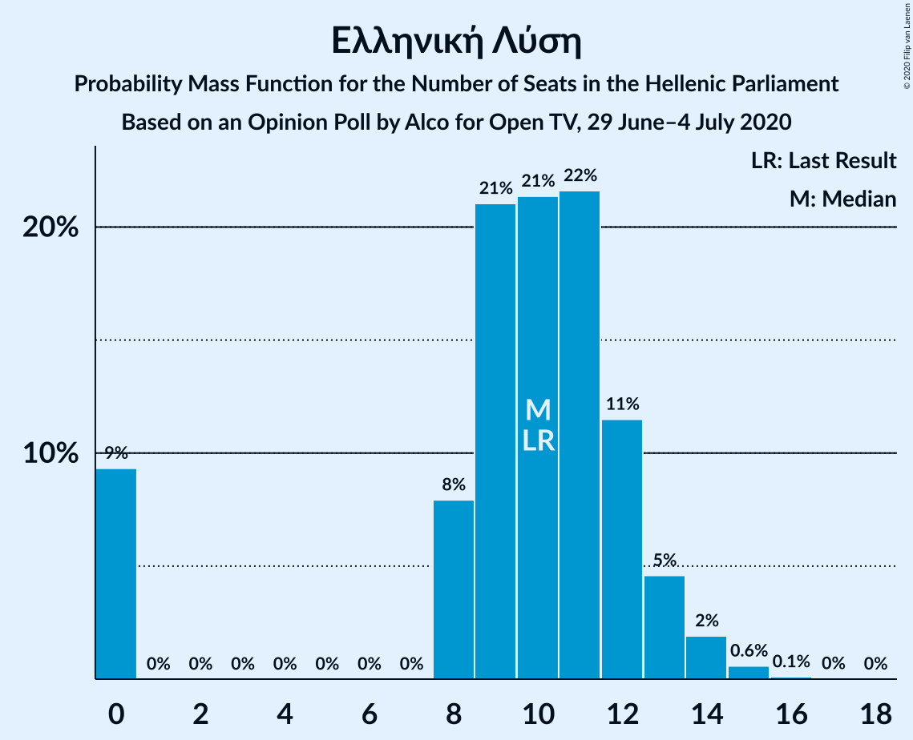
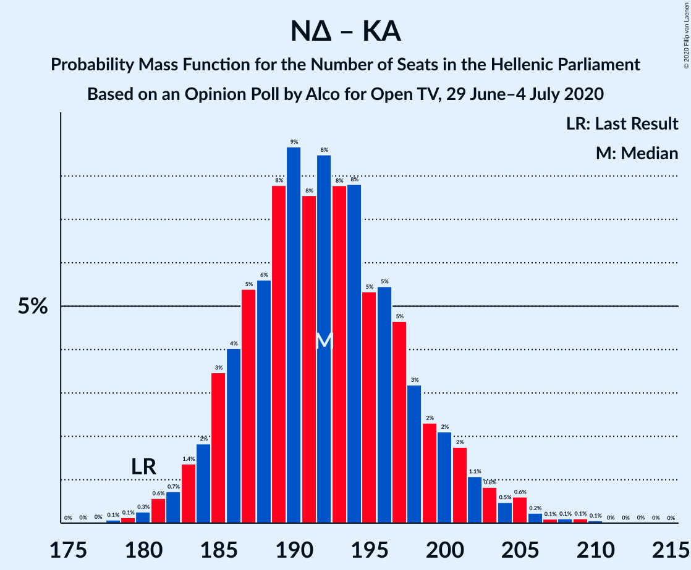

# Opinion Poll by Alco for Open TV, 29 June–4 July 2020

<a href="#voting-intentions">Voting Intentions</a> | <a href="#seats">Seats</a> | <a href="#coalitions">Coalitions</a> | <a href="#technical-information">Technical Information</a>

## Voting Intentions

### Confidence Intervals

| Party | Last Result | Poll Result | 80% Confidence Interval | 90% Confidence Interval | 95% Confidence Interval | 99% Confidence Interval |
|:-----:|:-----------:|:-----------:|:-----------------------:|:-----------------------:|:-----------------------:|:-----------------------:|
| Νέα Δημοκρατία | 39.8% | 46.1% | 44.1–48.1% |43.5–48.7% |43.0–49.2% |42.1–50.2% |
| Συνασπισμός Ριζοσπαστικής Αριστεράς | 31.5% | 27.7% | 25.9–29.6% |25.4–30.1% |25.0–30.6% |24.2–31.5% |
| Κίνημα Αλλαγής | 8.1% | 6.9% | 6.0–8.0% |5.7–8.4% |5.5–8.7% |5.1–9.2% |
| Κομμουνιστικό Κόμμα Ελλάδας | 5.3% | 6.0% | 5.1–7.1% |4.9–7.4% |4.7–7.7% |4.3–8.2% |
| Ελληνική Λύση | 3.7% | 3.7% | 3.0–4.6% |2.9–4.8% |2.7–5.1% |2.4–5.5% |
| Μέτωπο Ευρωπαϊκής Ρεαλιστικής Ανυπακοής | 3.4% | 3.5% | 2.9–4.4% |2.7–4.6% |2.5–4.8% |2.2–5.3% |
| Πλεύση Ελευθερίας | 1.5% | 1.3% | 0.9–1.9% |0.8–2.1% |0.8–2.2% |0.6–2.5% |

*Note:* The poll result column reflects the actual value used in the calculations. Published results may vary slightly, and in addition be rounded to fewer digits.

## Seats

### Confidence Intervals

| Party | Last Result | Median | 80% Confidence Interval | 90% Confidence Interval | 95% Confidence Interval | 99% Confidence Interval |
|:-----:|:-----------:|:------:|:-----------------------:|:-----------------------:|:-----------------------:|:-----------------------:|
| <a href="#νέα-δημοκρατία">Νέα Δημοκρατία</a> | 158 | 178 | 174–178 |174–184 |174–184 |167–185 |
| <a href="#συνασπισμός-ριζοσπαστικής-αριστεράς">Συνασπισμός Ριζοσπαστικής Αριστεράς</a> | 86 | 76 | 76 |72–76 |72–76 |72–80 |
| <a href="#κίνημα-αλλαγής">Κίνημα Αλλαγής</a> | 22 | 22 | 14–22 |14–23 |14–23 |14–24 |
| <a href="#κομμουνιστικό-κόμμα-ελλάδας">Κομμουνιστικό Κόμμα Ελλάδας</a> | 15 | 14 | 14 |14–15 |13–15 |13–16 |
| <a href="#ελληνική-λύση">Ελληνική Λύση</a> | 10 | 10 | 10–11 |0–11 |0–11 |0–14 |
| <a href="#μέτωπο-ευρωπαϊκής-ρεαλιστικής-ανυπακοής">Μέτωπο Ευρωπαϊκής Ρεαλιστικής Ανυπακοής</a> | 9 | 0 | 0–11 |0–11 |0–11 |0–13 |
| <a href="#πλεύση-ελευθερίας">Πλεύση Ελευθερίας</a> | 0 | 0 | 0 |0 |0 |0 |

### Νέα Δημοκρατία

*For a full overview of the results for this party, see the [Νέα Δημοκρατία](party-νέαδημοκρατία.html) page.*

| Number of Seats | Probability | Accumulated | Special Marks |
|:---------------:|:-----------:|:-----------:|:-------------:|
| 158 | 0% | 100% | Last Result |
| 159 | 0% | 100% |  |
| 160 | 0% | 100% |  |
| 161 | 0% | 100% |  |
| 162 | 0% | 100% |  |
| 163 | 0% | 100% |  |
| 164 | 0% | 100% |  |
| 165 | 0% | 100% |  |
| 166 | 0% | 100% |  |
| 167 | 0.6% | 100% |  |
| 168 | 0.4% | 99.4% |  |
| 169 | 0% | 98.9% |  |
| 170 | 0.1% | 98.9% |  |
| 171 | 0.1% | 98.8% |  |
| 172 | 0.1% | 98.7% |  |
| 173 | 0% | 98.6% |  |
| 174 | 14% | 98.6% |  |
| 175 | 25% | 85% |  |
| 176 | 0.2% | 60% |  |
| 177 | 5% | 60% |  |
| 178 | 46% | 55% | Median |
| 179 | 1.4% | 8% |  |
| 180 | 0% | 7% |  |
| 181 | 0% | 7% |  |
| 182 | 0% | 7% |  |
| 183 | 0% | 7% |  |
| 184 | 5% | 7% |  |
| 185 | 2% | 2% |  |
| 186 | 0% | 0% |  |

### Συνασπισμός Ριζοσπαστικής Αριστεράς

*For a full overview of the results for this party, see the [Συνασπισμός Ριζοσπαστικής Αριστεράς](party-συνασπισμόςριζοσπαστικήςαριστεράς.html) page.*

| Number of Seats | Probability | Accumulated | Special Marks |
|:---------------:|:-----------:|:-----------:|:-------------:|
| 70 | 0.2% | 100% |  |
| 71 | 0% | 99.8% |  |
| 72 | 7% | 99.8% |  |
| 73 | 0.5% | 93% |  |
| 74 | 0% | 92% |  |
| 75 | 0% | 92% |  |
| 76 | 92% | 92% | Median |
| 77 | 0% | 0.7% |  |
| 78 | 0% | 0.7% |  |
| 79 | 0% | 0.7% |  |
| 80 | 0.7% | 0.7% |  |
| 81 | 0% | 0% |  |
| 82 | 0% | 0% |  |
| 83 | 0% | 0% |  |
| 84 | 0% | 0% |  |
| 85 | 0% | 0% |  |
| 86 | 0% | 0% | Last Result |

### Κίνημα Αλλαγής

*For a full overview of the results for this party, see the [Κίνημα Αλλαγής](party-κίνημααλλαγής.html) page.*

| Number of Seats | Probability | Accumulated | Special Marks |
|:---------------:|:-----------:|:-----------:|:-------------:|
| 13 | 0.2% | 100% |  |
| 14 | 38% | 99.8% |  |
| 15 | 0% | 62% |  |
| 16 | 0.1% | 62% |  |
| 17 | 0.7% | 62% |  |
| 18 | 0% | 61% |  |
| 19 | 2% | 61% |  |
| 20 | 5% | 59% |  |
| 21 | 0% | 54% |  |
| 22 | 48% | 54% | Last Result, Median |
| 23 | 5% | 6% |  |
| 24 | 0.5% | 0.5% |  |
| 25 | 0% | 0% |  |

### Κομμουνιστικό Κόμμα Ελλάδας

*For a full overview of the results for this party, see the [Κομμουνιστικό Κόμμα Ελλάδας](party-κομμουνιστικόκόμμαελλάδας.html) page.*

| Number of Seats | Probability | Accumulated | Special Marks |
|:---------------:|:-----------:|:-----------:|:-------------:|
| 12 | 0.2% | 100% |  |
| 13 | 2% | 99.8% |  |
| 14 | 90% | 97% | Median |
| 15 | 7% | 8% | Last Result |
| 16 | 0.5% | 0.7% |  |
| 17 | 0.2% | 0.2% |  |
| 18 | 0% | 0% |  |

### Ελληνική Λύση

*For a full overview of the results for this party, see the [Ελληνική Λύση](party-ελληνικήλύση.html) page.*

| Number of Seats | Probability | Accumulated | Special Marks |
|:---------------:|:-----------:|:-----------:|:-------------:|
| 0 | 7% | 100% |  |
| 1 | 0% | 93% |  |
| 2 | 0% | 93% |  |
| 3 | 0% | 93% |  |
| 4 | 0% | 93% |  |
| 5 | 0% | 93% |  |
| 6 | 0% | 93% |  |
| 7 | 0% | 93% |  |
| 8 | 0.1% | 93% |  |
| 9 | 0.4% | 93% |  |
| 10 | 77% | 93% | Last Result, Median |
| 11 | 15% | 15% |  |
| 12 | 0% | 0.7% |  |
| 13 | 0% | 0.7% |  |
| 14 | 0.7% | 0.7% |  |
| 15 | 0% | 0% |  |

### Μέτωπο Ευρωπαϊκής Ρεαλιστικής Ανυπακοής

*For a full overview of the results for this party, see the [Μέτωπο Ευρωπαϊκής Ρεαλιστικής Ανυπακοής](party-μέτωποευρωπαϊκήςρεαλιστικήςανυπακοής.html) page.*

| Number of Seats | Probability | Accumulated | Special Marks |
|:---------------:|:-----------:|:-----------:|:-------------:|
| 0 | 54% | 100% | Median |
| 1 | 0% | 46% |  |
| 2 | 0% | 46% |  |
| 3 | 0% | 46% |  |
| 4 | 0% | 46% |  |
| 5 | 0% | 46% |  |
| 6 | 0% | 46% |  |
| 7 | 0% | 46% |  |
| 8 | 0% | 46% |  |
| 9 | 7% | 46% | Last Result |
| 10 | 0% | 39% |  |
| 11 | 38% | 39% |  |
| 12 | 0% | 0.7% |  |
| 13 | 0.5% | 0.7% |  |
| 14 | 0% | 0.2% |  |
| 15 | 0% | 0.2% |  |
| 16 | 0.2% | 0.2% |  |
| 17 | 0% | 0% |  |

### Πλεύση Ελευθερίας

*For a full overview of the results for this party, see the [Πλεύση Ελευθερίας](party-πλεύσηελευθερίας.html) page.*

| Number of Seats | Probability | Accumulated | Special Marks |
|:---------------:|:-----------:|:-----------:|:-------------:|
| 0 | 100% | 100% | Last Result, Median |

## Coalitions

### Confidence Intervals

| Coalition | Last Result | Median | Majority? | 80% Confidence Interval | 90% Confidence Interval | 95% Confidence Interval | 99% Confidence Interval |
|:---------:|:-----------:|:------:|:---------:|:-----------------------:|:-----------------------:|:-----------------------:|:-----------------------:|
| Νέα Δημοκρατία – Κίνημα Αλλαγής | 180 | 200 | 100% | 188–200 | 188–204 | 188–204 | 184–204 |
| Νέα Δημοκρατία | 158 | 178 | 100% | 174–178 | 174–184 | 174–184 | 167–185 |
| Συνασπισμός Ριζοσπαστικής Αριστεράς – Μέτωπο Ευρωπαϊκής Ρεαλιστικής Ανυπακοής | 95 | 76 | 0% | 76–87 | 76–87 | 76–87 | 76–89 |
| Συνασπισμός Ριζοσπαστικής Αριστεράς | 86 | 76 | 0% | 76 | 72–76 | 72–76 | 72–80 |

### Νέα Δημοκρατία – Κίνημα Αλλαγής

| Number of Seats | Probability | Accumulated | Special Marks |
|:---------------:|:-----------:|:-----------:|:-------------:|
| 180 | 0% | 100% | Last Result |
| 181 | 0% | 100% |  |
| 182 | 0% | 100% |  |
| 183 | 0% | 100% |  |
| 184 | 0.6% | 100% |  |
| 185 | 0% | 99.4% |  |
| 186 | 0% | 99.3% |  |
| 187 | 0% | 99.3% |  |
| 188 | 14% | 99.3% |  |
| 189 | 24% | 85% |  |
| 190 | 0% | 61% |  |
| 191 | 0% | 61% |  |
| 192 | 0.4% | 61% |  |
| 193 | 0% | 61% |  |
| 194 | 0.1% | 61% |  |
| 195 | 0% | 60% |  |
| 196 | 0.2% | 60% |  |
| 197 | 0.5% | 60% |  |
| 198 | 0% | 60% |  |
| 199 | 0% | 60% |  |
| 200 | 52% | 60% | Median |
| 201 | 1.4% | 8% |  |
| 202 | 0% | 7% |  |
| 203 | 0% | 7% |  |
| 204 | 7% | 7% |  |
| 205 | 0% | 0% |  |

### Νέα Δημοκρατία

| Number of Seats | Probability | Accumulated | Special Marks |
|:---------------:|:-----------:|:-----------:|:-------------:|
| 158 | 0% | 100% | Last Result |
| 159 | 0% | 100% |  |
| 160 | 0% | 100% |  |
| 161 | 0% | 100% |  |
| 162 | 0% | 100% |  |
| 163 | 0% | 100% |  |
| 164 | 0% | 100% |  |
| 165 | 0% | 100% |  |
| 166 | 0% | 100% |  |
| 167 | 0.6% | 100% |  |
| 168 | 0.4% | 99.4% |  |
| 169 | 0% | 98.9% |  |
| 170 | 0.1% | 98.9% |  |
| 171 | 0.1% | 98.8% |  |
| 172 | 0.1% | 98.7% |  |
| 173 | 0% | 98.6% |  |
| 174 | 14% | 98.6% |  |
| 175 | 25% | 85% |  |
| 176 | 0.2% | 60% |  |
| 177 | 5% | 60% |  |
| 178 | 46% | 55% | Median |
| 179 | 1.4% | 8% |  |
| 180 | 0% | 7% |  |
| 181 | 0% | 7% |  |
| 182 | 0% | 7% |  |
| 183 | 0% | 7% |  |
| 184 | 5% | 7% |  |
| 185 | 2% | 2% |  |
| 186 | 0% | 0% |  |

### Συνασπισμός Ριζοσπαστικής Αριστεράς – Μέτωπο Ευρωπαϊκής Ρεαλιστικής Ανυπακοής

| Number of Seats | Probability | Accumulated | Special Marks |
|:---------------:|:-----------:|:-----------:|:-------------:|
| 76 | 54% | 100% | Median |
| 77 | 0% | 46% |  |
| 78 | 0% | 46% |  |
| 79 | 0% | 46% |  |
| 80 | 0% | 46% |  |
| 81 | 7% | 46% |  |
| 82 | 0% | 40% |  |
| 83 | 0% | 40% |  |
| 84 | 0% | 40% |  |
| 85 | 0% | 40% |  |
| 86 | 0.7% | 40% |  |
| 87 | 38% | 39% |  |
| 88 | 0% | 0.7% |  |
| 89 | 0.7% | 0.7% |  |
| 90 | 0% | 0% |  |
| 91 | 0% | 0% |  |
| 92 | 0% | 0% |  |
| 93 | 0% | 0% |  |
| 94 | 0% | 0% |  |
| 95 | 0% | 0% | Last Result |

### Συνασπισμός Ριζοσπαστικής Αριστεράς

| Number of Seats | Probability | Accumulated | Special Marks |
|:---------------:|:-----------:|:-----------:|:-------------:|
| 70 | 0.2% | 100% |  |
| 71 | 0% | 99.8% |  |
| 72 | 7% | 99.8% |  |
| 73 | 0.5% | 93% |  |
| 74 | 0% | 92% |  |
| 75 | 0% | 92% |  |
| 76 | 92% | 92% | Median |
| 77 | 0% | 0.7% |  |
| 78 | 0% | 0.7% |  |
| 79 | 0% | 0.7% |  |
| 80 | 0.7% | 0.7% |  |
| 81 | 0% | 0% |  |
| 82 | 0% | 0% |  |
| 83 | 0% | 0% |  |
| 84 | 0% | 0% |  |
| 85 | 0% | 0% |  |
| 86 | 0% | 0% | Last Result |

## Technical Information

### Opinion Poll

+ **Polling firm:** Alco
+ **Commissioner(s):** Open TV
+ **Fieldwork period:** 29 June–4 July 2020

### Calculations

+ **Sample size:** 1000
+ **Simulations done:** 1,024
+ **Error estimate:** 2.87%

