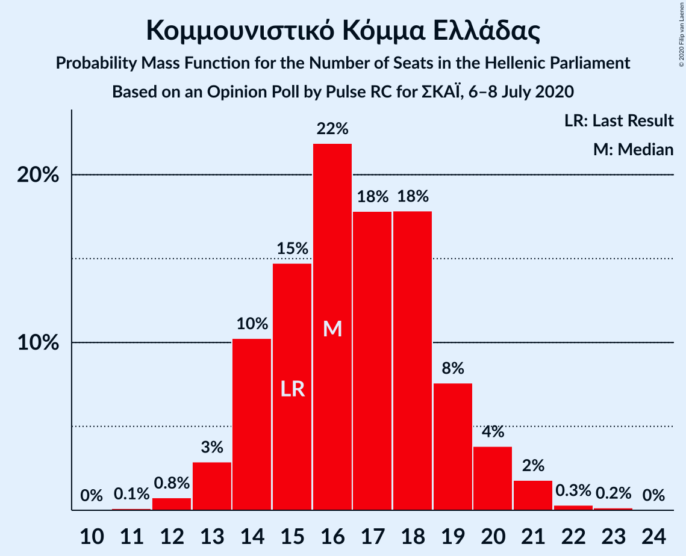
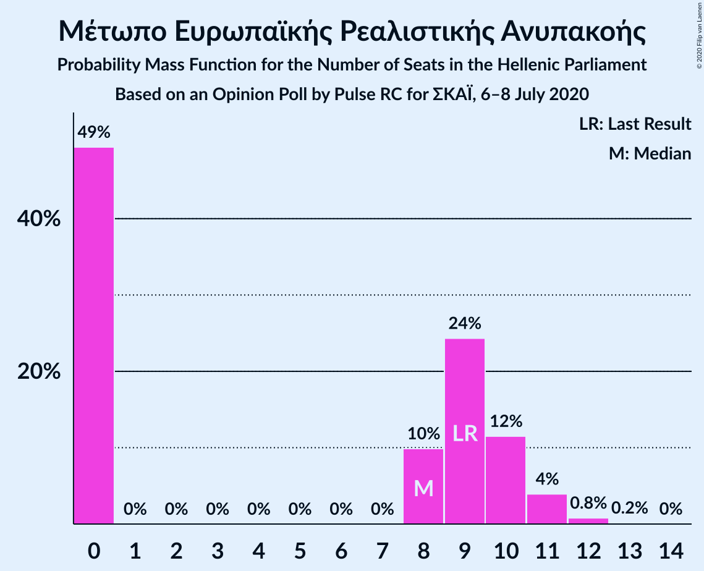
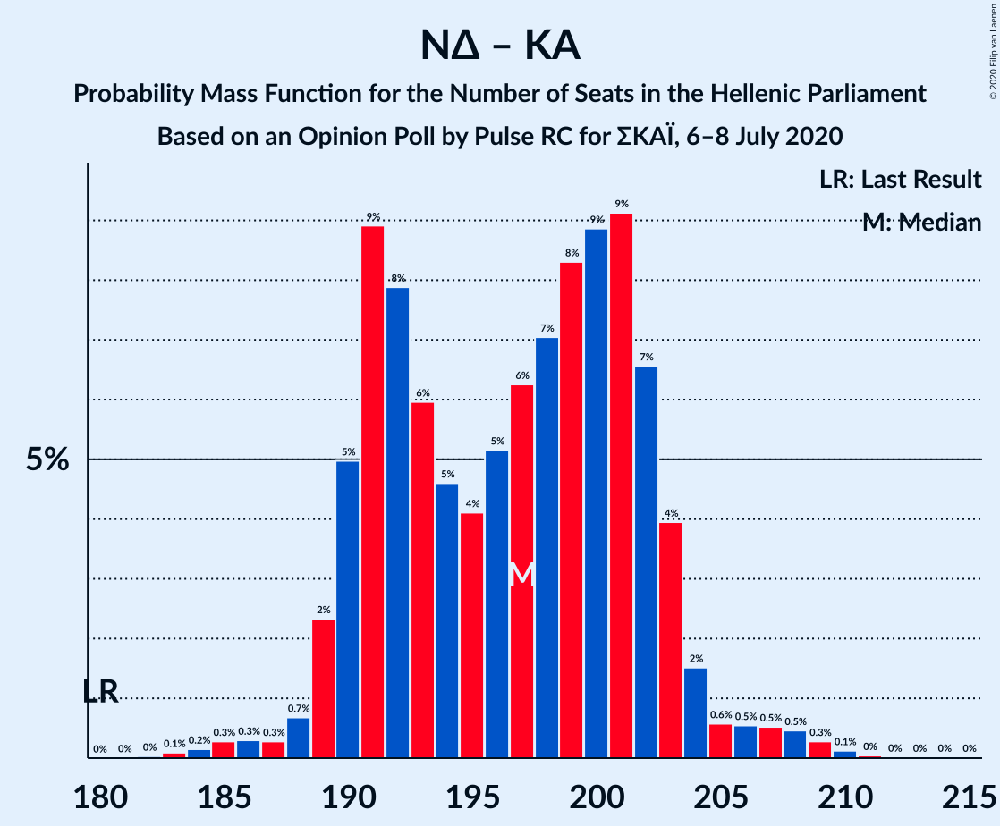
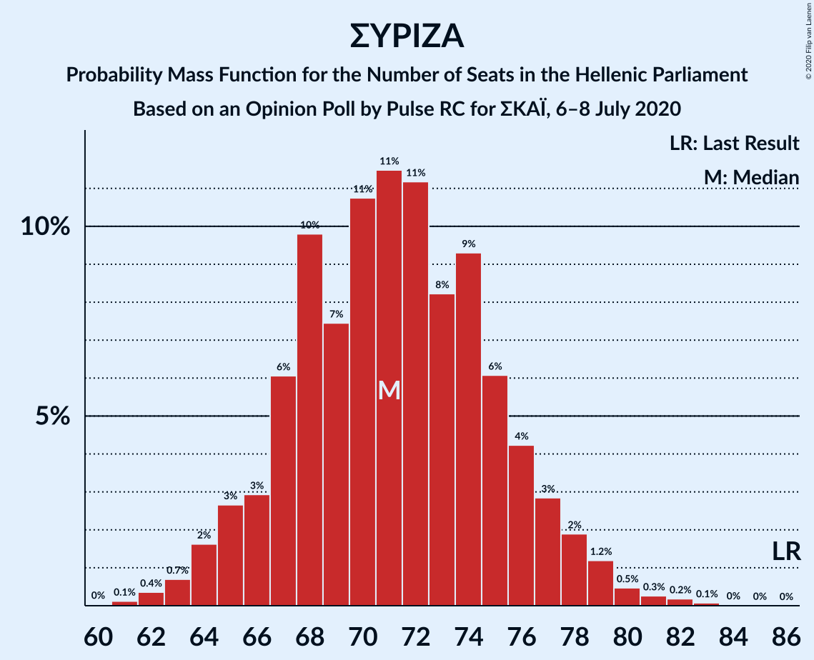

# Opinion Poll by Pulse RC for ΣΚΑΪ, 6–8 July 2020

<a href="#voting-intentions">Voting Intentions</a> | <a href="#seats">Seats</a> | <a href="#coalitions">Coalitions</a> | <a href="#technical-information">Technical Information</a>

## Voting Intentions

### Confidence Intervals

| Party | Last Result | Poll Result | 80% Confidence Interval | 90% Confidence Interval | 95% Confidence Interval | 99% Confidence Interval |
|:-----:|:-----------:|:-----------:|:-----------------------:|:-----------------------:|:-----------------------:|:-----------------------:|
| Νέα Δημοκρατία | 39.8% | 46.5% | 44.7–48.3% |44.2–48.8% |43.8–49.2% |43.0–50.1% |
| Συνασπισμός Ριζοσπαστικής Αριστεράς | 31.5% | 26.0% | 24.5–27.6% |24.0–28.0% |23.7–28.4% |23.0–29.2% |
| Κίνημα Αλλαγής | 8.1% | 7.0% | 6.1–8.0% |5.9–8.2% |5.7–8.5% |5.3–9.0% |
| Κομμουνιστικό Κόμμα Ελλάδας | 5.3% | 6.0% | 5.2–6.9% |5.0–7.2% |4.8–7.4% |4.5–7.9% |
| Ελληνική Λύση | 3.7% | 4.0% | 3.4–4.8% |3.2–5.0% |3.0–5.2% |2.8–5.6% |
| Μέτωπο Ευρωπαϊκής Ρεαλιστικής Ανυπακοής | 3.4% | 3.0% | 2.5–3.7% |2.3–3.9% |2.2–4.1% |2.0–4.4% |
| Χρυσή Αυγή | 2.9% | 1.0% | 0.7–1.5% |0.6–1.6% |0.6–1.7% |0.5–2.0% |

*Note:* The poll result column reflects the actual value used in the calculations. Published results may vary slightly, and in addition be rounded to fewer digits.

## Seats

### Confidence Intervals

| Party | Last Result | Median | 80% Confidence Interval | 90% Confidence Interval | 95% Confidence Interval | 99% Confidence Interval |
|:-----:|:-----------:|:------:|:-----------------------:|:-----------------------:|:-----------------------:|:-----------------------:|
| <a href="#νέα-δημοκρατία">Νέα Δημοκρατία</a> | 158 | 178 | 172–183 |170–184 |169–186 |167–189 |
| <a href="#συνασπισμός-ριζοσπαστικής-αριστεράς">Συνασπισμός Ριζοσπαστικής Αριστεράς</a> | 86 | 71 | 67–76 |65–77 |64–78 |62–81 |
| <a href="#κίνημα-αλλαγής">Κίνημα Αλλαγής</a> | 22 | 19 | 17–22 |16–23 |15–23 |15–25 |
| <a href="#κομμουνιστικό-κόμμα-ελλάδας">Κομμουνιστικό Κόμμα Ελλάδας</a> | 15 | 16 | 14–19 |14–20 |13–20 |12–21 |
| <a href="#ελληνική-λύση">Ελληνική Λύση</a> | 10 | 11 | 9–13 |9–14 |8–14 |0–15 |
| <a href="#μέτωπο-ευρωπαϊκής-ρεαλιστικής-ανυπακοής">Μέτωπο Ευρωπαϊκής Ρεαλιστικής Ανυπακοής</a> | 9 | 8 | 0–10 |0–10 |0–11 |0–12 |
| <a href="#χρυσή-αυγή">Χρυσή Αυγή</a> | 0 | 0 | 0 |0 |0 |0 |

### Νέα Δημοκρατία

*For a full overview of the results for this party, see the [Νέα Δημοκρατία](party-νέαδημοκρατία.html) page.*

| Number of Seats | Probability | Accumulated | Special Marks |
|:---------------:|:-----------:|:-----------:|:-------------:|
| 158 | 0% | 100% | Last Result |
| 159 | 0% | 100% |  |
| 160 | 0% | 100% |  |
| 161 | 0% | 100% |  |
| 162 | 0% | 100% |  |
| 163 | 0% | 100% |  |
| 164 | 0.1% | 100% |  |
| 165 | 0.1% | 99.9% |  |
| 166 | 0.3% | 99.8% |  |
| 167 | 0.5% | 99.6% |  |
| 168 | 0.7% | 99.1% |  |
| 169 | 2% | 98% |  |
| 170 | 3% | 97% |  |
| 171 | 4% | 94% |  |
| 172 | 6% | 91% |  |
| 173 | 7% | 84% |  |
| 174 | 6% | 78% |  |
| 175 | 7% | 72% |  |
| 176 | 7% | 64% |  |
| 177 | 6% | 57% |  |
| 178 | 8% | 51% | Median |
| 179 | 9% | 42% |  |
| 180 | 8% | 33% |  |
| 181 | 5% | 25% |  |
| 182 | 7% | 19% |  |
| 183 | 4% | 13% |  |
| 184 | 4% | 8% |  |
| 185 | 2% | 5% |  |
| 186 | 1.1% | 3% |  |
| 187 | 0.7% | 2% |  |
| 188 | 0.4% | 1.0% |  |
| 189 | 0.2% | 0.5% |  |
| 190 | 0.1% | 0.3% |  |
| 191 | 0.1% | 0.2% |  |
| 192 | 0.1% | 0.1% |  |
| 193 | 0% | 0% |  |

### Συνασπισμός Ριζοσπαστικής Αριστεράς

*For a full overview of the results for this party, see the [Συνασπισμός Ριζοσπαστικής Αριστεράς](party-συνασπισμόςριζοσπαστικήςαριστεράς.html) page.*

| Number of Seats | Probability | Accumulated | Special Marks |
|:---------------:|:-----------:|:-----------:|:-------------:|
| 60 | 0% | 100% |  |
| 61 | 0.1% | 99.9% |  |
| 62 | 0.4% | 99.8% |  |
| 63 | 0.7% | 99.5% |  |
| 64 | 2% | 98.8% |  |
| 65 | 3% | 97% |  |
| 66 | 3% | 94% |  |
| 67 | 6% | 92% |  |
| 68 | 10% | 85% |  |
| 69 | 7% | 76% |  |
| 70 | 11% | 68% |  |
| 71 | 11% | 57% | Median |
| 72 | 11% | 46% |  |
| 73 | 8% | 35% |  |
| 74 | 9% | 27% |  |
| 75 | 6% | 17% |  |
| 76 | 4% | 11% |  |
| 77 | 3% | 7% |  |
| 78 | 2% | 4% |  |
| 79 | 1.2% | 2% |  |
| 80 | 0.5% | 1.0% |  |
| 81 | 0.3% | 0.6% |  |
| 82 | 0.2% | 0.3% |  |
| 83 | 0.1% | 0.1% |  |
| 84 | 0% | 0% |  |
| 85 | 0% | 0% |  |
| 86 | 0% | 0% | Last Result |

### Κίνημα Αλλαγής

*For a full overview of the results for this party, see the [Κίνημα Αλλαγής](party-κίνημααλλαγής.html) page.*

| Number of Seats | Probability | Accumulated | Special Marks |
|:---------------:|:-----------:|:-----------:|:-------------:|
| 13 | 0.1% | 100% |  |
| 14 | 0.3% | 99.9% |  |
| 15 | 2% | 99.6% |  |
| 16 | 5% | 97% |  |
| 17 | 11% | 93% |  |
| 18 | 19% | 82% |  |
| 19 | 18% | 63% | Median |
| 20 | 19% | 45% |  |
| 21 | 13% | 26% |  |
| 22 | 7% | 13% | Last Result |
| 23 | 4% | 6% |  |
| 24 | 1.1% | 2% |  |
| 25 | 0.5% | 0.6% |  |
| 26 | 0.1% | 0.2% |  |
| 27 | 0% | 0% |  |

### Κομμουνιστικό Κόμμα Ελλάδας

*For a full overview of the results for this party, see the [Κομμουνιστικό Κόμμα Ελλάδας](party-κομμουνιστικόκόμμαελλάδας.html) page.*

| Number of Seats | Probability | Accumulated | Special Marks |
|:---------------:|:-----------:|:-----------:|:-------------:|
| 11 | 0.1% | 100% |  |
| 12 | 0.8% | 99.9% |  |
| 13 | 3% | 99.1% |  |
| 14 | 10% | 96% |  |
| 15 | 15% | 86% | Last Result |
| 16 | 22% | 71% | Median |
| 17 | 18% | 49% |  |
| 18 | 18% | 32% |  |
| 19 | 8% | 14% |  |
| 20 | 4% | 6% |  |
| 21 | 2% | 2% |  |
| 22 | 0.3% | 0.5% |  |
| 23 | 0.2% | 0.2% |  |
| 24 | 0% | 0% |  |

### Ελληνική Λύση

*For a full overview of the results for this party, see the [Ελληνική Λύση](party-ελληνικήλύση.html) page.*

| Number of Seats | Probability | Accumulated | Special Marks |
|:---------------:|:-----------:|:-----------:|:-------------:|
| 0 | 2% | 100% |  |
| 1 | 0% | 98% |  |
| 2 | 0% | 98% |  |
| 3 | 0% | 98% |  |
| 4 | 0% | 98% |  |
| 5 | 0% | 98% |  |
| 6 | 0% | 98% |  |
| 7 | 0% | 98% |  |
| 8 | 1.4% | 98% |  |
| 9 | 11% | 97% |  |
| 10 | 22% | 86% | Last Result |
| 11 | 27% | 64% | Median |
| 12 | 20% | 37% |  |
| 13 | 11% | 17% |  |
| 14 | 4% | 6% |  |
| 15 | 1.2% | 2% |  |
| 16 | 0.3% | 0.4% |  |
| 17 | 0.1% | 0.1% |  |
| 18 | 0% | 0% |  |

### Μέτωπο Ευρωπαϊκής Ρεαλιστικής Ανυπακοής

*For a full overview of the results for this party, see the [Μέτωπο Ευρωπαϊκής Ρεαλιστικής Ανυπακοής](party-μέτωποευρωπαϊκήςρεαλιστικήςανυπακοής.html) page.*

| Number of Seats | Probability | Accumulated | Special Marks |
|:---------------:|:-----------:|:-----------:|:-------------:|
| 0 | 49% | 100% |  |
| 1 | 0% | 51% |  |
| 2 | 0% | 51% |  |
| 3 | 0% | 51% |  |
| 4 | 0% | 51% |  |
| 5 | 0% | 51% |  |
| 6 | 0% | 51% |  |
| 7 | 0% | 51% |  |
| 8 | 10% | 51% | Median |
| 9 | 24% | 41% | Last Result |
| 10 | 12% | 16% |  |
| 11 | 4% | 5% |  |
| 12 | 0.8% | 1.0% |  |
| 13 | 0.2% | 0.2% |  |
| 14 | 0% | 0% |  |

### Χρυσή Αυγή

*For a full overview of the results for this party, see the [Χρυσή Αυγή](party-χρυσήαυγή.html) page.*

| Number of Seats | Probability | Accumulated | Special Marks |
|:---------------:|:-----------:|:-----------:|:-------------:|
| 0 | 100% | 100% | Last Result, Median |

## Coalitions

### Confidence Intervals

| Coalition | Last Result | Median | Majority? | 80% Confidence Interval | 90% Confidence Interval | 95% Confidence Interval | 99% Confidence Interval |
|:---------:|:-----------:|:------:|:---------:|:-----------------------:|:-----------------------:|:-----------------------:|:-----------------------:|
| Νέα Δημοκρατία – Κίνημα Αλλαγής | 180 | 197 | 100% | 191–202 | 190–203 | 189–205 | 185–209 |
| Νέα Δημοκρατία | 158 | 178 | 100% | 172–183 | 170–184 | 169–186 | 167–189 |
| Συνασπισμός Ριζοσπαστικής Αριστεράς – Μέτωπο Ευρωπαϊκής Ρεαλιστικής Ανυπακοής | 95 | 76 | 0% | 70–82 | 68–84 | 67–85 | 65–87 |
| Συνασπισμός Ριζοσπαστικής Αριστεράς | 86 | 71 | 0% | 67–76 | 65–77 | 64–78 | 62–81 |

### Νέα Δημοκρατία – Κίνημα Αλλαγής

| Number of Seats | Probability | Accumulated | Special Marks |
|:---------------:|:-----------:|:-----------:|:-------------:|
| 180 | 0% | 100% | Last Result |
| 181 | 0% | 100% |  |
| 182 | 0% | 100% |  |
| 183 | 0.1% | 100% |  |
| 184 | 0.2% | 99.9% |  |
| 185 | 0.3% | 99.7% |  |
| 186 | 0.3% | 99.4% |  |
| 187 | 0.3% | 99.1% |  |
| 188 | 0.7% | 98.9% |  |
| 189 | 2% | 98% |  |
| 190 | 5% | 96% |  |
| 191 | 9% | 91% |  |
| 192 | 8% | 82% |  |
| 193 | 6% | 74% |  |
| 194 | 5% | 68% |  |
| 195 | 4% | 64% |  |
| 196 | 5% | 59% |  |
| 197 | 6% | 54% | Median |
| 198 | 7% | 48% |  |
| 199 | 8% | 41% |  |
| 200 | 9% | 33% |  |
| 201 | 9% | 24% |  |
| 202 | 7% | 15% |  |
| 203 | 4% | 8% |  |
| 204 | 2% | 4% |  |
| 205 | 0.6% | 3% |  |
| 206 | 0.5% | 2% |  |
| 207 | 0.5% | 1.5% |  |
| 208 | 0.5% | 1.0% |  |
| 209 | 0.3% | 0.5% |  |
| 210 | 0.1% | 0.2% |  |
| 211 | 0% | 0.1% |  |
| 212 | 0% | 0.1% |  |
| 213 | 0% | 0.1% |  |
| 214 | 0% | 0% |  |

### Νέα Δημοκρατία

| Number of Seats | Probability | Accumulated | Special Marks |
|:---------------:|:-----------:|:-----------:|:-------------:|
| 158 | 0% | 100% | Last Result |
| 159 | 0% | 100% |  |
| 160 | 0% | 100% |  |
| 161 | 0% | 100% |  |
| 162 | 0% | 100% |  |
| 163 | 0% | 100% |  |
| 164 | 0.1% | 100% |  |
| 165 | 0.1% | 99.9% |  |
| 166 | 0.3% | 99.8% |  |
| 167 | 0.5% | 99.6% |  |
| 168 | 0.7% | 99.1% |  |
| 169 | 2% | 98% |  |
| 170 | 3% | 97% |  |
| 171 | 4% | 94% |  |
| 172 | 6% | 91% |  |
| 173 | 7% | 84% |  |
| 174 | 6% | 78% |  |
| 175 | 7% | 72% |  |
| 176 | 7% | 64% |  |
| 177 | 6% | 57% |  |
| 178 | 8% | 51% | Median |
| 179 | 9% | 42% |  |
| 180 | 8% | 33% |  |
| 181 | 5% | 25% |  |
| 182 | 7% | 19% |  |
| 183 | 4% | 13% |  |
| 184 | 4% | 8% |  |
| 185 | 2% | 5% |  |
| 186 | 1.1% | 3% |  |
| 187 | 0.7% | 2% |  |
| 188 | 0.4% | 1.0% |  |
| 189 | 0.2% | 0.5% |  |
| 190 | 0.1% | 0.3% |  |
| 191 | 0.1% | 0.2% |  |
| 192 | 0.1% | 0.1% |  |
| 193 | 0% | 0% |  |

### Συνασπισμός Ριζοσπαστικής Αριστεράς – Μέτωπο Ευρωπαϊκής Ρεαλιστικής Ανυπακοής

| Number of Seats | Probability | Accumulated | Special Marks |
|:---------------:|:-----------:|:-----------:|:-------------:|
| 63 | 0.1% | 100% |  |
| 64 | 0.2% | 99.9% |  |
| 65 | 0.3% | 99.7% |  |
| 66 | 0.9% | 99.4% |  |
| 67 | 1.1% | 98% |  |
| 68 | 4% | 97% |  |
| 69 | 2% | 93% |  |
| 70 | 5% | 91% |  |
| 71 | 7% | 86% |  |
| 72 | 6% | 80% |  |
| 73 | 7% | 74% |  |
| 74 | 8% | 67% |  |
| 75 | 6% | 59% |  |
| 76 | 8% | 53% |  |
| 77 | 7% | 45% |  |
| 78 | 7% | 38% |  |
| 79 | 7% | 32% | Median |
| 80 | 6% | 24% |  |
| 81 | 6% | 19% |  |
| 82 | 4% | 12% |  |
| 83 | 4% | 9% |  |
| 84 | 2% | 5% |  |
| 85 | 1.3% | 3% |  |
| 86 | 0.8% | 2% |  |
| 87 | 0.4% | 0.7% |  |
| 88 | 0.2% | 0.3% |  |
| 89 | 0.1% | 0.2% |  |
| 90 | 0% | 0.1% |  |
| 91 | 0% | 0% |  |
| 92 | 0% | 0% |  |
| 93 | 0% | 0% |  |
| 94 | 0% | 0% |  |
| 95 | 0% | 0% | Last Result |

### Συνασπισμός Ριζοσπαστικής Αριστεράς

| Number of Seats | Probability | Accumulated | Special Marks |
|:---------------:|:-----------:|:-----------:|:-------------:|
| 60 | 0% | 100% |  |
| 61 | 0.1% | 99.9% |  |
| 62 | 0.4% | 99.8% |  |
| 63 | 0.7% | 99.5% |  |
| 64 | 2% | 98.8% |  |
| 65 | 3% | 97% |  |
| 66 | 3% | 94% |  |
| 67 | 6% | 92% |  |
| 68 | 10% | 85% |  |
| 69 | 7% | 76% |  |
| 70 | 11% | 68% |  |
| 71 | 11% | 57% | Median |
| 72 | 11% | 46% |  |
| 73 | 8% | 35% |  |
| 74 | 9% | 27% |  |
| 75 | 6% | 17% |  |
| 76 | 4% | 11% |  |
| 77 | 3% | 7% |  |
| 78 | 2% | 4% |  |
| 79 | 1.2% | 2% |  |
| 80 | 0.5% | 1.0% |  |
| 81 | 0.3% | 0.6% |  |
| 82 | 0.2% | 0.3% |  |
| 83 | 0.1% | 0.1% |  |
| 84 | 0% | 0% |  |
| 85 | 0% | 0% |  |
| 86 | 0% | 0% | Last Result |

## Technical Information

### Opinion Poll

+ **Polling firm:** Pulse RC
+ **Commissioner(s):** ΣΚΑΪ
+ **Fieldwork period:** 6–8 July 2020

### Calculations

+ **Sample size:** 1305
+ **Simulations done:** 1,048,576
+ **Error estimate:** 0.78%

