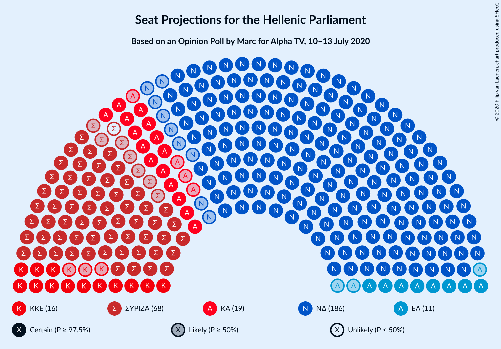
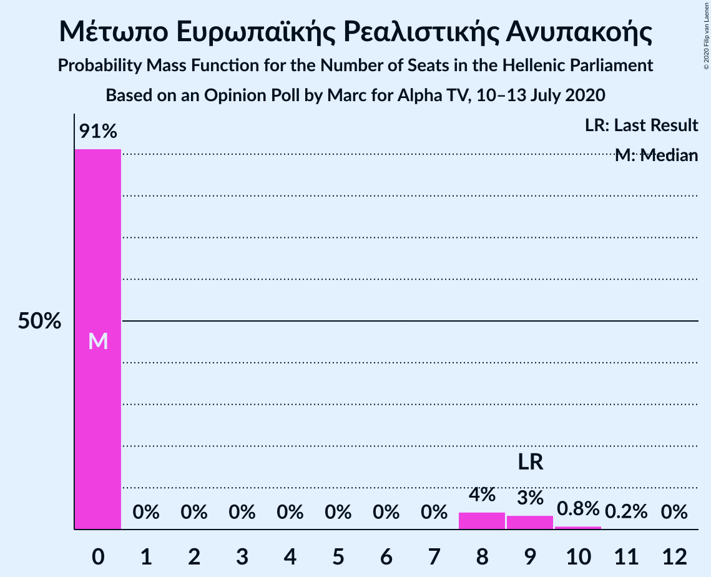

# Opinion Poll by Marc for Αlpha TV, 10–13 July 2020

<a href="#voting-intentions">Voting Intentions</a> | <a href="#seats">Seats</a> | <a href="#coalitions">Coalitions</a> | <a href="#technical-information">Technical Information</a>

## Voting Intentions

### Confidence Intervals

| Party | Last Result | Poll Result | 80% Confidence Interval | 90% Confidence Interval | 95% Confidence Interval | 99% Confidence Interval |
|:-----:|:-----------:|:-----------:|:-----------------------:|:-----------------------:|:-----------------------:|:-----------------------:|
| Νέα Δημοκρατία | 39.8% | 50.1% | 48.1–52.1% |47.5–52.7% |47.0–53.2% |46.1–54.1% |
| Συνασπισμός Ριζοσπαστικής Αριστεράς | 31.5% | 24.6% | 22.9–26.4% |22.5–26.9% |22.1–27.4% |21.3–28.2% |
| Κίνημα Αλλαγής | 8.1% | 6.9% | 5.9–8.0% |5.7–8.3% |5.5–8.6% |5.0–9.2% |
| Κομμουνιστικό Κόμμα Ελλάδας | 5.3% | 6.0% | 5.1–7.0% |4.9–7.3% |4.7–7.6% |4.3–8.2% |
| Ελληνική Λύση | 3.7% | 4.1% | 3.4–5.0% |3.2–5.3% |3.1–5.5% |2.8–6.0% |
| Μέτωπο Ευρωπαϊκής Ρεαλιστικής Ανυπακοής | 3.4% | 2.3% | 1.8–3.0% |1.6–3.2% |1.5–3.4% |1.3–3.7% |
| Χρυσή Αυγή | 2.9% | 1.2% | 0.8–1.7% |0.7–1.9% |0.7–2.1% |0.5–2.4% |

*Note:* The poll result column reflects the actual value used in the calculations. Published results may vary slightly, and in addition be rounded to fewer digits.

## Seats

### Confidence Intervals

| Party | Last Result | Median | 80% Confidence Interval | 90% Confidence Interval | 95% Confidence Interval | 99% Confidence Interval |
|:-----:|:-----------:|:------:|:-----------------------:|:-----------------------:|:-----------------------:|:-----------------------:|
| <a href="#νέα-δημοκρατία">Νέα Δημοκρατία</a> | 158 | 186 | 180–191 |178–193 |177–194 |174–197 |
| <a href="#συνασπισμός-ριζοσπαστικής-αριστεράς">Συνασπισμός Ριζοσπαστικής Αριστεράς</a> | 86 | 67 | 62–72 |61–73 |60–74 |58–77 |
| <a href="#κίνημα-αλλαγής">Κίνημα Αλλαγής</a> | 22 | 19 | 16–22 |15–22 |15–23 |14–25 |
| <a href="#κομμουνιστικό-κόμμα-ελλάδας">Κομμουνιστικό Κόμμα Ελλάδας</a> | 15 | 16 | 14–19 |13–20 |13–21 |12–22 |
| <a href="#ελληνική-λύση">Ελληνική Λύση</a> | 10 | 11 | 9–14 |9–14 |8–15 |0–16 |
| <a href="#μέτωπο-ευρωπαϊκής-ρεαλιστικής-ανυπακοής">Μέτωπο Ευρωπαϊκής Ρεαλιστικής Ανυπακοής</a> | 9 | 0 | 0 |0–8 |0–9 |0–10 |
| <a href="#χρυσή-αυγή">Χρυσή Αυγή</a> | 0 | 0 | 0 |0 |0 |0 |

### Νέα Δημοκρατία

*For a full overview of the results for this party, see the [Νέα Δημοκρατία](party-νέαδημοκρατία.html) page.*

| Number of Seats | Probability | Accumulated | Special Marks |
|:---------------:|:-----------:|:-----------:|:-------------:|
| 158 | 0% | 100% | Last Result |
| 159 | 0% | 100% |  |
| 160 | 0% | 100% |  |
| 161 | 0% | 100% |  |
| 162 | 0% | 100% |  |
| 163 | 0% | 100% |  |
| 164 | 0% | 100% |  |
| 165 | 0% | 100% |  |
| 166 | 0% | 100% |  |
| 167 | 0% | 100% |  |
| 168 | 0% | 100% |  |
| 169 | 0% | 100% |  |
| 170 | 0% | 100% |  |
| 171 | 0% | 100% |  |
| 172 | 0.1% | 99.9% |  |
| 173 | 0.1% | 99.9% |  |
| 174 | 0.3% | 99.7% |  |
| 175 | 0.4% | 99.5% |  |
| 176 | 0.7% | 99.1% |  |
| 177 | 1.0% | 98% |  |
| 178 | 3% | 97% |  |
| 179 | 2% | 95% |  |
| 180 | 4% | 93% |  |
| 181 | 4% | 89% |  |
| 182 | 9% | 85% |  |
| 183 | 4% | 76% |  |
| 184 | 10% | 73% |  |
| 185 | 8% | 63% |  |
| 186 | 11% | 55% | Median |
| 187 | 9% | 44% |  |
| 188 | 8% | 35% |  |
| 189 | 9% | 27% |  |
| 190 | 3% | 18% |  |
| 191 | 6% | 16% |  |
| 192 | 3% | 9% |  |
| 193 | 3% | 6% |  |
| 194 | 1.3% | 4% |  |
| 195 | 1.2% | 2% |  |
| 196 | 0.3% | 1.1% |  |
| 197 | 0.3% | 0.8% |  |
| 198 | 0.2% | 0.5% |  |
| 199 | 0.1% | 0.3% |  |
| 200 | 0.1% | 0.2% |  |
| 201 | 0.1% | 0.1% |  |
| 202 | 0% | 0% |  |

### Συνασπισμός Ριζοσπαστικής Αριστεράς

*For a full overview of the results for this party, see the [Συνασπισμός Ριζοσπαστικής Αριστεράς](party-συνασπισμόςριζοσπαστικήςαριστεράς.html) page.*

| Number of Seats | Probability | Accumulated | Special Marks |
|:---------------:|:-----------:|:-----------:|:-------------:|
| 55 | 0.1% | 100% |  |
| 56 | 0.1% | 99.9% |  |
| 57 | 0.3% | 99.8% |  |
| 58 | 0.5% | 99.5% |  |
| 59 | 0.9% | 99.0% |  |
| 60 | 2% | 98% |  |
| 61 | 3% | 96% |  |
| 62 | 5% | 93% |  |
| 63 | 6% | 89% |  |
| 64 | 7% | 83% |  |
| 65 | 11% | 75% |  |
| 66 | 10% | 64% |  |
| 67 | 11% | 53% | Median |
| 68 | 10% | 42% |  |
| 69 | 8% | 32% |  |
| 70 | 8% | 24% |  |
| 71 | 5% | 16% |  |
| 72 | 5% | 11% |  |
| 73 | 2% | 6% |  |
| 74 | 2% | 4% |  |
| 75 | 0.9% | 2% |  |
| 76 | 0.5% | 1.1% |  |
| 77 | 0.3% | 0.5% |  |
| 78 | 0.1% | 0.2% |  |
| 79 | 0.1% | 0.1% |  |
| 80 | 0% | 0% |  |
| 81 | 0% | 0% |  |
| 82 | 0% | 0% |  |
| 83 | 0% | 0% |  |
| 84 | 0% | 0% |  |
| 85 | 0% | 0% |  |
| 86 | 0% | 0% | Last Result |

### Κίνημα Αλλαγής

*For a full overview of the results for this party, see the [Κίνημα Αλλαγής](party-κίνημααλλαγής.html) page.*

| Number of Seats | Probability | Accumulated | Special Marks |
|:---------------:|:-----------:|:-----------:|:-------------:|
| 13 | 0.3% | 100% |  |
| 14 | 1.2% | 99.7% |  |
| 15 | 4% | 98% |  |
| 16 | 8% | 94% |  |
| 17 | 15% | 87% |  |
| 18 | 16% | 71% |  |
| 19 | 19% | 55% | Median |
| 20 | 14% | 36% |  |
| 21 | 11% | 22% |  |
| 22 | 6% | 11% | Last Result |
| 23 | 3% | 5% |  |
| 24 | 1.1% | 2% |  |
| 25 | 0.5% | 0.8% |  |
| 26 | 0.2% | 0.2% |  |
| 27 | 0% | 0.1% |  |
| 28 | 0% | 0% |  |

### Κομμουνιστικό Κόμμα Ελλάδας

*For a full overview of the results for this party, see the [Κομμουνιστικό Κόμμα Ελλάδας](party-κομμουνιστικόκόμμαελλάδας.html) page.*

| Number of Seats | Probability | Accumulated | Special Marks |
|:---------------:|:-----------:|:-----------:|:-------------:|
| 11 | 0.3% | 100% |  |
| 12 | 1.5% | 99.7% |  |
| 13 | 5% | 98% |  |
| 14 | 9% | 94% |  |
| 15 | 18% | 84% | Last Result |
| 16 | 20% | 67% | Median |
| 17 | 17% | 47% |  |
| 18 | 14% | 30% |  |
| 19 | 9% | 16% |  |
| 20 | 4% | 7% |  |
| 21 | 2% | 3% |  |
| 22 | 0.7% | 1.0% |  |
| 23 | 0.2% | 0.3% |  |
| 24 | 0.1% | 0.1% |  |
| 25 | 0% | 0% |  |

### Ελληνική Λύση

*For a full overview of the results for this party, see the [Ελληνική Λύση](party-ελληνικήλύση.html) page.*

| Number of Seats | Probability | Accumulated | Special Marks |
|:---------------:|:-----------:|:-----------:|:-------------:|
| 0 | 2% | 100% |  |
| 1 | 0% | 98% |  |
| 2 | 0% | 98% |  |
| 3 | 0% | 98% |  |
| 4 | 0% | 98% |  |
| 5 | 0% | 98% |  |
| 6 | 0% | 98% |  |
| 7 | 0% | 98% |  |
| 8 | 1.0% | 98% |  |
| 9 | 8% | 97% |  |
| 10 | 18% | 89% | Last Result |
| 11 | 29% | 71% | Median |
| 12 | 18% | 41% |  |
| 13 | 11% | 23% |  |
| 14 | 8% | 12% |  |
| 15 | 3% | 4% |  |
| 16 | 0.8% | 1.1% |  |
| 17 | 0.2% | 0.3% |  |
| 18 | 0.1% | 0.1% |  |
| 19 | 0% | 0% |  |

### Μέτωπο Ευρωπαϊκής Ρεαλιστικής Ανυπακοής

*For a full overview of the results for this party, see the [Μέτωπο Ευρωπαϊκής Ρεαλιστικής Ανυπακοής](party-μέτωποευρωπαϊκήςρεαλιστικήςανυπακοής.html) page.*

| Number of Seats | Probability | Accumulated | Special Marks |
|:---------------:|:-----------:|:-----------:|:-------------:|
| 0 | 91% | 100% | Median |
| 1 | 0% | 9% |  |
| 2 | 0% | 9% |  |
| 3 | 0% | 9% |  |
| 4 | 0% | 9% |  |
| 5 | 0% | 9% |  |
| 6 | 0% | 9% |  |
| 7 | 0% | 9% |  |
| 8 | 4% | 9% |  |
| 9 | 3% | 4% | Last Result |
| 10 | 0.8% | 1.0% |  |
| 11 | 0.2% | 0.2% |  |
| 12 | 0% | 0% |  |

### Χρυσή Αυγή

*For a full overview of the results for this party, see the [Χρυσή Αυγή](party-χρυσήαυγή.html) page.*

| Number of Seats | Probability | Accumulated | Special Marks |
|:---------------:|:-----------:|:-----------:|:-------------:|
| 0 | 100% | 100% | Last Result, Median |

## Coalitions

### Confidence Intervals

| Coalition | Last Result | Median | Majority? | 80% Confidence Interval | 90% Confidence Interval | 95% Confidence Interval | 99% Confidence Interval |
|:---------:|:-----------:|:------:|:---------:|:-----------------------:|:-----------------------:|:-----------------------:|:-----------------------:|
| Νέα Δημοκρατία – Κίνημα Αλλαγής | 180 | 205 | 100% | 199–210 | 197–212 | 196–213 | 193–216 |
| Νέα Δημοκρατία | 158 | 186 | 100% | 180–191 | 178–193 | 177–194 | 174–197 |
| Συνασπισμός Ριζοσπαστικής Αριστεράς – Μέτωπο Ευρωπαϊκής Ρεαλιστικής Ανυπακοής | 95 | 67 | 0% | 63–73 | 61–74 | 60–76 | 58–79 |
| Συνασπισμός Ριζοσπαστικής Αριστεράς | 86 | 67 | 0% | 62–72 | 61–73 | 60–74 | 58–77 |

### Νέα Δημοκρατία – Κίνημα Αλλαγής

| Number of Seats | Probability | Accumulated | Special Marks |
|:---------------:|:-----------:|:-----------:|:-------------:|
| 180 | 0% | 100% | Last Result |
| 181 | 0% | 100% |  |
| 182 | 0% | 100% |  |
| 183 | 0% | 100% |  |
| 184 | 0% | 100% |  |
| 185 | 0% | 100% |  |
| 186 | 0% | 100% |  |
| 187 | 0% | 100% |  |
| 188 | 0% | 100% |  |
| 189 | 0% | 100% |  |
| 190 | 0.1% | 100% |  |
| 191 | 0.1% | 99.9% |  |
| 192 | 0.2% | 99.8% |  |
| 193 | 0.3% | 99.7% |  |
| 194 | 0.5% | 99.4% |  |
| 195 | 0.8% | 98.9% |  |
| 196 | 1.2% | 98% |  |
| 197 | 2% | 97% |  |
| 198 | 2% | 95% |  |
| 199 | 4% | 93% |  |
| 200 | 5% | 89% |  |
| 201 | 6% | 84% |  |
| 202 | 7% | 78% |  |
| 203 | 9% | 70% |  |
| 204 | 10% | 61% |  |
| 205 | 8% | 52% | Median |
| 206 | 9% | 43% |  |
| 207 | 10% | 34% |  |
| 208 | 6% | 25% |  |
| 209 | 7% | 19% |  |
| 210 | 3% | 12% |  |
| 211 | 3% | 9% |  |
| 212 | 2% | 6% |  |
| 213 | 2% | 4% |  |
| 214 | 1.0% | 2% |  |
| 215 | 0.5% | 1.1% |  |
| 216 | 0.2% | 0.6% |  |
| 217 | 0.2% | 0.4% |  |
| 218 | 0.1% | 0.2% |  |
| 219 | 0.1% | 0.2% |  |
| 220 | 0% | 0.1% |  |
| 221 | 0% | 0.1% |  |
| 222 | 0% | 0% |  |

### Νέα Δημοκρατία

| Number of Seats | Probability | Accumulated | Special Marks |
|:---------------:|:-----------:|:-----------:|:-------------:|
| 158 | 0% | 100% | Last Result |
| 159 | 0% | 100% |  |
| 160 | 0% | 100% |  |
| 161 | 0% | 100% |  |
| 162 | 0% | 100% |  |
| 163 | 0% | 100% |  |
| 164 | 0% | 100% |  |
| 165 | 0% | 100% |  |
| 166 | 0% | 100% |  |
| 167 | 0% | 100% |  |
| 168 | 0% | 100% |  |
| 169 | 0% | 100% |  |
| 170 | 0% | 100% |  |
| 171 | 0% | 100% |  |
| 172 | 0.1% | 99.9% |  |
| 173 | 0.1% | 99.9% |  |
| 174 | 0.3% | 99.7% |  |
| 175 | 0.4% | 99.5% |  |
| 176 | 0.7% | 99.1% |  |
| 177 | 1.0% | 98% |  |
| 178 | 3% | 97% |  |
| 179 | 2% | 95% |  |
| 180 | 4% | 93% |  |
| 181 | 4% | 89% |  |
| 182 | 9% | 85% |  |
| 183 | 4% | 76% |  |
| 184 | 10% | 73% |  |
| 185 | 8% | 63% |  |
| 186 | 11% | 55% | Median |
| 187 | 9% | 44% |  |
| 188 | 8% | 35% |  |
| 189 | 9% | 27% |  |
| 190 | 3% | 18% |  |
| 191 | 6% | 16% |  |
| 192 | 3% | 9% |  |
| 193 | 3% | 6% |  |
| 194 | 1.3% | 4% |  |
| 195 | 1.2% | 2% |  |
| 196 | 0.3% | 1.1% |  |
| 197 | 0.3% | 0.8% |  |
| 198 | 0.2% | 0.5% |  |
| 199 | 0.1% | 0.3% |  |
| 200 | 0.1% | 0.2% |  |
| 201 | 0.1% | 0.1% |  |
| 202 | 0% | 0% |  |

### Συνασπισμός Ριζοσπαστικής Αριστεράς – Μέτωπο Ευρωπαϊκής Ρεαλιστικής Ανυπακοής

| Number of Seats | Probability | Accumulated | Special Marks |
|:---------------:|:-----------:|:-----------:|:-------------:|
| 56 | 0.1% | 100% |  |
| 57 | 0.2% | 99.9% |  |
| 58 | 0.4% | 99.7% |  |
| 59 | 0.7% | 99.3% |  |
| 60 | 1.5% | 98.5% |  |
| 61 | 2% | 97% |  |
| 62 | 4% | 95% |  |
| 63 | 5% | 91% |  |
| 64 | 7% | 86% |  |
| 65 | 10% | 79% |  |
| 66 | 10% | 69% |  |
| 67 | 11% | 59% | Median |
| 68 | 10% | 49% |  |
| 69 | 9% | 39% |  |
| 70 | 8% | 30% |  |
| 71 | 6% | 22% |  |
| 72 | 5% | 17% |  |
| 73 | 4% | 11% |  |
| 74 | 3% | 8% |  |
| 75 | 2% | 5% |  |
| 76 | 1.1% | 3% |  |
| 77 | 0.8% | 2% |  |
| 78 | 0.7% | 1.5% |  |
| 79 | 0.3% | 0.7% |  |
| 80 | 0.2% | 0.4% |  |
| 81 | 0.1% | 0.2% |  |
| 82 | 0.1% | 0.1% |  |
| 83 | 0% | 0.1% |  |
| 84 | 0% | 0% |  |
| 85 | 0% | 0% |  |
| 86 | 0% | 0% |  |
| 87 | 0% | 0% |  |
| 88 | 0% | 0% |  |
| 89 | 0% | 0% |  |
| 90 | 0% | 0% |  |
| 91 | 0% | 0% |  |
| 92 | 0% | 0% |  |
| 93 | 0% | 0% |  |
| 94 | 0% | 0% |  |
| 95 | 0% | 0% | Last Result |

### Συνασπισμός Ριζοσπαστικής Αριστεράς

| Number of Seats | Probability | Accumulated | Special Marks |
|:---------------:|:-----------:|:-----------:|:-------------:|
| 55 | 0.1% | 100% |  |
| 56 | 0.1% | 99.9% |  |
| 57 | 0.3% | 99.8% |  |
| 58 | 0.5% | 99.5% |  |
| 59 | 0.9% | 99.0% |  |
| 60 | 2% | 98% |  |
| 61 | 3% | 96% |  |
| 62 | 5% | 93% |  |
| 63 | 6% | 89% |  |
| 64 | 7% | 83% |  |
| 65 | 11% | 75% |  |
| 66 | 10% | 64% |  |
| 67 | 11% | 53% | Median |
| 68 | 10% | 42% |  |
| 69 | 8% | 32% |  |
| 70 | 8% | 24% |  |
| 71 | 5% | 16% |  |
| 72 | 5% | 11% |  |
| 73 | 2% | 6% |  |
| 74 | 2% | 4% |  |
| 75 | 0.9% | 2% |  |
| 76 | 0.5% | 1.1% |  |
| 77 | 0.3% | 0.5% |  |
| 78 | 0.1% | 0.2% |  |
| 79 | 0.1% | 0.1% |  |
| 80 | 0% | 0% |  |
| 81 | 0% | 0% |  |
| 82 | 0% | 0% |  |
| 83 | 0% | 0% |  |
| 84 | 0% | 0% |  |
| 85 | 0% | 0% |  |
| 86 | 0% | 0% | Last Result |

## Technical Information

### Opinion Poll

+ **Polling firm:** Marc
+ **Commissioner(s):** Αlpha TV
+ **Fieldwork period:** 10–13 July 2020

### Calculations

+ **Sample size:** 1020
+ **Simulations done:** 1,048,576
+ **Error estimate:** 0.47%

