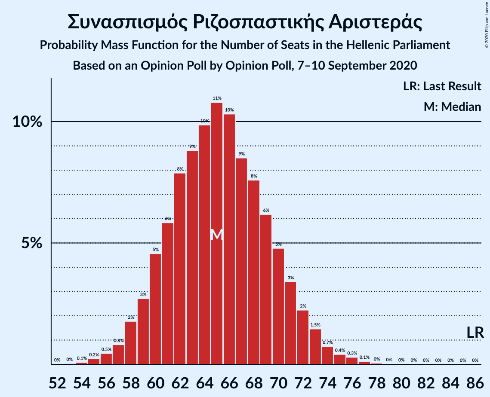
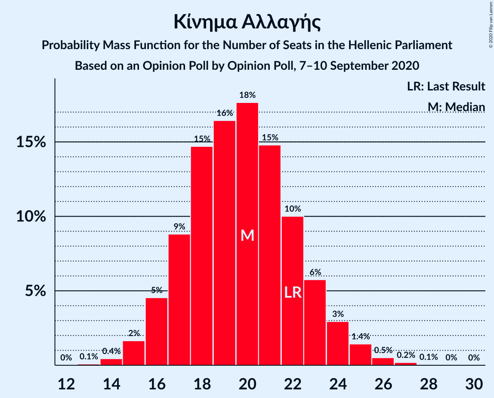

# Opinion Poll by Opinion Poll, 7–10 September 2020

<a href="#voting-intentions">Voting Intentions</a> | <a href="#seats">Seats</a> | <a href="#coalitions">Coalitions</a> | <a href="#technical-information">Technical Information</a>

## Voting Intentions

### Confidence Intervals

| Party | Last Result | Poll Result | 80% Confidence Interval | 90% Confidence Interval | 95% Confidence Interval | 99% Confidence Interval |
|:-----:|:-----------:|:-----------:|:-----------------------:|:-----------------------:|:-----------------------:|:-----------------------:|
| Νέα Δημοκρατία | 39.8% | 51.1% | 49.1–53.1% |48.5–53.7% |48.0–54.2% |47.0–55.2% |
| Συνασπισμός Ριζοσπαστικής Αριστεράς | 31.5% | 24.7% | 23.0–26.5% |22.5–27.0% |22.1–27.4% |21.3–28.3% |
| Κίνημα Αλλαγής | 8.1% | 7.4% | 6.4–8.6% |6.1–8.9% |5.9–9.2% |5.5–9.8% |
| Κομμουνιστικό Κόμμα Ελλάδας | 5.3% | 6.3% | 5.4–7.4% |5.2–7.7% |4.9–8.0% |4.5–8.5% |
| Ελληνική Λύση | 3.7% | 3.8% | 3.1–4.7% |2.9–4.9% |2.8–5.2% |2.5–5.6% |
| Μέτωπο Ευρωπαϊκής Ρεαλιστικής Ανυπακοής | 3.4% | 2.8% | 2.2–3.6% |2.1–3.8% |1.9–4.0% |1.7–4.4% |

*Note:* The poll result column reflects the actual value used in the calculations. Published results may vary slightly, and in addition be rounded to fewer digits.

## Seats

### Confidence Intervals

| Party | Last Result | Median | 80% Confidence Interval | 90% Confidence Interval | 95% Confidence Interval | 99% Confidence Interval |
|:-----:|:-----------:|:------:|:-----------------------:|:-----------------------:|:-----------------------:|:-----------------------:|
| <a href="#νέα-δημοκρατία">Νέα Δημοκρατία</a> | 158 | 184 | 179–192 |178–193 |176–194 |173–197 |
| <a href="#συνασπισμός-ριζοσπαστικής-αριστεράς">Συνασπισμός Ριζοσπαστικής Αριστεράς</a> | 86 | 65 | 60–70 |59–72 |58–73 |56–76 |
| <a href="#κίνημα-αλλαγής">Κίνημα Αλλαγής</a> | 22 | 20 | 17–23 |16–23 |16–24 |14–26 |
| <a href="#κομμουνιστικό-κόμμα-ελλάδας">Κομμουνιστικό Κόμμα Ελλάδας</a> | 15 | 17 | 14–19 |14–21 |13–21 |12–23 |
| <a href="#ελληνική-λύση">Ελληνική Λύση</a> | 10 | 10 | 8–12 |0–13 |0–14 |0–15 |
| <a href="#μέτωπο-ευρωπαϊκής-ρεαλιστικής-ανυπακοής">Μέτωπο Ευρωπαϊκής Ρεαλιστικής Ανυπακοής</a> | 9 | 0 | 0–9 |0–10 |0–10 |0–11 |

### Νέα Δημοκρατία

*For a full overview of the results for this party, see the [Νέα Δημοκρατία](party-νέαδημοκρατία.html) page.*

| Number of Seats | Probability | Accumulated | Special Marks |
|:---------------:|:-----------:|:-----------:|:-------------:|
| 158 | 0% | 100% | Last Result |
| 159 | 0% | 100% |  |
| 160 | 0% | 100% |  |
| 161 | 0% | 100% |  |
| 162 | 0% | 100% |  |
| 163 | 0% | 100% |  |
| 164 | 0% | 100% |  |
| 165 | 0% | 100% |  |
| 166 | 0% | 100% |  |
| 167 | 0% | 100% |  |
| 168 | 0% | 100% |  |
| 169 | 0% | 100% |  |
| 170 | 0.1% | 100% |  |
| 171 | 0.1% | 99.9% |  |
| 172 | 0.1% | 99.8% |  |
| 173 | 0.2% | 99.7% |  |
| 174 | 0.5% | 99.5% |  |
| 175 | 0.6% | 99.0% |  |
| 176 | 0.9% | 98% |  |
| 177 | 2% | 97% |  |
| 178 | 3% | 96% |  |
| 179 | 5% | 93% |  |
| 180 | 6% | 88% |  |
| 181 | 7% | 81% |  |
| 182 | 10% | 75% |  |
| 183 | 12% | 65% |  |
| 184 | 6% | 52% | Median |
| 185 | 3% | 47% |  |
| 186 | 5% | 44% |  |
| 187 | 2% | 39% |  |
| 188 | 5% | 37% |  |
| 189 | 9% | 32% |  |
| 190 | 5% | 22% |  |
| 191 | 4% | 17% |  |
| 192 | 6% | 13% |  |
| 193 | 3% | 7% |  |
| 194 | 2% | 4% |  |
| 195 | 0.9% | 2% |  |
| 196 | 0.8% | 1.4% |  |
| 197 | 0.3% | 0.6% |  |
| 198 | 0.2% | 0.3% |  |
| 199 | 0% | 0.1% |  |
| 200 | 0% | 0.1% |  |
| 201 | 0% | 0.1% |  |
| 202 | 0% | 0% |  |

### Συνασπισμός Ριζοσπαστικής Αριστεράς

*For a full overview of the results for this party, see the [Συνασπισμός Ριζοσπαστικής Αριστεράς](party-συνασπισμόςριζοσπαστικήςαριστεράς.html) page.*

| Number of Seats | Probability | Accumulated | Special Marks |
|:---------------:|:-----------:|:-----------:|:-------------:|
| 53 | 0% | 100% |  |
| 54 | 0.1% | 99.9% |  |
| 55 | 0.2% | 99.9% |  |
| 56 | 0.4% | 99.7% |  |
| 57 | 0.7% | 99.2% |  |
| 58 | 2% | 98.5% |  |
| 59 | 2% | 97% |  |
| 60 | 5% | 94% |  |
| 61 | 7% | 89% |  |
| 62 | 11% | 82% |  |
| 63 | 7% | 72% |  |
| 64 | 12% | 64% |  |
| 65 | 11% | 52% | Median |
| 66 | 9% | 40% |  |
| 67 | 7% | 31% |  |
| 68 | 8% | 25% |  |
| 69 | 5% | 17% |  |
| 70 | 3% | 12% |  |
| 71 | 2% | 8% |  |
| 72 | 3% | 6% |  |
| 73 | 2% | 3% |  |
| 74 | 0.6% | 1.5% |  |
| 75 | 0.3% | 0.9% |  |
| 76 | 0.3% | 0.5% |  |
| 77 | 0.2% | 0.3% |  |
| 78 | 0% | 0.1% |  |
| 79 | 0% | 0% |  |
| 80 | 0% | 0% |  |
| 81 | 0% | 0% |  |
| 82 | 0% | 0% |  |
| 83 | 0% | 0% |  |
| 84 | 0% | 0% |  |
| 85 | 0% | 0% |  |
| 86 | 0% | 0% | Last Result |

### Κίνημα Αλλαγής

*For a full overview of the results for this party, see the [Κίνημα Αλλαγής](party-κίνημααλλαγής.html) page.*

| Number of Seats | Probability | Accumulated | Special Marks |
|:---------------:|:-----------:|:-----------:|:-------------:|
| 13 | 0.1% | 100% |  |
| 14 | 0.6% | 99.9% |  |
| 15 | 2% | 99.3% |  |
| 16 | 4% | 98% |  |
| 17 | 10% | 93% |  |
| 18 | 12% | 84% |  |
| 19 | 17% | 71% |  |
| 20 | 20% | 54% | Median |
| 21 | 14% | 34% |  |
| 22 | 10% | 20% | Last Result |
| 23 | 5% | 10% |  |
| 24 | 3% | 5% |  |
| 25 | 2% | 2% |  |
| 26 | 0.4% | 0.6% |  |
| 27 | 0.2% | 0.3% |  |
| 28 | 0% | 0.1% |  |
| 29 | 0% | 0% |  |

### Κομμουνιστικό Κόμμα Ελλάδας

*For a full overview of the results for this party, see the [Κομμουνιστικό Κόμμα Ελλάδας](party-κομμουνιστικόκόμμαελλάδας.html) page.*

| Number of Seats | Probability | Accumulated | Special Marks |
|:---------------:|:-----------:|:-----------:|:-------------:|
| 11 | 0.2% | 100% |  |
| 12 | 0.9% | 99.8% |  |
| 13 | 3% | 98.9% |  |
| 14 | 8% | 95% |  |
| 15 | 13% | 87% | Last Result |
| 16 | 20% | 74% |  |
| 17 | 19% | 54% | Median |
| 18 | 15% | 35% |  |
| 19 | 10% | 20% |  |
| 20 | 4% | 10% |  |
| 21 | 4% | 6% |  |
| 22 | 1.2% | 2% |  |
| 23 | 0.3% | 0.5% |  |
| 24 | 0.2% | 0.2% |  |
| 25 | 0% | 0% |  |

### Ελληνική Λύση

*For a full overview of the results for this party, see the [Ελληνική Λύση](party-ελληνικήλύση.html) page.*

| Number of Seats | Probability | Accumulated | Special Marks |
|:---------------:|:-----------:|:-----------:|:-------------:|
| 0 | 7% | 100% |  |
| 1 | 0% | 93% |  |
| 2 | 0% | 93% |  |
| 3 | 0% | 93% |  |
| 4 | 0% | 93% |  |
| 5 | 0% | 93% |  |
| 6 | 0% | 93% |  |
| 7 | 0% | 93% |  |
| 8 | 6% | 93% |  |
| 9 | 22% | 87% |  |
| 10 | 25% | 65% | Last Result, Median |
| 11 | 19% | 40% |  |
| 12 | 11% | 21% |  |
| 13 | 6% | 9% |  |
| 14 | 2% | 3% |  |
| 15 | 0.8% | 1.0% |  |
| 16 | 0.2% | 0.2% |  |
| 17 | 0% | 0% |  |

### Μέτωπο Ευρωπαϊκής Ρεαλιστικής Ανυπακοής

*For a full overview of the results for this party, see the [Μέτωπο Ευρωπαϊκής Ρεαλιστικής Ανυπακοής](party-μέτωποευρωπαϊκήςρεαλιστικήςανυπακοής.html) page.*

| Number of Seats | Probability | Accumulated | Special Marks |
|:---------------:|:-----------:|:-----------:|:-------------:|
| 0 | 57% | 100% | Median |
| 1 | 0% | 43% |  |
| 2 | 0% | 43% |  |
| 3 | 0% | 43% |  |
| 4 | 0% | 43% |  |
| 5 | 0% | 43% |  |
| 6 | 0% | 43% |  |
| 7 | 0% | 43% |  |
| 8 | 20% | 43% |  |
| 9 | 16% | 23% | Last Result |
| 10 | 5% | 7% |  |
| 11 | 1.4% | 2% |  |
| 12 | 0.4% | 0.5% |  |
| 13 | 0.1% | 0.1% |  |
| 14 | 0% | 0% |  |

## Coalitions

### Confidence Intervals

| Coalition | Last Result | Median | Majority? | 80% Confidence Interval | 90% Confidence Interval | 95% Confidence Interval | 99% Confidence Interval |
|:---------:|:-----------:|:------:|:---------:|:-----------------------:|:-----------------------:|:-----------------------:|:-----------------------:|
| Νέα Δημοκρατία – Κίνημα Αλλαγής | 180 | 204 | 100% | 199–212 | 197–214 | 196–214 | 193–217 |
| Νέα Δημοκρατία | 158 | 184 | 100% | 179–192 | 178–193 | 176–194 | 173–197 |
| Συνασπισμός Ριζοσπαστικής Αριστεράς – Μέτωπο Ευρωπαϊκής Ρεαλιστικής Ανυπακοής | 95 | 69 | 0% | 62–75 | 60–76 | 60–79 | 58–81 |
| Συνασπισμός Ριζοσπαστικής Αριστεράς | 86 | 65 | 0% | 60–70 | 59–72 | 58–73 | 56–76 |

### Νέα Δημοκρατία – Κίνημα Αλλαγής

| Number of Seats | Probability | Accumulated | Special Marks |
|:---------------:|:-----------:|:-----------:|:-------------:|
| 180 | 0% | 100% | Last Result |
| 181 | 0% | 100% |  |
| 182 | 0% | 100% |  |
| 183 | 0% | 100% |  |
| 184 | 0% | 100% |  |
| 185 | 0% | 100% |  |
| 186 | 0% | 100% |  |
| 187 | 0% | 100% |  |
| 188 | 0% | 100% |  |
| 189 | 0.1% | 100% |  |
| 190 | 0.1% | 99.9% |  |
| 191 | 0.1% | 99.9% |  |
| 192 | 0.2% | 99.7% |  |
| 193 | 0.3% | 99.6% |  |
| 194 | 0.7% | 99.3% |  |
| 195 | 0.8% | 98.6% |  |
| 196 | 1.3% | 98% |  |
| 197 | 3% | 96% |  |
| 198 | 3% | 94% |  |
| 199 | 5% | 91% |  |
| 200 | 9% | 86% |  |
| 201 | 8% | 78% |  |
| 202 | 8% | 69% |  |
| 203 | 11% | 61% |  |
| 204 | 4% | 50% | Median |
| 205 | 5% | 47% |  |
| 206 | 6% | 42% |  |
| 207 | 2% | 36% |  |
| 208 | 6% | 34% |  |
| 209 | 5% | 28% |  |
| 210 | 3% | 23% |  |
| 211 | 8% | 20% |  |
| 212 | 3% | 11% |  |
| 213 | 3% | 8% |  |
| 214 | 3% | 5% |  |
| 215 | 0.9% | 2% |  |
| 216 | 0.7% | 2% |  |
| 217 | 0.6% | 0.8% |  |
| 218 | 0.1% | 0.3% |  |
| 219 | 0.1% | 0.2% |  |
| 220 | 0% | 0.1% |  |
| 221 | 0% | 0.1% |  |
| 222 | 0% | 0% |  |

### Νέα Δημοκρατία

| Number of Seats | Probability | Accumulated | Special Marks |
|:---------------:|:-----------:|:-----------:|:-------------:|
| 158 | 0% | 100% | Last Result |
| 159 | 0% | 100% |  |
| 160 | 0% | 100% |  |
| 161 | 0% | 100% |  |
| 162 | 0% | 100% |  |
| 163 | 0% | 100% |  |
| 164 | 0% | 100% |  |
| 165 | 0% | 100% |  |
| 166 | 0% | 100% |  |
| 167 | 0% | 100% |  |
| 168 | 0% | 100% |  |
| 169 | 0% | 100% |  |
| 170 | 0.1% | 100% |  |
| 171 | 0.1% | 99.9% |  |
| 172 | 0.1% | 99.8% |  |
| 173 | 0.2% | 99.7% |  |
| 174 | 0.5% | 99.5% |  |
| 175 | 0.6% | 99.0% |  |
| 176 | 0.9% | 98% |  |
| 177 | 2% | 97% |  |
| 178 | 3% | 96% |  |
| 179 | 5% | 93% |  |
| 180 | 6% | 88% |  |
| 181 | 7% | 81% |  |
| 182 | 10% | 75% |  |
| 183 | 12% | 65% |  |
| 184 | 6% | 52% | Median |
| 185 | 3% | 47% |  |
| 186 | 5% | 44% |  |
| 187 | 2% | 39% |  |
| 188 | 5% | 37% |  |
| 189 | 9% | 32% |  |
| 190 | 5% | 22% |  |
| 191 | 4% | 17% |  |
| 192 | 6% | 13% |  |
| 193 | 3% | 7% |  |
| 194 | 2% | 4% |  |
| 195 | 0.9% | 2% |  |
| 196 | 0.8% | 1.4% |  |
| 197 | 0.3% | 0.6% |  |
| 198 | 0.2% | 0.3% |  |
| 199 | 0% | 0.1% |  |
| 200 | 0% | 0.1% |  |
| 201 | 0% | 0.1% |  |
| 202 | 0% | 0% |  |

### Συνασπισμός Ριζοσπαστικής Αριστεράς – Μέτωπο Ευρωπαϊκής Ρεαλιστικής Ανυπακοής

| Number of Seats | Probability | Accumulated | Special Marks |
|:---------------:|:-----------:|:-----------:|:-------------:|
| 55 | 0.1% | 100% |  |
| 56 | 0.1% | 99.9% |  |
| 57 | 0.2% | 99.8% |  |
| 58 | 0.7% | 99.6% |  |
| 59 | 1.3% | 98.8% |  |
| 60 | 3% | 98% |  |
| 61 | 3% | 95% |  |
| 62 | 5% | 92% |  |
| 63 | 2% | 87% |  |
| 64 | 8% | 85% |  |
| 65 | 7% | 77% | Median |
| 66 | 4% | 70% |  |
| 67 | 5% | 66% |  |
| 68 | 8% | 61% |  |
| 69 | 9% | 53% |  |
| 70 | 8% | 45% |  |
| 71 | 7% | 36% |  |
| 72 | 5% | 30% |  |
| 73 | 6% | 25% |  |
| 74 | 9% | 19% |  |
| 75 | 3% | 11% |  |
| 76 | 4% | 8% |  |
| 77 | 1.1% | 4% |  |
| 78 | 0.5% | 3% |  |
| 79 | 1.4% | 3% |  |
| 80 | 0.3% | 1.1% |  |
| 81 | 0.4% | 0.8% |  |
| 82 | 0.2% | 0.4% |  |
| 83 | 0.1% | 0.2% |  |
| 84 | 0.1% | 0.1% |  |
| 85 | 0% | 0% |  |
| 86 | 0% | 0% |  |
| 87 | 0% | 0% |  |
| 88 | 0% | 0% |  |
| 89 | 0% | 0% |  |
| 90 | 0% | 0% |  |
| 91 | 0% | 0% |  |
| 92 | 0% | 0% |  |
| 93 | 0% | 0% |  |
| 94 | 0% | 0% |  |
| 95 | 0% | 0% | Last Result |

### Συνασπισμός Ριζοσπαστικής Αριστεράς

| Number of Seats | Probability | Accumulated | Special Marks |
|:---------------:|:-----------:|:-----------:|:-------------:|
| 53 | 0% | 100% |  |
| 54 | 0.1% | 99.9% |  |
| 55 | 0.2% | 99.9% |  |
| 56 | 0.4% | 99.7% |  |
| 57 | 0.7% | 99.2% |  |
| 58 | 2% | 98.5% |  |
| 59 | 2% | 97% |  |
| 60 | 5% | 94% |  |
| 61 | 7% | 89% |  |
| 62 | 11% | 82% |  |
| 63 | 7% | 72% |  |
| 64 | 12% | 64% |  |
| 65 | 11% | 52% | Median |
| 66 | 9% | 40% |  |
| 67 | 7% | 31% |  |
| 68 | 8% | 25% |  |
| 69 | 5% | 17% |  |
| 70 | 3% | 12% |  |
| 71 | 2% | 8% |  |
| 72 | 3% | 6% |  |
| 73 | 2% | 3% |  |
| 74 | 0.6% | 1.5% |  |
| 75 | 0.3% | 0.9% |  |
| 76 | 0.3% | 0.5% |  |
| 77 | 0.2% | 0.3% |  |
| 78 | 0% | 0.1% |  |
| 79 | 0% | 0% |  |
| 80 | 0% | 0% |  |
| 81 | 0% | 0% |  |
| 82 | 0% | 0% |  |
| 83 | 0% | 0% |  |
| 84 | 0% | 0% |  |
| 85 | 0% | 0% |  |
| 86 | 0% | 0% | Last Result |

## Technical Information

### Opinion Poll

+ **Polling firm:** Opinion Poll
+ **Commissioner(s):** —
+ **Fieldwork period:** 7–10 September 2020

### Calculations

+ **Sample size:** 1002
+ **Simulations done:** 131,072
+ **Error estimate:** 0.90%

