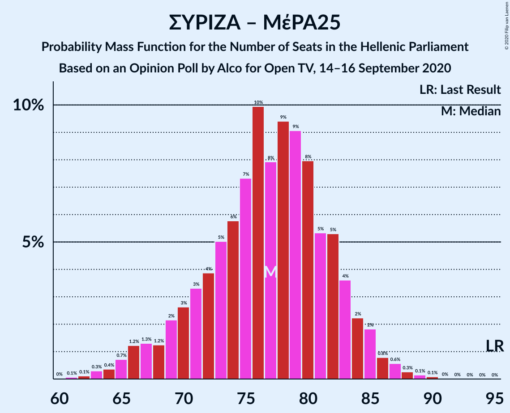

# Opinion Poll by Alco for Open TV, 14–16 September 2020

<a href="#voting-intentions">Voting Intentions</a> | <a href="#seats">Seats</a> | <a href="#coalitions">Coalitions</a> | <a href="#technical-information">Technical Information</a>

## Voting Intentions

### Confidence Intervals

| Party | Last Result | Poll Result | 80% Confidence Interval | 90% Confidence Interval | 95% Confidence Interval | 99% Confidence Interval |
|:-----:|:-----------:|:-----------:|:-----------------------:|:-----------------------:|:-----------------------:|:-----------------------:|
| Νέα Δημοκρατία | 39.8% | 44.4% | 42.4–46.4% |41.8–47.0% |41.3–47.5% |40.4–48.5% |
| Συνασπισμός Ριζοσπαστικής Αριστεράς | 31.5% | 25.2% | 23.5–27.0% |23.0–27.5% |22.6–28.0% |21.8–28.9% |
| Κίνημα Αλλαγής | 8.1% | 7.8% | 6.8–9.0% |6.5–9.3% |6.3–9.6% |5.8–10.2% |
| Κομμουνιστικό Κόμμα Ελλάδας | 5.3% | 6.1% | 5.2–7.2% |5.0–7.5% |4.8–7.8% |4.4–8.3% |
| Ελληνική Λύση | 3.7% | 5.2% | 4.4–6.2% |4.2–6.5% |4.0–6.8% |3.6–7.3% |
| Μέτωπο Ευρωπαϊκής Ρεαλιστικής Ανυπακοής | 3.4% | 3.4% | 2.8–4.3% |2.6–4.5% |2.4–4.7% |2.2–5.2% |
| Πλεύση Ελευθερίας | 1.5% | 1.7% | 1.3–2.4% |1.2–2.5% |1.1–2.7% |0.9–3.1% |

*Note:* The poll result column reflects the actual value used in the calculations. Published results may vary slightly, and in addition be rounded to fewer digits.

## Seats

### Confidence Intervals

| Party | Last Result | Median | 80% Confidence Interval | 90% Confidence Interval | 95% Confidence Interval | 99% Confidence Interval |
|:-----:|:-----------:|:------:|:-----------------------:|:-----------------------:|:-----------------------:|:-----------------------:|
| <a href="#νέα-δημοκρατία">Νέα Δημοκρατία</a> | 158 | 171 | 165–177 |163–179 |162–180 |160–183 |
| <a href="#συνασπισμός-ριζοσπαστικής-αριστεράς">Συνασπισμός Ριζοσπαστικής Αριστεράς</a> | 86 | 69 | 64–74 |63–75 |61–76 |59–79 |
| <a href="#κίνημα-αλλαγής">Κίνημα Αλλαγής</a> | 22 | 21 | 18–24 |18–25 |17–26 |16–28 |
| <a href="#κομμουνιστικό-κόμμα-ελλάδας">Κομμουνιστικό Κόμμα Ελλάδας</a> | 15 | 17 | 14–19 |13–20 |13–21 |12–23 |
| <a href="#ελληνική-λύση">Ελληνική Λύση</a> | 10 | 14 | 12–17 |11–18 |11–18 |10–20 |
| <a href="#μέτωπο-ευρωπαϊκής-ρεαλιστικής-ανυπακοής">Μέτωπο Ευρωπαϊκής Ρεαλιστικής Ανυπακοής</a> | 9 | 9 | 0–12 |0–12 |0–13 |0–14 |
| <a href="#πλεύση-ελευθερίας">Πλεύση Ελευθερίας</a> | 0 | 0 | 0 |0 |0 |0–8 |

### Νέα Δημοκρατία

*For a full overview of the results for this party, see the [Νέα Δημοκρατία](party-νέαδημοκρατία.html) page.*

| Number of Seats | Probability | Accumulated | Special Marks |
|:---------------:|:-----------:|:-----------:|:-------------:|
| 157 | 0.1% | 100% |  |
| 158 | 0.1% | 99.9% | Last Result |
| 159 | 0.3% | 99.8% |  |
| 160 | 0.5% | 99.5% |  |
| 161 | 0.8% | 99.0% |  |
| 162 | 1.4% | 98% |  |
| 163 | 2% | 97% |  |
| 164 | 3% | 95% |  |
| 165 | 4% | 92% |  |
| 166 | 4% | 89% |  |
| 167 | 7% | 84% |  |
| 168 | 7% | 77% |  |
| 169 | 10% | 70% |  |
| 170 | 7% | 60% |  |
| 171 | 11% | 52% | Median |
| 172 | 7% | 42% |  |
| 173 | 8% | 34% |  |
| 174 | 7% | 26% |  |
| 175 | 5% | 19% |  |
| 176 | 4% | 14% |  |
| 177 | 2% | 10% |  |
| 178 | 2% | 8% |  |
| 179 | 2% | 5% |  |
| 180 | 1.2% | 4% |  |
| 181 | 1.1% | 2% |  |
| 182 | 0.5% | 1.3% |  |
| 183 | 0.4% | 0.8% |  |
| 184 | 0.2% | 0.4% |  |
| 185 | 0.1% | 0.2% |  |
| 186 | 0.1% | 0.1% |  |
| 187 | 0% | 0.1% |  |
| 188 | 0% | 0% |  |

### Συνασπισμός Ριζοσπαστικής Αριστεράς

*For a full overview of the results for this party, see the [Συνασπισμός Ριζοσπαστικής Αριστεράς](party-συνασπισμόςριζοσπαστικήςαριστεράς.html) page.*

| Number of Seats | Probability | Accumulated | Special Marks |
|:---------------:|:-----------:|:-----------:|:-------------:|
| 57 | 0.1% | 100% |  |
| 58 | 0.2% | 99.9% |  |
| 59 | 0.4% | 99.7% |  |
| 60 | 0.7% | 99.4% |  |
| 61 | 1.3% | 98.7% |  |
| 62 | 2% | 97% |  |
| 63 | 4% | 95% |  |
| 64 | 3% | 91% |  |
| 65 | 8% | 88% |  |
| 66 | 8% | 80% |  |
| 67 | 10% | 72% |  |
| 68 | 10% | 62% |  |
| 69 | 10% | 52% | Median |
| 70 | 11% | 41% |  |
| 71 | 7% | 30% |  |
| 72 | 8% | 24% |  |
| 73 | 4% | 16% |  |
| 74 | 4% | 11% |  |
| 75 | 3% | 7% |  |
| 76 | 2% | 4% |  |
| 77 | 1.1% | 2% |  |
| 78 | 0.6% | 1.3% |  |
| 79 | 0.4% | 0.7% |  |
| 80 | 0.2% | 0.4% |  |
| 81 | 0.1% | 0.2% |  |
| 82 | 0% | 0.1% |  |
| 83 | 0% | 0% |  |
| 84 | 0% | 0% |  |
| 85 | 0% | 0% |  |
| 86 | 0% | 0% | Last Result |

### Κίνημα Αλλαγής

*For a full overview of the results for this party, see the [Κίνημα Αλλαγής](party-κίνημααλλαγής.html) page.*

| Number of Seats | Probability | Accumulated | Special Marks |
|:---------------:|:-----------:|:-----------:|:-------------:|
| 15 | 0.2% | 100% |  |
| 16 | 1.0% | 99.7% |  |
| 17 | 3% | 98.7% |  |
| 18 | 6% | 96% |  |
| 19 | 11% | 90% |  |
| 20 | 16% | 79% |  |
| 21 | 17% | 63% | Median |
| 22 | 15% | 46% | Last Result |
| 23 | 13% | 31% |  |
| 24 | 8% | 18% |  |
| 25 | 5% | 10% |  |
| 26 | 3% | 5% |  |
| 27 | 1.3% | 2% |  |
| 28 | 0.5% | 0.8% |  |
| 29 | 0.2% | 0.3% |  |
| 30 | 0.1% | 0.1% |  |
| 31 | 0% | 0% |  |

### Κομμουνιστικό Κόμμα Ελλάδας

*For a full overview of the results for this party, see the [Κομμουνιστικό Κόμμα Ελλάδας](party-κομμουνιστικόκόμμαελλάδας.html) page.*

| Number of Seats | Probability | Accumulated | Special Marks |
|:---------------:|:-----------:|:-----------:|:-------------:|
| 11 | 0.2% | 100% |  |
| 12 | 1.0% | 99.7% |  |
| 13 | 4% | 98.8% |  |
| 14 | 8% | 95% |  |
| 15 | 15% | 87% | Last Result |
| 16 | 16% | 72% |  |
| 17 | 24% | 56% | Median |
| 18 | 14% | 33% |  |
| 19 | 9% | 19% |  |
| 20 | 6% | 10% |  |
| 21 | 3% | 4% |  |
| 22 | 1.1% | 2% |  |
| 23 | 0.4% | 0.6% |  |
| 24 | 0.1% | 0.2% |  |
| 25 | 0% | 0.1% |  |
| 26 | 0% | 0% |  |

### Ελληνική Λύση

*For a full overview of the results for this party, see the [Ελληνική Λύση](party-ελληνικήλύση.html) page.*

| Number of Seats | Probability | Accumulated | Special Marks |
|:---------------:|:-----------:|:-----------:|:-------------:|
| 9 | 0.2% | 100% |  |
| 10 | 1.4% | 99.8% | Last Result |
| 11 | 5% | 98% |  |
| 12 | 12% | 93% |  |
| 13 | 18% | 81% |  |
| 14 | 21% | 63% | Median |
| 15 | 17% | 42% |  |
| 16 | 11% | 25% |  |
| 17 | 8% | 14% |  |
| 18 | 4% | 6% |  |
| 19 | 1.5% | 2% |  |
| 20 | 0.5% | 0.7% |  |
| 21 | 0.1% | 0.2% |  |
| 22 | 0% | 0.1% |  |
| 23 | 0% | 0% |  |

### Μέτωπο Ευρωπαϊκής Ρεαλιστικής Ανυπακοής

*For a full overview of the results for this party, see the [Μέτωπο Ευρωπαϊκής Ρεαλιστικής Ανυπακοής](party-μέτωποευρωπαϊκήςρεαλιστικήςανυπακοής.html) page.*

| Number of Seats | Probability | Accumulated | Special Marks |
|:---------------:|:-----------:|:-----------:|:-------------:|
| 0 | 20% | 100% |  |
| 1 | 0% | 80% |  |
| 2 | 0% | 80% |  |
| 3 | 0% | 80% |  |
| 4 | 0% | 80% |  |
| 5 | 0% | 80% |  |
| 6 | 0% | 80% |  |
| 7 | 0% | 80% |  |
| 8 | 7% | 80% |  |
| 9 | 26% | 73% | Last Result, Median |
| 10 | 21% | 47% |  |
| 11 | 16% | 27% |  |
| 12 | 7% | 11% |  |
| 13 | 2% | 3% |  |
| 14 | 0.7% | 0.9% |  |
| 15 | 0.2% | 0.2% |  |
| 16 | 0% | 0% |  |

### Πλεύση Ελευθερίας

*For a full overview of the results for this party, see the [Πλεύση Ελευθερίας](party-πλεύσηελευθερίας.html) page.*

| Number of Seats | Probability | Accumulated | Special Marks |
|:---------------:|:-----------:|:-----------:|:-------------:|
| 0 | 99.5% | 100% | Last Result, Median |
| 1 | 0% | 0.5% |  |
| 2 | 0% | 0.5% |  |
| 3 | 0% | 0.5% |  |
| 4 | 0% | 0.5% |  |
| 5 | 0% | 0.5% |  |
| 6 | 0% | 0.5% |  |
| 7 | 0% | 0.5% |  |
| 8 | 0.2% | 0.5% |  |
| 9 | 0.2% | 0.3% |  |
| 10 | 0% | 0% |  |

## Coalitions

### Confidence Intervals

| Coalition | Last Result | Median | Majority? | 80% Confidence Interval | 90% Confidence Interval | 95% Confidence Interval | 99% Confidence Interval |
|:---------:|:-----------:|:------:|:---------:|:-----------------------:|:-----------------------:|:-----------------------:|:-----------------------:|
| Νέα Δημοκρατία – Κίνημα Αλλαγής | 180 | 192 | 100% | 186–198 | 185–200 | 183–202 | 181–205 |
| Νέα Δημοκρατία | 158 | 171 | 100% | 165–177 | 163–179 | 162–180 | 160–183 |
| Συνασπισμός Ριζοσπαστικής Αριστεράς – Μέτωπο Ευρωπαϊκής Ρεαλιστικής Ανυπακοής | 95 | 77 | 0% | 70–82 | 68–84 | 66–85 | 63–88 |
| Συνασπισμός Ριζοσπαστικής Αριστεράς | 86 | 69 | 0% | 64–74 | 63–75 | 61–76 | 59–79 |

### Νέα Δημοκρατία – Κίνημα Αλλαγής

| Number of Seats | Probability | Accumulated | Special Marks |
|:---------------:|:-----------:|:-----------:|:-------------:|
| 178 | 0.1% | 100% |  |
| 179 | 0.1% | 99.9% |  |
| 180 | 0.2% | 99.8% | Last Result |
| 181 | 0.4% | 99.6% |  |
| 182 | 0.7% | 99.1% |  |
| 183 | 1.2% | 98% |  |
| 184 | 2% | 97% |  |
| 185 | 3% | 95% |  |
| 186 | 3% | 93% |  |
| 187 | 4% | 89% |  |
| 188 | 7% | 85% |  |
| 189 | 8% | 78% |  |
| 190 | 7% | 71% |  |
| 191 | 8% | 63% |  |
| 192 | 9% | 55% | Median |
| 193 | 8% | 46% |  |
| 194 | 9% | 38% |  |
| 195 | 6% | 29% |  |
| 196 | 6% | 23% |  |
| 197 | 4% | 17% |  |
| 198 | 3% | 13% |  |
| 199 | 3% | 10% |  |
| 200 | 2% | 7% |  |
| 201 | 1.4% | 5% |  |
| 202 | 1.0% | 3% |  |
| 203 | 0.7% | 2% |  |
| 204 | 0.7% | 1.4% |  |
| 205 | 0.3% | 0.7% |  |
| 206 | 0.2% | 0.4% |  |
| 207 | 0.1% | 0.2% |  |
| 208 | 0% | 0.1% |  |
| 209 | 0% | 0.1% |  |
| 210 | 0% | 0% |  |

### Νέα Δημοκρατία

| Number of Seats | Probability | Accumulated | Special Marks |
|:---------------:|:-----------:|:-----------:|:-------------:|
| 157 | 0.1% | 100% |  |
| 158 | 0.1% | 99.9% | Last Result |
| 159 | 0.3% | 99.8% |  |
| 160 | 0.5% | 99.5% |  |
| 161 | 0.8% | 99.0% |  |
| 162 | 1.4% | 98% |  |
| 163 | 2% | 97% |  |
| 164 | 3% | 95% |  |
| 165 | 4% | 92% |  |
| 166 | 4% | 89% |  |
| 167 | 7% | 84% |  |
| 168 | 7% | 77% |  |
| 169 | 10% | 70% |  |
| 170 | 7% | 60% |  |
| 171 | 11% | 52% | Median |
| 172 | 7% | 42% |  |
| 173 | 8% | 34% |  |
| 174 | 7% | 26% |  |
| 175 | 5% | 19% |  |
| 176 | 4% | 14% |  |
| 177 | 2% | 10% |  |
| 178 | 2% | 8% |  |
| 179 | 2% | 5% |  |
| 180 | 1.2% | 4% |  |
| 181 | 1.1% | 2% |  |
| 182 | 0.5% | 1.3% |  |
| 183 | 0.4% | 0.8% |  |
| 184 | 0.2% | 0.4% |  |
| 185 | 0.1% | 0.2% |  |
| 186 | 0.1% | 0.1% |  |
| 187 | 0% | 0.1% |  |
| 188 | 0% | 0% |  |

### Συνασπισμός Ριζοσπαστικής Αριστεράς – Μέτωπο Ευρωπαϊκής Ρεαλιστικής Ανυπακοής

| Number of Seats | Probability | Accumulated | Special Marks |
|:---------------:|:-----------:|:-----------:|:-------------:|
| 61 | 0.1% | 100% |  |
| 62 | 0.1% | 99.9% |  |
| 63 | 0.3% | 99.8% |  |
| 64 | 0.4% | 99.5% |  |
| 65 | 0.7% | 99.1% |  |
| 66 | 1.2% | 98% |  |
| 67 | 1.3% | 97% |  |
| 68 | 1.2% | 96% |  |
| 69 | 2% | 95% |  |
| 70 | 3% | 92% |  |
| 71 | 3% | 90% |  |
| 72 | 4% | 87% |  |
| 73 | 5% | 83% |  |
| 74 | 6% | 78% |  |
| 75 | 7% | 72% |  |
| 76 | 10% | 65% |  |
| 77 | 8% | 55% |  |
| 78 | 9% | 47% | Median |
| 79 | 9% | 37% |  |
| 80 | 8% | 28% |  |
| 81 | 5% | 20% |  |
| 82 | 5% | 15% |  |
| 83 | 4% | 10% |  |
| 84 | 2% | 6% |  |
| 85 | 2% | 4% |  |
| 86 | 0.8% | 2% |  |
| 87 | 0.6% | 1.1% |  |
| 88 | 0.3% | 0.5% |  |
| 89 | 0.1% | 0.3% |  |
| 90 | 0.1% | 0.1% |  |
| 91 | 0% | 0% |  |
| 92 | 0% | 0% |  |
| 93 | 0% | 0% |  |
| 94 | 0% | 0% |  |
| 95 | 0% | 0% | Last Result |

### Συνασπισμός Ριζοσπαστικής Αριστεράς

| Number of Seats | Probability | Accumulated | Special Marks |
|:---------------:|:-----------:|:-----------:|:-------------:|
| 57 | 0.1% | 100% |  |
| 58 | 0.2% | 99.9% |  |
| 59 | 0.4% | 99.7% |  |
| 60 | 0.7% | 99.4% |  |
| 61 | 1.3% | 98.7% |  |
| 62 | 2% | 97% |  |
| 63 | 4% | 95% |  |
| 64 | 3% | 91% |  |
| 65 | 8% | 88% |  |
| 66 | 8% | 80% |  |
| 67 | 10% | 72% |  |
| 68 | 10% | 62% |  |
| 69 | 10% | 52% | Median |
| 70 | 11% | 41% |  |
| 71 | 7% | 30% |  |
| 72 | 8% | 24% |  |
| 73 | 4% | 16% |  |
| 74 | 4% | 11% |  |
| 75 | 3% | 7% |  |
| 76 | 2% | 4% |  |
| 77 | 1.1% | 2% |  |
| 78 | 0.6% | 1.3% |  |
| 79 | 0.4% | 0.7% |  |
| 80 | 0.2% | 0.4% |  |
| 81 | 0.1% | 0.2% |  |
| 82 | 0% | 0.1% |  |
| 83 | 0% | 0% |  |
| 84 | 0% | 0% |  |
| 85 | 0% | 0% |  |
| 86 | 0% | 0% | Last Result |

## Technical Information

### Opinion Poll

+ **Polling firm:** Alco
+ **Commissioner(s):** Open TV
+ **Fieldwork period:** 14–16 September 2020

### Calculations

+ **Sample size:** 1000
+ **Simulations done:** 1,048,576
+ **Error estimate:** 1.14%

