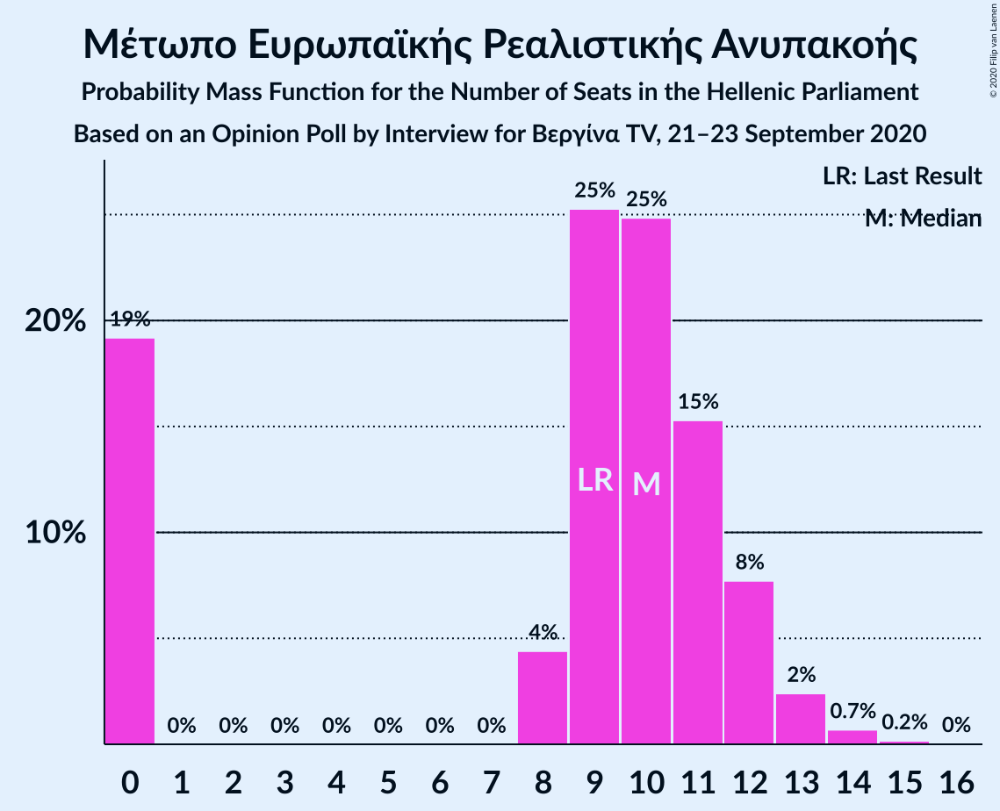
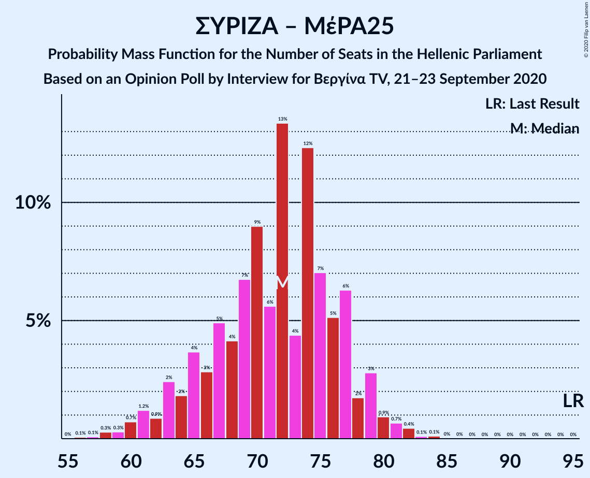
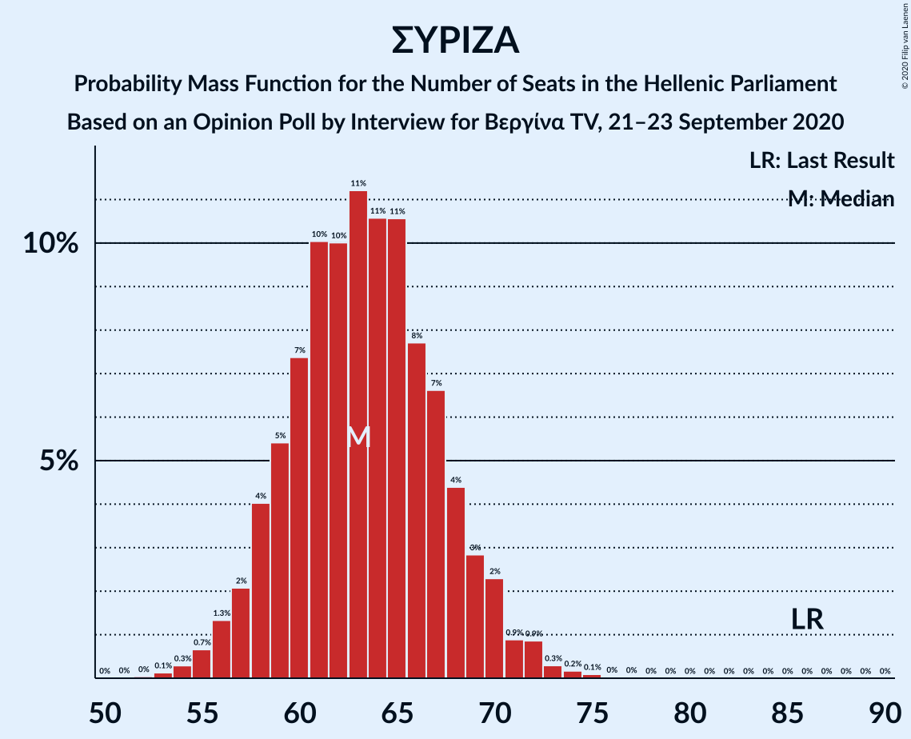

# Opinion Poll by Interview for Βεργίνα TV, 21–23 September 2020

<a href="#voting-intentions">Voting Intentions</a> | <a href="#seats">Seats</a> | <a href="#coalitions">Coalitions</a> | <a href="#technical-information">Technical Information</a>

## Voting Intentions

### Confidence Intervals

| Party | Last Result | Poll Result | 80% Confidence Interval | 90% Confidence Interval | 95% Confidence Interval | 99% Confidence Interval |
|:-----:|:-----------:|:-----------:|:-----------------------:|:-----------------------:|:-----------------------:|:-----------------------:|
| Νέα Δημοκρατία | 39.8% | 45.4% | 43.5–47.3% |43.0–47.9% |42.5–48.4% |41.6–49.3% |
| Συνασπισμός Ριζοσπαστικής Αριστεράς | 31.5% | 22.9% | 21.4–24.6% |20.9–25.1% |20.5–25.5% |19.8–26.3% |
| Κίνημα Αλλαγής | 8.1% | 8.6% | 7.6–9.8% |7.4–10.2% |7.1–10.4% |6.7–11.0% |
| Κομμουνιστικό Κόμμα Ελλάδας | 5.3% | 5.3% | 4.5–6.3% |4.3–6.6% |4.1–6.8% |3.8–7.3% |
| Ελληνική Λύση | 3.7% | 5.2% | 4.5–6.2% |4.2–6.4% |4.1–6.7% |3.7–7.2% |
| Μέτωπο Ευρωπαϊκής Ρεαλιστικής Ανυπακοής | 3.4% | 3.4% | 2.8–4.2% |2.6–4.5% |2.5–4.7% |2.2–5.1% |

*Note:* The poll result column reflects the actual value used in the calculations. Published results may vary slightly, and in addition be rounded to fewer digits.

## Seats

### Confidence Intervals

| Party | Last Result | Median | 80% Confidence Interval | 90% Confidence Interval | 95% Confidence Interval | 99% Confidence Interval |
|:-----:|:-----------:|:------:|:-----------------------:|:-----------------------:|:-----------------------:|:-----------------------:|
| <a href="#νέα-δημοκρατία">Νέα Δημοκρατία</a> | 158 | 175 | 170–181 |168–183 |167–184 |164–187 |
| <a href="#συνασπισμός-ριζοσπαστικής-αριστεράς">Συνασπισμός Ριζοσπαστικής Αριστεράς</a> | 86 | 63 | 59–68 |58–69 |57–70 |55–73 |
| <a href="#κίνημα-αλλαγής">Κίνημα Αλλαγής</a> | 22 | 24 | 21–27 |20–28 |20–29 |18–30 |
| <a href="#κομμουνιστικό-κόμμα-ελλάδας">Κομμουνιστικό Κόμμα Ελλάδας</a> | 15 | 15 | 12–17 |12–18 |11–19 |10–20 |
| <a href="#ελληνική-λύση">Ελληνική Λύση</a> | 10 | 14 | 12–17 |12–18 |11–19 |10–20 |
| <a href="#μέτωπο-ευρωπαϊκής-ρεαλιστικής-ανυπακοής">Μέτωπο Ευρωπαϊκής Ρεαλιστικής Ανυπακοής</a> | 9 | 10 | 0–12 |0–12 |0–13 |0–14 |

### Νέα Δημοκρατία

*For a full overview of the results for this party, see the [Νέα Δημοκρατία](party-νέαδημοκρατία.html) page.*

| Number of Seats | Probability | Accumulated | Special Marks |
|:---------------:|:-----------:|:-----------:|:-------------:|
| 158 | 0% | 100% | Last Result |
| 159 | 0% | 100% |  |
| 160 | 0% | 100% |  |
| 161 | 0% | 100% |  |
| 162 | 0.1% | 100% |  |
| 163 | 0.1% | 99.9% |  |
| 164 | 0.3% | 99.7% |  |
| 165 | 0.6% | 99.5% |  |
| 166 | 0.9% | 98.9% |  |
| 167 | 2% | 98% |  |
| 168 | 2% | 96% |  |
| 169 | 4% | 94% |  |
| 170 | 5% | 90% |  |
| 171 | 6% | 86% |  |
| 172 | 8% | 80% |  |
| 173 | 9% | 72% |  |
| 174 | 9% | 63% |  |
| 175 | 9% | 54% | Median |
| 176 | 9% | 45% |  |
| 177 | 8% | 36% |  |
| 178 | 6% | 29% |  |
| 179 | 6% | 22% |  |
| 180 | 5% | 16% |  |
| 181 | 3% | 12% |  |
| 182 | 3% | 8% |  |
| 183 | 2% | 5% |  |
| 184 | 2% | 4% |  |
| 185 | 0.9% | 2% |  |
| 186 | 0.5% | 1.2% |  |
| 187 | 0.3% | 0.8% |  |
| 188 | 0.2% | 0.4% |  |
| 189 | 0.1% | 0.2% |  |
| 190 | 0.1% | 0.1% |  |
| 191 | 0% | 0.1% |  |
| 192 | 0% | 0% |  |

### Συνασπισμός Ριζοσπαστικής Αριστεράς

*For a full overview of the results for this party, see the [Συνασπισμός Ριζοσπαστικής Αριστεράς](party-συνασπισμόςριζοσπαστικήςαριστεράς.html) page.*

| Number of Seats | Probability | Accumulated | Special Marks |
|:---------------:|:-----------:|:-----------:|:-------------:|
| 52 | 0% | 100% |  |
| 53 | 0.1% | 99.9% |  |
| 54 | 0.3% | 99.8% |  |
| 55 | 0.7% | 99.5% |  |
| 56 | 1.3% | 98.9% |  |
| 57 | 2% | 98% |  |
| 58 | 4% | 95% |  |
| 59 | 5% | 91% |  |
| 60 | 7% | 86% |  |
| 61 | 10% | 79% |  |
| 62 | 10% | 69% |  |
| 63 | 11% | 59% | Median |
| 64 | 11% | 47% |  |
| 65 | 11% | 37% |  |
| 66 | 8% | 26% |  |
| 67 | 7% | 19% |  |
| 68 | 4% | 12% |  |
| 69 | 3% | 7% |  |
| 70 | 2% | 5% |  |
| 71 | 0.9% | 2% |  |
| 72 | 0.9% | 1.5% |  |
| 73 | 0.3% | 0.6% |  |
| 74 | 0.2% | 0.3% |  |
| 75 | 0.1% | 0.1% |  |
| 76 | 0% | 0.1% |  |
| 77 | 0% | 0% |  |
| 78 | 0% | 0% |  |
| 79 | 0% | 0% |  |
| 80 | 0% | 0% |  |
| 81 | 0% | 0% |  |
| 82 | 0% | 0% |  |
| 83 | 0% | 0% |  |
| 84 | 0% | 0% |  |
| 85 | 0% | 0% |  |
| 86 | 0% | 0% | Last Result |

### Κίνημα Αλλαγής

*For a full overview of the results for this party, see the [Κίνημα Αλλαγής](party-κίνημααλλαγής.html) page.*

| Number of Seats | Probability | Accumulated | Special Marks |
|:---------------:|:-----------:|:-----------:|:-------------:|
| 17 | 0.1% | 100% |  |
| 18 | 0.5% | 99.9% |  |
| 19 | 2% | 99.3% |  |
| 20 | 4% | 98% |  |
| 21 | 8% | 94% |  |
| 22 | 12% | 86% | Last Result |
| 23 | 17% | 74% |  |
| 24 | 17% | 57% | Median |
| 25 | 15% | 41% |  |
| 26 | 11% | 26% |  |
| 27 | 7% | 14% |  |
| 28 | 4% | 7% |  |
| 29 | 2% | 3% |  |
| 30 | 0.7% | 1.2% |  |
| 31 | 0.3% | 0.5% |  |
| 32 | 0.1% | 0.2% |  |
| 33 | 0% | 0% |  |

### Κομμουνιστικό Κόμμα Ελλάδας

*For a full overview of the results for this party, see the [Κομμουνιστικό Κόμμα Ελλάδας](party-κομμουνιστικόκόμμαελλάδας.html) page.*

| Number of Seats | Probability | Accumulated | Special Marks |
|:---------------:|:-----------:|:-----------:|:-------------:|
| 9 | 0.1% | 100% |  |
| 10 | 0.5% | 99.9% |  |
| 11 | 2% | 99.5% |  |
| 12 | 7% | 97% |  |
| 13 | 14% | 90% |  |
| 14 | 20% | 76% |  |
| 15 | 21% | 56% | Last Result, Median |
| 16 | 16% | 34% |  |
| 17 | 10% | 18% |  |
| 18 | 5% | 8% |  |
| 19 | 2% | 3% |  |
| 20 | 0.7% | 1.0% |  |
| 21 | 0.2% | 0.3% |  |
| 22 | 0.1% | 0.1% |  |
| 23 | 0% | 0% |  |

### Ελληνική Λύση

*For a full overview of the results for this party, see the [Ελληνική Λύση](party-ελληνικήλύση.html) page.*

| Number of Seats | Probability | Accumulated | Special Marks |
|:---------------:|:-----------:|:-----------:|:-------------:|
| 9 | 0.1% | 100% |  |
| 10 | 0.7% | 99.9% | Last Result |
| 11 | 3% | 99.2% |  |
| 12 | 9% | 96% |  |
| 13 | 17% | 87% |  |
| 14 | 20% | 70% | Median |
| 15 | 20% | 49% |  |
| 16 | 15% | 29% |  |
| 17 | 8% | 14% |  |
| 18 | 4% | 6% |  |
| 19 | 2% | 3% |  |
| 20 | 0.5% | 0.7% |  |
| 21 | 0.2% | 0.2% |  |
| 22 | 0% | 0% |  |

### Μέτωπο Ευρωπαϊκής Ρεαλιστικής Ανυπακοής

*For a full overview of the results for this party, see the [Μέτωπο Ευρωπαϊκής Ρεαλιστικής Ανυπακοής](party-μέτωποευρωπαϊκήςρεαλιστικήςανυπακοής.html) page.*

| Number of Seats | Probability | Accumulated | Special Marks |
|:---------------:|:-----------:|:-----------:|:-------------:|
| 0 | 19% | 100% |  |
| 1 | 0% | 81% |  |
| 2 | 0% | 81% |  |
| 3 | 0% | 81% |  |
| 4 | 0% | 81% |  |
| 5 | 0% | 81% |  |
| 6 | 0% | 81% |  |
| 7 | 0% | 81% |  |
| 8 | 4% | 81% |  |
| 9 | 25% | 76% | Last Result |
| 10 | 25% | 51% | Median |
| 11 | 15% | 26% |  |
| 12 | 8% | 11% |  |
| 13 | 2% | 3% |  |
| 14 | 0.7% | 0.9% |  |
| 15 | 0.2% | 0.2% |  |
| 16 | 0% | 0% |  |

## Coalitions

### Confidence Intervals

| Coalition | Last Result | Median | Majority? | 80% Confidence Interval | 90% Confidence Interval | 95% Confidence Interval | 99% Confidence Interval |
|:---------:|:-----------:|:------:|:---------:|:-----------------------:|:-----------------------:|:-----------------------:|:-----------------------:|
| Νέα Δημοκρατία – Κίνημα Αλλαγής | 180 | 199 | 100% | 194–205 | 192–207 | 191–209 | 188–212 |
| Νέα Δημοκρατία | 158 | 175 | 100% | 170–181 | 168–183 | 167–184 | 164–187 |
| Συνασπισμός Ριζοσπαστικής Αριστεράς – Μέτωπο Ευρωπαϊκής Ρεαλιστικής Ανυπακοής | 95 | 72 | 0% | 65–77 | 63–79 | 61–79 | 59–82 |
| Συνασπισμός Ριζοσπαστικής Αριστεράς | 86 | 63 | 0% | 59–68 | 58–69 | 57–70 | 55–73 |

### Νέα Δημοκρατία – Κίνημα Αλλαγής

| Number of Seats | Probability | Accumulated | Special Marks |
|:---------------:|:-----------:|:-----------:|:-------------:|
| 180 | 0% | 100% | Last Result |
| 181 | 0% | 100% |  |
| 182 | 0% | 100% |  |
| 183 | 0% | 100% |  |
| 184 | 0% | 100% |  |
| 185 | 0% | 100% |  |
| 186 | 0.1% | 99.9% |  |
| 187 | 0% | 99.8% |  |
| 188 | 0.5% | 99.8% |  |
| 189 | 0.7% | 99.4% |  |
| 190 | 0.2% | 98.7% |  |
| 191 | 3% | 98% |  |
| 192 | 2% | 96% |  |
| 193 | 1.1% | 93% |  |
| 194 | 10% | 92% |  |
| 195 | 4% | 83% |  |
| 196 | 4% | 79% |  |
| 197 | 16% | 75% |  |
| 198 | 4% | 59% |  |
| 199 | 7% | 54% | Median |
| 200 | 14% | 47% |  |
| 201 | 4% | 33% |  |
| 202 | 7% | 30% |  |
| 203 | 7% | 23% |  |
| 204 | 4% | 16% |  |
| 205 | 3% | 12% |  |
| 206 | 3% | 9% |  |
| 207 | 3% | 7% |  |
| 208 | 1.0% | 4% |  |
| 209 | 0.8% | 3% |  |
| 210 | 1.1% | 2% |  |
| 211 | 0.3% | 0.8% |  |
| 212 | 0.2% | 0.6% |  |
| 213 | 0.2% | 0.4% |  |
| 214 | 0% | 0.1% |  |
| 215 | 0% | 0.1% |  |
| 216 | 0% | 0% |  |

### Νέα Δημοκρατία

| Number of Seats | Probability | Accumulated | Special Marks |
|:---------------:|:-----------:|:-----------:|:-------------:|
| 158 | 0% | 100% | Last Result |
| 159 | 0% | 100% |  |
| 160 | 0% | 100% |  |
| 161 | 0% | 100% |  |
| 162 | 0.1% | 100% |  |
| 163 | 0.1% | 99.9% |  |
| 164 | 0.3% | 99.7% |  |
| 165 | 0.6% | 99.5% |  |
| 166 | 0.9% | 98.9% |  |
| 167 | 2% | 98% |  |
| 168 | 2% | 96% |  |
| 169 | 4% | 94% |  |
| 170 | 5% | 90% |  |
| 171 | 6% | 86% |  |
| 172 | 8% | 80% |  |
| 173 | 9% | 72% |  |
| 174 | 9% | 63% |  |
| 175 | 9% | 54% | Median |
| 176 | 9% | 45% |  |
| 177 | 8% | 36% |  |
| 178 | 6% | 29% |  |
| 179 | 6% | 22% |  |
| 180 | 5% | 16% |  |
| 181 | 3% | 12% |  |
| 182 | 3% | 8% |  |
| 183 | 2% | 5% |  |
| 184 | 2% | 4% |  |
| 185 | 0.9% | 2% |  |
| 186 | 0.5% | 1.2% |  |
| 187 | 0.3% | 0.8% |  |
| 188 | 0.2% | 0.4% |  |
| 189 | 0.1% | 0.2% |  |
| 190 | 0.1% | 0.1% |  |
| 191 | 0% | 0.1% |  |
| 192 | 0% | 0% |  |

### Συνασπισμός Ριζοσπαστικής Αριστεράς – Μέτωπο Ευρωπαϊκής Ρεαλιστικής Ανυπακοής

| Number of Seats | Probability | Accumulated | Special Marks |
|:---------------:|:-----------:|:-----------:|:-------------:|
| 56 | 0.1% | 100% |  |
| 57 | 0.1% | 99.9% |  |
| 58 | 0.3% | 99.8% |  |
| 59 | 0.3% | 99.5% |  |
| 60 | 0.7% | 99.3% |  |
| 61 | 1.2% | 98.5% |  |
| 62 | 0.9% | 97% |  |
| 63 | 2% | 96% |  |
| 64 | 2% | 94% |  |
| 65 | 4% | 92% |  |
| 66 | 3% | 89% |  |
| 67 | 5% | 86% |  |
| 68 | 4% | 81% |  |
| 69 | 7% | 77% |  |
| 70 | 9% | 70% |  |
| 71 | 6% | 61% |  |
| 72 | 13% | 55% |  |
| 73 | 4% | 42% | Median |
| 74 | 12% | 38% |  |
| 75 | 7% | 25% |  |
| 76 | 5% | 18% |  |
| 77 | 6% | 13% |  |
| 78 | 2% | 7% |  |
| 79 | 3% | 5% |  |
| 80 | 0.9% | 2% |  |
| 81 | 0.7% | 1.4% |  |
| 82 | 0.4% | 0.7% |  |
| 83 | 0.1% | 0.3% |  |
| 84 | 0.1% | 0.2% |  |
| 85 | 0% | 0% |  |
| 86 | 0% | 0% |  |
| 87 | 0% | 0% |  |
| 88 | 0% | 0% |  |
| 89 | 0% | 0% |  |
| 90 | 0% | 0% |  |
| 91 | 0% | 0% |  |
| 92 | 0% | 0% |  |
| 93 | 0% | 0% |  |
| 94 | 0% | 0% |  |
| 95 | 0% | 0% | Last Result |

### Συνασπισμός Ριζοσπαστικής Αριστεράς

| Number of Seats | Probability | Accumulated | Special Marks |
|:---------------:|:-----------:|:-----------:|:-------------:|
| 52 | 0% | 100% |  |
| 53 | 0.1% | 99.9% |  |
| 54 | 0.3% | 99.8% |  |
| 55 | 0.7% | 99.5% |  |
| 56 | 1.3% | 98.9% |  |
| 57 | 2% | 98% |  |
| 58 | 4% | 95% |  |
| 59 | 5% | 91% |  |
| 60 | 7% | 86% |  |
| 61 | 10% | 79% |  |
| 62 | 10% | 69% |  |
| 63 | 11% | 59% | Median |
| 64 | 11% | 47% |  |
| 65 | 11% | 37% |  |
| 66 | 8% | 26% |  |
| 67 | 7% | 19% |  |
| 68 | 4% | 12% |  |
| 69 | 3% | 7% |  |
| 70 | 2% | 5% |  |
| 71 | 0.9% | 2% |  |
| 72 | 0.9% | 1.5% |  |
| 73 | 0.3% | 0.6% |  |
| 74 | 0.2% | 0.3% |  |
| 75 | 0.1% | 0.1% |  |
| 76 | 0% | 0.1% |  |
| 77 | 0% | 0% |  |
| 78 | 0% | 0% |  |
| 79 | 0% | 0% |  |
| 80 | 0% | 0% |  |
| 81 | 0% | 0% |  |
| 82 | 0% | 0% |  |
| 83 | 0% | 0% |  |
| 84 | 0% | 0% |  |
| 85 | 0% | 0% |  |
| 86 | 0% | 0% | Last Result |

## Technical Information

### Opinion Poll

+ **Polling firm:** Interview
+ **Commissioner(s):** Βεργίνα TV
+ **Fieldwork period:** 21–23 September 2020

### Calculations

+ **Sample size:** 1112
+ **Simulations done:** 1,048,576
+ **Error estimate:** 0.94%

