# Opinion Poll by MRB for Star, 21–23 September 2020

<a href="#voting-intentions">Voting Intentions</a> | <a href="#seats">Seats</a> | <a href="#coalitions">Coalitions</a> | <a href="#technical-information">Technical Information</a>

## Voting Intentions

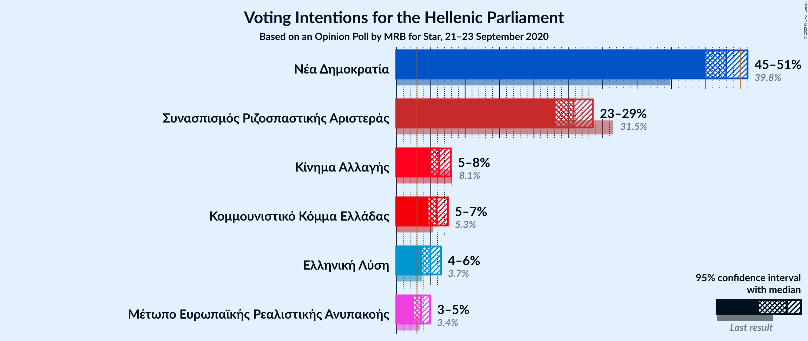

### Confidence Intervals

| Party | Last Result | Poll Result | 80% Confidence Interval | 90% Confidence Interval | 95% Confidence Interval | 99% Confidence Interval |
|:-----:|:-----------:|:-----------:|:-----------------------:|:-----------------------:|:-----------------------:|:-----------------------:|
| Νέα Δημοκρατία | 39.8% | 48.0% | 46.0–50.0% |45.4–50.6% |44.9–51.1% |43.9–52.0% |
| Συνασπισμός Ριζοσπαστικής Αριστεράς | 31.5% | 25.8% | 24.1–27.6% |23.6–28.1% |23.2–28.6% |22.4–29.4% |
| Κίνημα Αλλαγής | 8.1% | 6.2% | 5.4–7.3% |5.1–7.7% |4.9–7.9% |4.5–8.5% |
| Κομμουνιστικό Κόμμα Ελλάδας | 5.3% | 5.8% | 5.0–6.9% |4.8–7.2% |4.6–7.5% |4.2–8.0% |
| Ελληνική Λύση | 3.7% | 5.0% | 4.2–5.9% |4.0–6.2% |3.8–6.5% |3.4–7.0% |
| Μέτωπο Ευρωπαϊκής Ρεαλιστικής Ανυπακοής | 3.4% | 3.6% | 2.9–4.4% |2.7–4.7% |2.6–4.9% |2.3–5.4% |

*Note:* The poll result column reflects the actual value used in the calculations. Published results may vary slightly, and in addition be rounded to fewer digits.

## Seats

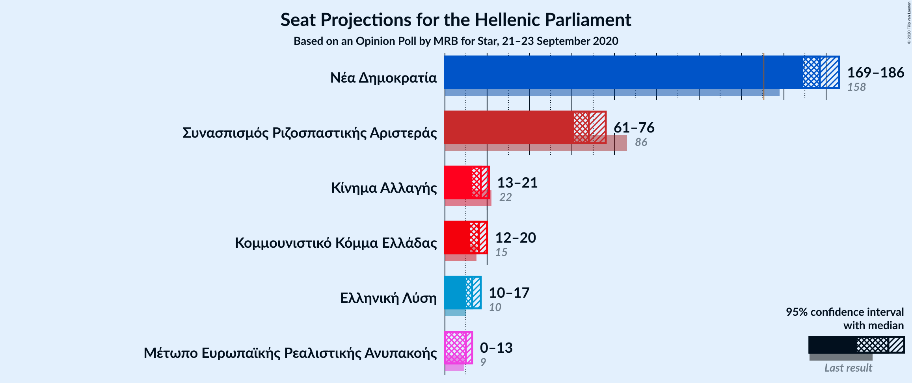

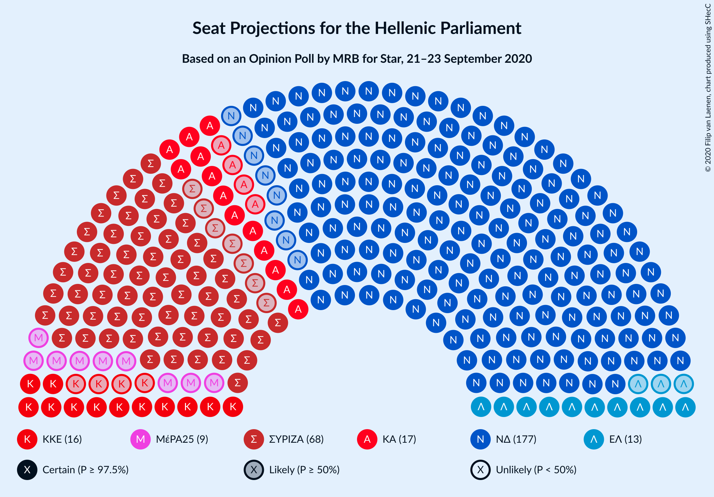

### Confidence Intervals

| Party | Last Result | Median | 80% Confidence Interval | 90% Confidence Interval | 95% Confidence Interval | 99% Confidence Interval |
|:-----:|:-----------:|:------:|:-----------------------:|:-----------------------:|:-----------------------:|:-----------------------:|
| <a href="#νέα-δημοκρατία">Νέα Δημοκρατία</a> | 158 | 177 | 172–183 |170–185 |169–186 |166–189 |
| <a href="#συνασπισμός-ριζοσπαστικής-αριστεράς">Συνασπισμός Ριζοσπαστικής Αριστεράς</a> | 86 | 68 | 64–73 |62–75 |61–76 |59–78 |
| <a href="#κίνημα-αλλαγής">Κίνημα Αλλαγής</a> | 22 | 17 | 14–19 |14–20 |13–21 |12–22 |
| <a href="#κομμουνιστικό-κόμμα-ελλάδας">Κομμουνιστικό Κόμμα Ελλάδας</a> | 15 | 16 | 13–18 |13–19 |12–20 |11–21 |
| <a href="#ελληνική-λύση">Ελληνική Λύση</a> | 10 | 13 | 11–16 |10–17 |10–17 |9–18 |
| <a href="#μέτωπο-ευρωπαϊκής-ρεαλιστικής-ανυπακοής">Μέτωπο Ευρωπαϊκής Ρεαλιστικής Ανυπακοής</a> | 9 | 10 | 0–12 |0–12 |0–13 |0–14 |

### Νέα Δημοκρατία

*For a full overview of the results for this party, see the [Νέα Δημοκρατία](party-νέαδημοκρατία.html) page.*

| Number of Seats | Probability | Accumulated | Special Marks |
|:---------------:|:-----------:|:-----------:|:-------------:|
| 158 | 0% | 100% | Last Result |
| 159 | 0% | 100% |  |
| 160 | 0% | 100% |  |
| 161 | 0% | 100% |  |
| 162 | 0% | 100% |  |
| 163 | 0% | 100% |  |
| 164 | 0.1% | 99.9% |  |
| 165 | 0.2% | 99.9% |  |
| 166 | 0.3% | 99.7% |  |
| 167 | 0.6% | 99.4% |  |
| 168 | 1.0% | 98.8% |  |
| 169 | 2% | 98% |  |
| 170 | 2% | 96% |  |
| 171 | 4% | 94% |  |
| 172 | 5% | 90% |  |
| 173 | 6% | 86% |  |
| 174 | 8% | 79% |  |
| 175 | 9% | 72% |  |
| 176 | 9% | 63% |  |
| 177 | 9% | 54% | Median |
| 178 | 9% | 45% |  |
| 179 | 8% | 36% |  |
| 180 | 7% | 28% |  |
| 181 | 6% | 21% |  |
| 182 | 5% | 16% |  |
| 183 | 3% | 11% |  |
| 184 | 3% | 8% |  |
| 185 | 2% | 5% |  |
| 186 | 1.3% | 4% |  |
| 187 | 1.0% | 2% |  |
| 188 | 0.5% | 1.3% |  |
| 189 | 0.3% | 0.8% |  |
| 190 | 0.2% | 0.5% |  |
| 191 | 0.1% | 0.2% |  |
| 192 | 0.1% | 0.1% |  |
| 193 | 0% | 0.1% |  |
| 194 | 0% | 0% |  |

### Συνασπισμός Ριζοσπαστικής Αριστεράς

*For a full overview of the results for this party, see the [Συνασπισμός Ριζοσπαστικής Αριστεράς](party-συνασπισμόςριζοσπαστικήςαριστεράς.html) page.*

| Number of Seats | Probability | Accumulated | Special Marks |
|:---------------:|:-----------:|:-----------:|:-------------:|
| 57 | 0.1% | 100% |  |
| 58 | 0.2% | 99.9% |  |
| 59 | 0.4% | 99.7% |  |
| 60 | 0.9% | 99.4% |  |
| 61 | 2% | 98.5% |  |
| 62 | 3% | 97% |  |
| 63 | 4% | 94% |  |
| 64 | 5% | 90% |  |
| 65 | 6% | 86% |  |
| 66 | 8% | 79% |  |
| 67 | 10% | 71% |  |
| 68 | 12% | 61% | Median |
| 69 | 12% | 48% |  |
| 70 | 10% | 36% |  |
| 71 | 7% | 26% |  |
| 72 | 6% | 19% |  |
| 73 | 4% | 14% |  |
| 74 | 3% | 9% |  |
| 75 | 2% | 6% |  |
| 76 | 2% | 4% |  |
| 77 | 0.9% | 2% |  |
| 78 | 0.5% | 0.9% |  |
| 79 | 0.2% | 0.5% |  |
| 80 | 0.1% | 0.2% |  |
| 81 | 0.1% | 0.1% |  |
| 82 | 0% | 0% |  |
| 83 | 0% | 0% |  |
| 84 | 0% | 0% |  |
| 85 | 0% | 0% |  |
| 86 | 0% | 0% | Last Result |

### Κίνημα Αλλαγής

*For a full overview of the results for this party, see the [Κίνημα Αλλαγής](party-κίνημααλλαγής.html) page.*

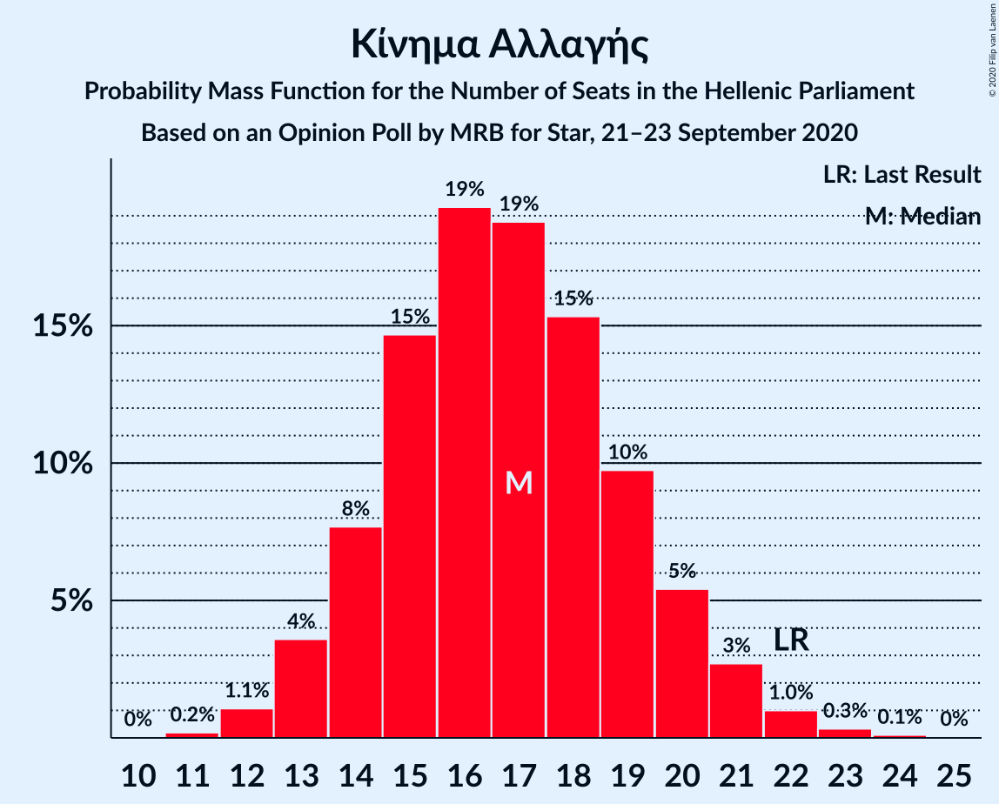

| Number of Seats | Probability | Accumulated | Special Marks |
|:---------------:|:-----------:|:-----------:|:-------------:|
| 11 | 0.2% | 100% |  |
| 12 | 1.1% | 99.8% |  |
| 13 | 4% | 98.7% |  |
| 14 | 8% | 95% |  |
| 15 | 15% | 87% |  |
| 16 | 19% | 73% |  |
| 17 | 19% | 53% | Median |
| 18 | 15% | 35% |  |
| 19 | 10% | 19% |  |
| 20 | 5% | 10% |  |
| 21 | 3% | 4% |  |
| 22 | 1.0% | 1.5% | Last Result |
| 23 | 0.3% | 0.5% |  |
| 24 | 0.1% | 0.1% |  |
| 25 | 0% | 0% |  |

### Κομμουνιστικό Κόμμα Ελλάδας

*For a full overview of the results for this party, see the [Κομμουνιστικό Κόμμα Ελλάδας](party-κομμουνιστικόκόμμαελλάδας.html) page.*

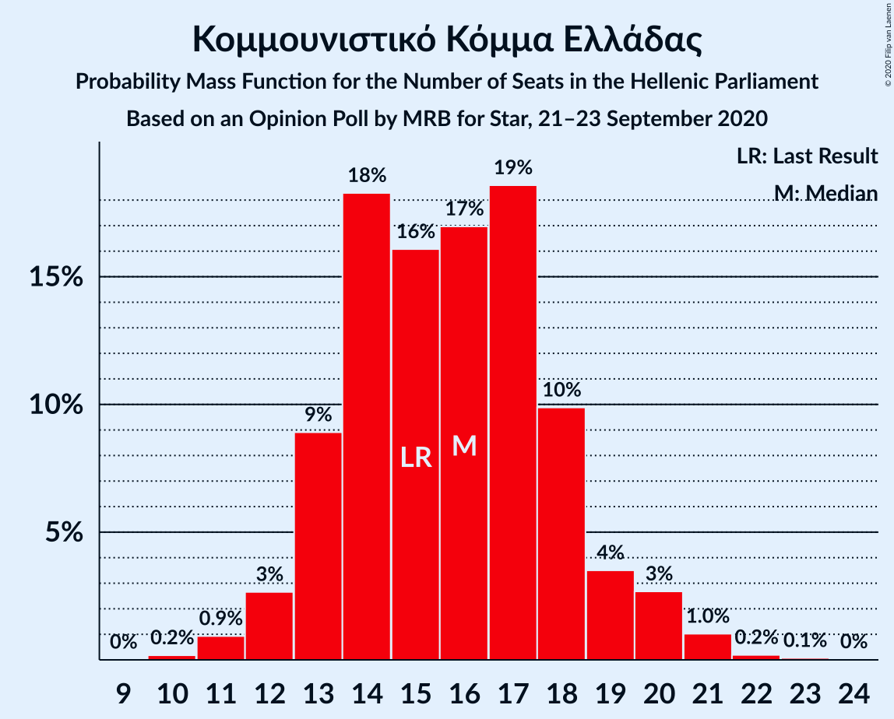

| Number of Seats | Probability | Accumulated | Special Marks |
|:---------------:|:-----------:|:-----------:|:-------------:|
| 10 | 0.2% | 100% |  |
| 11 | 0.9% | 99.8% |  |
| 12 | 3% | 98.9% |  |
| 13 | 9% | 96% |  |
| 14 | 18% | 87% |  |
| 15 | 16% | 69% | Last Result |
| 16 | 17% | 53% | Median |
| 17 | 19% | 36% |  |
| 18 | 10% | 17% |  |
| 19 | 4% | 8% |  |
| 20 | 3% | 4% |  |
| 21 | 1.0% | 1.3% |  |
| 22 | 0.2% | 0.3% |  |
| 23 | 0.1% | 0.1% |  |
| 24 | 0% | 0% |  |

### Ελληνική Λύση

*For a full overview of the results for this party, see the [Ελληνική Λύση](party-ελληνικήλύση.html) page.*

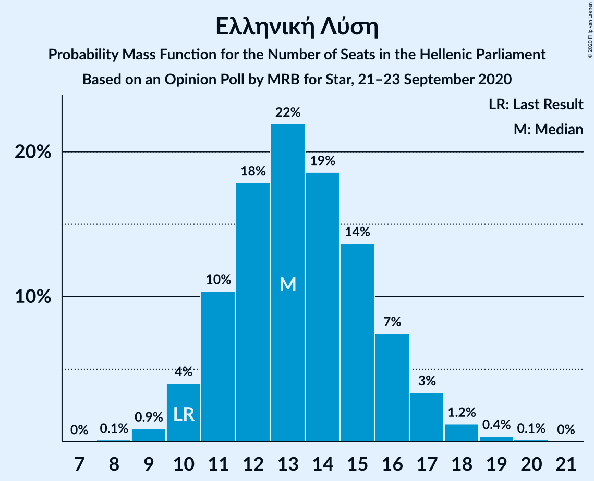

| Number of Seats | Probability | Accumulated | Special Marks |
|:---------------:|:-----------:|:-----------:|:-------------:|
| 8 | 0.1% | 100% |  |
| 9 | 0.9% | 99.9% |  |
| 10 | 4% | 99.0% | Last Result |
| 11 | 10% | 95% |  |
| 12 | 18% | 85% |  |
| 13 | 22% | 67% | Median |
| 14 | 19% | 45% |  |
| 15 | 14% | 26% |  |
| 16 | 7% | 13% |  |
| 17 | 3% | 5% |  |
| 18 | 1.2% | 2% |  |
| 19 | 0.4% | 0.5% |  |
| 20 | 0.1% | 0.1% |  |
| 21 | 0% | 0% |  |

### Μέτωπο Ευρωπαϊκής Ρεαλιστικής Ανυπακοής

*For a full overview of the results for this party, see the [Μέτωπο Ευρωπαϊκής Ρεαλιστικής Ανυπακοής](party-μέτωποευρωπαϊκήςρεαλιστικήςανυπακοής.html) page.*

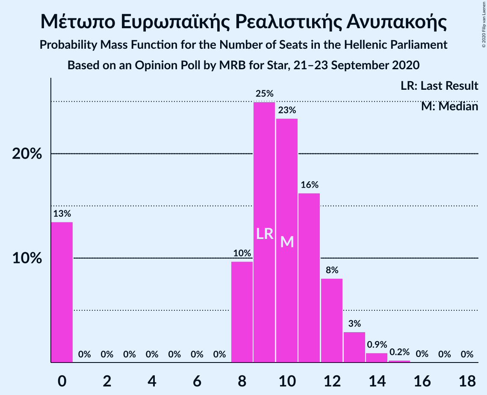

| Number of Seats | Probability | Accumulated | Special Marks |
|:---------------:|:-----------:|:-----------:|:-------------:|
| 0 | 13% | 100% |  |
| 1 | 0% | 87% |  |
| 2 | 0% | 87% |  |
| 3 | 0% | 87% |  |
| 4 | 0% | 87% |  |
| 5 | 0% | 87% |  |
| 6 | 0% | 87% |  |
| 7 | 0% | 87% |  |
| 8 | 10% | 87% |  |
| 9 | 25% | 77% | Last Result |
| 10 | 23% | 52% | Median |
| 11 | 16% | 28% |  |
| 12 | 8% | 12% |  |
| 13 | 3% | 4% |  |
| 14 | 0.9% | 1.2% |  |
| 15 | 0.2% | 0.3% |  |
| 16 | 0% | 0.1% |  |
| 17 | 0% | 0% |  |

## Coalitions

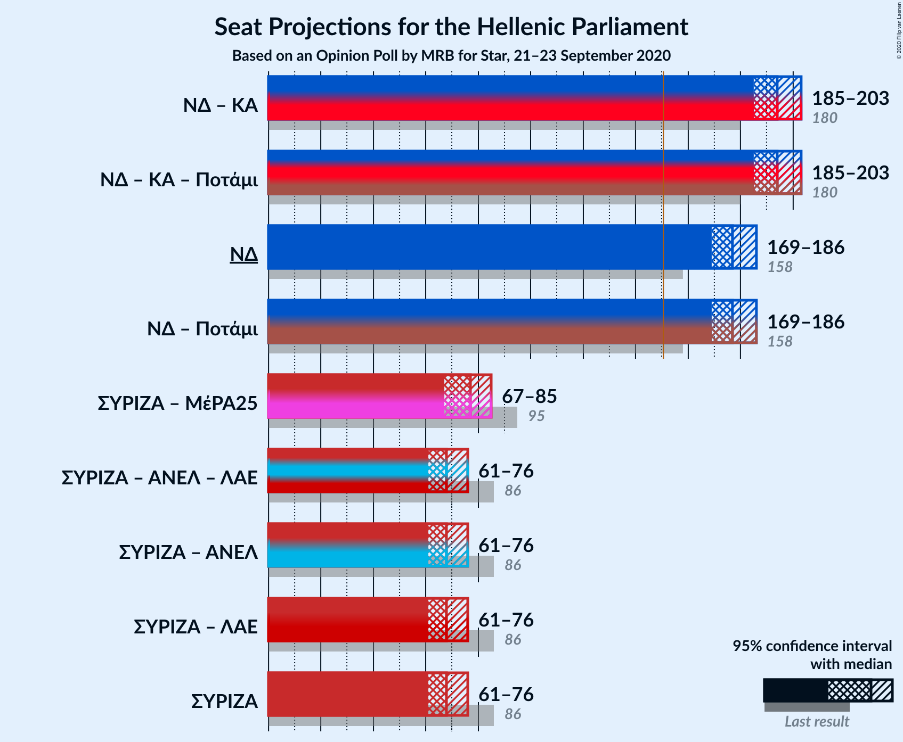

### Confidence Intervals

| Coalition | Last Result | Median | Majority? | 80% Confidence Interval | 90% Confidence Interval | 95% Confidence Interval | 99% Confidence Interval |
|:---------:|:-----------:|:------:|:---------:|:-----------------------:|:-----------------------:|:-----------------------:|:-----------------------:|
| Νέα Δημοκρατία – Κίνημα Αλλαγής | 180 | 194 | 100% | 188–200 | 187–202 | 185–203 | 183–206 |
| Νέα Δημοκρατία | 158 | 177 | 100% | 172–183 | 170–185 | 169–186 | 166–189 |
| Συνασπισμός Ριζοσπαστικής Αριστεράς – Μέτωπο Ευρωπαϊκής Ρεαλιστικής Ανυπακοής | 95 | 77 | 0% | 71–83 | 69–84 | 67–85 | 64–88 |
| Συνασπισμός Ριζοσπαστικής Αριστεράς | 86 | 68 | 0% | 64–73 | 62–75 | 61–76 | 59–78 |

### Νέα Δημοκρατία – Κίνημα Αλλαγής

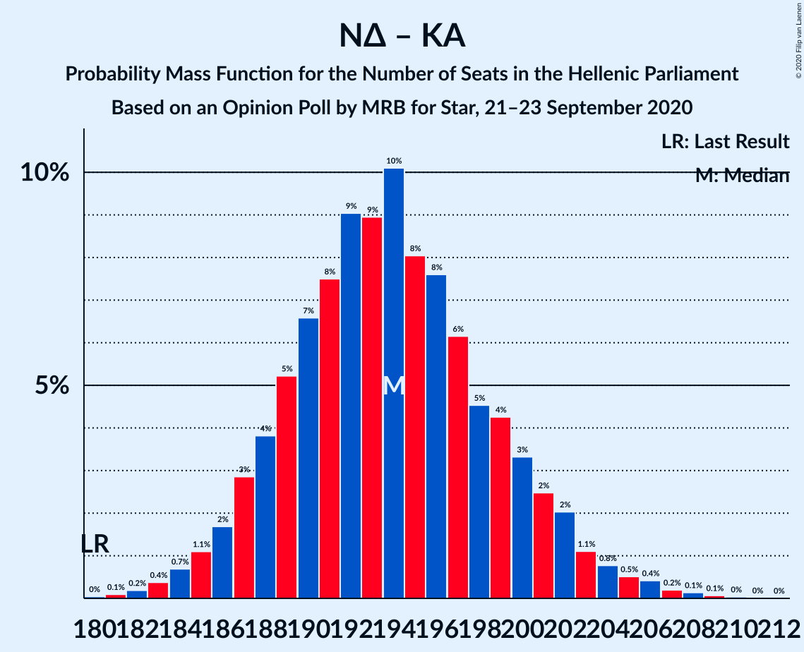

| Number of Seats | Probability | Accumulated | Special Marks |
|:---------------:|:-----------:|:-----------:|:-------------:|
| 180 | 0% | 100% | Last Result |
| 181 | 0.1% | 99.9% |  |
| 182 | 0.2% | 99.8% |  |
| 183 | 0.4% | 99.6% |  |
| 184 | 0.7% | 99.3% |  |
| 185 | 1.1% | 98.6% |  |
| 186 | 2% | 97% |  |
| 187 | 3% | 96% |  |
| 188 | 4% | 93% |  |
| 189 | 5% | 89% |  |
| 190 | 7% | 84% |  |
| 191 | 8% | 77% |  |
| 192 | 9% | 70% |  |
| 193 | 9% | 61% |  |
| 194 | 10% | 52% | Median |
| 195 | 8% | 42% |  |
| 196 | 8% | 34% |  |
| 197 | 6% | 26% |  |
| 198 | 5% | 20% |  |
| 199 | 4% | 15% |  |
| 200 | 3% | 11% |  |
| 201 | 2% | 8% |  |
| 202 | 2% | 5% |  |
| 203 | 1.1% | 3% |  |
| 204 | 0.8% | 2% |  |
| 205 | 0.5% | 1.4% |  |
| 206 | 0.4% | 0.9% |  |
| 207 | 0.2% | 0.5% |  |
| 208 | 0.1% | 0.3% |  |
| 209 | 0.1% | 0.1% |  |
| 210 | 0% | 0.1% |  |
| 211 | 0% | 0% |  |

### Νέα Δημοκρατία

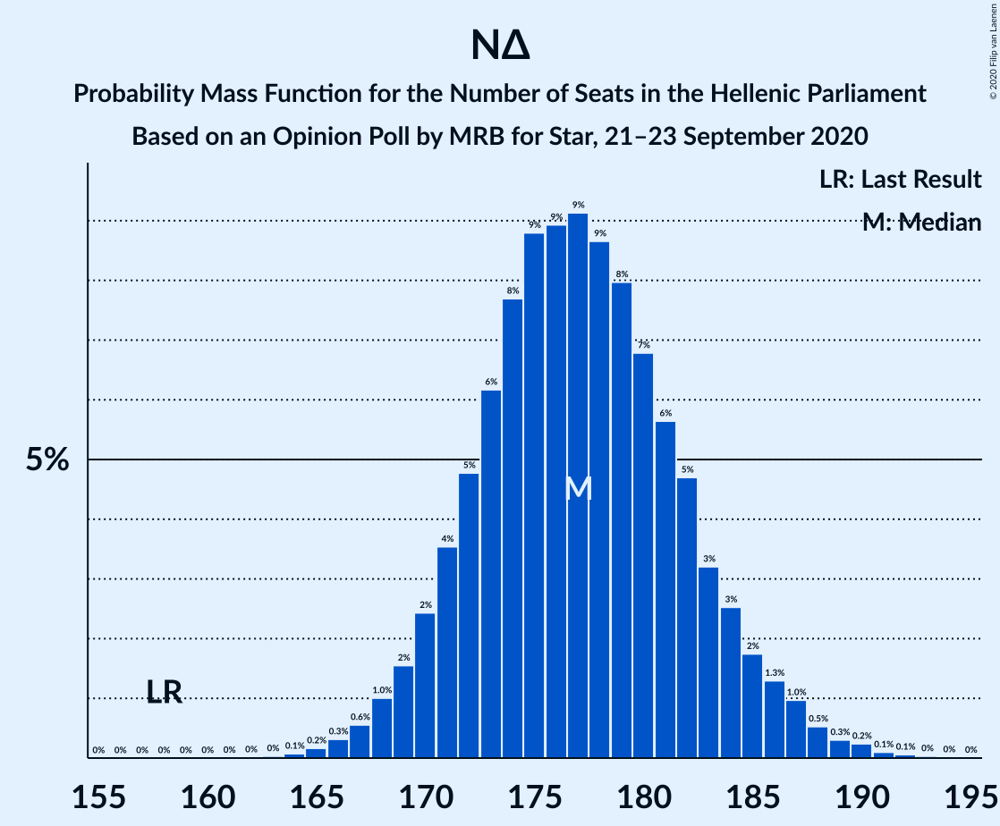

| Number of Seats | Probability | Accumulated | Special Marks |
|:---------------:|:-----------:|:-----------:|:-------------:|
| 158 | 0% | 100% | Last Result |
| 159 | 0% | 100% |  |
| 160 | 0% | 100% |  |
| 161 | 0% | 100% |  |
| 162 | 0% | 100% |  |
| 163 | 0% | 100% |  |
| 164 | 0.1% | 99.9% |  |
| 165 | 0.2% | 99.9% |  |
| 166 | 0.3% | 99.7% |  |
| 167 | 0.6% | 99.4% |  |
| 168 | 1.0% | 98.8% |  |
| 169 | 2% | 98% |  |
| 170 | 2% | 96% |  |
| 171 | 4% | 94% |  |
| 172 | 5% | 90% |  |
| 173 | 6% | 86% |  |
| 174 | 8% | 79% |  |
| 175 | 9% | 72% |  |
| 176 | 9% | 63% |  |
| 177 | 9% | 54% | Median |
| 178 | 9% | 45% |  |
| 179 | 8% | 36% |  |
| 180 | 7% | 28% |  |
| 181 | 6% | 21% |  |
| 182 | 5% | 16% |  |
| 183 | 3% | 11% |  |
| 184 | 3% | 8% |  |
| 185 | 2% | 5% |  |
| 186 | 1.3% | 4% |  |
| 187 | 1.0% | 2% |  |
| 188 | 0.5% | 1.3% |  |
| 189 | 0.3% | 0.8% |  |
| 190 | 0.2% | 0.5% |  |
| 191 | 0.1% | 0.2% |  |
| 192 | 0.1% | 0.1% |  |
| 193 | 0% | 0.1% |  |
| 194 | 0% | 0% |  |

### Συνασπισμός Ριζοσπαστικής Αριστεράς – Μέτωπο Ευρωπαϊκής Ρεαλιστικής Ανυπακοής

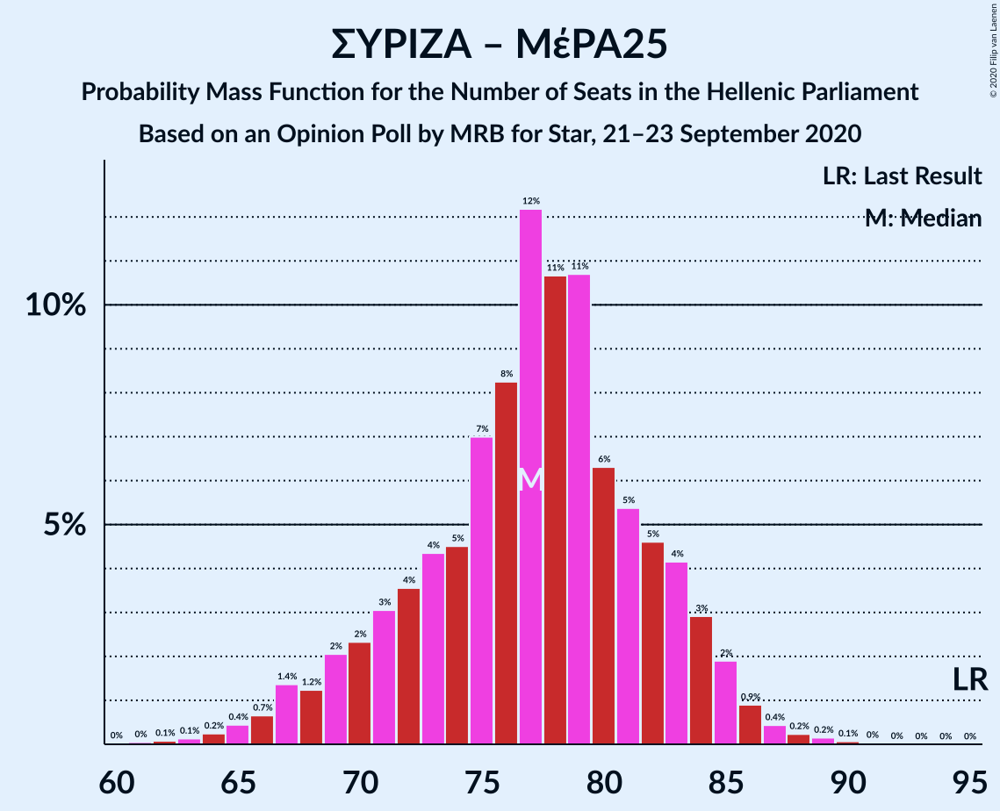

| Number of Seats | Probability | Accumulated | Special Marks |
|:---------------:|:-----------:|:-----------:|:-------------:|
| 61 | 0% | 100% |  |
| 62 | 0.1% | 99.9% |  |
| 63 | 0.1% | 99.8% |  |
| 64 | 0.2% | 99.7% |  |
| 65 | 0.4% | 99.5% |  |
| 66 | 0.7% | 99.0% |  |
| 67 | 1.4% | 98% |  |
| 68 | 1.2% | 97% |  |
| 69 | 2% | 96% |  |
| 70 | 2% | 94% |  |
| 71 | 3% | 91% |  |
| 72 | 4% | 88% |  |
| 73 | 4% | 85% |  |
| 74 | 5% | 80% |  |
| 75 | 7% | 76% |  |
| 76 | 8% | 69% |  |
| 77 | 12% | 61% |  |
| 78 | 11% | 48% | Median |
| 79 | 11% | 38% |  |
| 80 | 6% | 27% |  |
| 81 | 5% | 21% |  |
| 82 | 5% | 15% |  |
| 83 | 4% | 11% |  |
| 84 | 3% | 7% |  |
| 85 | 2% | 4% |  |
| 86 | 0.9% | 2% |  |
| 87 | 0.4% | 0.9% |  |
| 88 | 0.2% | 0.5% |  |
| 89 | 0.2% | 0.3% |  |
| 90 | 0.1% | 0.1% |  |
| 91 | 0% | 0.1% |  |
| 92 | 0% | 0% |  |
| 93 | 0% | 0% |  |
| 94 | 0% | 0% |  |
| 95 | 0% | 0% | Last Result |

### Συνασπισμός Ριζοσπαστικής Αριστεράς

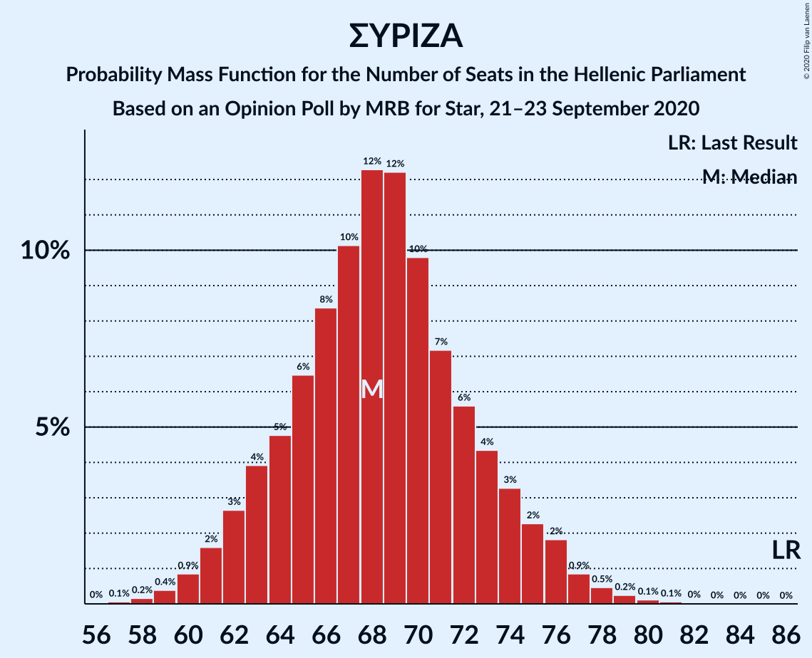

| Number of Seats | Probability | Accumulated | Special Marks |
|:---------------:|:-----------:|:-----------:|:-------------:|
| 57 | 0.1% | 100% |  |
| 58 | 0.2% | 99.9% |  |
| 59 | 0.4% | 99.7% |  |
| 60 | 0.9% | 99.4% |  |
| 61 | 2% | 98.5% |  |
| 62 | 3% | 97% |  |
| 63 | 4% | 94% |  |
| 64 | 5% | 90% |  |
| 65 | 6% | 86% |  |
| 66 | 8% | 79% |  |
| 67 | 10% | 71% |  |
| 68 | 12% | 61% | Median |
| 69 | 12% | 48% |  |
| 70 | 10% | 36% |  |
| 71 | 7% | 26% |  |
| 72 | 6% | 19% |  |
| 73 | 4% | 14% |  |
| 74 | 3% | 9% |  |
| 75 | 2% | 6% |  |
| 76 | 2% | 4% |  |
| 77 | 0.9% | 2% |  |
| 78 | 0.5% | 0.9% |  |
| 79 | 0.2% | 0.5% |  |
| 80 | 0.1% | 0.2% |  |
| 81 | 0.1% | 0.1% |  |
| 82 | 0% | 0% |  |
| 83 | 0% | 0% |  |
| 84 | 0% | 0% |  |
| 85 | 0% | 0% |  |
| 86 | 0% | 0% | Last Result |

## Technical Information

### Opinion Poll

+ **Polling firm:** MRB
+ **Commissioner(s):** Star
+ **Fieldwork period:** 21–23 September 2020

### Calculations

+ **Sample size:** 1009
+ **Simulations done:** 1,048,576
+ **Error estimate:** 0.78%

