# Opinion Poll by Metron Analysis for MEGA TV, 28–30 September 2020

<a href="#voting-intentions">Voting Intentions</a> | <a href="#seats">Seats</a> | <a href="#coalitions">Coalitions</a> | <a href="#technical-information">Technical Information</a>

## Voting Intentions

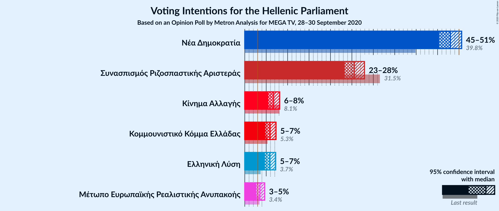

### Confidence Intervals

| Party | Last Result | Poll Result | 80% Confidence Interval | 90% Confidence Interval | 95% Confidence Interval | 99% Confidence Interval |
|:-----:|:-----------:|:-----------:|:-----------------------:|:-----------------------:|:-----------------------:|:-----------------------:|
| Νέα Δημοκρατία | 39.8% | 48.0% | 46.3–49.7% |45.8–50.2% |45.4–50.6% |44.5–51.4% |
| Συνασπισμός Ριζοσπαστικής Αριστεράς | 31.5% | 25.6% | 24.1–27.1% |23.7–27.6% |23.4–27.9% |22.7–28.7% |
| Κίνημα Αλλαγής | 8.1% | 6.7% | 5.9–7.7% |5.7–7.9% |5.5–8.2% |5.1–8.6% |
| Κομμουνιστικό Κόμμα Ελλάδας | 5.3% | 5.9% | 5.2–6.8% |5.0–7.1% |4.8–7.3% |4.5–7.7% |
| Ελληνική Λύση | 3.7% | 5.8% | 5.1–6.7% |4.9–7.0% |4.7–7.2% |4.4–7.7% |
| Μέτωπο Ευρωπαϊκής Ρεαλιστικής Ανυπακοής | 3.4% | 3.5% | 3.0–4.3% |2.8–4.5% |2.7–4.6% |2.4–5.0% |

*Note:* The poll result column reflects the actual value used in the calculations. Published results may vary slightly, and in addition be rounded to fewer digits.

## Seats

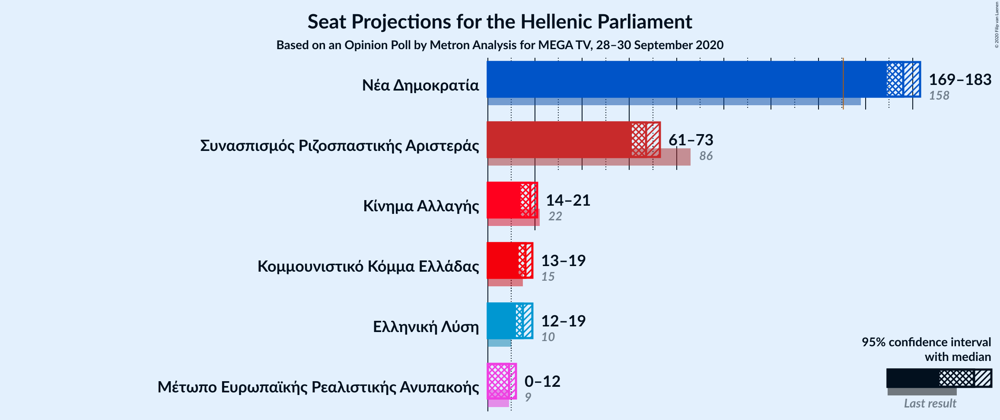

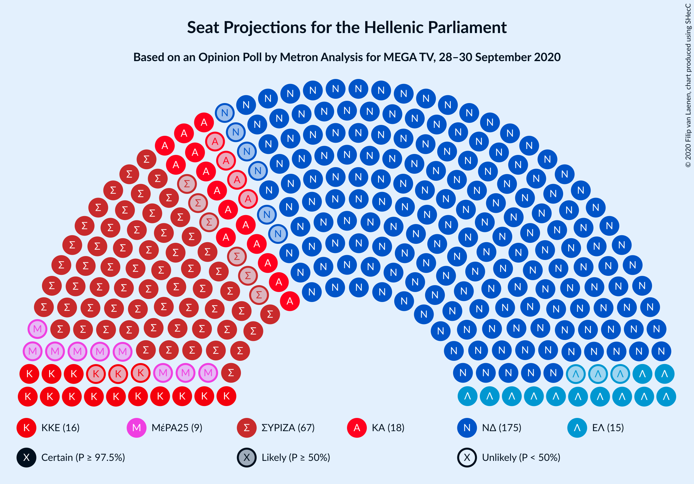

### Confidence Intervals

| Party | Last Result | Median | 80% Confidence Interval | 90% Confidence Interval | 95% Confidence Interval | 99% Confidence Interval |
|:-----:|:-----------:|:------:|:-----------------------:|:-----------------------:|:-----------------------:|:-----------------------:|
| <a href="#νέα-δημοκρατία">Νέα Δημοκρατία</a> | 158 | 176 | 171–181 |170–182 |169–183 |166–186 |
| <a href="#συνασπισμός-ριζοσπαστικής-αριστεράς">Συνασπισμός Ριζοσπαστικής Αριστεράς</a> | 86 | 67 | 63–71 |62–72 |61–73 |59–76 |
| <a href="#κίνημα-αλλαγής">Κίνημα Αλλαγής</a> | 22 | 18 | 15–20 |15–21 |14–21 |13–23 |
| <a href="#κομμουνιστικό-κόμμα-ελλάδας">Κομμουνιστικό Κόμμα Ελλάδας</a> | 15 | 16 | 14–18 |13–18 |13–19 |12–20 |
| <a href="#ελληνική-λύση">Ελληνική Λύση</a> | 10 | 15 | 13–18 |13–18 |12–19 |11–20 |
| <a href="#μέτωπο-ευρωπαϊκής-ρεαλιστικής-ανυπακοής">Μέτωπο Ευρωπαϊκής Ρεαλιστικής Ανυπακοής</a> | 9 | 9 | 0–11 |0–12 |0–12 |0–13 |

### Νέα Δημοκρατία

*For a full overview of the results for this party, see the [Νέα Δημοκρατία](party-νέαδημοκρατία.html) page.*

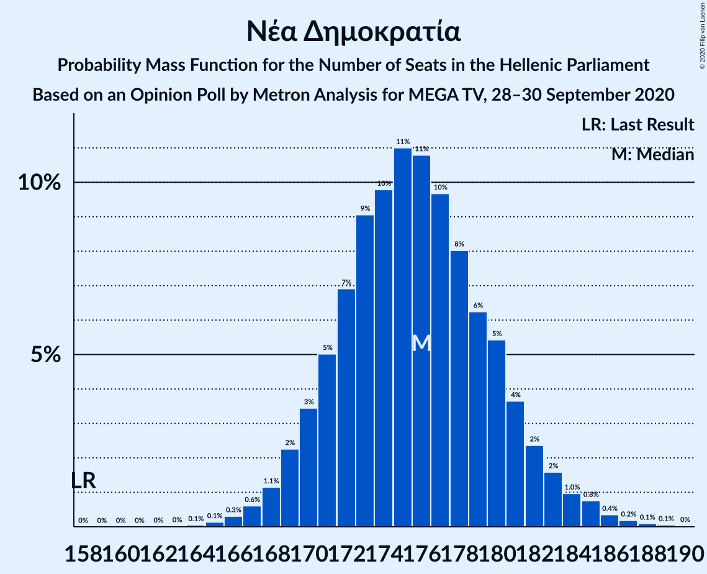

| Number of Seats | Probability | Accumulated | Special Marks |
|:---------------:|:-----------:|:-----------:|:-------------:|
| 158 | 0% | 100% | Last Result |
| 159 | 0% | 100% |  |
| 160 | 0% | 100% |  |
| 161 | 0% | 100% |  |
| 162 | 0% | 100% |  |
| 163 | 0% | 100% |  |
| 164 | 0.1% | 100% |  |
| 165 | 0.1% | 99.9% |  |
| 166 | 0.3% | 99.8% |  |
| 167 | 0.6% | 99.5% |  |
| 168 | 1.1% | 98.9% |  |
| 169 | 2% | 98% |  |
| 170 | 3% | 95% |  |
| 171 | 5% | 92% |  |
| 172 | 7% | 87% |  |
| 173 | 9% | 80% |  |
| 174 | 10% | 71% |  |
| 175 | 11% | 61% |  |
| 176 | 11% | 50% | Median |
| 177 | 10% | 39% |  |
| 178 | 8% | 30% |  |
| 179 | 6% | 22% |  |
| 180 | 5% | 15% |  |
| 181 | 4% | 10% |  |
| 182 | 2% | 6% |  |
| 183 | 2% | 4% |  |
| 184 | 1.0% | 2% |  |
| 185 | 0.8% | 1.5% |  |
| 186 | 0.4% | 0.7% |  |
| 187 | 0.2% | 0.4% |  |
| 188 | 0.1% | 0.2% |  |
| 189 | 0.1% | 0.1% |  |
| 190 | 0% | 0% |  |

### Συνασπισμός Ριζοσπαστικής Αριστεράς

*For a full overview of the results for this party, see the [Συνασπισμός Ριζοσπαστικής Αριστεράς](party-συνασπισμόςριζοσπαστικήςαριστεράς.html) page.*

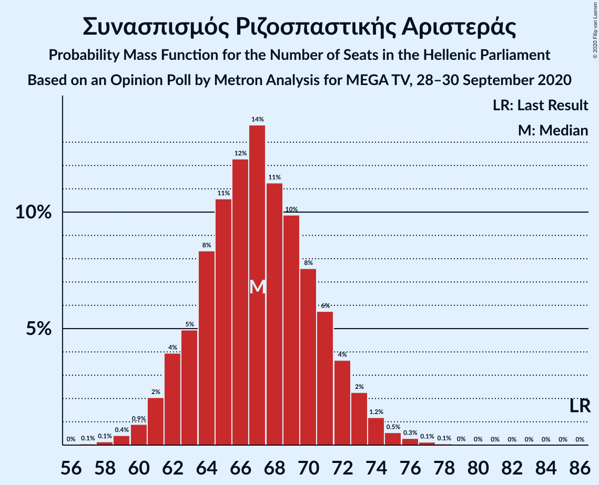

| Number of Seats | Probability | Accumulated | Special Marks |
|:---------------:|:-----------:|:-----------:|:-------------:|
| 57 | 0.1% | 100% |  |
| 58 | 0.1% | 99.9% |  |
| 59 | 0.4% | 99.8% |  |
| 60 | 0.9% | 99.4% |  |
| 61 | 2% | 98% |  |
| 62 | 4% | 96% |  |
| 63 | 5% | 92% |  |
| 64 | 8% | 88% |  |
| 65 | 11% | 79% |  |
| 66 | 12% | 69% |  |
| 67 | 14% | 56% | Median |
| 68 | 11% | 43% |  |
| 69 | 10% | 31% |  |
| 70 | 8% | 21% |  |
| 71 | 6% | 14% |  |
| 72 | 4% | 8% |  |
| 73 | 2% | 4% |  |
| 74 | 1.2% | 2% |  |
| 75 | 0.5% | 1.1% |  |
| 76 | 0.3% | 0.5% |  |
| 77 | 0.1% | 0.2% |  |
| 78 | 0.1% | 0.1% |  |
| 79 | 0% | 0% |  |
| 80 | 0% | 0% |  |
| 81 | 0% | 0% |  |
| 82 | 0% | 0% |  |
| 83 | 0% | 0% |  |
| 84 | 0% | 0% |  |
| 85 | 0% | 0% |  |
| 86 | 0% | 0% | Last Result |

### Κίνημα Αλλαγής

*For a full overview of the results for this party, see the [Κίνημα Αλλαγής](party-κίνημααλλαγής.html) page.*

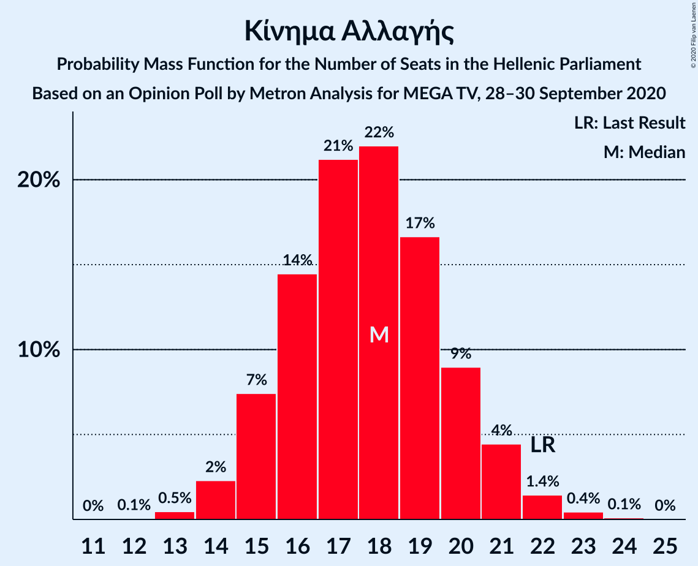

| Number of Seats | Probability | Accumulated | Special Marks |
|:---------------:|:-----------:|:-----------:|:-------------:|
| 12 | 0.1% | 100% |  |
| 13 | 0.5% | 99.9% |  |
| 14 | 2% | 99.5% |  |
| 15 | 7% | 97% |  |
| 16 | 14% | 90% |  |
| 17 | 21% | 75% |  |
| 18 | 22% | 54% | Median |
| 19 | 17% | 32% |  |
| 20 | 9% | 15% |  |
| 21 | 4% | 6% |  |
| 22 | 1.4% | 2% | Last Result |
| 23 | 0.4% | 0.6% |  |
| 24 | 0.1% | 0.1% |  |
| 25 | 0% | 0% |  |

### Κομμουνιστικό Κόμμα Ελλάδας

*For a full overview of the results for this party, see the [Κομμουνιστικό Κόμμα Ελλάδας](party-κομμουνιστικόκόμμαελλάδας.html) page.*

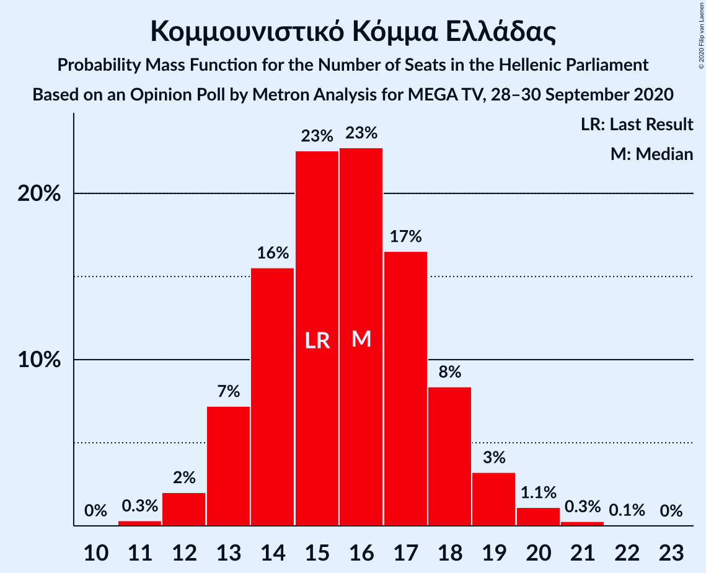

| Number of Seats | Probability | Accumulated | Special Marks |
|:---------------:|:-----------:|:-----------:|:-------------:|
| 11 | 0.3% | 100% |  |
| 12 | 2% | 99.7% |  |
| 13 | 7% | 98% |  |
| 14 | 16% | 90% |  |
| 15 | 23% | 75% | Last Result |
| 16 | 23% | 52% | Median |
| 17 | 17% | 30% |  |
| 18 | 8% | 13% |  |
| 19 | 3% | 5% |  |
| 20 | 1.1% | 1.5% |  |
| 21 | 0.3% | 0.3% |  |
| 22 | 0.1% | 0.1% |  |
| 23 | 0% | 0% |  |

### Ελληνική Λύση

*For a full overview of the results for this party, see the [Ελληνική Λύση](party-ελληνικήλύση.html) page.*

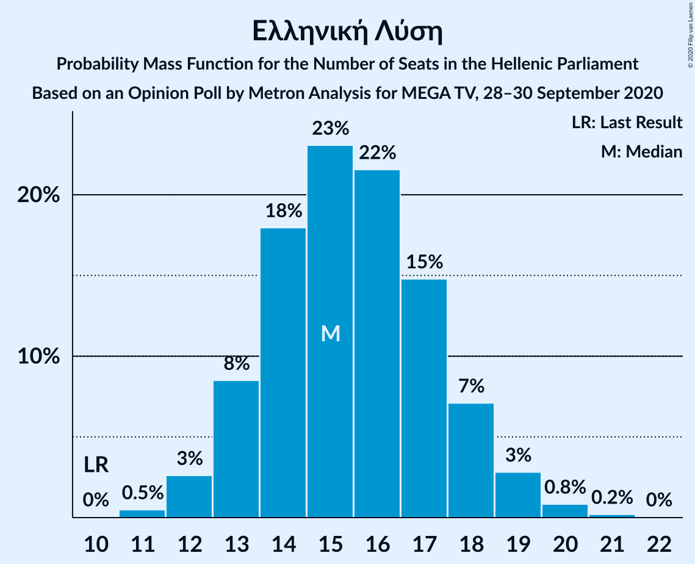

| Number of Seats | Probability | Accumulated | Special Marks |
|:---------------:|:-----------:|:-----------:|:-------------:|
| 10 | 0% | 100% | Last Result |
| 11 | 0.5% | 100% |  |
| 12 | 3% | 99.5% |  |
| 13 | 8% | 97% |  |
| 14 | 18% | 88% |  |
| 15 | 23% | 70% | Median |
| 16 | 22% | 47% |  |
| 17 | 15% | 26% |  |
| 18 | 7% | 11% |  |
| 19 | 3% | 4% |  |
| 20 | 0.8% | 1.1% |  |
| 21 | 0.2% | 0.2% |  |
| 22 | 0% | 0% |  |

### Μέτωπο Ευρωπαϊκής Ρεαλιστικής Ανυπακοής

*For a full overview of the results for this party, see the [Μέτωπο Ευρωπαϊκής Ρεαλιστικής Ανυπακοής](party-μέτωποευρωπαϊκήςρεαλιστικήςανυπακοής.html) page.*

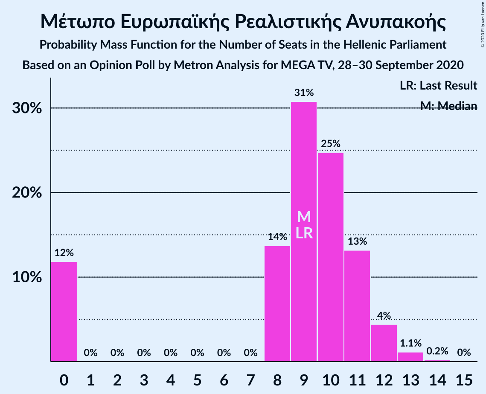

| Number of Seats | Probability | Accumulated | Special Marks |
|:---------------:|:-----------:|:-----------:|:-------------:|
| 0 | 12% | 100% |  |
| 1 | 0% | 88% |  |
| 2 | 0% | 88% |  |
| 3 | 0% | 88% |  |
| 4 | 0% | 88% |  |
| 5 | 0% | 88% |  |
| 6 | 0% | 88% |  |
| 7 | 0% | 88% |  |
| 8 | 14% | 88% |  |
| 9 | 31% | 74% | Last Result, Median |
| 10 | 25% | 44% |  |
| 11 | 13% | 19% |  |
| 12 | 4% | 6% |  |
| 13 | 1.1% | 1.4% |  |
| 14 | 0.2% | 0.2% |  |
| 15 | 0% | 0% |  |

## Coalitions

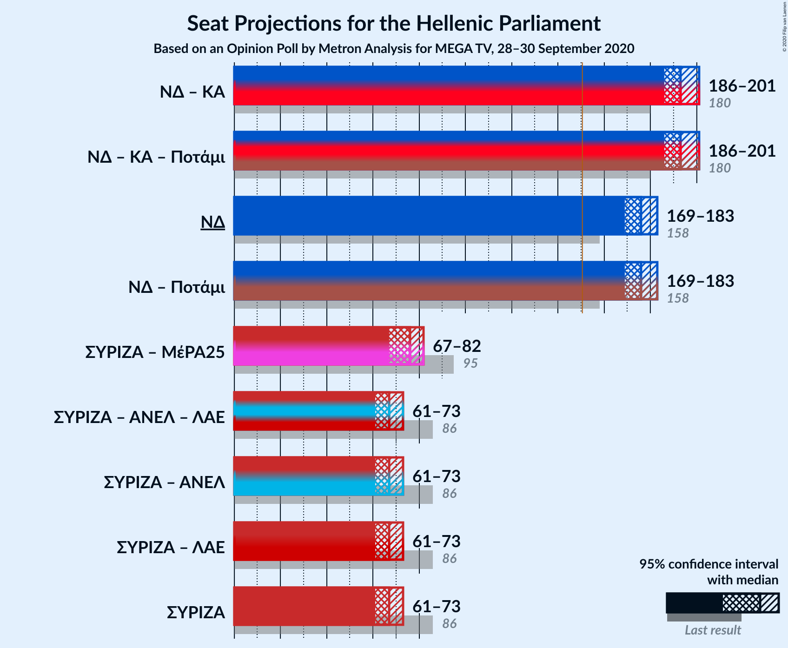

### Confidence Intervals

| Coalition | Last Result | Median | Majority? | 80% Confidence Interval | 90% Confidence Interval | 95% Confidence Interval | 99% Confidence Interval |
|:---------:|:-----------:|:------:|:---------:|:-----------------------:|:-----------------------:|:-----------------------:|:-----------------------:|
| Νέα Δημοκρατία – Κίνημα Αλλαγής | 180 | 193 | 100% | 189–198 | 187–200 | 186–201 | 184–204 |
| Νέα Δημοκρατία | 158 | 176 | 100% | 171–181 | 170–182 | 169–183 | 166–186 |
| Συνασπισμός Ριζοσπαστικής Αριστεράς – Μέτωπο Ευρωπαϊκής Ρεαλιστικής Ανυπακοής | 95 | 76 | 0% | 71–80 | 69–81 | 67–82 | 64–84 |
| Συνασπισμός Ριζοσπαστικής Αριστεράς | 86 | 67 | 0% | 63–71 | 62–72 | 61–73 | 59–76 |

### Νέα Δημοκρατία – Κίνημα Αλλαγής

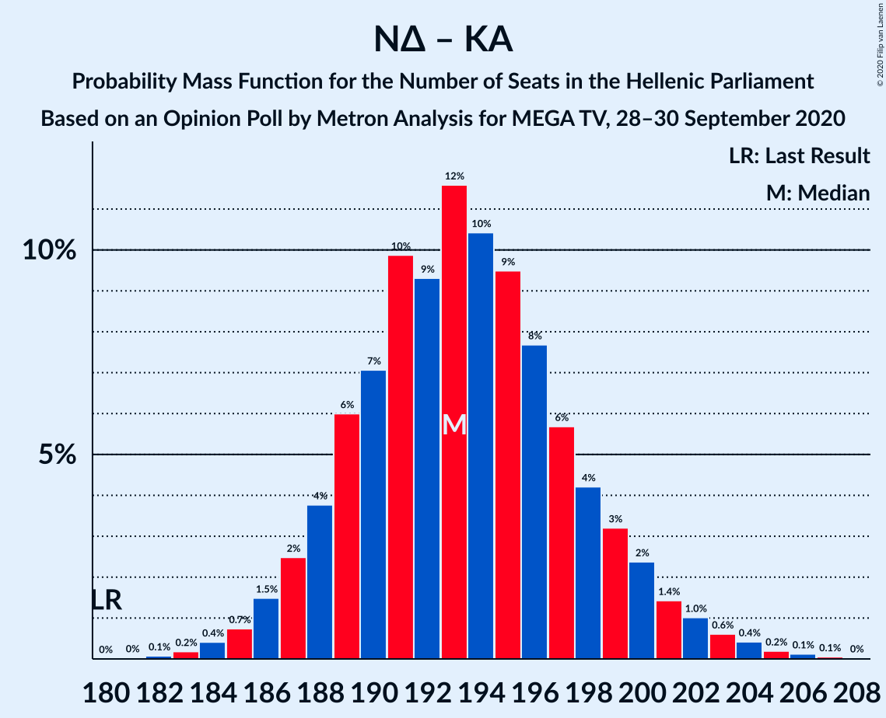

| Number of Seats | Probability | Accumulated | Special Marks |
|:---------------:|:-----------:|:-----------:|:-------------:|
| 180 | 0% | 100% | Last Result |
| 181 | 0% | 100% |  |
| 182 | 0.1% | 100% |  |
| 183 | 0.2% | 99.9% |  |
| 184 | 0.4% | 99.7% |  |
| 185 | 0.7% | 99.3% |  |
| 186 | 1.5% | 98.5% |  |
| 187 | 2% | 97% |  |
| 188 | 4% | 95% |  |
| 189 | 6% | 91% |  |
| 190 | 7% | 85% |  |
| 191 | 10% | 78% |  |
| 192 | 9% | 68% |  |
| 193 | 12% | 59% |  |
| 194 | 10% | 47% | Median |
| 195 | 9% | 37% |  |
| 196 | 8% | 27% |  |
| 197 | 6% | 19% |  |
| 198 | 4% | 14% |  |
| 199 | 3% | 9% |  |
| 200 | 2% | 6% |  |
| 201 | 1.4% | 4% |  |
| 202 | 1.0% | 2% |  |
| 203 | 0.6% | 1.4% |  |
| 204 | 0.4% | 0.8% |  |
| 205 | 0.2% | 0.4% |  |
| 206 | 0.1% | 0.2% |  |
| 207 | 0.1% | 0.1% |  |
| 208 | 0% | 0% |  |

### Νέα Δημοκρατία

| Number of Seats | Probability | Accumulated | Special Marks |
|:---------------:|:-----------:|:-----------:|:-------------:|
| 158 | 0% | 100% | Last Result |
| 159 | 0% | 100% |  |
| 160 | 0% | 100% |  |
| 161 | 0% | 100% |  |
| 162 | 0% | 100% |  |
| 163 | 0% | 100% |  |
| 164 | 0.1% | 100% |  |
| 165 | 0.1% | 99.9% |  |
| 166 | 0.3% | 99.8% |  |
| 167 | 0.6% | 99.5% |  |
| 168 | 1.1% | 98.9% |  |
| 169 | 2% | 98% |  |
| 170 | 3% | 95% |  |
| 171 | 5% | 92% |  |
| 172 | 7% | 87% |  |
| 173 | 9% | 80% |  |
| 174 | 10% | 71% |  |
| 175 | 11% | 61% |  |
| 176 | 11% | 50% | Median |
| 177 | 10% | 39% |  |
| 178 | 8% | 30% |  |
| 179 | 6% | 22% |  |
| 180 | 5% | 15% |  |
| 181 | 4% | 10% |  |
| 182 | 2% | 6% |  |
| 183 | 2% | 4% |  |
| 184 | 1.0% | 2% |  |
| 185 | 0.8% | 1.5% |  |
| 186 | 0.4% | 0.7% |  |
| 187 | 0.2% | 0.4% |  |
| 188 | 0.1% | 0.2% |  |
| 189 | 0.1% | 0.1% |  |
| 190 | 0% | 0% |  |

### Συνασπισμός Ριζοσπαστικής Αριστεράς – Μέτωπο Ευρωπαϊκής Ρεαλιστικής Ανυπακοής

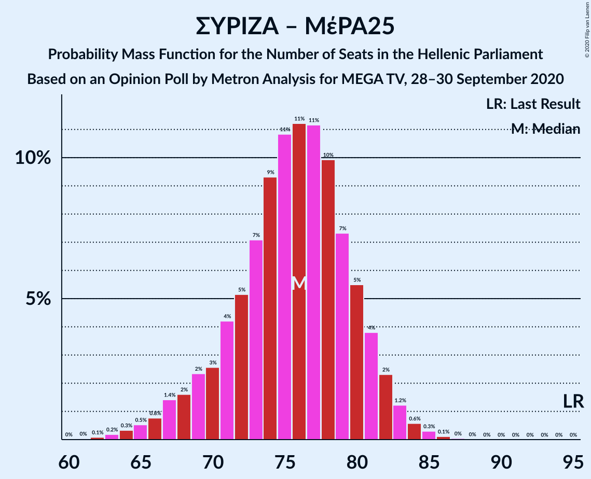

| Number of Seats | Probability | Accumulated | Special Marks |
|:---------------:|:-----------:|:-----------:|:-------------:|
| 61 | 0% | 100% |  |
| 62 | 0.1% | 99.9% |  |
| 63 | 0.2% | 99.9% |  |
| 64 | 0.3% | 99.7% |  |
| 65 | 0.5% | 99.3% |  |
| 66 | 0.8% | 98.8% |  |
| 67 | 1.4% | 98% |  |
| 68 | 2% | 97% |  |
| 69 | 2% | 95% |  |
| 70 | 3% | 93% |  |
| 71 | 4% | 90% |  |
| 72 | 5% | 86% |  |
| 73 | 7% | 81% |  |
| 74 | 9% | 74% |  |
| 75 | 11% | 64% |  |
| 76 | 11% | 54% | Median |
| 77 | 11% | 42% |  |
| 78 | 10% | 31% |  |
| 79 | 7% | 21% |  |
| 80 | 5% | 14% |  |
| 81 | 4% | 8% |  |
| 82 | 2% | 5% |  |
| 83 | 1.2% | 2% |  |
| 84 | 0.6% | 1.1% |  |
| 85 | 0.3% | 0.5% |  |
| 86 | 0.1% | 0.2% |  |
| 87 | 0% | 0.1% |  |
| 88 | 0% | 0% |  |
| 89 | 0% | 0% |  |
| 90 | 0% | 0% |  |
| 91 | 0% | 0% |  |
| 92 | 0% | 0% |  |
| 93 | 0% | 0% |  |
| 94 | 0% | 0% |  |
| 95 | 0% | 0% | Last Result |

### Συνασπισμός Ριζοσπαστικής Αριστεράς

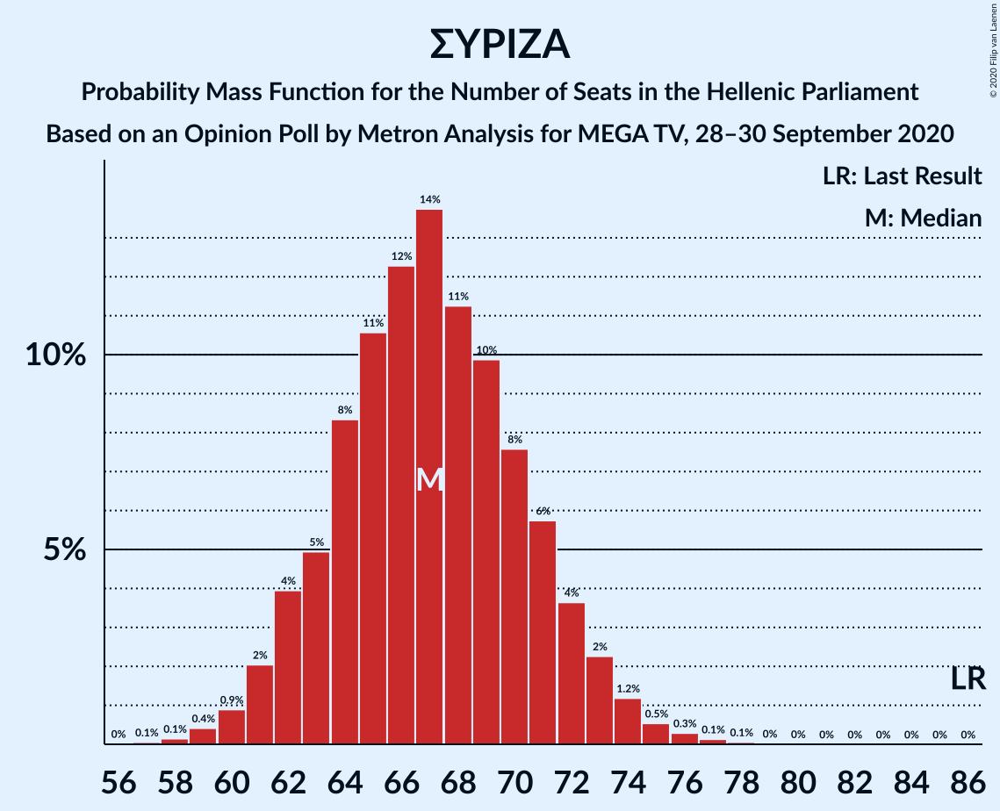

| Number of Seats | Probability | Accumulated | Special Marks |
|:---------------:|:-----------:|:-----------:|:-------------:|
| 57 | 0.1% | 100% |  |
| 58 | 0.1% | 99.9% |  |
| 59 | 0.4% | 99.8% |  |
| 60 | 0.9% | 99.4% |  |
| 61 | 2% | 98% |  |
| 62 | 4% | 96% |  |
| 63 | 5% | 92% |  |
| 64 | 8% | 88% |  |
| 65 | 11% | 79% |  |
| 66 | 12% | 69% |  |
| 67 | 14% | 56% | Median |
| 68 | 11% | 43% |  |
| 69 | 10% | 31% |  |
| 70 | 8% | 21% |  |
| 71 | 6% | 14% |  |
| 72 | 4% | 8% |  |
| 73 | 2% | 4% |  |
| 74 | 1.2% | 2% |  |
| 75 | 0.5% | 1.1% |  |
| 76 | 0.3% | 0.5% |  |
| 77 | 0.1% | 0.2% |  |
| 78 | 0.1% | 0.1% |  |
| 79 | 0% | 0% |  |
| 80 | 0% | 0% |  |
| 81 | 0% | 0% |  |
| 82 | 0% | 0% |  |
| 83 | 0% | 0% |  |
| 84 | 0% | 0% |  |
| 85 | 0% | 0% |  |
| 86 | 0% | 0% | Last Result |

## Technical Information

### Opinion Poll

+ **Polling firm:** Metron Analysis
+ **Commissioner(s):** MEGA TV
+ **Fieldwork period:** 28–30 September 2020

### Calculations

+ **Sample size:** 1388
+ **Simulations done:** 1,048,576
+ **Error estimate:** 0.17%

