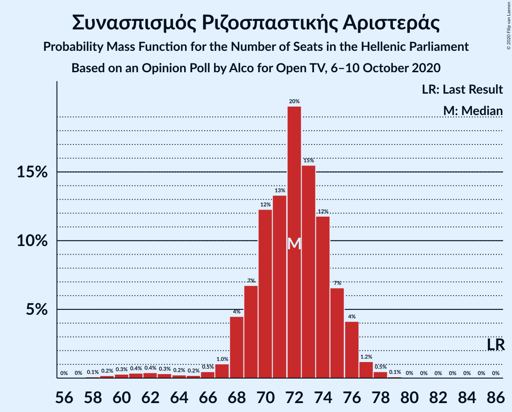
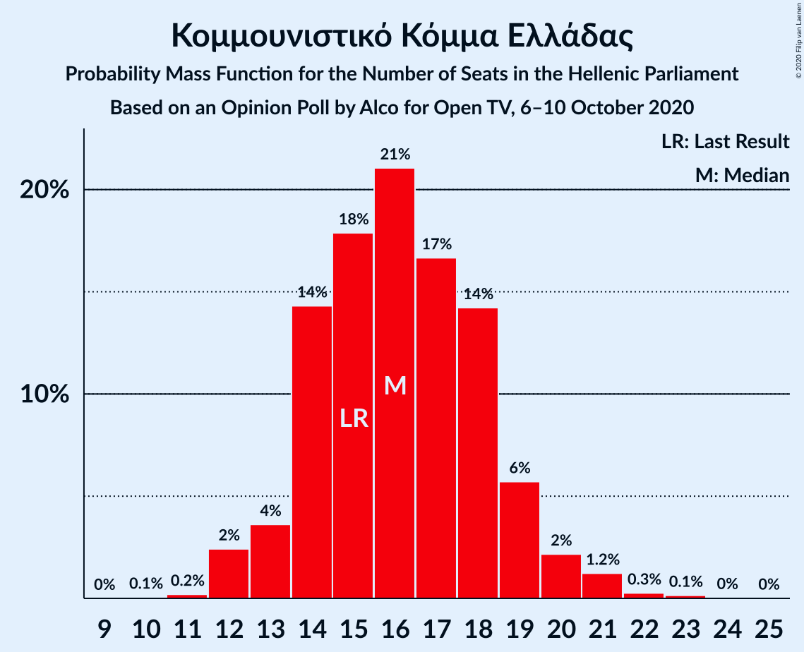
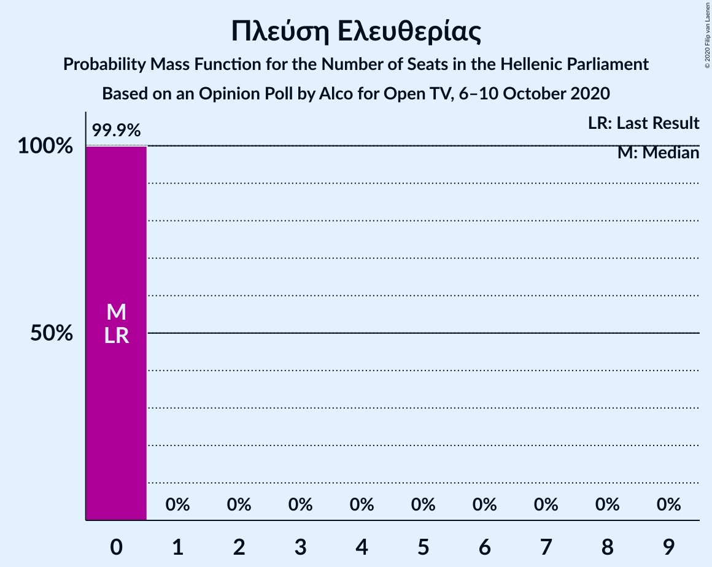
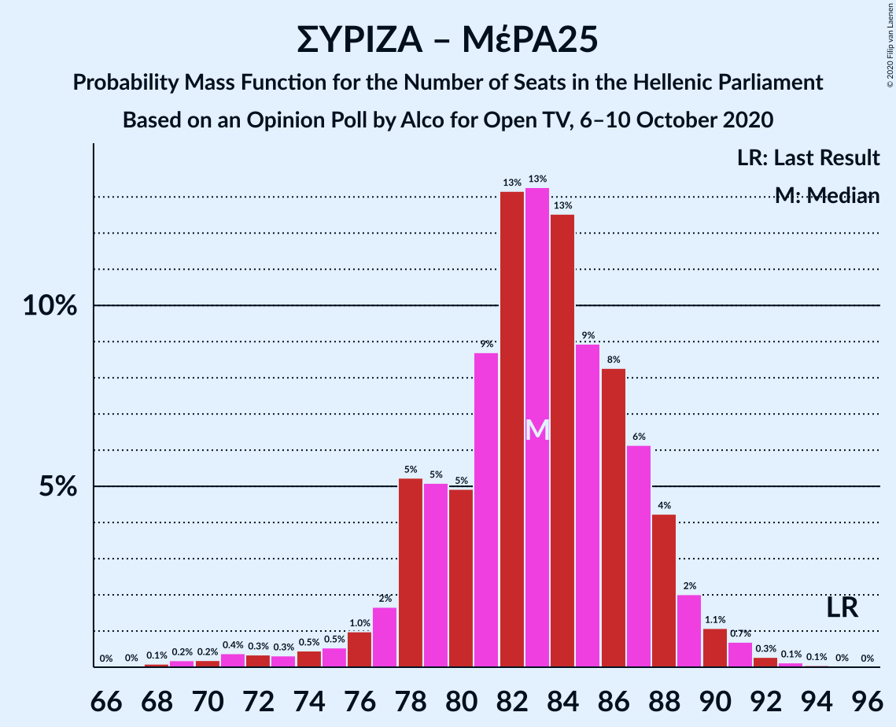

# Opinion Poll by Alco for Open TV, 6–10 October 2020

<a href="#voting-intentions">Voting Intentions</a> | <a href="#seats">Seats</a> | <a href="#coalitions">Coalitions</a> | <a href="#technical-information">Technical Information</a>

## Voting Intentions

### Confidence Intervals

| Party | Last Result | Poll Result | 80% Confidence Interval | 90% Confidence Interval | 95% Confidence Interval | 99% Confidence Interval |
|:-----:|:-----------:|:-----------:|:-----------------------:|:-----------------------:|:-----------------------:|:-----------------------:|
| Νέα Δημοκρατία | 39.8% | 43.1% | 41.1–45.1% |40.5–45.7% |40.1–46.2% |39.1–47.2% |
| Συνασπισμός Ριζοσπαστικής Αριστεράς | 31.5% | 25.8% | 24.1–27.6% |23.6–28.2% |23.2–28.6% |22.4–29.5% |
| Κίνημα Αλλαγής | 8.1% | 7.5% | 6.5–8.7% |6.2–9.0% |6.0–9.3% |5.6–9.9% |
| Κομμουνιστικό Κόμμα Ελλάδας | 5.3% | 6.0% | 5.1–7.1% |4.9–7.4% |4.7–7.7% |4.3–8.2% |
| Ελληνική Λύση | 3.7% | 4.8% | 4.0–5.8% |3.8–6.1% |3.6–6.3% |3.3–6.8% |
| Μέτωπο Ευρωπαϊκής Ρεαλιστικής Ανυπακοής | 3.4% | 4.2% | 3.5–5.1% |3.3–5.4% |3.1–5.6% |2.8–6.1% |
| Χρυσή Αυγή | 2.9% | 2.2% | 1.7–2.9% |1.6–3.1% |1.4–3.3% |1.2–3.7% |
| Πλεύση Ελευθερίας | 1.5% | 1.4% | 1.0–2.0% |0.9–2.2% |0.8–2.3% |0.7–2.7% |

*Note:* The poll result column reflects the actual value used in the calculations. Published results may vary slightly, and in addition be rounded to fewer digits.

## Seats

### Confidence Intervals

| Party | Last Result | Median | 80% Confidence Interval | 90% Confidence Interval | 95% Confidence Interval | 99% Confidence Interval |
|:-----:|:-----------:|:------:|:-----------------------:|:-----------------------:|:-----------------------:|:-----------------------:|
| <a href="#νέα-δημοκρατία">Νέα Δημοκρατία</a> | 158 | 167 | 162–173 |160–173 |158–175 |156–178 |
| <a href="#συνασπισμός-ριζοσπαστικής-αριστεράς">Συνασπισμός Ριζοσπαστικής Αριστεράς</a> | 86 | 72 | 69–75 |69–77 |64–77 |60–78 |
| <a href="#κίνημα-αλλαγής">Κίνημα Αλλαγής</a> | 22 | 21 | 18–23 |18–24 |16–26 |15–26 |
| <a href="#κομμουνιστικό-κόμμα-ελλάδας">Κομμουνιστικό Κόμμα Ελλάδας</a> | 15 | 16 | 14–18 |13–19 |13–20 |12–22 |
| <a href="#ελληνική-λύση">Ελληνική Λύση</a> | 10 | 12 | 11–16 |10–16 |10–16 |9–18 |
| <a href="#μέτωπο-ευρωπαϊκής-ρεαλιστικής-ανυπακοής">Μέτωπο Ευρωπαϊκής Ρεαλιστικής Ανυπακοής</a> | 9 | 11 | 9–13 |9–14 |8–15 |0–16 |
| <a href="#χρυσή-αυγή">Χρυσή Αυγή</a> | 0 | 0 | 0 |0 |0–8 |0–10 |
| <a href="#πλεύση-ελευθερίας">Πλεύση Ελευθερίας</a> | 0 | 0 | 0 |0 |0 |0 |

### Νέα Δημοκρατία

*For a full overview of the results for this party, see the [Νέα Δημοκρατία](party-νέαδημοκρατία.html) page.*

| Number of Seats | Probability | Accumulated | Special Marks |
|:---------------:|:-----------:|:-----------:|:-------------:|
| 153 | 0% | 100% |  |
| 154 | 0.1% | 99.9% |  |
| 155 | 0.3% | 99.9% |  |
| 156 | 0.2% | 99.5% |  |
| 157 | 0.9% | 99.3% |  |
| 158 | 1.0% | 98% | Last Result |
| 159 | 2% | 97% |  |
| 160 | 1.3% | 95% |  |
| 161 | 3% | 94% |  |
| 162 | 4% | 91% |  |
| 163 | 4% | 88% |  |
| 164 | 7% | 83% |  |
| 165 | 4% | 76% |  |
| 166 | 16% | 71% |  |
| 167 | 17% | 56% | Median |
| 168 | 4% | 39% |  |
| 169 | 10% | 34% |  |
| 170 | 7% | 24% |  |
| 171 | 2% | 17% |  |
| 172 | 3% | 14% |  |
| 173 | 8% | 11% |  |
| 174 | 1.0% | 4% |  |
| 175 | 1.0% | 3% |  |
| 176 | 0.2% | 2% |  |
| 177 | 0.7% | 1.3% |  |
| 178 | 0.4% | 0.7% |  |
| 179 | 0.1% | 0.3% |  |
| 180 | 0.2% | 0.2% |  |
| 181 | 0% | 0.1% |  |
| 182 | 0% | 0% |  |

### Συνασπισμός Ριζοσπαστικής Αριστεράς

*For a full overview of the results for this party, see the [Συνασπισμός Ριζοσπαστικής Αριστεράς](party-συνασπισμόςριζοσπαστικήςαριστεράς.html) page.*

| Number of Seats | Probability | Accumulated | Special Marks |
|:---------------:|:-----------:|:-----------:|:-------------:|
| 58 | 0.1% | 100% |  |
| 59 | 0.2% | 99.8% |  |
| 60 | 0.5% | 99.7% |  |
| 61 | 0.3% | 99.2% |  |
| 62 | 0.4% | 98.9% |  |
| 63 | 0.4% | 98% |  |
| 64 | 0.6% | 98% |  |
| 65 | 0.1% | 97% |  |
| 66 | 0.3% | 97% |  |
| 67 | 0.4% | 97% |  |
| 68 | 1.1% | 97% |  |
| 69 | 7% | 95% |  |
| 70 | 4% | 89% |  |
| 71 | 21% | 85% |  |
| 72 | 20% | 63% | Median |
| 73 | 19% | 43% |  |
| 74 | 3% | 24% |  |
| 75 | 13% | 21% |  |
| 76 | 2% | 8% |  |
| 77 | 4% | 5% |  |
| 78 | 0.8% | 1.0% |  |
| 79 | 0.1% | 0.2% |  |
| 80 | 0% | 0.1% |  |
| 81 | 0% | 0% |  |
| 82 | 0% | 0% |  |
| 83 | 0% | 0% |  |
| 84 | 0% | 0% |  |
| 85 | 0% | 0% |  |
| 86 | 0% | 0% | Last Result |

### Κίνημα Αλλαγής

*For a full overview of the results for this party, see the [Κίνημα Αλλαγής](party-κίνημααλλαγής.html) page.*

| Number of Seats | Probability | Accumulated | Special Marks |
|:---------------:|:-----------:|:-----------:|:-------------:|
| 14 | 0.2% | 100% |  |
| 15 | 1.2% | 99.8% |  |
| 16 | 2% | 98.6% |  |
| 17 | 0.4% | 97% |  |
| 18 | 14% | 97% |  |
| 19 | 27% | 83% |  |
| 20 | 3% | 56% |  |
| 21 | 6% | 53% | Median |
| 22 | 27% | 48% | Last Result |
| 23 | 15% | 21% |  |
| 24 | 1.3% | 6% |  |
| 25 | 2% | 4% |  |
| 26 | 2% | 3% |  |
| 27 | 0.2% | 0.2% |  |
| 28 | 0% | 0.1% |  |
| 29 | 0% | 0.1% |  |
| 30 | 0% | 0% |  |

### Κομμουνιστικό Κόμμα Ελλάδας

*For a full overview of the results for this party, see the [Κομμουνιστικό Κόμμα Ελλάδας](party-κομμουνιστικόκόμμαελλάδας.html) page.*

| Number of Seats | Probability | Accumulated | Special Marks |
|:---------------:|:-----------:|:-----------:|:-------------:|
| 11 | 0.3% | 100% |  |
| 12 | 2% | 99.6% |  |
| 13 | 5% | 98% |  |
| 14 | 12% | 93% |  |
| 15 | 22% | 81% | Last Result |
| 16 | 30% | 59% | Median |
| 17 | 7% | 29% |  |
| 18 | 13% | 21% |  |
| 19 | 4% | 8% |  |
| 20 | 2% | 4% |  |
| 21 | 2% | 2% |  |
| 22 | 0.4% | 0.6% |  |
| 23 | 0.2% | 0.2% |  |
| 24 | 0% | 0.1% |  |
| 25 | 0% | 0% |  |

### Ελληνική Λύση

*For a full overview of the results for this party, see the [Ελληνική Λύση](party-ελληνικήλύση.html) page.*

| Number of Seats | Probability | Accumulated | Special Marks |
|:---------------:|:-----------:|:-----------:|:-------------:|
| 0 | 0.1% | 100% |  |
| 1 | 0% | 99.9% |  |
| 2 | 0% | 99.9% |  |
| 3 | 0% | 99.9% |  |
| 4 | 0% | 99.9% |  |
| 5 | 0% | 99.9% |  |
| 6 | 0% | 99.9% |  |
| 7 | 0% | 99.9% |  |
| 8 | 0.1% | 99.9% |  |
| 9 | 2% | 99.8% |  |
| 10 | 5% | 98% | Last Result |
| 11 | 4% | 93% |  |
| 12 | 43% | 89% | Median |
| 13 | 12% | 46% |  |
| 14 | 14% | 34% |  |
| 15 | 4% | 20% |  |
| 16 | 14% | 16% |  |
| 17 | 1.0% | 2% |  |
| 18 | 1.2% | 1.5% |  |
| 19 | 0.2% | 0.2% |  |
| 20 | 0.1% | 0.1% |  |
| 21 | 0% | 0% |  |

### Μέτωπο Ευρωπαϊκής Ρεαλιστικής Ανυπακοής

*For a full overview of the results for this party, see the [Μέτωπο Ευρωπαϊκής Ρεαλιστικής Ανυπακοής](party-μέτωποευρωπαϊκήςρεαλιστικήςανυπακοής.html) page.*

| Number of Seats | Probability | Accumulated | Special Marks |
|:---------------:|:-----------:|:-----------:|:-------------:|
| 0 | 2% | 100% |  |
| 1 | 0% | 98% |  |
| 2 | 0% | 98% |  |
| 3 | 0% | 98% |  |
| 4 | 0% | 98% |  |
| 5 | 0% | 98% |  |
| 6 | 0% | 98% |  |
| 7 | 0% | 98% |  |
| 8 | 0.8% | 98% |  |
| 9 | 9% | 97% | Last Result |
| 10 | 18% | 88% |  |
| 11 | 37% | 70% | Median |
| 12 | 18% | 33% |  |
| 13 | 8% | 16% |  |
| 14 | 5% | 8% |  |
| 15 | 2% | 3% |  |
| 16 | 0.7% | 0.9% |  |
| 17 | 0.1% | 0.2% |  |
| 18 | 0.1% | 0.1% |  |
| 19 | 0% | 0% |  |

### Χρυσή Αυγή

*For a full overview of the results for this party, see the [Χρυσή Αυγή](party-χρυσήαυγή.html) page.*

| Number of Seats | Probability | Accumulated | Special Marks |
|:---------------:|:-----------:|:-----------:|:-------------:|
| 0 | 97% | 100% | Last Result, Median |
| 1 | 0% | 3% |  |
| 2 | 0% | 3% |  |
| 3 | 0% | 3% |  |
| 4 | 0% | 3% |  |
| 5 | 0% | 3% |  |
| 6 | 0% | 3% |  |
| 7 | 0% | 3% |  |
| 8 | 1.0% | 3% |  |
| 9 | 1.3% | 2% |  |
| 10 | 0.4% | 0.5% |  |
| 11 | 0.1% | 0.1% |  |
| 12 | 0% | 0% |  |

### Πλεύση Ελευθερίας

*For a full overview of the results for this party, see the [Πλεύση Ελευθερίας](party-πλεύσηελευθερίας.html) page.*

| Number of Seats | Probability | Accumulated | Special Marks |
|:---------------:|:-----------:|:-----------:|:-------------:|
| 0 | 99.9% | 100% | Last Result, Median |
| 1 | 0% | 0.1% |  |
| 2 | 0% | 0.1% |  |
| 3 | 0% | 0.1% |  |
| 4 | 0% | 0.1% |  |
| 5 | 0% | 0.1% |  |
| 6 | 0% | 0.1% |  |
| 7 | 0% | 0.1% |  |
| 8 | 0.1% | 0.1% |  |
| 9 | 0% | 0% |  |

## Coalitions

### Confidence Intervals

| Coalition | Last Result | Median | Majority? | 80% Confidence Interval | 90% Confidence Interval | 95% Confidence Interval | 99% Confidence Interval |
|:---------:|:-----------:|:------:|:---------:|:-----------------------:|:-----------------------:|:-----------------------:|:-----------------------:|
| Νέα Δημοκρατία – Κίνημα Αλλαγής | 180 | 188 | 100% | 182–192 | 181–193 | 179–194 | 177–199 |
| Νέα Δημοκρατία | 158 | 167 | 100% | 162–173 | 160–173 | 158–175 | 156–178 |
| Συνασπισμός Ριζοσπαστικής Αριστεράς – Μέτωπο Ευρωπαϊκής Ρεαλιστικής Ανυπακοής | 95 | 83 | 0% | 80–87 | 78–89 | 75–91 | 70–91 |
| Συνασπισμός Ριζοσπαστικής Αριστεράς | 86 | 72 | 0% | 69–75 | 69–77 | 64–77 | 60–78 |

### Νέα Δημοκρατία – Κίνημα Αλλαγής

| Number of Seats | Probability | Accumulated | Special Marks |
|:---------------:|:-----------:|:-----------:|:-------------:|
| 173 | 0.1% | 100% |  |
| 174 | 0.1% | 99.9% |  |
| 175 | 0.1% | 99.8% |  |
| 176 | 0.2% | 99.7% |  |
| 177 | 0.9% | 99.5% |  |
| 178 | 0.4% | 98.6% |  |
| 179 | 2% | 98% |  |
| 180 | 0.7% | 97% | Last Result |
| 181 | 4% | 96% |  |
| 182 | 5% | 92% |  |
| 183 | 2% | 88% |  |
| 184 | 6% | 86% |  |
| 185 | 7% | 80% |  |
| 186 | 9% | 73% |  |
| 187 | 4% | 64% |  |
| 188 | 22% | 60% | Median |
| 189 | 2% | 38% |  |
| 190 | 13% | 35% |  |
| 191 | 3% | 23% |  |
| 192 | 12% | 20% |  |
| 193 | 3% | 7% |  |
| 194 | 2% | 4% |  |
| 195 | 1.3% | 2% |  |
| 196 | 0.3% | 1.2% |  |
| 197 | 0.3% | 0.9% |  |
| 198 | 0.1% | 0.6% |  |
| 199 | 0.1% | 0.5% |  |
| 200 | 0% | 0.4% |  |
| 201 | 0.1% | 0.4% |  |
| 202 | 0% | 0.2% |  |
| 203 | 0.1% | 0.2% |  |
| 204 | 0% | 0% |  |

### Νέα Δημοκρατία

| Number of Seats | Probability | Accumulated | Special Marks |
|:---------------:|:-----------:|:-----------:|:-------------:|
| 153 | 0% | 100% |  |
| 154 | 0.1% | 99.9% |  |
| 155 | 0.3% | 99.9% |  |
| 156 | 0.2% | 99.5% |  |
| 157 | 0.9% | 99.3% |  |
| 158 | 1.0% | 98% | Last Result |
| 159 | 2% | 97% |  |
| 160 | 1.3% | 95% |  |
| 161 | 3% | 94% |  |
| 162 | 4% | 91% |  |
| 163 | 4% | 88% |  |
| 164 | 7% | 83% |  |
| 165 | 4% | 76% |  |
| 166 | 16% | 71% |  |
| 167 | 17% | 56% | Median |
| 168 | 4% | 39% |  |
| 169 | 10% | 34% |  |
| 170 | 7% | 24% |  |
| 171 | 2% | 17% |  |
| 172 | 3% | 14% |  |
| 173 | 8% | 11% |  |
| 174 | 1.0% | 4% |  |
| 175 | 1.0% | 3% |  |
| 176 | 0.2% | 2% |  |
| 177 | 0.7% | 1.3% |  |
| 178 | 0.4% | 0.7% |  |
| 179 | 0.1% | 0.3% |  |
| 180 | 0.2% | 0.2% |  |
| 181 | 0% | 0.1% |  |
| 182 | 0% | 0% |  |

### Συνασπισμός Ριζοσπαστικής Αριστεράς – Μέτωπο Ευρωπαϊκής Ρεαλιστικής Ανυπακοής

| Number of Seats | Probability | Accumulated | Special Marks |
|:---------------:|:-----------:|:-----------:|:-------------:|
| 68 | 0.2% | 100% |  |
| 69 | 0.2% | 99.8% |  |
| 70 | 0.1% | 99.6% |  |
| 71 | 0.2% | 99.5% |  |
| 72 | 0.4% | 99.2% |  |
| 73 | 0.4% | 98.9% |  |
| 74 | 0.3% | 98% |  |
| 75 | 0.9% | 98% |  |
| 76 | 0.8% | 97% |  |
| 77 | 1.2% | 96% |  |
| 78 | 3% | 95% |  |
| 79 | 2% | 92% |  |
| 80 | 8% | 90% |  |
| 81 | 5% | 82% |  |
| 82 | 23% | 77% |  |
| 83 | 11% | 54% | Median |
| 84 | 14% | 43% |  |
| 85 | 8% | 30% |  |
| 86 | 3% | 22% |  |
| 87 | 10% | 19% |  |
| 88 | 2% | 9% |  |
| 89 | 4% | 7% |  |
| 90 | 0.5% | 3% |  |
| 91 | 3% | 3% |  |
| 92 | 0.2% | 0.3% |  |
| 93 | 0.1% | 0.2% |  |
| 94 | 0% | 0% |  |
| 95 | 0% | 0% | Last Result |

### Συνασπισμός Ριζοσπαστικής Αριστεράς

| Number of Seats | Probability | Accumulated | Special Marks |
|:---------------:|:-----------:|:-----------:|:-------------:|
| 58 | 0.1% | 100% |  |
| 59 | 0.2% | 99.8% |  |
| 60 | 0.5% | 99.7% |  |
| 61 | 0.3% | 99.2% |  |
| 62 | 0.4% | 98.9% |  |
| 63 | 0.4% | 98% |  |
| 64 | 0.6% | 98% |  |
| 65 | 0.1% | 97% |  |
| 66 | 0.3% | 97% |  |
| 67 | 0.4% | 97% |  |
| 68 | 1.1% | 97% |  |
| 69 | 7% | 95% |  |
| 70 | 4% | 89% |  |
| 71 | 21% | 85% |  |
| 72 | 20% | 63% | Median |
| 73 | 19% | 43% |  |
| 74 | 3% | 24% |  |
| 75 | 13% | 21% |  |
| 76 | 2% | 8% |  |
| 77 | 4% | 5% |  |
| 78 | 0.8% | 1.0% |  |
| 79 | 0.1% | 0.2% |  |
| 80 | 0% | 0.1% |  |
| 81 | 0% | 0% |  |
| 82 | 0% | 0% |  |
| 83 | 0% | 0% |  |
| 84 | 0% | 0% |  |
| 85 | 0% | 0% |  |
| 86 | 0% | 0% | Last Result |

## Technical Information

### Opinion Poll

+ **Polling firm:** Alco
+ **Commissioner(s):** Open TV
+ **Fieldwork period:** 6–10 October 2020

### Calculations

+ **Sample size:** 1000
+ **Simulations done:** 131,072
+ **Error estimate:** 1.01%

