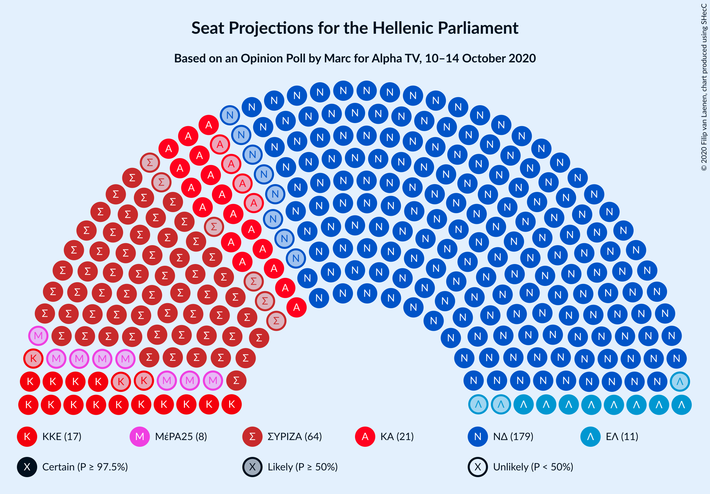
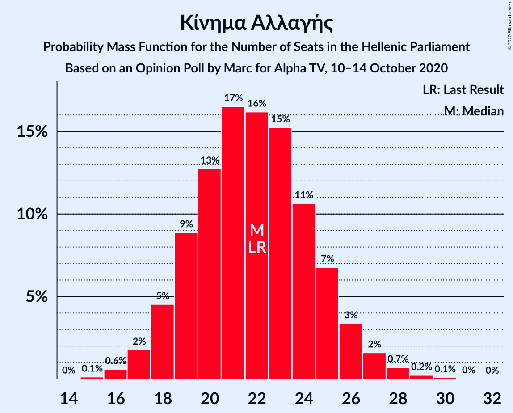
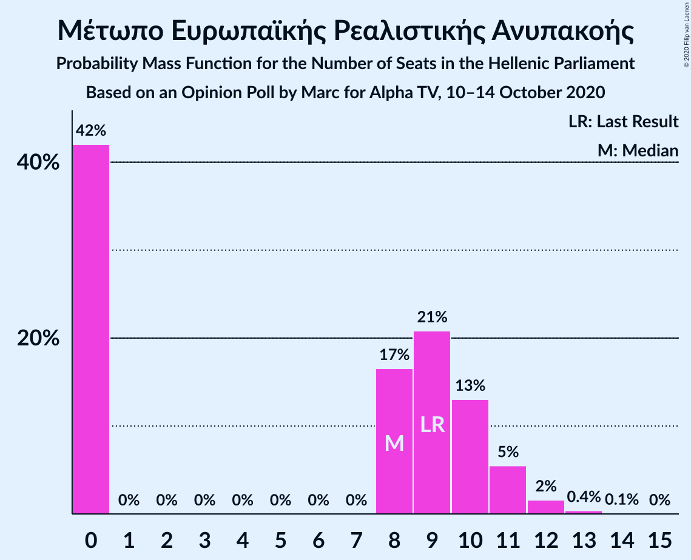
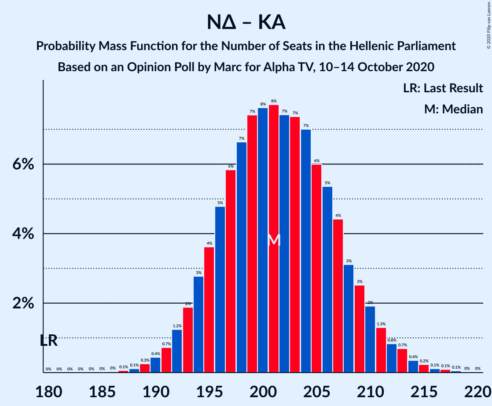

# Opinion Poll by Marc for Αlpha TV, 10–14 October 2020

<a href="#voting-intentions">Voting Intentions</a> | <a href="#seats">Seats</a> | <a href="#coalitions">Coalitions</a> | <a href="#technical-information">Technical Information</a>

## Voting Intentions

### Confidence Intervals

| Party | Last Result | Poll Result | 80% Confidence Interval | 90% Confidence Interval | 95% Confidence Interval | 99% Confidence Interval |
|:-----:|:-----------:|:-----------:|:-----------------------:|:-----------------------:|:-----------------------:|:-----------------------:|
| Νέα Δημοκρατία | 39.8% | 48.9% | 46.8–50.9% |46.3–51.5% |45.8–52.0% |44.8–52.9% |
| Συνασπισμός Ριζοσπαστικής Αριστεράς | 31.5% | 24.3% | 22.6–26.1% |22.2–26.6% |21.8–27.1% |21.0–28.0% |
| Κίνημα Αλλαγής | 8.1% | 8.1% | 7.1–9.4% |6.8–9.7% |6.6–10.0% |6.1–10.6% |
| Κομμουνιστικό Κόμμα Ελλάδας | 5.3% | 6.6% | 5.7–7.7% |5.4–8.0% |5.2–8.3% |4.8–8.8% |
| Ελληνική Λύση | 3.7% | 4.1% | 3.4–5.0% |3.2–5.3% |3.0–5.5% |2.7–6.0% |
| Μέτωπο Ευρωπαϊκής Ρεαλιστικής Ανυπακοής | 3.4% | 3.1% | 2.5–3.9% |2.3–4.1% |2.2–4.3% |1.9–4.8% |

*Note:* The poll result column reflects the actual value used in the calculations. Published results may vary slightly, and in addition be rounded to fewer digits.

## Seats

### Confidence Intervals

| Party | Last Result | Median | 80% Confidence Interval | 90% Confidence Interval | 95% Confidence Interval | 99% Confidence Interval |
|:-----:|:-----------:|:------:|:-----------------------:|:-----------------------:|:-----------------------:|:-----------------------:|
| <a href="#νέα-δημοκρατία">Νέα Δημοκρατία</a> | 158 | 180 | 174–186 |172–188 |171–189 |168–192 |
| <a href="#συνασπισμός-ριζοσπαστικής-αριστεράς">Συνασπισμός Ριζοσπαστικής Αριστεράς</a> | 86 | 65 | 60–70 |59–71 |58–72 |55–75 |
| <a href="#κίνημα-αλλαγής">Κίνημα Αλλαγής</a> | 22 | 22 | 19–25 |18–26 |17–27 |16–28 |
| <a href="#κομμουνιστικό-κόμμα-ελλάδας">Κομμουνιστικό Κόμμα Ελλάδας</a> | 15 | 18 | 15–20 |14–21 |14–22 |13–23 |
| <a href="#ελληνική-λύση">Ελληνική Λύση</a> | 10 | 11 | 9–13 |8–14 |8–15 |0–16 |
| <a href="#μέτωπο-ευρωπαϊκής-ρεαλιστικής-ανυπακοής">Μέτωπο Ευρωπαϊκής Ρεαλιστικής Ανυπακοής</a> | 9 | 8 | 0–10 |0–11 |0–11 |0–12 |

### Νέα Δημοκρατία

*For a full overview of the results for this party, see the [Νέα Δημοκρατία](party-νέαδημοκρατία.html) page.*

| Number of Seats | Probability | Accumulated | Special Marks |
|:---------------:|:-----------:|:-----------:|:-------------:|
| 158 | 0% | 100% | Last Result |
| 159 | 0% | 100% |  |
| 160 | 0% | 100% |  |
| 161 | 0% | 100% |  |
| 162 | 0% | 100% |  |
| 163 | 0% | 100% |  |
| 164 | 0% | 100% |  |
| 165 | 0% | 100% |  |
| 166 | 0.1% | 99.9% |  |
| 167 | 0.2% | 99.8% |  |
| 168 | 0.3% | 99.6% |  |
| 169 | 0.6% | 99.3% |  |
| 170 | 1.0% | 98.7% |  |
| 171 | 2% | 98% |  |
| 172 | 2% | 96% |  |
| 173 | 3% | 94% |  |
| 174 | 4% | 90% |  |
| 175 | 6% | 86% |  |
| 176 | 6% | 80% |  |
| 177 | 8% | 74% |  |
| 178 | 7% | 66% |  |
| 179 | 8% | 59% |  |
| 180 | 8% | 51% | Median |
| 181 | 8% | 43% |  |
| 182 | 7% | 35% |  |
| 183 | 7% | 28% |  |
| 184 | 6% | 21% |  |
| 185 | 4% | 15% |  |
| 186 | 3% | 11% |  |
| 187 | 2% | 8% |  |
| 188 | 2% | 5% |  |
| 189 | 1.2% | 3% |  |
| 190 | 0.8% | 2% |  |
| 191 | 0.5% | 1.4% |  |
| 192 | 0.4% | 0.9% |  |
| 193 | 0.2% | 0.5% |  |
| 194 | 0.1% | 0.3% |  |
| 195 | 0.1% | 0.1% |  |
| 196 | 0% | 0.1% |  |
| 197 | 0% | 0% |  |

### Συνασπισμός Ριζοσπαστικής Αριστεράς

*For a full overview of the results for this party, see the [Συνασπισμός Ριζοσπαστικής Αριστεράς](party-συνασπισμόςριζοσπαστικήςαριστεράς.html) page.*

| Number of Seats | Probability | Accumulated | Special Marks |
|:---------------:|:-----------:|:-----------:|:-------------:|
| 53 | 0.1% | 100% |  |
| 54 | 0.1% | 99.9% |  |
| 55 | 0.3% | 99.8% |  |
| 56 | 0.6% | 99.4% |  |
| 57 | 1.3% | 98.8% |  |
| 58 | 2% | 98% |  |
| 59 | 3% | 95% |  |
| 60 | 5% | 92% |  |
| 61 | 7% | 87% |  |
| 62 | 8% | 80% |  |
| 63 | 10% | 71% |  |
| 64 | 11% | 62% |  |
| 65 | 10% | 51% | Median |
| 66 | 10% | 41% |  |
| 67 | 9% | 31% |  |
| 68 | 6% | 22% |  |
| 69 | 5% | 16% |  |
| 70 | 4% | 10% |  |
| 71 | 2% | 6% |  |
| 72 | 2% | 4% |  |
| 73 | 1.2% | 2% |  |
| 74 | 0.5% | 1.2% |  |
| 75 | 0.3% | 0.6% |  |
| 76 | 0.2% | 0.3% |  |
| 77 | 0.1% | 0.1% |  |
| 78 | 0% | 0.1% |  |
| 79 | 0% | 0% |  |
| 80 | 0% | 0% |  |
| 81 | 0% | 0% |  |
| 82 | 0% | 0% |  |
| 83 | 0% | 0% |  |
| 84 | 0% | 0% |  |
| 85 | 0% | 0% |  |
| 86 | 0% | 0% | Last Result |

### Κίνημα Αλλαγής

*For a full overview of the results for this party, see the [Κίνημα Αλλαγής](party-κίνημααλλαγής.html) page.*

| Number of Seats | Probability | Accumulated | Special Marks |
|:---------------:|:-----------:|:-----------:|:-------------:|
| 15 | 0.1% | 100% |  |
| 16 | 0.6% | 99.9% |  |
| 17 | 2% | 99.3% |  |
| 18 | 5% | 97% |  |
| 19 | 9% | 93% |  |
| 20 | 13% | 84% |  |
| 21 | 17% | 71% |  |
| 22 | 16% | 55% | Last Result, Median |
| 23 | 15% | 39% |  |
| 24 | 11% | 23% |  |
| 25 | 7% | 13% |  |
| 26 | 3% | 6% |  |
| 27 | 2% | 3% |  |
| 28 | 0.7% | 1.1% |  |
| 29 | 0.2% | 0.4% |  |
| 30 | 0.1% | 0.1% |  |
| 31 | 0% | 0% |  |

### Κομμουνιστικό Κόμμα Ελλάδας

*For a full overview of the results for this party, see the [Κομμουνιστικό Κόμμα Ελλάδας](party-κομμουνιστικόκόμμαελλάδας.html) page.*

| Number of Seats | Probability | Accumulated | Special Marks |
|:---------------:|:-----------:|:-----------:|:-------------:|
| 11 | 0% | 100% |  |
| 12 | 0.3% | 99.9% |  |
| 13 | 1.5% | 99.6% |  |
| 14 | 4% | 98% |  |
| 15 | 10% | 94% | Last Result |
| 16 | 15% | 84% |  |
| 17 | 18% | 69% |  |
| 18 | 18% | 51% | Median |
| 19 | 15% | 33% |  |
| 20 | 10% | 19% |  |
| 21 | 5% | 9% |  |
| 22 | 2% | 4% |  |
| 23 | 1.0% | 1.4% |  |
| 24 | 0.3% | 0.5% |  |
| 25 | 0.1% | 0.1% |  |
| 26 | 0% | 0% |  |

### Ελληνική Λύση

*For a full overview of the results for this party, see the [Ελληνική Λύση](party-ελληνικήλύση.html) page.*

| Number of Seats | Probability | Accumulated | Special Marks |
|:---------------:|:-----------:|:-----------:|:-------------:|
| 0 | 2% | 100% |  |
| 1 | 0% | 98% |  |
| 2 | 0% | 98% |  |
| 3 | 0% | 98% |  |
| 4 | 0% | 98% |  |
| 5 | 0% | 98% |  |
| 6 | 0% | 98% |  |
| 7 | 0% | 98% |  |
| 8 | 3% | 98% |  |
| 9 | 13% | 95% |  |
| 10 | 21% | 82% | Last Result |
| 11 | 23% | 61% | Median |
| 12 | 19% | 38% |  |
| 13 | 11% | 19% |  |
| 14 | 5% | 8% |  |
| 15 | 2% | 3% |  |
| 16 | 0.6% | 0.8% |  |
| 17 | 0.2% | 0.2% |  |
| 18 | 0% | 0% |  |

### Μέτωπο Ευρωπαϊκής Ρεαλιστικής Ανυπακοής

*For a full overview of the results for this party, see the [Μέτωπο Ευρωπαϊκής Ρεαλιστικής Ανυπακοής](party-μέτωποευρωπαϊκήςρεαλιστικήςανυπακοής.html) page.*

| Number of Seats | Probability | Accumulated | Special Marks |
|:---------------:|:-----------:|:-----------:|:-------------:|
| 0 | 42% | 100% |  |
| 1 | 0% | 58% |  |
| 2 | 0% | 58% |  |
| 3 | 0% | 58% |  |
| 4 | 0% | 58% |  |
| 5 | 0% | 58% |  |
| 6 | 0% | 58% |  |
| 7 | 0% | 58% |  |
| 8 | 17% | 58% | Median |
| 9 | 21% | 41% | Last Result |
| 10 | 13% | 21% |  |
| 11 | 5% | 8% |  |
| 12 | 2% | 2% |  |
| 13 | 0.4% | 0.5% |  |
| 14 | 0.1% | 0.1% |  |
| 15 | 0% | 0% |  |

## Coalitions

### Confidence Intervals

| Coalition | Last Result | Median | Majority? | 80% Confidence Interval | 90% Confidence Interval | 95% Confidence Interval | 99% Confidence Interval |
|:---------:|:-----------:|:------:|:---------:|:-----------------------:|:-----------------------:|:-----------------------:|:-----------------------:|
| Νέα Δημοκρατία – Κίνημα Αλλαγής | 180 | 201 | 100% | 195–208 | 194–210 | 192–211 | 190–215 |
| Νέα Δημοκρατία | 158 | 180 | 100% | 174–186 | 172–188 | 171–189 | 168–192 |
| Συνασπισμός Ριζοσπαστικής Αριστεράς – Μέτωπο Ευρωπαϊκής Ρεαλιστικής Ανυπακοής | 95 | 70 | 0% | 63–76 | 62–78 | 61–79 | 58–82 |
| Συνασπισμός Ριζοσπαστικής Αριστεράς | 86 | 65 | 0% | 60–70 | 59–71 | 58–72 | 55–75 |

### Νέα Δημοκρατία – Κίνημα Αλλαγής

| Number of Seats | Probability | Accumulated | Special Marks |
|:---------------:|:-----------:|:-----------:|:-------------:|
| 180 | 0% | 100% | Last Result |
| 181 | 0% | 100% |  |
| 182 | 0% | 100% |  |
| 183 | 0% | 100% |  |
| 184 | 0% | 100% |  |
| 185 | 0% | 100% |  |
| 186 | 0% | 100% |  |
| 187 | 0.1% | 100% |  |
| 188 | 0.1% | 99.9% |  |
| 189 | 0.3% | 99.8% |  |
| 190 | 0.4% | 99.5% |  |
| 191 | 0.7% | 99.1% |  |
| 192 | 1.2% | 98% |  |
| 193 | 2% | 97% |  |
| 194 | 3% | 95% |  |
| 195 | 4% | 92% |  |
| 196 | 5% | 89% |  |
| 197 | 6% | 84% |  |
| 198 | 7% | 78% |  |
| 199 | 7% | 72% |  |
| 200 | 8% | 64% |  |
| 201 | 8% | 57% |  |
| 202 | 7% | 49% | Median |
| 203 | 7% | 41% |  |
| 204 | 7% | 34% |  |
| 205 | 6% | 27% |  |
| 206 | 5% | 21% |  |
| 207 | 4% | 16% |  |
| 208 | 3% | 11% |  |
| 209 | 3% | 8% |  |
| 210 | 2% | 6% |  |
| 211 | 1.3% | 4% |  |
| 212 | 0.8% | 2% |  |
| 213 | 0.7% | 2% |  |
| 214 | 0.4% | 0.9% |  |
| 215 | 0.2% | 0.5% |  |
| 216 | 0.1% | 0.3% |  |
| 217 | 0.1% | 0.2% |  |
| 218 | 0.1% | 0.1% |  |
| 219 | 0% | 0% |  |

### Νέα Δημοκρατία

| Number of Seats | Probability | Accumulated | Special Marks |
|:---------------:|:-----------:|:-----------:|:-------------:|
| 158 | 0% | 100% | Last Result |
| 159 | 0% | 100% |  |
| 160 | 0% | 100% |  |
| 161 | 0% | 100% |  |
| 162 | 0% | 100% |  |
| 163 | 0% | 100% |  |
| 164 | 0% | 100% |  |
| 165 | 0% | 100% |  |
| 166 | 0.1% | 99.9% |  |
| 167 | 0.2% | 99.8% |  |
| 168 | 0.3% | 99.6% |  |
| 169 | 0.6% | 99.3% |  |
| 170 | 1.0% | 98.7% |  |
| 171 | 2% | 98% |  |
| 172 | 2% | 96% |  |
| 173 | 3% | 94% |  |
| 174 | 4% | 90% |  |
| 175 | 6% | 86% |  |
| 176 | 6% | 80% |  |
| 177 | 8% | 74% |  |
| 178 | 7% | 66% |  |
| 179 | 8% | 59% |  |
| 180 | 8% | 51% | Median |
| 181 | 8% | 43% |  |
| 182 | 7% | 35% |  |
| 183 | 7% | 28% |  |
| 184 | 6% | 21% |  |
| 185 | 4% | 15% |  |
| 186 | 3% | 11% |  |
| 187 | 2% | 8% |  |
| 188 | 2% | 5% |  |
| 189 | 1.2% | 3% |  |
| 190 | 0.8% | 2% |  |
| 191 | 0.5% | 1.4% |  |
| 192 | 0.4% | 0.9% |  |
| 193 | 0.2% | 0.5% |  |
| 194 | 0.1% | 0.3% |  |
| 195 | 0.1% | 0.1% |  |
| 196 | 0% | 0.1% |  |
| 197 | 0% | 0% |  |

### Συνασπισμός Ριζοσπαστικής Αριστεράς – Μέτωπο Ευρωπαϊκής Ρεαλιστικής Ανυπακοής

| Number of Seats | Probability | Accumulated | Special Marks |
|:---------------:|:-----------:|:-----------:|:-------------:|
| 55 | 0% | 100% |  |
| 56 | 0.1% | 99.9% |  |
| 57 | 0.2% | 99.9% |  |
| 58 | 0.4% | 99.7% |  |
| 59 | 0.8% | 99.3% |  |
| 60 | 1.0% | 98.5% |  |
| 61 | 2% | 98% |  |
| 62 | 3% | 96% |  |
| 63 | 4% | 93% |  |
| 64 | 4% | 90% |  |
| 65 | 5% | 86% |  |
| 66 | 6% | 81% |  |
| 67 | 6% | 75% |  |
| 68 | 6% | 69% |  |
| 69 | 7% | 63% |  |
| 70 | 8% | 56% |  |
| 71 | 8% | 48% |  |
| 72 | 7% | 40% |  |
| 73 | 7% | 33% | Median |
| 74 | 6% | 26% |  |
| 75 | 6% | 20% |  |
| 76 | 4% | 14% |  |
| 77 | 4% | 9% |  |
| 78 | 2% | 6% |  |
| 79 | 2% | 4% |  |
| 80 | 0.8% | 2% |  |
| 81 | 0.7% | 1.2% |  |
| 82 | 0.3% | 0.6% |  |
| 83 | 0.2% | 0.3% |  |
| 84 | 0.1% | 0.1% |  |
| 85 | 0% | 0.1% |  |
| 86 | 0% | 0% |  |
| 87 | 0% | 0% |  |
| 88 | 0% | 0% |  |
| 89 | 0% | 0% |  |
| 90 | 0% | 0% |  |
| 91 | 0% | 0% |  |
| 92 | 0% | 0% |  |
| 93 | 0% | 0% |  |
| 94 | 0% | 0% |  |
| 95 | 0% | 0% | Last Result |

### Συνασπισμός Ριζοσπαστικής Αριστεράς

| Number of Seats | Probability | Accumulated | Special Marks |
|:---------------:|:-----------:|:-----------:|:-------------:|
| 53 | 0.1% | 100% |  |
| 54 | 0.1% | 99.9% |  |
| 55 | 0.3% | 99.8% |  |
| 56 | 0.6% | 99.4% |  |
| 57 | 1.3% | 98.8% |  |
| 58 | 2% | 98% |  |
| 59 | 3% | 95% |  |
| 60 | 5% | 92% |  |
| 61 | 7% | 87% |  |
| 62 | 8% | 80% |  |
| 63 | 10% | 71% |  |
| 64 | 11% | 62% |  |
| 65 | 10% | 51% | Median |
| 66 | 10% | 41% |  |
| 67 | 9% | 31% |  |
| 68 | 6% | 22% |  |
| 69 | 5% | 16% |  |
| 70 | 4% | 10% |  |
| 71 | 2% | 6% |  |
| 72 | 2% | 4% |  |
| 73 | 1.2% | 2% |  |
| 74 | 0.5% | 1.2% |  |
| 75 | 0.3% | 0.6% |  |
| 76 | 0.2% | 0.3% |  |
| 77 | 0.1% | 0.1% |  |
| 78 | 0% | 0.1% |  |
| 79 | 0% | 0% |  |
| 80 | 0% | 0% |  |
| 81 | 0% | 0% |  |
| 82 | 0% | 0% |  |
| 83 | 0% | 0% |  |
| 84 | 0% | 0% |  |
| 85 | 0% | 0% |  |
| 86 | 0% | 0% | Last Result |

## Technical Information

### Opinion Poll

+ **Polling firm:** Marc
+ **Commissioner(s):** Αlpha TV
+ **Fieldwork period:** 10–14 October 2020

### Calculations

+ **Sample size:** 1007
+ **Simulations done:** 1,048,576
+ **Error estimate:** 0.61%

