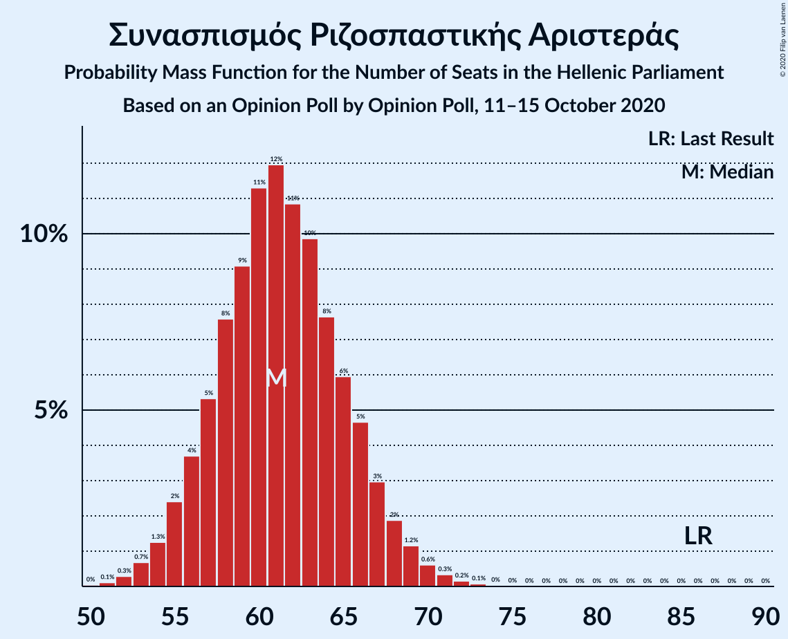
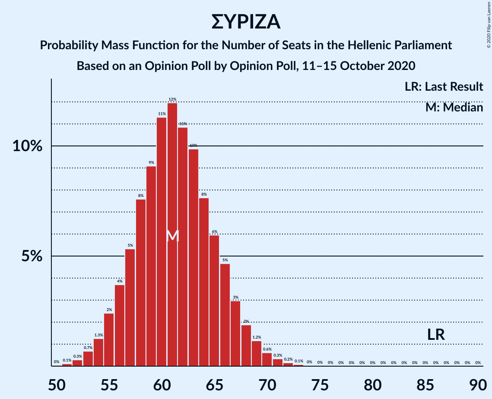

# Opinion Poll by Opinion Poll, 11–15 October 2020

<a href="#voting-intentions">Voting Intentions</a> | <a href="#seats">Seats</a> | <a href="#coalitions">Coalitions</a> | <a href="#technical-information">Technical Information</a>

## Voting Intentions

### Confidence Intervals

| Party | Last Result | Poll Result | 80% Confidence Interval | 90% Confidence Interval | 95% Confidence Interval | 99% Confidence Interval |
|:-----:|:-----------:|:-----------:|:-----------------------:|:-----------------------:|:-----------------------:|:-----------------------:|
| Νέα Δημοκρατία | 39.8% | 49.9% | 47.9–51.9% |47.3–52.5% |46.8–53.0% |45.8–54.0% |
| Συνασπισμός Ριζοσπαστικής Αριστεράς | 31.5% | 23.8% | 22.1–25.6% |21.7–26.1% |21.3–26.6% |20.5–27.4% |
| Κίνημα Αλλαγής | 8.1% | 8.8% | 7.7–10.1% |7.4–10.4% |7.2–10.7% |6.7–11.4% |
| Κομμουνιστικό Κόμμα Ελλάδας | 5.3% | 6.8% | 5.9–7.9% |5.6–8.3% |5.4–8.5% |5.0–9.1% |
| Ελληνική Λύση | 3.7% | 4.2% | 3.5–5.1% |3.3–5.4% |3.1–5.6% |2.8–6.1% |
| Μέτωπο Ευρωπαϊκής Ρεαλιστικής Ανυπακοής | 3.4% | 3.7% | 3.0–4.6% |2.9–4.8% |2.7–5.1% |2.4–5.5% |

*Note:* The poll result column reflects the actual value used in the calculations. Published results may vary slightly, and in addition be rounded to fewer digits.

## Seats

### Confidence Intervals

| Party | Last Result | Median | 80% Confidence Interval | 90% Confidence Interval | 95% Confidence Interval | 99% Confidence Interval |
|:-----:|:-----------:|:------:|:-----------------------:|:-----------------------:|:-----------------------:|:-----------------------:|
| <a href="#νέα-δημοκρατία">Νέα Δημοκρατία</a> | 158 | 178 | 173–184 |171–186 |170–187 |168–190 |
| <a href="#συνασπισμός-ριζοσπαστικής-αριστεράς">Συνασπισμός Ριζοσπαστικής Αριστεράς</a> | 86 | 61 | 57–66 |56–67 |55–68 |53–71 |
| <a href="#κίνημα-αλλαγής">Κίνημα Αλλαγής</a> | 22 | 23 | 20–26 |19–27 |18–28 |17–29 |
| <a href="#κομμουνιστικό-κόμμα-ελλάδας">Κομμουνιστικό Κόμμα Ελλάδας</a> | 15 | 18 | 15–20 |14–21 |14–22 |13–23 |
| <a href="#ελληνική-λύση">Ελληνική Λύση</a> | 10 | 11 | 9–13 |8–14 |8–14 |0–16 |
| <a href="#μέτωπο-ευρωπαϊκής-ρεαλιστικής-ανυπακοής">Μέτωπο Ευρωπαϊκής Ρεαλιστικής Ανυπακοής</a> | 9 | 10 | 8–12 |0–12 |0–13 |0–14 |

### Νέα Δημοκρατία

*For a full overview of the results for this party, see the [Νέα Δημοκρατία](party-νέαδημοκρατία.html) page.*

| Number of Seats | Probability | Accumulated | Special Marks |
|:---------------:|:-----------:|:-----------:|:-------------:|
| 158 | 0% | 100% | Last Result |
| 159 | 0% | 100% |  |
| 160 | 0% | 100% |  |
| 161 | 0% | 100% |  |
| 162 | 0% | 100% |  |
| 163 | 0% | 100% |  |
| 164 | 0% | 100% |  |
| 165 | 0.1% | 100% |  |
| 166 | 0.1% | 99.9% |  |
| 167 | 0.2% | 99.8% |  |
| 168 | 0.5% | 99.5% |  |
| 169 | 0.9% | 99.0% |  |
| 170 | 1.5% | 98% |  |
| 171 | 2% | 97% |  |
| 172 | 3% | 94% |  |
| 173 | 4% | 91% |  |
| 174 | 6% | 87% |  |
| 175 | 7% | 81% |  |
| 176 | 9% | 74% |  |
| 177 | 9% | 65% |  |
| 178 | 10% | 56% | Median |
| 179 | 9% | 47% |  |
| 180 | 8% | 37% |  |
| 181 | 8% | 29% |  |
| 182 | 5% | 21% |  |
| 183 | 5% | 16% |  |
| 184 | 4% | 11% |  |
| 185 | 2% | 8% |  |
| 186 | 2% | 5% |  |
| 187 | 1.1% | 3% |  |
| 188 | 0.8% | 2% |  |
| 189 | 0.6% | 1.3% |  |
| 190 | 0.3% | 0.8% |  |
| 191 | 0.2% | 0.5% |  |
| 192 | 0.1% | 0.3% |  |
| 193 | 0.1% | 0.1% |  |
| 194 | 0% | 0.1% |  |
| 195 | 0% | 0% |  |

### Συνασπισμός Ριζοσπαστικής Αριστεράς

*For a full overview of the results for this party, see the [Συνασπισμός Ριζοσπαστικής Αριστεράς](party-συνασπισμόςριζοσπαστικήςαριστεράς.html) page.*

| Number of Seats | Probability | Accumulated | Special Marks |
|:---------------:|:-----------:|:-----------:|:-------------:|
| 50 | 0% | 100% |  |
| 51 | 0.1% | 99.9% |  |
| 52 | 0.3% | 99.8% |  |
| 53 | 0.7% | 99.5% |  |
| 54 | 1.3% | 98.9% |  |
| 55 | 2% | 98% |  |
| 56 | 4% | 95% |  |
| 57 | 5% | 91% |  |
| 58 | 8% | 86% |  |
| 59 | 9% | 79% |  |
| 60 | 11% | 69% |  |
| 61 | 12% | 58% | Median |
| 62 | 11% | 46% |  |
| 63 | 10% | 35% |  |
| 64 | 8% | 26% |  |
| 65 | 6% | 18% |  |
| 66 | 5% | 12% |  |
| 67 | 3% | 7% |  |
| 68 | 2% | 4% |  |
| 69 | 1.2% | 2% |  |
| 70 | 0.6% | 1.2% |  |
| 71 | 0.3% | 0.6% |  |
| 72 | 0.2% | 0.3% |  |
| 73 | 0.1% | 0.1% |  |
| 74 | 0% | 0.1% |  |
| 75 | 0% | 0% |  |
| 76 | 0% | 0% |  |
| 77 | 0% | 0% |  |
| 78 | 0% | 0% |  |
| 79 | 0% | 0% |  |
| 80 | 0% | 0% |  |
| 81 | 0% | 0% |  |
| 82 | 0% | 0% |  |
| 83 | 0% | 0% |  |
| 84 | 0% | 0% |  |
| 85 | 0% | 0% |  |
| 86 | 0% | 0% | Last Result |

### Κίνημα Αλλαγής

*For a full overview of the results for this party, see the [Κίνημα Αλλαγής](party-κίνημααλλαγής.html) page.*

| Number of Seats | Probability | Accumulated | Special Marks |
|:---------------:|:-----------:|:-----------:|:-------------:|
| 16 | 0.1% | 100% |  |
| 17 | 0.5% | 99.8% |  |
| 18 | 2% | 99.3% |  |
| 19 | 4% | 97% |  |
| 20 | 10% | 93% |  |
| 21 | 12% | 83% |  |
| 22 | 18% | 71% | Last Result |
| 23 | 17% | 54% | Median |
| 24 | 14% | 37% |  |
| 25 | 10% | 23% |  |
| 26 | 7% | 13% |  |
| 27 | 4% | 6% |  |
| 28 | 2% | 3% |  |
| 29 | 0.7% | 1.1% |  |
| 30 | 0.3% | 0.4% |  |
| 31 | 0.1% | 0.1% |  |
| 32 | 0% | 0% |  |

### Κομμουνιστικό Κόμμα Ελλάδας

*For a full overview of the results for this party, see the [Κομμουνιστικό Κόμμα Ελλάδας](party-κομμουνιστικόκόμμαελλάδας.html) page.*

| Number of Seats | Probability | Accumulated | Special Marks |
|:---------------:|:-----------:|:-----------:|:-------------:|
| 12 | 0.3% | 100% |  |
| 13 | 1.3% | 99.7% |  |
| 14 | 4% | 98% |  |
| 15 | 9% | 94% | Last Result |
| 16 | 14% | 85% |  |
| 17 | 19% | 71% |  |
| 18 | 19% | 52% | Median |
| 19 | 15% | 33% |  |
| 20 | 9% | 19% |  |
| 21 | 5% | 9% |  |
| 22 | 3% | 4% |  |
| 23 | 1.0% | 1.4% |  |
| 24 | 0.3% | 0.5% |  |
| 25 | 0.1% | 0.1% |  |
| 26 | 0% | 0% |  |

### Ελληνική Λύση

*For a full overview of the results for this party, see the [Ελληνική Λύση](party-ελληνικήλύση.html) page.*

| Number of Seats | Probability | Accumulated | Special Marks |
|:---------------:|:-----------:|:-----------:|:-------------:|
| 0 | 2% | 100% |  |
| 1 | 0% | 98% |  |
| 2 | 0% | 98% |  |
| 3 | 0% | 98% |  |
| 4 | 0% | 98% |  |
| 5 | 0% | 98% |  |
| 6 | 0% | 98% |  |
| 7 | 0% | 98% |  |
| 8 | 4% | 98% |  |
| 9 | 13% | 95% |  |
| 10 | 21% | 82% | Last Result |
| 11 | 24% | 61% | Median |
| 12 | 19% | 37% |  |
| 13 | 11% | 18% |  |
| 14 | 5% | 7% |  |
| 15 | 2% | 2% |  |
| 16 | 0.5% | 0.7% |  |
| 17 | 0.1% | 0.2% |  |
| 18 | 0% | 0% |  |

### Μέτωπο Ευρωπαϊκής Ρεαλιστικής Ανυπακοής

*For a full overview of the results for this party, see the [Μέτωπο Ευρωπαϊκής Ρεαλιστικής Ανυπακοής](party-μέτωποευρωπαϊκήςρεαλιστικήςανυπακοής.html) page.*

| Number of Seats | Probability | Accumulated | Special Marks |
|:---------------:|:-----------:|:-----------:|:-------------:|
| 0 | 9% | 100% |  |
| 1 | 0% | 91% |  |
| 2 | 0% | 91% |  |
| 3 | 0% | 91% |  |
| 4 | 0% | 91% |  |
| 5 | 0% | 91% |  |
| 6 | 0% | 91% |  |
| 7 | 0% | 91% |  |
| 8 | 12% | 91% |  |
| 9 | 25% | 79% | Last Result |
| 10 | 23% | 53% | Median |
| 11 | 17% | 30% |  |
| 12 | 8% | 13% |  |
| 13 | 3% | 5% |  |
| 14 | 0.9% | 1.2% |  |
| 15 | 0.2% | 0.3% |  |
| 16 | 0% | 0.1% |  |
| 17 | 0% | 0% |  |

## Coalitions

### Confidence Intervals

| Coalition | Last Result | Median | Majority? | 80% Confidence Interval | 90% Confidence Interval | 95% Confidence Interval | 99% Confidence Interval |
|:---------:|:-----------:|:------:|:---------:|:-----------------------:|:-----------------------:|:-----------------------:|:-----------------------:|
| Νέα Δημοκρατία – Κίνημα Αλλαγής | 180 | 201 | 100% | 196–207 | 194–208 | 193–210 | 190–214 |
| Νέα Δημοκρατία | 158 | 178 | 100% | 173–184 | 171–186 | 170–187 | 168–190 |
| Συνασπισμός Ριζοσπαστικής Αριστεράς – Μέτωπο Ευρωπαϊκής Ρεαλιστικής Ανυπακοής | 95 | 71 | 0% | 65–76 | 63–77 | 61–78 | 58–80 |
| Συνασπισμός Ριζοσπαστικής Αριστεράς | 86 | 61 | 0% | 57–66 | 56–67 | 55–68 | 53–71 |

### Νέα Δημοκρατία – Κίνημα Αλλαγής

| Number of Seats | Probability | Accumulated | Special Marks |
|:---------------:|:-----------:|:-----------:|:-------------:|
| 180 | 0% | 100% | Last Result |
| 181 | 0% | 100% |  |
| 182 | 0% | 100% |  |
| 183 | 0% | 100% |  |
| 184 | 0% | 100% |  |
| 185 | 0% | 100% |  |
| 186 | 0% | 100% |  |
| 187 | 0% | 100% |  |
| 188 | 0.1% | 100% |  |
| 189 | 0.1% | 99.9% |  |
| 190 | 0.3% | 99.7% |  |
| 191 | 0.5% | 99.5% |  |
| 192 | 0.9% | 99.0% |  |
| 193 | 2% | 98% |  |
| 194 | 2% | 96% |  |
| 195 | 3% | 94% |  |
| 196 | 5% | 91% |  |
| 197 | 6% | 86% |  |
| 198 | 7% | 80% |  |
| 199 | 10% | 73% |  |
| 200 | 10% | 63% |  |
| 201 | 9% | 53% | Median |
| 202 | 9% | 44% |  |
| 203 | 8% | 35% |  |
| 204 | 6% | 28% |  |
| 205 | 6% | 21% |  |
| 206 | 5% | 15% |  |
| 207 | 3% | 10% |  |
| 208 | 2% | 7% |  |
| 209 | 2% | 5% |  |
| 210 | 1.0% | 3% |  |
| 211 | 0.9% | 2% |  |
| 212 | 0.6% | 2% |  |
| 213 | 0.4% | 0.9% |  |
| 214 | 0.2% | 0.5% |  |
| 215 | 0.1% | 0.3% |  |
| 216 | 0.1% | 0.2% |  |
| 217 | 0.1% | 0.1% |  |
| 218 | 0% | 0.1% |  |
| 219 | 0% | 0% |  |

### Νέα Δημοκρατία

| Number of Seats | Probability | Accumulated | Special Marks |
|:---------------:|:-----------:|:-----------:|:-------------:|
| 158 | 0% | 100% | Last Result |
| 159 | 0% | 100% |  |
| 160 | 0% | 100% |  |
| 161 | 0% | 100% |  |
| 162 | 0% | 100% |  |
| 163 | 0% | 100% |  |
| 164 | 0% | 100% |  |
| 165 | 0.1% | 100% |  |
| 166 | 0.1% | 99.9% |  |
| 167 | 0.2% | 99.8% |  |
| 168 | 0.5% | 99.5% |  |
| 169 | 0.9% | 99.0% |  |
| 170 | 1.5% | 98% |  |
| 171 | 2% | 97% |  |
| 172 | 3% | 94% |  |
| 173 | 4% | 91% |  |
| 174 | 6% | 87% |  |
| 175 | 7% | 81% |  |
| 176 | 9% | 74% |  |
| 177 | 9% | 65% |  |
| 178 | 10% | 56% | Median |
| 179 | 9% | 47% |  |
| 180 | 8% | 37% |  |
| 181 | 8% | 29% |  |
| 182 | 5% | 21% |  |
| 183 | 5% | 16% |  |
| 184 | 4% | 11% |  |
| 185 | 2% | 8% |  |
| 186 | 2% | 5% |  |
| 187 | 1.1% | 3% |  |
| 188 | 0.8% | 2% |  |
| 189 | 0.6% | 1.3% |  |
| 190 | 0.3% | 0.8% |  |
| 191 | 0.2% | 0.5% |  |
| 192 | 0.1% | 0.3% |  |
| 193 | 0.1% | 0.1% |  |
| 194 | 0% | 0.1% |  |
| 195 | 0% | 0% |  |

### Συνασπισμός Ριζοσπαστικής Αριστεράς – Μέτωπο Ευρωπαϊκής Ρεαλιστικής Ανυπακοής

| Number of Seats | Probability | Accumulated | Special Marks |
|:---------------:|:-----------:|:-----------:|:-------------:|
| 55 | 0.1% | 100% |  |
| 56 | 0.1% | 99.9% |  |
| 57 | 0.2% | 99.8% |  |
| 58 | 0.3% | 99.6% |  |
| 59 | 0.5% | 99.3% |  |
| 60 | 0.7% | 98.7% |  |
| 61 | 0.9% | 98% |  |
| 62 | 1.4% | 97% |  |
| 63 | 2% | 96% |  |
| 64 | 2% | 94% |  |
| 65 | 3% | 92% |  |
| 66 | 4% | 88% |  |
| 67 | 6% | 84% |  |
| 68 | 7% | 78% |  |
| 69 | 9% | 70% |  |
| 70 | 11% | 61% |  |
| 71 | 10% | 50% | Median |
| 72 | 11% | 40% |  |
| 73 | 7% | 30% |  |
| 74 | 7% | 22% |  |
| 75 | 5% | 15% |  |
| 76 | 4% | 10% |  |
| 77 | 3% | 6% |  |
| 78 | 2% | 3% |  |
| 79 | 1.0% | 2% |  |
| 80 | 0.4% | 0.9% |  |
| 81 | 0.3% | 0.5% |  |
| 82 | 0.1% | 0.2% |  |
| 83 | 0.1% | 0.1% |  |
| 84 | 0% | 0% |  |
| 85 | 0% | 0% |  |
| 86 | 0% | 0% |  |
| 87 | 0% | 0% |  |
| 88 | 0% | 0% |  |
| 89 | 0% | 0% |  |
| 90 | 0% | 0% |  |
| 91 | 0% | 0% |  |
| 92 | 0% | 0% |  |
| 93 | 0% | 0% |  |
| 94 | 0% | 0% |  |
| 95 | 0% | 0% | Last Result |

### Συνασπισμός Ριζοσπαστικής Αριστεράς

| Number of Seats | Probability | Accumulated | Special Marks |
|:---------------:|:-----------:|:-----------:|:-------------:|
| 50 | 0% | 100% |  |
| 51 | 0.1% | 99.9% |  |
| 52 | 0.3% | 99.8% |  |
| 53 | 0.7% | 99.5% |  |
| 54 | 1.3% | 98.9% |  |
| 55 | 2% | 98% |  |
| 56 | 4% | 95% |  |
| 57 | 5% | 91% |  |
| 58 | 8% | 86% |  |
| 59 | 9% | 79% |  |
| 60 | 11% | 69% |  |
| 61 | 12% | 58% | Median |
| 62 | 11% | 46% |  |
| 63 | 10% | 35% |  |
| 64 | 8% | 26% |  |
| 65 | 6% | 18% |  |
| 66 | 5% | 12% |  |
| 67 | 3% | 7% |  |
| 68 | 2% | 4% |  |
| 69 | 1.2% | 2% |  |
| 70 | 0.6% | 1.2% |  |
| 71 | 0.3% | 0.6% |  |
| 72 | 0.2% | 0.3% |  |
| 73 | 0.1% | 0.1% |  |
| 74 | 0% | 0.1% |  |
| 75 | 0% | 0% |  |
| 76 | 0% | 0% |  |
| 77 | 0% | 0% |  |
| 78 | 0% | 0% |  |
| 79 | 0% | 0% |  |
| 80 | 0% | 0% |  |
| 81 | 0% | 0% |  |
| 82 | 0% | 0% |  |
| 83 | 0% | 0% |  |
| 84 | 0% | 0% |  |
| 85 | 0% | 0% |  |
| 86 | 0% | 0% | Last Result |

## Technical Information

### Opinion Poll

+ **Polling firm:** Opinion Poll
+ **Commissioner(s):** —
+ **Fieldwork period:** 11–15 October 2020

### Calculations

+ **Sample size:** 1000
+ **Simulations done:** 1,048,576
+ **Error estimate:** 0.70%

