# Opinion Poll by GPO for Action24, 26–28 October 2020

<a href="#voting-intentions">Voting Intentions</a> | <a href="#seats">Seats</a> | <a href="#coalitions">Coalitions</a> | <a href="#technical-information">Technical Information</a>

## Voting Intentions

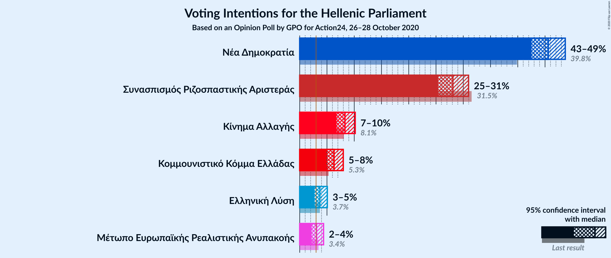

### Confidence Intervals

| Party | Last Result | Poll Result | 80% Confidence Interval | 90% Confidence Interval | 95% Confidence Interval | 99% Confidence Interval |
|:-----:|:-----------:|:-----------:|:-----------------------:|:-----------------------:|:-----------------------:|:-----------------------:|
| Νέα Δημοκρατία | 39.8% | 45.6% | 43.6–47.6% |43.0–48.2% |42.5–48.7% |41.6–49.7% |
| Συνασπισμός Ριζοσπαστικής Αριστεράς | 31.5% | 28.1% | 26.3–30.0% |25.8–30.5% |25.4–31.0% |24.6–31.9% |
| Κίνημα Αλλαγής | 8.1% | 8.3% | 7.3–9.5% |7.0–9.9% |6.7–10.2% |6.3–10.8% |
| Κομμουνιστικό Κόμμα Ελλάδας | 5.3% | 6.3% | 5.4–7.4% |5.2–7.7% |5.0–8.0% |4.6–8.6% |
| Ελληνική Λύση | 3.7% | 3.7% | 3.0–4.6% |2.9–4.8% |2.7–5.1% |2.4–5.5% |
| Μέτωπο Ευρωπαϊκής Ρεαλιστικής Ανυπακοής | 3.4% | 3.1% | 2.5–3.9% |2.3–4.2% |2.2–4.4% |1.9–4.8% |

*Note:* The poll result column reflects the actual value used in the calculations. Published results may vary slightly, and in addition be rounded to fewer digits.

## Seats

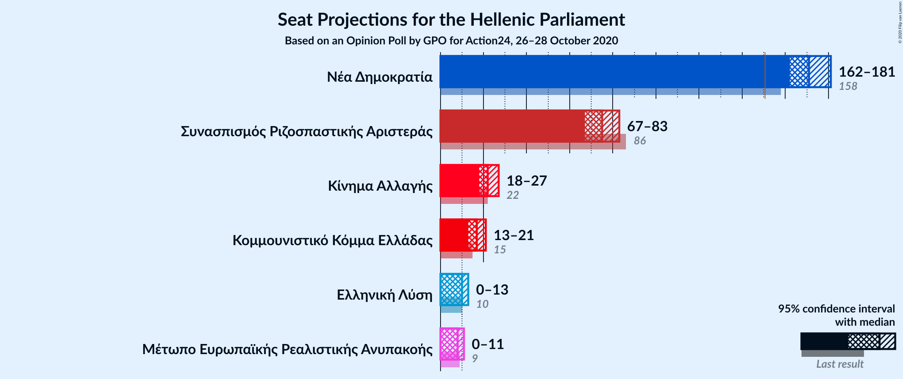

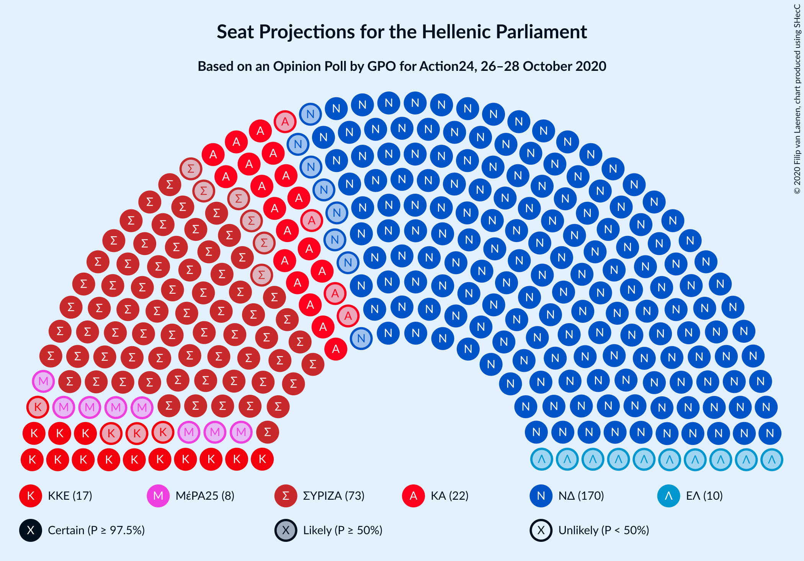

### Confidence Intervals

| Party | Last Result | Median | 80% Confidence Interval | 90% Confidence Interval | 95% Confidence Interval | 99% Confidence Interval |
|:-----:|:-----------:|:------:|:-----------------------:|:-----------------------:|:-----------------------:|:-----------------------:|
| <a href="#νέα-δημοκρατία">Νέα Δημοκρατία</a> | 158 | 171 | 165–177 |163–179 |162–181 |159–184 |
| <a href="#συνασπισμός-ριζοσπαστικής-αριστεράς">Συνασπισμός Ριζοσπαστικής Αριστεράς</a> | 86 | 75 | 70–80 |68–82 |67–83 |65–86 |
| <a href="#κίνημα-αλλαγής">Κίνημα Αλλαγής</a> | 22 | 22 | 19–25 |18–26 |18–27 |17–29 |
| <a href="#κομμουνιστικό-κόμμα-ελλάδας">Κομμουνιστικό Κόμμα Ελλάδας</a> | 15 | 17 | 14–20 |14–21 |13–21 |12–23 |
| <a href="#ελληνική-λύση">Ελληνική Λύση</a> | 10 | 10 | 8–12 |0–13 |0–13 |0–15 |
| <a href="#μέτωπο-ευρωπαϊκής-ρεαλιστικής-ανυπακοής">Μέτωπο Ευρωπαϊκής Ρεαλιστικής Ανυπακοής</a> | 9 | 8 | 0–10 |0–11 |0–11 |0–13 |

### Νέα Δημοκρατία

*For a full overview of the results for this party, see the [Νέα Δημοκρατία](party-νέαδημοκρατία.html) page.*

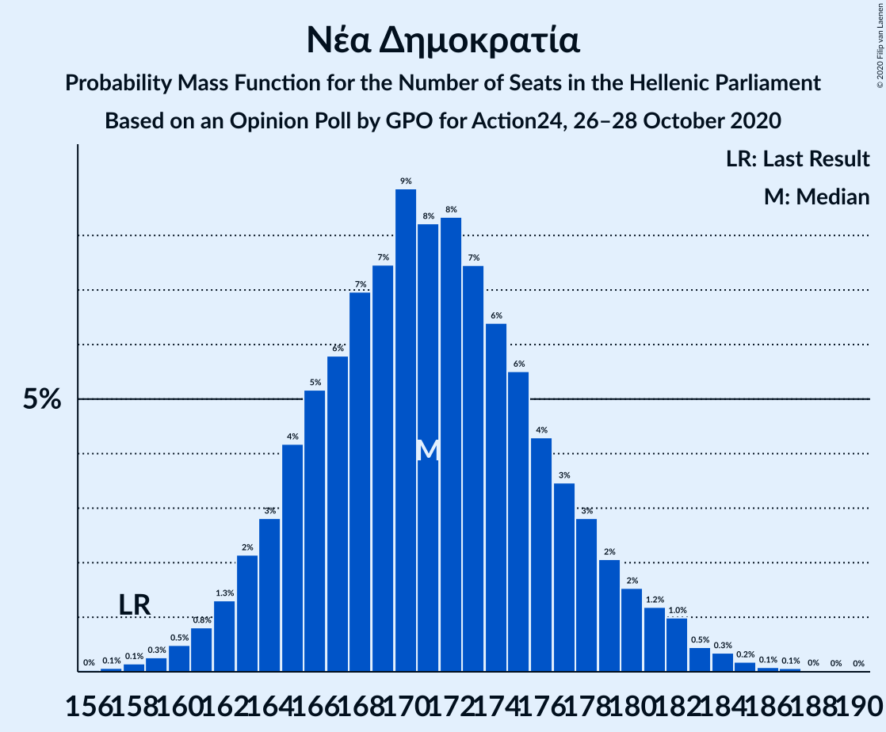

| Number of Seats | Probability | Accumulated | Special Marks |
|:---------------:|:-----------:|:-----------:|:-------------:|
| 156 | 0% | 100% |  |
| 157 | 0.1% | 99.9% |  |
| 158 | 0.1% | 99.9% | Last Result |
| 159 | 0.3% | 99.7% |  |
| 160 | 0.5% | 99.5% |  |
| 161 | 0.8% | 99.0% |  |
| 162 | 1.3% | 98% |  |
| 163 | 2% | 97% |  |
| 164 | 3% | 95% |  |
| 165 | 4% | 92% |  |
| 166 | 5% | 88% |  |
| 167 | 6% | 83% |  |
| 168 | 7% | 77% |  |
| 169 | 7% | 70% |  |
| 170 | 9% | 62% |  |
| 171 | 8% | 53% | Median |
| 172 | 8% | 45% |  |
| 173 | 7% | 37% |  |
| 174 | 6% | 29% |  |
| 175 | 6% | 23% |  |
| 176 | 4% | 18% |  |
| 177 | 3% | 13% |  |
| 178 | 3% | 10% |  |
| 179 | 2% | 7% |  |
| 180 | 2% | 5% |  |
| 181 | 1.2% | 3% |  |
| 182 | 1.0% | 2% |  |
| 183 | 0.5% | 1.2% |  |
| 184 | 0.3% | 0.7% |  |
| 185 | 0.2% | 0.4% |  |
| 186 | 0.1% | 0.2% |  |
| 187 | 0.1% | 0.1% |  |
| 188 | 0% | 0.1% |  |
| 189 | 0% | 0% |  |

### Συνασπισμός Ριζοσπαστικής Αριστεράς

*For a full overview of the results for this party, see the [Συνασπισμός Ριζοσπαστικής Αριστεράς](party-συνασπισμόςριζοσπαστικήςαριστεράς.html) page.*

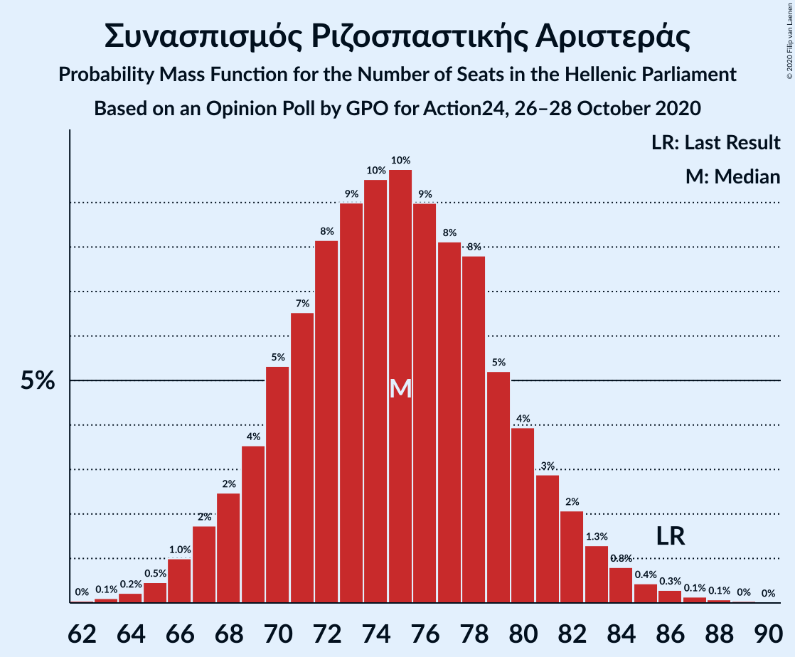

| Number of Seats | Probability | Accumulated | Special Marks |
|:---------------:|:-----------:|:-----------:|:-------------:|
| 62 | 0% | 100% |  |
| 63 | 0.1% | 99.9% |  |
| 64 | 0.2% | 99.8% |  |
| 65 | 0.5% | 99.6% |  |
| 66 | 1.0% | 99.1% |  |
| 67 | 2% | 98% |  |
| 68 | 2% | 96% |  |
| 69 | 4% | 94% |  |
| 70 | 5% | 90% |  |
| 71 | 7% | 85% |  |
| 72 | 8% | 79% |  |
| 73 | 9% | 70% |  |
| 74 | 10% | 61% |  |
| 75 | 10% | 52% | Median |
| 76 | 9% | 42% |  |
| 77 | 8% | 33% |  |
| 78 | 8% | 25% |  |
| 79 | 5% | 17% |  |
| 80 | 4% | 12% |  |
| 81 | 3% | 8% |  |
| 82 | 2% | 5% |  |
| 83 | 1.3% | 3% |  |
| 84 | 0.8% | 2% |  |
| 85 | 0.4% | 1.0% |  |
| 86 | 0.3% | 0.6% | Last Result |
| 87 | 0.1% | 0.3% |  |
| 88 | 0.1% | 0.1% |  |
| 89 | 0% | 0.1% |  |
| 90 | 0% | 0% |  |

### Κίνημα Αλλαγής

*For a full overview of the results for this party, see the [Κίνημα Αλλαγής](party-κίνημααλλαγής.html) page.*

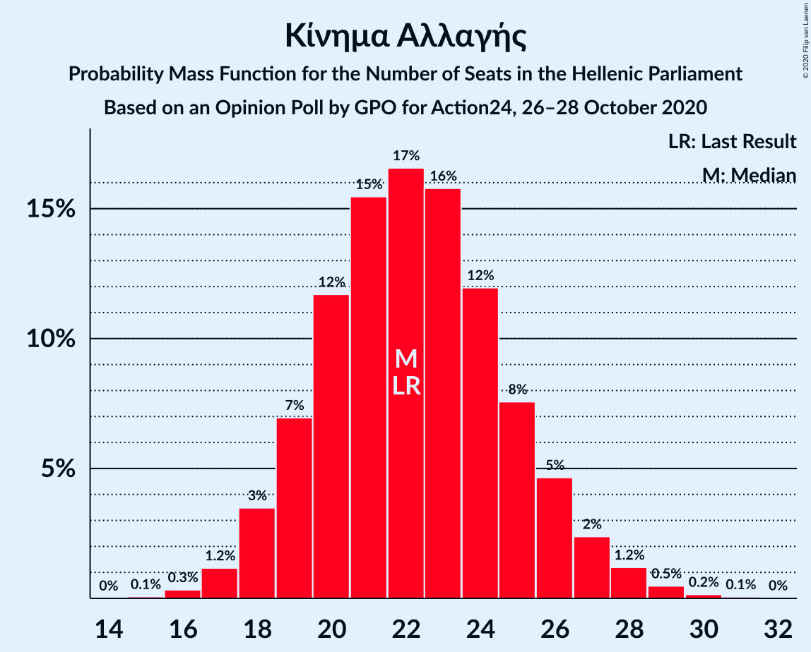

| Number of Seats | Probability | Accumulated | Special Marks |
|:---------------:|:-----------:|:-----------:|:-------------:|
| 15 | 0.1% | 100% |  |
| 16 | 0.3% | 99.9% |  |
| 17 | 1.2% | 99.6% |  |
| 18 | 3% | 98% |  |
| 19 | 7% | 95% |  |
| 20 | 12% | 88% |  |
| 21 | 15% | 76% |  |
| 22 | 17% | 61% | Last Result, Median |
| 23 | 16% | 44% |  |
| 24 | 12% | 28% |  |
| 25 | 8% | 17% |  |
| 26 | 5% | 9% |  |
| 27 | 2% | 4% |  |
| 28 | 1.2% | 2% |  |
| 29 | 0.5% | 0.7% |  |
| 30 | 0.2% | 0.2% |  |
| 31 | 0.1% | 0.1% |  |
| 32 | 0% | 0% |  |

### Κομμουνιστικό Κόμμα Ελλάδας

*For a full overview of the results for this party, see the [Κομμουνιστικό Κόμμα Ελλάδας](party-κομμουνιστικόκόμμαελλάδας.html) page.*

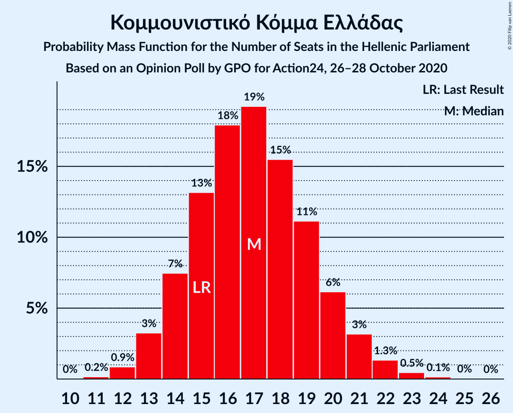

| Number of Seats | Probability | Accumulated | Special Marks |
|:---------------:|:-----------:|:-----------:|:-------------:|
| 11 | 0.2% | 100% |  |
| 12 | 0.9% | 99.8% |  |
| 13 | 3% | 99.0% |  |
| 14 | 7% | 96% |  |
| 15 | 13% | 88% | Last Result |
| 16 | 18% | 75% |  |
| 17 | 19% | 57% | Median |
| 18 | 15% | 38% |  |
| 19 | 11% | 22% |  |
| 20 | 6% | 11% |  |
| 21 | 3% | 5% |  |
| 22 | 1.3% | 2% |  |
| 23 | 0.5% | 0.7% |  |
| 24 | 0.1% | 0.2% |  |
| 25 | 0% | 0.1% |  |
| 26 | 0% | 0% |  |

### Ελληνική Λύση

*For a full overview of the results for this party, see the [Ελληνική Λύση](party-ελληνικήλύση.html) page.*

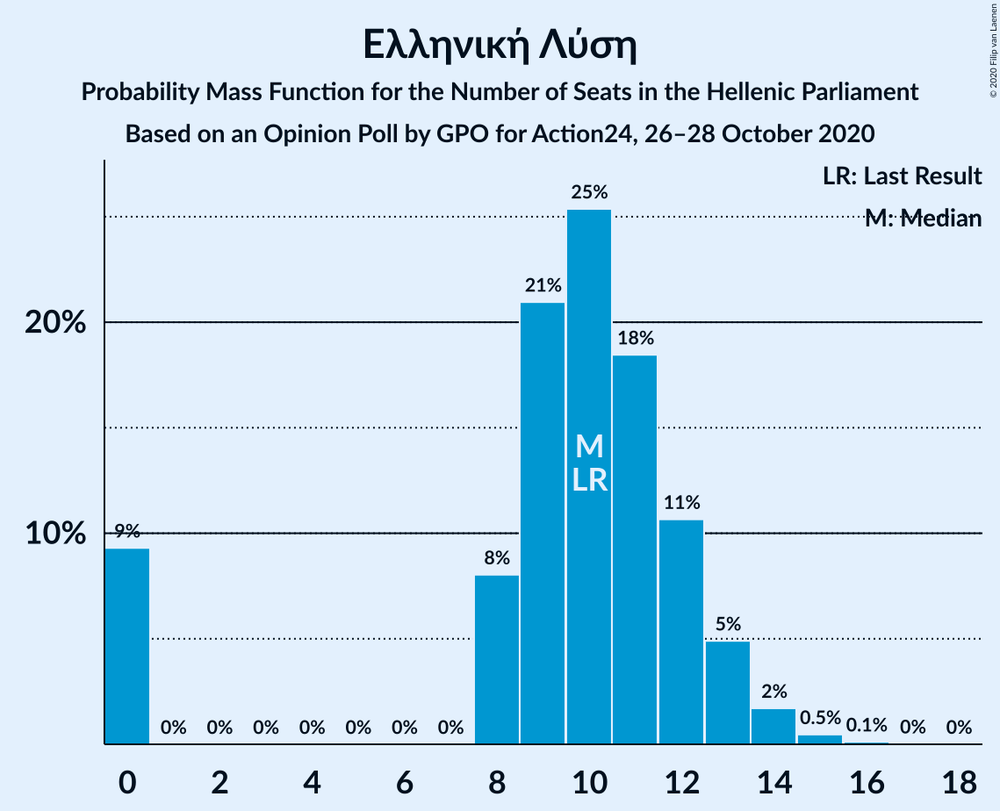

| Number of Seats | Probability | Accumulated | Special Marks |
|:---------------:|:-----------:|:-----------:|:-------------:|
| 0 | 9% | 100% |  |
| 1 | 0% | 91% |  |
| 2 | 0% | 91% |  |
| 3 | 0% | 91% |  |
| 4 | 0% | 91% |  |
| 5 | 0% | 91% |  |
| 6 | 0% | 91% |  |
| 7 | 0% | 91% |  |
| 8 | 8% | 91% |  |
| 9 | 21% | 83% |  |
| 10 | 25% | 62% | Last Result, Median |
| 11 | 18% | 36% |  |
| 12 | 11% | 18% |  |
| 13 | 5% | 7% |  |
| 14 | 2% | 2% |  |
| 15 | 0.5% | 0.6% |  |
| 16 | 0.1% | 0.1% |  |
| 17 | 0% | 0% |  |

### Μέτωπο Ευρωπαϊκής Ρεαλιστικής Ανυπακοής

*For a full overview of the results for this party, see the [Μέτωπο Ευρωπαϊκής Ρεαλιστικής Ανυπακοής](party-μέτωποευρωπαϊκήςρεαλιστικήςανυπακοής.html) page.*

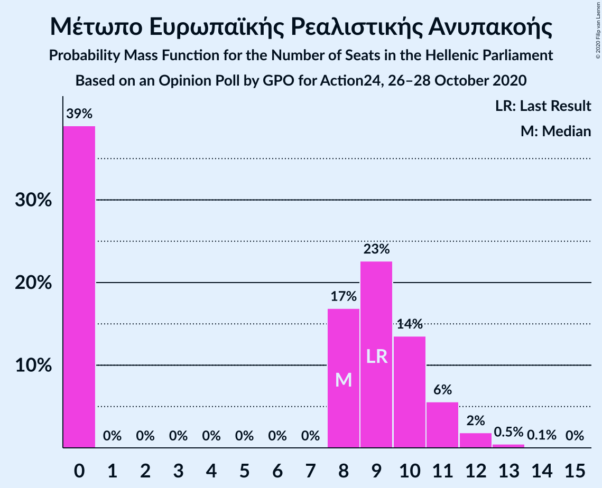

| Number of Seats | Probability | Accumulated | Special Marks |
|:---------------:|:-----------:|:-----------:|:-------------:|
| 0 | 39% | 100% |  |
| 1 | 0% | 61% |  |
| 2 | 0% | 61% |  |
| 3 | 0% | 61% |  |
| 4 | 0% | 61% |  |
| 5 | 0% | 61% |  |
| 6 | 0% | 61% |  |
| 7 | 0% | 61% |  |
| 8 | 17% | 61% | Median |
| 9 | 23% | 44% | Last Result |
| 10 | 14% | 22% |  |
| 11 | 6% | 8% |  |
| 12 | 2% | 2% |  |
| 13 | 0.5% | 0.6% |  |
| 14 | 0.1% | 0.1% |  |
| 15 | 0% | 0% |  |

## Coalitions

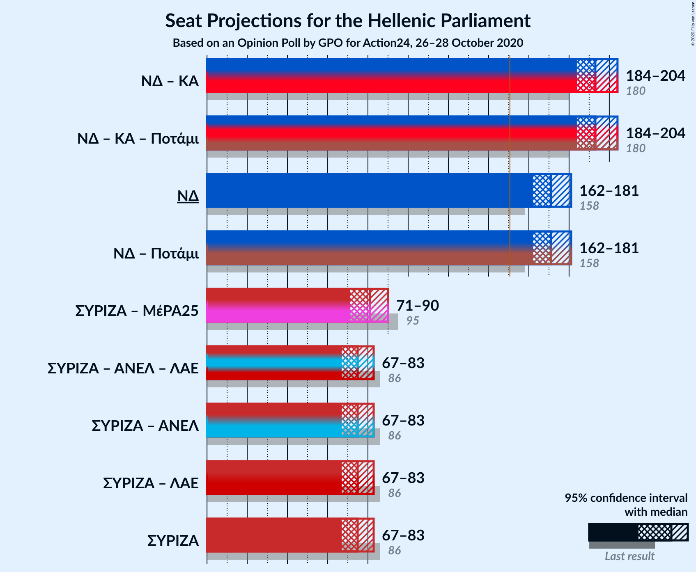

### Confidence Intervals

| Coalition | Last Result | Median | Majority? | 80% Confidence Interval | 90% Confidence Interval | 95% Confidence Interval | 99% Confidence Interval |
|:---------:|:-----------:|:------:|:---------:|:-----------------------:|:-----------------------:|:-----------------------:|:-----------------------:|
| Νέα Δημοκρατία – Κίνημα Αλλαγής | 180 | 193 | 100% | 187–200 | 185–202 | 184–204 | 181–207 |
| Νέα Δημοκρατία | 158 | 171 | 100% | 165–177 | 163–179 | 162–181 | 159–184 |
| Συνασπισμός Ριζοσπαστικής Αριστεράς – Μέτωπο Ευρωπαϊκής Ρεαλιστικής Ανυπακοής | 95 | 81 | 0% | 74–87 | 72–88 | 71–90 | 68–93 |
| Συνασπισμός Ριζοσπαστικής Αριστεράς | 86 | 75 | 0% | 70–80 | 68–82 | 67–83 | 65–86 |

### Νέα Δημοκρατία – Κίνημα Αλλαγής

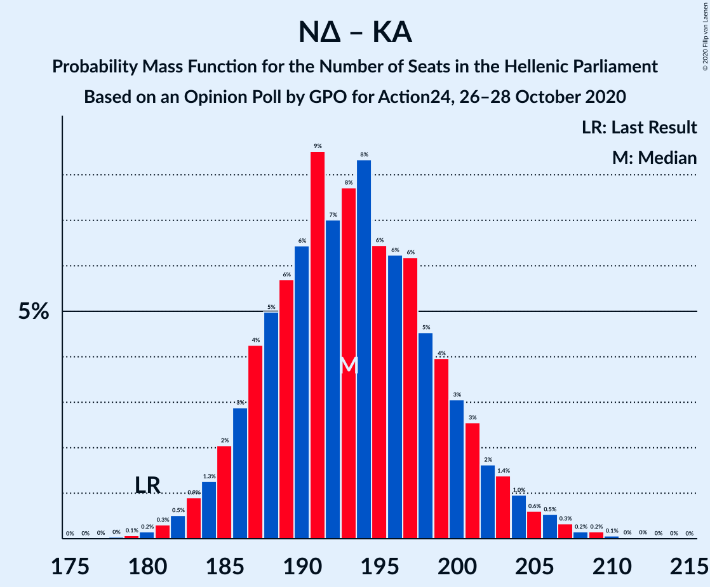

| Number of Seats | Probability | Accumulated | Special Marks |
|:---------------:|:-----------:|:-----------:|:-------------:|
| 178 | 0% | 100% |  |
| 179 | 0.1% | 99.9% |  |
| 180 | 0.2% | 99.9% | Last Result |
| 181 | 0.3% | 99.7% |  |
| 182 | 0.5% | 99.4% |  |
| 183 | 0.9% | 98.9% |  |
| 184 | 1.3% | 98% |  |
| 185 | 2% | 97% |  |
| 186 | 3% | 95% |  |
| 187 | 4% | 92% |  |
| 188 | 5% | 88% |  |
| 189 | 6% | 83% |  |
| 190 | 6% | 77% |  |
| 191 | 9% | 70% |  |
| 192 | 7% | 62% |  |
| 193 | 8% | 55% | Median |
| 194 | 8% | 47% |  |
| 195 | 6% | 39% |  |
| 196 | 6% | 32% |  |
| 197 | 6% | 26% |  |
| 198 | 5% | 20% |  |
| 199 | 4% | 15% |  |
| 200 | 3% | 11% |  |
| 201 | 3% | 8% |  |
| 202 | 2% | 6% |  |
| 203 | 1.4% | 4% |  |
| 204 | 1.0% | 3% |  |
| 205 | 0.6% | 2% |  |
| 206 | 0.5% | 1.3% |  |
| 207 | 0.3% | 0.8% |  |
| 208 | 0.2% | 0.4% |  |
| 209 | 0.2% | 0.3% |  |
| 210 | 0.1% | 0.1% |  |
| 211 | 0% | 0.1% |  |
| 212 | 0% | 0% |  |

### Νέα Δημοκρατία

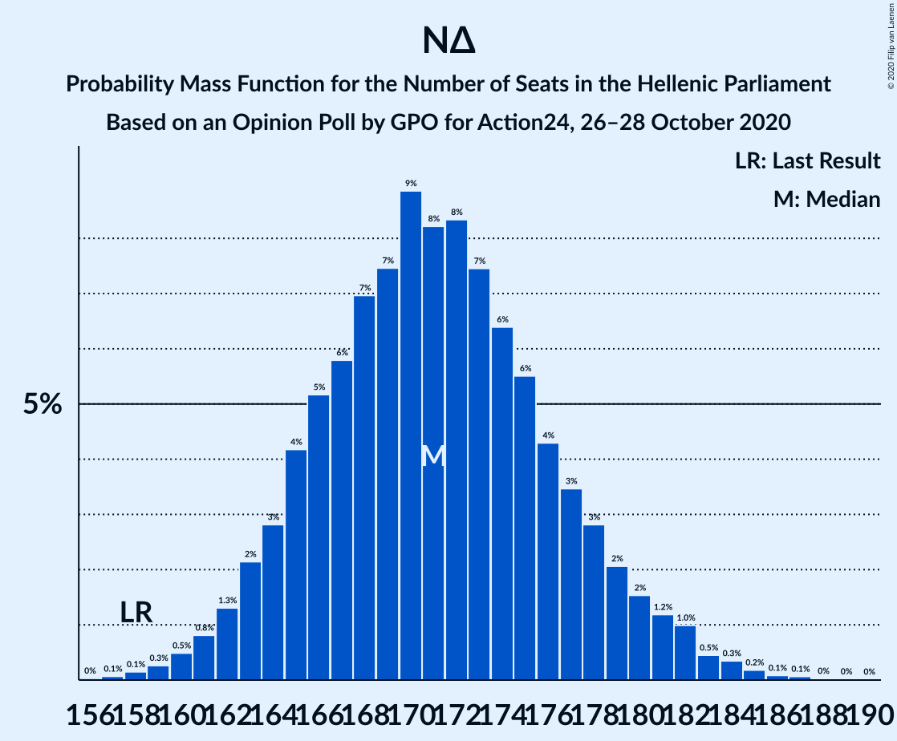

| Number of Seats | Probability | Accumulated | Special Marks |
|:---------------:|:-----------:|:-----------:|:-------------:|
| 156 | 0% | 100% |  |
| 157 | 0.1% | 99.9% |  |
| 158 | 0.1% | 99.9% | Last Result |
| 159 | 0.3% | 99.7% |  |
| 160 | 0.5% | 99.5% |  |
| 161 | 0.8% | 99.0% |  |
| 162 | 1.3% | 98% |  |
| 163 | 2% | 97% |  |
| 164 | 3% | 95% |  |
| 165 | 4% | 92% |  |
| 166 | 5% | 88% |  |
| 167 | 6% | 83% |  |
| 168 | 7% | 77% |  |
| 169 | 7% | 70% |  |
| 170 | 9% | 62% |  |
| 171 | 8% | 53% | Median |
| 172 | 8% | 45% |  |
| 173 | 7% | 37% |  |
| 174 | 6% | 29% |  |
| 175 | 6% | 23% |  |
| 176 | 4% | 18% |  |
| 177 | 3% | 13% |  |
| 178 | 3% | 10% |  |
| 179 | 2% | 7% |  |
| 180 | 2% | 5% |  |
| 181 | 1.2% | 3% |  |
| 182 | 1.0% | 2% |  |
| 183 | 0.5% | 1.2% |  |
| 184 | 0.3% | 0.7% |  |
| 185 | 0.2% | 0.4% |  |
| 186 | 0.1% | 0.2% |  |
| 187 | 0.1% | 0.1% |  |
| 188 | 0% | 0.1% |  |
| 189 | 0% | 0% |  |

### Συνασπισμός Ριζοσπαστικής Αριστεράς – Μέτωπο Ευρωπαϊκής Ρεαλιστικής Ανυπακοής

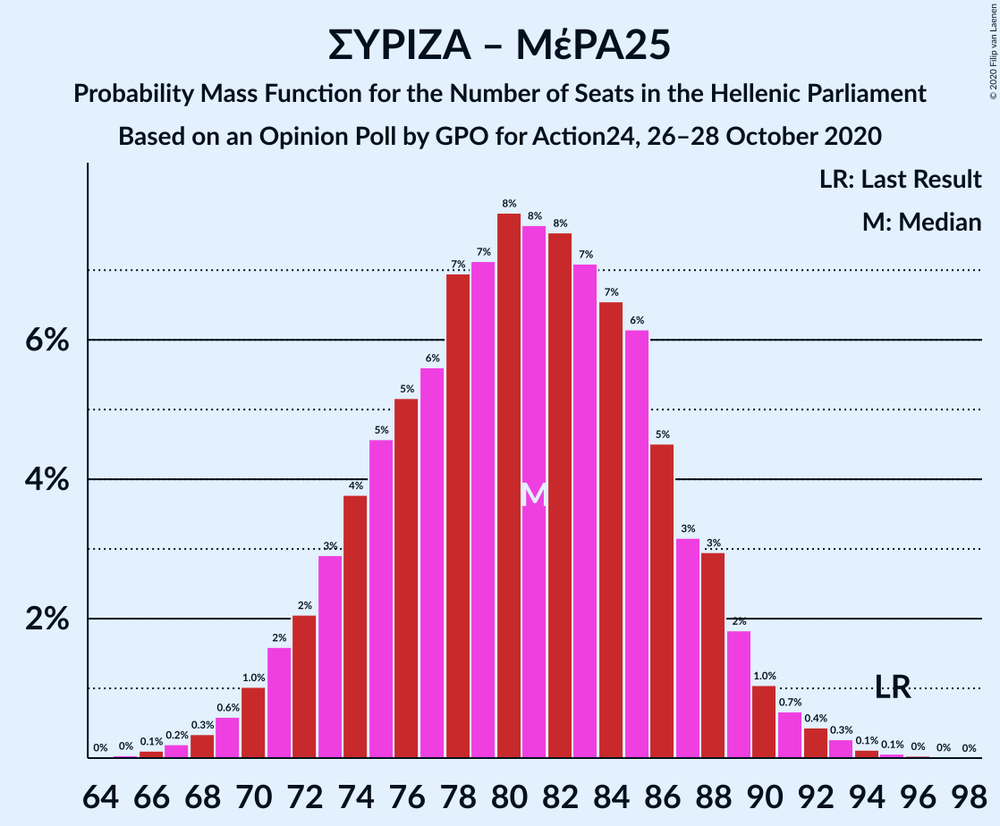

| Number of Seats | Probability | Accumulated | Special Marks |
|:---------------:|:-----------:|:-----------:|:-------------:|
| 65 | 0% | 100% |  |
| 66 | 0.1% | 99.9% |  |
| 67 | 0.2% | 99.8% |  |
| 68 | 0.3% | 99.6% |  |
| 69 | 0.6% | 99.3% |  |
| 70 | 1.0% | 98.7% |  |
| 71 | 2% | 98% |  |
| 72 | 2% | 96% |  |
| 73 | 3% | 94% |  |
| 74 | 4% | 91% |  |
| 75 | 5% | 87% |  |
| 76 | 5% | 83% |  |
| 77 | 6% | 78% |  |
| 78 | 7% | 72% |  |
| 79 | 7% | 65% |  |
| 80 | 8% | 58% |  |
| 81 | 8% | 50% |  |
| 82 | 8% | 42% |  |
| 83 | 7% | 35% | Median |
| 84 | 7% | 28% |  |
| 85 | 6% | 21% |  |
| 86 | 5% | 15% |  |
| 87 | 3% | 11% |  |
| 88 | 3% | 7% |  |
| 89 | 2% | 4% |  |
| 90 | 1.0% | 3% |  |
| 91 | 0.7% | 2% |  |
| 92 | 0.4% | 1.0% |  |
| 93 | 0.3% | 0.5% |  |
| 94 | 0.1% | 0.2% |  |
| 95 | 0.1% | 0.1% | Last Result |
| 96 | 0% | 0.1% |  |
| 97 | 0% | 0% |  |

### Συνασπισμός Ριζοσπαστικής Αριστεράς

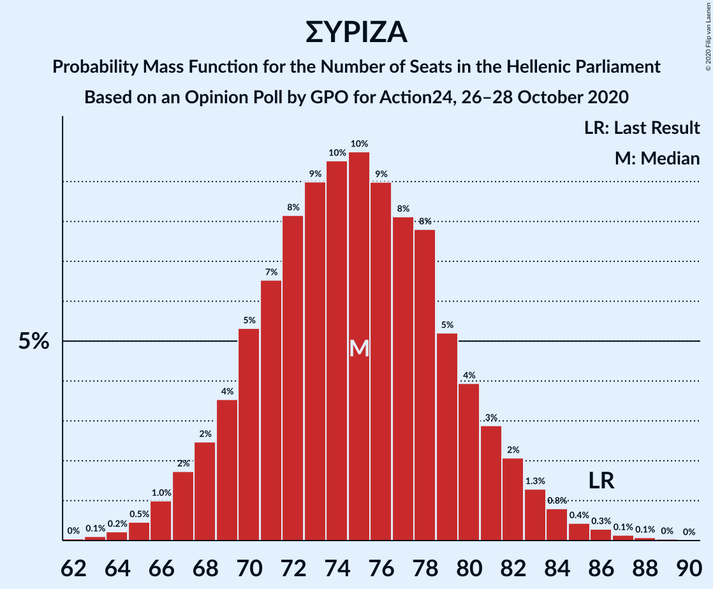

| Number of Seats | Probability | Accumulated | Special Marks |
|:---------------:|:-----------:|:-----------:|:-------------:|
| 62 | 0% | 100% |  |
| 63 | 0.1% | 99.9% |  |
| 64 | 0.2% | 99.8% |  |
| 65 | 0.5% | 99.6% |  |
| 66 | 1.0% | 99.1% |  |
| 67 | 2% | 98% |  |
| 68 | 2% | 96% |  |
| 69 | 4% | 94% |  |
| 70 | 5% | 90% |  |
| 71 | 7% | 85% |  |
| 72 | 8% | 79% |  |
| 73 | 9% | 70% |  |
| 74 | 10% | 61% |  |
| 75 | 10% | 52% | Median |
| 76 | 9% | 42% |  |
| 77 | 8% | 33% |  |
| 78 | 8% | 25% |  |
| 79 | 5% | 17% |  |
| 80 | 4% | 12% |  |
| 81 | 3% | 8% |  |
| 82 | 2% | 5% |  |
| 83 | 1.3% | 3% |  |
| 84 | 0.8% | 2% |  |
| 85 | 0.4% | 1.0% |  |
| 86 | 0.3% | 0.6% | Last Result |
| 87 | 0.1% | 0.3% |  |
| 88 | 0.1% | 0.1% |  |
| 89 | 0% | 0.1% |  |
| 90 | 0% | 0% |  |

## Technical Information

### Opinion Poll

+ **Polling firm:** GPO
+ **Commissioner(s):** Action24
+ **Fieldwork period:** 26–28 October 2020

### Calculations

+ **Sample size:** 1000
+ **Simulations done:** 1,048,576
+ **Error estimate:** 0.61%

