# Opinion Poll by Alco for Open TV, 6–11 November 2020

<a href="#voting-intentions">Voting Intentions</a> | <a href="#seats">Seats</a> | <a href="#coalitions">Coalitions</a> | <a href="#technical-information">Technical Information</a>

## Voting Intentions

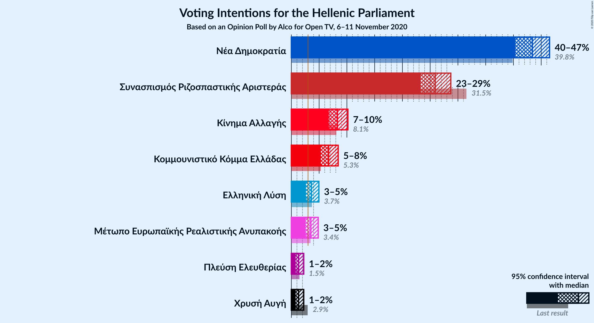

### Confidence Intervals

| Party | Last Result | Poll Result | 80% Confidence Interval | 90% Confidence Interval | 95% Confidence Interval | 99% Confidence Interval |
|:-----:|:-----------:|:-----------:|:-----------------------:|:-----------------------:|:-----------------------:|:-----------------------:|
| Νέα Δημοκρατία | 39.8% | 43.4% | 41.4–45.4% |40.8–46.0% |40.3–46.5% |39.4–47.5% |
| Συνασπισμός Ριζοσπαστικής Αριστεράς | 31.5% | 25.9% | 24.2–27.7% |23.7–28.3% |23.3–28.7% |22.5–29.6% |
| Κίνημα Αλλαγής | 8.1% | 8.3% | 7.3–9.5% |7.0–9.9% |6.7–10.2% |6.3–10.8% |
| Κομμουνιστικό Κόμμα Ελλάδας | 5.3% | 6.7% | 5.8–7.8% |5.5–8.2% |5.3–8.4% |4.9–9.0% |
| Ελληνική Λύση | 3.7% | 3.6% | 2.9–4.5% |2.8–4.7% |2.6–5.0% |2.3–5.4% |
| Μέτωπο Ευρωπαϊκής Ρεαλιστικής Ανυπακοής | 3.4% | 3.5% | 2.9–4.4% |2.7–4.6% |2.5–4.8% |2.2–5.3% |
| Χρυσή Αυγή | 2.9% | 1.3% | 0.9–1.9% |0.8–2.1% |0.8–2.2% |0.6–2.5% |
| Πλεύση Ελευθερίας | 1.5% | 1.3% | 0.9–1.9% |0.8–2.1% |0.8–2.2% |0.6–2.5% |

*Note:* The poll result column reflects the actual value used in the calculations. Published results may vary slightly, and in addition be rounded to fewer digits.

## Seats

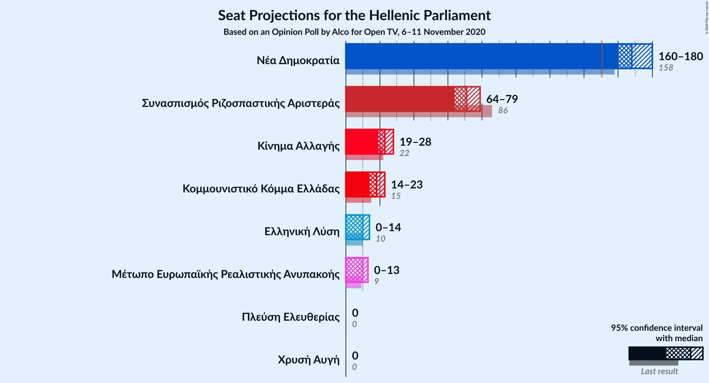

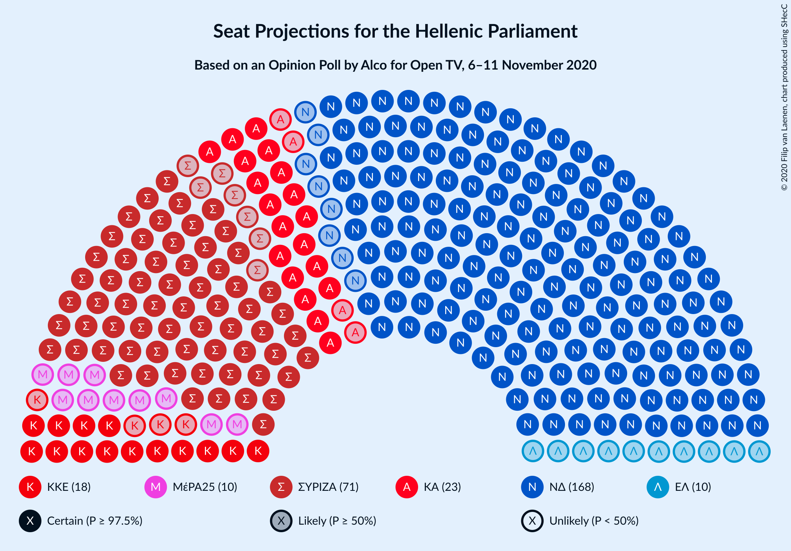

### Confidence Intervals

| Party | Last Result | Median | 80% Confidence Interval | 90% Confidence Interval | 95% Confidence Interval | 99% Confidence Interval |
|:-----:|:-----------:|:------:|:-----------------------:|:-----------------------:|:-----------------------:|:-----------------------:|
| <a href="#νέα-δημοκρατία">Νέα Δημοκρατία</a> | 158 | 168 | 163–176 |161–178 |160–180 |157–183 |
| <a href="#συνασπισμός-ριζοσπαστικής-αριστεράς">Συνασπισμός Ριζοσπαστικής Αριστεράς</a> | 86 | 71 | 66–77 |65–78 |64–79 |61–82 |
| <a href="#κίνημα-αλλαγής">Κίνημα Αλλαγής</a> | 22 | 23 | 20–26 |19–27 |19–28 |17–30 |
| <a href="#κομμουνιστικό-κόμμα-ελλάδας">Κομμουνιστικό Κόμμα Ελλάδας</a> | 15 | 18 | 16–22 |15–23 |14–23 |13–25 |
| <a href="#ελληνική-λύση">Ελληνική Λύση</a> | 10 | 10 | 0–13 |0–13 |0–14 |0–15 |
| <a href="#μέτωπο-ευρωπαϊκής-ρεαλιστικής-ανυπακοής">Μέτωπο Ευρωπαϊκής Ρεαλιστικής Ανυπακοής</a> | 9 | 10 | 0–12 |0–13 |0–13 |0–15 |
| <a href="#χρυσή-αυγή">Χρυσή Αυγή</a> | 0 | 0 | 0 |0 |0 |0 |
| <a href="#πλεύση-ελευθερίας">Πλεύση Ελευθερίας</a> | 0 | 0 | 0 |0 |0 |0 |

### Νέα Δημοκρατία

*For a full overview of the results for this party, see the [Νέα Δημοκρατία](party-νέαδημοκρατία.html) page.*

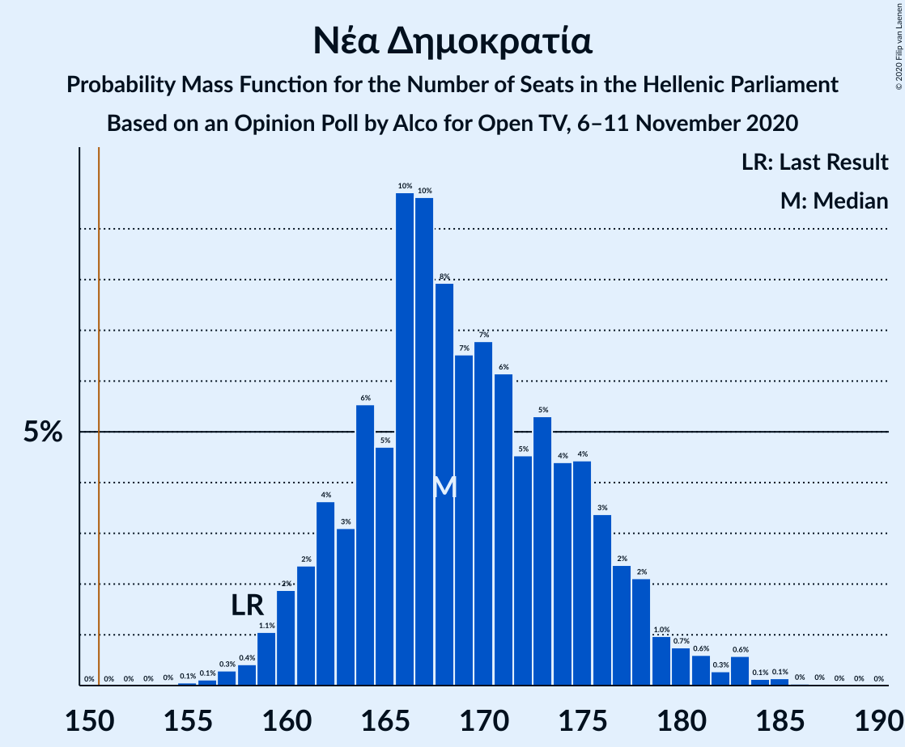

| Number of Seats | Probability | Accumulated | Special Marks |
|:---------------:|:-----------:|:-----------:|:-------------:|
| 155 | 0.1% | 100% |  |
| 156 | 0.1% | 99.9% |  |
| 157 | 0.3% | 99.8% |  |
| 158 | 0.4% | 99.5% | Last Result |
| 159 | 1.1% | 99.1% |  |
| 160 | 2% | 98% |  |
| 161 | 2% | 96% |  |
| 162 | 4% | 94% |  |
| 163 | 3% | 90% |  |
| 164 | 6% | 87% |  |
| 165 | 5% | 82% |  |
| 166 | 10% | 77% |  |
| 167 | 10% | 67% |  |
| 168 | 8% | 57% | Median |
| 169 | 7% | 50% |  |
| 170 | 7% | 43% |  |
| 171 | 6% | 36% |  |
| 172 | 5% | 30% |  |
| 173 | 5% | 26% |  |
| 174 | 4% | 20% |  |
| 175 | 4% | 16% |  |
| 176 | 3% | 11% |  |
| 177 | 2% | 8% |  |
| 178 | 2% | 6% |  |
| 179 | 1.0% | 4% |  |
| 180 | 0.7% | 3% |  |
| 181 | 0.6% | 2% |  |
| 182 | 0.3% | 1.2% |  |
| 183 | 0.6% | 0.9% |  |
| 184 | 0.1% | 0.4% |  |
| 185 | 0.1% | 0.2% |  |
| 186 | 0% | 0.1% |  |
| 187 | 0% | 0.1% |  |
| 188 | 0% | 0% |  |

### Συνασπισμός Ριζοσπαστικής Αριστεράς

*For a full overview of the results for this party, see the [Συνασπισμός Ριζοσπαστικής Αριστεράς](party-συνασπισμόςριζοσπαστικήςαριστεράς.html) page.*

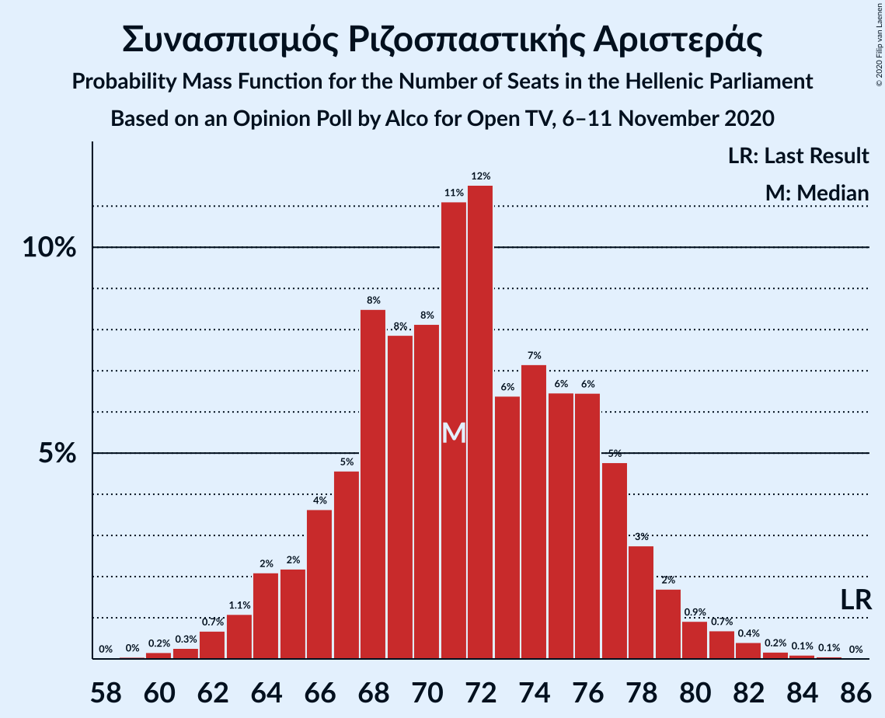

| Number of Seats | Probability | Accumulated | Special Marks |
|:---------------:|:-----------:|:-----------:|:-------------:|
| 59 | 0% | 100% |  |
| 60 | 0.2% | 99.9% |  |
| 61 | 0.3% | 99.8% |  |
| 62 | 0.7% | 99.5% |  |
| 63 | 1.1% | 98.8% |  |
| 64 | 2% | 98% |  |
| 65 | 2% | 96% |  |
| 66 | 4% | 93% |  |
| 67 | 5% | 90% |  |
| 68 | 8% | 85% |  |
| 69 | 8% | 77% |  |
| 70 | 8% | 69% |  |
| 71 | 11% | 61% | Median |
| 72 | 12% | 50% |  |
| 73 | 6% | 38% |  |
| 74 | 7% | 32% |  |
| 75 | 6% | 25% |  |
| 76 | 6% | 18% |  |
| 77 | 5% | 12% |  |
| 78 | 3% | 7% |  |
| 79 | 2% | 4% |  |
| 80 | 0.9% | 2% |  |
| 81 | 0.7% | 1.5% |  |
| 82 | 0.4% | 0.8% |  |
| 83 | 0.2% | 0.4% |  |
| 84 | 0.1% | 0.2% |  |
| 85 | 0.1% | 0.1% |  |
| 86 | 0% | 0% | Last Result |

### Κίνημα Αλλαγής

*For a full overview of the results for this party, see the [Κίνημα Αλλαγής](party-κίνημααλλαγής.html) page.*

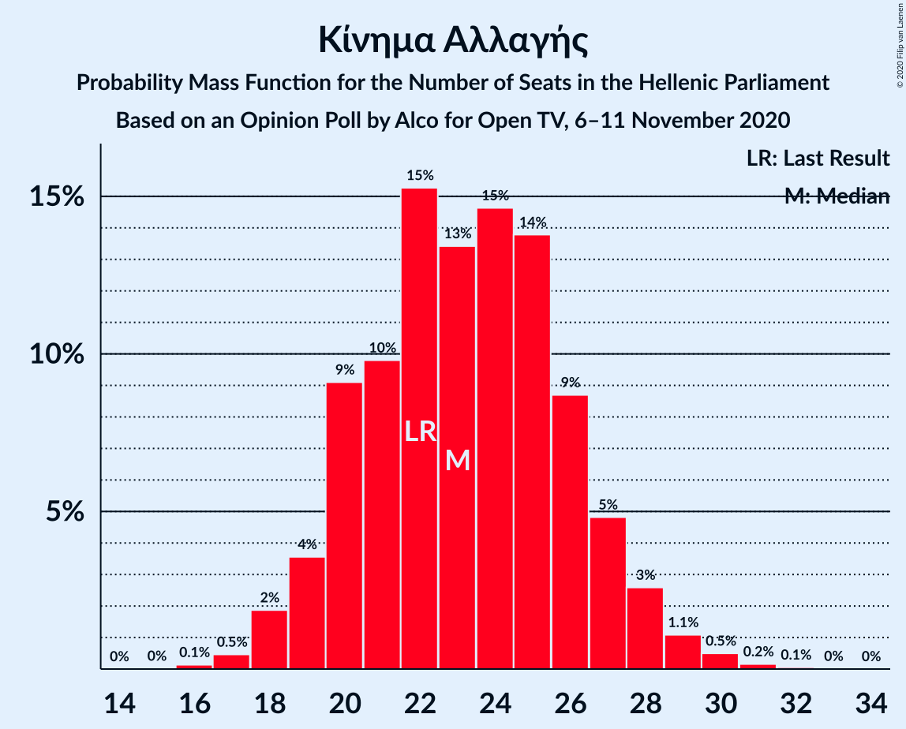

| Number of Seats | Probability | Accumulated | Special Marks |
|:---------------:|:-----------:|:-----------:|:-------------:|
| 16 | 0.1% | 100% |  |
| 17 | 0.5% | 99.8% |  |
| 18 | 2% | 99.4% |  |
| 19 | 4% | 98% |  |
| 20 | 9% | 94% |  |
| 21 | 10% | 85% |  |
| 22 | 15% | 75% | Last Result |
| 23 | 13% | 60% | Median |
| 24 | 15% | 46% |  |
| 25 | 14% | 32% |  |
| 26 | 9% | 18% |  |
| 27 | 5% | 9% |  |
| 28 | 3% | 4% |  |
| 29 | 1.1% | 2% |  |
| 30 | 0.5% | 0.7% |  |
| 31 | 0.2% | 0.2% |  |
| 32 | 0.1% | 0.1% |  |
| 33 | 0% | 0% |  |

### Κομμουνιστικό Κόμμα Ελλάδας

*For a full overview of the results for this party, see the [Κομμουνιστικό Κόμμα Ελλάδας](party-κομμουνιστικόκόμμαελλάδας.html) page.*

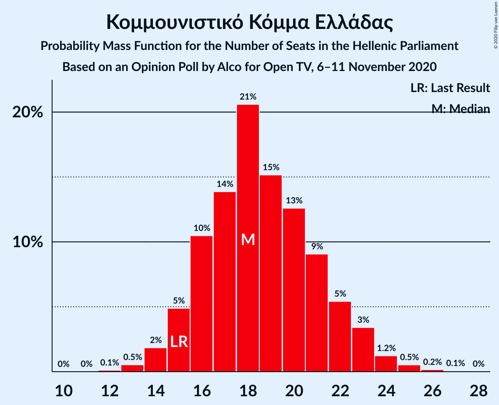

| Number of Seats | Probability | Accumulated | Special Marks |
|:---------------:|:-----------:|:-----------:|:-------------:|
| 12 | 0.1% | 100% |  |
| 13 | 0.5% | 99.9% |  |
| 14 | 2% | 99.3% |  |
| 15 | 5% | 97% | Last Result |
| 16 | 10% | 93% |  |
| 17 | 14% | 82% |  |
| 18 | 21% | 68% | Median |
| 19 | 15% | 48% |  |
| 20 | 13% | 32% |  |
| 21 | 9% | 20% |  |
| 22 | 5% | 11% |  |
| 23 | 3% | 5% |  |
| 24 | 1.2% | 2% |  |
| 25 | 0.5% | 0.8% |  |
| 26 | 0.2% | 0.3% |  |
| 27 | 0.1% | 0.1% |  |
| 28 | 0% | 0% |  |

### Ελληνική Λύση

*For a full overview of the results for this party, see the [Ελληνική Λύση](party-ελληνικήλύση.html) page.*

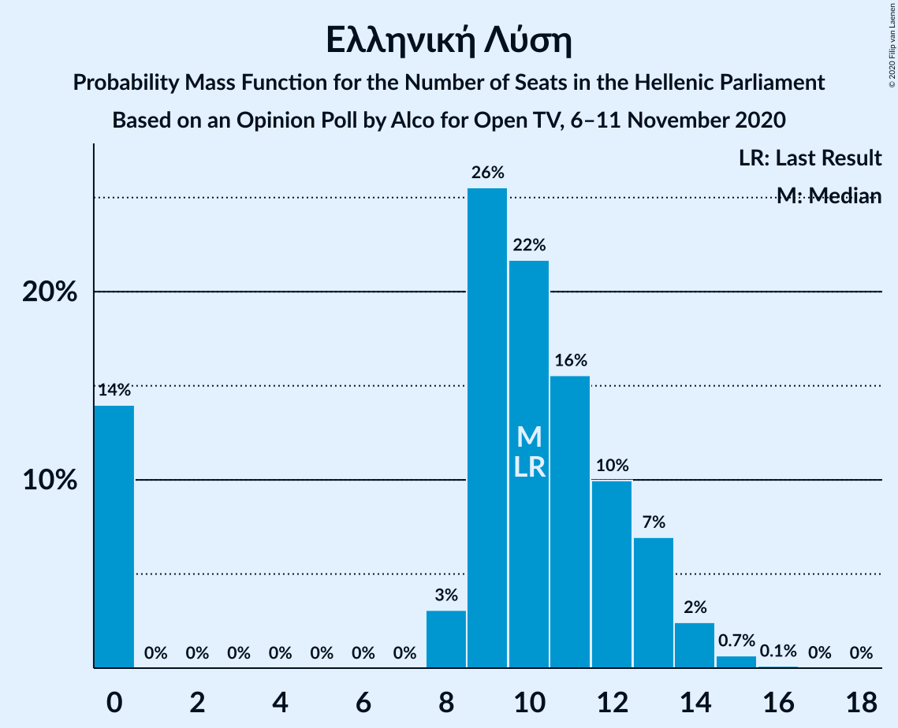

| Number of Seats | Probability | Accumulated | Special Marks |
|:---------------:|:-----------:|:-----------:|:-------------:|
| 0 | 14% | 100% |  |
| 1 | 0% | 86% |  |
| 2 | 0% | 86% |  |
| 3 | 0% | 86% |  |
| 4 | 0% | 86% |  |
| 5 | 0% | 86% |  |
| 6 | 0% | 86% |  |
| 7 | 0% | 86% |  |
| 8 | 3% | 86% |  |
| 9 | 26% | 83% |  |
| 10 | 22% | 57% | Last Result, Median |
| 11 | 16% | 36% |  |
| 12 | 10% | 20% |  |
| 13 | 7% | 10% |  |
| 14 | 2% | 3% |  |
| 15 | 0.7% | 0.8% |  |
| 16 | 0.1% | 0.1% |  |
| 17 | 0% | 0% |  |

### Μέτωπο Ευρωπαϊκής Ρεαλιστικής Ανυπακοής

*For a full overview of the results for this party, see the [Μέτωπο Ευρωπαϊκής Ρεαλιστικής Ανυπακοής](party-μέτωποευρωπαϊκήςρεαλιστικήςανυπακοής.html) page.*

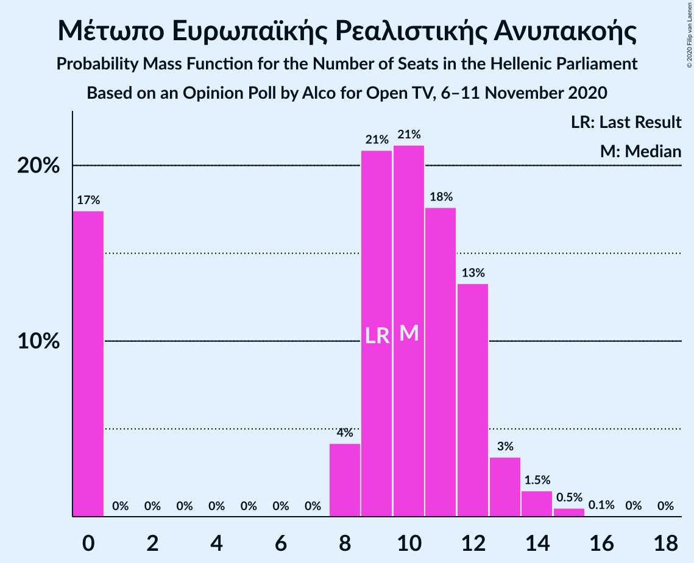

| Number of Seats | Probability | Accumulated | Special Marks |
|:---------------:|:-----------:|:-----------:|:-------------:|
| 0 | 17% | 100% |  |
| 1 | 0% | 83% |  |
| 2 | 0% | 83% |  |
| 3 | 0% | 83% |  |
| 4 | 0% | 83% |  |
| 5 | 0% | 83% |  |
| 6 | 0% | 83% |  |
| 7 | 0% | 83% |  |
| 8 | 4% | 83% |  |
| 9 | 21% | 78% | Last Result |
| 10 | 21% | 58% | Median |
| 11 | 18% | 36% |  |
| 12 | 13% | 19% |  |
| 13 | 3% | 5% |  |
| 14 | 1.5% | 2% |  |
| 15 | 0.5% | 0.6% |  |
| 16 | 0.1% | 0.1% |  |
| 17 | 0% | 0% |  |

### Χρυσή Αυγή

*For a full overview of the results for this party, see the [Χρυσή Αυγή](party-χρυσήαυγή.html) page.*

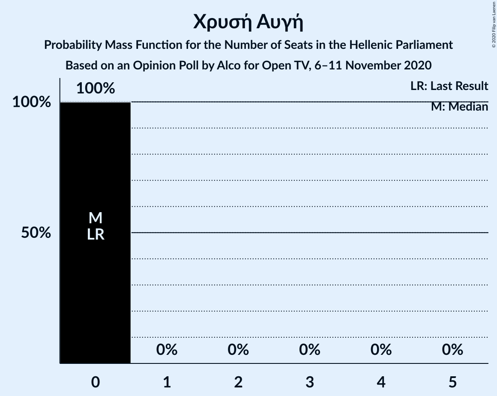

| Number of Seats | Probability | Accumulated | Special Marks |
|:---------------:|:-----------:|:-----------:|:-------------:|
| 0 | 100% | 100% | Last Result, Median |

### Πλεύση Ελευθερίας

*For a full overview of the results for this party, see the [Πλεύση Ελευθερίας](party-πλεύσηελευθερίας.html) page.*

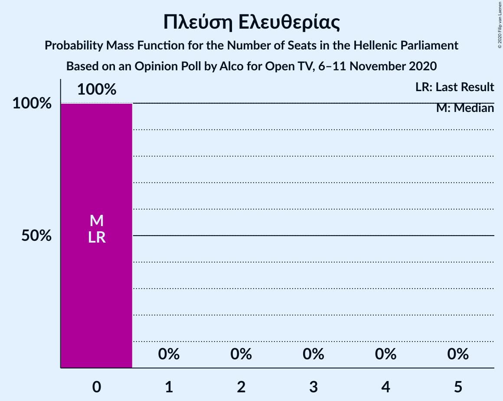

| Number of Seats | Probability | Accumulated | Special Marks |
|:---------------:|:-----------:|:-----------:|:-------------:|
| 0 | 100% | 100% | Last Result, Median |

## Coalitions

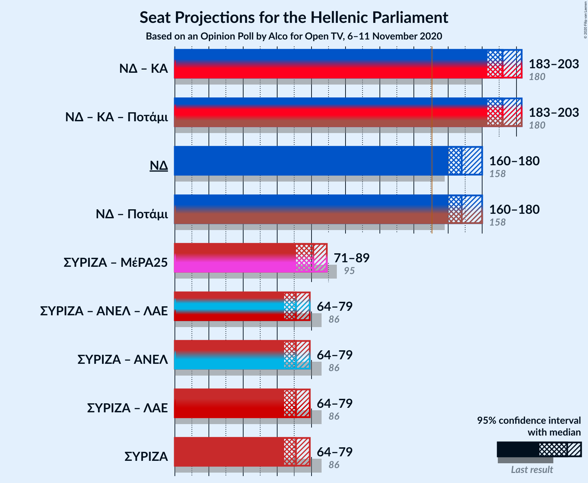

### Confidence Intervals

| Coalition | Last Result | Median | Majority? | 80% Confidence Interval | 90% Confidence Interval | 95% Confidence Interval | 99% Confidence Interval |
|:---------:|:-----------:|:------:|:---------:|:-----------------------:|:-----------------------:|:-----------------------:|:-----------------------:|
| Νέα Δημοκρατία – Κίνημα Αλλαγής | 180 | 192 | 100% | 186–199 | 184–201 | 183–203 | 180–208 |
| Νέα Δημοκρατία | 158 | 168 | 100% | 163–176 | 161–178 | 160–180 | 157–183 |
| Συνασπισμός Ριζοσπαστικής Αριστεράς – Μέτωπο Ευρωπαϊκής Ρεαλιστικής Ανυπακοής | 95 | 81 | 0% | 74–87 | 72–88 | 71–89 | 67–91 |
| Συνασπισμός Ριζοσπαστικής Αριστεράς | 86 | 71 | 0% | 66–77 | 65–78 | 64–79 | 61–82 |

### Νέα Δημοκρατία – Κίνημα Αλλαγής

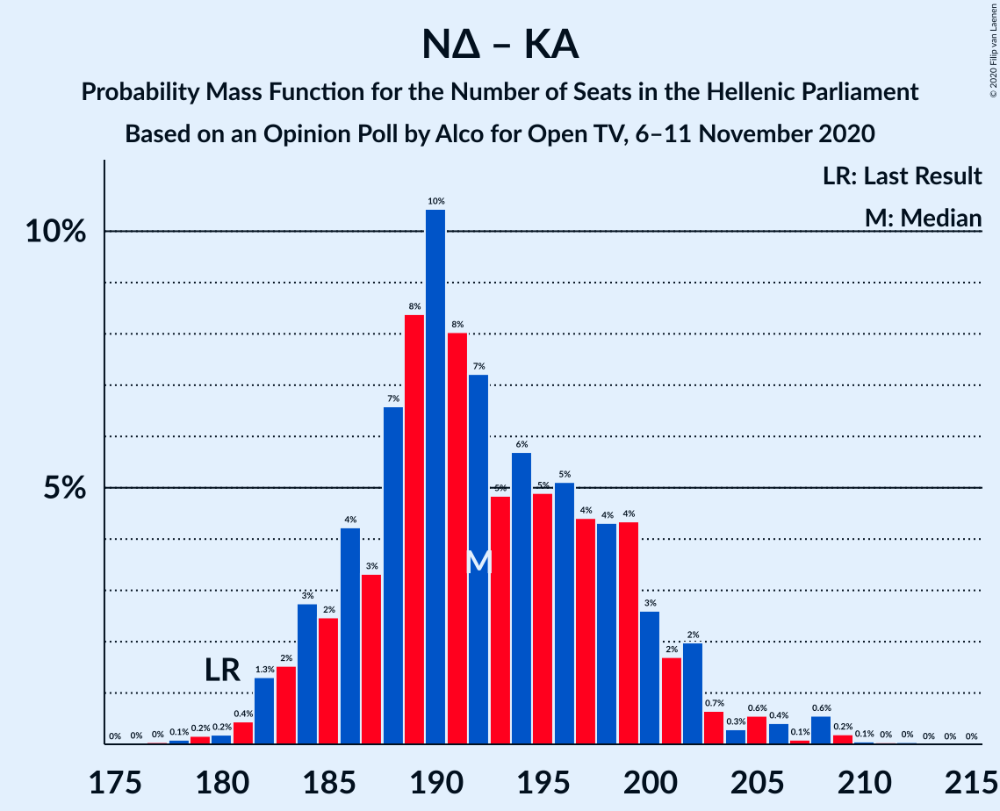

| Number of Seats | Probability | Accumulated | Special Marks |
|:---------------:|:-----------:|:-----------:|:-------------:|
| 177 | 0% | 100% |  |
| 178 | 0.1% | 99.9% |  |
| 179 | 0.2% | 99.8% |  |
| 180 | 0.2% | 99.7% | Last Result |
| 181 | 0.4% | 99.5% |  |
| 182 | 1.3% | 99.1% |  |
| 183 | 2% | 98% |  |
| 184 | 3% | 96% |  |
| 185 | 2% | 93% |  |
| 186 | 4% | 91% |  |
| 187 | 3% | 87% |  |
| 188 | 7% | 83% |  |
| 189 | 8% | 77% |  |
| 190 | 10% | 68% |  |
| 191 | 8% | 58% | Median |
| 192 | 7% | 50% |  |
| 193 | 5% | 43% |  |
| 194 | 6% | 38% |  |
| 195 | 5% | 32% |  |
| 196 | 5% | 27% |  |
| 197 | 4% | 22% |  |
| 198 | 4% | 18% |  |
| 199 | 4% | 14% |  |
| 200 | 3% | 9% |  |
| 201 | 2% | 7% |  |
| 202 | 2% | 5% |  |
| 203 | 0.7% | 3% |  |
| 204 | 0.3% | 2% |  |
| 205 | 0.6% | 2% |  |
| 206 | 0.4% | 1.4% |  |
| 207 | 0.1% | 1.0% |  |
| 208 | 0.6% | 0.9% |  |
| 209 | 0.2% | 0.3% |  |
| 210 | 0.1% | 0.1% |  |
| 211 | 0% | 0.1% |  |
| 212 | 0% | 0.1% |  |
| 213 | 0% | 0% |  |

### Νέα Δημοκρατία

| Number of Seats | Probability | Accumulated | Special Marks |
|:---------------:|:-----------:|:-----------:|:-------------:|
| 155 | 0.1% | 100% |  |
| 156 | 0.1% | 99.9% |  |
| 157 | 0.3% | 99.8% |  |
| 158 | 0.4% | 99.5% | Last Result |
| 159 | 1.1% | 99.1% |  |
| 160 | 2% | 98% |  |
| 161 | 2% | 96% |  |
| 162 | 4% | 94% |  |
| 163 | 3% | 90% |  |
| 164 | 6% | 87% |  |
| 165 | 5% | 82% |  |
| 166 | 10% | 77% |  |
| 167 | 10% | 67% |  |
| 168 | 8% | 57% | Median |
| 169 | 7% | 50% |  |
| 170 | 7% | 43% |  |
| 171 | 6% | 36% |  |
| 172 | 5% | 30% |  |
| 173 | 5% | 26% |  |
| 174 | 4% | 20% |  |
| 175 | 4% | 16% |  |
| 176 | 3% | 11% |  |
| 177 | 2% | 8% |  |
| 178 | 2% | 6% |  |
| 179 | 1.0% | 4% |  |
| 180 | 0.7% | 3% |  |
| 181 | 0.6% | 2% |  |
| 182 | 0.3% | 1.2% |  |
| 183 | 0.6% | 0.9% |  |
| 184 | 0.1% | 0.4% |  |
| 185 | 0.1% | 0.2% |  |
| 186 | 0% | 0.1% |  |
| 187 | 0% | 0.1% |  |
| 188 | 0% | 0% |  |

### Συνασπισμός Ριζοσπαστικής Αριστεράς – Μέτωπο Ευρωπαϊκής Ρεαλιστικής Ανυπακοής

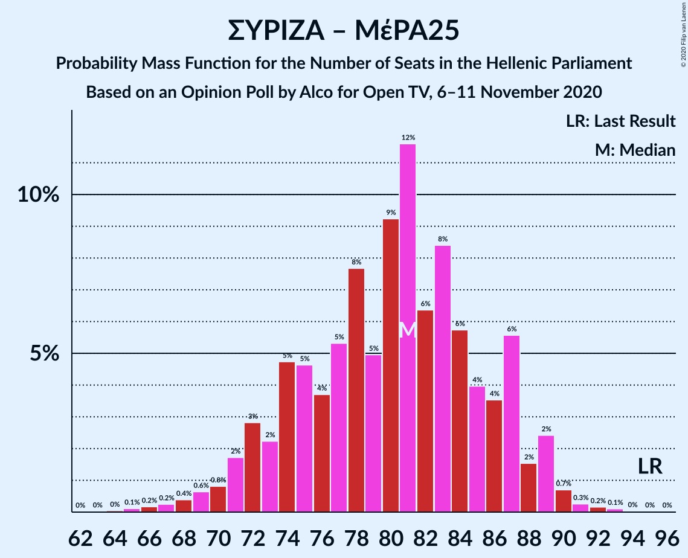

| Number of Seats | Probability | Accumulated | Special Marks |
|:---------------:|:-----------:|:-----------:|:-------------:|
| 63 | 0% | 100% |  |
| 64 | 0% | 99.9% |  |
| 65 | 0.1% | 99.9% |  |
| 66 | 0.2% | 99.8% |  |
| 67 | 0.2% | 99.6% |  |
| 68 | 0.4% | 99.4% |  |
| 69 | 0.6% | 99.0% |  |
| 70 | 0.8% | 98% |  |
| 71 | 2% | 98% |  |
| 72 | 3% | 96% |  |
| 73 | 2% | 93% |  |
| 74 | 5% | 91% |  |
| 75 | 5% | 86% |  |
| 76 | 4% | 81% |  |
| 77 | 5% | 78% |  |
| 78 | 8% | 72% |  |
| 79 | 5% | 65% |  |
| 80 | 9% | 60% |  |
| 81 | 12% | 50% | Median |
| 82 | 6% | 39% |  |
| 83 | 8% | 32% |  |
| 84 | 6% | 24% |  |
| 85 | 4% | 18% |  |
| 86 | 4% | 14% |  |
| 87 | 6% | 11% |  |
| 88 | 2% | 5% |  |
| 89 | 2% | 4% |  |
| 90 | 0.7% | 1.3% |  |
| 91 | 0.3% | 0.6% |  |
| 92 | 0.2% | 0.4% |  |
| 93 | 0.1% | 0.2% |  |
| 94 | 0% | 0.1% |  |
| 95 | 0% | 0.1% | Last Result |
| 96 | 0% | 0% |  |

### Συνασπισμός Ριζοσπαστικής Αριστεράς

| Number of Seats | Probability | Accumulated | Special Marks |
|:---------------:|:-----------:|:-----------:|:-------------:|
| 59 | 0% | 100% |  |
| 60 | 0.2% | 99.9% |  |
| 61 | 0.3% | 99.8% |  |
| 62 | 0.7% | 99.5% |  |
| 63 | 1.1% | 98.8% |  |
| 64 | 2% | 98% |  |
| 65 | 2% | 96% |  |
| 66 | 4% | 93% |  |
| 67 | 5% | 90% |  |
| 68 | 8% | 85% |  |
| 69 | 8% | 77% |  |
| 70 | 8% | 69% |  |
| 71 | 11% | 61% | Median |
| 72 | 12% | 50% |  |
| 73 | 6% | 38% |  |
| 74 | 7% | 32% |  |
| 75 | 6% | 25% |  |
| 76 | 6% | 18% |  |
| 77 | 5% | 12% |  |
| 78 | 3% | 7% |  |
| 79 | 2% | 4% |  |
| 80 | 0.9% | 2% |  |
| 81 | 0.7% | 1.5% |  |
| 82 | 0.4% | 0.8% |  |
| 83 | 0.2% | 0.4% |  |
| 84 | 0.1% | 0.2% |  |
| 85 | 0.1% | 0.1% |  |
| 86 | 0% | 0% | Last Result |

## Technical Information

### Opinion Poll

+ **Polling firm:** Alco
+ **Commissioner(s):** Open TV
+ **Fieldwork period:** 6–11 November 2020

### Calculations

+ **Sample size:** 1000
+ **Simulations done:** 1,048,576
+ **Error estimate:** 2.15%

