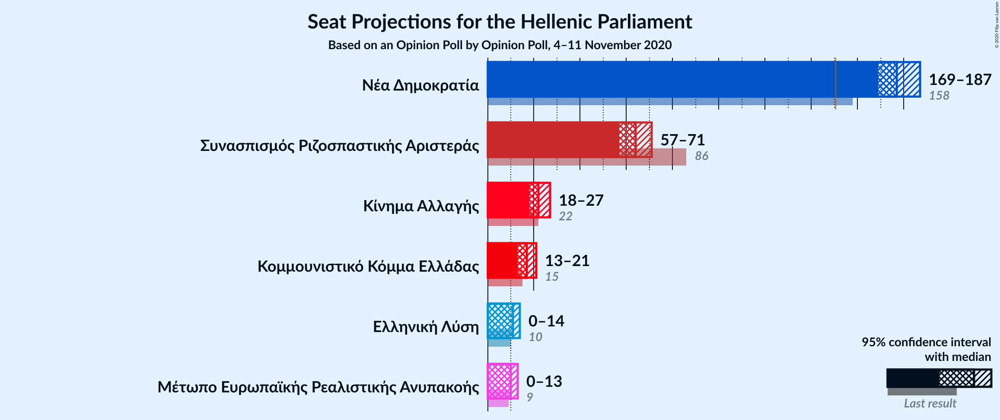
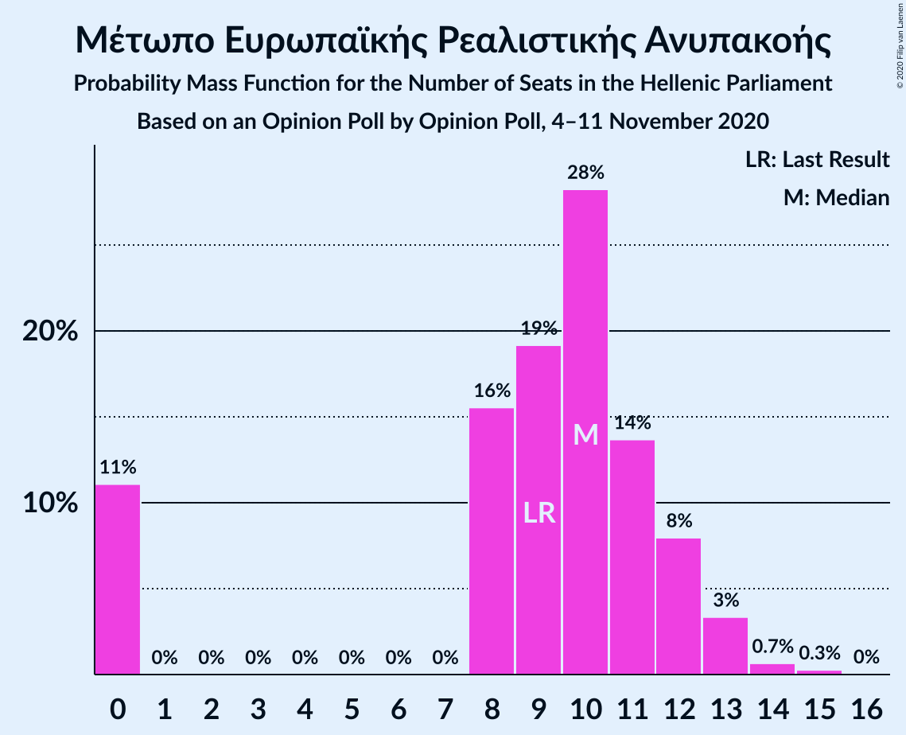

# Opinion Poll by Opinion Poll, 4–11 November 2020

<a href="#voting-intentions">Voting Intentions</a> | <a href="#seats">Seats</a> | <a href="#coalitions">Coalitions</a> | <a href="#technical-information">Technical Information</a>

## Voting Intentions

### Confidence Intervals

| Party | Last Result | Poll Result | 80% Confidence Interval | 90% Confidence Interval | 95% Confidence Interval | 99% Confidence Interval |
|:-----:|:-----------:|:-----------:|:-----------------------:|:-----------------------:|:-----------------------:|:-----------------------:|
| Νέα Δημοκρατία | 39.8% | 48.6% | 46.6–50.6% |46.0–51.2% |45.5–51.7% |44.5–52.7% |
| Συνασπισμός Ριζοσπαστικής Αριστεράς | 31.5% | 24.4% | 22.7–26.2% |22.2–26.7% |21.8–27.2% |21.0–28.0% |
| Κίνημα Αλλαγής | 8.1% | 8.4% | 7.4–9.6% |7.1–10.0% |6.8–10.3% |6.4–10.9% |
| Κομμουνιστικό Κόμμα Ελλάδας | 5.3% | 6.5% | 5.6–7.6% |5.3–7.9% |5.1–8.2% |4.7–8.8% |
| Ελληνική Λύση | 3.7% | 4.0% | 3.3–4.9% |3.1–5.2% |2.9–5.4% |2.7–5.9% |
| Μέτωπο Ευρωπαϊκής Ρεαλιστικής Ανυπακοής | 3.4% | 3.6% | 2.9–4.5% |2.8–4.7% |2.6–5.0% |2.3–5.4% |

*Note:* The poll result column reflects the actual value used in the calculations. Published results may vary slightly, and in addition be rounded to fewer digits.

## Seats

### Confidence Intervals

| Party | Last Result | Median | 80% Confidence Interval | 90% Confidence Interval | 95% Confidence Interval | 99% Confidence Interval |
|:-----:|:-----------:|:------:|:-----------------------:|:-----------------------:|:-----------------------:|:-----------------------:|
| <a href="#νέα-δημοκρατία">Νέα Δημοκρατία</a> | 158 | 177 | 172–182 |170–185 |169–186 |167–190 |
| <a href="#συνασπισμός-ριζοσπαστικής-αριστεράς">Συνασπισμός Ριζοσπαστικής Αριστεράς</a> | 86 | 64 | 59–69 |58–70 |57–71 |55–74 |
| <a href="#κίνημα-αλλαγής">Κίνημα Αλλαγής</a> | 22 | 22 | 20–25 |19–26 |18–27 |17–29 |
| <a href="#κομμουνιστικό-κόμμα-ελλάδας">Κομμουνιστικό Κόμμα Ελλάδας</a> | 15 | 17 | 15–20 |14–21 |14–21 |12–23 |
| <a href="#ελληνική-λύση">Ελληνική Λύση</a> | 10 | 11 | 9–13 |8–14 |0–14 |0–15 |
| <a href="#μέτωπο-ευρωπαϊκής-ρεαλιστικής-ανυπακοής">Μέτωπο Ευρωπαϊκής Ρεαλιστικής Ανυπακοής</a> | 9 | 10 | 0–12 |0–12 |0–13 |0–14 |

### Νέα Δημοκρατία

*For a full overview of the results for this party, see the [Νέα Δημοκρατία](party-νέαδημοκρατία.html) page.*

| Number of Seats | Probability | Accumulated | Special Marks |
|:---------------:|:-----------:|:-----------:|:-------------:|
| 158 | 0% | 100% | Last Result |
| 159 | 0% | 100% |  |
| 160 | 0% | 100% |  |
| 161 | 0% | 100% |  |
| 162 | 0% | 100% |  |
| 163 | 0% | 100% |  |
| 164 | 0.1% | 100% |  |
| 165 | 0.2% | 99.9% |  |
| 166 | 0.2% | 99.7% |  |
| 167 | 0.5% | 99.5% |  |
| 168 | 0.9% | 99.0% |  |
| 169 | 2% | 98% |  |
| 170 | 2% | 96% |  |
| 171 | 3% | 94% |  |
| 172 | 4% | 91% |  |
| 173 | 6% | 87% |  |
| 174 | 8% | 81% |  |
| 175 | 7% | 73% |  |
| 176 | 8% | 66% |  |
| 177 | 11% | 58% | Median |
| 178 | 9% | 47% |  |
| 179 | 9% | 38% |  |
| 180 | 7% | 29% |  |
| 181 | 7% | 22% |  |
| 182 | 5% | 15% |  |
| 183 | 3% | 10% |  |
| 184 | 2% | 7% |  |
| 185 | 2% | 5% |  |
| 186 | 2% | 4% |  |
| 187 | 0.5% | 2% |  |
| 188 | 0.5% | 2% |  |
| 189 | 0.3% | 1.0% |  |
| 190 | 0.3% | 0.7% |  |
| 191 | 0.2% | 0.4% |  |
| 192 | 0.1% | 0.2% |  |
| 193 | 0.1% | 0.1% |  |
| 194 | 0% | 0% |  |

### Συνασπισμός Ριζοσπαστικής Αριστεράς

*For a full overview of the results for this party, see the [Συνασπισμός Ριζοσπαστικής Αριστεράς](party-συνασπισμόςριζοσπαστικήςαριστεράς.html) page.*

| Number of Seats | Probability | Accumulated | Special Marks |
|:---------------:|:-----------:|:-----------:|:-------------:|
| 53 | 0.1% | 100% |  |
| 54 | 0.2% | 99.9% |  |
| 55 | 0.5% | 99.7% |  |
| 56 | 0.8% | 99.3% |  |
| 57 | 1.4% | 98% |  |
| 58 | 4% | 97% |  |
| 59 | 3% | 93% |  |
| 60 | 7% | 90% |  |
| 61 | 8% | 83% |  |
| 62 | 10% | 75% |  |
| 63 | 9% | 65% |  |
| 64 | 13% | 56% | Median |
| 65 | 11% | 43% |  |
| 66 | 8% | 32% |  |
| 67 | 8% | 24% |  |
| 68 | 5% | 16% |  |
| 69 | 4% | 11% |  |
| 70 | 3% | 7% |  |
| 71 | 2% | 4% |  |
| 72 | 0.9% | 2% |  |
| 73 | 0.7% | 1.3% |  |
| 74 | 0.3% | 0.6% |  |
| 75 | 0.2% | 0.3% |  |
| 76 | 0.1% | 0.2% |  |
| 77 | 0.1% | 0.1% |  |
| 78 | 0% | 0% |  |
| 79 | 0% | 0% |  |
| 80 | 0% | 0% |  |
| 81 | 0% | 0% |  |
| 82 | 0% | 0% |  |
| 83 | 0% | 0% |  |
| 84 | 0% | 0% |  |
| 85 | 0% | 0% |  |
| 86 | 0% | 0% | Last Result |

### Κίνημα Αλλαγής

*For a full overview of the results for this party, see the [Κίνημα Αλλαγής](party-κίνημααλλαγής.html) page.*

| Number of Seats | Probability | Accumulated | Special Marks |
|:---------------:|:-----------:|:-----------:|:-------------:|
| 15 | 0.1% | 100% |  |
| 16 | 0.4% | 99.9% |  |
| 17 | 1.1% | 99.6% |  |
| 18 | 3% | 98% |  |
| 19 | 4% | 95% |  |
| 20 | 16% | 91% |  |
| 21 | 18% | 75% |  |
| 22 | 13% | 56% | Last Result, Median |
| 23 | 16% | 43% |  |
| 24 | 9% | 27% |  |
| 25 | 10% | 17% |  |
| 26 | 4% | 7% |  |
| 27 | 2% | 4% |  |
| 28 | 1.0% | 2% |  |
| 29 | 0.4% | 0.5% |  |
| 30 | 0.1% | 0.2% |  |
| 31 | 0% | 0.1% |  |
| 32 | 0% | 0% |  |

### Κομμουνιστικό Κόμμα Ελλάδας

*For a full overview of the results for this party, see the [Κομμουνιστικό Κόμμα Ελλάδας](party-κομμουνιστικόκόμμαελλάδας.html) page.*

| Number of Seats | Probability | Accumulated | Special Marks |
|:---------------:|:-----------:|:-----------:|:-------------:|
| 11 | 0.1% | 100% |  |
| 12 | 0.5% | 99.9% |  |
| 13 | 1.4% | 99.3% |  |
| 14 | 5% | 98% |  |
| 15 | 16% | 93% | Last Result |
| 16 | 22% | 77% |  |
| 17 | 14% | 55% | Median |
| 18 | 11% | 42% |  |
| 19 | 13% | 31% |  |
| 20 | 13% | 18% |  |
| 21 | 3% | 5% |  |
| 22 | 1.3% | 2% |  |
| 23 | 0.5% | 0.9% |  |
| 24 | 0.2% | 0.3% |  |
| 25 | 0.1% | 0.1% |  |
| 26 | 0% | 0% |  |

### Ελληνική Λύση

*For a full overview of the results for this party, see the [Ελληνική Λύση](party-ελληνικήλύση.html) page.*

| Number of Seats | Probability | Accumulated | Special Marks |
|:---------------:|:-----------:|:-----------:|:-------------:|
| 0 | 3% | 100% |  |
| 1 | 0% | 97% |  |
| 2 | 0% | 97% |  |
| 3 | 0% | 97% |  |
| 4 | 0% | 97% |  |
| 5 | 0% | 97% |  |
| 6 | 0% | 97% |  |
| 7 | 0% | 97% |  |
| 8 | 5% | 97% |  |
| 9 | 17% | 92% |  |
| 10 | 24% | 74% | Last Result |
| 11 | 19% | 51% | Median |
| 12 | 16% | 32% |  |
| 13 | 10% | 16% |  |
| 14 | 4% | 5% |  |
| 15 | 1.0% | 1.4% |  |
| 16 | 0.3% | 0.4% |  |
| 17 | 0.1% | 0.1% |  |
| 18 | 0% | 0% |  |

### Μέτωπο Ευρωπαϊκής Ρεαλιστικής Ανυπακοής

*For a full overview of the results for this party, see the [Μέτωπο Ευρωπαϊκής Ρεαλιστικής Ανυπακοής](party-μέτωποευρωπαϊκήςρεαλιστικήςανυπακοής.html) page.*

| Number of Seats | Probability | Accumulated | Special Marks |
|:---------------:|:-----------:|:-----------:|:-------------:|
| 0 | 10% | 100% |  |
| 1 | 0% | 90% |  |
| 2 | 0% | 90% |  |
| 3 | 0% | 90% |  |
| 4 | 0% | 90% |  |
| 5 | 0% | 90% |  |
| 6 | 0% | 90% |  |
| 7 | 0% | 90% |  |
| 8 | 14% | 90% |  |
| 9 | 20% | 75% | Last Result |
| 10 | 29% | 56% | Median |
| 11 | 14% | 26% |  |
| 12 | 8% | 12% |  |
| 13 | 3% | 4% |  |
| 14 | 0.7% | 1.0% |  |
| 15 | 0.3% | 0.3% |  |
| 16 | 0% | 0% |  |

## Coalitions

### Confidence Intervals

| Coalition | Last Result | Median | Majority? | 80% Confidence Interval | 90% Confidence Interval | 95% Confidence Interval | 99% Confidence Interval |
|:---------:|:-----------:|:------:|:---------:|:-----------------------:|:-----------------------:|:-----------------------:|:-----------------------:|
| Νέα Δημοκρατία – Κίνημα Αλλαγής | 180 | 199 | 100% | 194–205 | 192–207 | 191–209 | 189–213 |
| Νέα Δημοκρατία | 158 | 177 | 100% | 172–182 | 170–185 | 169–186 | 167–190 |
| Συνασπισμός Ριζοσπαστικής Αριστεράς – Μέτωπο Ευρωπαϊκής Ρεαλιστικής Ανυπακοής | 95 | 73 | 0% | 68–78 | 65–79 | 63–81 | 60–83 |
| Συνασπισμός Ριζοσπαστικής Αριστεράς | 86 | 64 | 0% | 59–69 | 58–70 | 57–71 | 55–74 |

### Νέα Δημοκρατία – Κίνημα Αλλαγής

| Number of Seats | Probability | Accumulated | Special Marks |
|:---------------:|:-----------:|:-----------:|:-------------:|
| 180 | 0% | 100% | Last Result |
| 181 | 0% | 100% |  |
| 182 | 0% | 100% |  |
| 183 | 0% | 100% |  |
| 184 | 0% | 100% |  |
| 185 | 0% | 100% |  |
| 186 | 0.1% | 100% |  |
| 187 | 0.2% | 99.9% |  |
| 188 | 0.2% | 99.7% |  |
| 189 | 0.3% | 99.5% |  |
| 190 | 0.7% | 99.2% |  |
| 191 | 2% | 98.6% |  |
| 192 | 2% | 97% |  |
| 193 | 3% | 95% |  |
| 194 | 4% | 92% |  |
| 195 | 5% | 88% |  |
| 196 | 9% | 83% |  |
| 197 | 7% | 74% |  |
| 198 | 9% | 68% |  |
| 199 | 11% | 59% | Median |
| 200 | 11% | 48% |  |
| 201 | 6% | 37% |  |
| 202 | 10% | 31% |  |
| 203 | 6% | 21% |  |
| 204 | 5% | 15% |  |
| 205 | 3% | 11% |  |
| 206 | 1.3% | 7% |  |
| 207 | 2% | 6% |  |
| 208 | 1.4% | 4% |  |
| 209 | 0.9% | 3% |  |
| 210 | 1.0% | 2% |  |
| 211 | 0.2% | 1.1% |  |
| 212 | 0.4% | 0.9% |  |
| 213 | 0.3% | 0.5% |  |
| 214 | 0.1% | 0.2% |  |
| 215 | 0% | 0.1% |  |
| 216 | 0.1% | 0.1% |  |
| 217 | 0% | 0% |  |

### Νέα Δημοκρατία

| Number of Seats | Probability | Accumulated | Special Marks |
|:---------------:|:-----------:|:-----------:|:-------------:|
| 158 | 0% | 100% | Last Result |
| 159 | 0% | 100% |  |
| 160 | 0% | 100% |  |
| 161 | 0% | 100% |  |
| 162 | 0% | 100% |  |
| 163 | 0% | 100% |  |
| 164 | 0.1% | 100% |  |
| 165 | 0.2% | 99.9% |  |
| 166 | 0.2% | 99.7% |  |
| 167 | 0.5% | 99.5% |  |
| 168 | 0.9% | 99.0% |  |
| 169 | 2% | 98% |  |
| 170 | 2% | 96% |  |
| 171 | 3% | 94% |  |
| 172 | 4% | 91% |  |
| 173 | 6% | 87% |  |
| 174 | 8% | 81% |  |
| 175 | 7% | 73% |  |
| 176 | 8% | 66% |  |
| 177 | 11% | 58% | Median |
| 178 | 9% | 47% |  |
| 179 | 9% | 38% |  |
| 180 | 7% | 29% |  |
| 181 | 7% | 22% |  |
| 182 | 5% | 15% |  |
| 183 | 3% | 10% |  |
| 184 | 2% | 7% |  |
| 185 | 2% | 5% |  |
| 186 | 2% | 4% |  |
| 187 | 0.5% | 2% |  |
| 188 | 0.5% | 2% |  |
| 189 | 0.3% | 1.0% |  |
| 190 | 0.3% | 0.7% |  |
| 191 | 0.2% | 0.4% |  |
| 192 | 0.1% | 0.2% |  |
| 193 | 0.1% | 0.1% |  |
| 194 | 0% | 0% |  |

### Συνασπισμός Ριζοσπαστικής Αριστεράς – Μέτωπο Ευρωπαϊκής Ρεαλιστικής Ανυπακοής

| Number of Seats | Probability | Accumulated | Special Marks |
|:---------------:|:-----------:|:-----------:|:-------------:|
| 57 | 0% | 100% |  |
| 58 | 0.1% | 99.9% |  |
| 59 | 0.1% | 99.9% |  |
| 60 | 0.4% | 99.7% |  |
| 61 | 0.3% | 99.3% |  |
| 62 | 0.8% | 99.1% |  |
| 63 | 0.9% | 98% |  |
| 64 | 0.9% | 97% |  |
| 65 | 2% | 97% |  |
| 66 | 2% | 95% |  |
| 67 | 3% | 93% |  |
| 68 | 4% | 90% |  |
| 69 | 6% | 86% |  |
| 70 | 6% | 80% |  |
| 71 | 5% | 74% |  |
| 72 | 12% | 69% |  |
| 73 | 10% | 57% |  |
| 74 | 9% | 47% | Median |
| 75 | 12% | 37% |  |
| 76 | 9% | 26% |  |
| 77 | 4% | 16% |  |
| 78 | 4% | 12% |  |
| 79 | 4% | 9% |  |
| 80 | 2% | 4% |  |
| 81 | 1.3% | 3% |  |
| 82 | 0.6% | 1.4% |  |
| 83 | 0.3% | 0.8% |  |
| 84 | 0.2% | 0.4% |  |
| 85 | 0.1% | 0.2% |  |
| 86 | 0.1% | 0.1% |  |
| 87 | 0% | 0% |  |
| 88 | 0% | 0% |  |
| 89 | 0% | 0% |  |
| 90 | 0% | 0% |  |
| 91 | 0% | 0% |  |
| 92 | 0% | 0% |  |
| 93 | 0% | 0% |  |
| 94 | 0% | 0% |  |
| 95 | 0% | 0% | Last Result |

### Συνασπισμός Ριζοσπαστικής Αριστεράς

| Number of Seats | Probability | Accumulated | Special Marks |
|:---------------:|:-----------:|:-----------:|:-------------:|
| 53 | 0.1% | 100% |  |
| 54 | 0.2% | 99.9% |  |
| 55 | 0.5% | 99.7% |  |
| 56 | 0.8% | 99.3% |  |
| 57 | 1.4% | 98% |  |
| 58 | 4% | 97% |  |
| 59 | 3% | 93% |  |
| 60 | 7% | 90% |  |
| 61 | 8% | 83% |  |
| 62 | 10% | 75% |  |
| 63 | 9% | 65% |  |
| 64 | 13% | 56% | Median |
| 65 | 11% | 43% |  |
| 66 | 8% | 32% |  |
| 67 | 8% | 24% |  |
| 68 | 5% | 16% |  |
| 69 | 4% | 11% |  |
| 70 | 3% | 7% |  |
| 71 | 2% | 4% |  |
| 72 | 0.9% | 2% |  |
| 73 | 0.7% | 1.3% |  |
| 74 | 0.3% | 0.6% |  |
| 75 | 0.2% | 0.3% |  |
| 76 | 0.1% | 0.2% |  |
| 77 | 0.1% | 0.1% |  |
| 78 | 0% | 0% |  |
| 79 | 0% | 0% |  |
| 80 | 0% | 0% |  |
| 81 | 0% | 0% |  |
| 82 | 0% | 0% |  |
| 83 | 0% | 0% |  |
| 84 | 0% | 0% |  |
| 85 | 0% | 0% |  |
| 86 | 0% | 0% | Last Result |

## Technical Information

### Opinion Poll

+ **Polling firm:** Opinion Poll
+ **Commissioner(s):** —
+ **Fieldwork period:** 4–11 November 2020

### Calculations

+ **Sample size:** 1000
+ **Simulations done:** 131,072
+ **Error estimate:** 1.11%

