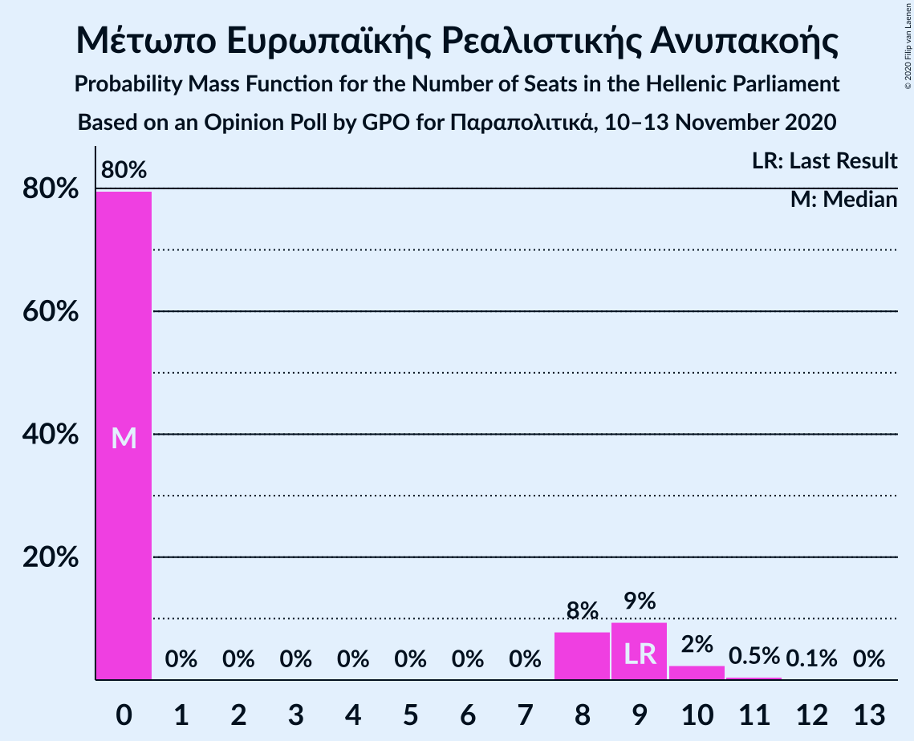

# Opinion Poll by GPO for Παραπολιτικά, 10–13 November 2020

<a href="#voting-intentions">Voting Intentions</a> | <a href="#seats">Seats</a> | <a href="#coalitions">Coalitions</a> | <a href="#technical-information">Technical Information</a>

## Voting Intentions

### Confidence Intervals

| Party | Last Result | Poll Result | 80% Confidence Interval | 90% Confidence Interval | 95% Confidence Interval | 99% Confidence Interval |
|:-----:|:-----------:|:-----------:|:-----------------------:|:-----------------------:|:-----------------------:|:-----------------------:|
| Νέα Δημοκρατία | 39.8% | 44.5% | 42.5–46.5% |41.9–47.1% |41.4–47.6% |40.5–48.6% |
| Συνασπισμός Ριζοσπαστικής Αριστεράς | 31.5% | 28.9% | 27.1–30.8% |26.6–31.3% |26.2–31.8% |25.3–32.7% |
| Κίνημα Αλλαγής | 8.1% | 7.6% | 6.6–8.8% |6.3–9.1% |6.1–9.4% |5.7–10.0% |
| Κομμουνιστικό Κόμμα Ελλάδας | 5.3% | 6.5% | 5.6–7.6% |5.3–7.9% |5.1–8.2% |4.7–8.8% |
| Ελληνική Λύση | 3.7% | 4.3% | 3.6–5.2% |3.4–5.5% |3.2–5.7% |2.9–6.2% |
| Μέτωπο Ευρωπαϊκής Ρεαλιστικής Ανυπακοής | 3.4% | 2.5% | 2.0–3.3% |1.8–3.5% |1.7–3.7% |1.5–4.1% |

*Note:* The poll result column reflects the actual value used in the calculations. Published results may vary slightly, and in addition be rounded to fewer digits.

## Seats

### Confidence Intervals

| Party | Last Result | Median | 80% Confidence Interval | 90% Confidence Interval | 95% Confidence Interval | 99% Confidence Interval |
|:-----:|:-----------:|:------:|:-----------------------:|:-----------------------:|:-----------------------:|:-----------------------:|
| <a href="#νέα-δημοκρατία">Νέα Δημοκρατία</a> | 158 | 170 | 165–176 |163–177 |161–179 |159–181 |
| <a href="#συνασπισμός-ριζοσπαστικής-αριστεράς">Συνασπισμός Ριζοσπαστικής Αριστεράς</a> | 86 | 78 | 73–83 |72–84 |70–86 |68–88 |
| <a href="#κίνημα-αλλαγής">Κίνημα Αλλαγής</a> | 22 | 21 | 18–24 |17–25 |17–26 |15–27 |
| <a href="#κομμουνιστικό-κόμμα-ελλάδας">Κομμουνιστικό Κόμμα Ελλάδας</a> | 15 | 18 | 15–20 |14–21 |14–22 |13–24 |
| <a href="#ελληνική-λύση">Ελληνική Λύση</a> | 10 | 12 | 10–14 |9–15 |9–15 |0–17 |
| <a href="#μέτωπο-ευρωπαϊκής-ρεαλιστικής-ανυπακοής">Μέτωπο Ευρωπαϊκής Ρεαλιστικής Ανυπακοής</a> | 9 | 0 | 0–8 |0–9 |0–9 |0–11 |

### Νέα Δημοκρατία

*For a full overview of the results for this party, see the [Νέα Δημοκρατία](party-νέαδημοκρατία.html) page.*

| Number of Seats | Probability | Accumulated | Special Marks |
|:---------------:|:-----------:|:-----------:|:-------------:|
| 155 | 0% | 100% |  |
| 156 | 0.1% | 99.9% |  |
| 157 | 0.1% | 99.9% |  |
| 158 | 0.2% | 99.8% | Last Result |
| 159 | 0.5% | 99.6% |  |
| 160 | 0.5% | 99.1% |  |
| 161 | 1.3% | 98.6% |  |
| 162 | 1.3% | 97% |  |
| 163 | 1.5% | 96% |  |
| 164 | 3% | 95% |  |
| 165 | 3% | 91% |  |
| 166 | 5% | 89% |  |
| 167 | 7% | 84% |  |
| 168 | 8% | 77% |  |
| 169 | 11% | 69% |  |
| 170 | 9% | 59% | Median |
| 171 | 10% | 49% |  |
| 172 | 9% | 39% |  |
| 173 | 7% | 30% |  |
| 174 | 6% | 23% |  |
| 175 | 6% | 17% |  |
| 176 | 4% | 11% |  |
| 177 | 3% | 7% |  |
| 178 | 2% | 5% |  |
| 179 | 2% | 3% |  |
| 180 | 0.5% | 1.3% |  |
| 181 | 0.4% | 0.8% |  |
| 182 | 0.2% | 0.4% |  |
| 183 | 0.1% | 0.2% |  |
| 184 | 0.1% | 0.1% |  |
| 185 | 0% | 0.1% |  |
| 186 | 0% | 0% |  |

### Συνασπισμός Ριζοσπαστικής Αριστεράς

*For a full overview of the results for this party, see the [Συνασπισμός Ριζοσπαστικής Αριστεράς](party-συνασπισμόςριζοσπαστικήςαριστεράς.html) page.*

| Number of Seats | Probability | Accumulated | Special Marks |
|:---------------:|:-----------:|:-----------:|:-------------:|
| 65 | 0% | 100% |  |
| 66 | 0.1% | 99.9% |  |
| 67 | 0.2% | 99.9% |  |
| 68 | 0.4% | 99.7% |  |
| 69 | 0.6% | 99.3% |  |
| 70 | 1.3% | 98.7% |  |
| 71 | 2% | 97% |  |
| 72 | 3% | 96% |  |
| 73 | 4% | 92% |  |
| 74 | 8% | 89% |  |
| 75 | 9% | 81% |  |
| 76 | 9% | 72% |  |
| 77 | 8% | 63% |  |
| 78 | 14% | 56% | Median |
| 79 | 8% | 42% |  |
| 80 | 11% | 34% |  |
| 81 | 6% | 23% |  |
| 82 | 6% | 16% |  |
| 83 | 3% | 10% |  |
| 84 | 3% | 7% |  |
| 85 | 1.5% | 4% |  |
| 86 | 1.2% | 3% | Last Result |
| 87 | 0.6% | 1.3% |  |
| 88 | 0.4% | 0.7% |  |
| 89 | 0.1% | 0.3% |  |
| 90 | 0.1% | 0.2% |  |
| 91 | 0% | 0.1% |  |
| 92 | 0% | 0% |  |

### Κίνημα Αλλαγής

*For a full overview of the results for this party, see the [Κίνημα Αλλαγής](party-κίνημααλλαγής.html) page.*

| Number of Seats | Probability | Accumulated | Special Marks |
|:---------------:|:-----------:|:-----------:|:-------------:|
| 14 | 0.1% | 100% |  |
| 15 | 0.5% | 99.8% |  |
| 16 | 1.2% | 99.3% |  |
| 17 | 5% | 98% |  |
| 18 | 10% | 93% |  |
| 19 | 12% | 83% |  |
| 20 | 13% | 70% |  |
| 21 | 20% | 57% | Median |
| 22 | 17% | 37% | Last Result |
| 23 | 9% | 20% |  |
| 24 | 4% | 10% |  |
| 25 | 3% | 6% |  |
| 26 | 2% | 3% |  |
| 27 | 0.6% | 0.8% |  |
| 28 | 0.1% | 0.2% |  |
| 29 | 0% | 0.1% |  |
| 30 | 0% | 0% |  |

### Κομμουνιστικό Κόμμα Ελλάδας

*For a full overview of the results for this party, see the [Κομμουνιστικό Κόμμα Ελλάδας](party-κομμουνιστικόκόμμαελλάδας.html) page.*

| Number of Seats | Probability | Accumulated | Special Marks |
|:---------------:|:-----------:|:-----------:|:-------------:|
| 12 | 0.3% | 100% |  |
| 13 | 1.2% | 99.7% |  |
| 14 | 4% | 98% |  |
| 15 | 9% | 95% | Last Result |
| 16 | 14% | 85% |  |
| 17 | 18% | 71% |  |
| 18 | 22% | 52% | Median |
| 19 | 13% | 31% |  |
| 20 | 9% | 18% |  |
| 21 | 4% | 9% |  |
| 22 | 3% | 5% |  |
| 23 | 1.3% | 2% |  |
| 24 | 0.5% | 0.7% |  |
| 25 | 0.1% | 0.2% |  |
| 26 | 0% | 0% |  |

### Ελληνική Λύση

*For a full overview of the results for this party, see the [Ελληνική Λύση](party-ελληνικήλύση.html) page.*

| Number of Seats | Probability | Accumulated | Special Marks |
|:---------------:|:-----------:|:-----------:|:-------------:|
| 0 | 0.9% | 100% |  |
| 1 | 0% | 99.1% |  |
| 2 | 0% | 99.1% |  |
| 3 | 0% | 99.1% |  |
| 4 | 0% | 99.1% |  |
| 5 | 0% | 99.1% |  |
| 6 | 0% | 99.1% |  |
| 7 | 0% | 99.1% |  |
| 8 | 0.9% | 99.1% |  |
| 9 | 5% | 98% |  |
| 10 | 16% | 93% | Last Result |
| 11 | 22% | 76% |  |
| 12 | 23% | 54% | Median |
| 13 | 16% | 31% |  |
| 14 | 8% | 16% |  |
| 15 | 5% | 7% |  |
| 16 | 2% | 2% |  |
| 17 | 0.5% | 0.7% |  |
| 18 | 0.2% | 0.2% |  |
| 19 | 0% | 0.1% |  |
| 20 | 0% | 0% |  |

### Μέτωπο Ευρωπαϊκής Ρεαλιστικής Ανυπακοής

*For a full overview of the results for this party, see the [Μέτωπο Ευρωπαϊκής Ρεαλιστικής Ανυπακοής](party-μέτωποευρωπαϊκήςρεαλιστικήςανυπακοής.html) page.*

| Number of Seats | Probability | Accumulated | Special Marks |
|:---------------:|:-----------:|:-----------:|:-------------:|
| 0 | 82% | 100% | Median |
| 1 | 0% | 18% |  |
| 2 | 0% | 18% |  |
| 3 | 0% | 18% |  |
| 4 | 0% | 18% |  |
| 5 | 0% | 18% |  |
| 6 | 0% | 18% |  |
| 7 | 0% | 18% |  |
| 8 | 8% | 18% |  |
| 9 | 7% | 10% | Last Result |
| 10 | 2% | 2% |  |
| 11 | 0.5% | 0.6% |  |
| 12 | 0.1% | 0.1% |  |
| 13 | 0% | 0% |  |

## Coalitions

### Confidence Intervals

| Coalition | Last Result | Median | Majority? | 80% Confidence Interval | 90% Confidence Interval | 95% Confidence Interval | 99% Confidence Interval |
|:---------:|:-----------:|:------:|:---------:|:-----------------------:|:-----------------------:|:-----------------------:|:-----------------------:|
| Νέα Δημοκρατία – Κίνημα Αλλαγής | 180 | 191 | 100% | 185–197 | 184–198 | 182–199 | 179–202 |
| Νέα Δημοκρατία | 158 | 170 | 100% | 165–176 | 163–177 | 161–179 | 159–181 |
| Συνασπισμός Ριζοσπαστικής Αριστεράς – Μέτωπο Ευρωπαϊκής Ρεαλιστικής Ανυπακοής | 95 | 79 | 0% | 74–85 | 73–87 | 72–89 | 70–92 |
| Συνασπισμός Ριζοσπαστικής Αριστεράς | 86 | 78 | 0% | 73–83 | 72–84 | 70–86 | 68–88 |

### Νέα Δημοκρατία – Κίνημα Αλλαγής

| Number of Seats | Probability | Accumulated | Special Marks |
|:---------------:|:-----------:|:-----------:|:-------------:|
| 176 | 0.1% | 100% |  |
| 177 | 0.1% | 99.9% |  |
| 178 | 0.2% | 99.8% |  |
| 179 | 0.2% | 99.7% |  |
| 180 | 0.6% | 99.5% | Last Result |
| 181 | 0.5% | 98.8% |  |
| 182 | 1.1% | 98% |  |
| 183 | 2% | 97% |  |
| 184 | 2% | 95% |  |
| 185 | 3% | 93% |  |
| 186 | 5% | 90% |  |
| 187 | 5% | 85% |  |
| 188 | 8% | 79% |  |
| 189 | 6% | 72% |  |
| 190 | 6% | 66% |  |
| 191 | 11% | 59% | Median |
| 192 | 7% | 49% |  |
| 193 | 13% | 41% |  |
| 194 | 4% | 28% |  |
| 195 | 7% | 24% |  |
| 196 | 6% | 18% |  |
| 197 | 6% | 12% |  |
| 198 | 2% | 6% |  |
| 199 | 2% | 4% |  |
| 200 | 0.6% | 2% |  |
| 201 | 0.5% | 1.0% |  |
| 202 | 0.3% | 0.6% |  |
| 203 | 0.2% | 0.3% |  |
| 204 | 0.1% | 0.2% |  |
| 205 | 0% | 0.1% |  |
| 206 | 0% | 0% |  |

### Νέα Δημοκρατία

| Number of Seats | Probability | Accumulated | Special Marks |
|:---------------:|:-----------:|:-----------:|:-------------:|
| 155 | 0% | 100% |  |
| 156 | 0.1% | 99.9% |  |
| 157 | 0.1% | 99.9% |  |
| 158 | 0.2% | 99.8% | Last Result |
| 159 | 0.5% | 99.6% |  |
| 160 | 0.5% | 99.1% |  |
| 161 | 1.3% | 98.6% |  |
| 162 | 1.3% | 97% |  |
| 163 | 1.5% | 96% |  |
| 164 | 3% | 95% |  |
| 165 | 3% | 91% |  |
| 166 | 5% | 89% |  |
| 167 | 7% | 84% |  |
| 168 | 8% | 77% |  |
| 169 | 11% | 69% |  |
| 170 | 9% | 59% | Median |
| 171 | 10% | 49% |  |
| 172 | 9% | 39% |  |
| 173 | 7% | 30% |  |
| 174 | 6% | 23% |  |
| 175 | 6% | 17% |  |
| 176 | 4% | 11% |  |
| 177 | 3% | 7% |  |
| 178 | 2% | 5% |  |
| 179 | 2% | 3% |  |
| 180 | 0.5% | 1.3% |  |
| 181 | 0.4% | 0.8% |  |
| 182 | 0.2% | 0.4% |  |
| 183 | 0.1% | 0.2% |  |
| 184 | 0.1% | 0.1% |  |
| 185 | 0% | 0.1% |  |
| 186 | 0% | 0% |  |

### Συνασπισμός Ριζοσπαστικής Αριστεράς – Μέτωπο Ευρωπαϊκής Ρεαλιστικής Ανυπακοής

| Number of Seats | Probability | Accumulated | Special Marks |
|:---------------:|:-----------:|:-----------:|:-------------:|
| 67 | 0.1% | 100% |  |
| 68 | 0.1% | 99.9% |  |
| 69 | 0.2% | 99.8% |  |
| 70 | 0.6% | 99.5% |  |
| 71 | 0.8% | 98.9% |  |
| 72 | 2% | 98% |  |
| 73 | 2% | 96% |  |
| 74 | 5% | 93% |  |
| 75 | 6% | 88% |  |
| 76 | 7% | 82% |  |
| 77 | 7% | 75% |  |
| 78 | 13% | 69% | Median |
| 79 | 7% | 56% |  |
| 80 | 11% | 49% |  |
| 81 | 8% | 38% |  |
| 82 | 8% | 30% |  |
| 83 | 6% | 22% |  |
| 84 | 5% | 16% |  |
| 85 | 2% | 11% |  |
| 86 | 3% | 9% |  |
| 87 | 2% | 6% |  |
| 88 | 2% | 4% |  |
| 89 | 1.2% | 3% |  |
| 90 | 0.5% | 1.4% |  |
| 91 | 0.3% | 0.8% |  |
| 92 | 0.2% | 0.5% |  |
| 93 | 0.2% | 0.4% |  |
| 94 | 0.1% | 0.2% |  |
| 95 | 0% | 0.1% | Last Result |
| 96 | 0% | 0% |  |

### Συνασπισμός Ριζοσπαστικής Αριστεράς

| Number of Seats | Probability | Accumulated | Special Marks |
|:---------------:|:-----------:|:-----------:|:-------------:|
| 65 | 0% | 100% |  |
| 66 | 0.1% | 99.9% |  |
| 67 | 0.2% | 99.9% |  |
| 68 | 0.4% | 99.7% |  |
| 69 | 0.6% | 99.3% |  |
| 70 | 1.3% | 98.7% |  |
| 71 | 2% | 97% |  |
| 72 | 3% | 96% |  |
| 73 | 4% | 92% |  |
| 74 | 8% | 89% |  |
| 75 | 9% | 81% |  |
| 76 | 9% | 72% |  |
| 77 | 8% | 63% |  |
| 78 | 14% | 56% | Median |
| 79 | 8% | 42% |  |
| 80 | 11% | 34% |  |
| 81 | 6% | 23% |  |
| 82 | 6% | 16% |  |
| 83 | 3% | 10% |  |
| 84 | 3% | 7% |  |
| 85 | 1.5% | 4% |  |
| 86 | 1.2% | 3% | Last Result |
| 87 | 0.6% | 1.3% |  |
| 88 | 0.4% | 0.7% |  |
| 89 | 0.1% | 0.3% |  |
| 90 | 0.1% | 0.2% |  |
| 91 | 0% | 0.1% |  |
| 92 | 0% | 0% |  |

## Technical Information

### Opinion Poll

+ **Polling firm:** GPO
+ **Commissioner(s):** Παραπολιτικά
+ **Fieldwork period:** 10–13 November 2020

### Calculations

+ **Sample size:** 1000
+ **Simulations done:** 131,072
+ **Error estimate:** 0.46%

