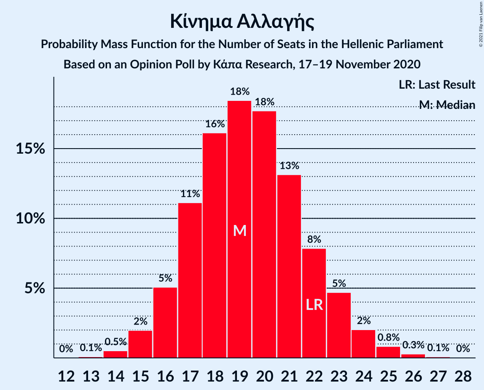
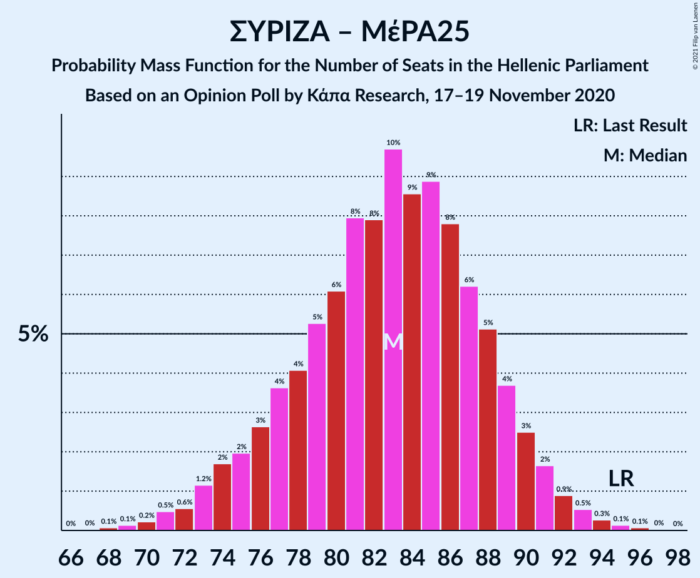
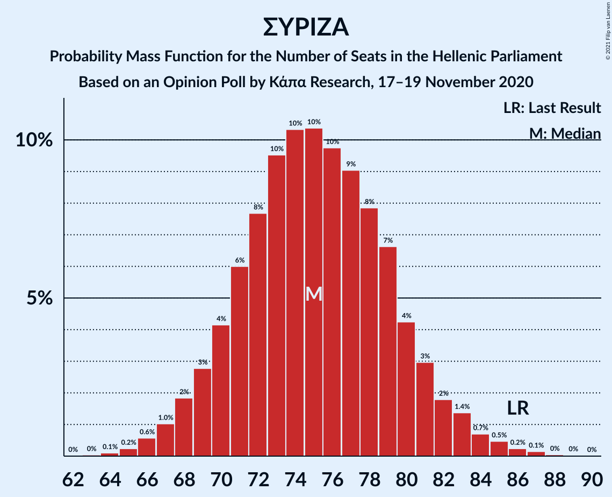

# Opinion Poll by Κάπα Research, 17–19 November 2020

<a href="#voting-intentions">Voting Intentions</a> | <a href="#seats">Seats</a> | <a href="#coalitions">Coalitions</a> | <a href="#technical-information">Technical Information</a>

## Voting Intentions

### Confidence Intervals

| Party | Last Result | Poll Result | 80% Confidence Interval | 90% Confidence Interval | 95% Confidence Interval | 99% Confidence Interval |
|:-----:|:-----------:|:-----------:|:-----------------------:|:-----------------------:|:-----------------------:|:-----------------------:|
| Νέα Δημοκρατία | 39.8% | 45.7% | 43.8–47.7% |43.2–48.3% |42.7–48.8% |41.8–49.7% |
| Συνασπισμός Ριζοσπαστικής Αριστεράς | 31.5% | 28.6% | 26.8–30.4% |26.3–30.9% |25.9–31.4% |25.1–32.3% |
| Κίνημα Αλλαγής | 8.1% | 7.3% | 6.4–8.4% |6.1–8.8% |5.9–9.0% |5.5–9.6% |
| Κομμουνιστικό Κόμμα Ελλάδας | 5.3% | 6.2% | 5.3–7.2% |5.1–7.5% |4.9–7.8% |4.5–8.3% |
| Ελληνική Λύση | 3.7% | 4.2% | 3.5–5.1% |3.3–5.3% |3.1–5.6% |2.8–6.0% |
| Μέτωπο Ευρωπαϊκής Ρεαλιστικής Ανυπακοής | 3.4% | 3.4% | 2.8–4.3% |2.6–4.5% |2.5–4.7% |2.2–5.1% |

*Note:* The poll result column reflects the actual value used in the calculations. Published results may vary slightly, and in addition be rounded to fewer digits.

## Seats

### Confidence Intervals

| Party | Last Result | Median | 80% Confidence Interval | 90% Confidence Interval | 95% Confidence Interval | 99% Confidence Interval |
|:-----:|:-----------:|:------:|:-----------------------:|:-----------------------:|:-----------------------:|:-----------------------:|
| <a href="#νέα-δημοκρατία">Νέα Δημοκρατία</a> | 158 | 170 | 164–176 |163–177 |162–179 |159–182 |
| <a href="#συνασπισμός-ριζοσπαστικής-αριστεράς">Συνασπισμός Ριζοσπαστικής Αριστεράς</a> | 86 | 75 | 70–80 |69–82 |68–83 |66–86 |
| <a href="#κίνημα-αλλαγής">Κίνημα Αλλαγής</a> | 22 | 19 | 17–22 |16–23 |15–24 |14–25 |
| <a href="#κομμουνιστικό-κόμμα-ελλάδας">Κομμουνιστικό Κόμμα Ελλάδας</a> | 15 | 16 | 14–19 |13–20 |13–21 |12–22 |
| <a href="#ελληνική-λύση">Ελληνική Λύση</a> | 10 | 11 | 9–13 |9–14 |8–15 |0–16 |
| <a href="#μέτωπο-ευρωπαϊκής-ρεαλιστικής-ανυπακοής">Μέτωπο Ευρωπαϊκής Ρεαλιστικής Ανυπακοής</a> | 9 | 9 | 0–11 |0–12 |0–12 |0–13 |

### Νέα Δημοκρατία

*For a full overview of the results for this party, see the [Νέα Δημοκρατία](party-νέαδημοκρατία.html) page.*

| Number of Seats | Probability | Accumulated | Special Marks |
|:---------------:|:-----------:|:-----------:|:-------------:|
| 156 | 0% | 100% |  |
| 157 | 0.1% | 99.9% |  |
| 158 | 0.1% | 99.9% | Last Result |
| 159 | 0.3% | 99.8% |  |
| 160 | 0.7% | 99.5% |  |
| 161 | 0.9% | 98.8% |  |
| 162 | 1.1% | 98% |  |
| 163 | 3% | 97% |  |
| 164 | 4% | 94% |  |
| 165 | 4% | 90% |  |
| 166 | 4% | 86% |  |
| 167 | 8% | 82% |  |
| 168 | 11% | 74% |  |
| 169 | 9% | 63% |  |
| 170 | 6% | 54% | Median |
| 171 | 10% | 47% |  |
| 172 | 9% | 38% |  |
| 173 | 10% | 29% |  |
| 174 | 4% | 19% |  |
| 175 | 3% | 16% |  |
| 176 | 4% | 13% |  |
| 177 | 4% | 9% |  |
| 178 | 1.3% | 5% |  |
| 179 | 1.0% | 3% |  |
| 180 | 0.8% | 2% |  |
| 181 | 1.0% | 2% |  |
| 182 | 0.4% | 0.7% |  |
| 183 | 0.1% | 0.3% |  |
| 184 | 0.1% | 0.2% |  |
| 185 | 0% | 0.1% |  |
| 186 | 0% | 0.1% |  |
| 187 | 0% | 0% |  |

### Συνασπισμός Ριζοσπαστικής Αριστεράς

*For a full overview of the results for this party, see the [Συνασπισμός Ριζοσπαστικής Αριστεράς](party-συνασπισμόςριζοσπαστικήςαριστεράς.html) page.*

| Number of Seats | Probability | Accumulated | Special Marks |
|:---------------:|:-----------:|:-----------:|:-------------:|
| 63 | 0% | 100% |  |
| 64 | 0.1% | 99.9% |  |
| 65 | 0.2% | 99.8% |  |
| 66 | 0.9% | 99.6% |  |
| 67 | 1.1% | 98.8% |  |
| 68 | 1.4% | 98% |  |
| 69 | 3% | 96% |  |
| 70 | 4% | 93% |  |
| 71 | 5% | 89% |  |
| 72 | 11% | 84% |  |
| 73 | 11% | 73% |  |
| 74 | 7% | 62% |  |
| 75 | 9% | 55% | Median |
| 76 | 10% | 45% |  |
| 77 | 4% | 36% |  |
| 78 | 9% | 32% |  |
| 79 | 12% | 22% |  |
| 80 | 3% | 10% |  |
| 81 | 2% | 7% |  |
| 82 | 2% | 5% |  |
| 83 | 1.4% | 3% |  |
| 84 | 0.6% | 2% |  |
| 85 | 0.4% | 1.2% |  |
| 86 | 0.5% | 0.8% | Last Result |
| 87 | 0.2% | 0.3% |  |
| 88 | 0% | 0.1% |  |
| 89 | 0% | 0.1% |  |
| 90 | 0% | 0% |  |

### Κίνημα Αλλαγής

*For a full overview of the results for this party, see the [Κίνημα Αλλαγής](party-κίνημααλλαγής.html) page.*

| Number of Seats | Probability | Accumulated | Special Marks |
|:---------------:|:-----------:|:-----------:|:-------------:|
| 13 | 0.1% | 100% |  |
| 14 | 0.5% | 99.9% |  |
| 15 | 2% | 99.4% |  |
| 16 | 5% | 97% |  |
| 17 | 11% | 92% |  |
| 18 | 15% | 81% |  |
| 19 | 19% | 66% | Median |
| 20 | 16% | 46% |  |
| 21 | 14% | 30% |  |
| 22 | 7% | 16% | Last Result |
| 23 | 5% | 8% |  |
| 24 | 2% | 3% |  |
| 25 | 1.0% | 1.4% |  |
| 26 | 0.3% | 0.4% |  |
| 27 | 0.1% | 0.1% |  |
| 28 | 0% | 0% |  |

### Κομμουνιστικό Κόμμα Ελλάδας

*For a full overview of the results for this party, see the [Κομμουνιστικό Κόμμα Ελλάδας](party-κομμουνιστικόκόμμαελλάδας.html) page.*

| Number of Seats | Probability | Accumulated | Special Marks |
|:---------------:|:-----------:|:-----------:|:-------------:|
| 11 | 0.3% | 100% |  |
| 12 | 1.3% | 99.7% |  |
| 13 | 4% | 98% |  |
| 14 | 8% | 95% |  |
| 15 | 15% | 87% | Last Result |
| 16 | 22% | 72% | Median |
| 17 | 21% | 50% |  |
| 18 | 16% | 28% |  |
| 19 | 7% | 13% |  |
| 20 | 3% | 6% |  |
| 21 | 2% | 3% |  |
| 22 | 0.8% | 1.1% |  |
| 23 | 0.2% | 0.2% |  |
| 24 | 0% | 0% |  |

### Ελληνική Λύση

*For a full overview of the results for this party, see the [Ελληνική Λύση](party-ελληνικήλύση.html) page.*

| Number of Seats | Probability | Accumulated | Special Marks |
|:---------------:|:-----------:|:-----------:|:-------------:|
| 0 | 2% | 100% |  |
| 1 | 0% | 98% |  |
| 2 | 0% | 98% |  |
| 3 | 0% | 98% |  |
| 4 | 0% | 98% |  |
| 5 | 0% | 98% |  |
| 6 | 0% | 98% |  |
| 7 | 0% | 98% |  |
| 8 | 3% | 98% |  |
| 9 | 9% | 95% |  |
| 10 | 20% | 87% | Last Result |
| 11 | 24% | 66% | Median |
| 12 | 19% | 42% |  |
| 13 | 15% | 23% |  |
| 14 | 5% | 8% |  |
| 15 | 2% | 3% |  |
| 16 | 0.7% | 0.9% |  |
| 17 | 0.1% | 0.2% |  |
| 18 | 0% | 0% |  |

### Μέτωπο Ευρωπαϊκής Ρεαλιστικής Ανυπακοής

*For a full overview of the results for this party, see the [Μέτωπο Ευρωπαϊκής Ρεαλιστικής Ανυπακοής](party-μέτωποευρωπαϊκήςρεαλιστικήςανυπακοής.html) page.*

| Number of Seats | Probability | Accumulated | Special Marks |
|:---------------:|:-----------:|:-----------:|:-------------:|
| 0 | 20% | 100% |  |
| 1 | 0% | 80% |  |
| 2 | 0% | 80% |  |
| 3 | 0% | 80% |  |
| 4 | 0% | 80% |  |
| 5 | 0% | 80% |  |
| 6 | 0% | 80% |  |
| 7 | 0% | 80% |  |
| 8 | 16% | 80% |  |
| 9 | 28% | 64% | Last Result, Median |
| 10 | 19% | 36% |  |
| 11 | 11% | 17% |  |
| 12 | 5% | 6% |  |
| 13 | 1.4% | 2% |  |
| 14 | 0.4% | 0.4% |  |
| 15 | 0.1% | 0.1% |  |
| 16 | 0% | 0% |  |

## Coalitions

### Confidence Intervals

| Coalition | Last Result | Median | Majority? | 80% Confidence Interval | 90% Confidence Interval | 95% Confidence Interval | 99% Confidence Interval |
|:---------:|:-----------:|:------:|:---------:|:-----------------------:|:-----------------------:|:-----------------------:|:-----------------------:|
| Νέα Δημοκρατία – Κίνημα Αλλαγής | 180 | 189 | 100% | 184–195 | 182–198 | 181–199 | 179–202 |
| Νέα Δημοκρατία | 158 | 170 | 100% | 164–176 | 163–177 | 162–179 | 159–182 |
| Συνασπισμός Ριζοσπαστικής Αριστεράς – Μέτωπο Ευρωπαϊκής Ρεαλιστικής Ανυπακοής | 95 | 83 | 0% | 77–89 | 75–90 | 73–91 | 71–94 |
| Συνασπισμός Ριζοσπαστικής Αριστεράς | 86 | 75 | 0% | 70–80 | 69–82 | 68–83 | 66–86 |

### Νέα Δημοκρατία – Κίνημα Αλλαγής

| Number of Seats | Probability | Accumulated | Special Marks |
|:---------------:|:-----------:|:-----------:|:-------------:|
| 176 | 0.1% | 100% |  |
| 177 | 0.1% | 99.9% |  |
| 178 | 0.2% | 99.8% |  |
| 179 | 0.5% | 99.6% |  |
| 180 | 1.1% | 99.2% | Last Result |
| 181 | 0.7% | 98% |  |
| 182 | 2% | 97% |  |
| 183 | 4% | 95% |  |
| 184 | 4% | 91% |  |
| 185 | 5% | 87% |  |
| 186 | 7% | 82% |  |
| 187 | 7% | 75% |  |
| 188 | 10% | 68% |  |
| 189 | 9% | 58% | Median |
| 190 | 7% | 49% |  |
| 191 | 10% | 42% |  |
| 192 | 6% | 31% |  |
| 193 | 8% | 25% |  |
| 194 | 5% | 18% |  |
| 195 | 3% | 13% |  |
| 196 | 2% | 10% |  |
| 197 | 2% | 8% |  |
| 198 | 2% | 6% |  |
| 199 | 2% | 4% |  |
| 200 | 0.3% | 2% |  |
| 201 | 1.2% | 2% |  |
| 202 | 0.3% | 0.6% |  |
| 203 | 0.2% | 0.3% |  |
| 204 | 0% | 0.1% |  |
| 205 | 0% | 0.1% |  |
| 206 | 0% | 0.1% |  |
| 207 | 0% | 0% |  |

### Νέα Δημοκρατία

| Number of Seats | Probability | Accumulated | Special Marks |
|:---------------:|:-----------:|:-----------:|:-------------:|
| 156 | 0% | 100% |  |
| 157 | 0.1% | 99.9% |  |
| 158 | 0.1% | 99.9% | Last Result |
| 159 | 0.3% | 99.8% |  |
| 160 | 0.7% | 99.5% |  |
| 161 | 0.9% | 98.8% |  |
| 162 | 1.1% | 98% |  |
| 163 | 3% | 97% |  |
| 164 | 4% | 94% |  |
| 165 | 4% | 90% |  |
| 166 | 4% | 86% |  |
| 167 | 8% | 82% |  |
| 168 | 11% | 74% |  |
| 169 | 9% | 63% |  |
| 170 | 6% | 54% | Median |
| 171 | 10% | 47% |  |
| 172 | 9% | 38% |  |
| 173 | 10% | 29% |  |
| 174 | 4% | 19% |  |
| 175 | 3% | 16% |  |
| 176 | 4% | 13% |  |
| 177 | 4% | 9% |  |
| 178 | 1.3% | 5% |  |
| 179 | 1.0% | 3% |  |
| 180 | 0.8% | 2% |  |
| 181 | 1.0% | 2% |  |
| 182 | 0.4% | 0.7% |  |
| 183 | 0.1% | 0.3% |  |
| 184 | 0.1% | 0.2% |  |
| 185 | 0% | 0.1% |  |
| 186 | 0% | 0.1% |  |
| 187 | 0% | 0% |  |

### Συνασπισμός Ριζοσπαστικής Αριστεράς – Μέτωπο Ευρωπαϊκής Ρεαλιστικής Ανυπακοής

| Number of Seats | Probability | Accumulated | Special Marks |
|:---------------:|:-----------:|:-----------:|:-------------:|
| 67 | 0.1% | 100% |  |
| 68 | 0.1% | 99.9% |  |
| 69 | 0.1% | 99.9% |  |
| 70 | 0.2% | 99.8% |  |
| 71 | 0.6% | 99.6% |  |
| 72 | 0.3% | 99.0% |  |
| 73 | 1.4% | 98.7% |  |
| 74 | 2% | 97% |  |
| 75 | 0.9% | 96% |  |
| 76 | 3% | 95% |  |
| 77 | 2% | 91% |  |
| 78 | 3% | 89% |  |
| 79 | 9% | 86% |  |
| 80 | 7% | 77% |  |
| 81 | 9% | 70% |  |
| 82 | 9% | 61% |  |
| 83 | 9% | 52% |  |
| 84 | 7% | 43% | Median |
| 85 | 6% | 36% |  |
| 86 | 10% | 30% |  |
| 87 | 5% | 20% |  |
| 88 | 5% | 15% |  |
| 89 | 4% | 10% |  |
| 90 | 3% | 6% |  |
| 91 | 2% | 3% |  |
| 92 | 0.7% | 2% |  |
| 93 | 0.5% | 1.0% |  |
| 94 | 0.3% | 0.5% |  |
| 95 | 0.1% | 0.2% | Last Result |
| 96 | 0.1% | 0.1% |  |
| 97 | 0% | 0.1% |  |
| 98 | 0% | 0% |  |

### Συνασπισμός Ριζοσπαστικής Αριστεράς

| Number of Seats | Probability | Accumulated | Special Marks |
|:---------------:|:-----------:|:-----------:|:-------------:|
| 63 | 0% | 100% |  |
| 64 | 0.1% | 99.9% |  |
| 65 | 0.2% | 99.8% |  |
| 66 | 0.9% | 99.6% |  |
| 67 | 1.1% | 98.8% |  |
| 68 | 1.4% | 98% |  |
| 69 | 3% | 96% |  |
| 70 | 4% | 93% |  |
| 71 | 5% | 89% |  |
| 72 | 11% | 84% |  |
| 73 | 11% | 73% |  |
| 74 | 7% | 62% |  |
| 75 | 9% | 55% | Median |
| 76 | 10% | 45% |  |
| 77 | 4% | 36% |  |
| 78 | 9% | 32% |  |
| 79 | 12% | 22% |  |
| 80 | 3% | 10% |  |
| 81 | 2% | 7% |  |
| 82 | 2% | 5% |  |
| 83 | 1.4% | 3% |  |
| 84 | 0.6% | 2% |  |
| 85 | 0.4% | 1.2% |  |
| 86 | 0.5% | 0.8% | Last Result |
| 87 | 0.2% | 0.3% |  |
| 88 | 0% | 0.1% |  |
| 89 | 0% | 0.1% |  |
| 90 | 0% | 0% |  |

## Technical Information

### Opinion Poll

+ **Polling firm:** Κάπα Research
+ **Commissioner(s):** —
+ **Fieldwork period:** 17–19 November 2020

### Calculations

+ **Sample size:** 1054
+ **Simulations done:** 131,072
+ **Error estimate:** 2.03%

