# Opinion Poll by Metron Analysis for MEGA TV, 18–24 November 2020

<a href="#voting-intentions">Voting Intentions</a> | <a href="#seats">Seats</a> | <a href="#coalitions">Coalitions</a> | <a href="#technical-information">Technical Information</a>

## Voting Intentions

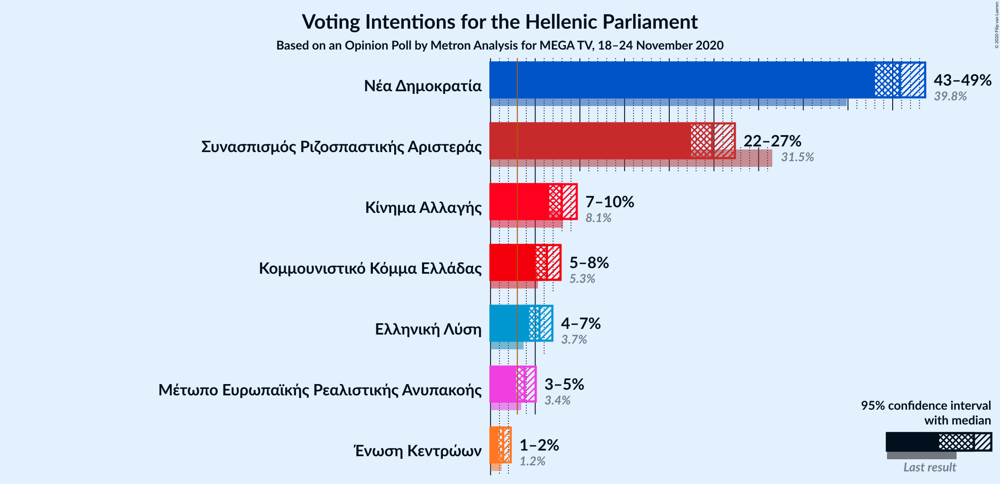

### Confidence Intervals

| Party | Last Result | Poll Result | 80% Confidence Interval | 90% Confidence Interval | 95% Confidence Interval | 99% Confidence Interval |
|:-----:|:-----------:|:-----------:|:-----------------------:|:-----------------------:|:-----------------------:|:-----------------------:|
| Νέα Δημοκρατία | 39.8% | 45.8% | 44.0–47.7% |43.5–48.2% |43.0–48.6% |42.1–49.5% |
| Συνασπισμός Ριζοσπαστικής Αριστεράς | 31.5% | 24.8% | 23.3–26.5% |22.8–26.9% |22.5–27.3% |21.7–28.1% |
| Κίνημα Αλλαγής | 8.1% | 8.0% | 7.0–9.1% |6.8–9.4% |6.6–9.6% |6.1–10.2% |
| Κομμουνιστικό Κόμμα Ελλάδας | 5.3% | 6.3% | 5.5–7.3% |5.3–7.6% |5.1–7.8% |4.7–8.3% |
| Ελληνική Λύση | 3.7% | 5.5% | 4.7–6.4% |4.5–6.7% |4.3–6.9% |4.0–7.4% |
| Μέτωπο Ευρωπαϊκής Ρεαλιστικής Ανυπακοής | 3.4% | 3.8% | 3.2–4.6% |3.0–4.9% |2.9–5.1% |2.6–5.5% |
| Ένωση Κεντρώων | 1.2% | 1.4% | 1.1–2.0% |1.0–2.1% |0.9–2.3% |0.7–2.5% |

*Note:* The poll result column reflects the actual value used in the calculations. Published results may vary slightly, and in addition be rounded to fewer digits.

## Seats

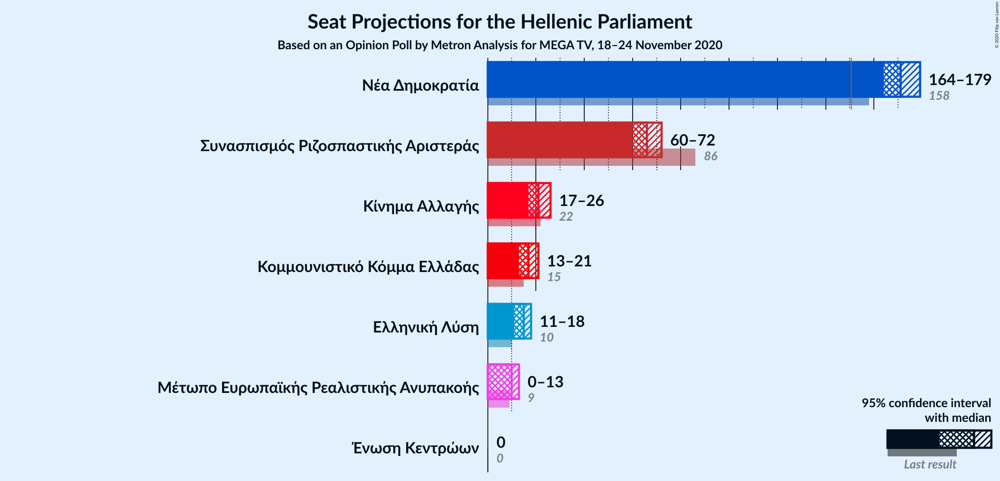

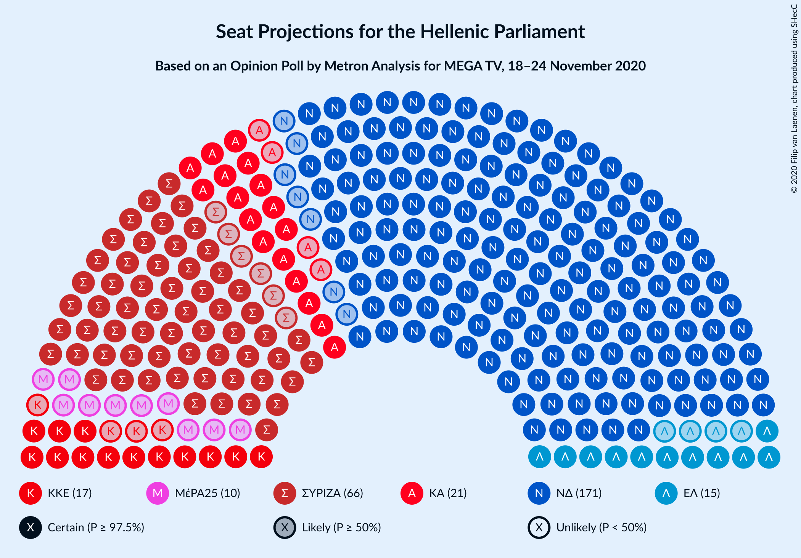

### Confidence Intervals

| Party | Last Result | Median | 80% Confidence Interval | 90% Confidence Interval | 95% Confidence Interval | 99% Confidence Interval |
|:-----:|:-----------:|:------:|:-----------------------:|:-----------------------:|:-----------------------:|:-----------------------:|
| <a href="#νέα-δημοκρατία">Νέα Δημοκρατία</a> | 158 | 171 | 167–176 |165–178 |164–179 |162–182 |
| <a href="#συνασπισμός-ριζοσπαστικής-αριστεράς">Συνασπισμός Ριζοσπαστικής Αριστεράς</a> | 86 | 66 | 62–70 |61–71 |60–72 |58–75 |
| <a href="#κίνημα-αλλαγής">Κίνημα Αλλαγής</a> | 22 | 21 | 19–24 |18–25 |17–26 |16–27 |
| <a href="#κομμουνιστικό-κόμμα-ελλάδας">Κομμουνιστικό Κόμμα Ελλάδας</a> | 15 | 17 | 15–19 |14–20 |13–21 |12–22 |
| <a href="#ελληνική-λύση">Ελληνική Λύση</a> | 10 | 15 | 12–17 |12–18 |11–18 |11–20 |
| <a href="#μέτωπο-ευρωπαϊκής-ρεαλιστικής-ανυπακοής">Μέτωπο Ευρωπαϊκής Ρεαλιστικής Ανυπακοής</a> | 9 | 10 | 8–12 |8–13 |0–13 |0–14 |
| <a href="#ένωση-κεντρώων">Ένωση Κεντρώων</a> | 0 | 0 | 0 |0 |0 |0 |

### Νέα Δημοκρατία

*For a full overview of the results for this party, see the [Νέα Δημοκρατία](party-νέαδημοκρατία.html) page.*

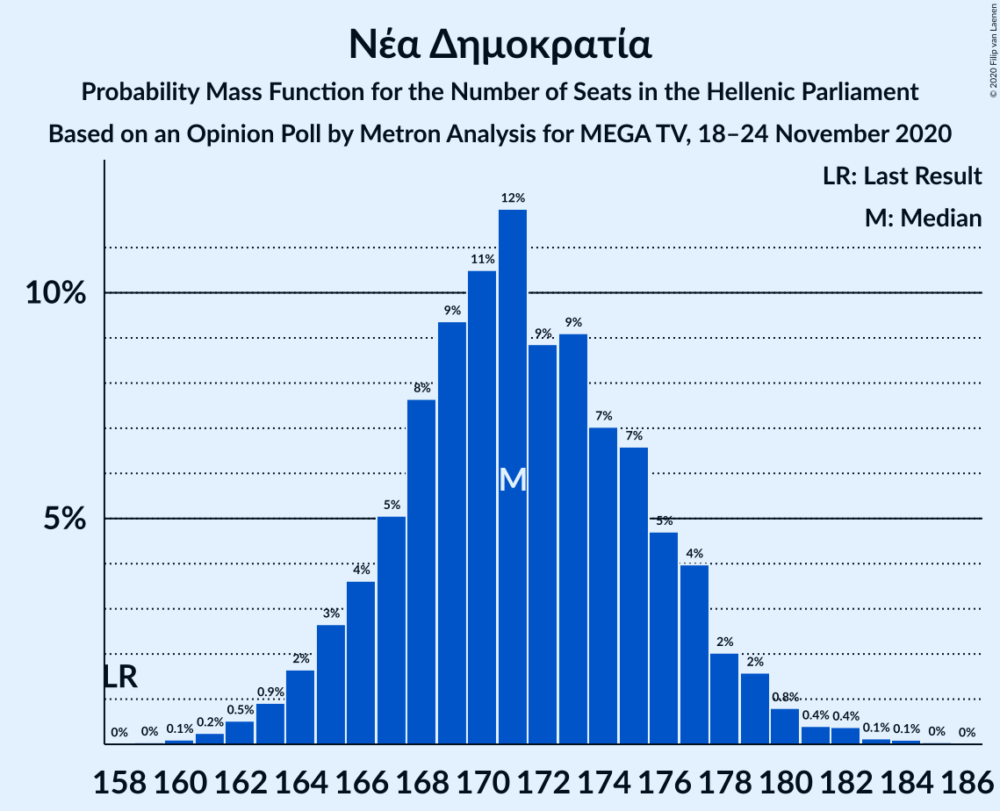

| Number of Seats | Probability | Accumulated | Special Marks |
|:---------------:|:-----------:|:-----------:|:-------------:|
| 158 | 0% | 100% | Last Result |
| 159 | 0% | 100% |  |
| 160 | 0.1% | 99.9% |  |
| 161 | 0.2% | 99.8% |  |
| 162 | 0.5% | 99.6% |  |
| 163 | 0.9% | 99.1% |  |
| 164 | 2% | 98% |  |
| 165 | 3% | 96% |  |
| 166 | 4% | 94% |  |
| 167 | 5% | 90% |  |
| 168 | 8% | 85% |  |
| 169 | 9% | 78% |  |
| 170 | 11% | 68% |  |
| 171 | 12% | 58% | Median |
| 172 | 9% | 46% |  |
| 173 | 9% | 37% |  |
| 174 | 7% | 28% |  |
| 175 | 7% | 21% |  |
| 176 | 5% | 14% |  |
| 177 | 4% | 9% |  |
| 178 | 2% | 6% |  |
| 179 | 2% | 3% |  |
| 180 | 0.8% | 2% |  |
| 181 | 0.4% | 1.1% |  |
| 182 | 0.4% | 0.7% |  |
| 183 | 0.1% | 0.3% |  |
| 184 | 0.1% | 0.2% |  |
| 185 | 0% | 0.1% |  |
| 186 | 0% | 0% |  |

### Συνασπισμός Ριζοσπαστικής Αριστεράς

*For a full overview of the results for this party, see the [Συνασπισμός Ριζοσπαστικής Αριστεράς](party-συνασπισμόςριζοσπαστικήςαριστεράς.html) page.*

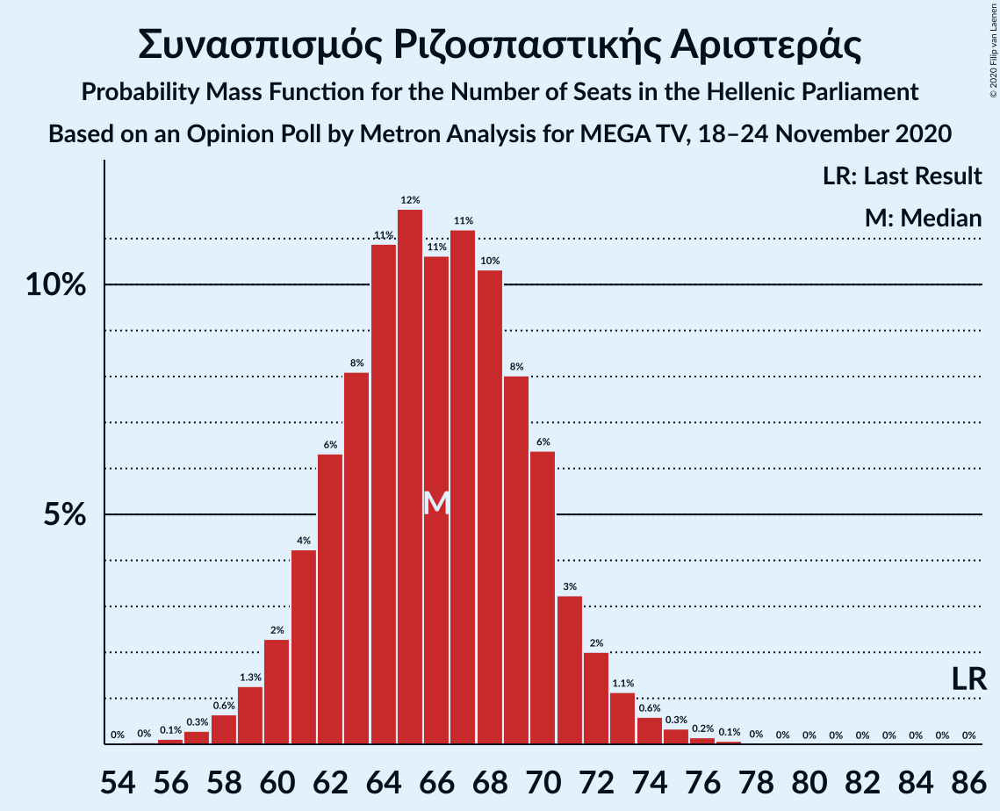

| Number of Seats | Probability | Accumulated | Special Marks |
|:---------------:|:-----------:|:-----------:|:-------------:|
| 55 | 0% | 100% |  |
| 56 | 0.1% | 99.9% |  |
| 57 | 0.3% | 99.8% |  |
| 58 | 0.6% | 99.5% |  |
| 59 | 1.3% | 98.9% |  |
| 60 | 2% | 98% |  |
| 61 | 4% | 95% |  |
| 62 | 6% | 91% |  |
| 63 | 8% | 85% |  |
| 64 | 11% | 77% |  |
| 65 | 12% | 66% |  |
| 66 | 11% | 54% | Median |
| 67 | 11% | 44% |  |
| 68 | 10% | 32% |  |
| 69 | 8% | 22% |  |
| 70 | 6% | 14% |  |
| 71 | 3% | 8% |  |
| 72 | 2% | 4% |  |
| 73 | 1.1% | 2% |  |
| 74 | 0.6% | 1.2% |  |
| 75 | 0.3% | 0.6% |  |
| 76 | 0.2% | 0.3% |  |
| 77 | 0.1% | 0.1% |  |
| 78 | 0% | 0% |  |
| 79 | 0% | 0% |  |
| 80 | 0% | 0% |  |
| 81 | 0% | 0% |  |
| 82 | 0% | 0% |  |
| 83 | 0% | 0% |  |
| 84 | 0% | 0% |  |
| 85 | 0% | 0% |  |
| 86 | 0% | 0% | Last Result |

### Κίνημα Αλλαγής

*For a full overview of the results for this party, see the [Κίνημα Αλλαγής](party-κίνημααλλαγής.html) page.*

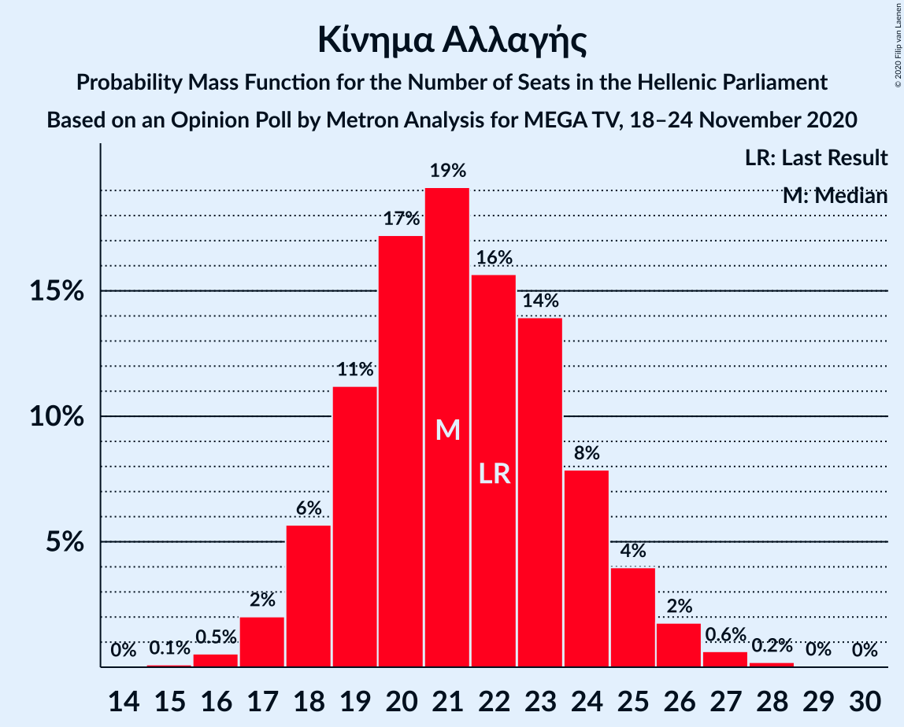

| Number of Seats | Probability | Accumulated | Special Marks |
|:---------------:|:-----------:|:-----------:|:-------------:|
| 15 | 0.1% | 100% |  |
| 16 | 0.5% | 99.9% |  |
| 17 | 2% | 99.3% |  |
| 18 | 6% | 97% |  |
| 19 | 11% | 92% |  |
| 20 | 17% | 80% |  |
| 21 | 19% | 63% | Median |
| 22 | 16% | 44% | Last Result |
| 23 | 14% | 28% |  |
| 24 | 8% | 15% |  |
| 25 | 4% | 7% |  |
| 26 | 2% | 3% |  |
| 27 | 0.6% | 0.9% |  |
| 28 | 0.2% | 0.3% |  |
| 29 | 0% | 0.1% |  |
| 30 | 0% | 0% |  |

### Κομμουνιστικό Κόμμα Ελλάδας

*For a full overview of the results for this party, see the [Κομμουνιστικό Κόμμα Ελλάδας](party-κομμουνιστικόκόμμαελλάδας.html) page.*

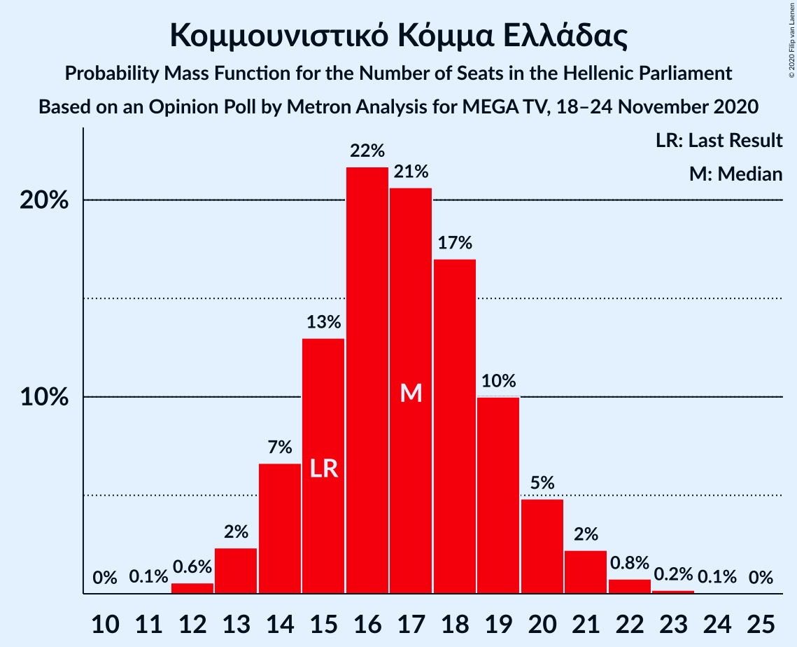

| Number of Seats | Probability | Accumulated | Special Marks |
|:---------------:|:-----------:|:-----------:|:-------------:|
| 11 | 0.1% | 100% |  |
| 12 | 0.6% | 99.9% |  |
| 13 | 2% | 99.4% |  |
| 14 | 7% | 97% |  |
| 15 | 13% | 90% | Last Result |
| 16 | 22% | 77% |  |
| 17 | 21% | 56% | Median |
| 18 | 17% | 35% |  |
| 19 | 10% | 18% |  |
| 20 | 5% | 8% |  |
| 21 | 2% | 3% |  |
| 22 | 0.8% | 1.0% |  |
| 23 | 0.2% | 0.3% |  |
| 24 | 0.1% | 0.1% |  |
| 25 | 0% | 0% |  |

### Ελληνική Λύση

*For a full overview of the results for this party, see the [Ελληνική Λύση](party-ελληνικήλύση.html) page.*

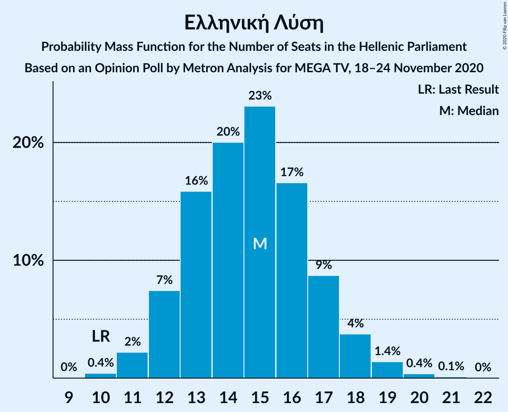

| Number of Seats | Probability | Accumulated | Special Marks |
|:---------------:|:-----------:|:-----------:|:-------------:|
| 10 | 0.4% | 100% | Last Result |
| 11 | 2% | 99.5% |  |
| 12 | 7% | 97% |  |
| 13 | 16% | 90% |  |
| 14 | 20% | 74% |  |
| 15 | 23% | 54% | Median |
| 16 | 17% | 31% |  |
| 17 | 9% | 14% |  |
| 18 | 4% | 6% |  |
| 19 | 1.4% | 2% |  |
| 20 | 0.4% | 0.5% |  |
| 21 | 0.1% | 0.1% |  |
| 22 | 0% | 0% |  |

### Μέτωπο Ευρωπαϊκής Ρεαλιστικής Ανυπακοής

*For a full overview of the results for this party, see the [Μέτωπο Ευρωπαϊκής Ρεαλιστικής Ανυπακοής](party-μέτωποευρωπαϊκήςρεαλιστικήςανυπακοής.html) page.*

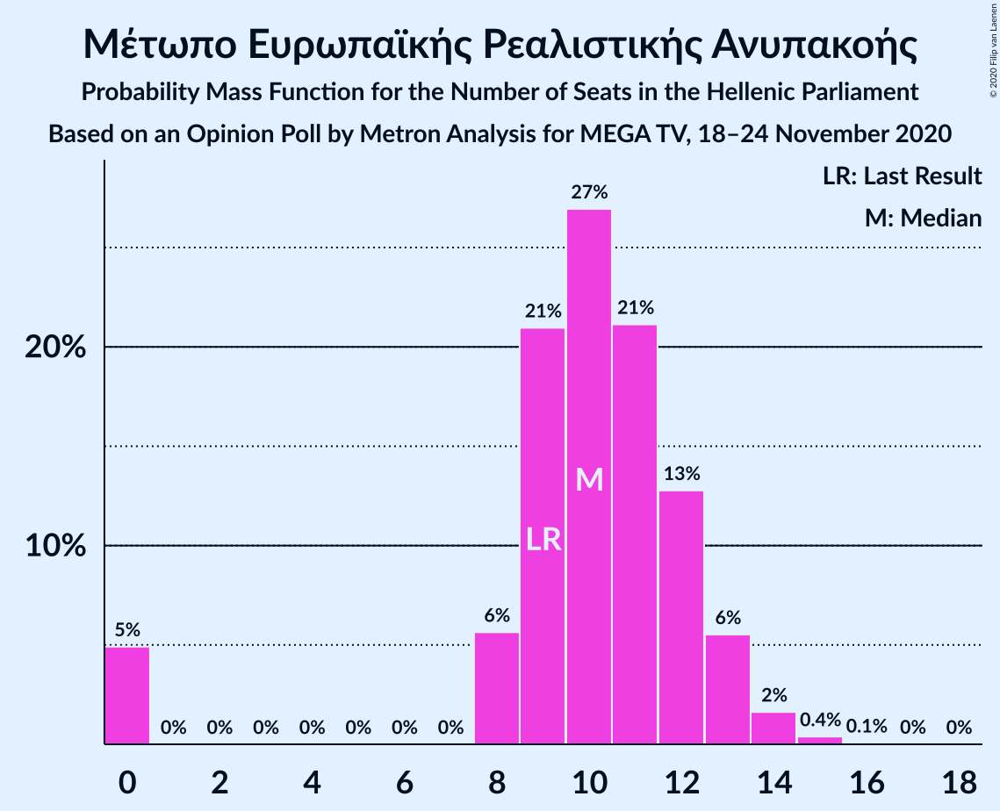

| Number of Seats | Probability | Accumulated | Special Marks |
|:---------------:|:-----------:|:-----------:|:-------------:|
| 0 | 5% | 100% |  |
| 1 | 0% | 95% |  |
| 2 | 0% | 95% |  |
| 3 | 0% | 95% |  |
| 4 | 0% | 95% |  |
| 5 | 0% | 95% |  |
| 6 | 0% | 95% |  |
| 7 | 0% | 95% |  |
| 8 | 6% | 95% |  |
| 9 | 21% | 89% | Last Result |
| 10 | 27% | 68% | Median |
| 11 | 21% | 42% |  |
| 12 | 13% | 20% |  |
| 13 | 6% | 8% |  |
| 14 | 2% | 2% |  |
| 15 | 0.4% | 0.5% |  |
| 16 | 0.1% | 0.1% |  |
| 17 | 0% | 0% |  |

### Ένωση Κεντρώων

*For a full overview of the results for this party, see the [Ένωση Κεντρώων](party-ένωσηκεντρώων.html) page.*

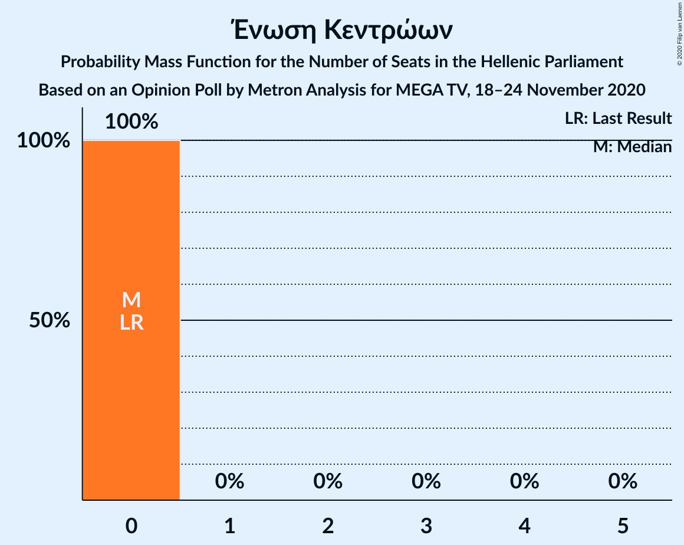

| Number of Seats | Probability | Accumulated | Special Marks |
|:---------------:|:-----------:|:-----------:|:-------------:|
| 0 | 100% | 100% | Last Result, Median |

## Coalitions

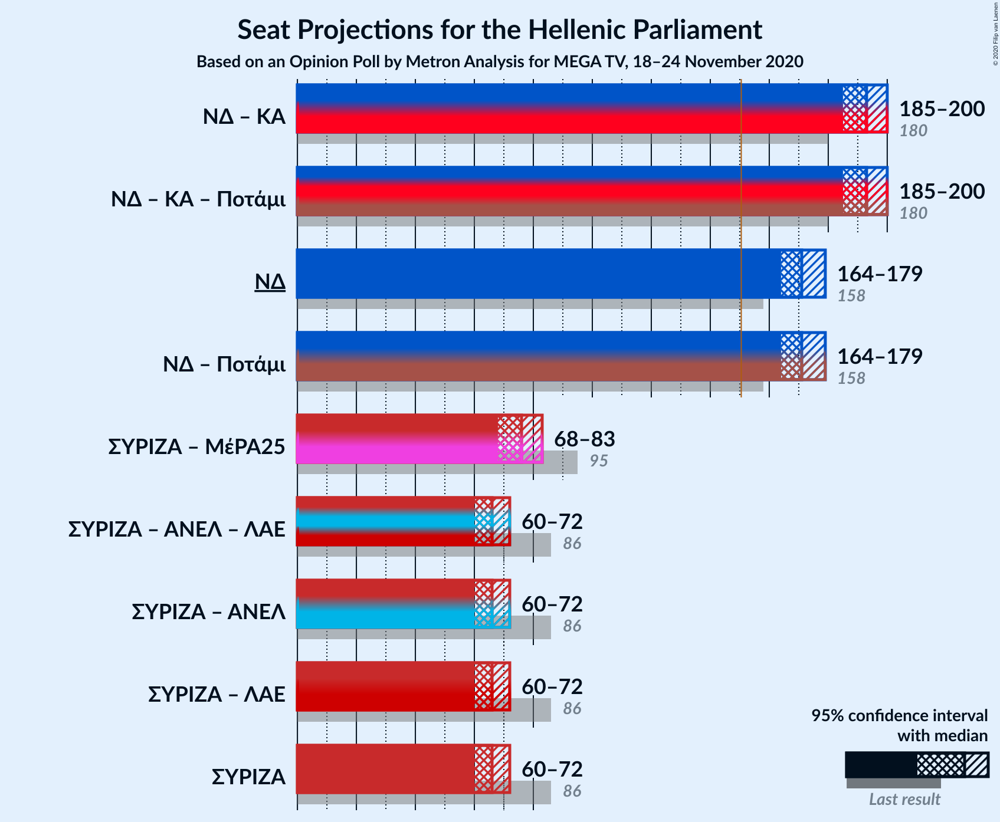

### Confidence Intervals

| Coalition | Last Result | Median | Majority? | 80% Confidence Interval | 90% Confidence Interval | 95% Confidence Interval | 99% Confidence Interval |
|:---------:|:-----------:|:------:|:---------:|:-----------------------:|:-----------------------:|:-----------------------:|:-----------------------:|
| Νέα Δημοκρατία – Κίνημα Αλλαγής | 180 | 193 | 100% | 188–198 | 186–199 | 185–200 | 183–204 |
| Νέα Δημοκρατία | 158 | 171 | 100% | 167–176 | 165–178 | 164–179 | 162–182 |
| Συνασπισμός Ριζοσπαστικής Αριστεράς – Μέτωπο Ευρωπαϊκής Ρεαλιστικής Ανυπακοής | 95 | 76 | 0% | 71–80 | 69–82 | 68–83 | 64–85 |
| Συνασπισμός Ριζοσπαστικής Αριστεράς | 86 | 66 | 0% | 62–70 | 61–71 | 60–72 | 58–75 |

### Νέα Δημοκρατία – Κίνημα Αλλαγής

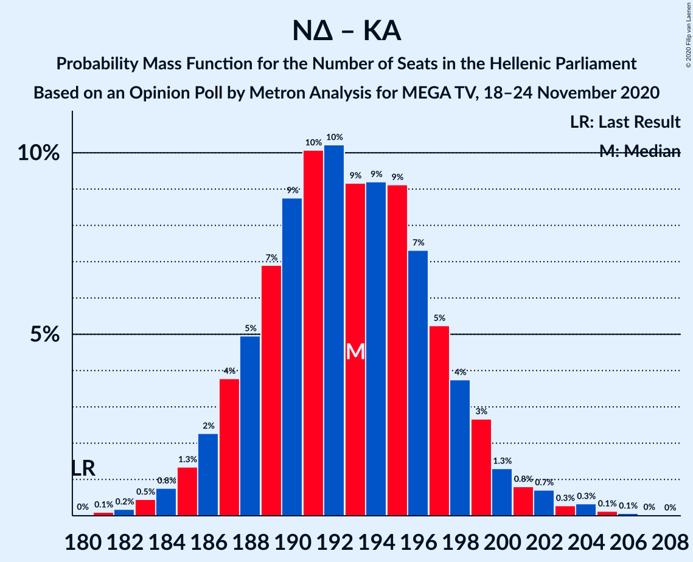

| Number of Seats | Probability | Accumulated | Special Marks |
|:---------------:|:-----------:|:-----------:|:-------------:|
| 180 | 0% | 100% | Last Result |
| 181 | 0.1% | 99.9% |  |
| 182 | 0.2% | 99.8% |  |
| 183 | 0.5% | 99.7% |  |
| 184 | 0.8% | 99.2% |  |
| 185 | 1.3% | 98% |  |
| 186 | 2% | 97% |  |
| 187 | 4% | 95% |  |
| 188 | 5% | 91% |  |
| 189 | 7% | 86% |  |
| 190 | 9% | 79% |  |
| 191 | 10% | 70% |  |
| 192 | 10% | 60% | Median |
| 193 | 9% | 50% |  |
| 194 | 9% | 41% |  |
| 195 | 9% | 32% |  |
| 196 | 7% | 23% |  |
| 197 | 5% | 15% |  |
| 198 | 4% | 10% |  |
| 199 | 3% | 6% |  |
| 200 | 1.3% | 4% |  |
| 201 | 0.8% | 2% |  |
| 202 | 0.7% | 2% |  |
| 203 | 0.3% | 0.9% |  |
| 204 | 0.3% | 0.6% |  |
| 205 | 0.1% | 0.3% |  |
| 206 | 0.1% | 0.1% |  |
| 207 | 0% | 0.1% |  |
| 208 | 0% | 0% |  |

### Νέα Δημοκρατία

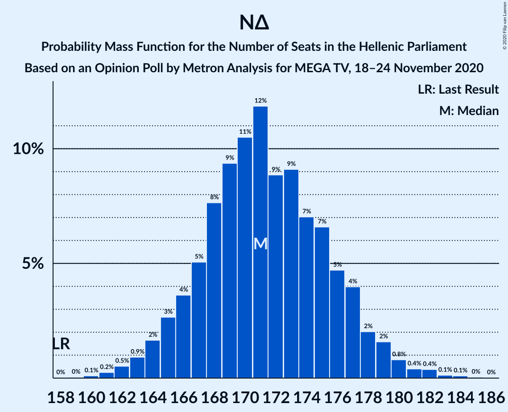

| Number of Seats | Probability | Accumulated | Special Marks |
|:---------------:|:-----------:|:-----------:|:-------------:|
| 158 | 0% | 100% | Last Result |
| 159 | 0% | 100% |  |
| 160 | 0.1% | 99.9% |  |
| 161 | 0.2% | 99.8% |  |
| 162 | 0.5% | 99.6% |  |
| 163 | 0.9% | 99.1% |  |
| 164 | 2% | 98% |  |
| 165 | 3% | 96% |  |
| 166 | 4% | 94% |  |
| 167 | 5% | 90% |  |
| 168 | 8% | 85% |  |
| 169 | 9% | 78% |  |
| 170 | 11% | 68% |  |
| 171 | 12% | 58% | Median |
| 172 | 9% | 46% |  |
| 173 | 9% | 37% |  |
| 174 | 7% | 28% |  |
| 175 | 7% | 21% |  |
| 176 | 5% | 14% |  |
| 177 | 4% | 9% |  |
| 178 | 2% | 6% |  |
| 179 | 2% | 3% |  |
| 180 | 0.8% | 2% |  |
| 181 | 0.4% | 1.1% |  |
| 182 | 0.4% | 0.7% |  |
| 183 | 0.1% | 0.3% |  |
| 184 | 0.1% | 0.2% |  |
| 185 | 0% | 0.1% |  |
| 186 | 0% | 0% |  |

### Συνασπισμός Ριζοσπαστικής Αριστεράς – Μέτωπο Ευρωπαϊκής Ρεαλιστικής Ανυπακοής

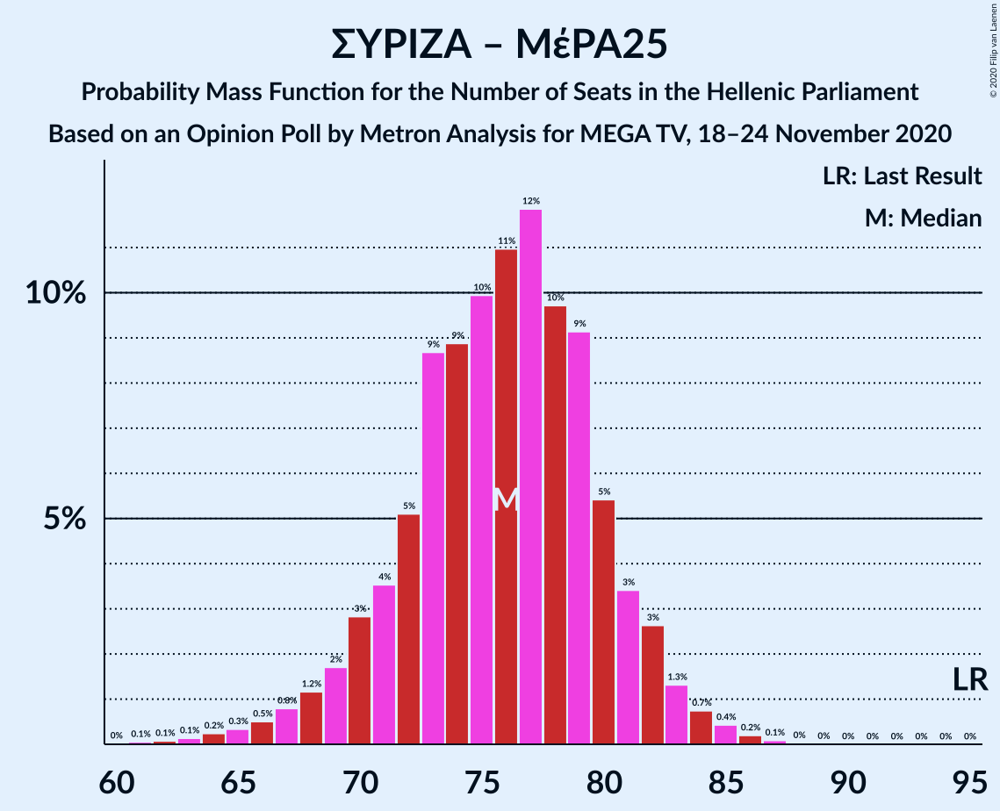

| Number of Seats | Probability | Accumulated | Special Marks |
|:---------------:|:-----------:|:-----------:|:-------------:|
| 61 | 0.1% | 100% |  |
| 62 | 0.1% | 99.9% |  |
| 63 | 0.1% | 99.8% |  |
| 64 | 0.2% | 99.7% |  |
| 65 | 0.3% | 99.5% |  |
| 66 | 0.5% | 99.1% |  |
| 67 | 0.8% | 98.6% |  |
| 68 | 1.2% | 98% |  |
| 69 | 2% | 97% |  |
| 70 | 3% | 95% |  |
| 71 | 4% | 92% |  |
| 72 | 5% | 89% |  |
| 73 | 9% | 83% |  |
| 74 | 9% | 75% |  |
| 75 | 10% | 66% |  |
| 76 | 11% | 56% | Median |
| 77 | 12% | 45% |  |
| 78 | 10% | 33% |  |
| 79 | 9% | 23% |  |
| 80 | 5% | 14% |  |
| 81 | 3% | 9% |  |
| 82 | 3% | 5% |  |
| 83 | 1.3% | 3% |  |
| 84 | 0.7% | 2% |  |
| 85 | 0.4% | 0.8% |  |
| 86 | 0.2% | 0.3% |  |
| 87 | 0.1% | 0.1% |  |
| 88 | 0% | 0% |  |
| 89 | 0% | 0% |  |
| 90 | 0% | 0% |  |
| 91 | 0% | 0% |  |
| 92 | 0% | 0% |  |
| 93 | 0% | 0% |  |
| 94 | 0% | 0% |  |
| 95 | 0% | 0% | Last Result |

### Συνασπισμός Ριζοσπαστικής Αριστεράς

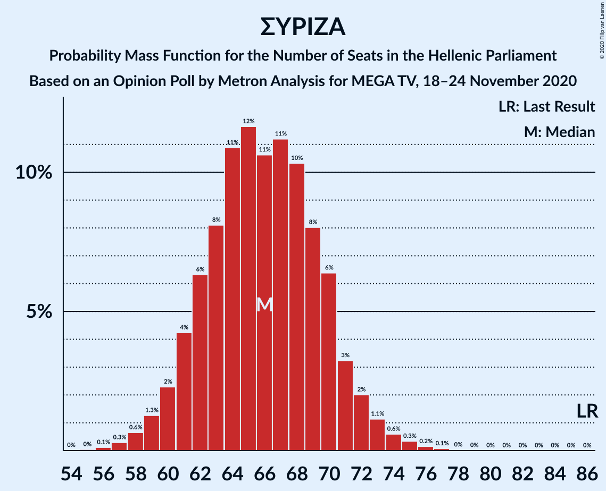

| Number of Seats | Probability | Accumulated | Special Marks |
|:---------------:|:-----------:|:-----------:|:-------------:|
| 55 | 0% | 100% |  |
| 56 | 0.1% | 99.9% |  |
| 57 | 0.3% | 99.8% |  |
| 58 | 0.6% | 99.5% |  |
| 59 | 1.3% | 98.9% |  |
| 60 | 2% | 98% |  |
| 61 | 4% | 95% |  |
| 62 | 6% | 91% |  |
| 63 | 8% | 85% |  |
| 64 | 11% | 77% |  |
| 65 | 12% | 66% |  |
| 66 | 11% | 54% | Median |
| 67 | 11% | 44% |  |
| 68 | 10% | 32% |  |
| 69 | 8% | 22% |  |
| 70 | 6% | 14% |  |
| 71 | 3% | 8% |  |
| 72 | 2% | 4% |  |
| 73 | 1.1% | 2% |  |
| 74 | 0.6% | 1.2% |  |
| 75 | 0.3% | 0.6% |  |
| 76 | 0.2% | 0.3% |  |
| 77 | 0.1% | 0.1% |  |
| 78 | 0% | 0% |  |
| 79 | 0% | 0% |  |
| 80 | 0% | 0% |  |
| 81 | 0% | 0% |  |
| 82 | 0% | 0% |  |
| 83 | 0% | 0% |  |
| 84 | 0% | 0% |  |
| 85 | 0% | 0% |  |
| 86 | 0% | 0% | Last Result |

## Technical Information

### Opinion Poll

+ **Polling firm:** Metron Analysis
+ **Commissioner(s):** MEGA TV
+ **Fieldwork period:** 18–24 November 2020

### Calculations

+ **Sample size:** 1205
+ **Simulations done:** 1,048,576
+ **Error estimate:** 0.84%

