# Opinion Poll by Pulse RC for ΣΚΑΪ, 24–26 November 2020

<a href="#voting-intentions">Voting Intentions</a> | <a href="#seats">Seats</a> | <a href="#coalitions">Coalitions</a> | <a href="#technical-information">Technical Information</a>

## Voting Intentions

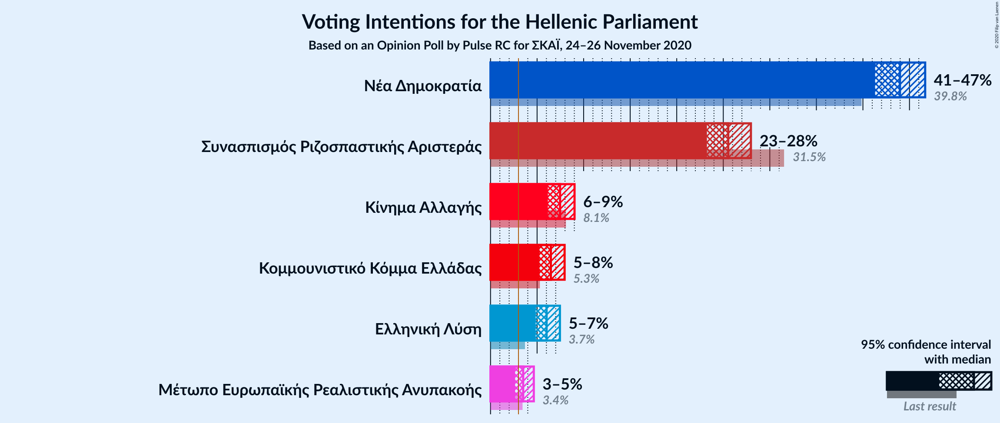

### Confidence Intervals

| Party | Last Result | Poll Result | 80% Confidence Interval | 90% Confidence Interval | 95% Confidence Interval | 99% Confidence Interval |
|:-----:|:-----------:|:-----------:|:-----------------------:|:-----------------------:|:-----------------------:|:-----------------------:|
| Νέα Δημοκρατία | 39.8% | 44.0% | 42.2–45.8% |41.7–46.3% |41.3–46.7% |40.5–47.5% |
| Συνασπισμός Ριζοσπαστικής Αριστεράς | 31.5% | 25.5% | 24.0–27.1% |23.6–27.6% |23.2–28.0% |22.5–28.7% |
| Κίνημα Αλλαγής | 8.1% | 7.5% | 6.6–8.5% |6.4–8.8% |6.2–9.0% |5.8–9.5% |
| Κομμουνιστικό Κόμμα Ελλάδας | 5.3% | 6.5% | 5.7–7.4% |5.5–7.7% |5.3–8.0% |4.9–8.4% |
| Ελληνική Λύση | 3.7% | 6.0% | 5.3–7.0% |5.0–7.2% |4.8–7.5% |4.5–7.9% |
| Μέτωπο Ευρωπαϊκής Ρεαλιστικής Ανυπακοής | 3.4% | 3.5% | 2.9–4.3% |2.8–4.5% |2.6–4.6% |2.4–5.0% |

*Note:* The poll result column reflects the actual value used in the calculations. Published results may vary slightly, and in addition be rounded to fewer digits.

## Seats

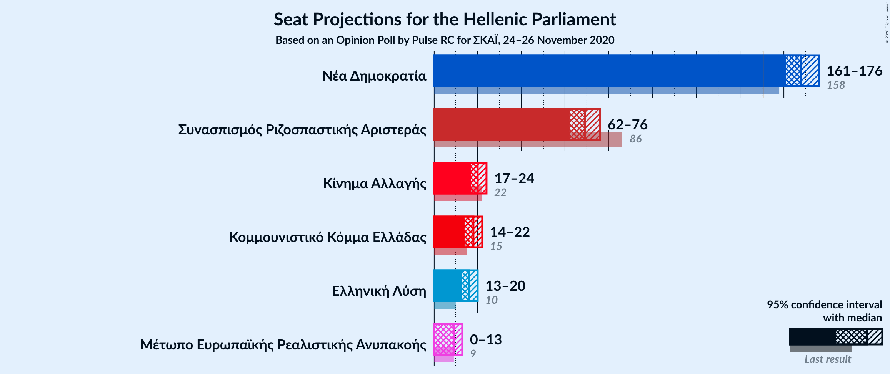

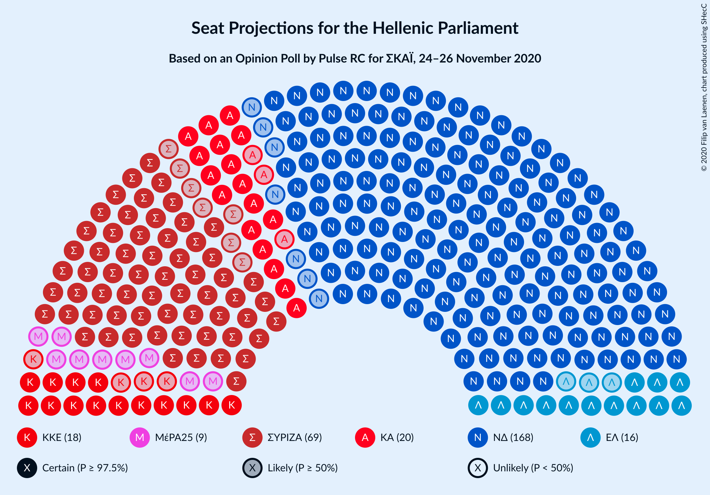

### Confidence Intervals

| Party | Last Result | Median | 80% Confidence Interval | 90% Confidence Interval | 95% Confidence Interval | 99% Confidence Interval |
|:-----:|:-----------:|:------:|:-----------------------:|:-----------------------:|:-----------------------:|:-----------------------:|
| <a href="#νέα-δημοκρατία">Νέα Δημοκρατία</a> | 158 | 168 | 163–173 |162–175 |161–176 |159–179 |
| <a href="#συνασπισμός-ριζοσπαστικής-αριστεράς">Συνασπισμός Ριζοσπαστικής Αριστεράς</a> | 86 | 69 | 65–73 |63–74 |62–76 |61–78 |
| <a href="#κίνημα-αλλαγής">Κίνημα Αλλαγής</a> | 22 | 20 | 18–23 |17–24 |17–24 |15–26 |
| <a href="#κομμουνιστικό-κόμμα-ελλάδας">Κομμουνιστικό Κόμμα Ελλάδας</a> | 15 | 18 | 15–20 |15–21 |14–22 |13–23 |
| <a href="#ελληνική-λύση">Ελληνική Λύση</a> | 10 | 16 | 14–19 |14–19 |13–20 |12–21 |
| <a href="#μέτωπο-ευρωπαϊκής-ρεαλιστικής-ανυπακοής">Μέτωπο Ευρωπαϊκής Ρεαλιστικής Ανυπακοής</a> | 9 | 9 | 0–11 |0–12 |0–13 |0–13 |

### Νέα Δημοκρατία

*For a full overview of the results for this party, see the [Νέα Δημοκρατία](party-νέαδημοκρατία.html) page.*

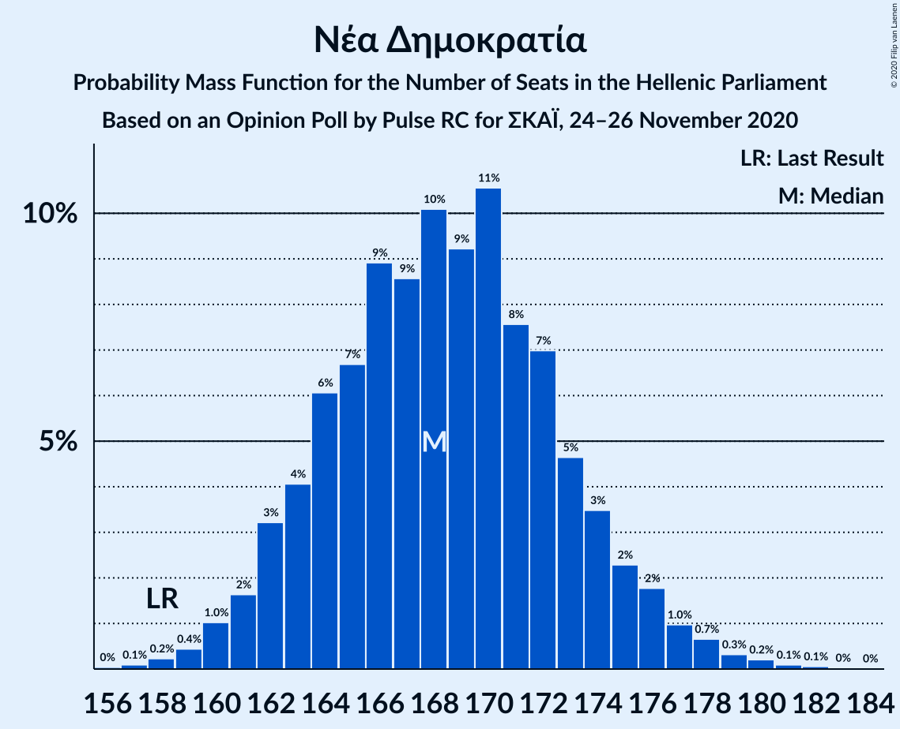

| Number of Seats | Probability | Accumulated | Special Marks |
|:---------------:|:-----------:|:-----------:|:-------------:|
| 156 | 0% | 100% |  |
| 157 | 0.1% | 99.9% |  |
| 158 | 0.2% | 99.8% | Last Result |
| 159 | 0.4% | 99.6% |  |
| 160 | 1.0% | 99.2% |  |
| 161 | 2% | 98% |  |
| 162 | 3% | 97% |  |
| 163 | 4% | 93% |  |
| 164 | 6% | 89% |  |
| 165 | 7% | 83% |  |
| 166 | 9% | 76% |  |
| 167 | 9% | 68% |  |
| 168 | 10% | 59% | Median |
| 169 | 9% | 49% |  |
| 170 | 11% | 40% |  |
| 171 | 8% | 29% |  |
| 172 | 7% | 22% |  |
| 173 | 5% | 15% |  |
| 174 | 3% | 10% |  |
| 175 | 2% | 6% |  |
| 176 | 2% | 4% |  |
| 177 | 1.0% | 2% |  |
| 178 | 0.7% | 1.4% |  |
| 179 | 0.3% | 0.7% |  |
| 180 | 0.2% | 0.4% |  |
| 181 | 0.1% | 0.2% |  |
| 182 | 0.1% | 0.1% |  |
| 183 | 0% | 0% |  |

### Συνασπισμός Ριζοσπαστικής Αριστεράς

*For a full overview of the results for this party, see the [Συνασπισμός Ριζοσπαστικής Αριστεράς](party-συνασπισμόςριζοσπαστικήςαριστεράς.html) page.*

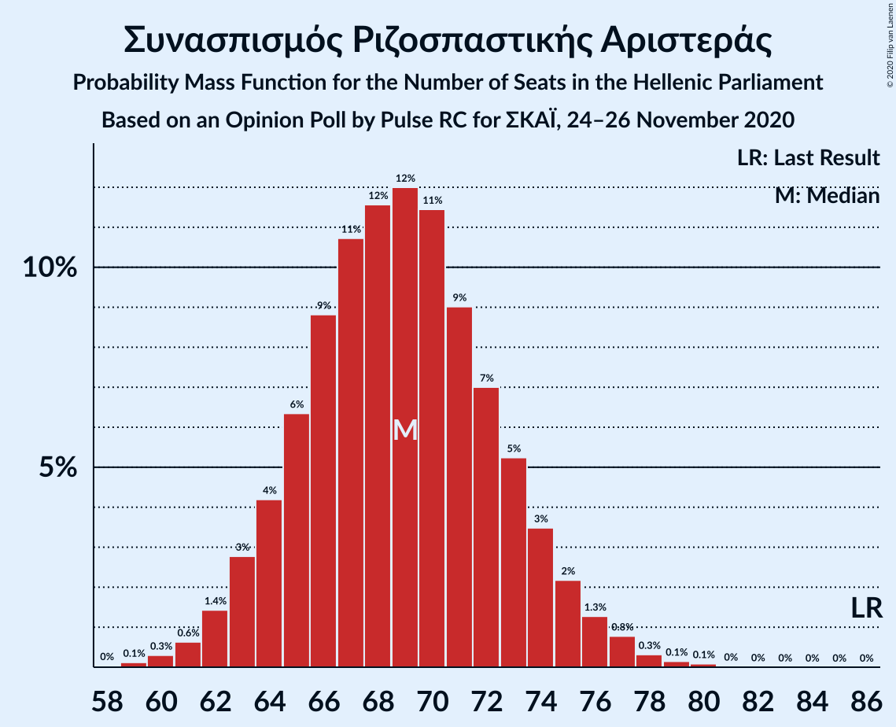

| Number of Seats | Probability | Accumulated | Special Marks |
|:---------------:|:-----------:|:-----------:|:-------------:|
| 58 | 0% | 100% |  |
| 59 | 0.1% | 99.9% |  |
| 60 | 0.3% | 99.8% |  |
| 61 | 0.6% | 99.5% |  |
| 62 | 1.4% | 98.9% |  |
| 63 | 3% | 97% |  |
| 64 | 4% | 95% |  |
| 65 | 6% | 90% |  |
| 66 | 9% | 84% |  |
| 67 | 11% | 75% |  |
| 68 | 12% | 65% |  |
| 69 | 12% | 53% | Median |
| 70 | 11% | 41% |  |
| 71 | 9% | 30% |  |
| 72 | 7% | 21% |  |
| 73 | 5% | 14% |  |
| 74 | 3% | 8% |  |
| 75 | 2% | 5% |  |
| 76 | 1.3% | 3% |  |
| 77 | 0.8% | 1.4% |  |
| 78 | 0.3% | 0.6% |  |
| 79 | 0.1% | 0.3% |  |
| 80 | 0.1% | 0.1% |  |
| 81 | 0% | 0% |  |
| 82 | 0% | 0% |  |
| 83 | 0% | 0% |  |
| 84 | 0% | 0% |  |
| 85 | 0% | 0% |  |
| 86 | 0% | 0% | Last Result |

### Κίνημα Αλλαγής

*For a full overview of the results for this party, see the [Κίνημα Αλλαγής](party-κίνημααλλαγής.html) page.*

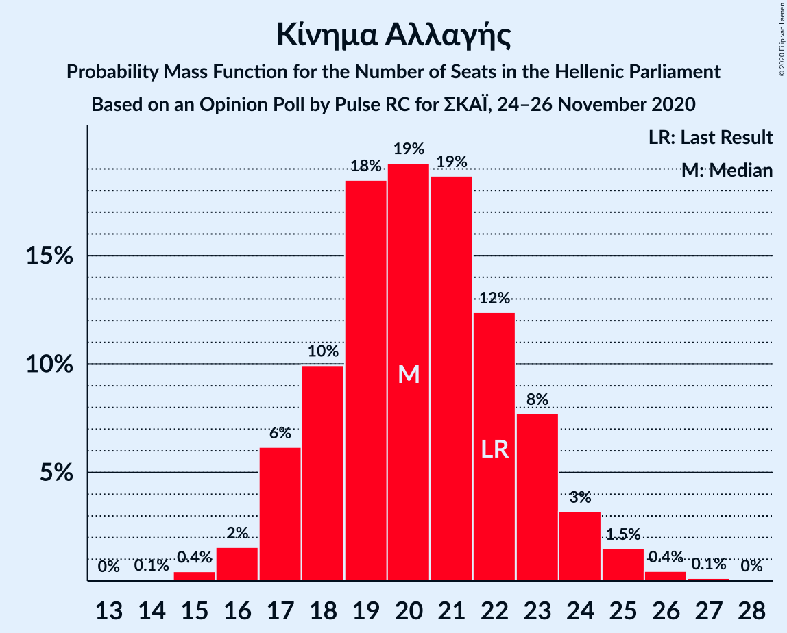

| Number of Seats | Probability | Accumulated | Special Marks |
|:---------------:|:-----------:|:-----------:|:-------------:|
| 14 | 0.1% | 100% |  |
| 15 | 0.4% | 99.9% |  |
| 16 | 2% | 99.5% |  |
| 17 | 6% | 98% |  |
| 18 | 10% | 92% |  |
| 19 | 18% | 82% |  |
| 20 | 19% | 63% | Median |
| 21 | 19% | 44% |  |
| 22 | 12% | 25% | Last Result |
| 23 | 8% | 13% |  |
| 24 | 3% | 5% |  |
| 25 | 1.5% | 2% |  |
| 26 | 0.4% | 0.6% |  |
| 27 | 0.1% | 0.2% |  |
| 28 | 0% | 0% |  |

### Κομμουνιστικό Κόμμα Ελλάδας

*For a full overview of the results for this party, see the [Κομμουνιστικό Κόμμα Ελλάδας](party-κομμουνιστικόκόμμαελλάδας.html) page.*

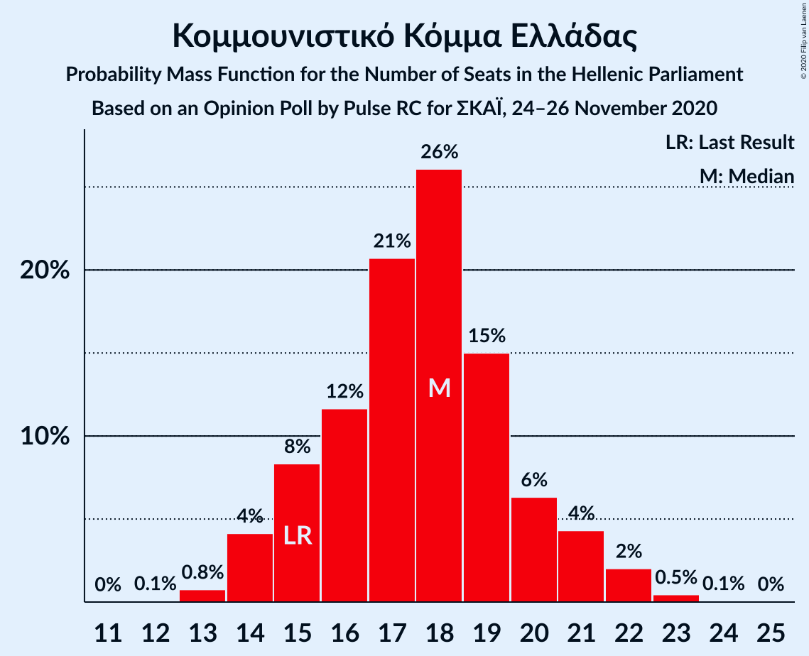

| Number of Seats | Probability | Accumulated | Special Marks |
|:---------------:|:-----------:|:-----------:|:-------------:|
| 12 | 0.1% | 100% |  |
| 13 | 0.8% | 99.9% |  |
| 14 | 4% | 99.2% |  |
| 15 | 8% | 95% | Last Result |
| 16 | 12% | 87% |  |
| 17 | 21% | 75% |  |
| 18 | 26% | 54% | Median |
| 19 | 15% | 28% |  |
| 20 | 6% | 13% |  |
| 21 | 4% | 7% |  |
| 22 | 2% | 3% |  |
| 23 | 0.5% | 0.6% |  |
| 24 | 0.1% | 0.1% |  |
| 25 | 0% | 0% |  |

### Ελληνική Λύση

*For a full overview of the results for this party, see the [Ελληνική Λύση](party-ελληνικήλύση.html) page.*

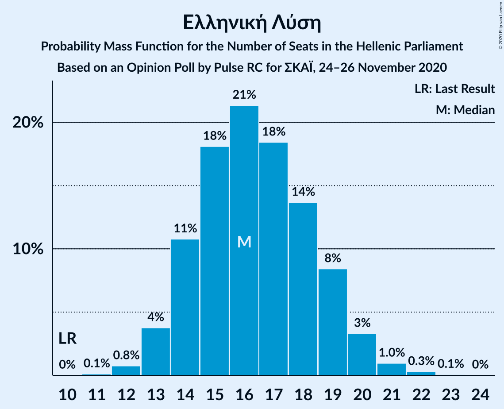

| Number of Seats | Probability | Accumulated | Special Marks |
|:---------------:|:-----------:|:-----------:|:-------------:|
| 10 | 0% | 100% | Last Result |
| 11 | 0.1% | 100% |  |
| 12 | 0.8% | 99.9% |  |
| 13 | 4% | 99.1% |  |
| 14 | 11% | 95% |  |
| 15 | 18% | 85% |  |
| 16 | 21% | 66% | Median |
| 17 | 18% | 45% |  |
| 18 | 14% | 27% |  |
| 19 | 8% | 13% |  |
| 20 | 3% | 5% |  |
| 21 | 1.0% | 1.3% |  |
| 22 | 0.3% | 0.4% |  |
| 23 | 0.1% | 0.1% |  |
| 24 | 0% | 0% |  |

### Μέτωπο Ευρωπαϊκής Ρεαλιστικής Ανυπακοής

*For a full overview of the results for this party, see the [Μέτωπο Ευρωπαϊκής Ρεαλιστικής Ανυπακοής](party-μέτωποευρωπαϊκήςρεαλιστικήςανυπακοής.html) page.*

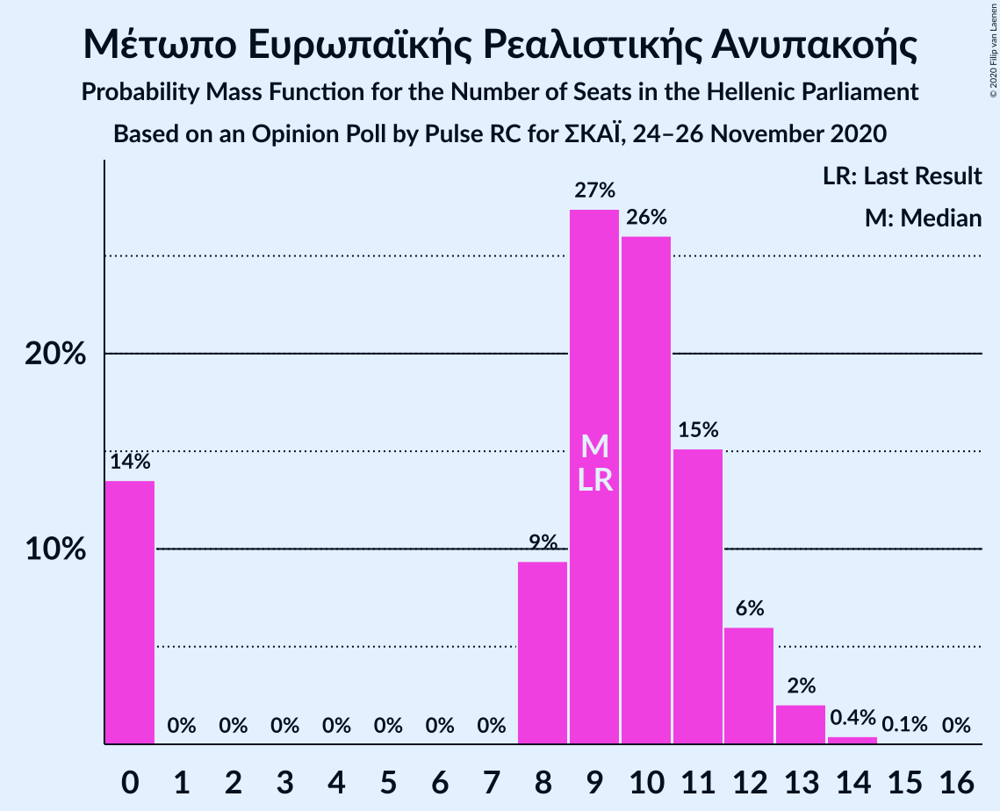

| Number of Seats | Probability | Accumulated | Special Marks |
|:---------------:|:-----------:|:-----------:|:-------------:|
| 0 | 14% | 100% |  |
| 1 | 0% | 86% |  |
| 2 | 0% | 86% |  |
| 3 | 0% | 86% |  |
| 4 | 0% | 86% |  |
| 5 | 0% | 86% |  |
| 6 | 0% | 86% |  |
| 7 | 0% | 86% |  |
| 8 | 9% | 86% |  |
| 9 | 27% | 77% | Last Result, Median |
| 10 | 26% | 50% |  |
| 11 | 15% | 24% |  |
| 12 | 6% | 9% |  |
| 13 | 2% | 3% |  |
| 14 | 0.4% | 0.5% |  |
| 15 | 0.1% | 0.1% |  |
| 16 | 0% | 0% |  |

## Coalitions

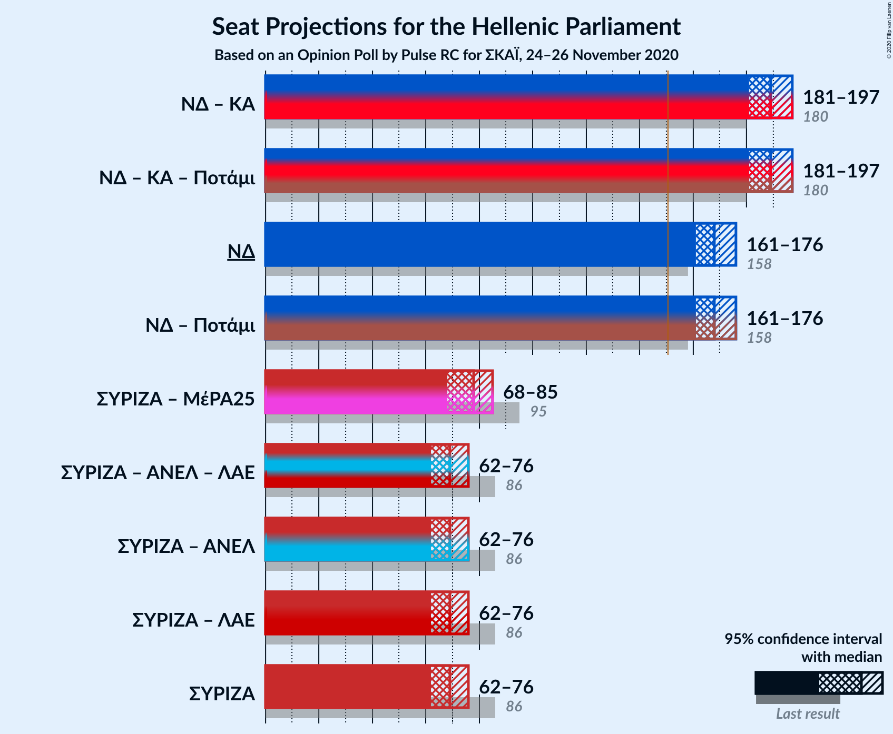

### Confidence Intervals

| Coalition | Last Result | Median | Majority? | 80% Confidence Interval | 90% Confidence Interval | 95% Confidence Interval | 99% Confidence Interval |
|:---------:|:-----------:|:------:|:---------:|:-----------------------:|:-----------------------:|:-----------------------:|:-----------------------:|
| Νέα Δημοκρατία – Κίνημα Αλλαγής | 180 | 189 | 100% | 184–194 | 182–196 | 181–197 | 179–200 |
| Νέα Δημοκρατία | 158 | 168 | 100% | 163–173 | 162–175 | 161–176 | 159–179 |
| Συνασπισμός Ριζοσπαστικής Αριστεράς – Μέτωπο Ευρωπαϊκής Ρεαλιστικής Ανυπακοής | 95 | 78 | 0% | 72–82 | 70–83 | 68–85 | 65–87 |
| Συνασπισμός Ριζοσπαστικής Αριστεράς | 86 | 69 | 0% | 65–73 | 63–74 | 62–76 | 61–78 |

### Νέα Δημοκρατία – Κίνημα Αλλαγής

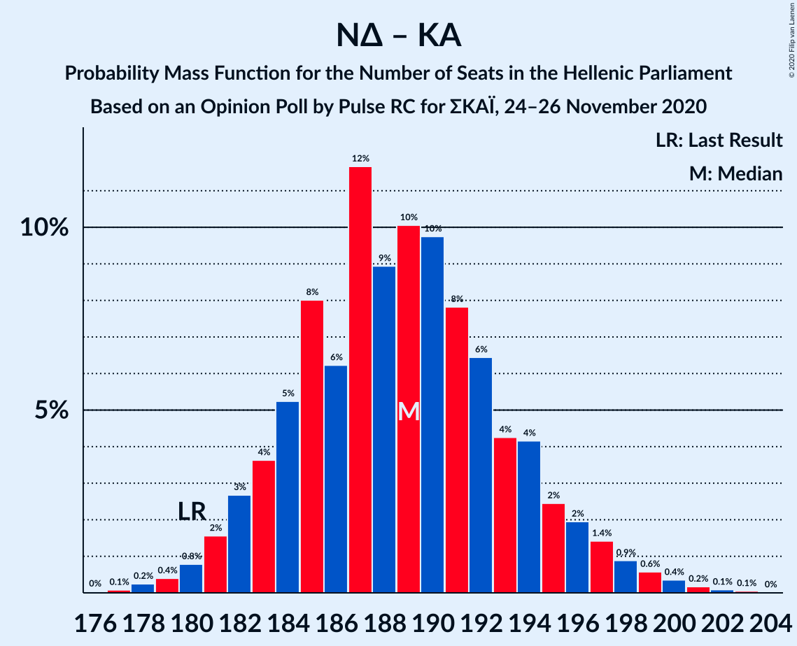

| Number of Seats | Probability | Accumulated | Special Marks |
|:---------------:|:-----------:|:-----------:|:-------------:|
| 176 | 0% | 100% |  |
| 177 | 0.1% | 99.9% |  |
| 178 | 0.2% | 99.9% |  |
| 179 | 0.4% | 99.6% |  |
| 180 | 0.8% | 99.2% | Last Result |
| 181 | 2% | 98% |  |
| 182 | 3% | 97% |  |
| 183 | 4% | 94% |  |
| 184 | 5% | 91% |  |
| 185 | 8% | 85% |  |
| 186 | 6% | 77% |  |
| 187 | 12% | 71% |  |
| 188 | 9% | 59% | Median |
| 189 | 10% | 50% |  |
| 190 | 10% | 40% |  |
| 191 | 8% | 31% |  |
| 192 | 6% | 23% |  |
| 193 | 4% | 16% |  |
| 194 | 4% | 12% |  |
| 195 | 2% | 8% |  |
| 196 | 2% | 6% |  |
| 197 | 1.4% | 4% |  |
| 198 | 0.9% | 2% |  |
| 199 | 0.6% | 1.3% |  |
| 200 | 0.4% | 0.7% |  |
| 201 | 0.2% | 0.3% |  |
| 202 | 0.1% | 0.2% |  |
| 203 | 0.1% | 0.1% |  |
| 204 | 0% | 0% |  |

### Νέα Δημοκρατία

| Number of Seats | Probability | Accumulated | Special Marks |
|:---------------:|:-----------:|:-----------:|:-------------:|
| 156 | 0% | 100% |  |
| 157 | 0.1% | 99.9% |  |
| 158 | 0.2% | 99.8% | Last Result |
| 159 | 0.4% | 99.6% |  |
| 160 | 1.0% | 99.2% |  |
| 161 | 2% | 98% |  |
| 162 | 3% | 97% |  |
| 163 | 4% | 93% |  |
| 164 | 6% | 89% |  |
| 165 | 7% | 83% |  |
| 166 | 9% | 76% |  |
| 167 | 9% | 68% |  |
| 168 | 10% | 59% | Median |
| 169 | 9% | 49% |  |
| 170 | 11% | 40% |  |
| 171 | 8% | 29% |  |
| 172 | 7% | 22% |  |
| 173 | 5% | 15% |  |
| 174 | 3% | 10% |  |
| 175 | 2% | 6% |  |
| 176 | 2% | 4% |  |
| 177 | 1.0% | 2% |  |
| 178 | 0.7% | 1.4% |  |
| 179 | 0.3% | 0.7% |  |
| 180 | 0.2% | 0.4% |  |
| 181 | 0.1% | 0.2% |  |
| 182 | 0.1% | 0.1% |  |
| 183 | 0% | 0% |  |

### Συνασπισμός Ριζοσπαστικής Αριστεράς – Μέτωπο Ευρωπαϊκής Ρεαλιστικής Ανυπακοής

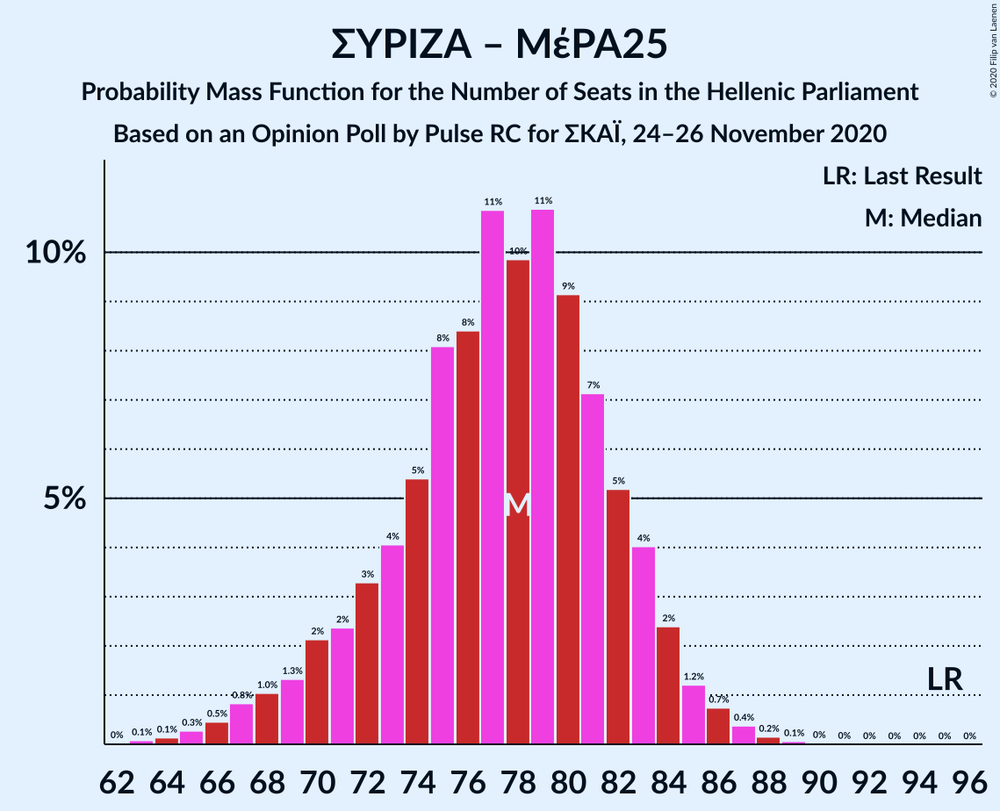

| Number of Seats | Probability | Accumulated | Special Marks |
|:---------------:|:-----------:|:-----------:|:-------------:|
| 63 | 0.1% | 100% |  |
| 64 | 0.1% | 99.9% |  |
| 65 | 0.3% | 99.7% |  |
| 66 | 0.5% | 99.5% |  |
| 67 | 0.8% | 99.0% |  |
| 68 | 1.0% | 98% |  |
| 69 | 1.3% | 97% |  |
| 70 | 2% | 96% |  |
| 71 | 2% | 94% |  |
| 72 | 3% | 91% |  |
| 73 | 4% | 88% |  |
| 74 | 5% | 84% |  |
| 75 | 8% | 79% |  |
| 76 | 8% | 70% |  |
| 77 | 11% | 62% |  |
| 78 | 10% | 51% | Median |
| 79 | 11% | 41% |  |
| 80 | 9% | 30% |  |
| 81 | 7% | 21% |  |
| 82 | 5% | 14% |  |
| 83 | 4% | 9% |  |
| 84 | 2% | 5% |  |
| 85 | 1.2% | 3% |  |
| 86 | 0.7% | 1.4% |  |
| 87 | 0.4% | 0.6% |  |
| 88 | 0.2% | 0.3% |  |
| 89 | 0.1% | 0.1% |  |
| 90 | 0% | 0% |  |
| 91 | 0% | 0% |  |
| 92 | 0% | 0% |  |
| 93 | 0% | 0% |  |
| 94 | 0% | 0% |  |
| 95 | 0% | 0% | Last Result |

### Συνασπισμός Ριζοσπαστικής Αριστεράς

| Number of Seats | Probability | Accumulated | Special Marks |
|:---------------:|:-----------:|:-----------:|:-------------:|
| 58 | 0% | 100% |  |
| 59 | 0.1% | 99.9% |  |
| 60 | 0.3% | 99.8% |  |
| 61 | 0.6% | 99.5% |  |
| 62 | 1.4% | 98.9% |  |
| 63 | 3% | 97% |  |
| 64 | 4% | 95% |  |
| 65 | 6% | 90% |  |
| 66 | 9% | 84% |  |
| 67 | 11% | 75% |  |
| 68 | 12% | 65% |  |
| 69 | 12% | 53% | Median |
| 70 | 11% | 41% |  |
| 71 | 9% | 30% |  |
| 72 | 7% | 21% |  |
| 73 | 5% | 14% |  |
| 74 | 3% | 8% |  |
| 75 | 2% | 5% |  |
| 76 | 1.3% | 3% |  |
| 77 | 0.8% | 1.4% |  |
| 78 | 0.3% | 0.6% |  |
| 79 | 0.1% | 0.3% |  |
| 80 | 0.1% | 0.1% |  |
| 81 | 0% | 0% |  |
| 82 | 0% | 0% |  |
| 83 | 0% | 0% |  |
| 84 | 0% | 0% |  |
| 85 | 0% | 0% |  |
| 86 | 0% | 0% | Last Result |

## Technical Information

### Opinion Poll

+ **Polling firm:** Pulse RC
+ **Commissioner(s):** ΣΚΑΪ
+ **Fieldwork period:** 24–26 November 2020

### Calculations

+ **Sample size:** 1312
+ **Simulations done:** 1,048,576
+ **Error estimate:** 0.38%

