# Opinion Poll by Prorata, 24–27 November 2020

<a href="#voting-intentions">Voting Intentions</a> | <a href="#seats">Seats</a> | <a href="#coalitions">Coalitions</a> | <a href="#technical-information">Technical Information</a>

## Voting Intentions

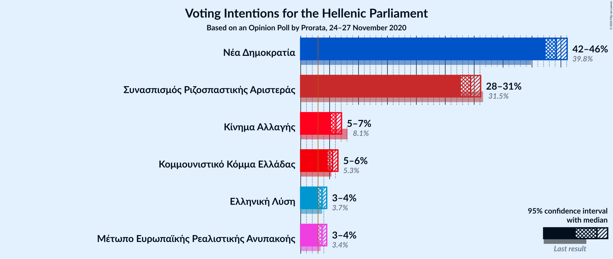

### Confidence Intervals

| Party | Last Result | Poll Result | 80% Confidence Interval | 90% Confidence Interval | 95% Confidence Interval | 99% Confidence Interval |
|:-----:|:-----------:|:-----------:|:-----------------------:|:-----------------------:|:-----------------------:|:-----------------------:|
| Νέα Δημοκρατία | 39.8% | 44.2% | 43.0–45.4% |42.6–45.8% |42.3–46.1% |41.8–46.7% |
| Συνασπισμός Ριζοσπαστικής Αριστεράς | 31.5% | 29.4% | 28.3–30.5% |28.0–30.8% |27.7–31.1% |27.2–31.7% |
| Κίνημα Αλλαγής | 8.1% | 6.1% | 5.5–6.7% |5.4–6.9% |5.2–7.1% |5.0–7.4% |
| Κομμουνιστικό Κόμμα Ελλάδας | 5.3% | 5.5% | 5.0–6.1% |4.8–6.3% |4.7–6.4% |4.5–6.7% |
| Ελληνική Λύση | 3.7% | 3.7% | 3.3–4.2% |3.2–4.4% |3.0–4.5% |2.9–4.7% |
| Μέτωπο Ευρωπαϊκής Ρεαλιστικής Ανυπακοής | 3.4% | 3.7% | 3.3–4.2% |3.2–4.4% |3.0–4.5% |2.9–4.7% |

*Note:* The poll result column reflects the actual value used in the calculations. Published results may vary slightly, and in addition be rounded to fewer digits.

## Seats

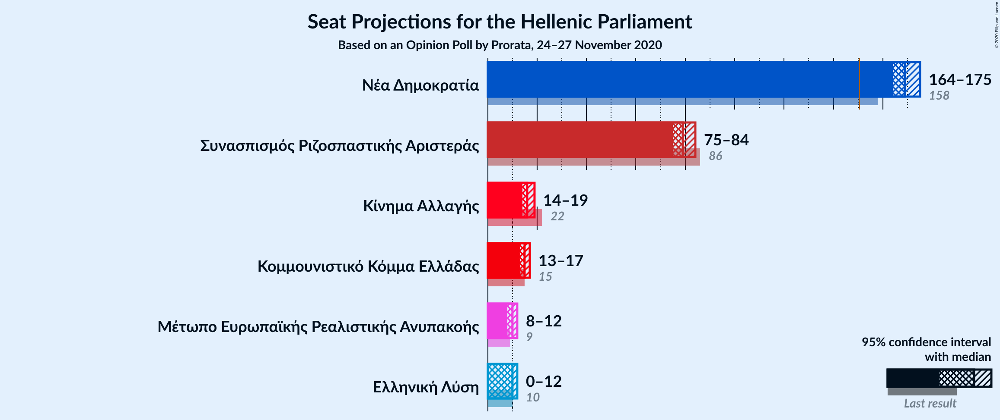

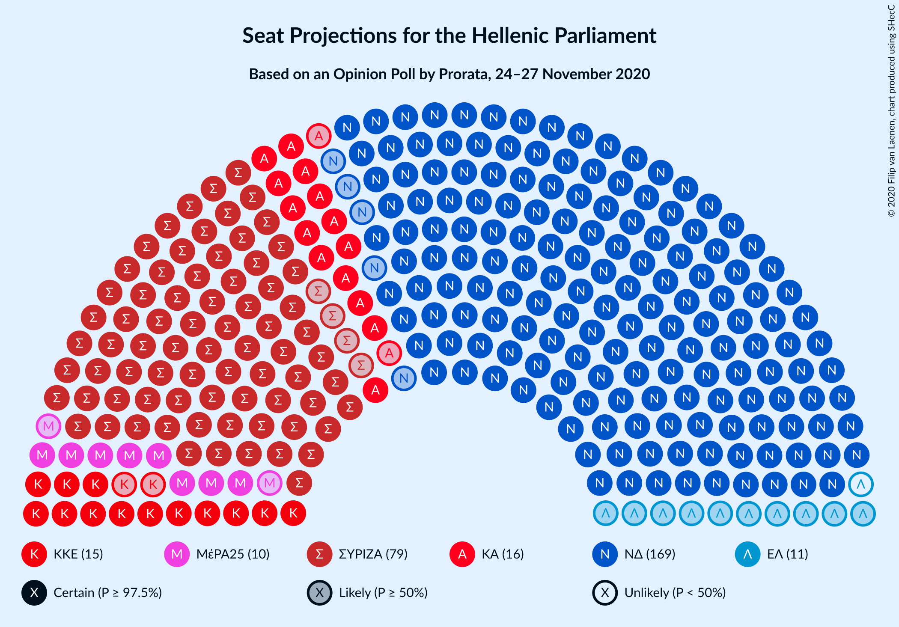

### Confidence Intervals

| Party | Last Result | Median | 80% Confidence Interval | 90% Confidence Interval | 95% Confidence Interval | 99% Confidence Interval |
|:-----:|:-----------:|:------:|:-----------------------:|:-----------------------:|:-----------------------:|:-----------------------:|
| <a href="#νέα-δημοκρατία">Νέα Δημοκρατία</a> | 158 | 169 | 166–173 |165–174 |164–175 |163–178 |
| <a href="#συνασπισμός-ριζοσπαστικής-αριστεράς">Συνασπισμός Ριζοσπαστικής Αριστεράς</a> | 86 | 79 | 76–83 |75–84 |75–84 |73–86 |
| <a href="#κίνημα-αλλαγής">Κίνημα Αλλαγής</a> | 22 | 16 | 15–18 |15–19 |14–19 |14–20 |
| <a href="#κομμουνιστικό-κόμμα-ελλάδας">Κομμουνιστικό Κόμμα Ελλάδας</a> | 15 | 15 | 13–16 |13–17 |13–17 |12–18 |
| <a href="#ελληνική-λύση">Ελληνική Λύση</a> | 10 | 10 | 9–11 |9–12 |0–12 |0–12 |
| <a href="#μέτωπο-ευρωπαϊκής-ρεαλιστικής-ανυπακοής">Μέτωπο Ευρωπαϊκής Ρεαλιστικής Ανυπακοής</a> | 9 | 10 | 9–11 |9–12 |8–12 |0–13 |

### Νέα Δημοκρατία

*For a full overview of the results for this party, see the [Νέα Δημοκρατία](party-νέαδημοκρατία.html) page.*

| Number of Seats | Probability | Accumulated | Special Marks |
|:---------------:|:-----------:|:-----------:|:-------------:|
| 158 | 0% | 100% | Last Result |
| 159 | 0% | 100% |  |
| 160 | 0% | 100% |  |
| 161 | 0.1% | 100% |  |
| 162 | 0.2% | 99.9% |  |
| 163 | 0.8% | 99.7% |  |
| 164 | 2% | 98.9% |  |
| 165 | 4% | 97% |  |
| 166 | 7% | 93% |  |
| 167 | 10% | 86% |  |
| 168 | 16% | 76% |  |
| 169 | 14% | 61% | Median |
| 170 | 16% | 47% |  |
| 171 | 9% | 31% |  |
| 172 | 10% | 21% |  |
| 173 | 4% | 12% |  |
| 174 | 3% | 7% |  |
| 175 | 2% | 4% |  |
| 176 | 1.0% | 2% |  |
| 177 | 0.5% | 1.2% |  |
| 178 | 0.4% | 0.6% |  |
| 179 | 0.1% | 0.2% |  |
| 180 | 0.1% | 0.1% |  |
| 181 | 0% | 0% |  |

### Συνασπισμός Ριζοσπαστικής Αριστεράς

*For a full overview of the results for this party, see the [Συνασπισμός Ριζοσπαστικής Αριστεράς](party-συνασπισμόςριζοσπαστικήςαριστεράς.html) page.*

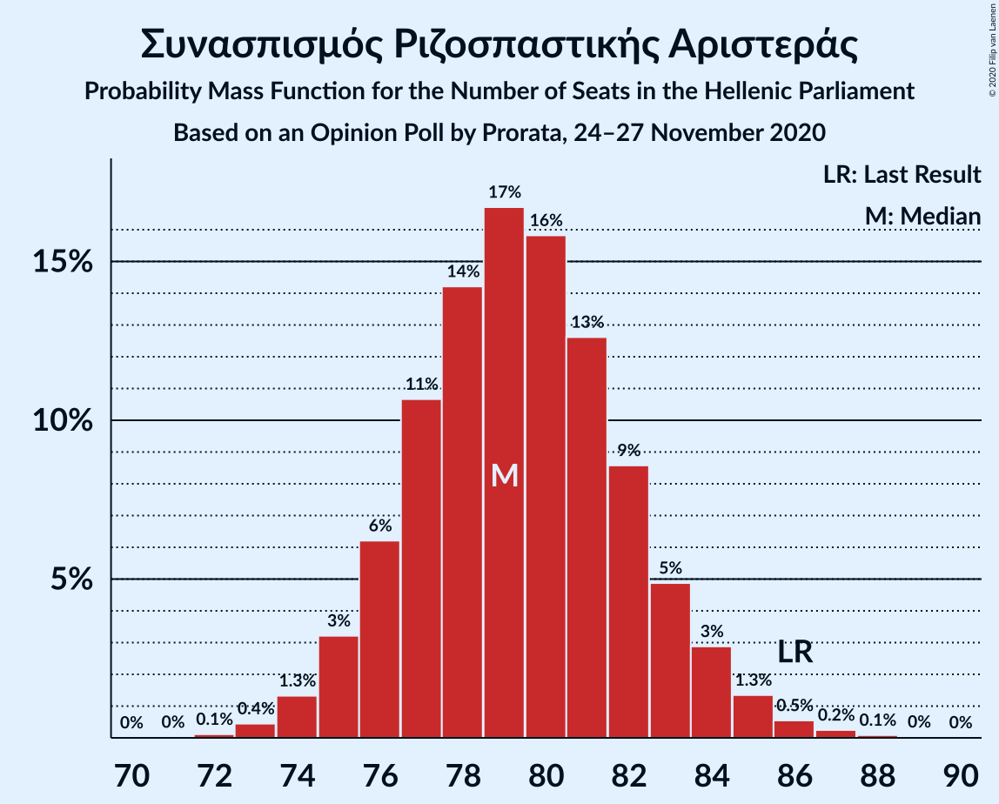

| Number of Seats | Probability | Accumulated | Special Marks |
|:---------------:|:-----------:|:-----------:|:-------------:|
| 72 | 0.1% | 100% |  |
| 73 | 0.4% | 99.9% |  |
| 74 | 1.3% | 99.4% |  |
| 75 | 3% | 98% |  |
| 76 | 6% | 95% |  |
| 77 | 11% | 89% |  |
| 78 | 14% | 78% |  |
| 79 | 17% | 64% | Median |
| 80 | 16% | 47% |  |
| 81 | 13% | 31% |  |
| 82 | 9% | 19% |  |
| 83 | 5% | 10% |  |
| 84 | 3% | 5% |  |
| 85 | 1.3% | 2% |  |
| 86 | 0.5% | 0.9% | Last Result |
| 87 | 0.2% | 0.4% |  |
| 88 | 0.1% | 0.1% |  |
| 89 | 0% | 0% |  |

### Κίνημα Αλλαγής

*For a full overview of the results for this party, see the [Κίνημα Αλλαγής](party-κίνημααλλαγής.html) page.*

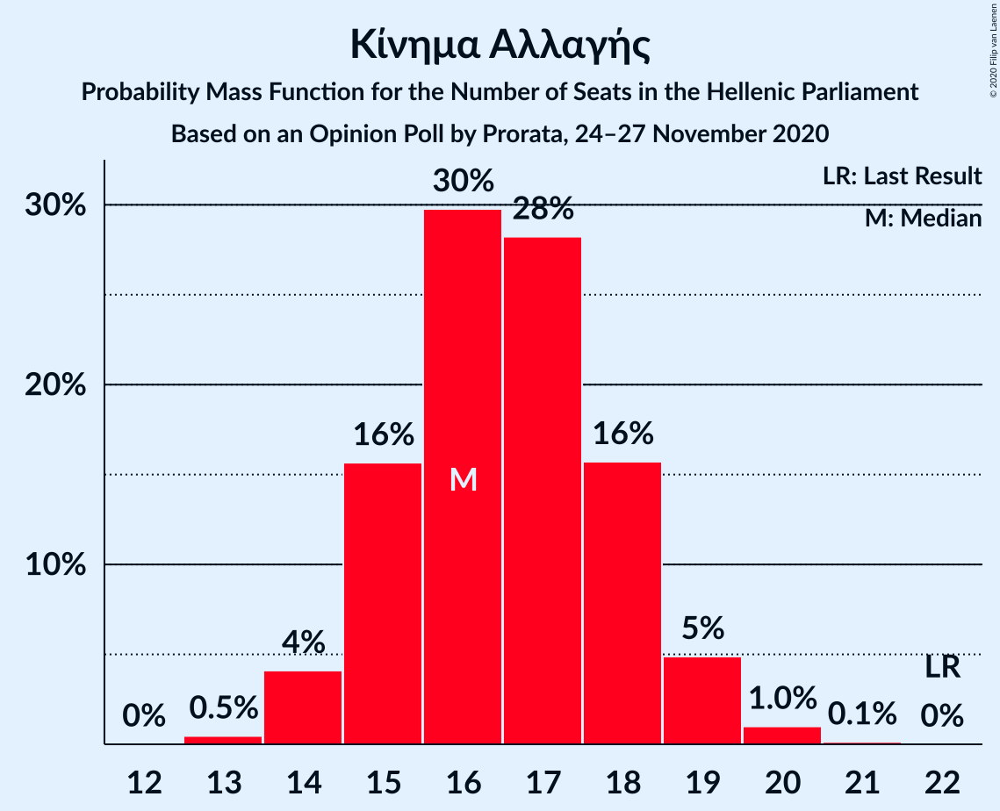

| Number of Seats | Probability | Accumulated | Special Marks |
|:---------------:|:-----------:|:-----------:|:-------------:|
| 13 | 0.5% | 100% |  |
| 14 | 4% | 99.5% |  |
| 15 | 16% | 95% |  |
| 16 | 30% | 80% | Median |
| 17 | 28% | 50% |  |
| 18 | 16% | 22% |  |
| 19 | 5% | 6% |  |
| 20 | 1.0% | 1.1% |  |
| 21 | 0.1% | 0.1% |  |
| 22 | 0% | 0% | Last Result |

### Κομμουνιστικό Κόμμα Ελλάδας

*For a full overview of the results for this party, see the [Κομμουνιστικό Κόμμα Ελλάδας](party-κομμουνιστικόκόμμαελλάδας.html) page.*

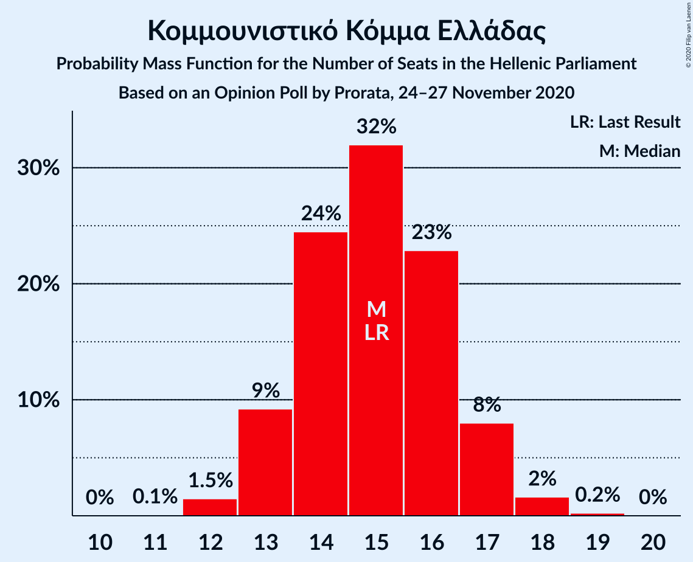

| Number of Seats | Probability | Accumulated | Special Marks |
|:---------------:|:-----------:|:-----------:|:-------------:|
| 11 | 0.1% | 100% |  |
| 12 | 1.5% | 99.9% |  |
| 13 | 9% | 98% |  |
| 14 | 24% | 89% |  |
| 15 | 32% | 65% | Last Result, Median |
| 16 | 23% | 33% |  |
| 17 | 8% | 10% |  |
| 18 | 2% | 2% |  |
| 19 | 0.2% | 0.3% |  |
| 20 | 0% | 0% |  |

### Ελληνική Λύση

*For a full overview of the results for this party, see the [Ελληνική Λύση](party-ελληνικήλύση.html) page.*

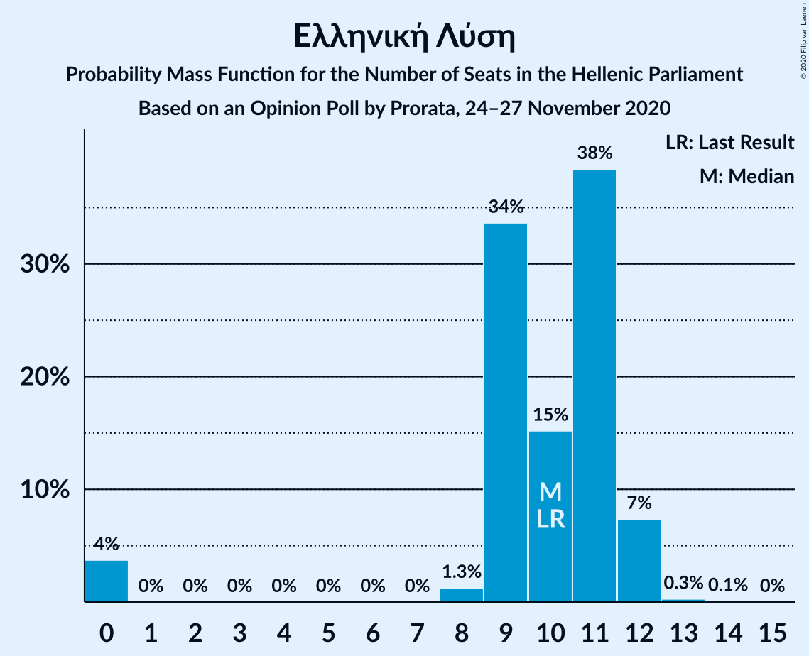

| Number of Seats | Probability | Accumulated | Special Marks |
|:---------------:|:-----------:|:-----------:|:-------------:|
| 0 | 4% | 100% |  |
| 1 | 0% | 96% |  |
| 2 | 0% | 96% |  |
| 3 | 0% | 96% |  |
| 4 | 0% | 96% |  |
| 5 | 0% | 96% |  |
| 6 | 0% | 96% |  |
| 7 | 0% | 96% |  |
| 8 | 1.3% | 96% |  |
| 9 | 34% | 95% |  |
| 10 | 15% | 61% | Last Result, Median |
| 11 | 38% | 46% |  |
| 12 | 7% | 8% |  |
| 13 | 0.3% | 0.4% |  |
| 14 | 0.1% | 0.1% |  |
| 15 | 0% | 0% |  |

### Μέτωπο Ευρωπαϊκής Ρεαλιστικής Ανυπακοής

*For a full overview of the results for this party, see the [Μέτωπο Ευρωπαϊκής Ρεαλιστικής Ανυπακοής](party-μέτωποευρωπαϊκήςρεαλιστικήςανυπακοής.html) page.*

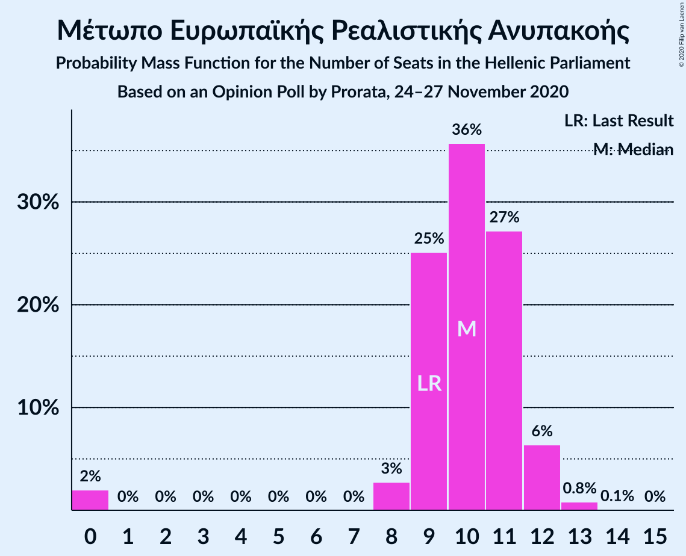

| Number of Seats | Probability | Accumulated | Special Marks |
|:---------------:|:-----------:|:-----------:|:-------------:|
| 0 | 2% | 100% |  |
| 1 | 0% | 98% |  |
| 2 | 0% | 98% |  |
| 3 | 0% | 98% |  |
| 4 | 0% | 98% |  |
| 5 | 0% | 98% |  |
| 6 | 0% | 98% |  |
| 7 | 0% | 98% |  |
| 8 | 3% | 98% |  |
| 9 | 25% | 95% | Last Result |
| 10 | 36% | 70% | Median |
| 11 | 27% | 34% |  |
| 12 | 6% | 7% |  |
| 13 | 0.8% | 0.9% |  |
| 14 | 0.1% | 0.1% |  |
| 15 | 0% | 0% |  |

## Coalitions

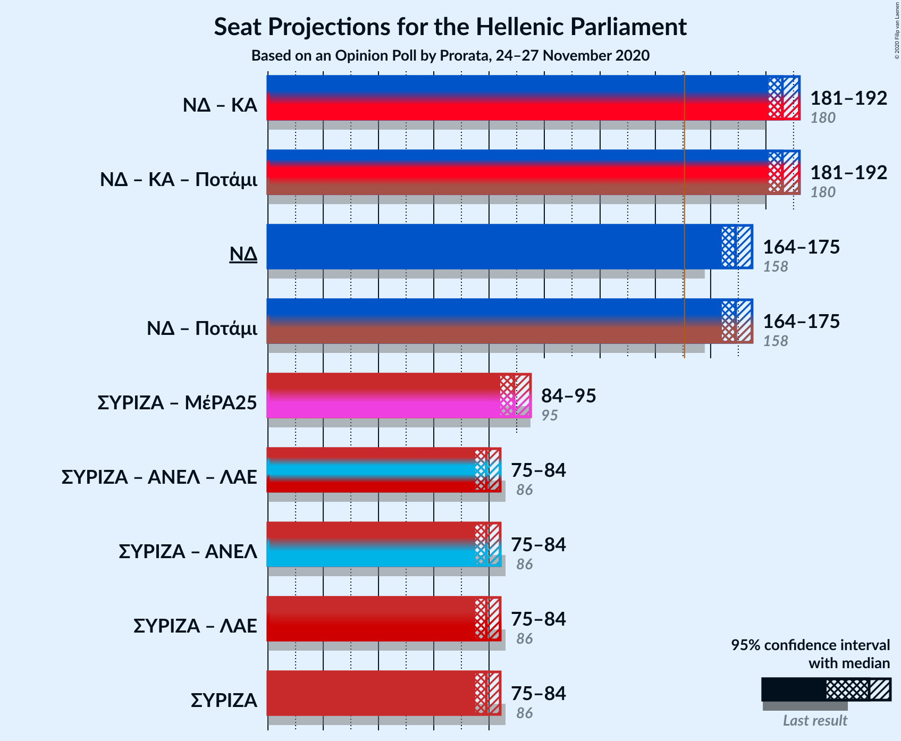

### Confidence Intervals

| Coalition | Last Result | Median | Majority? | 80% Confidence Interval | 90% Confidence Interval | 95% Confidence Interval | 99% Confidence Interval |
|:---------:|:-----------:|:------:|:---------:|:-----------------------:|:-----------------------:|:-----------------------:|:-----------------------:|
| Νέα Δημοκρατία – Κίνημα Αλλαγής | 180 | 186 | 100% | 182–189 | 182–191 | 181–192 | 179–195 |
| Νέα Δημοκρατία | 158 | 169 | 100% | 166–173 | 165–174 | 164–175 | 163–178 |
| Συνασπισμός Ριζοσπαστικής Αριστεράς – Μέτωπο Ευρωπαϊκής Ρεαλιστικής Ανυπακοής | 95 | 89 | 0% | 86–93 | 85–94 | 84–95 | 81–96 |
| Συνασπισμός Ριζοσπαστικής Αριστεράς | 86 | 79 | 0% | 76–83 | 75–84 | 75–84 | 73–86 |

### Νέα Δημοκρατία – Κίνημα Αλλαγής

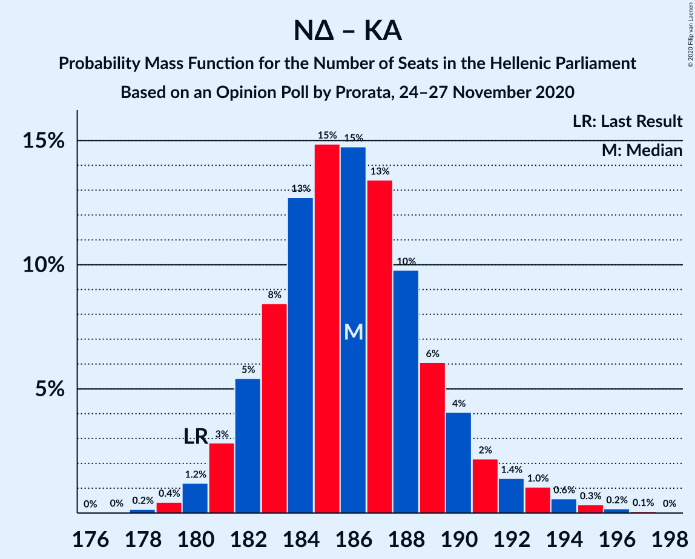

| Number of Seats | Probability | Accumulated | Special Marks |
|:---------------:|:-----------:|:-----------:|:-------------:|
| 177 | 0% | 100% |  |
| 178 | 0.2% | 99.9% |  |
| 179 | 0.4% | 99.8% |  |
| 180 | 1.2% | 99.4% | Last Result |
| 181 | 3% | 98% |  |
| 182 | 5% | 95% |  |
| 183 | 8% | 90% |  |
| 184 | 13% | 81% |  |
| 185 | 15% | 69% | Median |
| 186 | 15% | 54% |  |
| 187 | 13% | 39% |  |
| 188 | 10% | 26% |  |
| 189 | 6% | 16% |  |
| 190 | 4% | 10% |  |
| 191 | 2% | 6% |  |
| 192 | 1.4% | 4% |  |
| 193 | 1.0% | 2% |  |
| 194 | 0.6% | 1.2% |  |
| 195 | 0.3% | 0.6% |  |
| 196 | 0.2% | 0.3% |  |
| 197 | 0.1% | 0.1% |  |
| 198 | 0% | 0% |  |

### Νέα Δημοκρατία

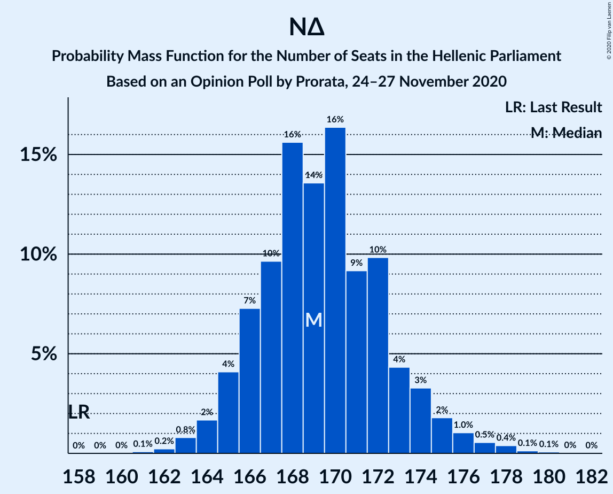

| Number of Seats | Probability | Accumulated | Special Marks |
|:---------------:|:-----------:|:-----------:|:-------------:|
| 158 | 0% | 100% | Last Result |
| 159 | 0% | 100% |  |
| 160 | 0% | 100% |  |
| 161 | 0.1% | 100% |  |
| 162 | 0.2% | 99.9% |  |
| 163 | 0.8% | 99.7% |  |
| 164 | 2% | 98.9% |  |
| 165 | 4% | 97% |  |
| 166 | 7% | 93% |  |
| 167 | 10% | 86% |  |
| 168 | 16% | 76% |  |
| 169 | 14% | 61% | Median |
| 170 | 16% | 47% |  |
| 171 | 9% | 31% |  |
| 172 | 10% | 21% |  |
| 173 | 4% | 12% |  |
| 174 | 3% | 7% |  |
| 175 | 2% | 4% |  |
| 176 | 1.0% | 2% |  |
| 177 | 0.5% | 1.2% |  |
| 178 | 0.4% | 0.6% |  |
| 179 | 0.1% | 0.2% |  |
| 180 | 0.1% | 0.1% |  |
| 181 | 0% | 0% |  |

### Συνασπισμός Ριζοσπαστικής Αριστεράς – Μέτωπο Ευρωπαϊκής Ρεαλιστικής Ανυπακοής

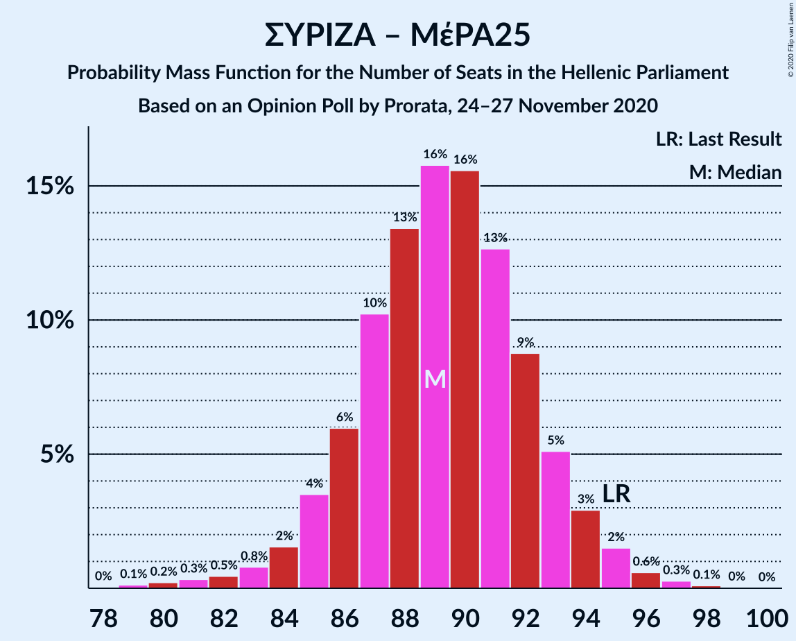

| Number of Seats | Probability | Accumulated | Special Marks |
|:---------------:|:-----------:|:-----------:|:-------------:|
| 78 | 0% | 100% |  |
| 79 | 0.1% | 99.9% |  |
| 80 | 0.2% | 99.8% |  |
| 81 | 0.3% | 99.6% |  |
| 82 | 0.5% | 99.2% |  |
| 83 | 0.8% | 98.8% |  |
| 84 | 2% | 98% |  |
| 85 | 4% | 96% |  |
| 86 | 6% | 93% |  |
| 87 | 10% | 87% |  |
| 88 | 13% | 77% |  |
| 89 | 16% | 63% | Median |
| 90 | 16% | 48% |  |
| 91 | 13% | 32% |  |
| 92 | 9% | 19% |  |
| 93 | 5% | 11% |  |
| 94 | 3% | 5% |  |
| 95 | 2% | 3% | Last Result |
| 96 | 0.6% | 1.0% |  |
| 97 | 0.3% | 0.4% |  |
| 98 | 0.1% | 0.2% |  |
| 99 | 0% | 0% |  |

### Συνασπισμός Ριζοσπαστικής Αριστεράς

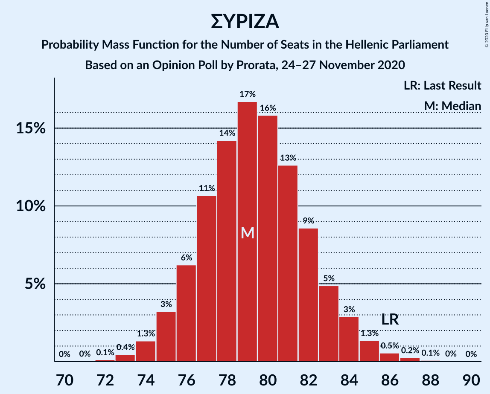

| Number of Seats | Probability | Accumulated | Special Marks |
|:---------------:|:-----------:|:-----------:|:-------------:|
| 72 | 0.1% | 100% |  |
| 73 | 0.4% | 99.9% |  |
| 74 | 1.3% | 99.4% |  |
| 75 | 3% | 98% |  |
| 76 | 6% | 95% |  |
| 77 | 11% | 89% |  |
| 78 | 14% | 78% |  |
| 79 | 17% | 64% | Median |
| 80 | 16% | 47% |  |
| 81 | 13% | 31% |  |
| 82 | 9% | 19% |  |
| 83 | 5% | 10% |  |
| 84 | 3% | 5% |  |
| 85 | 1.3% | 2% |  |
| 86 | 0.5% | 0.9% | Last Result |
| 87 | 0.2% | 0.4% |  |
| 88 | 0.1% | 0.1% |  |
| 89 | 0% | 0% |  |

## Technical Information

### Opinion Poll

+ **Polling firm:** Prorata
+ **Commissioner(s):** —
+ **Fieldwork period:** 24–27 November 2020

### Calculations

+ **Sample size:** 2726
+ **Simulations done:** 1,048,576
+ **Error estimate:** 0.81%

