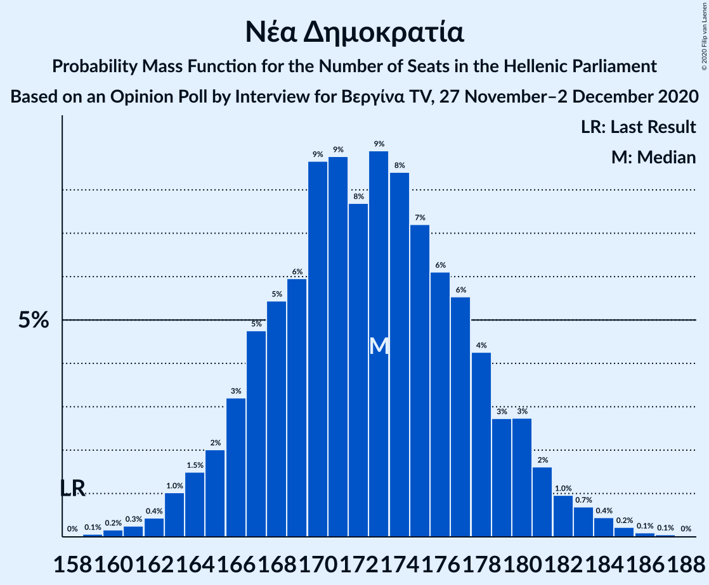
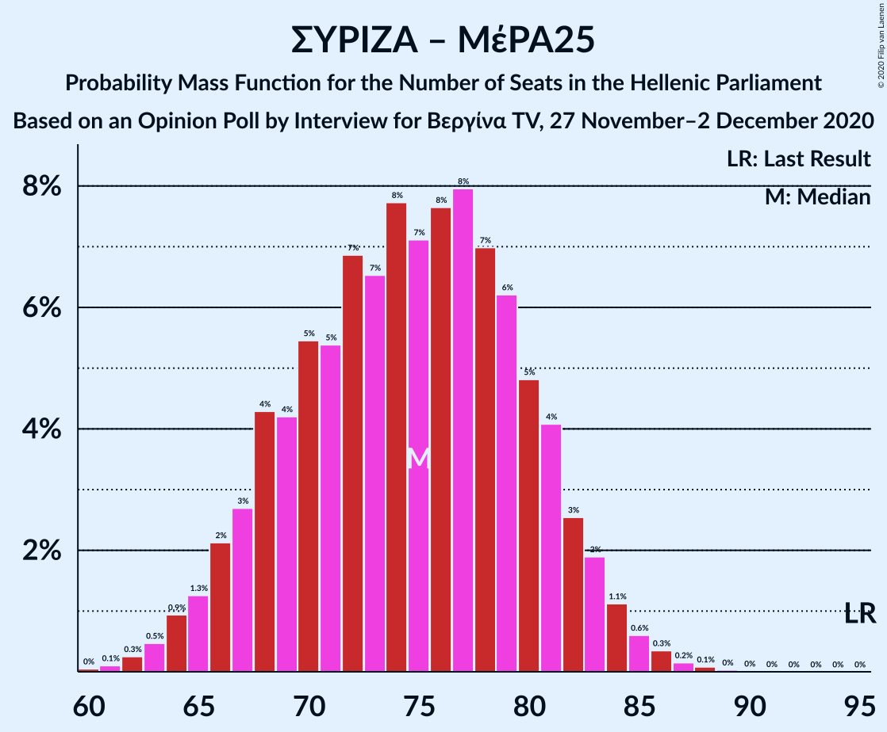

# Opinion Poll by Interview for Βεργίνα TV, 27 November–2 December 2020

<a href="#voting-intentions">Voting Intentions</a> | <a href="#seats">Seats</a> | <a href="#coalitions">Coalitions</a> | <a href="#technical-information">Technical Information</a>

## Voting Intentions

### Confidence Intervals

| Party | Last Result | Poll Result | 80% Confidence Interval | 90% Confidence Interval | 95% Confidence Interval | 99% Confidence Interval |
|:-----:|:-----------:|:-----------:|:-----------------------:|:-----------------------:|:-----------------------:|:-----------------------:|
| Νέα Δημοκρατία | 39.8% | 45.2% | 43.3–47.1% |42.7–47.7% |42.2–48.1% |41.4–49.1% |
| Συνασπισμός Ριζοσπαστικής Αριστεράς | 31.5% | 25.4% | 23.7–27.1% |23.3–27.6% |22.9–28.0% |22.1–28.9% |
| Κίνημα Αλλαγής | 8.1% | 8.0% | 7.0–9.1% |6.8–9.5% |6.5–9.8% |6.1–10.3% |
| Ελληνική Λύση | 3.7% | 5.9% | 5.1–6.9% |4.8–7.2% |4.7–7.5% |4.3–8.0% |
| Κομμουνιστικό Κόμμα Ελλάδας | 5.3% | 5.4% | 4.6–6.3% |4.4–6.6% |4.2–6.9% |3.8–7.4% |
| Μέτωπο Ευρωπαϊκής Ρεαλιστικής Ανυπακοής | 3.4% | 3.1% | 2.5–3.9% |2.3–4.1% |2.2–4.3% |2.0–4.7% |

*Note:* The poll result column reflects the actual value used in the calculations. Published results may vary slightly, and in addition be rounded to fewer digits.

## Seats

### Confidence Intervals

| Party | Last Result | Median | 80% Confidence Interval | 90% Confidence Interval | 95% Confidence Interval | 99% Confidence Interval |
|:-----:|:-----------:|:------:|:-----------------------:|:-----------------------:|:-----------------------:|:-----------------------:|
| <a href="#νέα-δημοκρατία">Νέα Δημοκρατία</a> | 158 | 172 | 167–178 |165–180 |164–182 |161–184 |
| <a href="#συνασπισμός-ριζοσπαστικής-αριστεράς">Συνασπισμός Ριζοσπαστικής Αριστεράς</a> | 86 | 69 | 64–74 |63–75 |62–76 |60–79 |
| <a href="#κίνημα-αλλαγής">Κίνημα Αλλαγής</a> | 22 | 22 | 19–25 |18–26 |18–27 |17–28 |
| <a href="#ελληνική-λύση">Ελληνική Λύση</a> | 10 | 16 | 14–19 |13–20 |13–20 |12–22 |
| <a href="#κομμουνιστικό-κόμμα-ελλάδας">Κομμουνιστικό Κόμμα Ελλάδας</a> | 15 | 15 | 13–17 |12–18 |11–19 |10–20 |
| <a href="#μέτωπο-ευρωπαϊκής-ρεαλιστικής-ανυπακοής">Μέτωπο Ευρωπαϊκής Ρεαλιστικής Ανυπακοής</a> | 9 | 8 | 0–10 |0–11 |0–12 |0–13 |

### Νέα Δημοκρατία

*For a full overview of the results for this party, see the [Νέα Δημοκρατία](party-νέαδημοκρατία.html) page.*

| Number of Seats | Probability | Accumulated | Special Marks |
|:---------------:|:-----------:|:-----------:|:-------------:|
| 158 | 0% | 100% | Last Result |
| 159 | 0% | 100% |  |
| 160 | 0.2% | 99.9% |  |
| 161 | 0.3% | 99.7% |  |
| 162 | 0.4% | 99.4% |  |
| 163 | 0.8% | 99.0% |  |
| 164 | 2% | 98% |  |
| 165 | 2% | 96% |  |
| 166 | 3% | 94% |  |
| 167 | 6% | 91% |  |
| 168 | 6% | 85% |  |
| 169 | 6% | 79% |  |
| 170 | 7% | 73% |  |
| 171 | 8% | 66% |  |
| 172 | 9% | 58% | Median |
| 173 | 8% | 48% |  |
| 174 | 9% | 40% |  |
| 175 | 9% | 31% |  |
| 176 | 4% | 23% |  |
| 177 | 5% | 19% |  |
| 178 | 5% | 14% |  |
| 179 | 2% | 9% |  |
| 180 | 2% | 6% |  |
| 181 | 2% | 4% |  |
| 182 | 1.2% | 3% |  |
| 183 | 0.7% | 2% |  |
| 184 | 0.4% | 0.9% |  |
| 185 | 0.3% | 0.5% |  |
| 186 | 0.1% | 0.2% |  |
| 187 | 0% | 0.1% |  |
| 188 | 0% | 0.1% |  |
| 189 | 0% | 0% |  |

### Συνασπισμός Ριζοσπαστικής Αριστεράς

*For a full overview of the results for this party, see the [Συνασπισμός Ριζοσπαστικής Αριστεράς](party-συνασπισμόςριζοσπαστικήςαριστεράς.html) page.*

| Number of Seats | Probability | Accumulated | Special Marks |
|:---------------:|:-----------:|:-----------:|:-------------:|
| 57 | 0% | 100% |  |
| 58 | 0.1% | 99.9% |  |
| 59 | 0.2% | 99.8% |  |
| 60 | 0.5% | 99.6% |  |
| 61 | 1.0% | 99.1% |  |
| 62 | 2% | 98% |  |
| 63 | 3% | 96% |  |
| 64 | 5% | 92% |  |
| 65 | 7% | 88% |  |
| 66 | 9% | 81% |  |
| 67 | 8% | 72% |  |
| 68 | 10% | 64% |  |
| 69 | 11% | 54% | Median |
| 70 | 8% | 43% |  |
| 71 | 11% | 35% |  |
| 72 | 7% | 24% |  |
| 73 | 5% | 17% |  |
| 74 | 5% | 13% |  |
| 75 | 3% | 8% |  |
| 76 | 3% | 5% |  |
| 77 | 0.7% | 2% |  |
| 78 | 0.8% | 1.5% |  |
| 79 | 0.3% | 0.6% |  |
| 80 | 0.3% | 0.4% |  |
| 81 | 0% | 0.1% |  |
| 82 | 0% | 0.1% |  |
| 83 | 0% | 0% |  |
| 84 | 0% | 0% |  |
| 85 | 0% | 0% |  |
| 86 | 0% | 0% | Last Result |

### Κίνημα Αλλαγής

*For a full overview of the results for this party, see the [Κίνημα Αλλαγής](party-κίνημααλλαγής.html) page.*

| Number of Seats | Probability | Accumulated | Special Marks |
|:---------------:|:-----------:|:-----------:|:-------------:|
| 15 | 0.1% | 100% |  |
| 16 | 0.3% | 99.9% |  |
| 17 | 2% | 99.6% |  |
| 18 | 4% | 98% |  |
| 19 | 9% | 94% |  |
| 20 | 10% | 85% |  |
| 21 | 19% | 75% |  |
| 22 | 20% | 56% | Last Result, Median |
| 23 | 12% | 36% |  |
| 24 | 13% | 24% |  |
| 25 | 5% | 11% |  |
| 26 | 4% | 6% |  |
| 27 | 2% | 3% |  |
| 28 | 0.7% | 1.0% |  |
| 29 | 0.2% | 0.3% |  |
| 30 | 0.1% | 0.1% |  |
| 31 | 0% | 0% |  |

### Ελληνική Λύση

*For a full overview of the results for this party, see the [Ελληνική Λύση](party-ελληνικήλύση.html) page.*

| Number of Seats | Probability | Accumulated | Special Marks |
|:---------------:|:-----------:|:-----------:|:-------------:|
| 10 | 0% | 100% | Last Result |
| 11 | 0.3% | 100% |  |
| 12 | 2% | 99.7% |  |
| 13 | 5% | 98% |  |
| 14 | 13% | 93% |  |
| 15 | 17% | 80% |  |
| 16 | 20% | 63% | Median |
| 17 | 18% | 43% |  |
| 18 | 13% | 25% |  |
| 19 | 7% | 13% |  |
| 20 | 3% | 5% |  |
| 21 | 2% | 2% |  |
| 22 | 0.4% | 0.6% |  |
| 23 | 0.1% | 0.2% |  |
| 24 | 0% | 0% |  |

### Κομμουνιστικό Κόμμα Ελλάδας

*For a full overview of the results for this party, see the [Κομμουνιστικό Κόμμα Ελλάδας](party-κομμουνιστικόκόμμαελλάδας.html) page.*

| Number of Seats | Probability | Accumulated | Special Marks |
|:---------------:|:-----------:|:-----------:|:-------------:|
| 9 | 0.1% | 100% |  |
| 10 | 0.6% | 99.9% |  |
| 11 | 3% | 99.3% |  |
| 12 | 7% | 97% |  |
| 13 | 16% | 90% |  |
| 14 | 23% | 74% |  |
| 15 | 18% | 51% | Last Result, Median |
| 16 | 16% | 33% |  |
| 17 | 9% | 18% |  |
| 18 | 6% | 9% |  |
| 19 | 2% | 3% |  |
| 20 | 0.6% | 0.8% |  |
| 21 | 0.2% | 0.3% |  |
| 22 | 0.1% | 0.1% |  |
| 23 | 0% | 0% |  |

### Μέτωπο Ευρωπαϊκής Ρεαλιστικής Ανυπακοής

*For a full overview of the results for this party, see the [Μέτωπο Ευρωπαϊκής Ρεαλιστικής Ανυπακοής](party-μέτωποευρωπαϊκήςρεαλιστικήςανυπακοής.html) page.*

| Number of Seats | Probability | Accumulated | Special Marks |
|:---------------:|:-----------:|:-----------:|:-------------:|
| 0 | 37% | 100% |  |
| 1 | 0% | 63% |  |
| 2 | 0% | 63% |  |
| 3 | 0% | 63% |  |
| 4 | 0% | 63% |  |
| 5 | 0% | 63% |  |
| 6 | 0% | 63% |  |
| 7 | 0% | 63% |  |
| 8 | 13% | 63% | Median |
| 9 | 28% | 50% | Last Result |
| 10 | 13% | 22% |  |
| 11 | 6% | 9% |  |
| 12 | 2% | 3% |  |
| 13 | 0.4% | 0.5% |  |
| 14 | 0.1% | 0.1% |  |
| 15 | 0% | 0% |  |

## Coalitions

### Confidence Intervals

| Coalition | Last Result | Median | Majority? | 80% Confidence Interval | 90% Confidence Interval | 95% Confidence Interval | 99% Confidence Interval |
|:---------:|:-----------:|:------:|:---------:|:-----------------------:|:-----------------------:|:-----------------------:|:-----------------------:|
| Νέα Δημοκρατία – Κίνημα Αλλαγής | 180 | 194 | 100% | 188–201 | 187–202 | 185–204 | 183–207 |
| Νέα Δημοκρατία | 158 | 172 | 100% | 167–178 | 165–180 | 164–182 | 161–184 |
| Συνασπισμός Ριζοσπαστικής Αριστεράς – Μέτωπο Ευρωπαϊκής Ρεαλιστικής Ανυπακοής | 95 | 75 | 0% | 68–81 | 66–82 | 65–84 | 63–86 |
| Συνασπισμός Ριζοσπαστικής Αριστεράς | 86 | 69 | 0% | 64–74 | 63–75 | 62–76 | 60–79 |

### Νέα Δημοκρατία – Κίνημα Αλλαγής

| Number of Seats | Probability | Accumulated | Special Marks |
|:---------------:|:-----------:|:-----------:|:-------------:|
| 180 | 0% | 100% | Last Result |
| 181 | 0.1% | 99.9% |  |
| 182 | 0.1% | 99.8% |  |
| 183 | 0.4% | 99.7% |  |
| 184 | 0.7% | 99.2% |  |
| 185 | 1.0% | 98% |  |
| 186 | 2% | 97% |  |
| 187 | 3% | 96% |  |
| 188 | 3% | 93% |  |
| 189 | 5% | 89% |  |
| 190 | 5% | 85% |  |
| 191 | 7% | 79% |  |
| 192 | 7% | 73% |  |
| 193 | 10% | 65% |  |
| 194 | 8% | 55% | Median |
| 195 | 11% | 47% |  |
| 196 | 7% | 36% |  |
| 197 | 5% | 29% |  |
| 198 | 5% | 24% |  |
| 199 | 4% | 19% |  |
| 200 | 5% | 15% |  |
| 201 | 4% | 10% |  |
| 202 | 2% | 6% |  |
| 203 | 1.5% | 4% |  |
| 204 | 0.9% | 3% |  |
| 205 | 0.7% | 2% |  |
| 206 | 0.5% | 1.0% |  |
| 207 | 0.2% | 0.5% |  |
| 208 | 0.2% | 0.3% |  |
| 209 | 0.1% | 0.1% |  |
| 210 | 0% | 0% |  |

### Νέα Δημοκρατία

| Number of Seats | Probability | Accumulated | Special Marks |
|:---------------:|:-----------:|:-----------:|:-------------:|
| 158 | 0% | 100% | Last Result |
| 159 | 0% | 100% |  |
| 160 | 0.2% | 99.9% |  |
| 161 | 0.3% | 99.7% |  |
| 162 | 0.4% | 99.4% |  |
| 163 | 0.8% | 99.0% |  |
| 164 | 2% | 98% |  |
| 165 | 2% | 96% |  |
| 166 | 3% | 94% |  |
| 167 | 6% | 91% |  |
| 168 | 6% | 85% |  |
| 169 | 6% | 79% |  |
| 170 | 7% | 73% |  |
| 171 | 8% | 66% |  |
| 172 | 9% | 58% | Median |
| 173 | 8% | 48% |  |
| 174 | 9% | 40% |  |
| 175 | 9% | 31% |  |
| 176 | 4% | 23% |  |
| 177 | 5% | 19% |  |
| 178 | 5% | 14% |  |
| 179 | 2% | 9% |  |
| 180 | 2% | 6% |  |
| 181 | 2% | 4% |  |
| 182 | 1.2% | 3% |  |
| 183 | 0.7% | 2% |  |
| 184 | 0.4% | 0.9% |  |
| 185 | 0.3% | 0.5% |  |
| 186 | 0.1% | 0.2% |  |
| 187 | 0% | 0.1% |  |
| 188 | 0% | 0.1% |  |
| 189 | 0% | 0% |  |

### Συνασπισμός Ριζοσπαστικής Αριστεράς – Μέτωπο Ευρωπαϊκής Ρεαλιστικής Ανυπακοής

| Number of Seats | Probability | Accumulated | Special Marks |
|:---------------:|:-----------:|:-----------:|:-------------:|
| 60 | 0% | 100% |  |
| 61 | 0.1% | 99.9% |  |
| 62 | 0.2% | 99.8% |  |
| 63 | 0.5% | 99.6% |  |
| 64 | 1.0% | 99.2% |  |
| 65 | 1.4% | 98% |  |
| 66 | 2% | 97% |  |
| 67 | 2% | 95% |  |
| 68 | 3% | 93% |  |
| 69 | 2% | 89% |  |
| 70 | 5% | 87% |  |
| 71 | 8% | 83% |  |
| 72 | 6% | 75% |  |
| 73 | 6% | 68% |  |
| 74 | 10% | 63% |  |
| 75 | 8% | 53% |  |
| 76 | 7% | 45% |  |
| 77 | 9% | 38% | Median |
| 78 | 6% | 29% |  |
| 79 | 8% | 23% |  |
| 80 | 3% | 15% |  |
| 81 | 5% | 12% |  |
| 82 | 2% | 6% |  |
| 83 | 2% | 4% |  |
| 84 | 1.0% | 3% |  |
| 85 | 0.7% | 1.5% |  |
| 86 | 0.4% | 0.7% |  |
| 87 | 0.2% | 0.3% |  |
| 88 | 0.1% | 0.1% |  |
| 89 | 0% | 0.1% |  |
| 90 | 0% | 0% |  |
| 91 | 0% | 0% |  |
| 92 | 0% | 0% |  |
| 93 | 0% | 0% |  |
| 94 | 0% | 0% |  |
| 95 | 0% | 0% | Last Result |

### Συνασπισμός Ριζοσπαστικής Αριστεράς

| Number of Seats | Probability | Accumulated | Special Marks |
|:---------------:|:-----------:|:-----------:|:-------------:|
| 57 | 0% | 100% |  |
| 58 | 0.1% | 99.9% |  |
| 59 | 0.2% | 99.8% |  |
| 60 | 0.5% | 99.6% |  |
| 61 | 1.0% | 99.1% |  |
| 62 | 2% | 98% |  |
| 63 | 3% | 96% |  |
| 64 | 5% | 92% |  |
| 65 | 7% | 88% |  |
| 66 | 9% | 81% |  |
| 67 | 8% | 72% |  |
| 68 | 10% | 64% |  |
| 69 | 11% | 54% | Median |
| 70 | 8% | 43% |  |
| 71 | 11% | 35% |  |
| 72 | 7% | 24% |  |
| 73 | 5% | 17% |  |
| 74 | 5% | 13% |  |
| 75 | 3% | 8% |  |
| 76 | 3% | 5% |  |
| 77 | 0.7% | 2% |  |
| 78 | 0.8% | 1.5% |  |
| 79 | 0.3% | 0.6% |  |
| 80 | 0.3% | 0.4% |  |
| 81 | 0% | 0.1% |  |
| 82 | 0% | 0.1% |  |
| 83 | 0% | 0% |  |
| 84 | 0% | 0% |  |
| 85 | 0% | 0% |  |
| 86 | 0% | 0% | Last Result |

## Technical Information

### Opinion Poll

+ **Polling firm:** Interview
+ **Commissioner(s):** Βεργίνα TV
+ **Fieldwork period:** 27 November–2 December 2020

### Calculations

+ **Sample size:** 1100
+ **Simulations done:** 131,072
+ **Error estimate:** 1.34%

