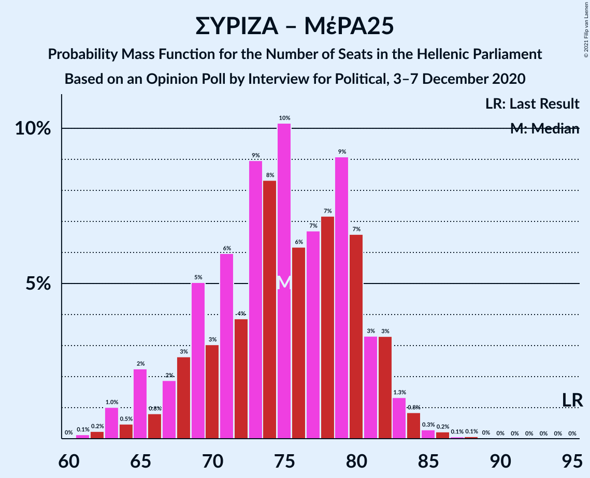

# Opinion Poll by Interview for Βεργίνα TV, 3–7 December 2020

<a href="#voting-intentions">Voting Intentions</a> | <a href="#seats">Seats</a> | <a href="#coalitions">Coalitions</a> | <a href="#technical-information">Technical Information</a>

## Voting Intentions

### Confidence Intervals

| Party | Last Result | Poll Result | 80% Confidence Interval | 90% Confidence Interval | 95% Confidence Interval | 99% Confidence Interval |
|:-----:|:-----------:|:-----------:|:-----------------------:|:-----------------------:|:-----------------------:|:-----------------------:|
| Νέα Δημοκρατία | 39.8% | 44.8% | 43.0–46.7% |42.5–47.2% |42.0–47.6% |41.2–48.5% |
| Συνασπισμός Ριζοσπαστικής Αριστεράς | 31.5% | 24.7% | 23.2–26.4% |22.7–26.8% |22.4–27.3% |21.6–28.1% |
| Κίνημα Αλλαγής | 8.1% | 8.0% | 7.0–9.1% |6.8–9.4% |6.6–9.6% |6.1–10.2% |
| Κομμουνιστικό Κόμμα Ελλάδας | 5.3% | 5.5% | 4.7–6.4% |4.5–6.7% |4.3–6.9% |4.0–7.4% |
| Ελληνική Λύση | 3.7% | 5.5% | 4.7–6.4% |4.5–6.7% |4.3–6.9% |4.0–7.4% |
| Μέτωπο Ευρωπαϊκής Ρεαλιστικής Ανυπακοής | 3.4% | 3.2% | 2.7–4.0% |2.5–4.2% |2.4–4.4% |2.1–4.8% |

*Note:* The poll result column reflects the actual value used in the calculations. Published results may vary slightly, and in addition be rounded to fewer digits.

## Seats

### Confidence Intervals

| Party | Last Result | Median | 80% Confidence Interval | 90% Confidence Interval | 95% Confidence Interval | 99% Confidence Interval |
|:-----:|:-----------:|:------:|:-----------------------:|:-----------------------:|:-----------------------:|:-----------------------:|
| <a href="#νέα-δημοκρατία">Νέα Δημοκρατία</a> | 158 | 173 | 167–179 |166–180 |165–182 |162–184 |
| <a href="#συνασπισμός-ριζοσπαστικής-αριστεράς">Συνασπισμός Ριζοσπαστικής Αριστεράς</a> | 86 | 68 | 63–72 |62–74 |61–75 |59–77 |
| <a href="#κίνημα-αλλαγής">Κίνημα Αλλαγής</a> | 22 | 22 | 19–25 |19–26 |18–26 |17–28 |
| <a href="#κομμουνιστικό-κόμμα-ελλάδας">Κομμουνιστικό Κόμμα Ελλάδας</a> | 15 | 15 | 13–18 |12–18 |12–19 |11–20 |
| <a href="#ελληνική-λύση">Ελληνική Λύση</a> | 10 | 15 | 13–18 |12–18 |12–19 |11–20 |
| <a href="#μέτωπο-ευρωπαϊκής-ρεαλιστικής-ανυπακοής">Μέτωπο Ευρωπαϊκής Ρεαλιστικής Ανυπακοής</a> | 9 | 9 | 0–11 |0–11 |0–12 |0–13 |

### Νέα Δημοκρατία

*For a full overview of the results for this party, see the [Νέα Δημοκρατία](party-νέαδημοκρατία.html) page.*

| Number of Seats | Probability | Accumulated | Special Marks |
|:---------------:|:-----------:|:-----------:|:-------------:|
| 158 | 0% | 100% | Last Result |
| 159 | 0% | 100% |  |
| 160 | 0.1% | 100% |  |
| 161 | 0.1% | 99.9% |  |
| 162 | 0.3% | 99.7% |  |
| 163 | 0.5% | 99.4% |  |
| 164 | 1.0% | 98.9% |  |
| 165 | 2% | 98% |  |
| 166 | 3% | 96% |  |
| 167 | 4% | 93% |  |
| 168 | 6% | 89% |  |
| 169 | 7% | 83% |  |
| 170 | 8% | 76% |  |
| 171 | 8% | 69% |  |
| 172 | 9% | 60% |  |
| 173 | 8% | 51% | Median |
| 174 | 8% | 43% |  |
| 175 | 7% | 35% |  |
| 176 | 7% | 27% |  |
| 177 | 5% | 20% |  |
| 178 | 5% | 15% |  |
| 179 | 3% | 10% |  |
| 180 | 3% | 7% |  |
| 181 | 2% | 4% |  |
| 182 | 1.1% | 3% |  |
| 183 | 0.9% | 2% |  |
| 184 | 0.3% | 0.8% |  |
| 185 | 0.2% | 0.5% |  |
| 186 | 0.1% | 0.2% |  |
| 187 | 0.1% | 0.1% |  |
| 188 | 0% | 0% |  |

### Συνασπισμός Ριζοσπαστικής Αριστεράς

*For a full overview of the results for this party, see the [Συνασπισμός Ριζοσπαστικής Αριστεράς](party-συνασπισμόςριζοσπαστικήςαριστεράς.html) page.*

| Number of Seats | Probability | Accumulated | Special Marks |
|:---------------:|:-----------:|:-----------:|:-------------:|
| 57 | 0.1% | 100% |  |
| 58 | 0.2% | 99.9% |  |
| 59 | 0.4% | 99.7% |  |
| 60 | 0.8% | 99.3% |  |
| 61 | 1.4% | 98% |  |
| 62 | 3% | 97% |  |
| 63 | 5% | 94% |  |
| 64 | 7% | 90% |  |
| 65 | 9% | 83% |  |
| 66 | 11% | 74% |  |
| 67 | 10% | 63% |  |
| 68 | 8% | 53% | Median |
| 69 | 9% | 44% |  |
| 70 | 11% | 35% |  |
| 71 | 9% | 24% |  |
| 72 | 6% | 16% |  |
| 73 | 4% | 10% |  |
| 74 | 2% | 6% |  |
| 75 | 1.5% | 3% |  |
| 76 | 1.0% | 2% |  |
| 77 | 0.5% | 0.9% |  |
| 78 | 0.2% | 0.4% |  |
| 79 | 0.1% | 0.2% |  |
| 80 | 0.1% | 0.1% |  |
| 81 | 0% | 0.1% |  |
| 82 | 0% | 0% |  |
| 83 | 0% | 0% |  |
| 84 | 0% | 0% |  |
| 85 | 0% | 0% |  |
| 86 | 0% | 0% | Last Result |

### Κίνημα Αλλαγής

*For a full overview of the results for this party, see the [Κίνημα Αλλαγής](party-κίνημααλλαγής.html) page.*

| Number of Seats | Probability | Accumulated | Special Marks |
|:---------------:|:-----------:|:-----------:|:-------------:|
| 16 | 0.2% | 100% |  |
| 17 | 1.2% | 99.7% |  |
| 18 | 3% | 98.6% |  |
| 19 | 7% | 95% |  |
| 20 | 13% | 88% |  |
| 21 | 18% | 75% |  |
| 22 | 17% | 58% | Last Result, Median |
| 23 | 16% | 41% |  |
| 24 | 12% | 24% |  |
| 25 | 6% | 13% |  |
| 26 | 4% | 6% |  |
| 27 | 2% | 2% |  |
| 28 | 0.6% | 0.9% |  |
| 29 | 0.2% | 0.3% |  |
| 30 | 0.1% | 0.1% |  |
| 31 | 0% | 0% |  |

### Κομμουνιστικό Κόμμα Ελλάδας

*For a full overview of the results for this party, see the [Κομμουνιστικό Κόμμα Ελλάδας](party-κομμουνιστικόκόμμαελλάδας.html) page.*

| Number of Seats | Probability | Accumulated | Special Marks |
|:---------------:|:-----------:|:-----------:|:-------------:|
| 10 | 0.2% | 100% |  |
| 11 | 1.2% | 99.8% |  |
| 12 | 5% | 98.6% |  |
| 13 | 11% | 94% |  |
| 14 | 19% | 83% |  |
| 15 | 21% | 63% | Last Result, Median |
| 16 | 19% | 42% |  |
| 17 | 13% | 23% |  |
| 18 | 7% | 11% |  |
| 19 | 3% | 4% |  |
| 20 | 0.9% | 1.3% |  |
| 21 | 0.3% | 0.4% |  |
| 22 | 0.1% | 0.1% |  |
| 23 | 0% | 0% |  |

### Ελληνική Λύση

*For a full overview of the results for this party, see the [Ελληνική Λύση](party-ελληνικήλύση.html) page.*

| Number of Seats | Probability | Accumulated | Special Marks |
|:---------------:|:-----------:|:-----------:|:-------------:|
| 10 | 0.2% | 100% | Last Result |
| 11 | 1.3% | 99.8% |  |
| 12 | 5% | 98.5% |  |
| 13 | 11% | 94% |  |
| 14 | 19% | 83% |  |
| 15 | 22% | 63% | Median |
| 16 | 18% | 42% |  |
| 17 | 13% | 24% |  |
| 18 | 7% | 11% |  |
| 19 | 3% | 4% |  |
| 20 | 1.0% | 1.3% |  |
| 21 | 0.3% | 0.4% |  |
| 22 | 0.1% | 0.1% |  |
| 23 | 0% | 0% |  |

### Μέτωπο Ευρωπαϊκής Ρεαλιστικής Ανυπακοής

*For a full overview of the results for this party, see the [Μέτωπο Ευρωπαϊκής Ρεαλιστικής Ανυπακοής](party-μέτωποευρωπαϊκήςρεαλιστικήςανυπακοής.html) page.*

| Number of Seats | Probability | Accumulated | Special Marks |
|:---------------:|:-----------:|:-----------:|:-------------:|
| 0 | 29% | 100% |  |
| 1 | 0% | 71% |  |
| 2 | 0% | 71% |  |
| 3 | 0% | 71% |  |
| 4 | 0% | 71% |  |
| 5 | 0% | 71% |  |
| 6 | 0% | 71% |  |
| 7 | 0% | 71% |  |
| 8 | 8% | 71% |  |
| 9 | 29% | 63% | Last Result, Median |
| 10 | 20% | 35% |  |
| 11 | 10% | 15% |  |
| 12 | 4% | 5% |  |
| 13 | 0.9% | 1.1% |  |
| 14 | 0.2% | 0.2% |  |
| 15 | 0% | 0% |  |

## Coalitions

### Confidence Intervals

| Coalition | Last Result | Median | Majority? | 80% Confidence Interval | 90% Confidence Interval | 95% Confidence Interval | 99% Confidence Interval |
|:---------:|:-----------:|:------:|:---------:|:-----------------------:|:-----------------------:|:-----------------------:|:-----------------------:|
| Νέα Δημοκρατία – Κίνημα Αλλαγής | 180 | 195 | 100% | 189–201 | 188–203 | 186–204 | 184–206 |
| Νέα Δημοκρατία | 158 | 173 | 100% | 167–179 | 166–180 | 165–182 | 162–184 |
| Συνασπισμός Ριζοσπαστικής Αριστεράς – Μέτωπο Ευρωπαϊκής Ρεαλιστικής Ανυπακοής | 95 | 75 | 0% | 69–80 | 66–82 | 65–83 | 63–85 |
| Συνασπισμός Ριζοσπαστικής Αριστεράς | 86 | 68 | 0% | 63–72 | 62–74 | 61–75 | 59–77 |

### Νέα Δημοκρατία – Κίνημα Αλλαγής

| Number of Seats | Probability | Accumulated | Special Marks |
|:---------------:|:-----------:|:-----------:|:-------------:|
| 180 | 0% | 100% | Last Result |
| 181 | 0% | 100% |  |
| 182 | 0.1% | 99.9% |  |
| 183 | 0.2% | 99.9% |  |
| 184 | 0.4% | 99.7% |  |
| 185 | 0.8% | 99.3% |  |
| 186 | 1.3% | 98.5% |  |
| 187 | 2% | 97% |  |
| 188 | 2% | 96% |  |
| 189 | 4% | 93% |  |
| 190 | 6% | 89% |  |
| 191 | 9% | 83% |  |
| 192 | 7% | 74% |  |
| 193 | 7% | 67% |  |
| 194 | 7% | 60% |  |
| 195 | 8% | 53% | Median |
| 196 | 10% | 45% |  |
| 197 | 8% | 35% |  |
| 198 | 6% | 27% |  |
| 199 | 6% | 21% |  |
| 200 | 4% | 15% |  |
| 201 | 3% | 11% |  |
| 202 | 2% | 8% |  |
| 203 | 2% | 6% |  |
| 204 | 2% | 4% |  |
| 205 | 1.3% | 2% |  |
| 206 | 0.7% | 1.1% |  |
| 207 | 0.2% | 0.5% |  |
| 208 | 0.1% | 0.3% |  |
| 209 | 0.1% | 0.2% |  |
| 210 | 0.1% | 0.1% |  |
| 211 | 0% | 0% |  |

### Νέα Δημοκρατία

| Number of Seats | Probability | Accumulated | Special Marks |
|:---------------:|:-----------:|:-----------:|:-------------:|
| 158 | 0% | 100% | Last Result |
| 159 | 0% | 100% |  |
| 160 | 0.1% | 100% |  |
| 161 | 0.1% | 99.9% |  |
| 162 | 0.3% | 99.7% |  |
| 163 | 0.5% | 99.4% |  |
| 164 | 1.0% | 98.9% |  |
| 165 | 2% | 98% |  |
| 166 | 3% | 96% |  |
| 167 | 4% | 93% |  |
| 168 | 6% | 89% |  |
| 169 | 7% | 83% |  |
| 170 | 8% | 76% |  |
| 171 | 8% | 69% |  |
| 172 | 9% | 60% |  |
| 173 | 8% | 51% | Median |
| 174 | 8% | 43% |  |
| 175 | 7% | 35% |  |
| 176 | 7% | 27% |  |
| 177 | 5% | 20% |  |
| 178 | 5% | 15% |  |
| 179 | 3% | 10% |  |
| 180 | 3% | 7% |  |
| 181 | 2% | 4% |  |
| 182 | 1.1% | 3% |  |
| 183 | 0.9% | 2% |  |
| 184 | 0.3% | 0.8% |  |
| 185 | 0.2% | 0.5% |  |
| 186 | 0.1% | 0.2% |  |
| 187 | 0.1% | 0.1% |  |
| 188 | 0% | 0% |  |

### Συνασπισμός Ριζοσπαστικής Αριστεράς – Μέτωπο Ευρωπαϊκής Ρεαλιστικής Ανυπακοής

| Number of Seats | Probability | Accumulated | Special Marks |
|:---------------:|:-----------:|:-----------:|:-------------:|
| 60 | 0.1% | 100% |  |
| 61 | 0.1% | 99.9% |  |
| 62 | 0.2% | 99.8% |  |
| 63 | 0.7% | 99.6% |  |
| 64 | 1.0% | 98.9% |  |
| 65 | 1.4% | 98% |  |
| 66 | 2% | 96% |  |
| 67 | 2% | 95% |  |
| 68 | 2% | 93% |  |
| 69 | 4% | 91% |  |
| 70 | 6% | 87% |  |
| 71 | 6% | 81% |  |
| 72 | 5% | 75% |  |
| 73 | 7% | 70% |  |
| 74 | 9% | 63% |  |
| 75 | 9% | 54% |  |
| 76 | 8% | 45% |  |
| 77 | 6% | 37% | Median |
| 78 | 7% | 31% |  |
| 79 | 8% | 24% |  |
| 80 | 6% | 16% |  |
| 81 | 4% | 10% |  |
| 82 | 2% | 6% |  |
| 83 | 1.5% | 3% |  |
| 84 | 1.0% | 2% |  |
| 85 | 0.5% | 0.8% |  |
| 86 | 0.2% | 0.3% |  |
| 87 | 0.1% | 0.2% |  |
| 88 | 0% | 0.1% |  |
| 89 | 0% | 0% |  |
| 90 | 0% | 0% |  |
| 91 | 0% | 0% |  |
| 92 | 0% | 0% |  |
| 93 | 0% | 0% |  |
| 94 | 0% | 0% |  |
| 95 | 0% | 0% | Last Result |

### Συνασπισμός Ριζοσπαστικής Αριστεράς

| Number of Seats | Probability | Accumulated | Special Marks |
|:---------------:|:-----------:|:-----------:|:-------------:|
| 57 | 0.1% | 100% |  |
| 58 | 0.2% | 99.9% |  |
| 59 | 0.4% | 99.7% |  |
| 60 | 0.8% | 99.3% |  |
| 61 | 1.4% | 98% |  |
| 62 | 3% | 97% |  |
| 63 | 5% | 94% |  |
| 64 | 7% | 90% |  |
| 65 | 9% | 83% |  |
| 66 | 11% | 74% |  |
| 67 | 10% | 63% |  |
| 68 | 8% | 53% | Median |
| 69 | 9% | 44% |  |
| 70 | 11% | 35% |  |
| 71 | 9% | 24% |  |
| 72 | 6% | 16% |  |
| 73 | 4% | 10% |  |
| 74 | 2% | 6% |  |
| 75 | 1.5% | 3% |  |
| 76 | 1.0% | 2% |  |
| 77 | 0.5% | 0.9% |  |
| 78 | 0.2% | 0.4% |  |
| 79 | 0.1% | 0.2% |  |
| 80 | 0.1% | 0.1% |  |
| 81 | 0% | 0.1% |  |
| 82 | 0% | 0% |  |
| 83 | 0% | 0% |  |
| 84 | 0% | 0% |  |
| 85 | 0% | 0% |  |
| 86 | 0% | 0% | Last Result |

## Technical Information

### Opinion Poll

+ **Polling firm:** Interview
+ **Commissioner(s):** Βεργίνα TV
+ **Fieldwork period:** 3–7 December 2020

### Calculations

+ **Sample size:** 1205
+ **Simulations done:** 1,048,576
+ **Error estimate:** 0.44%

