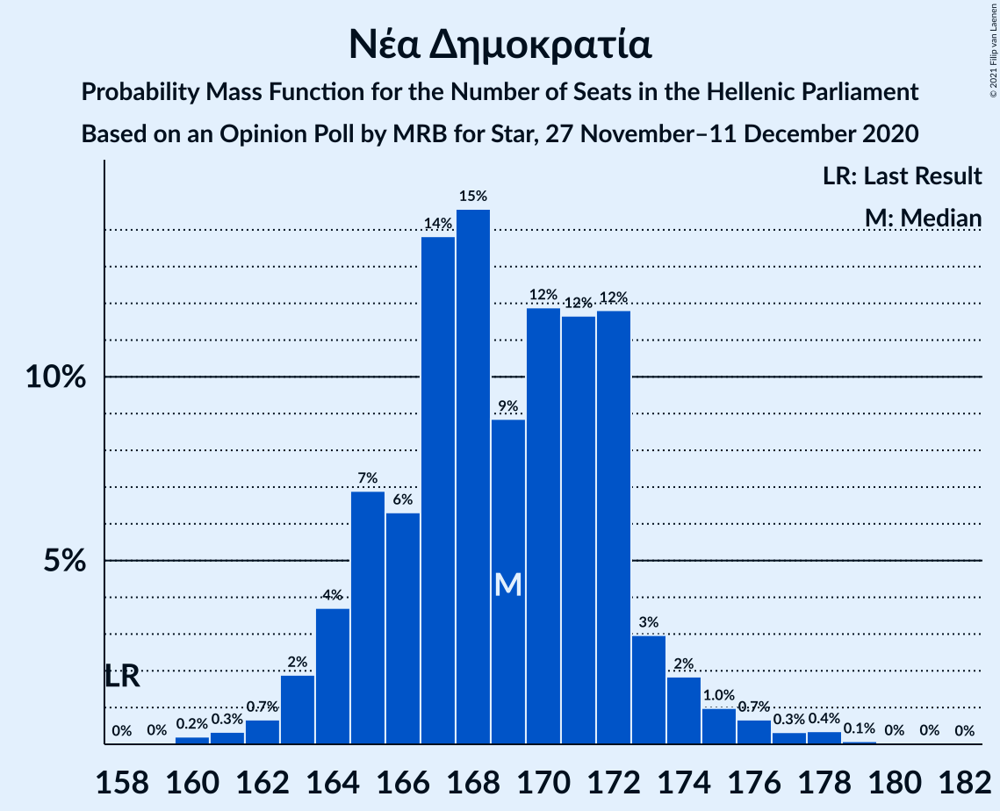
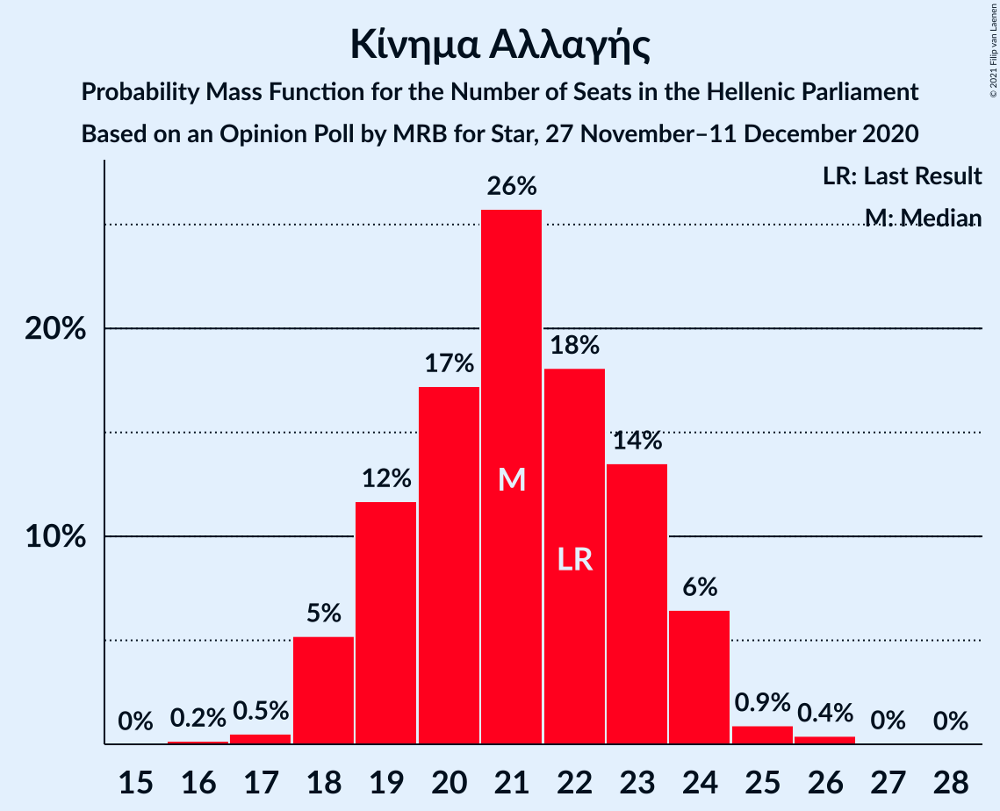
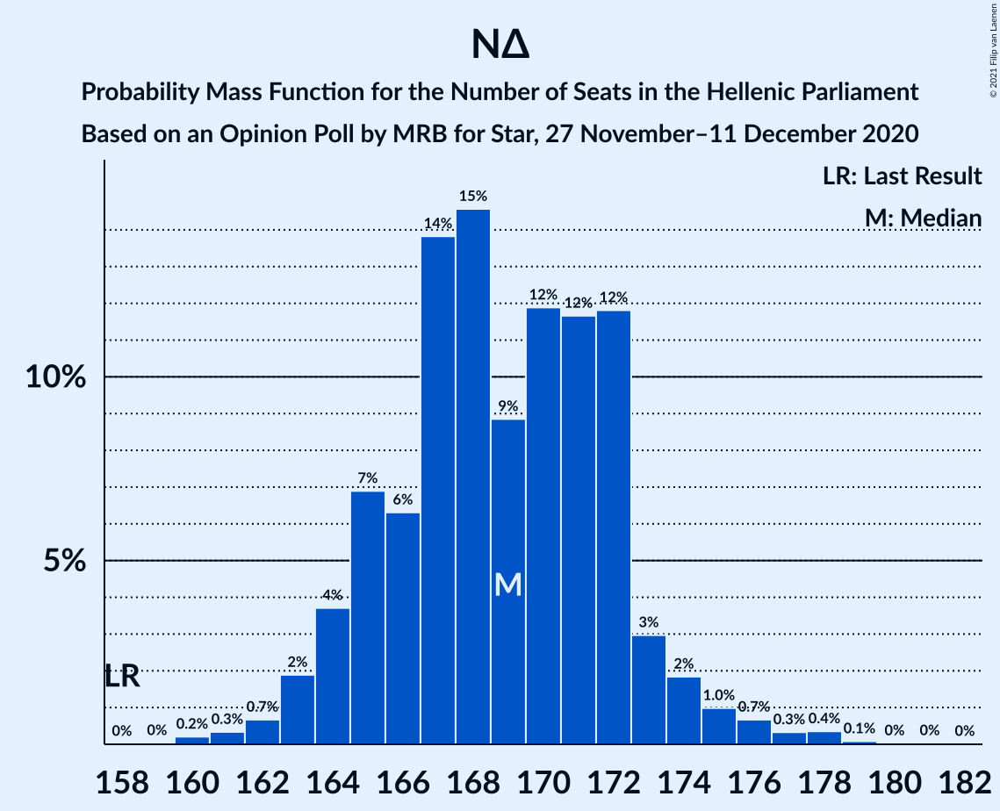

# Opinion Poll by MRB for Star, 27–11 December 2020

<a href="#voting-intentions">Voting Intentions</a> | <a href="#seats">Seats</a> | <a href="#coalitions">Coalitions</a> | <a href="#technical-information">Technical Information</a>

## Voting Intentions

### Confidence Intervals

| Party | Last Result | Poll Result | 80% Confidence Interval | 90% Confidence Interval | 95% Confidence Interval | 99% Confidence Interval |
|:-----:|:-----------:|:-----------:|:-----------------------:|:-----------------------:|:-----------------------:|:-----------------------:|
| Νέα Δημοκρατία | 39.8% | 44.9% | 43.0–46.8% |42.5–47.3% |42.1–47.8% |41.2–48.6% |
| Συνασπισμός Ριζοσπαστικής Αριστεράς | 31.5% | 27.2% | 25.6–28.9% |25.1–29.4% |24.7–29.8% |24.0–30.6% |
| Κίνημα Αλλαγής | 8.1% | 7.9% | 7.0–9.0% |6.7–9.3% |6.5–9.6% |6.1–10.2% |
| Κομμουνιστικό Κόμμα Ελλάδας | 5.3% | 5.9% | 5.1–6.9% |4.9–7.2% |4.7–7.4% |4.3–7.9% |
| Ελληνική Λύση | 3.7% | 4.8% | 4.1–5.7% |3.9–6.0% |3.7–6.2% |3.4–6.6% |
| Μέτωπο Ευρωπαϊκής Ρεαλιστικής Ανυπακοής | 3.4% | 3.7% | 3.1–4.5% |2.9–4.8% |2.8–5.0% |2.5–5.4% |
| Χρυσή Αυγή | 2.9% | 1.2% | 0.9–1.7% |0.8–1.8% |0.7–2.0% |0.6–2.3% |
| Ένωση Κεντρώων | 1.2% | 1.2% | 0.9–1.7% |0.8–1.8% |0.7–2.0% |0.6–2.3% |

*Note:* The poll result column reflects the actual value used in the calculations. Published results may vary slightly, and in addition be rounded to fewer digits.

## Seats

### Confidence Intervals

| Party | Last Result | Median | 80% Confidence Interval | 90% Confidence Interval | 95% Confidence Interval | 99% Confidence Interval |
|:-----:|:-----------:|:------:|:-----------------------:|:-----------------------:|:-----------------------:|:-----------------------:|
| <a href="#νέα-δημοκρατία">Νέα Δημοκρατία</a> | 158 | 169 | 164–174 |162–175 |161–177 |159–180 |
| <a href="#συνασπισμός-ριζοσπαστικής-αριστεράς">Συνασπισμός Ριζοσπαστικής Αριστεράς</a> | 86 | 72 | 67–76 |67–78 |65–79 |63–81 |
| <a href="#κίνημα-αλλαγής">Κίνημα Αλλαγής</a> | 22 | 21 | 19–24 |18–25 |17–25 |16–27 |
| <a href="#κομμουνιστικό-κόμμα-ελλάδας">Κομμουνιστικό Κόμμα Ελλάδας</a> | 15 | 16 | 14–18 |13–19 |12–19 |11–21 |
| <a href="#ελληνική-λύση">Ελληνική Λύση</a> | 10 | 13 | 11–15 |10–16 |10–16 |9–18 |
| <a href="#μέτωπο-ευρωπαϊκής-ρεαλιστικής-ανυπακοής">Μέτωπο Ευρωπαϊκής Ρεαλιστικής Ανυπακοής</a> | 9 | 10 | 8–12 |0–12 |0–13 |0–14 |
| <a href="#χρυσή-αυγή">Χρυσή Αυγή</a> | 0 | 0 | 0 |0 |0 |0 |
| <a href="#ένωση-κεντρώων">Ένωση Κεντρώων</a> | 0 | 0 | 0 |0 |0 |0 |

### Νέα Δημοκρατία

*For a full overview of the results for this party, see the [Νέα Δημοκρατία](party-νέαδημοκρατία.html) page.*

| Number of Seats | Probability | Accumulated | Special Marks |
|:---------------:|:-----------:|:-----------:|:-------------:|
| 156 | 0% | 100% |  |
| 157 | 0.1% | 99.9% |  |
| 158 | 0.2% | 99.9% | Last Result |
| 159 | 0.4% | 99.6% |  |
| 160 | 0.6% | 99.2% |  |
| 161 | 2% | 98.7% |  |
| 162 | 2% | 97% |  |
| 163 | 3% | 95% |  |
| 164 | 7% | 92% |  |
| 165 | 5% | 85% |  |
| 166 | 10% | 80% |  |
| 167 | 6% | 70% |  |
| 168 | 9% | 63% |  |
| 169 | 13% | 54% | Median |
| 170 | 6% | 41% |  |
| 171 | 15% | 34% |  |
| 172 | 3% | 20% |  |
| 173 | 6% | 17% |  |
| 174 | 3% | 10% |  |
| 175 | 3% | 8% |  |
| 176 | 2% | 5% |  |
| 177 | 0.8% | 3% |  |
| 178 | 0.8% | 2% |  |
| 179 | 0.4% | 1.0% |  |
| 180 | 0.3% | 0.6% |  |
| 181 | 0.1% | 0.3% |  |
| 182 | 0.1% | 0.2% |  |
| 183 | 0% | 0.1% |  |
| 184 | 0% | 0% |  |

### Συνασπισμός Ριζοσπαστικής Αριστεράς

*For a full overview of the results for this party, see the [Συνασπισμός Ριζοσπαστικής Αριστεράς](party-συνασπισμόςριζοσπαστικήςαριστεράς.html) page.*

| Number of Seats | Probability | Accumulated | Special Marks |
|:---------------:|:-----------:|:-----------:|:-------------:|
| 61 | 0.1% | 100% |  |
| 62 | 0.1% | 99.9% |  |
| 63 | 0.4% | 99.8% |  |
| 64 | 0.5% | 99.4% |  |
| 65 | 2% | 98.8% |  |
| 66 | 2% | 97% |  |
| 67 | 6% | 96% |  |
| 68 | 5% | 89% |  |
| 69 | 8% | 84% |  |
| 70 | 7% | 76% |  |
| 71 | 15% | 69% |  |
| 72 | 10% | 54% | Median |
| 73 | 12% | 44% |  |
| 74 | 8% | 32% |  |
| 75 | 10% | 23% |  |
| 76 | 5% | 14% |  |
| 77 | 3% | 9% |  |
| 78 | 2% | 6% |  |
| 79 | 1.4% | 4% |  |
| 80 | 1.5% | 2% |  |
| 81 | 0.4% | 0.7% |  |
| 82 | 0.2% | 0.3% |  |
| 83 | 0.1% | 0.2% |  |
| 84 | 0% | 0.1% |  |
| 85 | 0% | 0% |  |
| 86 | 0% | 0% | Last Result |

### Κίνημα Αλλαγής

*For a full overview of the results for this party, see the [Κίνημα Αλλαγής](party-κίνημααλλαγής.html) page.*

| Number of Seats | Probability | Accumulated | Special Marks |
|:---------------:|:-----------:|:-----------:|:-------------:|
| 15 | 0.1% | 100% |  |
| 16 | 0.7% | 99.8% |  |
| 17 | 2% | 99.1% |  |
| 18 | 7% | 97% |  |
| 19 | 13% | 90% |  |
| 20 | 17% | 78% |  |
| 21 | 18% | 61% | Median |
| 22 | 17% | 43% | Last Result |
| 23 | 12% | 26% |  |
| 24 | 9% | 14% |  |
| 25 | 3% | 6% |  |
| 26 | 1.5% | 2% |  |
| 27 | 0.6% | 0.8% |  |
| 28 | 0.2% | 0.2% |  |
| 29 | 0.1% | 0.1% |  |
| 30 | 0% | 0% |  |

### Κομμουνιστικό Κόμμα Ελλάδας

*For a full overview of the results for this party, see the [Κομμουνιστικό Κόμμα Ελλάδας](party-κομμουνιστικόκόμμαελλάδας.html) page.*

| Number of Seats | Probability | Accumulated | Special Marks |
|:---------------:|:-----------:|:-----------:|:-------------:|
| 10 | 0.1% | 100% |  |
| 11 | 0.5% | 99.9% |  |
| 12 | 2% | 99.5% |  |
| 13 | 6% | 97% |  |
| 14 | 14% | 91% |  |
| 15 | 21% | 77% | Last Result |
| 16 | 23% | 56% | Median |
| 17 | 17% | 33% |  |
| 18 | 9% | 17% |  |
| 19 | 5% | 7% |  |
| 20 | 1.5% | 2% |  |
| 21 | 0.6% | 0.9% |  |
| 22 | 0.2% | 0.2% |  |
| 23 | 0% | 0% |  |

### Ελληνική Λύση

*For a full overview of the results for this party, see the [Ελληνική Λύση](party-ελληνικήλύση.html) page.*

| Number of Seats | Probability | Accumulated | Special Marks |
|:---------------:|:-----------:|:-----------:|:-------------:|
| 8 | 0.1% | 100% |  |
| 9 | 1.1% | 99.8% |  |
| 10 | 5% | 98.7% | Last Result |
| 11 | 14% | 93% |  |
| 12 | 18% | 80% |  |
| 13 | 26% | 61% | Median |
| 14 | 17% | 35% |  |
| 15 | 11% | 18% |  |
| 16 | 5% | 7% |  |
| 17 | 1.4% | 2% |  |
| 18 | 0.5% | 0.6% |  |
| 19 | 0.1% | 0.1% |  |
| 20 | 0% | 0% |  |

### Μέτωπο Ευρωπαϊκής Ρεαλιστικής Ανυπακοής

*For a full overview of the results for this party, see the [Μέτωπο Ευρωπαϊκής Ρεαλιστικής Ανυπακοής](party-μέτωποευρωπαϊκήςρεαλιστικήςανυπακοής.html) page.*

| Number of Seats | Probability | Accumulated | Special Marks |
|:---------------:|:-----------:|:-----------:|:-------------:|
| 0 | 8% | 100% |  |
| 1 | 0% | 92% |  |
| 2 | 0% | 92% |  |
| 3 | 0% | 92% |  |
| 4 | 0% | 92% |  |
| 5 | 0% | 92% |  |
| 6 | 0% | 92% |  |
| 7 | 0% | 92% |  |
| 8 | 7% | 92% |  |
| 9 | 24% | 85% | Last Result |
| 10 | 28% | 61% | Median |
| 11 | 18% | 33% |  |
| 12 | 10% | 15% |  |
| 13 | 4% | 5% |  |
| 14 | 0.9% | 1.2% |  |
| 15 | 0.2% | 0.3% |  |
| 16 | 0% | 0% |  |

### Χρυσή Αυγή

*For a full overview of the results for this party, see the [Χρυσή Αυγή](party-χρυσήαυγή.html) page.*

| Number of Seats | Probability | Accumulated | Special Marks |
|:---------------:|:-----------:|:-----------:|:-------------:|
| 0 | 100% | 100% | Last Result, Median |

### Ένωση Κεντρώων

*For a full overview of the results for this party, see the [Ένωση Κεντρώων](party-ένωσηκεντρώων.html) page.*

| Number of Seats | Probability | Accumulated | Special Marks |
|:---------------:|:-----------:|:-----------:|:-------------:|
| 0 | 100% | 100% | Last Result, Median |

## Coalitions

### Confidence Intervals

| Coalition | Last Result | Median | Majority? | 80% Confidence Interval | 90% Confidence Interval | 95% Confidence Interval | 99% Confidence Interval |
|:---------:|:-----------:|:------:|:---------:|:-----------------------:|:-----------------------:|:-----------------------:|:-----------------------:|
| Νέα Δημοκρατία – Κίνημα Αλλαγής | 180 | 190 | 100% | 185–195 | 183–197 | 182–198 | 180–201 |
| Νέα Δημοκρατία | 158 | 169 | 100% | 164–174 | 162–175 | 161–177 | 159–180 |
| Συνασπισμός Ριζοσπαστικής Αριστεράς – Μέτωπο Ευρωπαϊκής Ρεαλιστικής Ανυπακοής | 95 | 81 | 0% | 76–86 | 74–88 | 73–88 | 70–91 |
| Συνασπισμός Ριζοσπαστικής Αριστεράς | 86 | 72 | 0% | 67–76 | 67–78 | 65–79 | 63–81 |

### Νέα Δημοκρατία – Κίνημα Αλλαγής

| Number of Seats | Probability | Accumulated | Special Marks |
|:---------------:|:-----------:|:-----------:|:-------------:|
| 177 | 0% | 100% |  |
| 178 | 0.1% | 99.9% |  |
| 179 | 0.2% | 99.9% |  |
| 180 | 0.4% | 99.7% | Last Result |
| 181 | 0.6% | 99.3% |  |
| 182 | 1.4% | 98.7% |  |
| 183 | 2% | 97% |  |
| 184 | 2% | 95% |  |
| 185 | 6% | 93% |  |
| 186 | 5% | 86% |  |
| 187 | 7% | 81% |  |
| 188 | 14% | 74% |  |
| 189 | 6% | 61% |  |
| 190 | 10% | 55% | Median |
| 191 | 16% | 45% |  |
| 192 | 5% | 29% |  |
| 193 | 5% | 24% |  |
| 194 | 7% | 19% |  |
| 195 | 3% | 11% |  |
| 196 | 2% | 8% |  |
| 197 | 3% | 6% |  |
| 198 | 1.0% | 3% |  |
| 199 | 0.6% | 2% |  |
| 200 | 0.7% | 1.4% |  |
| 201 | 0.3% | 0.7% |  |
| 202 | 0.2% | 0.4% |  |
| 203 | 0.2% | 0.3% |  |
| 204 | 0% | 0.1% |  |
| 205 | 0% | 0.1% |  |
| 206 | 0% | 0% |  |

### Νέα Δημοκρατία

| Number of Seats | Probability | Accumulated | Special Marks |
|:---------------:|:-----------:|:-----------:|:-------------:|
| 156 | 0% | 100% |  |
| 157 | 0.1% | 99.9% |  |
| 158 | 0.2% | 99.9% | Last Result |
| 159 | 0.4% | 99.6% |  |
| 160 | 0.6% | 99.2% |  |
| 161 | 2% | 98.7% |  |
| 162 | 2% | 97% |  |
| 163 | 3% | 95% |  |
| 164 | 7% | 92% |  |
| 165 | 5% | 85% |  |
| 166 | 10% | 80% |  |
| 167 | 6% | 70% |  |
| 168 | 9% | 63% |  |
| 169 | 13% | 54% | Median |
| 170 | 6% | 41% |  |
| 171 | 15% | 34% |  |
| 172 | 3% | 20% |  |
| 173 | 6% | 17% |  |
| 174 | 3% | 10% |  |
| 175 | 3% | 8% |  |
| 176 | 2% | 5% |  |
| 177 | 0.8% | 3% |  |
| 178 | 0.8% | 2% |  |
| 179 | 0.4% | 1.0% |  |
| 180 | 0.3% | 0.6% |  |
| 181 | 0.1% | 0.3% |  |
| 182 | 0.1% | 0.2% |  |
| 183 | 0% | 0.1% |  |
| 184 | 0% | 0% |  |

### Συνασπισμός Ριζοσπαστικής Αριστεράς – Μέτωπο Ευρωπαϊκής Ρεαλιστικής Ανυπακοής

| Number of Seats | Probability | Accumulated | Special Marks |
|:---------------:|:-----------:|:-----------:|:-------------:|
| 66 | 0% | 100% |  |
| 67 | 0.1% | 99.9% |  |
| 68 | 0.1% | 99.9% |  |
| 69 | 0.2% | 99.8% |  |
| 70 | 0.2% | 99.6% |  |
| 71 | 0.7% | 99.3% |  |
| 72 | 0.6% | 98.6% |  |
| 73 | 1.3% | 98% |  |
| 74 | 2% | 97% |  |
| 75 | 2% | 95% |  |
| 76 | 4% | 92% |  |
| 77 | 4% | 88% |  |
| 78 | 5% | 85% |  |
| 79 | 9% | 79% |  |
| 80 | 6% | 70% |  |
| 81 | 15% | 64% |  |
| 82 | 8% | 49% | Median |
| 83 | 13% | 40% |  |
| 84 | 8% | 28% |  |
| 85 | 7% | 20% |  |
| 86 | 5% | 13% |  |
| 87 | 2% | 8% |  |
| 88 | 3% | 6% |  |
| 89 | 1.0% | 2% |  |
| 90 | 0.8% | 1.4% |  |
| 91 | 0.4% | 0.6% |  |
| 92 | 0.2% | 0.3% |  |
| 93 | 0.1% | 0.1% |  |
| 94 | 0% | 0% |  |
| 95 | 0% | 0% | Last Result |

### Συνασπισμός Ριζοσπαστικής Αριστεράς

| Number of Seats | Probability | Accumulated | Special Marks |
|:---------------:|:-----------:|:-----------:|:-------------:|
| 61 | 0.1% | 100% |  |
| 62 | 0.1% | 99.9% |  |
| 63 | 0.4% | 99.8% |  |
| 64 | 0.5% | 99.4% |  |
| 65 | 2% | 98.8% |  |
| 66 | 2% | 97% |  |
| 67 | 6% | 96% |  |
| 68 | 5% | 89% |  |
| 69 | 8% | 84% |  |
| 70 | 7% | 76% |  |
| 71 | 15% | 69% |  |
| 72 | 10% | 54% | Median |
| 73 | 12% | 44% |  |
| 74 | 8% | 32% |  |
| 75 | 10% | 23% |  |
| 76 | 5% | 14% |  |
| 77 | 3% | 9% |  |
| 78 | 2% | 6% |  |
| 79 | 1.4% | 4% |  |
| 80 | 1.5% | 2% |  |
| 81 | 0.4% | 0.7% |  |
| 82 | 0.2% | 0.3% |  |
| 83 | 0.1% | 0.2% |  |
| 84 | 0% | 0.1% |  |
| 85 | 0% | 0% |  |
| 86 | 0% | 0% | Last Result |

## Technical Information

### Opinion Poll

+ **Polling firm:** MRB
+ **Commissioner(s):** Star
+ **Fieldwork period:** 27–11 December 2020

### Calculations

+ **Sample size:** 1185
+ **Simulations done:** 1,048,576
+ **Error estimate:** 0.79%

