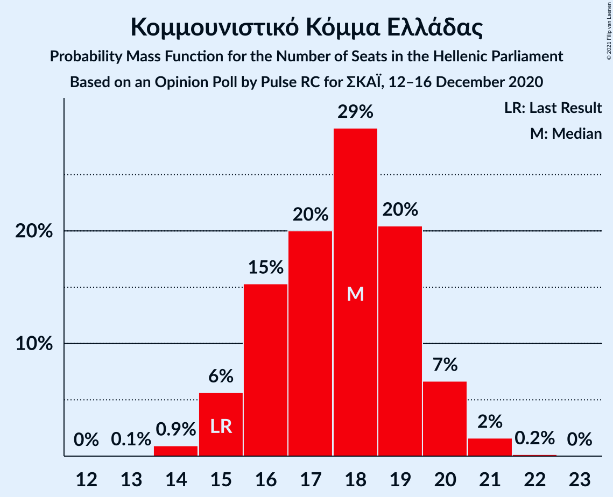
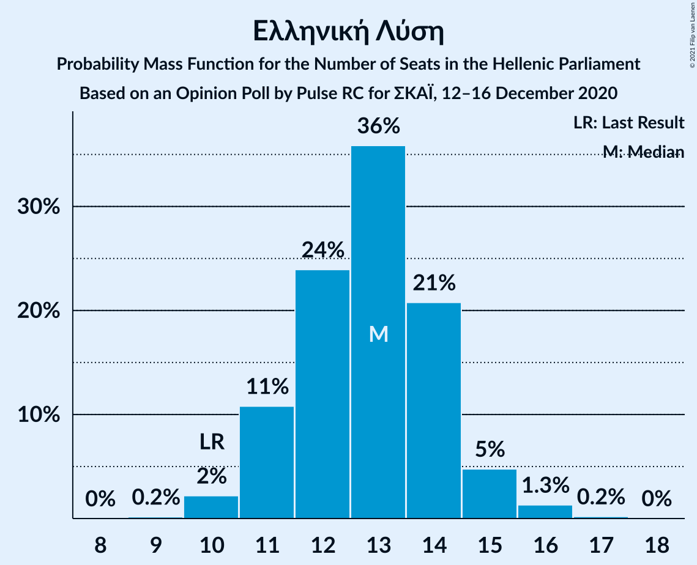
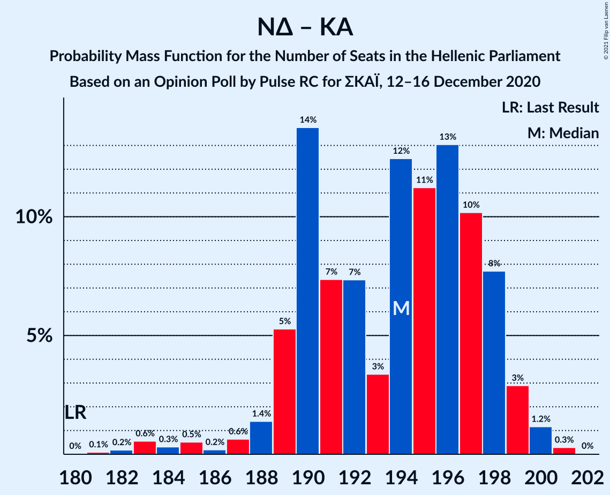
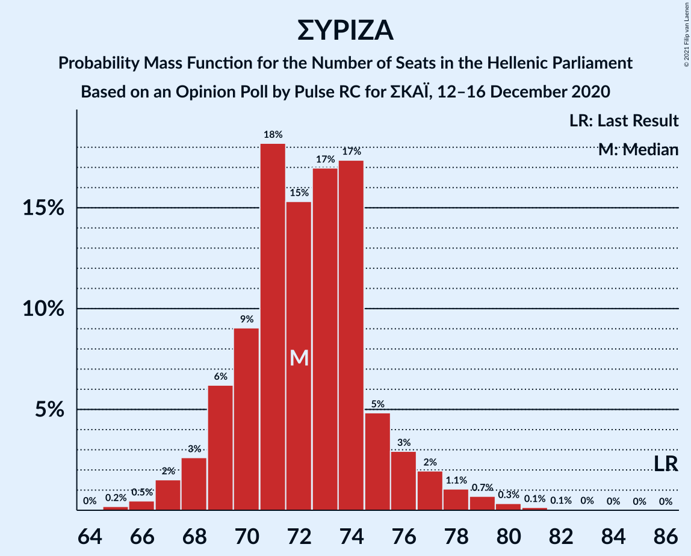

# Opinion Poll by Pulse RC for ΣΚΑΪ, 12–16 December 2020

<a href="#voting-intentions">Voting Intentions</a> | <a href="#seats">Seats</a> | <a href="#coalitions">Coalitions</a> | <a href="#technical-information">Technical Information</a>

## Voting Intentions

### Confidence Intervals

| Party | Last Result | Poll Result | 80% Confidence Interval | 90% Confidence Interval | 95% Confidence Interval | 99% Confidence Interval |
|:-----:|:-----------:|:-----------:|:-----------------------:|:-----------------------:|:-----------------------:|:-----------------------:|
| Νέα Δημοκρατία | 39.8% | 43.9% | 42.6–45.2% |42.3–45.6% |41.9–45.9% |41.3–46.5% |
| Συνασπισμός Ριζοσπαστικής Αριστεράς | 31.5% | 26.6% | 25.5–27.8% |25.1–28.1% |24.9–28.4% |24.3–29.0% |
| Κίνημα Αλλαγής | 8.1% | 7.5% | 6.8–8.2% |6.6–8.4% |6.5–8.6% |6.2–9.0% |
| Κομμουνιστικό Κόμμα Ελλάδας | 5.3% | 6.4% | 5.8–7.1% |5.6–7.3% |5.5–7.5% |5.2–7.8% |
| Ελληνική Λύση | 3.7% | 4.6% | 4.1–5.2% |3.9–5.4% |3.8–5.5% |3.6–5.8% |
| Μέτωπο Ευρωπαϊκής Ρεαλιστικής Ανυπακοής | 3.4% | 2.9% | 2.5–3.4% |2.4–3.5% |2.3–3.6% |2.1–3.9% |

*Note:* The poll result column reflects the actual value used in the calculations. Published results may vary slightly, and in addition be rounded to fewer digits.

## Seats

### Confidence Intervals

| Party | Last Result | Median | 80% Confidence Interval | 90% Confidence Interval | 95% Confidence Interval | 99% Confidence Interval |
|:-----:|:-----------:|:------:|:-----------------------:|:-----------------------:|:-----------------------:|:-----------------------:|
| <a href="#νέα-δημοκρατία">Νέα Δημοκρατία</a> | 158 | 173 | 168–177 |167–178 |166–178 |164–180 |
| <a href="#συνασπισμός-ριζοσπαστικής-αριστεράς">Συνασπισμός Ριζοσπαστικής Αριστεράς</a> | 86 | 72 | 69–75 |69–76 |68–77 |66–80 |
| <a href="#κίνημα-αλλαγής">Κίνημα Αλλαγής</a> | 22 | 21 | 19–23 |19–23 |18–24 |17–25 |
| <a href="#κομμουνιστικό-κόμμα-ελλάδας">Κομμουνιστικό Κόμμα Ελλάδας</a> | 15 | 18 | 16–19 |15–20 |15–20 |14–21 |
| <a href="#ελληνική-λύση">Ελληνική Λύση</a> | 10 | 13 | 11–14 |11–15 |11–15 |10–16 |
| <a href="#μέτωπο-ευρωπαϊκής-ρεαλιστικής-ανυπακοής">Μέτωπο Ευρωπαϊκής Ρεαλιστικής Ανυπακοής</a> | 9 | 0 | 0–9 |0–10 |0–10 |0–11 |

### Νέα Δημοκρατία

*For a full overview of the results for this party, see the [Νέα Δημοκρατία](party-νέαδημοκρατία.html) page.*

| Number of Seats | Probability | Accumulated | Special Marks |
|:---------------:|:-----------:|:-----------:|:-------------:|
| 158 | 0% | 100% | Last Result |
| 159 | 0% | 100% |  |
| 160 | 0% | 100% |  |
| 161 | 0.1% | 100% |  |
| 162 | 0.1% | 99.9% |  |
| 163 | 0.2% | 99.8% |  |
| 164 | 0.4% | 99.6% |  |
| 165 | 0.9% | 99.2% |  |
| 166 | 2% | 98% |  |
| 167 | 4% | 97% |  |
| 168 | 4% | 93% |  |
| 169 | 8% | 89% |  |
| 170 | 9% | 81% |  |
| 171 | 6% | 72% |  |
| 172 | 12% | 66% |  |
| 173 | 13% | 54% | Median |
| 174 | 10% | 41% |  |
| 175 | 11% | 31% |  |
| 176 | 10% | 21% |  |
| 177 | 5% | 10% |  |
| 178 | 3% | 5% |  |
| 179 | 2% | 2% |  |
| 180 | 0.5% | 0.7% |  |
| 181 | 0.2% | 0.2% |  |
| 182 | 0.1% | 0.1% |  |
| 183 | 0% | 0% |  |

### Συνασπισμός Ριζοσπαστικής Αριστεράς

*For a full overview of the results for this party, see the [Συνασπισμός Ριζοσπαστικής Αριστεράς](party-συνασπισμόςριζοσπαστικήςαριστεράς.html) page.*

| Number of Seats | Probability | Accumulated | Special Marks |
|:---------------:|:-----------:|:-----------:|:-------------:|
| 65 | 0.2% | 100% |  |
| 66 | 0.5% | 99.8% |  |
| 67 | 2% | 99.3% |  |
| 68 | 3% | 98% |  |
| 69 | 6% | 95% |  |
| 70 | 9% | 89% |  |
| 71 | 18% | 80% |  |
| 72 | 15% | 62% | Median |
| 73 | 17% | 46% |  |
| 74 | 17% | 29% |  |
| 75 | 5% | 12% |  |
| 76 | 3% | 7% |  |
| 77 | 2% | 4% |  |
| 78 | 1.1% | 2% |  |
| 79 | 0.7% | 1.3% |  |
| 80 | 0.3% | 0.6% |  |
| 81 | 0.1% | 0.3% |  |
| 82 | 0.1% | 0.1% |  |
| 83 | 0% | 0.1% |  |
| 84 | 0% | 0% |  |
| 85 | 0% | 0% |  |
| 86 | 0% | 0% | Last Result |

### Κίνημα Αλλαγής

*For a full overview of the results for this party, see the [Κίνημα Αλλαγής](party-κίνημααλλαγής.html) page.*

| Number of Seats | Probability | Accumulated | Special Marks |
|:---------------:|:-----------:|:-----------:|:-------------:|
| 16 | 0.1% | 100% |  |
| 17 | 0.6% | 99.9% |  |
| 18 | 4% | 99.3% |  |
| 19 | 10% | 96% |  |
| 20 | 21% | 86% |  |
| 21 | 27% | 65% | Median |
| 22 | 21% | 38% | Last Result |
| 23 | 12% | 17% |  |
| 24 | 3% | 5% |  |
| 25 | 1.5% | 2% |  |
| 26 | 0.1% | 0.2% |  |
| 27 | 0% | 0% |  |

### Κομμουνιστικό Κόμμα Ελλάδας

*For a full overview of the results for this party, see the [Κομμουνιστικό Κόμμα Ελλάδας](party-κομμουνιστικόκόμμαελλάδας.html) page.*

| Number of Seats | Probability | Accumulated | Special Marks |
|:---------------:|:-----------:|:-----------:|:-------------:|
| 13 | 0.1% | 100% |  |
| 14 | 0.9% | 99.9% |  |
| 15 | 6% | 99.0% | Last Result |
| 16 | 15% | 93% |  |
| 17 | 20% | 78% |  |
| 18 | 29% | 58% | Median |
| 19 | 20% | 29% |  |
| 20 | 7% | 8% |  |
| 21 | 2% | 2% |  |
| 22 | 0.2% | 0.2% |  |
| 23 | 0% | 0% |  |

### Ελληνική Λύση

*For a full overview of the results for this party, see the [Ελληνική Λύση](party-ελληνικήλύση.html) page.*

| Number of Seats | Probability | Accumulated | Special Marks |
|:---------------:|:-----------:|:-----------:|:-------------:|
| 9 | 0.2% | 100% |  |
| 10 | 2% | 99.8% | Last Result |
| 11 | 11% | 98% |  |
| 12 | 24% | 87% |  |
| 13 | 36% | 63% | Median |
| 14 | 21% | 27% |  |
| 15 | 5% | 6% |  |
| 16 | 1.3% | 2% |  |
| 17 | 0.2% | 0.2% |  |
| 18 | 0% | 0% |  |

### Μέτωπο Ευρωπαϊκής Ρεαλιστικής Ανυπακοής

*For a full overview of the results for this party, see the [Μέτωπο Ευρωπαϊκής Ρεαλιστικής Ανυπακοής](party-μέτωποευρωπαϊκήςρεαλιστικήςανυπακοής.html) page.*

| Number of Seats | Probability | Accumulated | Special Marks |
|:---------------:|:-----------:|:-----------:|:-------------:|
| 0 | 60% | 100% | Median |
| 1 | 0% | 40% |  |
| 2 | 0% | 40% |  |
| 3 | 0% | 40% |  |
| 4 | 0% | 40% |  |
| 5 | 0% | 40% |  |
| 6 | 0% | 40% |  |
| 7 | 0% | 40% |  |
| 8 | 15% | 40% |  |
| 9 | 20% | 26% | Last Result |
| 10 | 5% | 5% |  |
| 11 | 0.6% | 0.6% |  |
| 12 | 0% | 0% |  |

## Coalitions

### Confidence Intervals

| Coalition | Last Result | Median | Majority? | 80% Confidence Interval | 90% Confidence Interval | 95% Confidence Interval | 99% Confidence Interval |
|:---------:|:-----------:|:------:|:---------:|:-----------------------:|:-----------------------:|:-----------------------:|:-----------------------:|
| Νέα Δημοκρατία – Κίνημα Αλλαγής | 180 | 194 | 100% | 190–198 | 189–198 | 187–199 | 183–200 |
| Νέα Δημοκρατία | 158 | 173 | 100% | 168–177 | 167–178 | 166–178 | 164–180 |
| Συνασπισμός Ριζοσπαστικής Αριστεράς – Μέτωπο Ευρωπαϊκής Ρεαλιστικής Ανυπακοής | 95 | 75 | 0% | 71–81 | 71–82 | 70–83 | 69–85 |
| Συνασπισμός Ριζοσπαστικής Αριστεράς | 86 | 72 | 0% | 69–75 | 69–76 | 68–77 | 66–80 |

### Νέα Δημοκρατία – Κίνημα Αλλαγής

| Number of Seats | Probability | Accumulated | Special Marks |
|:---------------:|:-----------:|:-----------:|:-------------:|
| 180 | 0% | 100% | Last Result |
| 181 | 0.1% | 100% |  |
| 182 | 0.2% | 99.9% |  |
| 183 | 0.6% | 99.7% |  |
| 184 | 0.3% | 99.1% |  |
| 185 | 0.5% | 98.8% |  |
| 186 | 0.2% | 98% |  |
| 187 | 0.6% | 98% |  |
| 188 | 1.4% | 97% |  |
| 189 | 5% | 96% |  |
| 190 | 14% | 91% |  |
| 191 | 7% | 77% |  |
| 192 | 7% | 70% |  |
| 193 | 3% | 62% |  |
| 194 | 12% | 59% | Median |
| 195 | 11% | 47% |  |
| 196 | 13% | 35% |  |
| 197 | 10% | 22% |  |
| 198 | 8% | 12% |  |
| 199 | 3% | 4% |  |
| 200 | 1.2% | 1.5% |  |
| 201 | 0.3% | 0.3% |  |
| 202 | 0% | 0% |  |

### Νέα Δημοκρατία

| Number of Seats | Probability | Accumulated | Special Marks |
|:---------------:|:-----------:|:-----------:|:-------------:|
| 158 | 0% | 100% | Last Result |
| 159 | 0% | 100% |  |
| 160 | 0% | 100% |  |
| 161 | 0.1% | 100% |  |
| 162 | 0.1% | 99.9% |  |
| 163 | 0.2% | 99.8% |  |
| 164 | 0.4% | 99.6% |  |
| 165 | 0.9% | 99.2% |  |
| 166 | 2% | 98% |  |
| 167 | 4% | 97% |  |
| 168 | 4% | 93% |  |
| 169 | 8% | 89% |  |
| 170 | 9% | 81% |  |
| 171 | 6% | 72% |  |
| 172 | 12% | 66% |  |
| 173 | 13% | 54% | Median |
| 174 | 10% | 41% |  |
| 175 | 11% | 31% |  |
| 176 | 10% | 21% |  |
| 177 | 5% | 10% |  |
| 178 | 3% | 5% |  |
| 179 | 2% | 2% |  |
| 180 | 0.5% | 0.7% |  |
| 181 | 0.2% | 0.2% |  |
| 182 | 0.1% | 0.1% |  |
| 183 | 0% | 0% |  |

### Συνασπισμός Ριζοσπαστικής Αριστεράς – Μέτωπο Ευρωπαϊκής Ρεαλιστικής Ανυπακοής

| Number of Seats | Probability | Accumulated | Special Marks |
|:---------------:|:-----------:|:-----------:|:-------------:|
| 67 | 0.1% | 100% |  |
| 68 | 0.2% | 99.9% |  |
| 69 | 1.2% | 99.7% |  |
| 70 | 2% | 98% |  |
| 71 | 7% | 97% |  |
| 72 | 9% | 89% | Median |
| 73 | 15% | 80% |  |
| 74 | 15% | 66% |  |
| 75 | 5% | 50% |  |
| 76 | 3% | 45% |  |
| 77 | 5% | 42% |  |
| 78 | 4% | 37% |  |
| 79 | 14% | 33% |  |
| 80 | 9% | 19% |  |
| 81 | 3% | 10% |  |
| 82 | 4% | 7% |  |
| 83 | 1.1% | 3% |  |
| 84 | 0.8% | 2% |  |
| 85 | 0.5% | 0.9% |  |
| 86 | 0.2% | 0.4% |  |
| 87 | 0.1% | 0.2% |  |
| 88 | 0.1% | 0.1% |  |
| 89 | 0% | 0% |  |
| 90 | 0% | 0% |  |
| 91 | 0% | 0% |  |
| 92 | 0% | 0% |  |
| 93 | 0% | 0% |  |
| 94 | 0% | 0% |  |
| 95 | 0% | 0% | Last Result |

### Συνασπισμός Ριζοσπαστικής Αριστεράς

| Number of Seats | Probability | Accumulated | Special Marks |
|:---------------:|:-----------:|:-----------:|:-------------:|
| 65 | 0.2% | 100% |  |
| 66 | 0.5% | 99.8% |  |
| 67 | 2% | 99.3% |  |
| 68 | 3% | 98% |  |
| 69 | 6% | 95% |  |
| 70 | 9% | 89% |  |
| 71 | 18% | 80% |  |
| 72 | 15% | 62% | Median |
| 73 | 17% | 46% |  |
| 74 | 17% | 29% |  |
| 75 | 5% | 12% |  |
| 76 | 3% | 7% |  |
| 77 | 2% | 4% |  |
| 78 | 1.1% | 2% |  |
| 79 | 0.7% | 1.3% |  |
| 80 | 0.3% | 0.6% |  |
| 81 | 0.1% | 0.3% |  |
| 82 | 0.1% | 0.1% |  |
| 83 | 0% | 0.1% |  |
| 84 | 0% | 0% |  |
| 85 | 0% | 0% |  |
| 86 | 0% | 0% | Last Result |

## Technical Information

### Opinion Poll

+ **Polling firm:** Pulse RC
+ **Commissioner(s):** ΣΚΑΪ
+ **Fieldwork period:** 12–16 December 2020

### Calculations

+ **Sample size:** 2418
+ **Simulations done:** 131,072
+ **Error estimate:** 1.10%

