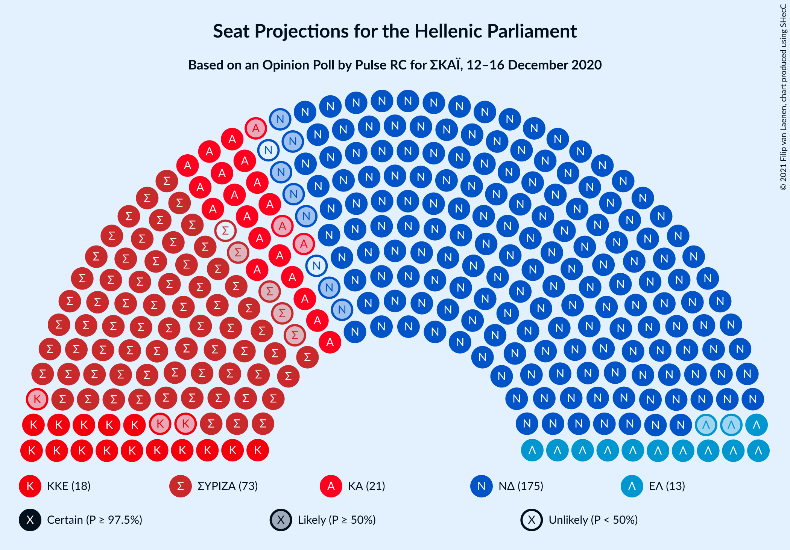
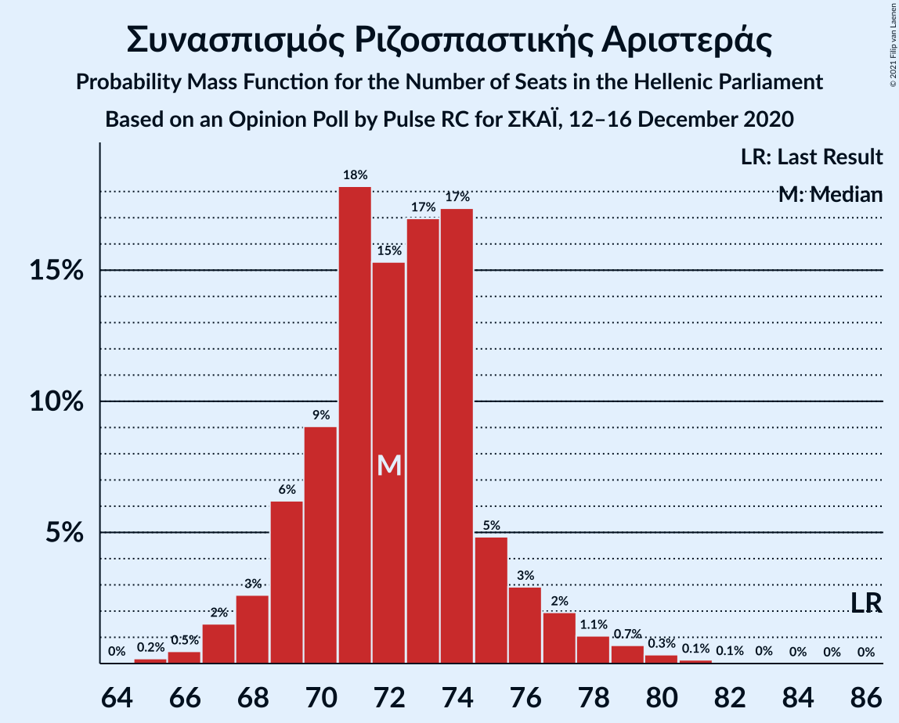

# Opinion Poll by Pulse RC for ΣΚΑΪ, 12–16 December 2020

<a href="#voting-intentions">Voting Intentions</a> | <a href="#seats">Seats</a> | <a href="#coalitions">Coalitions</a> | <a href="#technical-information">Technical Information</a>

## Voting Intentions

### Confidence Intervals

| Party | Last Result | Poll Result | 80% Confidence Interval | 90% Confidence Interval | 95% Confidence Interval | 99% Confidence Interval |
|:-----:|:-----------:|:-----------:|:-----------------------:|:-----------------------:|:-----------------------:|:-----------------------:|
| Νέα Δημοκρατία | 39.8% | 43.7% | 41.9–45.5% |41.4–46.0% |41.0–46.4% |40.2–47.2% |
| Συνασπισμός Ριζοσπαστικής Αριστεράς | 31.5% | 26.2% | 24.7–27.8% |24.3–28.3% |23.9–28.7% |23.2–29.4% |
| Κίνημα Αλλαγής | 8.1% | 7.7% | 6.8–8.7% |6.6–9.0% |6.4–9.3% |6.0–9.8% |
| Κομμουνιστικό Κόμμα Ελλάδας | 5.3% | 6.6% | 5.8–7.6% |5.6–7.9% |5.4–8.1% |5.0–8.6% |
| Ελληνική Λύση | 3.7% | 4.9% | 4.2–5.7% |4.0–6.0% |3.8–6.2% |3.5–6.6% |
| Μέτωπο Ευρωπαϊκής Ρεαλιστικής Ανυπακοής | 3.4% | 3.3% | 2.7–4.0% |2.6–4.2% |2.4–4.4% |2.2–4.8% |

*Note:* The poll result column reflects the actual value used in the calculations. Published results may vary slightly, and in addition be rounded to fewer digits.

## Seats

### Confidence Intervals

| Party | Last Result | Median | 80% Confidence Interval | 90% Confidence Interval | 95% Confidence Interval | 99% Confidence Interval |
|:-----:|:-----------:|:------:|:-----------------------:|:-----------------------:|:-----------------------:|:-----------------------:|
| <a href="#νέα-δημοκρατία">Νέα Δημοκρατία</a> | 158 | 169 | 164–174 |162–176 |161–177 |159–180 |
| <a href="#συνασπισμός-ριζοσπαστικής-αριστεράς">Συνασπισμός Ριζοσπαστικής Αριστεράς</a> | 86 | 71 | 67–76 |66–77 |65–78 |63–81 |
| <a href="#κίνημα-αλλαγής">Κίνημα Αλλαγής</a> | 22 | 21 | 19–24 |18–25 |17–25 |16–27 |
| <a href="#κομμουνιστικό-κόμμα-ελλάδας">Κομμουνιστικό Κόμμα Ελλάδας</a> | 15 | 18 | 16–21 |15–21 |15–22 |14–23 |
| <a href="#ελληνική-λύση">Ελληνική Λύση</a> | 10 | 13 | 11–16 |11–16 |10–17 |10–18 |
| <a href="#μέτωπο-ευρωπαϊκής-ρεαλιστικής-ανυπακοής">Μέτωπο Ευρωπαϊκής Ρεαλιστικής Ανυπακοής</a> | 9 | 9 | 0–11 |0–11 |0–12 |0–13 |

### Νέα Δημοκρατία

*For a full overview of the results for this party, see the [Νέα Δημοκρατία](party-νέαδημοκρατία.html) page.*

| Number of Seats | Probability | Accumulated | Special Marks |
|:---------------:|:-----------:|:-----------:|:-------------:|
| 156 | 0% | 100% |  |
| 157 | 0.1% | 99.9% |  |
| 158 | 0.2% | 99.8% | Last Result |
| 159 | 0.5% | 99.6% |  |
| 160 | 0.9% | 99.1% |  |
| 161 | 1.5% | 98% |  |
| 162 | 3% | 97% |  |
| 163 | 4% | 94% |  |
| 164 | 5% | 91% |  |
| 165 | 7% | 85% |  |
| 166 | 7% | 78% |  |
| 167 | 11% | 71% |  |
| 168 | 9% | 60% |  |
| 169 | 10% | 51% | Median |
| 170 | 9% | 41% |  |
| 171 | 7% | 32% |  |
| 172 | 6% | 25% |  |
| 173 | 6% | 19% |  |
| 174 | 4% | 13% |  |
| 175 | 3% | 9% |  |
| 176 | 2% | 6% |  |
| 177 | 2% | 4% |  |
| 178 | 0.9% | 2% |  |
| 179 | 0.5% | 1.2% |  |
| 180 | 0.4% | 0.7% |  |
| 181 | 0.2% | 0.3% |  |
| 182 | 0.1% | 0.2% |  |
| 183 | 0% | 0.1% |  |
| 184 | 0% | 0% |  |

### Συνασπισμός Ριζοσπαστικής Αριστεράς

*For a full overview of the results for this party, see the [Συνασπισμός Ριζοσπαστικής Αριστεράς](party-συνασπισμόςριζοσπαστικήςαριστεράς.html) page.*

| Number of Seats | Probability | Accumulated | Special Marks |
|:---------------:|:-----------:|:-----------:|:-------------:|
| 61 | 0.1% | 100% |  |
| 62 | 0.2% | 99.9% |  |
| 63 | 0.5% | 99.7% |  |
| 64 | 1.2% | 99.1% |  |
| 65 | 2% | 98% |  |
| 66 | 3% | 96% |  |
| 67 | 5% | 92% |  |
| 68 | 7% | 87% |  |
| 69 | 9% | 81% |  |
| 70 | 11% | 72% |  |
| 71 | 14% | 60% | Median |
| 72 | 11% | 47% |  |
| 73 | 10% | 35% |  |
| 74 | 7% | 25% |  |
| 75 | 5% | 18% |  |
| 76 | 5% | 13% |  |
| 77 | 4% | 8% |  |
| 78 | 2% | 4% |  |
| 79 | 1.1% | 2% |  |
| 80 | 0.5% | 1.0% |  |
| 81 | 0.2% | 0.5% |  |
| 82 | 0.2% | 0.3% |  |
| 83 | 0.1% | 0.1% |  |
| 84 | 0% | 0% |  |
| 85 | 0% | 0% |  |
| 86 | 0% | 0% | Last Result |

### Κίνημα Αλλαγής

*For a full overview of the results for this party, see the [Κίνημα Αλλαγής](party-κίνημααλλαγής.html) page.*

| Number of Seats | Probability | Accumulated | Special Marks |
|:---------------:|:-----------:|:-----------:|:-------------:|
| 15 | 0.1% | 100% |  |
| 16 | 0.7% | 99.9% |  |
| 17 | 2% | 99.2% |  |
| 18 | 6% | 97% |  |
| 19 | 13% | 91% |  |
| 20 | 17% | 78% |  |
| 21 | 21% | 61% | Median |
| 22 | 14% | 40% | Last Result |
| 23 | 14% | 26% |  |
| 24 | 6% | 12% |  |
| 25 | 4% | 5% |  |
| 26 | 1.2% | 2% |  |
| 27 | 0.5% | 0.7% |  |
| 28 | 0.1% | 0.2% |  |
| 29 | 0% | 0% |  |

### Κομμουνιστικό Κόμμα Ελλάδας

*For a full overview of the results for this party, see the [Κομμουνιστικό Κόμμα Ελλάδας](party-κομμουνιστικόκόμμαελλάδας.html) page.*

| Number of Seats | Probability | Accumulated | Special Marks |
|:---------------:|:-----------:|:-----------:|:-------------:|
| 13 | 0.3% | 100% |  |
| 14 | 1.5% | 99.7% |  |
| 15 | 5% | 98% | Last Result |
| 16 | 11% | 93% |  |
| 17 | 18% | 82% |  |
| 18 | 21% | 64% | Median |
| 19 | 19% | 43% |  |
| 20 | 12% | 24% |  |
| 21 | 7% | 12% |  |
| 22 | 3% | 5% |  |
| 23 | 1.0% | 2% |  |
| 24 | 0.4% | 0.5% |  |
| 25 | 0.1% | 0.1% |  |
| 26 | 0% | 0% |  |

### Ελληνική Λύση

*For a full overview of the results for this party, see the [Ελληνική Λύση](party-ελληνικήλύση.html) page.*

| Number of Seats | Probability | Accumulated | Special Marks |
|:---------------:|:-----------:|:-----------:|:-------------:|
| 9 | 0.3% | 100% |  |
| 10 | 3% | 99.6% | Last Result |
| 11 | 8% | 97% |  |
| 12 | 18% | 89% |  |
| 13 | 24% | 71% | Median |
| 14 | 21% | 47% |  |
| 15 | 15% | 26% |  |
| 16 | 7% | 11% |  |
| 17 | 3% | 4% |  |
| 18 | 0.8% | 1.0% |  |
| 19 | 0.2% | 0.2% |  |
| 20 | 0% | 0.1% |  |
| 21 | 0% | 0% |  |

### Μέτωπο Ευρωπαϊκής Ρεαλιστικής Ανυπακοής

*For a full overview of the results for this party, see the [Μέτωπο Ευρωπαϊκής Ρεαλιστικής Ανυπακοής](party-μέτωποευρωπαϊκήςρεαλιστικήςανυπακοής.html) page.*

| Number of Seats | Probability | Accumulated | Special Marks |
|:---------------:|:-----------:|:-----------:|:-------------:|
| 0 | 26% | 100% |  |
| 1 | 0% | 74% |  |
| 2 | 0% | 74% |  |
| 3 | 0% | 74% |  |
| 4 | 0% | 74% |  |
| 5 | 0% | 74% |  |
| 6 | 0% | 74% |  |
| 7 | 0% | 74% |  |
| 8 | 10% | 74% |  |
| 9 | 29% | 64% | Last Result, Median |
| 10 | 21% | 35% |  |
| 11 | 10% | 14% |  |
| 12 | 3% | 4% |  |
| 13 | 0.7% | 0.9% |  |
| 14 | 0.1% | 0.1% |  |
| 15 | 0% | 0% |  |

## Coalitions

### Confidence Intervals

| Coalition | Last Result | Median | Majority? | 80% Confidence Interval | 90% Confidence Interval | 95% Confidence Interval | 99% Confidence Interval |
|:---------:|:-----------:|:------:|:---------:|:-----------------------:|:-----------------------:|:-----------------------:|:-----------------------:|
| Νέα Δημοκρατία – Κίνημα Αλλαγής | 180 | 190 | 100% | 184–196 | 183–198 | 182–199 | 180–202 |
| Νέα Δημοκρατία | 158 | 169 | 100% | 164–174 | 162–176 | 161–177 | 159–180 |
| Συνασπισμός Ριζοσπαστικής Αριστεράς – Μέτωπο Ευρωπαϊκής Ρεαλιστικής Ανυπακοής | 95 | 79 | 0% | 72–84 | 70–85 | 69–86 | 67–88 |
| Συνασπισμός Ριζοσπαστικής Αριστεράς | 86 | 71 | 0% | 67–76 | 66–77 | 65–78 | 63–81 |

### Νέα Δημοκρατία – Κίνημα Αλλαγής

| Number of Seats | Probability | Accumulated | Special Marks |
|:---------------:|:-----------:|:-----------:|:-------------:|
| 177 | 0% | 100% |  |
| 178 | 0.1% | 99.9% |  |
| 179 | 0.2% | 99.8% |  |
| 180 | 0.5% | 99.6% | Last Result |
| 181 | 1.0% | 99.1% |  |
| 182 | 2% | 98% |  |
| 183 | 3% | 97% |  |
| 184 | 4% | 94% |  |
| 185 | 5% | 90% |  |
| 186 | 7% | 85% |  |
| 187 | 8% | 78% |  |
| 188 | 9% | 70% |  |
| 189 | 10% | 61% |  |
| 190 | 9% | 51% | Median |
| 191 | 9% | 42% |  |
| 192 | 6% | 33% |  |
| 193 | 7% | 27% |  |
| 194 | 4% | 20% |  |
| 195 | 4% | 15% |  |
| 196 | 3% | 11% |  |
| 197 | 2% | 7% |  |
| 198 | 2% | 5% |  |
| 199 | 1.1% | 3% |  |
| 200 | 0.9% | 2% |  |
| 201 | 0.4% | 0.9% |  |
| 202 | 0.3% | 0.5% |  |
| 203 | 0.1% | 0.2% |  |
| 204 | 0.1% | 0.1% |  |
| 205 | 0% | 0% |  |

### Νέα Δημοκρατία

| Number of Seats | Probability | Accumulated | Special Marks |
|:---------------:|:-----------:|:-----------:|:-------------:|
| 156 | 0% | 100% |  |
| 157 | 0.1% | 99.9% |  |
| 158 | 0.2% | 99.8% | Last Result |
| 159 | 0.5% | 99.6% |  |
| 160 | 0.9% | 99.1% |  |
| 161 | 1.5% | 98% |  |
| 162 | 3% | 97% |  |
| 163 | 4% | 94% |  |
| 164 | 5% | 91% |  |
| 165 | 7% | 85% |  |
| 166 | 7% | 78% |  |
| 167 | 11% | 71% |  |
| 168 | 9% | 60% |  |
| 169 | 10% | 51% | Median |
| 170 | 9% | 41% |  |
| 171 | 7% | 32% |  |
| 172 | 6% | 25% |  |
| 173 | 6% | 19% |  |
| 174 | 4% | 13% |  |
| 175 | 3% | 9% |  |
| 176 | 2% | 6% |  |
| 177 | 2% | 4% |  |
| 178 | 0.9% | 2% |  |
| 179 | 0.5% | 1.2% |  |
| 180 | 0.4% | 0.7% |  |
| 181 | 0.2% | 0.3% |  |
| 182 | 0.1% | 0.2% |  |
| 183 | 0% | 0.1% |  |
| 184 | 0% | 0% |  |

### Συνασπισμός Ριζοσπαστικής Αριστεράς – Μέτωπο Ευρωπαϊκής Ρεαλιστικής Ανυπακοής

| Number of Seats | Probability | Accumulated | Special Marks |
|:---------------:|:-----------:|:-----------:|:-------------:|
| 64 | 0.1% | 100% |  |
| 65 | 0.1% | 99.9% |  |
| 66 | 0.2% | 99.8% |  |
| 67 | 0.3% | 99.5% |  |
| 68 | 0.6% | 99.2% |  |
| 69 | 2% | 98.6% |  |
| 70 | 2% | 97% |  |
| 71 | 3% | 95% |  |
| 72 | 3% | 91% |  |
| 73 | 3% | 88% |  |
| 74 | 4% | 85% |  |
| 75 | 5% | 81% |  |
| 76 | 5% | 75% |  |
| 77 | 8% | 71% |  |
| 78 | 8% | 63% |  |
| 79 | 10% | 55% |  |
| 80 | 11% | 45% | Median |
| 81 | 11% | 34% |  |
| 82 | 5% | 23% |  |
| 83 | 7% | 18% |  |
| 84 | 4% | 12% |  |
| 85 | 3% | 8% |  |
| 86 | 2% | 4% |  |
| 87 | 1.3% | 2% |  |
| 88 | 0.5% | 1.0% |  |
| 89 | 0.3% | 0.5% |  |
| 90 | 0.1% | 0.2% |  |
| 91 | 0.1% | 0.1% |  |
| 92 | 0% | 0% |  |
| 93 | 0% | 0% |  |
| 94 | 0% | 0% |  |
| 95 | 0% | 0% | Last Result |

### Συνασπισμός Ριζοσπαστικής Αριστεράς

| Number of Seats | Probability | Accumulated | Special Marks |
|:---------------:|:-----------:|:-----------:|:-------------:|
| 61 | 0.1% | 100% |  |
| 62 | 0.2% | 99.9% |  |
| 63 | 0.5% | 99.7% |  |
| 64 | 1.2% | 99.1% |  |
| 65 | 2% | 98% |  |
| 66 | 3% | 96% |  |
| 67 | 5% | 92% |  |
| 68 | 7% | 87% |  |
| 69 | 9% | 81% |  |
| 70 | 11% | 72% |  |
| 71 | 14% | 60% | Median |
| 72 | 11% | 47% |  |
| 73 | 10% | 35% |  |
| 74 | 7% | 25% |  |
| 75 | 5% | 18% |  |
| 76 | 5% | 13% |  |
| 77 | 4% | 8% |  |
| 78 | 2% | 4% |  |
| 79 | 1.1% | 2% |  |
| 80 | 0.5% | 1.0% |  |
| 81 | 0.2% | 0.5% |  |
| 82 | 0.2% | 0.3% |  |
| 83 | 0.1% | 0.1% |  |
| 84 | 0% | 0% |  |
| 85 | 0% | 0% |  |
| 86 | 0% | 0% | Last Result |

## Technical Information

### Opinion Poll

+ **Polling firm:** Pulse RC
+ **Commissioner(s):** ΣΚΑΪ
+ **Fieldwork period:** 12–16 December 2020

### Calculations

+ **Sample size:** 1312
+ **Simulations done:** 1,048,576
+ **Error estimate:** 0.34%

