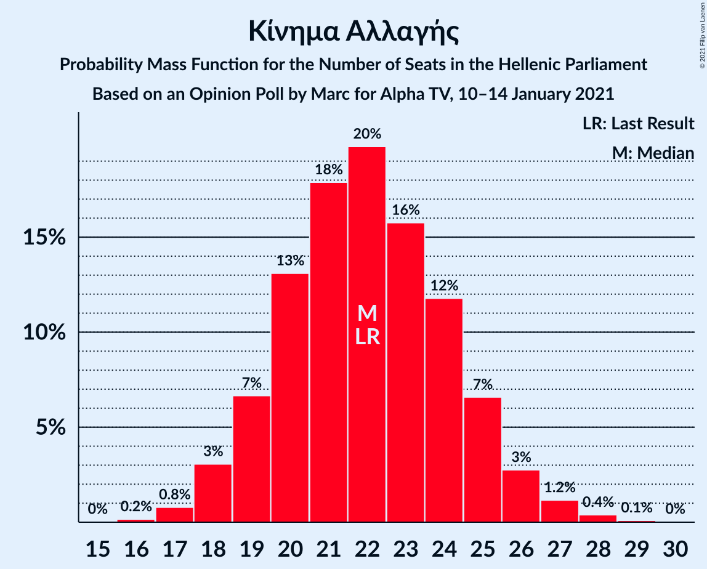
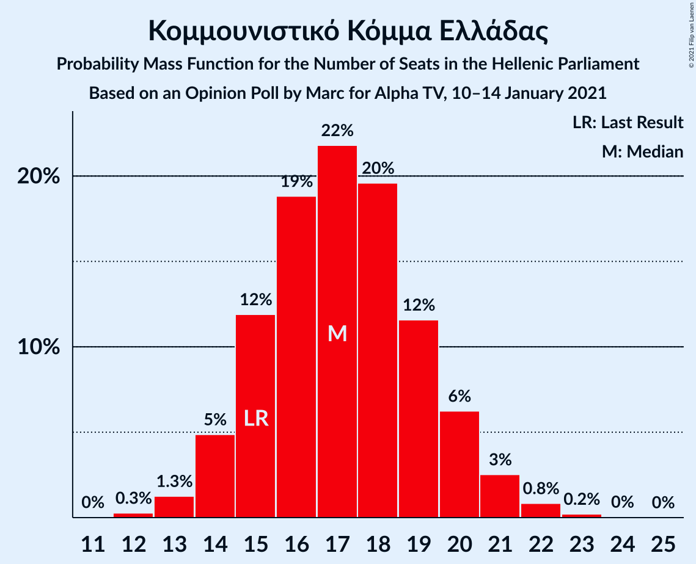
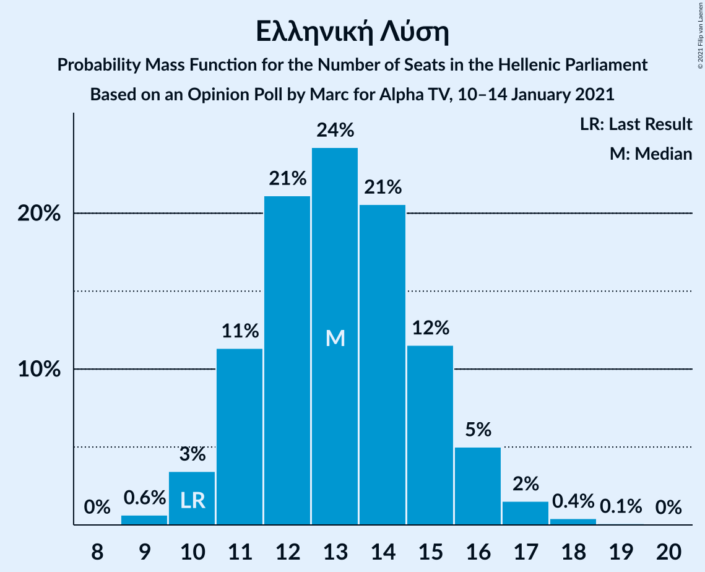
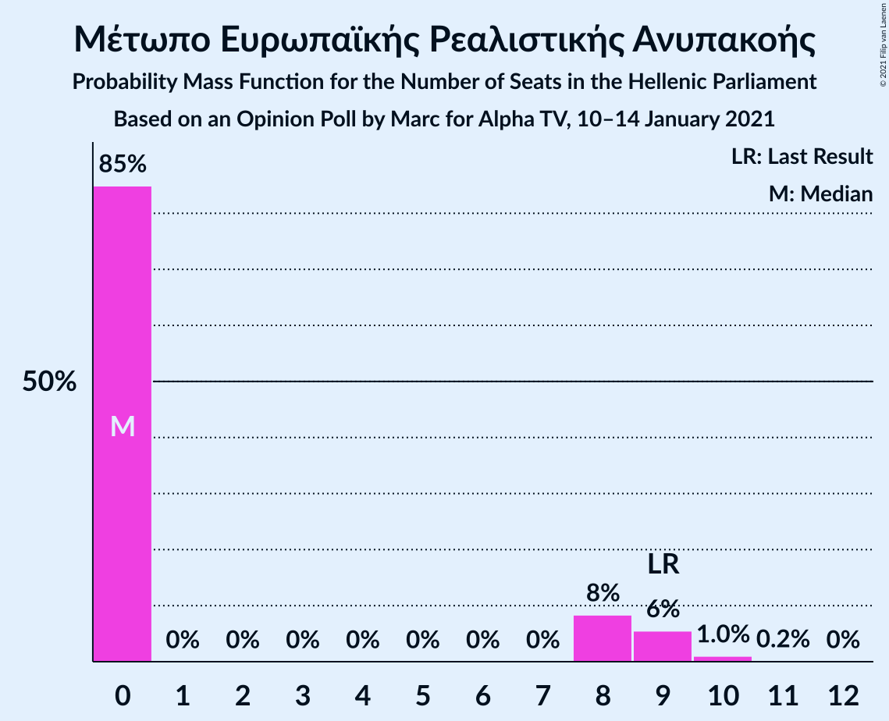
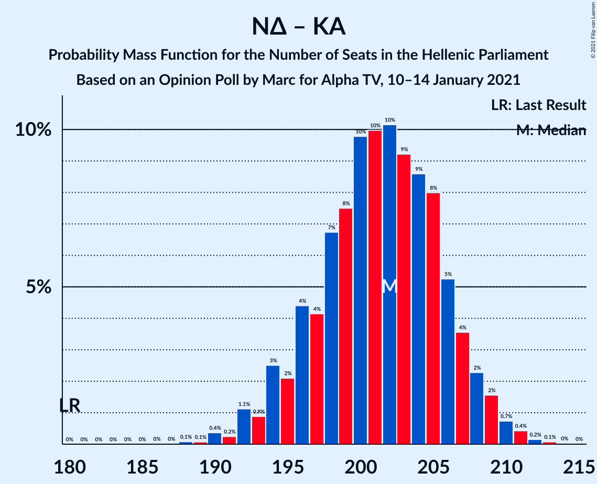
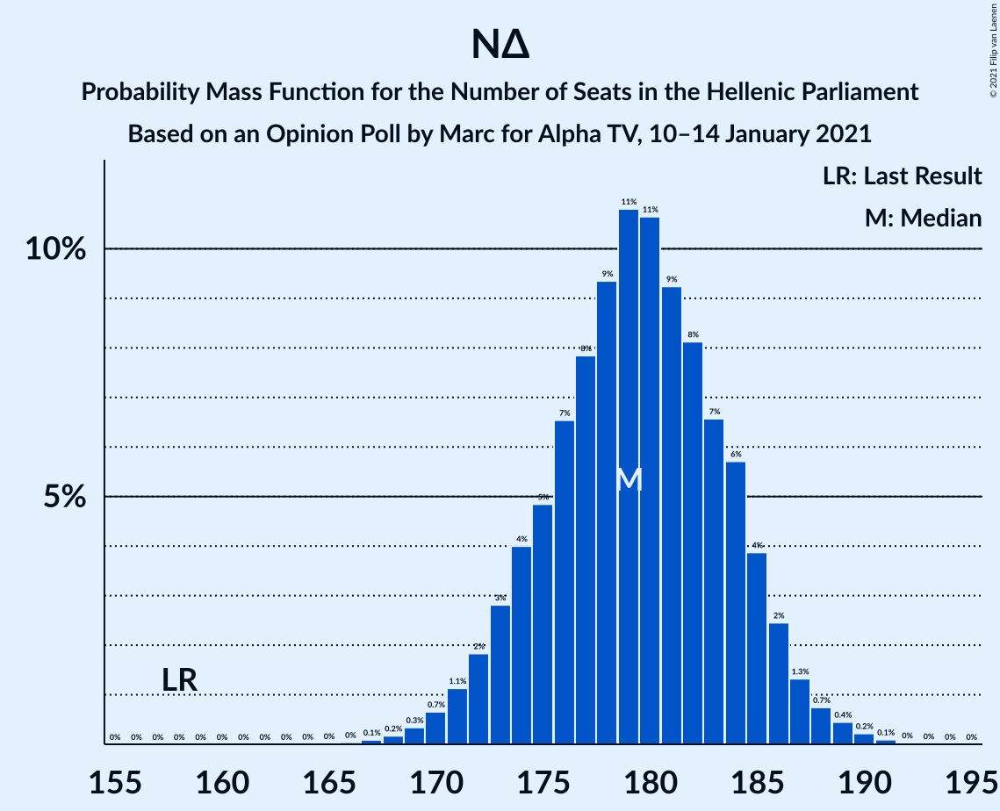

# Opinion Poll by Marc for Αlpha TV, 10–14 January 2021

<a href="#voting-intentions">Voting Intentions</a> | <a href="#seats">Seats</a> | <a href="#coalitions">Coalitions</a> | <a href="#technical-information">Technical Information</a>

## Voting Intentions

### Confidence Intervals

| Party | Last Result | Poll Result | 80% Confidence Interval | 90% Confidence Interval | 95% Confidence Interval | 99% Confidence Interval |
|:-----:|:-----------:|:-----------:|:-----------------------:|:-----------------------:|:-----------------------:|:-----------------------:|
| Νέα Δημοκρατία | 39.8% | 48.3% | 46.5–50.0% |46.0–50.5% |45.6–51.0% |44.7–51.8% |
| Συνασπισμός Ριζοσπαστικής Αριστεράς | 31.5% | 25.0% | 23.5–26.6% |23.1–27.0% |22.7–27.4% |22.0–28.2% |
| Κίνημα Αλλαγής | 8.1% | 8.1% | 7.2–9.2% |7.0–9.5% |6.8–9.7% |6.4–10.3% |
| Κομμουνιστικό Κόμμα Ελλάδας | 5.3% | 6.3% | 5.5–7.3% |5.3–7.5% |5.1–7.8% |4.8–8.2% |
| Ελληνική Λύση | 3.7% | 4.8% | 4.1–5.7% |3.9–5.9% |3.8–6.1% |3.5–6.5% |
| Μέτωπο Ευρωπαϊκής Ρεαλιστικής Ανυπακοής | 3.4% | 2.5% | 2.0–3.1% |1.9–3.3% |1.8–3.5% |1.6–3.8% |

*Note:* The poll result column reflects the actual value used in the calculations. Published results may vary slightly, and in addition be rounded to fewer digits.

## Seats

### Confidence Intervals

| Party | Last Result | Median | 80% Confidence Interval | 90% Confidence Interval | 95% Confidence Interval | 99% Confidence Interval |
|:-----:|:-----------:|:------:|:-----------------------:|:-----------------------:|:-----------------------:|:-----------------------:|
| <a href="#νέα-δημοκρατία">Νέα Δημοκρατία</a> | 158 | 179 | 174–184 |172–185 |171–187 |169–189 |
| <a href="#συνασπισμός-ριζοσπαστικής-αριστεράς">Συνασπισμός Ριζοσπαστικής Αριστεράς</a> | 86 | 67 | 63–71 |62–72 |61–74 |59–76 |
| <a href="#κίνημα-αλλαγής">Κίνημα Αλλαγής</a> | 22 | 22 | 19–25 |19–25 |18–26 |17–28 |
| <a href="#κομμουνιστικό-κόμμα-ελλάδας">Κομμουνιστικό Κόμμα Ελλάδας</a> | 15 | 17 | 15–19 |14–20 |14–21 |13–22 |
| <a href="#ελληνική-λύση">Ελληνική Λύση</a> | 10 | 13 | 11–15 |11–16 |10–16 |9–18 |
| <a href="#μέτωπο-ευρωπαϊκής-ρεαλιστικής-ανυπακοής">Μέτωπο Ευρωπαϊκής Ρεαλιστικής Ανυπακοής</a> | 9 | 0 | 0–8 |0–9 |0–9 |0–10 |

### Νέα Δημοκρατία

*For a full overview of the results for this party, see the [Νέα Δημοκρατία](party-νέαδημοκρατία.html) page.*

| Number of Seats | Probability | Accumulated | Special Marks |
|:---------------:|:-----------:|:-----------:|:-------------:|
| 158 | 0% | 100% | Last Result |
| 159 | 0% | 100% |  |
| 160 | 0% | 100% |  |
| 161 | 0% | 100% |  |
| 162 | 0% | 100% |  |
| 163 | 0% | 100% |  |
| 164 | 0% | 100% |  |
| 165 | 0% | 100% |  |
| 166 | 0.1% | 100% |  |
| 167 | 0.1% | 99.9% |  |
| 168 | 0.2% | 99.8% |  |
| 169 | 0.3% | 99.6% |  |
| 170 | 0.7% | 99.3% |  |
| 171 | 1.1% | 98.6% |  |
| 172 | 3% | 97% |  |
| 173 | 2% | 95% |  |
| 174 | 3% | 93% |  |
| 175 | 5% | 90% |  |
| 176 | 4% | 85% |  |
| 177 | 11% | 81% |  |
| 178 | 11% | 70% |  |
| 179 | 10% | 59% | Median |
| 180 | 6% | 50% |  |
| 181 | 9% | 44% |  |
| 182 | 11% | 34% |  |
| 183 | 6% | 23% |  |
| 184 | 10% | 17% |  |
| 185 | 2% | 7% |  |
| 186 | 2% | 5% |  |
| 187 | 1.3% | 3% |  |
| 188 | 0.9% | 2% |  |
| 189 | 0.6% | 1.0% |  |
| 190 | 0.2% | 0.4% |  |
| 191 | 0.1% | 0.1% |  |
| 192 | 0% | 0% |  |

### Συνασπισμός Ριζοσπαστικής Αριστεράς

*For a full overview of the results for this party, see the [Συνασπισμός Ριζοσπαστικής Αριστεράς](party-συνασπισμόςριζοσπαστικήςαριστεράς.html) page.*

| Number of Seats | Probability | Accumulated | Special Marks |
|:---------------:|:-----------:|:-----------:|:-------------:|
| 57 | 0% | 100% |  |
| 58 | 0.2% | 99.9% |  |
| 59 | 0.5% | 99.7% |  |
| 60 | 0.7% | 99.2% |  |
| 61 | 3% | 98% |  |
| 62 | 3% | 96% |  |
| 63 | 8% | 93% |  |
| 64 | 7% | 86% |  |
| 65 | 9% | 79% |  |
| 66 | 13% | 70% |  |
| 67 | 8% | 56% | Median |
| 68 | 15% | 49% |  |
| 69 | 12% | 34% |  |
| 70 | 6% | 21% |  |
| 71 | 9% | 15% |  |
| 72 | 2% | 7% |  |
| 73 | 2% | 5% |  |
| 74 | 2% | 3% |  |
| 75 | 0.6% | 1.1% |  |
| 76 | 0.3% | 0.5% |  |
| 77 | 0.1% | 0.2% |  |
| 78 | 0% | 0.1% |  |
| 79 | 0% | 0% |  |
| 80 | 0% | 0% |  |
| 81 | 0% | 0% |  |
| 82 | 0% | 0% |  |
| 83 | 0% | 0% |  |
| 84 | 0% | 0% |  |
| 85 | 0% | 0% |  |
| 86 | 0% | 0% | Last Result |

### Κίνημα Αλλαγής

*For a full overview of the results for this party, see the [Κίνημα Αλλαγής](party-κίνημααλλαγής.html) page.*

| Number of Seats | Probability | Accumulated | Special Marks |
|:---------------:|:-----------:|:-----------:|:-------------:|
| 16 | 0.2% | 100% |  |
| 17 | 0.8% | 99.8% |  |
| 18 | 3% | 99.0% |  |
| 19 | 7% | 96% |  |
| 20 | 10% | 89% |  |
| 21 | 23% | 79% |  |
| 22 | 20% | 56% | Last Result, Median |
| 23 | 13% | 37% |  |
| 24 | 13% | 23% |  |
| 25 | 6% | 11% |  |
| 26 | 4% | 5% |  |
| 27 | 0.9% | 1.4% |  |
| 28 | 0.4% | 0.5% |  |
| 29 | 0.1% | 0.2% |  |
| 30 | 0% | 0% |  |

### Κομμουνιστικό Κόμμα Ελλάδας

*For a full overview of the results for this party, see the [Κομμουνιστικό Κόμμα Ελλάδας](party-κομμουνιστικόκόμμαελλάδας.html) page.*

| Number of Seats | Probability | Accumulated | Special Marks |
|:---------------:|:-----------:|:-----------:|:-------------:|
| 12 | 0.2% | 100% |  |
| 13 | 2% | 99.7% |  |
| 14 | 3% | 98% |  |
| 15 | 11% | 95% | Last Result |
| 16 | 24% | 84% |  |
| 17 | 15% | 59% | Median |
| 18 | 28% | 45% |  |
| 19 | 7% | 17% |  |
| 20 | 6% | 10% |  |
| 21 | 3% | 4% |  |
| 22 | 0.5% | 0.9% |  |
| 23 | 0.3% | 0.3% |  |
| 24 | 0% | 0.1% |  |
| 25 | 0% | 0% |  |

### Ελληνική Λύση

*For a full overview of the results for this party, see the [Ελληνική Λύση](party-ελληνικήλύση.html) page.*

| Number of Seats | Probability | Accumulated | Special Marks |
|:---------------:|:-----------:|:-----------:|:-------------:|
| 8 | 0% | 100% |  |
| 9 | 0.7% | 99.9% |  |
| 10 | 3% | 99.3% | Last Result |
| 11 | 12% | 96% |  |
| 12 | 20% | 84% |  |
| 13 | 26% | 64% | Median |
| 14 | 22% | 38% |  |
| 15 | 9% | 17% |  |
| 16 | 6% | 7% |  |
| 17 | 1.3% | 2% |  |
| 18 | 0.4% | 0.5% |  |
| 19 | 0.1% | 0.1% |  |
| 20 | 0% | 0% |  |

### Μέτωπο Ευρωπαϊκής Ρεαλιστικής Ανυπακοής

*For a full overview of the results for this party, see the [Μέτωπο Ευρωπαϊκής Ρεαλιστικής Ανυπακοής](party-μέτωποευρωπαϊκήςρεαλιστικήςανυπακοής.html) page.*

| Number of Seats | Probability | Accumulated | Special Marks |
|:---------------:|:-----------:|:-----------:|:-------------:|
| 0 | 87% | 100% | Median |
| 1 | 0% | 13% |  |
| 2 | 0% | 13% |  |
| 3 | 0% | 13% |  |
| 4 | 0% | 13% |  |
| 5 | 0% | 13% |  |
| 6 | 0% | 13% |  |
| 7 | 0% | 13% |  |
| 8 | 6% | 13% |  |
| 9 | 7% | 8% | Last Result |
| 10 | 0.9% | 1.0% |  |
| 11 | 0.1% | 0.1% |  |
| 12 | 0% | 0% |  |

## Coalitions

### Confidence Intervals

| Coalition | Last Result | Median | Majority? | 80% Confidence Interval | 90% Confidence Interval | 95% Confidence Interval | 99% Confidence Interval |
|:---------:|:-----------:|:------:|:---------:|:-----------------------:|:-----------------------:|:-----------------------:|:-----------------------:|
| Νέα Δημοκρατία – Κίνημα Αλλαγής | 180 | 202 | 100% | 196–206 | 194–208 | 193–209 | 190–211 |
| Νέα Δημοκρατία | 158 | 179 | 100% | 174–184 | 172–185 | 171–187 | 169–189 |
| Συνασπισμός Ριζοσπαστικής Αριστεράς – Μέτωπο Ευρωπαϊκής Ρεαλιστικής Ανυπακοής | 95 | 68 | 0% | 63–74 | 63–76 | 62–77 | 60–80 |
| Συνασπισμός Ριζοσπαστικής Αριστεράς | 86 | 67 | 0% | 63–71 | 62–72 | 61–74 | 59–76 |

### Νέα Δημοκρατία – Κίνημα Αλλαγής

| Number of Seats | Probability | Accumulated | Special Marks |
|:---------------:|:-----------:|:-----------:|:-------------:|
| 180 | 0% | 100% | Last Result |
| 181 | 0% | 100% |  |
| 182 | 0% | 100% |  |
| 183 | 0% | 100% |  |
| 184 | 0% | 100% |  |
| 185 | 0% | 100% |  |
| 186 | 0% | 100% |  |
| 187 | 0% | 100% |  |
| 188 | 0.1% | 100% |  |
| 189 | 0.1% | 99.8% |  |
| 190 | 0.3% | 99.8% |  |
| 191 | 0.5% | 99.4% |  |
| 192 | 1.1% | 98.9% |  |
| 193 | 0.9% | 98% |  |
| 194 | 3% | 97% |  |
| 195 | 2% | 94% |  |
| 196 | 3% | 92% |  |
| 197 | 3% | 89% |  |
| 198 | 7% | 86% |  |
| 199 | 7% | 79% |  |
| 200 | 10% | 71% |  |
| 201 | 9% | 61% | Median |
| 202 | 9% | 52% |  |
| 203 | 10% | 44% |  |
| 204 | 9% | 34% |  |
| 205 | 10% | 25% |  |
| 206 | 6% | 15% |  |
| 207 | 3% | 8% |  |
| 208 | 2% | 5% |  |
| 209 | 2% | 3% |  |
| 210 | 0.7% | 2% |  |
| 211 | 0.6% | 0.8% |  |
| 212 | 0.1% | 0.2% |  |
| 213 | 0.1% | 0.1% |  |
| 214 | 0% | 0% |  |

### Νέα Δημοκρατία

| Number of Seats | Probability | Accumulated | Special Marks |
|:---------------:|:-----------:|:-----------:|:-------------:|
| 158 | 0% | 100% | Last Result |
| 159 | 0% | 100% |  |
| 160 | 0% | 100% |  |
| 161 | 0% | 100% |  |
| 162 | 0% | 100% |  |
| 163 | 0% | 100% |  |
| 164 | 0% | 100% |  |
| 165 | 0% | 100% |  |
| 166 | 0.1% | 100% |  |
| 167 | 0.1% | 99.9% |  |
| 168 | 0.2% | 99.8% |  |
| 169 | 0.3% | 99.6% |  |
| 170 | 0.7% | 99.3% |  |
| 171 | 1.1% | 98.6% |  |
| 172 | 3% | 97% |  |
| 173 | 2% | 95% |  |
| 174 | 3% | 93% |  |
| 175 | 5% | 90% |  |
| 176 | 4% | 85% |  |
| 177 | 11% | 81% |  |
| 178 | 11% | 70% |  |
| 179 | 10% | 59% | Median |
| 180 | 6% | 50% |  |
| 181 | 9% | 44% |  |
| 182 | 11% | 34% |  |
| 183 | 6% | 23% |  |
| 184 | 10% | 17% |  |
| 185 | 2% | 7% |  |
| 186 | 2% | 5% |  |
| 187 | 1.3% | 3% |  |
| 188 | 0.9% | 2% |  |
| 189 | 0.6% | 1.0% |  |
| 190 | 0.2% | 0.4% |  |
| 191 | 0.1% | 0.1% |  |
| 192 | 0% | 0% |  |

### Συνασπισμός Ριζοσπαστικής Αριστεράς – Μέτωπο Ευρωπαϊκής Ρεαλιστικής Ανυπακοής

| Number of Seats | Probability | Accumulated | Special Marks |
|:---------------:|:-----------:|:-----------:|:-------------:|
| 58 | 0.1% | 100% |  |
| 59 | 0.2% | 99.8% |  |
| 60 | 0.6% | 99.6% |  |
| 61 | 1.4% | 99.0% |  |
| 62 | 2% | 98% |  |
| 63 | 7% | 95% |  |
| 64 | 4% | 89% |  |
| 65 | 9% | 85% |  |
| 66 | 12% | 76% |  |
| 67 | 7% | 64% | Median |
| 68 | 14% | 57% |  |
| 69 | 10% | 43% |  |
| 70 | 7% | 33% |  |
| 71 | 9% | 26% |  |
| 72 | 3% | 17% |  |
| 73 | 4% | 15% |  |
| 74 | 2% | 10% |  |
| 75 | 3% | 8% |  |
| 76 | 0.7% | 6% |  |
| 77 | 4% | 5% |  |
| 78 | 0.4% | 1.3% |  |
| 79 | 0.2% | 0.9% |  |
| 80 | 0.5% | 0.7% |  |
| 81 | 0% | 0.2% |  |
| 82 | 0.1% | 0.2% |  |
| 83 | 0% | 0% |  |
| 84 | 0% | 0% |  |
| 85 | 0% | 0% |  |
| 86 | 0% | 0% |  |
| 87 | 0% | 0% |  |
| 88 | 0% | 0% |  |
| 89 | 0% | 0% |  |
| 90 | 0% | 0% |  |
| 91 | 0% | 0% |  |
| 92 | 0% | 0% |  |
| 93 | 0% | 0% |  |
| 94 | 0% | 0% |  |
| 95 | 0% | 0% | Last Result |

### Συνασπισμός Ριζοσπαστικής Αριστεράς

| Number of Seats | Probability | Accumulated | Special Marks |
|:---------------:|:-----------:|:-----------:|:-------------:|
| 57 | 0% | 100% |  |
| 58 | 0.2% | 99.9% |  |
| 59 | 0.5% | 99.7% |  |
| 60 | 0.7% | 99.2% |  |
| 61 | 3% | 98% |  |
| 62 | 3% | 96% |  |
| 63 | 8% | 93% |  |
| 64 | 7% | 86% |  |
| 65 | 9% | 79% |  |
| 66 | 13% | 70% |  |
| 67 | 8% | 56% | Median |
| 68 | 15% | 49% |  |
| 69 | 12% | 34% |  |
| 70 | 6% | 21% |  |
| 71 | 9% | 15% |  |
| 72 | 2% | 7% |  |
| 73 | 2% | 5% |  |
| 74 | 2% | 3% |  |
| 75 | 0.6% | 1.1% |  |
| 76 | 0.3% | 0.5% |  |
| 77 | 0.1% | 0.2% |  |
| 78 | 0% | 0.1% |  |
| 79 | 0% | 0% |  |
| 80 | 0% | 0% |  |
| 81 | 0% | 0% |  |
| 82 | 0% | 0% |  |
| 83 | 0% | 0% |  |
| 84 | 0% | 0% |  |
| 85 | 0% | 0% |  |
| 86 | 0% | 0% | Last Result |

## Technical Information

### Opinion Poll

+ **Polling firm:** Marc
+ **Commissioner(s):** Αlpha TV
+ **Fieldwork period:** 10–14 January 2021

### Calculations

+ **Sample size:** 1328
+ **Simulations done:** 131,072
+ **Error estimate:** 1.05%

