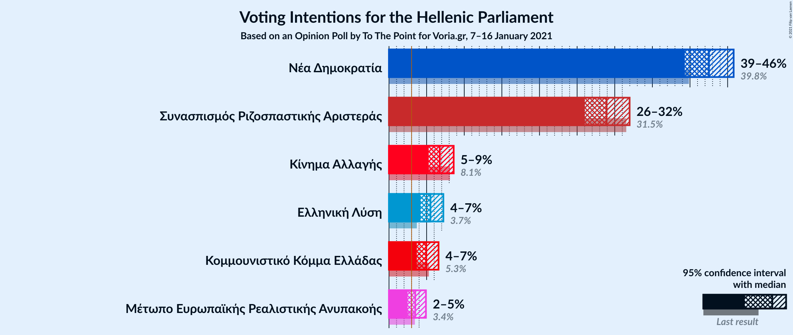

# Opinion Poll by To The Point for Voria.gr, 7–16 January 2021

<a href="#voting-intentions">Voting Intentions</a> | <a href="#seats">Seats</a> | <a href="#coalitions">Coalitions</a> | <a href="#technical-information">Technical Information</a>

## Voting Intentions

### Confidence Intervals

| Party | Last Result | Poll Result | 80% Confidence Interval | 90% Confidence Interval | 95% Confidence Interval | 99% Confidence Interval |
|:-----:|:-----------:|:-----------:|:-----------------------:|:-----------------------:|:-----------------------:|:-----------------------:|
| Νέα Δημοκρατία | 39.8% | 42.5% | 40.4–44.7% |39.8–45.3% |39.3–45.8% |38.3–46.8% |
| Συνασπισμός Ριζοσπαστικής Αριστεράς | 31.5% | 28.9% | 27.0–30.9% |26.5–31.5% |26.0–32.0% |25.1–33.0% |
| Κίνημα Αλλαγής | 8.1% | 6.7% | 5.8–8.0% |5.5–8.3% |5.3–8.6% |4.8–9.2% |
| Ελληνική Λύση | 3.7% | 5.5% | 4.6–6.6% |4.4–6.9% |4.2–7.2% |3.8–7.8% |
| Κομμουνιστικό Κόμμα Ελλάδας | 5.3% | 4.9% | 4.1–6.0% |3.9–6.3% |3.7–6.6% |3.4–7.1% |
| Μέτωπο Ευρωπαϊκής Ρεαλιστικής Ανυπακοής | 3.4% | 3.5% | 2.8–4.4% |2.6–4.7% |2.5–4.9% |2.2–5.4% |

*Note:* The poll result column reflects the actual value used in the calculations. Published results may vary slightly, and in addition be rounded to fewer digits.

## Seats

### Confidence Intervals

| Party | Last Result | Median | 80% Confidence Interval | 90% Confidence Interval | 95% Confidence Interval | 99% Confidence Interval |
|:-----:|:-----------:|:------:|:-----------------------:|:-----------------------:|:-----------------------:|:-----------------------:|
| <a href="#νέα-δημοκρατία">Νέα Δημοκρατία</a> | 158 | 166 | 160–172 |158–174 |157–175 |154–178 |
| <a href="#συνασπισμός-ριζοσπαστικής-αριστεράς">Συνασπισμός Ριζοσπαστικής Αριστεράς</a> | 86 | 79 | 73–84 |72–86 |71–87 |68–90 |
| <a href="#κίνημα-αλλαγής">Κίνημα Αλλαγής</a> | 22 | 18 | 16–22 |15–23 |14–23 |13–25 |
| <a href="#ελληνική-λύση">Ελληνική Λύση</a> | 10 | 15 | 13–18 |12–19 |11–20 |10–21 |
| <a href="#κομμουνιστικό-κόμμα-ελλάδας">Κομμουνιστικό Κόμμα Ελλάδας</a> | 15 | 14 | 11–16 |11–17 |10–18 |9–19 |
| <a href="#μέτωπο-ευρωπαϊκής-ρεαλιστικής-ανυπακοής">Μέτωπο Ευρωπαϊκής Ρεαλιστικής Ανυπακοής</a> | 9 | 10 | 0–12 |0–13 |0–13 |0–15 |

### Νέα Δημοκρατία

*For a full overview of the results for this party, see the [Νέα Δημοκρατία](party-νέαδημοκρατία.html) page.*

| Number of Seats | Probability | Accumulated | Special Marks |
|:---------------:|:-----------:|:-----------:|:-------------:|
| 151 | 0% | 100% | Majority |
| 152 | 0.1% | 99.9% |  |
| 153 | 0.2% | 99.8% |  |
| 154 | 0.4% | 99.6% |  |
| 155 | 0.6% | 99.2% |  |
| 156 | 1.0% | 98.6% |  |
| 157 | 2% | 98% |  |
| 158 | 3% | 96% | Last Result |
| 159 | 3% | 93% |  |
| 160 | 5% | 90% |  |
| 161 | 6% | 85% |  |
| 162 | 7% | 80% |  |
| 163 | 7% | 73% |  |
| 164 | 7% | 66% |  |
| 165 | 9% | 59% |  |
| 166 | 8% | 50% | Median |
| 167 | 9% | 42% |  |
| 168 | 8% | 33% |  |
| 169 | 7% | 25% |  |
| 170 | 5% | 18% |  |
| 171 | 3% | 13% |  |
| 172 | 3% | 10% |  |
| 173 | 2% | 7% |  |
| 174 | 2% | 5% |  |
| 175 | 1.2% | 4% |  |
| 176 | 1.1% | 2% |  |
| 177 | 0.7% | 1.3% |  |
| 178 | 0.3% | 0.6% |  |
| 179 | 0.1% | 0.3% |  |
| 180 | 0.1% | 0.2% |  |
| 181 | 0% | 0.1% |  |
| 182 | 0% | 0.1% |  |
| 183 | 0% | 0% |  |

### Συνασπισμός Ριζοσπαστικής Αριστεράς

*For a full overview of the results for this party, see the [Συνασπισμός Ριζοσπαστικής Αριστεράς](party-συνασπισμόςριζοσπαστικήςαριστεράς.html) page.*

| Number of Seats | Probability | Accumulated | Special Marks |
|:---------------:|:-----------:|:-----------:|:-------------:|
| 65 | 0% | 100% |  |
| 66 | 0.1% | 99.9% |  |
| 67 | 0.2% | 99.9% |  |
| 68 | 0.4% | 99.7% |  |
| 69 | 0.7% | 99.3% |  |
| 70 | 1.0% | 98.6% |  |
| 71 | 2% | 98% |  |
| 72 | 3% | 96% |  |
| 73 | 4% | 93% |  |
| 74 | 5% | 89% |  |
| 75 | 6% | 83% |  |
| 76 | 9% | 77% |  |
| 77 | 8% | 68% |  |
| 78 | 9% | 60% |  |
| 79 | 10% | 50% | Median |
| 80 | 8% | 40% |  |
| 81 | 8% | 32% |  |
| 82 | 6% | 24% |  |
| 83 | 5% | 18% |  |
| 84 | 4% | 13% |  |
| 85 | 3% | 9% |  |
| 86 | 2% | 6% | Last Result |
| 87 | 1.4% | 3% |  |
| 88 | 0.8% | 2% |  |
| 89 | 0.5% | 1.2% |  |
| 90 | 0.3% | 0.7% |  |
| 91 | 0.2% | 0.4% |  |
| 92 | 0.1% | 0.2% |  |
| 93 | 0% | 0.1% |  |
| 94 | 0% | 0% |  |

### Κίνημα Αλλαγής

*For a full overview of the results for this party, see the [Κίνημα Αλλαγής](party-κίνημααλλαγής.html) page.*

| Number of Seats | Probability | Accumulated | Special Marks |
|:---------------:|:-----------:|:-----------:|:-------------:|
| 12 | 0.1% | 100% |  |
| 13 | 0.7% | 99.8% |  |
| 14 | 2% | 99.2% |  |
| 15 | 5% | 97% |  |
| 16 | 10% | 92% |  |
| 17 | 14% | 82% |  |
| 18 | 18% | 67% | Median |
| 19 | 16% | 49% |  |
| 20 | 13% | 33% |  |
| 21 | 9% | 20% |  |
| 22 | 6% | 11% | Last Result |
| 23 | 3% | 5% |  |
| 24 | 1.3% | 2% |  |
| 25 | 0.6% | 0.9% |  |
| 26 | 0.2% | 0.3% |  |
| 27 | 0.1% | 0.1% |  |
| 28 | 0% | 0% |  |

### Ελληνική Λύση

*For a full overview of the results for this party, see the [Ελληνική Λύση](party-ελληνικήλύση.html) page.*

| Number of Seats | Probability | Accumulated | Special Marks |
|:---------------:|:-----------:|:-----------:|:-------------:|
| 9 | 0.1% | 100% |  |
| 10 | 0.5% | 99.9% | Last Result |
| 11 | 2% | 99.4% |  |
| 12 | 6% | 97% |  |
| 13 | 11% | 91% |  |
| 14 | 17% | 80% |  |
| 15 | 19% | 63% | Median |
| 16 | 18% | 44% |  |
| 17 | 11% | 25% |  |
| 18 | 8% | 14% |  |
| 19 | 4% | 7% |  |
| 20 | 2% | 3% |  |
| 21 | 0.7% | 1.1% |  |
| 22 | 0.2% | 0.3% |  |
| 23 | 0.1% | 0.1% |  |
| 24 | 0% | 0% |  |

### Κομμουνιστικό Κόμμα Ελλάδας

*For a full overview of the results for this party, see the [Κομμουνιστικό Κόμμα Ελλάδας](party-κομμουνιστικόκόμμαελλάδας.html) page.*

| Number of Seats | Probability | Accumulated | Special Marks |
|:---------------:|:-----------:|:-----------:|:-------------:|
| 0 | 0.1% | 100% |  |
| 1 | 0% | 99.9% |  |
| 2 | 0% | 99.9% |  |
| 3 | 0% | 99.9% |  |
| 4 | 0% | 99.9% |  |
| 5 | 0% | 99.9% |  |
| 6 | 0% | 99.9% |  |
| 7 | 0% | 99.9% |  |
| 8 | 0.1% | 99.9% |  |
| 9 | 0.8% | 99.8% |  |
| 10 | 4% | 99.1% |  |
| 11 | 7% | 95% |  |
| 12 | 19% | 88% |  |
| 13 | 15% | 69% |  |
| 14 | 23% | 55% | Median |
| 15 | 12% | 31% | Last Result |
| 16 | 11% | 19% |  |
| 17 | 5% | 8% |  |
| 18 | 3% | 4% |  |
| 19 | 0.8% | 1.3% |  |
| 20 | 0.3% | 0.5% |  |
| 21 | 0.1% | 0.1% |  |
| 22 | 0% | 0% |  |

### Μέτωπο Ευρωπαϊκής Ρεαλιστικής Ανυπακοής

*For a full overview of the results for this party, see the [Μέτωπο Ευρωπαϊκής Ρεαλιστικής Ανυπακοής](party-μέτωποευρωπαϊκήςρεαλιστικήςανυπακοής.html) page.*

| Number of Seats | Probability | Accumulated | Special Marks |
|:---------------:|:-----------:|:-----------:|:-------------:|
| 0 | 18% | 100% |  |
| 1 | 0% | 82% |  |
| 2 | 0% | 82% |  |
| 3 | 0% | 82% |  |
| 4 | 0% | 82% |  |
| 5 | 0% | 82% |  |
| 6 | 0% | 82% |  |
| 7 | 0% | 82% |  |
| 8 | 6% | 82% |  |
| 9 | 23% | 76% | Last Result |
| 10 | 23% | 52% | Median |
| 11 | 15% | 30% |  |
| 12 | 9% | 15% |  |
| 13 | 4% | 6% |  |
| 14 | 1.4% | 2% |  |
| 15 | 0.4% | 0.5% |  |
| 16 | 0.1% | 0.1% |  |
| 17 | 0% | 0% |  |

## Coalitions

### Confidence Intervals

| Coalition | Last Result | Median | Majority? | 80% Confidence Interval | 90% Confidence Interval | 95% Confidence Interval | 99% Confidence Interval |
|:---------:|:-----------:|:------:|:---------:|:-----------------------:|:-----------------------:|:-----------------------:|:-----------------------:|
| Νέα Δημοκρατία – Κίνημα Αλλαγής | 180 | 184 | 100% | 178–190 | 176–193 | 175–194 | 172–197 |
| Νέα Δημοκρατία | 158 | 166 | 100% | 160–172 | 158–174 | 157–175 | 154–178 |
| Συνασπισμός Ριζοσπαστικής Αριστεράς – Μέτωπο Ευρωπαϊκής Ρεαλιστικής Ανυπακοής | 95 | 87 | 0% | 81–93 | 78–95 | 76–96 | 73–99 |
| Συνασπισμός Ριζοσπαστικής Αριστεράς | 86 | 79 | 0% | 73–84 | 72–86 | 71–87 | 68–90 |

### Νέα Δημοκρατία – Κίνημα Αλλαγής

| Number of Seats | Probability | Accumulated | Special Marks |
|:---------------:|:-----------:|:-----------:|:-------------:|
| 169 | 0% | 100% |  |
| 170 | 0.1% | 99.9% |  |
| 171 | 0.2% | 99.8% |  |
| 172 | 0.3% | 99.7% |  |
| 173 | 0.5% | 99.4% |  |
| 174 | 0.9% | 98.9% |  |
| 175 | 1.5% | 98% |  |
| 176 | 2% | 97% |  |
| 177 | 3% | 95% |  |
| 178 | 4% | 92% |  |
| 179 | 5% | 88% |  |
| 180 | 6% | 83% | Last Result |
| 181 | 7% | 78% |  |
| 182 | 8% | 71% |  |
| 183 | 8% | 63% |  |
| 184 | 9% | 55% | Median |
| 185 | 9% | 46% |  |
| 186 | 8% | 37% |  |
| 187 | 7% | 29% |  |
| 188 | 5% | 22% |  |
| 189 | 5% | 17% |  |
| 190 | 3% | 12% |  |
| 191 | 2% | 10% |  |
| 192 | 2% | 7% |  |
| 193 | 1.3% | 5% |  |
| 194 | 1.2% | 4% |  |
| 195 | 1.1% | 2% |  |
| 196 | 0.5% | 1.3% |  |
| 197 | 0.4% | 0.8% |  |
| 198 | 0.2% | 0.4% |  |
| 199 | 0.1% | 0.2% |  |
| 200 | 0.1% | 0.1% |  |
| 201 | 0% | 0.1% |  |
| 202 | 0% | 0% |  |

### Νέα Δημοκρατία

| Number of Seats | Probability | Accumulated | Special Marks |
|:---------------:|:-----------:|:-----------:|:-------------:|
| 151 | 0% | 100% | Majority |
| 152 | 0.1% | 99.9% |  |
| 153 | 0.2% | 99.8% |  |
| 154 | 0.4% | 99.6% |  |
| 155 | 0.6% | 99.2% |  |
| 156 | 1.0% | 98.6% |  |
| 157 | 2% | 98% |  |
| 158 | 3% | 96% | Last Result |
| 159 | 3% | 93% |  |
| 160 | 5% | 90% |  |
| 161 | 6% | 85% |  |
| 162 | 7% | 80% |  |
| 163 | 7% | 73% |  |
| 164 | 7% | 66% |  |
| 165 | 9% | 59% |  |
| 166 | 8% | 50% | Median |
| 167 | 9% | 42% |  |
| 168 | 8% | 33% |  |
| 169 | 7% | 25% |  |
| 170 | 5% | 18% |  |
| 171 | 3% | 13% |  |
| 172 | 3% | 10% |  |
| 173 | 2% | 7% |  |
| 174 | 2% | 5% |  |
| 175 | 1.2% | 4% |  |
| 176 | 1.1% | 2% |  |
| 177 | 0.7% | 1.3% |  |
| 178 | 0.3% | 0.6% |  |
| 179 | 0.1% | 0.3% |  |
| 180 | 0.1% | 0.2% |  |
| 181 | 0% | 0.1% |  |
| 182 | 0% | 0.1% |  |
| 183 | 0% | 0% |  |

### Συνασπισμός Ριζοσπαστικής Αριστεράς – Μέτωπο Ευρωπαϊκής Ρεαλιστικής Ανυπακοής

| Number of Seats | Probability | Accumulated | Special Marks |
|:---------------:|:-----------:|:-----------:|:-------------:|
| 70 | 0% | 100% |  |
| 71 | 0.1% | 99.9% |  |
| 72 | 0.1% | 99.9% |  |
| 73 | 0.3% | 99.7% |  |
| 74 | 0.3% | 99.4% |  |
| 75 | 0.7% | 99.1% |  |
| 76 | 1.1% | 98% |  |
| 77 | 1.2% | 97% |  |
| 78 | 2% | 96% |  |
| 79 | 2% | 94% |  |
| 80 | 2% | 93% |  |
| 81 | 3% | 90% |  |
| 82 | 4% | 87% |  |
| 83 | 6% | 83% |  |
| 84 | 7% | 78% |  |
| 85 | 7% | 71% |  |
| 86 | 8% | 64% |  |
| 87 | 8% | 56% |  |
| 88 | 9% | 48% |  |
| 89 | 8% | 38% | Median |
| 90 | 6% | 30% |  |
| 91 | 6% | 23% |  |
| 92 | 5% | 17% |  |
| 93 | 4% | 12% |  |
| 94 | 3% | 9% |  |
| 95 | 2% | 5% | Last Result |
| 96 | 1.3% | 3% |  |
| 97 | 0.9% | 2% |  |
| 98 | 0.5% | 1.1% |  |
| 99 | 0.3% | 0.6% |  |
| 100 | 0.1% | 0.3% |  |
| 101 | 0.1% | 0.1% |  |
| 102 | 0% | 0.1% |  |
| 103 | 0% | 0% |  |

### Συνασπισμός Ριζοσπαστικής Αριστεράς

| Number of Seats | Probability | Accumulated | Special Marks |
|:---------------:|:-----------:|:-----------:|:-------------:|
| 65 | 0% | 100% |  |
| 66 | 0.1% | 99.9% |  |
| 67 | 0.2% | 99.9% |  |
| 68 | 0.4% | 99.7% |  |
| 69 | 0.7% | 99.3% |  |
| 70 | 1.0% | 98.6% |  |
| 71 | 2% | 98% |  |
| 72 | 3% | 96% |  |
| 73 | 4% | 93% |  |
| 74 | 5% | 89% |  |
| 75 | 6% | 83% |  |
| 76 | 9% | 77% |  |
| 77 | 8% | 68% |  |
| 78 | 9% | 60% |  |
| 79 | 10% | 50% | Median |
| 80 | 8% | 40% |  |
| 81 | 8% | 32% |  |
| 82 | 6% | 24% |  |
| 83 | 5% | 18% |  |
| 84 | 4% | 13% |  |
| 85 | 3% | 9% |  |
| 86 | 2% | 6% | Last Result |
| 87 | 1.4% | 3% |  |
| 88 | 0.8% | 2% |  |
| 89 | 0.5% | 1.2% |  |
| 90 | 0.3% | 0.7% |  |
| 91 | 0.2% | 0.4% |  |
| 92 | 0.1% | 0.2% |  |
| 93 | 0% | 0.1% |  |
| 94 | 0% | 0% |  |

## Technical Information

### Opinion Poll

+ **Polling firm:** To The Point
+ **Commissioner(s):** Voria.gr
+ **Fieldwork period:** 7–16 January 2021

### Calculations

+ **Sample size:** 889
+ **Simulations done:** 1,048,576
+ **Error estimate:** 1.20%

