# Opinion Poll by Alco for Open TV, 14–19 January 2021

<a href="#voting-intentions">Voting Intentions</a> | <a href="#seats">Seats</a> | <a href="#coalitions">Coalitions</a> | <a href="#technical-information">Technical Information</a>

## Voting Intentions

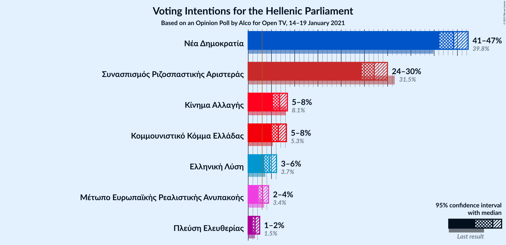

### Confidence Intervals

| Party | Last Result | Poll Result | 80% Confidence Interval | 90% Confidence Interval | 95% Confidence Interval | 99% Confidence Interval |
|:-----:|:-----------:|:-----------:|:-----------------------:|:-----------------------:|:-----------------------:|:-----------------------:|
| Νέα Δημοκρατία | 39.8% | 44.2% | 42.2–46.2% |41.6–46.8% |41.1–47.3% |40.2–48.3% |
| Συνασπισμός Ριζοσπαστικής Αριστεράς | 31.5% | 27.1% | 25.3–29.0% |24.9–29.5% |24.4–29.9% |23.6–30.8% |
| Κίνημα Αλλαγής | 8.1% | 6.7% | 5.8–7.8% |5.5–8.2% |5.3–8.4% |4.9–9.0% |
| Κομμουνιστικό Κόμμα Ελλάδας | 5.3% | 6.5% | 5.6–7.6% |5.3–7.9% |5.1–8.2% |4.7–8.8% |
| Ελληνική Λύση | 3.7% | 4.6% | 3.9–5.6% |3.6–5.9% |3.5–6.1% |3.1–6.6% |
| Μέτωπο Ευρωπαϊκής Ρεαλιστικής Ανυπακοής | 3.4% | 3.1% | 2.5–3.9% |2.3–4.2% |2.2–4.4% |1.9–4.8% |
| Πλεύση Ελευθερίας | 1.5% | 1.5% | 1.1–2.1% |1.0–2.3% |0.9–2.5% |0.7–2.8% |

*Note:* The poll result column reflects the actual value used in the calculations. Published results may vary slightly, and in addition be rounded to fewer digits.

## Seats

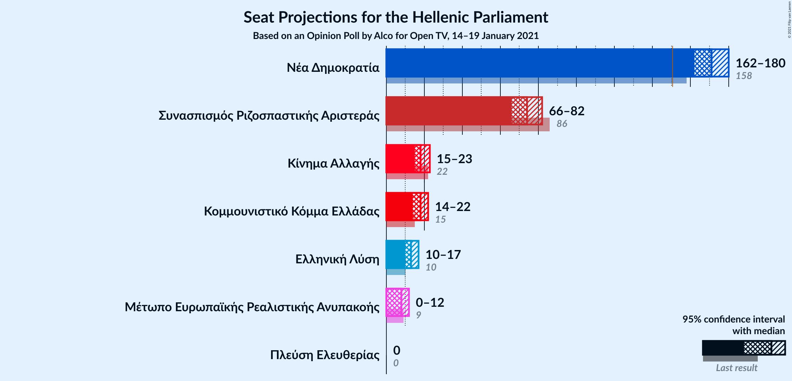

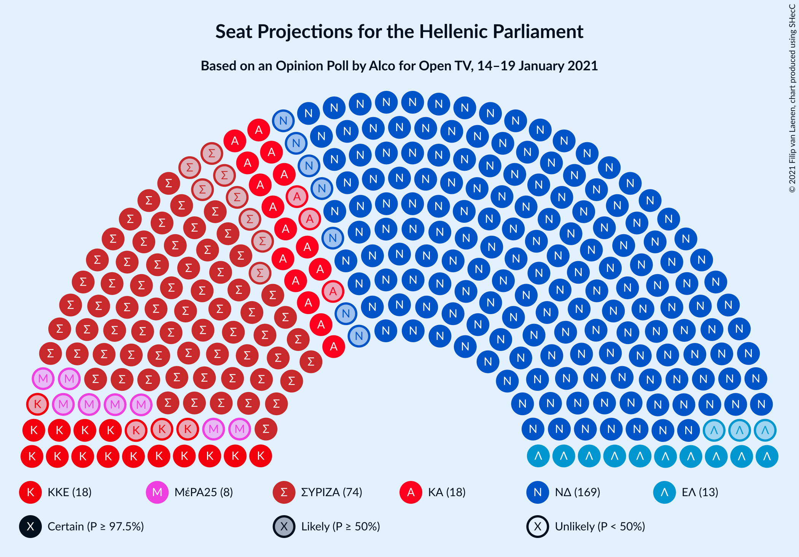

### Confidence Intervals

| Party | Last Result | Median | 80% Confidence Interval | 90% Confidence Interval | 95% Confidence Interval | 99% Confidence Interval |
|:-----:|:-----------:|:------:|:-----------------------:|:-----------------------:|:-----------------------:|:-----------------------:|
| <a href="#νέα-δημοκρατία">Νέα Δημοκρατία</a> | 158 | 171 | 165–177 |163–179 |162–180 |159–183 |
| <a href="#συνασπισμός-ριζοσπαστικής-αριστεράς">Συνασπισμός Ριζοσπαστικής Αριστεράς</a> | 86 | 74 | 69–79 |68–81 |66–82 |64–85 |
| <a href="#κίνημα-αλλαγής">Κίνημα Αλλαγής</a> | 22 | 18 | 16–21 |15–22 |15–23 |13–25 |
| <a href="#κομμουνιστικό-κόμμα-ελλάδας">Κομμουνιστικό Κόμμα Ελλάδας</a> | 15 | 18 | 15–21 |15–22 |14–22 |13–24 |
| <a href="#ελληνική-λύση">Ελληνική Λύση</a> | 10 | 13 | 10–15 |10–16 |10–17 |9–18 |
| <a href="#μέτωπο-ευρωπαϊκής-ρεαλιστικής-ανυπακοής">Μέτωπο Ευρωπαϊκής Ρεαλιστικής Ανυπακοής</a> | 9 | 8 | 0–11 |0–11 |0–12 |0–13 |
| <a href="#πλεύση-ελευθερίας">Πλεύση Ελευθερίας</a> | 0 | 0 | 0 |0 |0 |0 |

### Νέα Δημοκρατία

*For a full overview of the results for this party, see the [Νέα Δημοκρατία](party-νέαδημοκρατία.html) page.*

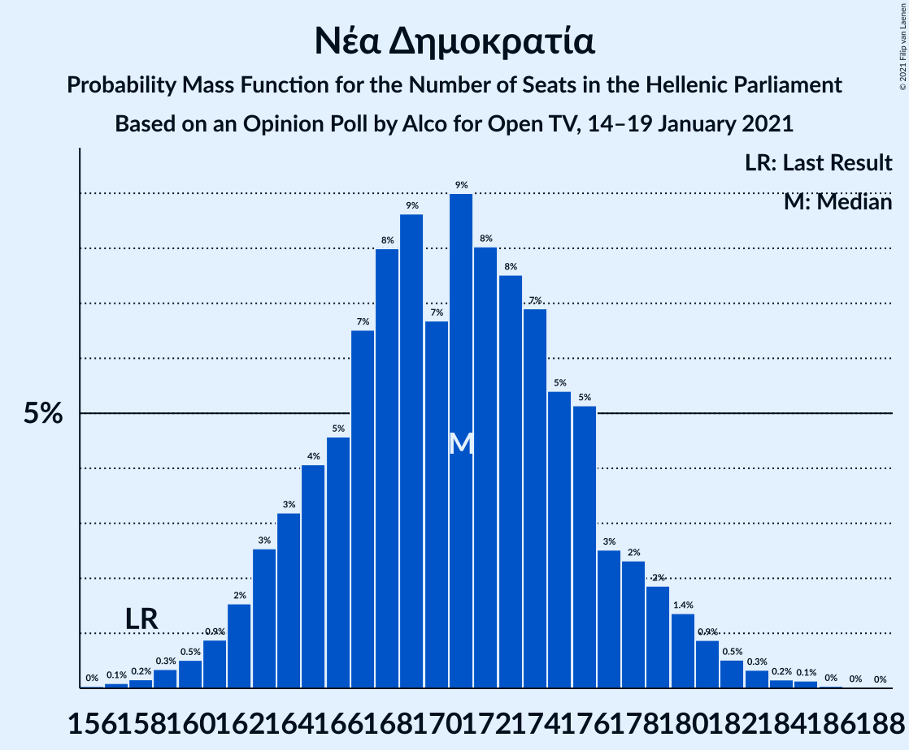

| Number of Seats | Probability | Accumulated | Special Marks |
|:---------------:|:-----------:|:-----------:|:-------------:|
| 156 | 0% | 100% |  |
| 157 | 0.1% | 99.9% |  |
| 158 | 0.2% | 99.8% | Last Result |
| 159 | 0.3% | 99.7% |  |
| 160 | 0.5% | 99.3% |  |
| 161 | 0.9% | 98.8% |  |
| 162 | 2% | 98% |  |
| 163 | 3% | 96% |  |
| 164 | 3% | 94% |  |
| 165 | 4% | 91% |  |
| 166 | 5% | 87% |  |
| 167 | 7% | 82% |  |
| 168 | 8% | 75% |  |
| 169 | 9% | 67% |  |
| 170 | 7% | 59% |  |
| 171 | 9% | 52% | Median |
| 172 | 8% | 43% |  |
| 173 | 8% | 35% |  |
| 174 | 7% | 28% |  |
| 175 | 5% | 21% |  |
| 176 | 5% | 15% |  |
| 177 | 3% | 10% |  |
| 178 | 2% | 8% |  |
| 179 | 2% | 5% |  |
| 180 | 1.4% | 3% |  |
| 181 | 0.9% | 2% |  |
| 182 | 0.5% | 1.2% |  |
| 183 | 0.3% | 0.7% |  |
| 184 | 0.2% | 0.4% |  |
| 185 | 0.1% | 0.2% |  |
| 186 | 0% | 0.1% |  |
| 187 | 0% | 0% |  |

### Συνασπισμός Ριζοσπαστικής Αριστεράς

*For a full overview of the results for this party, see the [Συνασπισμός Ριζοσπαστικής Αριστεράς](party-συνασπισμόςριζοσπαστικήςαριστεράς.html) page.*

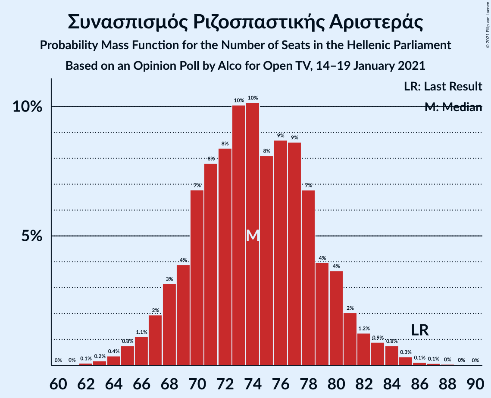

| Number of Seats | Probability | Accumulated | Special Marks |
|:---------------:|:-----------:|:-----------:|:-------------:|
| 62 | 0.1% | 100% |  |
| 63 | 0.2% | 99.9% |  |
| 64 | 0.4% | 99.7% |  |
| 65 | 0.8% | 99.3% |  |
| 66 | 1.1% | 98.6% |  |
| 67 | 2% | 97% |  |
| 68 | 3% | 96% |  |
| 69 | 4% | 92% |  |
| 70 | 7% | 89% |  |
| 71 | 8% | 82% |  |
| 72 | 8% | 74% |  |
| 73 | 10% | 66% |  |
| 74 | 10% | 55% | Median |
| 75 | 8% | 45% |  |
| 76 | 9% | 37% |  |
| 77 | 9% | 29% |  |
| 78 | 7% | 20% |  |
| 79 | 4% | 13% |  |
| 80 | 4% | 9% |  |
| 81 | 2% | 5% |  |
| 82 | 1.2% | 3% |  |
| 83 | 0.9% | 2% |  |
| 84 | 0.8% | 1.3% |  |
| 85 | 0.3% | 0.6% |  |
| 86 | 0.1% | 0.3% | Last Result |
| 87 | 0.1% | 0.1% |  |
| 88 | 0% | 0.1% |  |
| 89 | 0% | 0% |  |

### Κίνημα Αλλαγής

*For a full overview of the results for this party, see the [Κίνημα Αλλαγής](party-κίνημααλλαγής.html) page.*

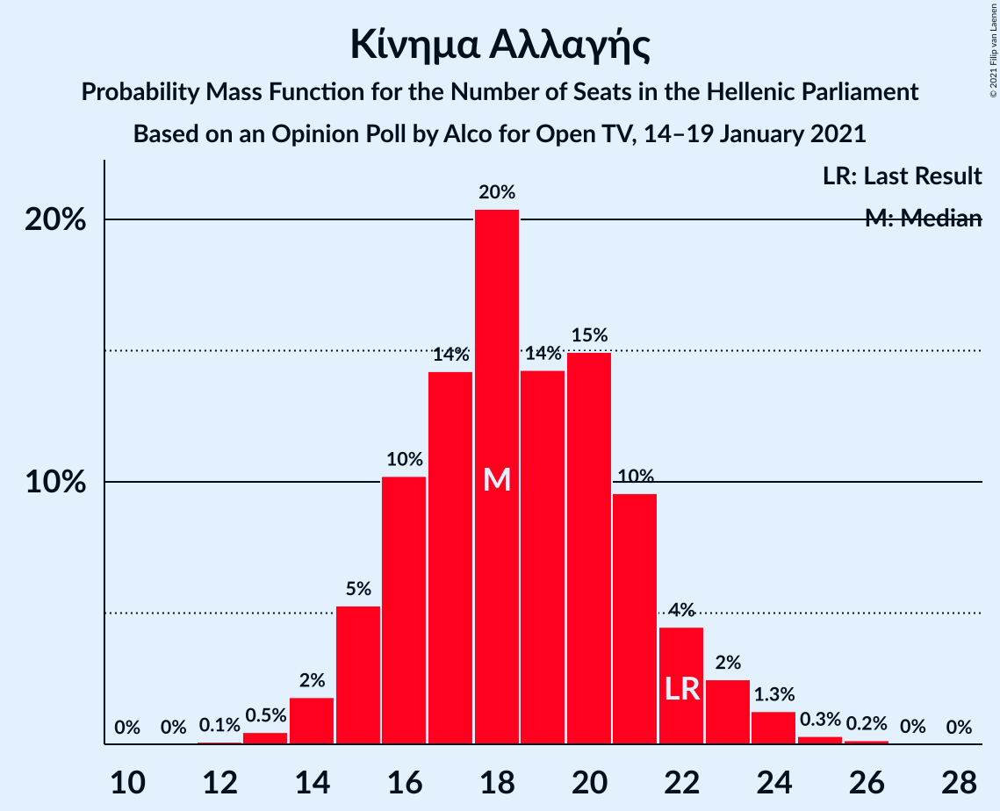

| Number of Seats | Probability | Accumulated | Special Marks |
|:---------------:|:-----------:|:-----------:|:-------------:|
| 12 | 0.1% | 100% |  |
| 13 | 0.5% | 99.9% |  |
| 14 | 2% | 99.4% |  |
| 15 | 5% | 98% |  |
| 16 | 10% | 92% |  |
| 17 | 14% | 82% |  |
| 18 | 20% | 68% | Median |
| 19 | 14% | 48% |  |
| 20 | 15% | 33% |  |
| 21 | 10% | 18% |  |
| 22 | 4% | 9% | Last Result |
| 23 | 2% | 4% |  |
| 24 | 1.3% | 2% |  |
| 25 | 0.3% | 0.5% |  |
| 26 | 0.2% | 0.2% |  |
| 27 | 0% | 0.1% |  |
| 28 | 0% | 0% |  |

### Κομμουνιστικό Κόμμα Ελλάδας

*For a full overview of the results for this party, see the [Κομμουνιστικό Κόμμα Ελλάδας](party-κομμουνιστικόκόμμαελλάδας.html) page.*

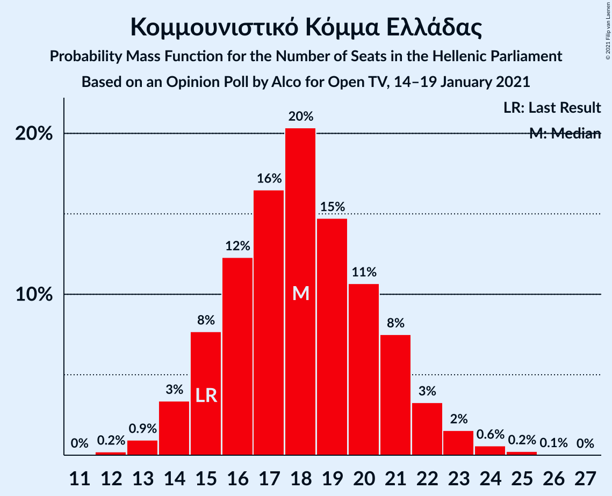

| Number of Seats | Probability | Accumulated | Special Marks |
|:---------------:|:-----------:|:-----------:|:-------------:|
| 12 | 0.2% | 100% |  |
| 13 | 0.9% | 99.8% |  |
| 14 | 3% | 98.8% |  |
| 15 | 8% | 95% | Last Result |
| 16 | 12% | 88% |  |
| 17 | 16% | 75% |  |
| 18 | 20% | 59% | Median |
| 19 | 15% | 39% |  |
| 20 | 11% | 24% |  |
| 21 | 8% | 13% |  |
| 22 | 3% | 6% |  |
| 23 | 2% | 2% |  |
| 24 | 0.6% | 0.9% |  |
| 25 | 0.2% | 0.3% |  |
| 26 | 0.1% | 0.1% |  |
| 27 | 0% | 0% |  |

### Ελληνική Λύση

*For a full overview of the results for this party, see the [Ελληνική Λύση](party-ελληνικήλύση.html) page.*

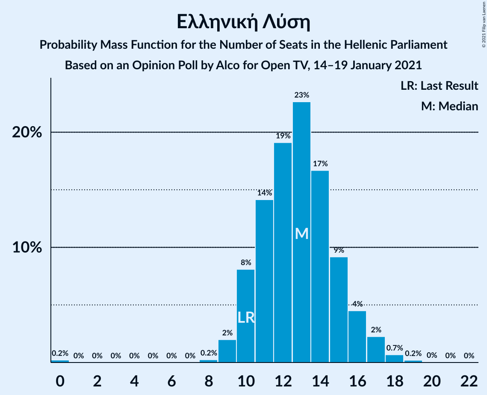

| Number of Seats | Probability | Accumulated | Special Marks |
|:---------------:|:-----------:|:-----------:|:-------------:|
| 0 | 0.2% | 100% |  |
| 1 | 0% | 99.8% |  |
| 2 | 0% | 99.8% |  |
| 3 | 0% | 99.8% |  |
| 4 | 0% | 99.8% |  |
| 5 | 0% | 99.8% |  |
| 6 | 0% | 99.8% |  |
| 7 | 0% | 99.8% |  |
| 8 | 0.2% | 99.8% |  |
| 9 | 2% | 99.5% |  |
| 10 | 8% | 98% | Last Result |
| 11 | 14% | 89% |  |
| 12 | 19% | 75% |  |
| 13 | 23% | 56% | Median |
| 14 | 17% | 34% |  |
| 15 | 9% | 17% |  |
| 16 | 4% | 8% |  |
| 17 | 2% | 3% |  |
| 18 | 0.7% | 0.9% |  |
| 19 | 0.2% | 0.3% |  |
| 20 | 0% | 0.1% |  |
| 21 | 0% | 0% |  |

### Μέτωπο Ευρωπαϊκής Ρεαλιστικής Ανυπακοής

*For a full overview of the results for this party, see the [Μέτωπο Ευρωπαϊκής Ρεαλιστικής Ανυπακοής](party-μέτωποευρωπαϊκήςρεαλιστικήςανυπακοής.html) page.*

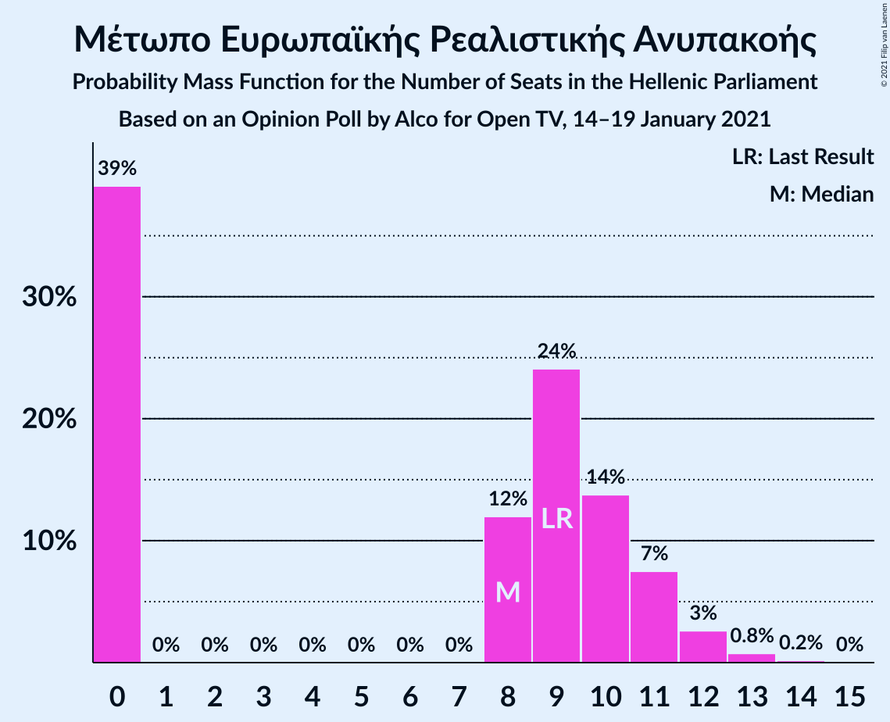

| Number of Seats | Probability | Accumulated | Special Marks |
|:---------------:|:-----------:|:-----------:|:-------------:|
| 0 | 39% | 100% |  |
| 1 | 0% | 61% |  |
| 2 | 0% | 61% |  |
| 3 | 0% | 61% |  |
| 4 | 0% | 61% |  |
| 5 | 0% | 61% |  |
| 6 | 0% | 61% |  |
| 7 | 0% | 61% |  |
| 8 | 12% | 61% | Median |
| 9 | 24% | 49% | Last Result |
| 10 | 14% | 25% |  |
| 11 | 7% | 11% |  |
| 12 | 3% | 4% |  |
| 13 | 0.8% | 1.0% |  |
| 14 | 0.2% | 0.2% |  |
| 15 | 0% | 0% |  |

### Πλεύση Ελευθερίας

*For a full overview of the results for this party, see the [Πλεύση Ελευθερίας](party-πλεύσηελευθερίας.html) page.*

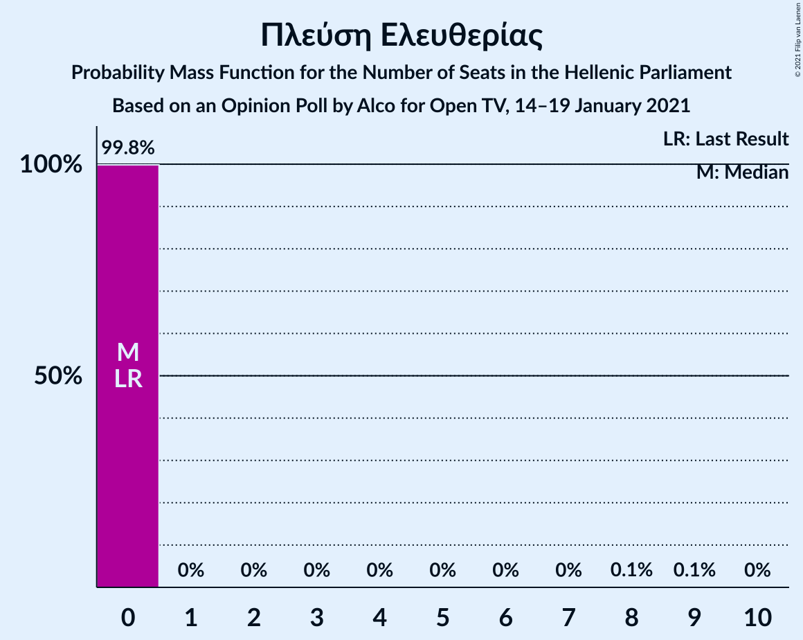

| Number of Seats | Probability | Accumulated | Special Marks |
|:---------------:|:-----------:|:-----------:|:-------------:|
| 0 | 99.8% | 100% | Last Result, Median |
| 1 | 0% | 0.2% |  |
| 2 | 0% | 0.2% |  |
| 3 | 0% | 0.2% |  |
| 4 | 0% | 0.2% |  |
| 5 | 0% | 0.2% |  |
| 6 | 0% | 0.2% |  |
| 7 | 0% | 0.2% |  |
| 8 | 0.1% | 0.2% |  |
| 9 | 0.1% | 0.1% |  |
| 10 | 0% | 0% |  |

## Coalitions

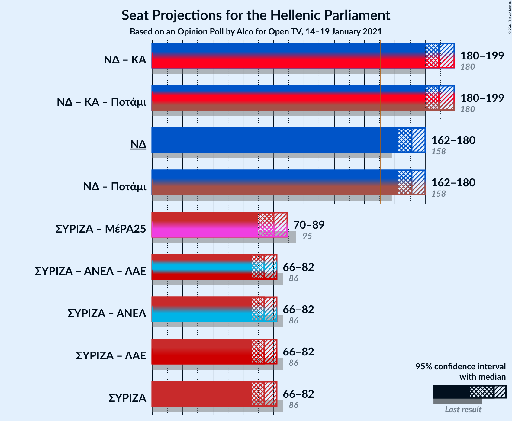

### Confidence Intervals

| Coalition | Last Result | Median | Majority? | 80% Confidence Interval | 90% Confidence Interval | 95% Confidence Interval | 99% Confidence Interval |
|:---------:|:-----------:|:------:|:---------:|:-----------------------:|:-----------------------:|:-----------------------:|:-----------------------:|
| Νέα Δημοκρατία – Κίνημα Αλλαγής | 180 | 189 | 100% | 183–195 | 181–197 | 180–199 | 177–202 |
| Νέα Δημοκρατία | 158 | 171 | 100% | 165–177 | 163–179 | 162–180 | 159–183 |
| Συνασπισμός Ριζοσπαστικής Αριστεράς – Μέτωπο Ευρωπαϊκής Ρεαλιστικής Ανυπακοής | 95 | 80 | 0% | 73–86 | 72–88 | 70–89 | 67–92 |
| Συνασπισμός Ριζοσπαστικής Αριστεράς | 86 | 74 | 0% | 69–79 | 68–81 | 66–82 | 64–85 |

### Νέα Δημοκρατία – Κίνημα Αλλαγής

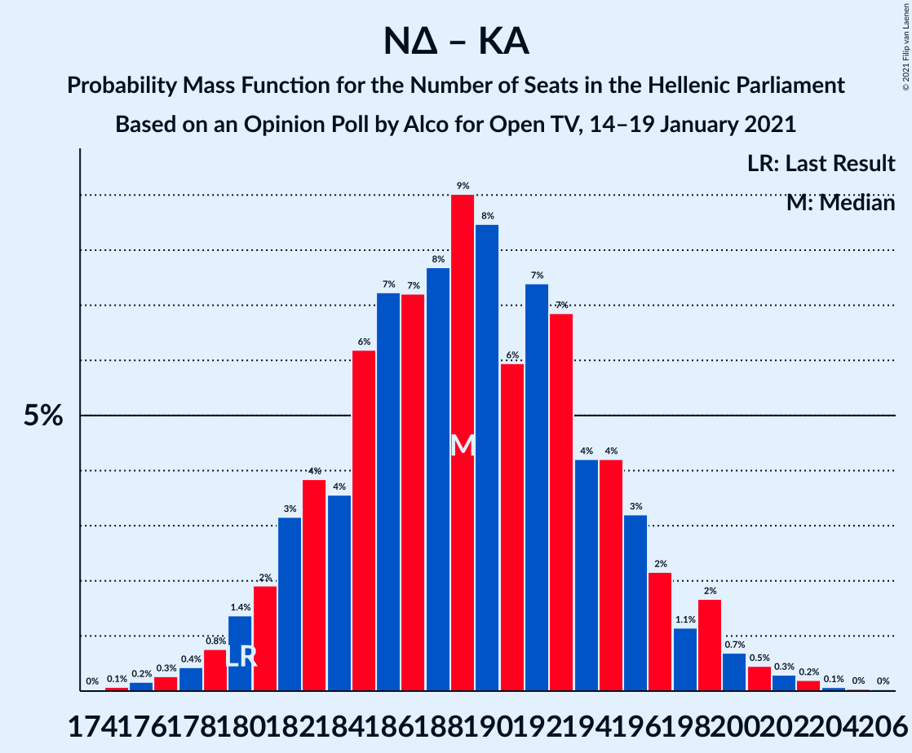

| Number of Seats | Probability | Accumulated | Special Marks |
|:---------------:|:-----------:|:-----------:|:-------------:|
| 174 | 0% | 100% |  |
| 175 | 0.1% | 99.9% |  |
| 176 | 0.2% | 99.9% |  |
| 177 | 0.3% | 99.7% |  |
| 178 | 0.4% | 99.4% |  |
| 179 | 0.8% | 99.0% |  |
| 180 | 1.4% | 98% | Last Result |
| 181 | 2% | 97% |  |
| 182 | 3% | 95% |  |
| 183 | 4% | 92% |  |
| 184 | 4% | 88% |  |
| 185 | 6% | 84% |  |
| 186 | 7% | 78% |  |
| 187 | 7% | 71% |  |
| 188 | 8% | 64% |  |
| 189 | 9% | 56% | Median |
| 190 | 8% | 47% |  |
| 191 | 6% | 39% |  |
| 192 | 7% | 33% |  |
| 193 | 7% | 25% |  |
| 194 | 4% | 18% |  |
| 195 | 4% | 14% |  |
| 196 | 3% | 10% |  |
| 197 | 2% | 7% |  |
| 198 | 1.1% | 5% |  |
| 199 | 2% | 3% |  |
| 200 | 0.7% | 2% |  |
| 201 | 0.5% | 1.1% |  |
| 202 | 0.3% | 0.6% |  |
| 203 | 0.2% | 0.4% |  |
| 204 | 0.1% | 0.2% |  |
| 205 | 0% | 0.1% |  |
| 206 | 0% | 0% |  |

### Νέα Δημοκρατία

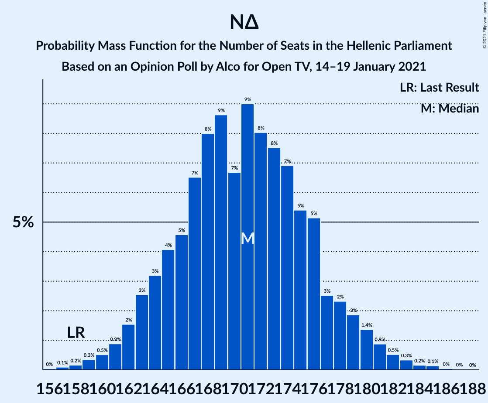

| Number of Seats | Probability | Accumulated | Special Marks |
|:---------------:|:-----------:|:-----------:|:-------------:|
| 156 | 0% | 100% |  |
| 157 | 0.1% | 99.9% |  |
| 158 | 0.2% | 99.8% | Last Result |
| 159 | 0.3% | 99.7% |  |
| 160 | 0.5% | 99.3% |  |
| 161 | 0.9% | 98.8% |  |
| 162 | 2% | 98% |  |
| 163 | 3% | 96% |  |
| 164 | 3% | 94% |  |
| 165 | 4% | 91% |  |
| 166 | 5% | 87% |  |
| 167 | 7% | 82% |  |
| 168 | 8% | 75% |  |
| 169 | 9% | 67% |  |
| 170 | 7% | 59% |  |
| 171 | 9% | 52% | Median |
| 172 | 8% | 43% |  |
| 173 | 8% | 35% |  |
| 174 | 7% | 28% |  |
| 175 | 5% | 21% |  |
| 176 | 5% | 15% |  |
| 177 | 3% | 10% |  |
| 178 | 2% | 8% |  |
| 179 | 2% | 5% |  |
| 180 | 1.4% | 3% |  |
| 181 | 0.9% | 2% |  |
| 182 | 0.5% | 1.2% |  |
| 183 | 0.3% | 0.7% |  |
| 184 | 0.2% | 0.4% |  |
| 185 | 0.1% | 0.2% |  |
| 186 | 0% | 0.1% |  |
| 187 | 0% | 0% |  |

### Συνασπισμός Ριζοσπαστικής Αριστεράς – Μέτωπο Ευρωπαϊκής Ρεαλιστικής Ανυπακοής

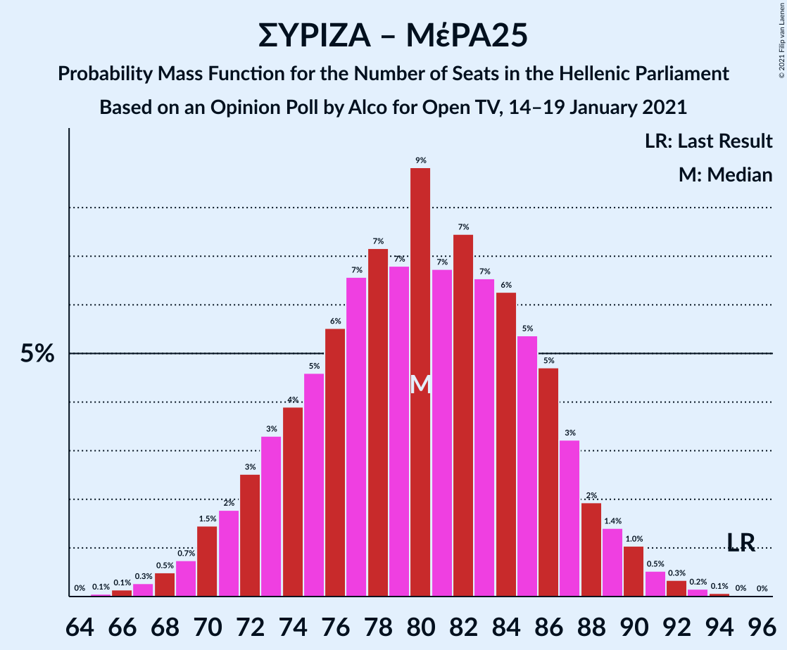

| Number of Seats | Probability | Accumulated | Special Marks |
|:---------------:|:-----------:|:-----------:|:-------------:|
| 65 | 0.1% | 100% |  |
| 66 | 0.1% | 99.9% |  |
| 67 | 0.3% | 99.8% |  |
| 68 | 0.5% | 99.5% |  |
| 69 | 0.7% | 99.0% |  |
| 70 | 1.5% | 98% |  |
| 71 | 2% | 97% |  |
| 72 | 3% | 95% |  |
| 73 | 3% | 93% |  |
| 74 | 4% | 89% |  |
| 75 | 5% | 85% |  |
| 76 | 6% | 81% |  |
| 77 | 7% | 75% |  |
| 78 | 7% | 69% |  |
| 79 | 7% | 61% |  |
| 80 | 9% | 55% |  |
| 81 | 7% | 46% |  |
| 82 | 7% | 39% | Median |
| 83 | 7% | 32% |  |
| 84 | 6% | 25% |  |
| 85 | 5% | 19% |  |
| 86 | 5% | 13% |  |
| 87 | 3% | 9% |  |
| 88 | 2% | 6% |  |
| 89 | 1.4% | 4% |  |
| 90 | 1.0% | 2% |  |
| 91 | 0.5% | 1.1% |  |
| 92 | 0.3% | 0.6% |  |
| 93 | 0.2% | 0.3% |  |
| 94 | 0.1% | 0.1% |  |
| 95 | 0% | 0.1% | Last Result |
| 96 | 0% | 0% |  |

### Συνασπισμός Ριζοσπαστικής Αριστεράς

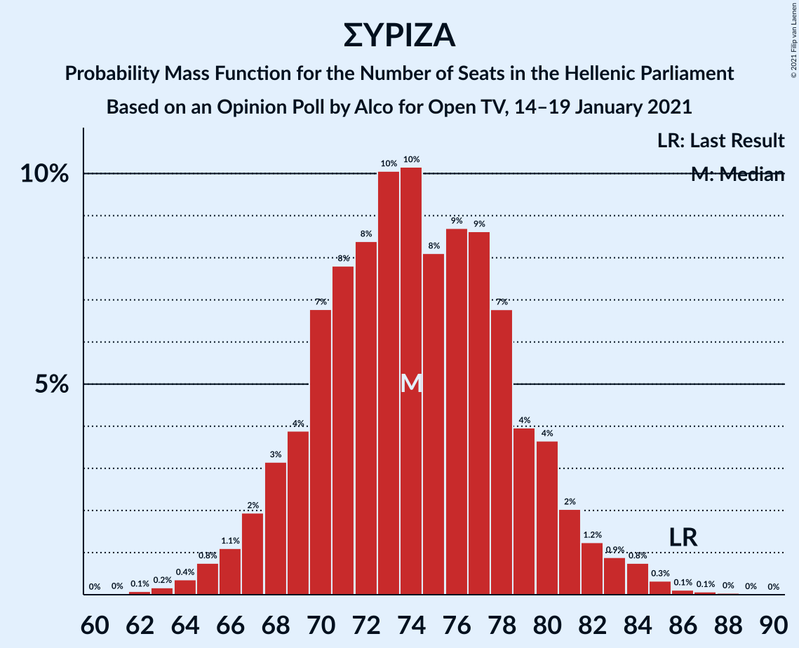

| Number of Seats | Probability | Accumulated | Special Marks |
|:---------------:|:-----------:|:-----------:|:-------------:|
| 62 | 0.1% | 100% |  |
| 63 | 0.2% | 99.9% |  |
| 64 | 0.4% | 99.7% |  |
| 65 | 0.8% | 99.3% |  |
| 66 | 1.1% | 98.6% |  |
| 67 | 2% | 97% |  |
| 68 | 3% | 96% |  |
| 69 | 4% | 92% |  |
| 70 | 7% | 89% |  |
| 71 | 8% | 82% |  |
| 72 | 8% | 74% |  |
| 73 | 10% | 66% |  |
| 74 | 10% | 55% | Median |
| 75 | 8% | 45% |  |
| 76 | 9% | 37% |  |
| 77 | 9% | 29% |  |
| 78 | 7% | 20% |  |
| 79 | 4% | 13% |  |
| 80 | 4% | 9% |  |
| 81 | 2% | 5% |  |
| 82 | 1.2% | 3% |  |
| 83 | 0.9% | 2% |  |
| 84 | 0.8% | 1.3% |  |
| 85 | 0.3% | 0.6% |  |
| 86 | 0.1% | 0.3% | Last Result |
| 87 | 0.1% | 0.1% |  |
| 88 | 0% | 0.1% |  |
| 89 | 0% | 0% |  |

## Technical Information

### Opinion Poll

+ **Polling firm:** Alco
+ **Commissioner(s):** Open TV
+ **Fieldwork period:** 14–19 January 2021

### Calculations

+ **Sample size:** 1000
+ **Simulations done:** 1,048,576
+ **Error estimate:** 1.07%

