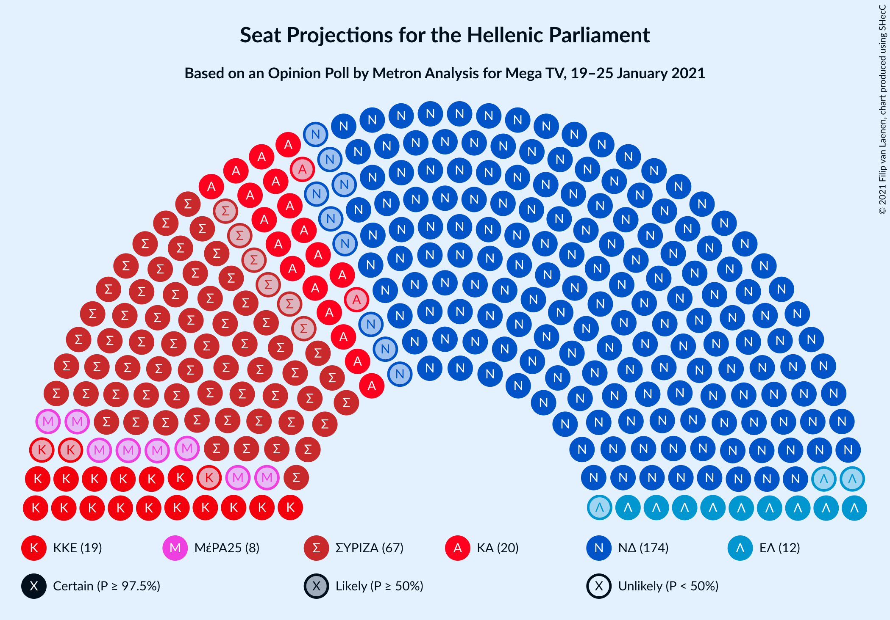
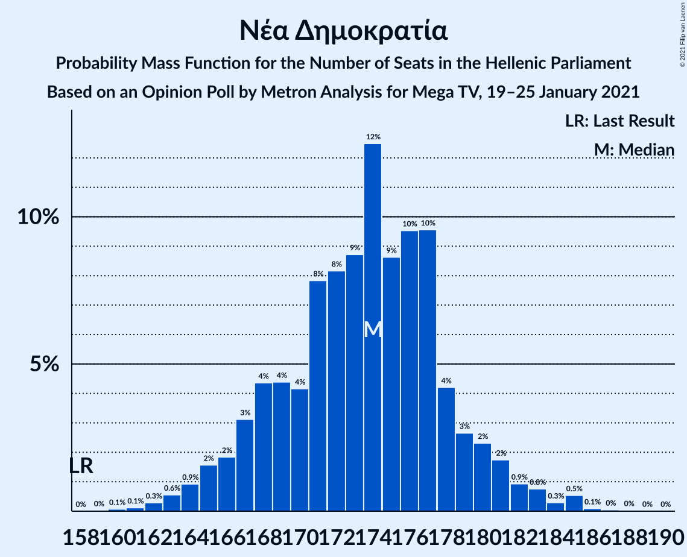
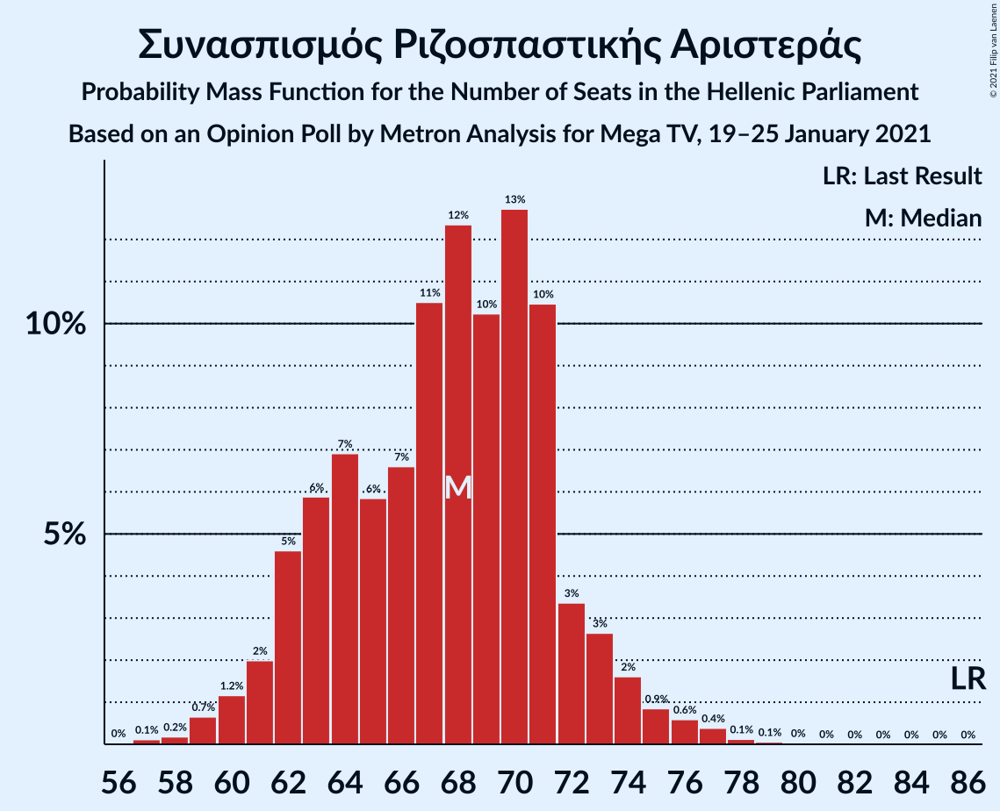
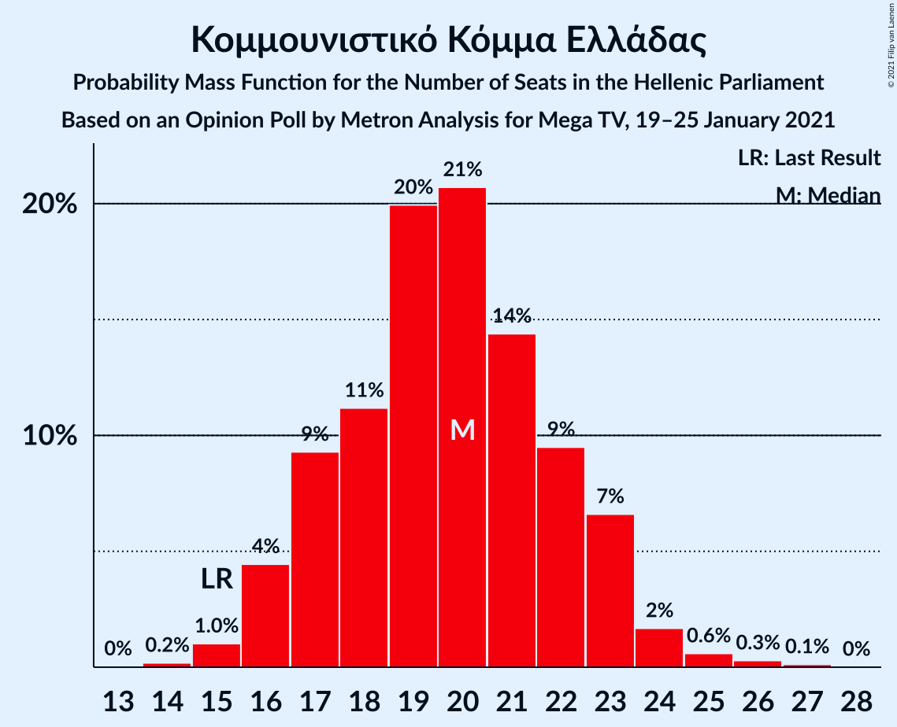

# Opinion Poll by Metron Analysis for Mega, 19–25 January 2021

<a href="#voting-intentions">Voting Intentions</a> | <a href="#seats">Seats</a> | <a href="#coalitions">Coalitions</a> | <a href="#technical-information">Technical Information</a>

## Voting Intentions

### Confidence Intervals

| Party | Last Result | Poll Result | 80% Confidence Interval | 90% Confidence Interval | 95% Confidence Interval | 99% Confidence Interval |
|:-----:|:-----------:|:-----------:|:-----------------------:|:-----------------------:|:-----------------------:|:-----------------------:|
| Νέα Δημοκρατία | 39.8% | 46.3% | 44.5–48.2% |44.0–48.7% |43.5–49.2% |42.6–50.1% |
| Συνασπισμός Ριζοσπαστικής Αριστεράς | 31.5% | 25.3% | 23.8–27.0% |23.3–27.5% |23.0–27.9% |22.2–28.7% |
| Κίνημα Αλλαγής | 8.1% | 8.2% | 7.2–9.3% |7.0–9.6% |6.7–9.9% |6.3–10.4% |
| Κομμουνιστικό Κόμμα Ελλάδας | 5.3% | 7.3% | 6.4–8.4% |6.2–8.7% |6.0–9.0% |5.6–9.5% |
| Ελληνική Λύση | 3.7% | 4.6% | 3.9–5.5% |3.7–5.7% |3.5–5.9% |3.2–6.4% |
| Μέτωπο Ευρωπαϊκής Ρεαλιστικής Ανυπακοής | 3.4% | 3.1% | 2.5–3.8% |2.4–4.0% |2.2–4.2% |2.0–4.6% |

*Note:* The poll result column reflects the actual value used in the calculations. Published results may vary slightly, and in addition be rounded to fewer digits.

## Seats

### Confidence Intervals

| Party | Last Result | Median | 80% Confidence Interval | 90% Confidence Interval | 95% Confidence Interval | 99% Confidence Interval |
|:-----:|:-----------:|:------:|:-----------------------:|:-----------------------:|:-----------------------:|:-----------------------:|
| <a href="#νέα-δημοκρατία">Νέα Δημοκρατία</a> | 158 | 173 | 168–179 |166–181 |165–182 |163–185 |
| <a href="#συνασπισμός-ριζοσπαστικής-αριστεράς">Συνασπισμός Ριζοσπαστικής Αριστεράς</a> | 86 | 67 | 63–72 |62–73 |61–75 |59–77 |
| <a href="#κίνημα-αλλαγής">Κίνημα Αλλαγής</a> | 22 | 22 | 19–25 |18–26 |18–26 |17–28 |
| <a href="#κομμουνιστικό-κόμμα-ελλάδας">Κομμουνιστικό Κόμμα Ελλάδας</a> | 15 | 20 | 17–22 |16–23 |16–24 |15–25 |
| <a href="#ελληνική-λύση">Ελληνική Λύση</a> | 10 | 12 | 10–15 |10–15 |9–16 |9–17 |
| <a href="#μέτωπο-ευρωπαϊκής-ρεαλιστικής-ανυπακοής">Μέτωπο Ευρωπαϊκής Ρεαλιστικής Ανυπακοής</a> | 9 | 8 | 0–10 |0–11 |0–11 |0–12 |

### Νέα Δημοκρατία

*For a full overview of the results for this party, see the [Νέα Δημοκρατία](party-νέαδημοκρατία.html) page.*

| Number of Seats | Probability | Accumulated | Special Marks |
|:---------------:|:-----------:|:-----------:|:-------------:|
| 158 | 0% | 100% | Last Result |
| 159 | 0% | 100% |  |
| 160 | 0.1% | 100% |  |
| 161 | 0.1% | 99.9% |  |
| 162 | 0.2% | 99.8% |  |
| 163 | 0.6% | 99.5% |  |
| 164 | 1.0% | 99.0% |  |
| 165 | 1.5% | 98% |  |
| 166 | 2% | 97% |  |
| 167 | 4% | 94% |  |
| 168 | 5% | 90% |  |
| 169 | 5% | 85% |  |
| 170 | 7% | 80% |  |
| 171 | 9% | 73% |  |
| 172 | 9% | 65% |  |
| 173 | 9% | 56% | Median |
| 174 | 9% | 47% |  |
| 175 | 9% | 38% |  |
| 176 | 7% | 30% |  |
| 177 | 7% | 23% |  |
| 178 | 5% | 16% |  |
| 179 | 4% | 11% |  |
| 180 | 2% | 8% |  |
| 181 | 2% | 5% |  |
| 182 | 1.0% | 3% |  |
| 183 | 0.7% | 2% |  |
| 184 | 0.4% | 0.9% |  |
| 185 | 0.3% | 0.5% |  |
| 186 | 0.1% | 0.2% |  |
| 187 | 0.1% | 0.1% |  |
| 188 | 0% | 0% |  |

### Συνασπισμός Ριζοσπαστικής Αριστεράς

*For a full overview of the results for this party, see the [Συνασπισμός Ριζοσπαστικής Αριστεράς](party-συνασπισμόςριζοσπαστικήςαριστεράς.html) page.*

| Number of Seats | Probability | Accumulated | Special Marks |
|:---------------:|:-----------:|:-----------:|:-------------:|
| 56 | 0% | 100% |  |
| 57 | 0.1% | 99.9% |  |
| 58 | 0.2% | 99.8% |  |
| 59 | 0.6% | 99.6% |  |
| 60 | 1.3% | 99.1% |  |
| 61 | 2% | 98% |  |
| 62 | 3% | 96% |  |
| 63 | 6% | 92% |  |
| 64 | 7% | 87% |  |
| 65 | 9% | 80% |  |
| 66 | 10% | 71% |  |
| 67 | 12% | 61% | Median |
| 68 | 11% | 49% |  |
| 69 | 10% | 38% |  |
| 70 | 8% | 28% |  |
| 71 | 7% | 20% |  |
| 72 | 5% | 13% |  |
| 73 | 3% | 7% |  |
| 74 | 2% | 4% |  |
| 75 | 1.3% | 3% |  |
| 76 | 0.7% | 1.3% |  |
| 77 | 0.3% | 0.6% |  |
| 78 | 0.1% | 0.3% |  |
| 79 | 0.1% | 0.1% |  |
| 80 | 0% | 0% |  |
| 81 | 0% | 0% |  |
| 82 | 0% | 0% |  |
| 83 | 0% | 0% |  |
| 84 | 0% | 0% |  |
| 85 | 0% | 0% |  |
| 86 | 0% | 0% | Last Result |

### Κίνημα Αλλαγής

*For a full overview of the results for this party, see the [Κίνημα Αλλαγής](party-κίνημααλλαγής.html) page.*

| Number of Seats | Probability | Accumulated | Special Marks |
|:---------------:|:-----------:|:-----------:|:-------------:|
| 15 | 0% | 100% |  |
| 16 | 0.3% | 99.9% |  |
| 17 | 1.1% | 99.7% |  |
| 18 | 4% | 98.6% |  |
| 19 | 8% | 95% |  |
| 20 | 13% | 87% |  |
| 21 | 17% | 73% |  |
| 22 | 19% | 56% | Last Result, Median |
| 23 | 16% | 37% |  |
| 24 | 10% | 22% |  |
| 25 | 6% | 11% |  |
| 26 | 3% | 5% |  |
| 27 | 1.3% | 2% |  |
| 28 | 0.5% | 0.7% |  |
| 29 | 0.1% | 0.2% |  |
| 30 | 0% | 0.1% |  |
| 31 | 0% | 0% |  |

### Κομμουνιστικό Κόμμα Ελλάδας

*For a full overview of the results for this party, see the [Κομμουνιστικό Κόμμα Ελλάδας](party-κομμουνιστικόκόμμαελλάδας.html) page.*

| Number of Seats | Probability | Accumulated | Special Marks |
|:---------------:|:-----------:|:-----------:|:-------------:|
| 14 | 0.3% | 100% |  |
| 15 | 1.2% | 99.7% | Last Result |
| 16 | 4% | 98.5% |  |
| 17 | 9% | 95% |  |
| 18 | 14% | 86% |  |
| 19 | 19% | 72% |  |
| 20 | 19% | 53% | Median |
| 21 | 14% | 33% |  |
| 22 | 11% | 19% |  |
| 23 | 5% | 9% |  |
| 24 | 2% | 4% |  |
| 25 | 0.9% | 1.3% |  |
| 26 | 0.3% | 0.4% |  |
| 27 | 0.1% | 0.1% |  |
| 28 | 0% | 0% |  |

### Ελληνική Λύση

*For a full overview of the results for this party, see the [Ελληνική Λύση](party-ελληνικήλύση.html) page.*

| Number of Seats | Probability | Accumulated | Special Marks |
|:---------------:|:-----------:|:-----------:|:-------------:|
| 0 | 0.1% | 100% |  |
| 1 | 0% | 99.9% |  |
| 2 | 0% | 99.9% |  |
| 3 | 0% | 99.9% |  |
| 4 | 0% | 99.9% |  |
| 5 | 0% | 99.9% |  |
| 6 | 0% | 99.9% |  |
| 7 | 0% | 99.9% |  |
| 8 | 0.3% | 99.9% |  |
| 9 | 2% | 99.6% |  |
| 10 | 9% | 97% | Last Result |
| 11 | 18% | 88% |  |
| 12 | 25% | 70% | Median |
| 13 | 21% | 45% |  |
| 14 | 14% | 24% |  |
| 15 | 7% | 10% |  |
| 16 | 2% | 3% |  |
| 17 | 0.7% | 1.0% |  |
| 18 | 0.2% | 0.2% |  |
| 19 | 0% | 0% |  |

### Μέτωπο Ευρωπαϊκής Ρεαλιστικής Ανυπακοής

*For a full overview of the results for this party, see the [Μέτωπο Ευρωπαϊκής Ρεαλιστικής Ανυπακοής](party-μέτωποευρωπαϊκήςρεαλιστικήςανυπακοής.html) page.*

| Number of Seats | Probability | Accumulated | Special Marks |
|:---------------:|:-----------:|:-----------:|:-------------:|
| 0 | 41% | 100% |  |
| 1 | 0% | 59% |  |
| 2 | 0% | 59% |  |
| 3 | 0% | 59% |  |
| 4 | 0% | 59% |  |
| 5 | 0% | 59% |  |
| 6 | 0% | 59% |  |
| 7 | 0% | 59% |  |
| 8 | 17% | 59% | Median |
| 9 | 24% | 42% | Last Result |
| 10 | 12% | 18% |  |
| 11 | 4% | 6% |  |
| 12 | 1.1% | 1.3% |  |
| 13 | 0.2% | 0.3% |  |
| 14 | 0% | 0% |  |

## Coalitions

### Confidence Intervals

| Coalition | Last Result | Median | Majority? | 80% Confidence Interval | 90% Confidence Interval | 95% Confidence Interval | 99% Confidence Interval |
|:---------:|:-----------:|:------:|:---------:|:-----------------------:|:-----------------------:|:-----------------------:|:-----------------------:|
| Νέα Δημοκρατία – Κίνημα Αλλαγής | 180 | 195 | 100% | 189–201 | 188–203 | 187–204 | 184–207 |
| Νέα Δημοκρατία | 158 | 173 | 100% | 168–179 | 166–181 | 165–182 | 163–185 |
| Συνασπισμός Ριζοσπαστικής Αριστεράς – Μέτωπο Ευρωπαϊκής Ρεαλιστικής Ανυπακοής | 95 | 73 | 0% | 67–79 | 65–80 | 64–81 | 61–84 |
| Συνασπισμός Ριζοσπαστικής Αριστεράς | 86 | 67 | 0% | 63–72 | 62–73 | 61–75 | 59–77 |

### Νέα Δημοκρατία – Κίνημα Αλλαγής

| Number of Seats | Probability | Accumulated | Special Marks |
|:---------------:|:-----------:|:-----------:|:-------------:|
| 180 | 0% | 100% | Last Result |
| 181 | 0% | 100% |  |
| 182 | 0.1% | 99.9% |  |
| 183 | 0.2% | 99.9% |  |
| 184 | 0.3% | 99.7% |  |
| 185 | 0.6% | 99.4% |  |
| 186 | 1.2% | 98.7% |  |
| 187 | 2% | 98% |  |
| 188 | 3% | 96% |  |
| 189 | 3% | 93% |  |
| 190 | 5% | 89% |  |
| 191 | 7% | 84% |  |
| 192 | 6% | 77% |  |
| 193 | 8% | 72% |  |
| 194 | 10% | 64% |  |
| 195 | 8% | 54% | Median |
| 196 | 8% | 46% |  |
| 197 | 9% | 38% |  |
| 198 | 6% | 29% |  |
| 199 | 6% | 23% |  |
| 200 | 5% | 17% |  |
| 201 | 4% | 12% |  |
| 202 | 3% | 8% |  |
| 203 | 2% | 5% |  |
| 204 | 2% | 3% |  |
| 205 | 0.6% | 2% |  |
| 206 | 0.6% | 1.1% |  |
| 207 | 0.3% | 0.5% |  |
| 208 | 0.1% | 0.2% |  |
| 209 | 0.1% | 0.1% |  |
| 210 | 0% | 0.1% |  |
| 211 | 0% | 0% |  |

### Νέα Δημοκρατία

| Number of Seats | Probability | Accumulated | Special Marks |
|:---------------:|:-----------:|:-----------:|:-------------:|
| 158 | 0% | 100% | Last Result |
| 159 | 0% | 100% |  |
| 160 | 0.1% | 100% |  |
| 161 | 0.1% | 99.9% |  |
| 162 | 0.2% | 99.8% |  |
| 163 | 0.6% | 99.5% |  |
| 164 | 1.0% | 99.0% |  |
| 165 | 1.5% | 98% |  |
| 166 | 2% | 97% |  |
| 167 | 4% | 94% |  |
| 168 | 5% | 90% |  |
| 169 | 5% | 85% |  |
| 170 | 7% | 80% |  |
| 171 | 9% | 73% |  |
| 172 | 9% | 65% |  |
| 173 | 9% | 56% | Median |
| 174 | 9% | 47% |  |
| 175 | 9% | 38% |  |
| 176 | 7% | 30% |  |
| 177 | 7% | 23% |  |
| 178 | 5% | 16% |  |
| 179 | 4% | 11% |  |
| 180 | 2% | 8% |  |
| 181 | 2% | 5% |  |
| 182 | 1.0% | 3% |  |
| 183 | 0.7% | 2% |  |
| 184 | 0.4% | 0.9% |  |
| 185 | 0.3% | 0.5% |  |
| 186 | 0.1% | 0.2% |  |
| 187 | 0.1% | 0.1% |  |
| 188 | 0% | 0% |  |

### Συνασπισμός Ριζοσπαστικής Αριστεράς – Μέτωπο Ευρωπαϊκής Ρεαλιστικής Ανυπακοής

| Number of Seats | Probability | Accumulated | Special Marks |
|:---------------:|:-----------:|:-----------:|:-------------:|
| 59 | 0% | 100% |  |
| 60 | 0.1% | 99.9% |  |
| 61 | 0.3% | 99.8% |  |
| 62 | 0.5% | 99.5% |  |
| 63 | 1.1% | 99.0% |  |
| 64 | 2% | 98% |  |
| 65 | 2% | 96% |  |
| 66 | 3% | 94% |  |
| 67 | 5% | 91% |  |
| 68 | 6% | 86% |  |
| 69 | 6% | 80% |  |
| 70 | 6% | 75% |  |
| 71 | 8% | 69% |  |
| 72 | 8% | 61% |  |
| 73 | 7% | 53% |  |
| 74 | 7% | 47% |  |
| 75 | 9% | 39% | Median |
| 76 | 8% | 30% |  |
| 77 | 5% | 23% |  |
| 78 | 6% | 17% |  |
| 79 | 4% | 12% |  |
| 80 | 3% | 7% |  |
| 81 | 2% | 4% |  |
| 82 | 1.2% | 2% |  |
| 83 | 0.6% | 1.2% |  |
| 84 | 0.3% | 0.5% |  |
| 85 | 0.1% | 0.3% |  |
| 86 | 0.1% | 0.1% |  |
| 87 | 0% | 0% |  |
| 88 | 0% | 0% |  |
| 89 | 0% | 0% |  |
| 90 | 0% | 0% |  |
| 91 | 0% | 0% |  |
| 92 | 0% | 0% |  |
| 93 | 0% | 0% |  |
| 94 | 0% | 0% |  |
| 95 | 0% | 0% | Last Result |

### Συνασπισμός Ριζοσπαστικής Αριστεράς

| Number of Seats | Probability | Accumulated | Special Marks |
|:---------------:|:-----------:|:-----------:|:-------------:|
| 56 | 0% | 100% |  |
| 57 | 0.1% | 99.9% |  |
| 58 | 0.2% | 99.8% |  |
| 59 | 0.6% | 99.6% |  |
| 60 | 1.3% | 99.1% |  |
| 61 | 2% | 98% |  |
| 62 | 3% | 96% |  |
| 63 | 6% | 92% |  |
| 64 | 7% | 87% |  |
| 65 | 9% | 80% |  |
| 66 | 10% | 71% |  |
| 67 | 12% | 61% | Median |
| 68 | 11% | 49% |  |
| 69 | 10% | 38% |  |
| 70 | 8% | 28% |  |
| 71 | 7% | 20% |  |
| 72 | 5% | 13% |  |
| 73 | 3% | 7% |  |
| 74 | 2% | 4% |  |
| 75 | 1.3% | 3% |  |
| 76 | 0.7% | 1.3% |  |
| 77 | 0.3% | 0.6% |  |
| 78 | 0.1% | 0.3% |  |
| 79 | 0.1% | 0.1% |  |
| 80 | 0% | 0% |  |
| 81 | 0% | 0% |  |
| 82 | 0% | 0% |  |
| 83 | 0% | 0% |  |
| 84 | 0% | 0% |  |
| 85 | 0% | 0% |  |
| 86 | 0% | 0% | Last Result |

## Technical Information

### Opinion Poll

+ **Polling firm:** Metron Analysis
+ **Commissioner(s):** Mega
+ **Fieldwork period:** 19–25 January 2021

### Calculations

+ **Sample size:** 1200
+ **Simulations done:** 1,048,576
+ **Error estimate:** 0.40%

