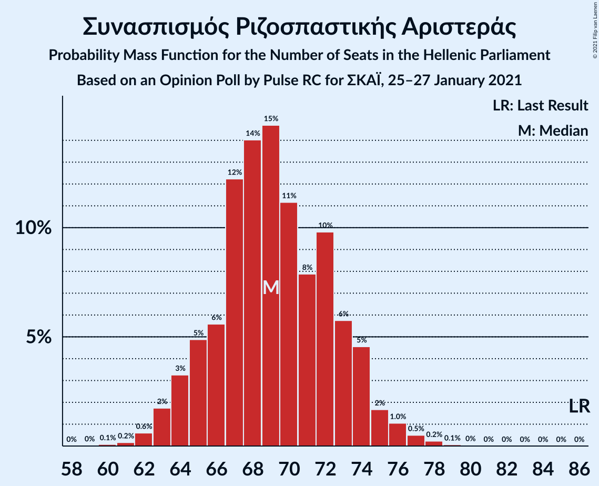
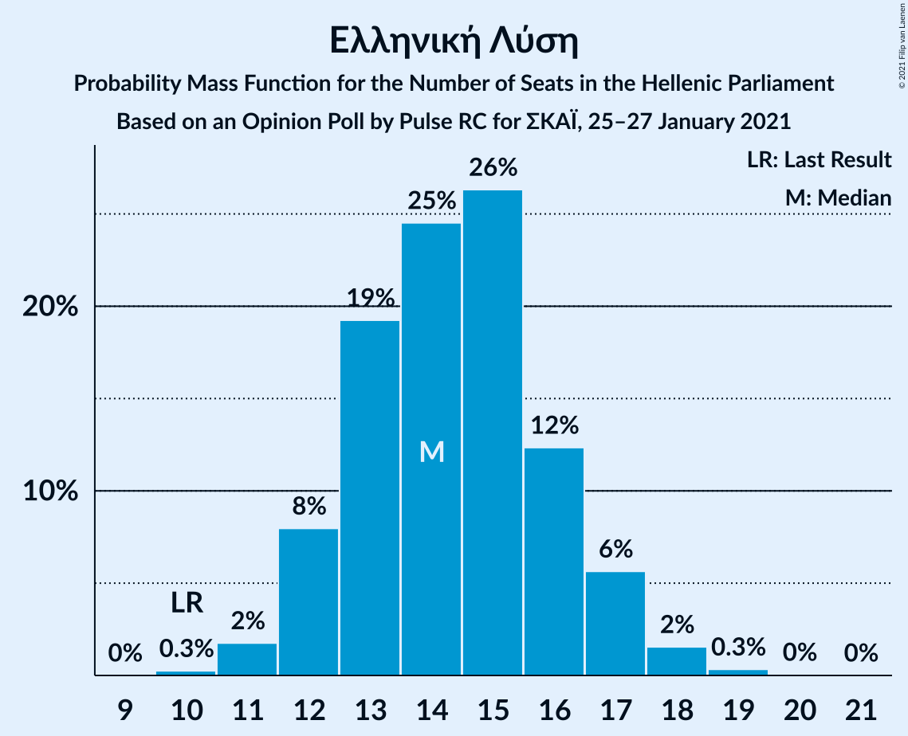
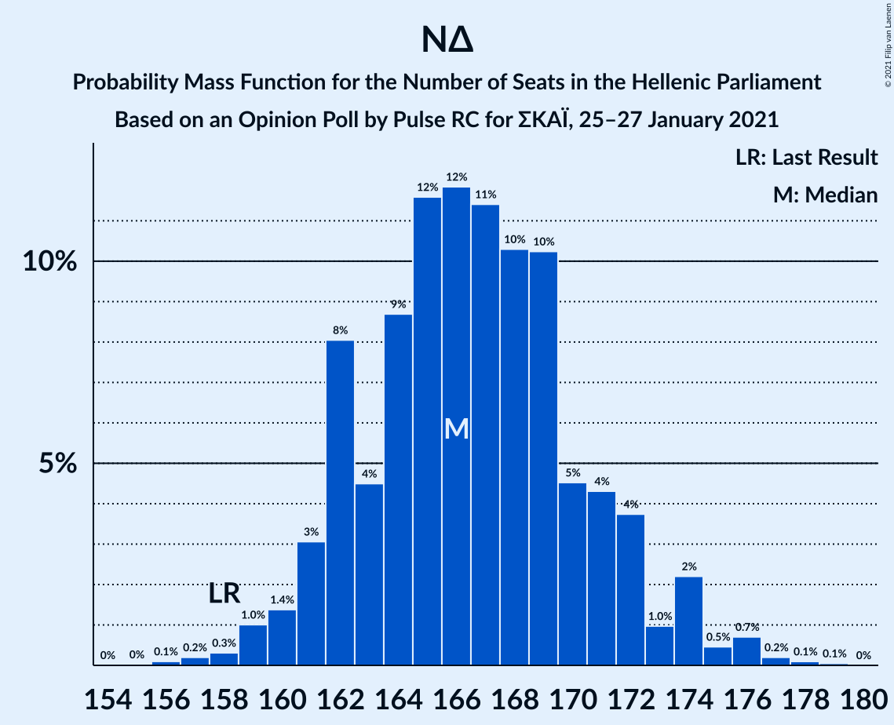
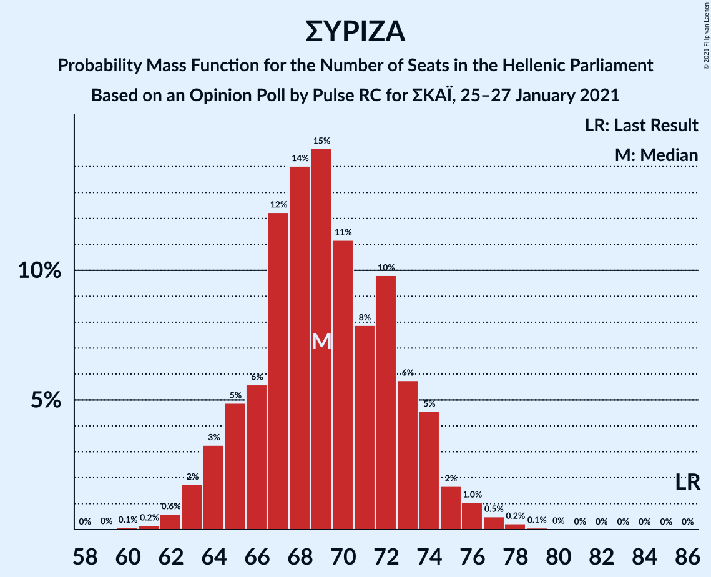

# Opinion Poll by Pulse RC for ΣΚΑΪ, 25–27 January 2021

<a href="#voting-intentions">Voting Intentions</a> | <a href="#seats">Seats</a> | <a href="#coalitions">Coalitions</a> | <a href="#technical-information">Technical Information</a>

## Voting Intentions

### Confidence Intervals

| Party | Last Result | Poll Result | 80% Confidence Interval | 90% Confidence Interval | 95% Confidence Interval | 99% Confidence Interval |
|:-----:|:-----------:|:-----------:|:-----------------------:|:-----------------------:|:-----------------------:|:-----------------------:|
| Νέα Δημοκρατία | 39.8% | 43.0% | 41.5–44.6% |41.1–45.0% |40.7–45.4% |40.0–46.1% |
| Συνασπισμός Ριζοσπαστικής Αριστεράς | 31.5% | 25.5% | 24.2–26.9% |23.8–27.3% |23.5–27.6% |22.9–28.3% |
| Κίνημα Αλλαγής | 8.1% | 8.0% | 7.2–8.9% |7.0–9.1% |6.8–9.4% |6.4–9.8% |
| Κομμουνιστικό Κόμμα Ελλάδας | 5.3% | 7.0% | 6.2–7.8% |6.0–8.1% |5.9–8.3% |5.5–8.7% |
| Ελληνική Λύση | 3.7% | 5.0% | 4.4–5.7% |4.2–5.9% |4.0–6.1% |3.8–6.5% |
| Μέτωπο Ευρωπαϊκής Ρεαλιστικής Ανυπακοής | 3.4% | 3.5% | 3.0–4.2% |2.9–4.3% |2.7–4.5% |2.5–4.8% |

*Note:* The poll result column reflects the actual value used in the calculations. Published results may vary slightly, and in addition be rounded to fewer digits.

## Seats

### Confidence Intervals

| Party | Last Result | Median | 80% Confidence Interval | 90% Confidence Interval | 95% Confidence Interval | 99% Confidence Interval |
|:-----:|:-----------:|:------:|:-----------------------:|:-----------------------:|:-----------------------:|:-----------------------:|
| <a href="#νέα-δημοκρατία">Νέα Δημοκρατία</a> | 158 | 167 | 163–171 |162–173 |160–174 |159–177 |
| <a href="#συνασπισμός-ριζοσπαστικής-αριστεράς">Συνασπισμός Ριζοσπαστικής Αριστεράς</a> | 86 | 69 | 65–73 |65–75 |65–75 |62–78 |
| <a href="#κίνημα-αλλαγής">Κίνημα Αλλαγής</a> | 22 | 22 | 20–24 |19–25 |18–26 |17–27 |
| <a href="#κομμουνιστικό-κόμμα-ελλάδας">Κομμουνιστικό Κόμμα Ελλάδας</a> | 15 | 20 | 17–21 |16–22 |16–22 |15–24 |
| <a href="#ελληνική-λύση">Ελληνική Λύση</a> | 10 | 14 | 12–16 |11–16 |11–17 |10–18 |
| <a href="#μέτωπο-ευρωπαϊκής-ρεαλιστικής-ανυπακοής">Μέτωπο Ευρωπαϊκής Ρεαλιστικής Ανυπακοής</a> | 9 | 10 | 8–11 |0–12 |0–12 |0–13 |

### Νέα Δημοκρατία

*For a full overview of the results for this party, see the [Νέα Δημοκρατία](party-νέαδημοκρατία.html) page.*

| Number of Seats | Probability | Accumulated | Special Marks |
|:---------------:|:-----------:|:-----------:|:-------------:|
| 156 | 0% | 100% |  |
| 157 | 0.1% | 99.9% |  |
| 158 | 0.4% | 99.9% | Last Result |
| 159 | 0.4% | 99.5% |  |
| 160 | 2% | 99.1% |  |
| 161 | 2% | 97% |  |
| 162 | 5% | 96% |  |
| 163 | 4% | 91% |  |
| 164 | 10% | 87% |  |
| 165 | 9% | 77% |  |
| 166 | 14% | 67% |  |
| 167 | 9% | 53% | Median |
| 168 | 13% | 44% |  |
| 169 | 8% | 31% |  |
| 170 | 7% | 23% |  |
| 171 | 7% | 16% |  |
| 172 | 3% | 9% |  |
| 173 | 2% | 6% |  |
| 174 | 2% | 4% |  |
| 175 | 0.6% | 2% |  |
| 176 | 0.5% | 1.2% |  |
| 177 | 0.5% | 0.8% |  |
| 178 | 0.1% | 0.3% |  |
| 179 | 0.1% | 0.1% |  |
| 180 | 0.1% | 0.1% |  |
| 181 | 0% | 0% |  |

### Συνασπισμός Ριζοσπαστικής Αριστεράς

*For a full overview of the results for this party, see the [Συνασπισμός Ριζοσπαστικής Αριστεράς](party-συνασπισμόςριζοσπαστικήςαριστεράς.html) page.*

| Number of Seats | Probability | Accumulated | Special Marks |
|:---------------:|:-----------:|:-----------:|:-------------:|
| 60 | 0.1% | 100% |  |
| 61 | 0.1% | 99.9% |  |
| 62 | 0.5% | 99.8% |  |
| 63 | 0.6% | 99.3% |  |
| 64 | 1.0% | 98.8% |  |
| 65 | 9% | 98% |  |
| 66 | 3% | 89% |  |
| 67 | 18% | 86% |  |
| 68 | 16% | 67% |  |
| 69 | 7% | 52% | Median |
| 70 | 20% | 45% |  |
| 71 | 7% | 25% |  |
| 72 | 5% | 18% |  |
| 73 | 5% | 13% |  |
| 74 | 2% | 8% |  |
| 75 | 3% | 5% |  |
| 76 | 0.9% | 2% |  |
| 77 | 0.8% | 1.4% |  |
| 78 | 0.4% | 0.6% |  |
| 79 | 0.1% | 0.2% |  |
| 80 | 0.1% | 0.1% |  |
| 81 | 0% | 0% |  |
| 82 | 0% | 0% |  |
| 83 | 0% | 0% |  |
| 84 | 0% | 0% |  |
| 85 | 0% | 0% |  |
| 86 | 0% | 0% | Last Result |

### Κίνημα Αλλαγής

*For a full overview of the results for this party, see the [Κίνημα Αλλαγής](party-κίνημααλλαγής.html) page.*

| Number of Seats | Probability | Accumulated | Special Marks |
|:---------------:|:-----------:|:-----------:|:-------------:|
| 16 | 0.1% | 100% |  |
| 17 | 0.5% | 99.9% |  |
| 18 | 2% | 99.4% |  |
| 19 | 7% | 97% |  |
| 20 | 13% | 90% |  |
| 21 | 21% | 77% |  |
| 22 | 23% | 56% | Last Result, Median |
| 23 | 16% | 33% |  |
| 24 | 9% | 17% |  |
| 25 | 5% | 8% |  |
| 26 | 2% | 3% |  |
| 27 | 0.5% | 0.7% |  |
| 28 | 0.1% | 0.2% |  |
| 29 | 0% | 0% |  |

### Κομμουνιστικό Κόμμα Ελλάδας

*For a full overview of the results for this party, see the [Κομμουνιστικό Κόμμα Ελλάδας](party-κομμουνιστικόκόμμαελλάδας.html) page.*

| Number of Seats | Probability | Accumulated | Special Marks |
|:---------------:|:-----------:|:-----------:|:-------------:|
| 14 | 0.2% | 100% |  |
| 15 | 1.4% | 99.8% | Last Result |
| 16 | 4% | 98% |  |
| 17 | 5% | 94% |  |
| 18 | 12% | 89% |  |
| 19 | 26% | 76% |  |
| 20 | 29% | 50% | Median |
| 21 | 14% | 22% |  |
| 22 | 6% | 8% |  |
| 23 | 1.1% | 2% |  |
| 24 | 0.7% | 1.0% |  |
| 25 | 0.2% | 0.2% |  |
| 26 | 0% | 0% |  |

### Ελληνική Λύση

*For a full overview of the results for this party, see the [Ελληνική Λύση](party-ελληνικήλύση.html) page.*

| Number of Seats | Probability | Accumulated | Special Marks |
|:---------------:|:-----------:|:-----------:|:-------------:|
| 9 | 0.1% | 100% |  |
| 10 | 0.9% | 99.9% | Last Result |
| 11 | 6% | 99.0% |  |
| 12 | 16% | 93% |  |
| 13 | 24% | 76% |  |
| 14 | 21% | 52% | Median |
| 15 | 21% | 32% |  |
| 16 | 7% | 11% |  |
| 17 | 3% | 4% |  |
| 18 | 0.7% | 0.9% |  |
| 19 | 0.2% | 0.2% |  |
| 20 | 0% | 0% |  |

### Μέτωπο Ευρωπαϊκής Ρεαλιστικής Ανυπακοής

*For a full overview of the results for this party, see the [Μέτωπο Ευρωπαϊκής Ρεαλιστικής Ανυπακοής](party-μέτωποευρωπαϊκήςρεαλιστικήςανυπακοής.html) page.*

| Number of Seats | Probability | Accumulated | Special Marks |
|:---------------:|:-----------:|:-----------:|:-------------:|
| 0 | 10% | 100% |  |
| 1 | 0% | 90% |  |
| 2 | 0% | 90% |  |
| 3 | 0% | 90% |  |
| 4 | 0% | 90% |  |
| 5 | 0% | 90% |  |
| 6 | 0% | 90% |  |
| 7 | 0% | 90% |  |
| 8 | 7% | 90% |  |
| 9 | 25% | 84% | Last Result |
| 10 | 34% | 58% | Median |
| 11 | 16% | 25% |  |
| 12 | 7% | 8% |  |
| 13 | 1.4% | 2% |  |
| 14 | 0.2% | 0.2% |  |
| 15 | 0% | 0% |  |

## Coalitions

### Confidence Intervals

| Coalition | Last Result | Median | Majority? | 80% Confidence Interval | 90% Confidence Interval | 95% Confidence Interval | 99% Confidence Interval |
|:---------:|:-----------:|:------:|:---------:|:-----------------------:|:-----------------------:|:-----------------------:|:-----------------------:|
| Νέα Δημοκρατία – Κίνημα Αλλαγής | 180 | 188 | 100% | 184–193 | 183–194 | 182–197 | 181–199 |
| Νέα Δημοκρατία | 158 | 167 | 100% | 163–171 | 162–173 | 160–174 | 159–177 |
| Συνασπισμός Ριζοσπαστικής Αριστεράς – Μέτωπο Ευρωπαϊκής Ρεαλιστικής Ανυπακοής | 95 | 78 | 0% | 74–82 | 71–84 | 69–85 | 67–87 |
| Συνασπισμός Ριζοσπαστικής Αριστεράς | 86 | 69 | 0% | 65–73 | 65–75 | 65–75 | 62–78 |

### Νέα Δημοκρατία – Κίνημα Αλλαγής

| Number of Seats | Probability | Accumulated | Special Marks |
|:---------------:|:-----------:|:-----------:|:-------------:|
| 178 | 0.1% | 100% |  |
| 179 | 0.1% | 99.9% |  |
| 180 | 0.1% | 99.8% | Last Result |
| 181 | 0.6% | 99.8% |  |
| 182 | 3% | 99.2% |  |
| 183 | 5% | 96% |  |
| 184 | 3% | 92% |  |
| 185 | 0.9% | 88% |  |
| 186 | 2% | 87% |  |
| 187 | 22% | 85% |  |
| 188 | 19% | 63% |  |
| 189 | 12% | 44% | Median |
| 190 | 2% | 32% |  |
| 191 | 1.4% | 29% |  |
| 192 | 9% | 28% |  |
| 193 | 10% | 19% |  |
| 194 | 5% | 9% |  |
| 195 | 1.4% | 5% |  |
| 196 | 0.1% | 3% |  |
| 197 | 1.3% | 3% |  |
| 198 | 1.0% | 2% |  |
| 199 | 0.7% | 0.9% |  |
| 200 | 0.1% | 0.2% |  |
| 201 | 0% | 0.1% |  |
| 202 | 0% | 0.1% |  |
| 203 | 0% | 0% |  |

### Νέα Δημοκρατία

| Number of Seats | Probability | Accumulated | Special Marks |
|:---------------:|:-----------:|:-----------:|:-------------:|
| 156 | 0% | 100% |  |
| 157 | 0.1% | 99.9% |  |
| 158 | 0.4% | 99.9% | Last Result |
| 159 | 0.4% | 99.5% |  |
| 160 | 2% | 99.1% |  |
| 161 | 2% | 97% |  |
| 162 | 5% | 96% |  |
| 163 | 4% | 91% |  |
| 164 | 10% | 87% |  |
| 165 | 9% | 77% |  |
| 166 | 14% | 67% |  |
| 167 | 9% | 53% | Median |
| 168 | 13% | 44% |  |
| 169 | 8% | 31% |  |
| 170 | 7% | 23% |  |
| 171 | 7% | 16% |  |
| 172 | 3% | 9% |  |
| 173 | 2% | 6% |  |
| 174 | 2% | 4% |  |
| 175 | 0.6% | 2% |  |
| 176 | 0.5% | 1.2% |  |
| 177 | 0.5% | 0.8% |  |
| 178 | 0.1% | 0.3% |  |
| 179 | 0.1% | 0.1% |  |
| 180 | 0.1% | 0.1% |  |
| 181 | 0% | 0% |  |

### Συνασπισμός Ριζοσπαστικής Αριστεράς – Μέτωπο Ευρωπαϊκής Ρεαλιστικής Ανυπακοής

| Number of Seats | Probability | Accumulated | Special Marks |
|:---------------:|:-----------:|:-----------:|:-------------:|
| 65 | 0% | 100% |  |
| 66 | 0.3% | 99.9% |  |
| 67 | 0.3% | 99.6% |  |
| 68 | 1.1% | 99.3% |  |
| 69 | 1.2% | 98% |  |
| 70 | 0.2% | 97% |  |
| 71 | 2% | 97% |  |
| 72 | 2% | 95% |  |
| 73 | 1.4% | 93% |  |
| 74 | 3% | 91% |  |
| 75 | 6% | 88% |  |
| 76 | 12% | 82% |  |
| 77 | 11% | 69% |  |
| 78 | 10% | 58% |  |
| 79 | 12% | 48% | Median |
| 80 | 15% | 36% |  |
| 81 | 7% | 21% |  |
| 82 | 6% | 15% |  |
| 83 | 3% | 9% |  |
| 84 | 4% | 6% |  |
| 85 | 1.4% | 3% |  |
| 86 | 0.5% | 1.1% |  |
| 87 | 0.4% | 0.7% |  |
| 88 | 0.2% | 0.3% |  |
| 89 | 0.1% | 0.1% |  |
| 90 | 0% | 0% |  |
| 91 | 0% | 0% |  |
| 92 | 0% | 0% |  |
| 93 | 0% | 0% |  |
| 94 | 0% | 0% |  |
| 95 | 0% | 0% | Last Result |

### Συνασπισμός Ριζοσπαστικής Αριστεράς

| Number of Seats | Probability | Accumulated | Special Marks |
|:---------------:|:-----------:|:-----------:|:-------------:|
| 60 | 0.1% | 100% |  |
| 61 | 0.1% | 99.9% |  |
| 62 | 0.5% | 99.8% |  |
| 63 | 0.6% | 99.3% |  |
| 64 | 1.0% | 98.8% |  |
| 65 | 9% | 98% |  |
| 66 | 3% | 89% |  |
| 67 | 18% | 86% |  |
| 68 | 16% | 67% |  |
| 69 | 7% | 52% | Median |
| 70 | 20% | 45% |  |
| 71 | 7% | 25% |  |
| 72 | 5% | 18% |  |
| 73 | 5% | 13% |  |
| 74 | 2% | 8% |  |
| 75 | 3% | 5% |  |
| 76 | 0.9% | 2% |  |
| 77 | 0.8% | 1.4% |  |
| 78 | 0.4% | 0.6% |  |
| 79 | 0.1% | 0.2% |  |
| 80 | 0.1% | 0.1% |  |
| 81 | 0% | 0% |  |
| 82 | 0% | 0% |  |
| 83 | 0% | 0% |  |
| 84 | 0% | 0% |  |
| 85 | 0% | 0% |  |
| 86 | 0% | 0% | Last Result |

## Technical Information

### Opinion Poll

+ **Polling firm:** Pulse RC
+ **Commissioner(s):** ΣΚΑΪ
+ **Fieldwork period:** 25–27 January 2021

### Calculations

+ **Sample size:** 1706
+ **Simulations done:** 131,072
+ **Error estimate:** 0.99%

