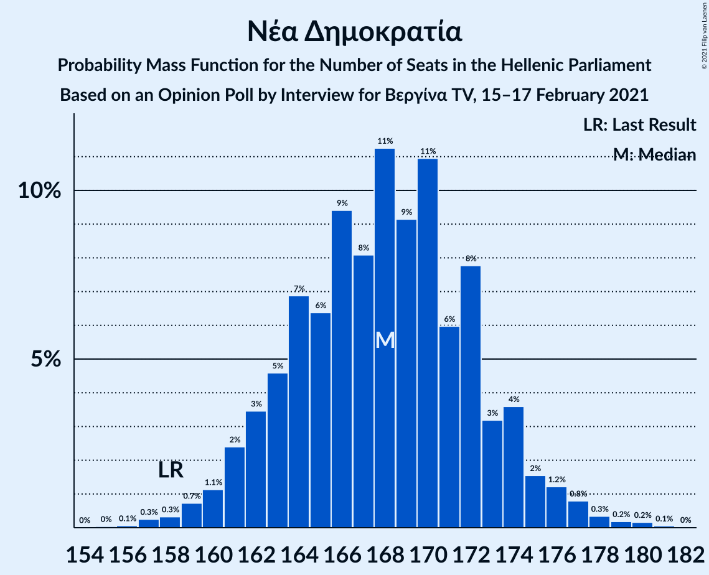
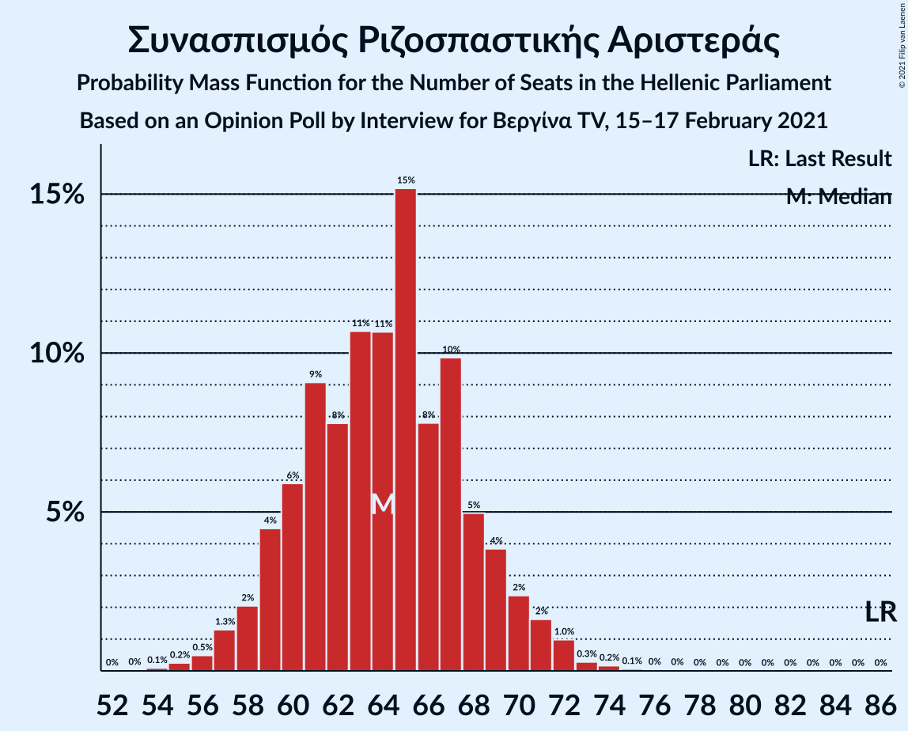
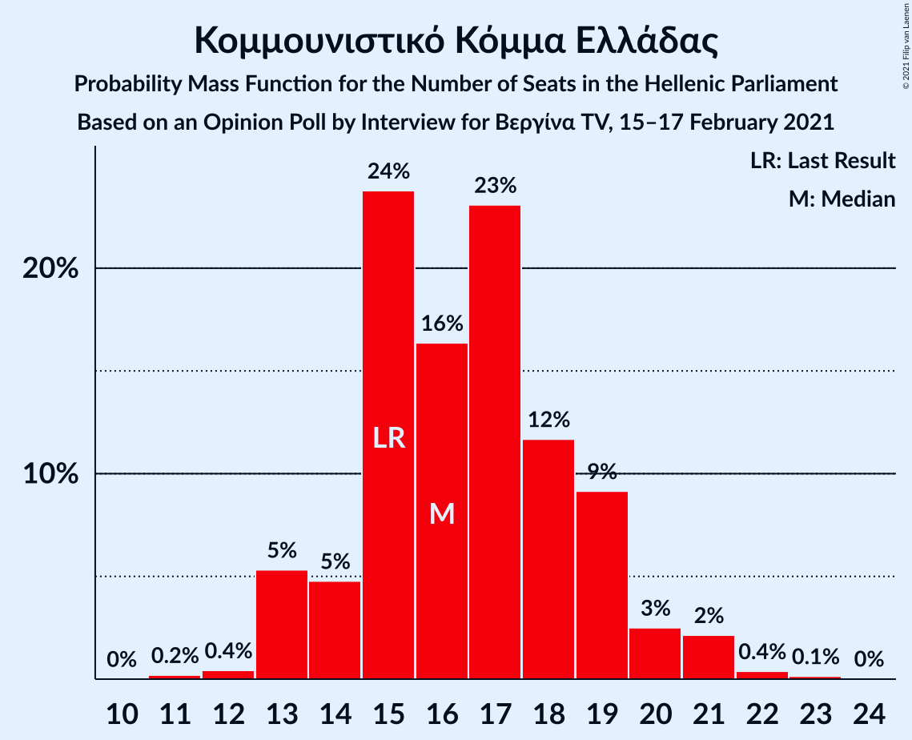
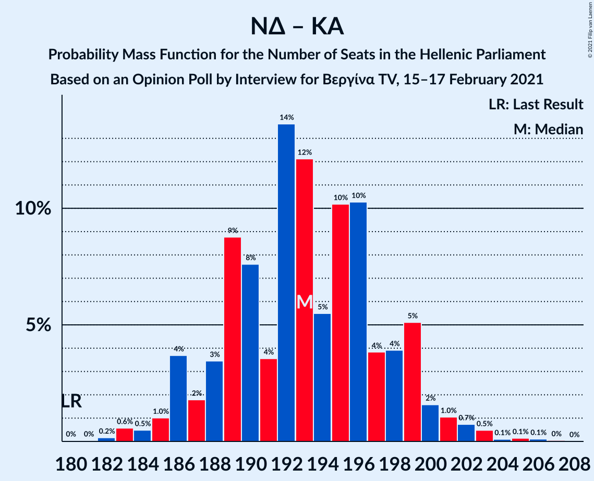
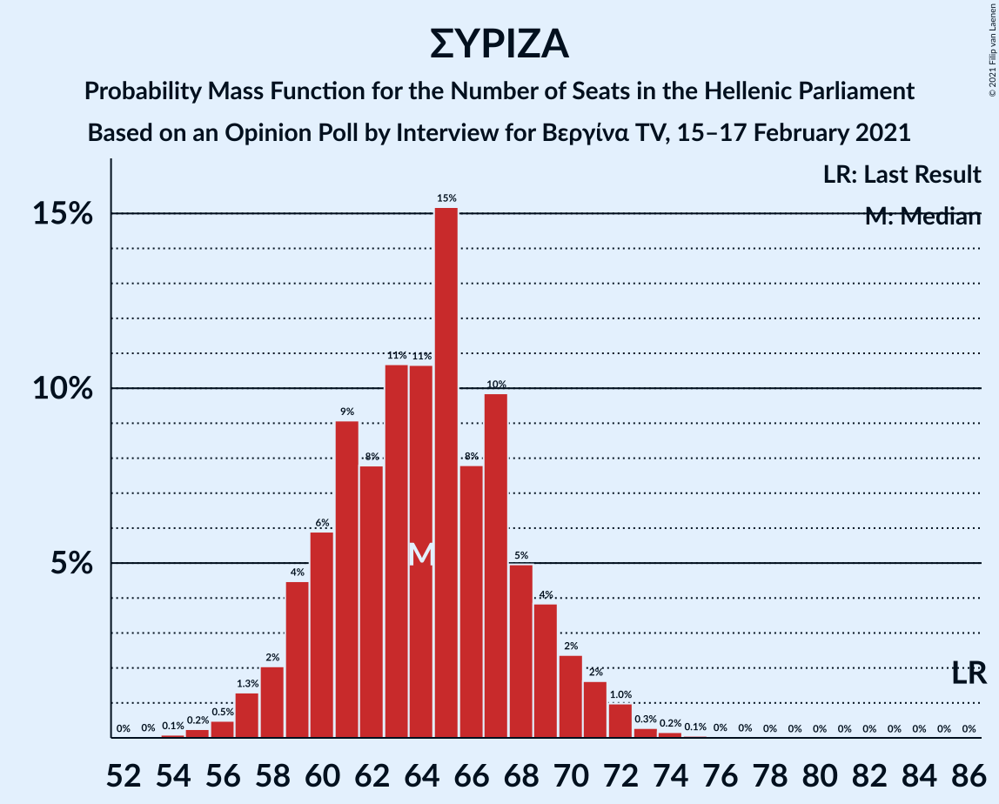

# Opinion Poll by Interview for Βεργίνα TV, 15–17 February 2021

<a href="#voting-intentions">Voting Intentions</a> | <a href="#seats">Seats</a> | <a href="#coalitions">Coalitions</a> | <a href="#technical-information">Technical Information</a>

## Voting Intentions

### Confidence Intervals

| Party | Last Result | Poll Result | 80% Confidence Interval | 90% Confidence Interval | 95% Confidence Interval | 99% Confidence Interval |
|:-----:|:-----------:|:-----------:|:-----------------------:|:-----------------------:|:-----------------------:|:-----------------------:|
| Νέα Δημοκρατία | 39.8% | 43.2% | 41.2–45.2% |40.6–45.8% |40.2–46.3% |39.2–47.3% |
| Συνασπισμός Ριζοσπαστικής Αριστεράς | 31.5% | 23.5% | 21.8–25.3% |21.4–25.8% |21.0–26.2% |20.2–27.1% |
| Κίνημα Αλλαγής | 8.1% | 9.1% | 8.0–10.4% |7.7–10.7% |7.5–11.1% |7.0–11.7% |
| Κομμουνιστικό Κόμμα Ελλάδας | 5.3% | 6.0% | 5.1–7.1% |4.9–7.4% |4.7–7.7% |4.3–8.2% |
| Ελληνική Λύση | 3.7% | 5.7% | 4.9–6.8% |4.6–7.1% |4.4–7.3% |4.1–7.9% |
| Μέτωπο Ευρωπαϊκής Ρεαλιστικής Ανυπακοής | 3.4% | 3.9% | 3.2–4.8% |3.0–5.1% |2.9–5.3% |2.6–5.8% |

*Note:* The poll result column reflects the actual value used in the calculations. Published results may vary slightly, and in addition be rounded to fewer digits.

## Seats

### Confidence Intervals

| Party | Last Result | Median | 80% Confidence Interval | 90% Confidence Interval | 95% Confidence Interval | 99% Confidence Interval |
|:-----:|:-----------:|:------:|:-----------------------:|:-----------------------:|:-----------------------:|:-----------------------:|
| <a href="#νέα-δημοκρατία">Νέα Δημοκρατία</a> | 158 | 168 | 162–173 |161–175 |160–176 |157–179 |
| <a href="#συνασπισμός-ριζοσπαστικής-αριστεράς">Συνασπισμός Ριζοσπαστικής Αριστεράς</a> | 86 | 64 | 60–69 |58–70 |57–72 |55–74 |
| <a href="#κίνημα-αλλαγής">Κίνημα Αλλαγής</a> | 22 | 25 | 22–28 |21–29 |20–30 |19–32 |
| <a href="#κομμουνιστικό-κόμμα-ελλάδας">Κομμουνιστικό Κόμμα Ελλάδας</a> | 15 | 17 | 14–19 |13–20 |13–21 |12–22 |
| <a href="#ελληνική-λύση">Ελληνική Λύση</a> | 10 | 16 | 13–18 |13–19 |12–20 |11–21 |
| <a href="#μέτωπο-ευρωπαϊκής-ρεαλιστικής-ανυπακοής">Μέτωπο Ευρωπαϊκής Ρεαλιστικής Ανυπακοής</a> | 9 | 11 | 9–13 |8–14 |0–14 |0–16 |

### Νέα Δημοκρατία

*For a full overview of the results for this party, see the [Νέα Δημοκρατία](party-νέαδημοκρατία.html) page.*

| Number of Seats | Probability | Accumulated | Special Marks |
|:---------------:|:-----------:|:-----------:|:-------------:|
| 154 | 0% | 100% |  |
| 155 | 0.1% | 99.9% |  |
| 156 | 0.2% | 99.9% |  |
| 157 | 0.3% | 99.7% |  |
| 158 | 0.6% | 99.4% | Last Result |
| 159 | 1.0% | 98.7% |  |
| 160 | 2% | 98% |  |
| 161 | 3% | 96% |  |
| 162 | 4% | 93% |  |
| 163 | 4% | 90% |  |
| 164 | 6% | 85% |  |
| 165 | 8% | 79% |  |
| 166 | 8% | 71% |  |
| 167 | 9% | 62% |  |
| 168 | 10% | 53% | Median |
| 169 | 9% | 43% |  |
| 170 | 8% | 34% |  |
| 171 | 7% | 26% |  |
| 172 | 6% | 19% |  |
| 173 | 4% | 13% |  |
| 174 | 3% | 9% |  |
| 175 | 2% | 6% |  |
| 176 | 2% | 4% |  |
| 177 | 1.1% | 2% |  |
| 178 | 0.5% | 1.4% |  |
| 179 | 0.4% | 0.8% |  |
| 180 | 0.2% | 0.4% |  |
| 181 | 0.1% | 0.2% |  |
| 182 | 0.1% | 0.1% |  |
| 183 | 0% | 0.1% |  |
| 184 | 0% | 0% |  |

### Συνασπισμός Ριζοσπαστικής Αριστεράς

*For a full overview of the results for this party, see the [Συνασπισμός Ριζοσπαστικής Αριστεράς](party-συνασπισμόςριζοσπαστικήςαριστεράς.html) page.*

| Number of Seats | Probability | Accumulated | Special Marks |
|:---------------:|:-----------:|:-----------:|:-------------:|
| 53 | 0.1% | 100% |  |
| 54 | 0.2% | 99.9% |  |
| 55 | 0.4% | 99.7% |  |
| 56 | 0.6% | 99.3% |  |
| 57 | 2% | 98.6% |  |
| 58 | 3% | 97% |  |
| 59 | 3% | 94% |  |
| 60 | 7% | 91% |  |
| 61 | 8% | 84% |  |
| 62 | 8% | 76% |  |
| 63 | 12% | 69% |  |
| 64 | 11% | 56% | Median |
| 65 | 9% | 45% |  |
| 66 | 11% | 37% |  |
| 67 | 8% | 26% |  |
| 68 | 5% | 17% |  |
| 69 | 5% | 12% |  |
| 70 | 3% | 8% |  |
| 71 | 2% | 4% |  |
| 72 | 1.3% | 3% |  |
| 73 | 0.7% | 1.4% |  |
| 74 | 0.3% | 0.7% |  |
| 75 | 0.2% | 0.4% |  |
| 76 | 0.1% | 0.2% |  |
| 77 | 0% | 0.1% |  |
| 78 | 0% | 0% |  |
| 79 | 0% | 0% |  |
| 80 | 0% | 0% |  |
| 81 | 0% | 0% |  |
| 82 | 0% | 0% |  |
| 83 | 0% | 0% |  |
| 84 | 0% | 0% |  |
| 85 | 0% | 0% |  |
| 86 | 0% | 0% | Last Result |

### Κίνημα Αλλαγής

*For a full overview of the results for this party, see the [Κίνημα Αλλαγής](party-κίνημααλλαγής.html) page.*

| Number of Seats | Probability | Accumulated | Special Marks |
|:---------------:|:-----------:|:-----------:|:-------------:|
| 17 | 0% | 100% |  |
| 18 | 0.1% | 99.9% |  |
| 19 | 0.5% | 99.8% |  |
| 20 | 2% | 99.3% |  |
| 21 | 5% | 97% |  |
| 22 | 9% | 92% | Last Result |
| 23 | 10% | 83% |  |
| 24 | 13% | 73% |  |
| 25 | 18% | 60% | Median |
| 26 | 17% | 42% |  |
| 27 | 11% | 25% |  |
| 28 | 6% | 14% |  |
| 29 | 4% | 9% |  |
| 30 | 3% | 5% |  |
| 31 | 1.3% | 2% |  |
| 32 | 0.4% | 0.6% |  |
| 33 | 0.1% | 0.2% |  |
| 34 | 0.1% | 0.1% |  |
| 35 | 0% | 0% |  |

### Κομμουνιστικό Κόμμα Ελλάδας

*For a full overview of the results for this party, see the [Κομμουνιστικό Κόμμα Ελλάδας](party-κομμουνιστικόκόμμαελλάδας.html) page.*

| Number of Seats | Probability | Accumulated | Special Marks |
|:---------------:|:-----------:|:-----------:|:-------------:|
| 11 | 0.3% | 100% |  |
| 12 | 1.3% | 99.7% |  |
| 13 | 4% | 98% |  |
| 14 | 9% | 94% |  |
| 15 | 15% | 85% | Last Result |
| 16 | 19% | 70% |  |
| 17 | 18% | 51% | Median |
| 18 | 15% | 32% |  |
| 19 | 9% | 18% |  |
| 20 | 5% | 8% |  |
| 21 | 2% | 4% |  |
| 22 | 0.9% | 1.3% |  |
| 23 | 0.3% | 0.4% |  |
| 24 | 0.1% | 0.1% |  |
| 25 | 0% | 0% |  |

### Ελληνική Λύση

*For a full overview of the results for this party, see the [Ελληνική Λύση](party-ελληνικήλύση.html) page.*

| Number of Seats | Probability | Accumulated | Special Marks |
|:---------------:|:-----------:|:-----------:|:-------------:|
| 10 | 0.1% | 100% | Last Result |
| 11 | 0.9% | 99.8% |  |
| 12 | 3% | 99.0% |  |
| 13 | 8% | 96% |  |
| 14 | 14% | 88% |  |
| 15 | 20% | 73% |  |
| 16 | 18% | 54% | Median |
| 17 | 17% | 35% |  |
| 18 | 10% | 19% |  |
| 19 | 5% | 9% |  |
| 20 | 2% | 4% |  |
| 21 | 1.0% | 1.4% |  |
| 22 | 0.3% | 0.5% |  |
| 23 | 0.1% | 0.1% |  |
| 24 | 0% | 0% |  |

### Μέτωπο Ευρωπαϊκής Ρεαλιστικής Ανυπακοής

*For a full overview of the results for this party, see the [Μέτωπο Ευρωπαϊκής Ρεαλιστικής Ανυπακοής](party-μέτωποευρωπαϊκήςρεαλιστικήςανυπακοής.html) page.*

| Number of Seats | Probability | Accumulated | Special Marks |
|:---------------:|:-----------:|:-----------:|:-------------:|
| 0 | 5% | 100% |  |
| 1 | 0% | 95% |  |
| 2 | 0% | 95% |  |
| 3 | 0% | 95% |  |
| 4 | 0% | 95% |  |
| 5 | 0% | 95% |  |
| 6 | 0% | 95% |  |
| 7 | 0% | 95% |  |
| 8 | 2% | 95% |  |
| 9 | 15% | 93% | Last Result |
| 10 | 22% | 78% |  |
| 11 | 22% | 56% | Median |
| 12 | 17% | 34% |  |
| 13 | 10% | 17% |  |
| 14 | 4% | 7% |  |
| 15 | 2% | 2% |  |
| 16 | 0.5% | 0.6% |  |
| 17 | 0.1% | 0.1% |  |
| 18 | 0% | 0% |  |

## Coalitions

### Confidence Intervals

| Coalition | Last Result | Median | Majority? | 80% Confidence Interval | 90% Confidence Interval | 95% Confidence Interval | 99% Confidence Interval |
|:---------:|:-----------:|:------:|:---------:|:-----------------------:|:-----------------------:|:-----------------------:|:-----------------------:|
| Νέα Δημοκρατία – Κίνημα Αλλαγής | 180 | 193 | 100% | 187–198 | 186–200 | 185–202 | 182–205 |
| Νέα Δημοκρατία | 158 | 168 | 100% | 162–173 | 161–175 | 160–176 | 157–179 |
| Συνασπισμός Ριζοσπαστικής Αριστεράς – Μέτωπο Ευρωπαϊκής Ρεαλιστικής Ανυπακοής | 95 | 75 | 0% | 70–80 | 68–81 | 66–83 | 62–85 |
| Συνασπισμός Ριζοσπαστικής Αριστεράς | 86 | 64 | 0% | 60–69 | 58–70 | 57–72 | 55–74 |

### Νέα Δημοκρατία – Κίνημα Αλλαγής

| Number of Seats | Probability | Accumulated | Special Marks |
|:---------------:|:-----------:|:-----------:|:-------------:|
| 179 | 0% | 100% |  |
| 180 | 0.1% | 99.9% | Last Result |
| 181 | 0.2% | 99.8% |  |
| 182 | 0.3% | 99.7% |  |
| 183 | 0.6% | 99.3% |  |
| 184 | 0.9% | 98.7% |  |
| 185 | 2% | 98% |  |
| 186 | 2% | 96% |  |
| 187 | 4% | 94% |  |
| 188 | 5% | 90% |  |
| 189 | 6% | 85% |  |
| 190 | 8% | 79% |  |
| 191 | 9% | 71% |  |
| 192 | 9% | 62% |  |
| 193 | 10% | 53% | Median |
| 194 | 9% | 43% |  |
| 195 | 9% | 34% |  |
| 196 | 6% | 26% |  |
| 197 | 6% | 20% |  |
| 198 | 4% | 14% |  |
| 199 | 3% | 9% |  |
| 200 | 2% | 6% |  |
| 201 | 2% | 4% |  |
| 202 | 0.9% | 3% |  |
| 203 | 0.7% | 2% |  |
| 204 | 0.5% | 1.1% |  |
| 205 | 0.2% | 0.6% |  |
| 206 | 0.1% | 0.4% |  |
| 207 | 0.1% | 0.2% |  |
| 208 | 0% | 0.1% |  |
| 209 | 0% | 0.1% |  |
| 210 | 0% | 0% |  |

### Νέα Δημοκρατία

| Number of Seats | Probability | Accumulated | Special Marks |
|:---------------:|:-----------:|:-----------:|:-------------:|
| 154 | 0% | 100% |  |
| 155 | 0.1% | 99.9% |  |
| 156 | 0.2% | 99.9% |  |
| 157 | 0.3% | 99.7% |  |
| 158 | 0.6% | 99.4% | Last Result |
| 159 | 1.0% | 98.7% |  |
| 160 | 2% | 98% |  |
| 161 | 3% | 96% |  |
| 162 | 4% | 93% |  |
| 163 | 4% | 90% |  |
| 164 | 6% | 85% |  |
| 165 | 8% | 79% |  |
| 166 | 8% | 71% |  |
| 167 | 9% | 62% |  |
| 168 | 10% | 53% | Median |
| 169 | 9% | 43% |  |
| 170 | 8% | 34% |  |
| 171 | 7% | 26% |  |
| 172 | 6% | 19% |  |
| 173 | 4% | 13% |  |
| 174 | 3% | 9% |  |
| 175 | 2% | 6% |  |
| 176 | 2% | 4% |  |
| 177 | 1.1% | 2% |  |
| 178 | 0.5% | 1.4% |  |
| 179 | 0.4% | 0.8% |  |
| 180 | 0.2% | 0.4% |  |
| 181 | 0.1% | 0.2% |  |
| 182 | 0.1% | 0.1% |  |
| 183 | 0% | 0.1% |  |
| 184 | 0% | 0% |  |

### Συνασπισμός Ριζοσπαστικής Αριστεράς – Μέτωπο Ευρωπαϊκής Ρεαλιστικής Ανυπακοής

| Number of Seats | Probability | Accumulated | Special Marks |
|:---------------:|:-----------:|:-----------:|:-------------:|
| 59 | 0% | 100% |  |
| 60 | 0.1% | 99.9% |  |
| 61 | 0.2% | 99.8% |  |
| 62 | 0.2% | 99.6% |  |
| 63 | 0.3% | 99.4% |  |
| 64 | 0.6% | 99.2% |  |
| 65 | 0.6% | 98.6% |  |
| 66 | 0.8% | 98% |  |
| 67 | 1.4% | 97% |  |
| 68 | 2% | 96% |  |
| 69 | 3% | 93% |  |
| 70 | 5% | 90% |  |
| 71 | 6% | 86% |  |
| 72 | 8% | 80% |  |
| 73 | 9% | 72% |  |
| 74 | 10% | 64% |  |
| 75 | 11% | 54% | Median |
| 76 | 9% | 42% |  |
| 77 | 9% | 34% |  |
| 78 | 7% | 25% |  |
| 79 | 6% | 17% |  |
| 80 | 4% | 11% |  |
| 81 | 3% | 8% |  |
| 82 | 2% | 4% |  |
| 83 | 1.2% | 3% |  |
| 84 | 0.6% | 1.3% |  |
| 85 | 0.4% | 0.7% |  |
| 86 | 0.2% | 0.3% |  |
| 87 | 0.1% | 0.1% |  |
| 88 | 0% | 0.1% |  |
| 89 | 0% | 0% |  |
| 90 | 0% | 0% |  |
| 91 | 0% | 0% |  |
| 92 | 0% | 0% |  |
| 93 | 0% | 0% |  |
| 94 | 0% | 0% |  |
| 95 | 0% | 0% | Last Result |

### Συνασπισμός Ριζοσπαστικής Αριστεράς

| Number of Seats | Probability | Accumulated | Special Marks |
|:---------------:|:-----------:|:-----------:|:-------------:|
| 53 | 0.1% | 100% |  |
| 54 | 0.2% | 99.9% |  |
| 55 | 0.4% | 99.7% |  |
| 56 | 0.6% | 99.3% |  |
| 57 | 2% | 98.6% |  |
| 58 | 3% | 97% |  |
| 59 | 3% | 94% |  |
| 60 | 7% | 91% |  |
| 61 | 8% | 84% |  |
| 62 | 8% | 76% |  |
| 63 | 12% | 69% |  |
| 64 | 11% | 56% | Median |
| 65 | 9% | 45% |  |
| 66 | 11% | 37% |  |
| 67 | 8% | 26% |  |
| 68 | 5% | 17% |  |
| 69 | 5% | 12% |  |
| 70 | 3% | 8% |  |
| 71 | 2% | 4% |  |
| 72 | 1.3% | 3% |  |
| 73 | 0.7% | 1.4% |  |
| 74 | 0.3% | 0.7% |  |
| 75 | 0.2% | 0.4% |  |
| 76 | 0.1% | 0.2% |  |
| 77 | 0% | 0.1% |  |
| 78 | 0% | 0% |  |
| 79 | 0% | 0% |  |
| 80 | 0% | 0% |  |
| 81 | 0% | 0% |  |
| 82 | 0% | 0% |  |
| 83 | 0% | 0% |  |
| 84 | 0% | 0% |  |
| 85 | 0% | 0% |  |
| 86 | 0% | 0% | Last Result |

## Technical Information

### Opinion Poll

+ **Polling firm:** Interview
+ **Commissioner(s):** Βεργίνα TV
+ **Fieldwork period:** 15–17 February 2021

### Calculations

+ **Sample size:** 1000
+ **Simulations done:** 1,048,576
+ **Error estimate:** 0.29%

