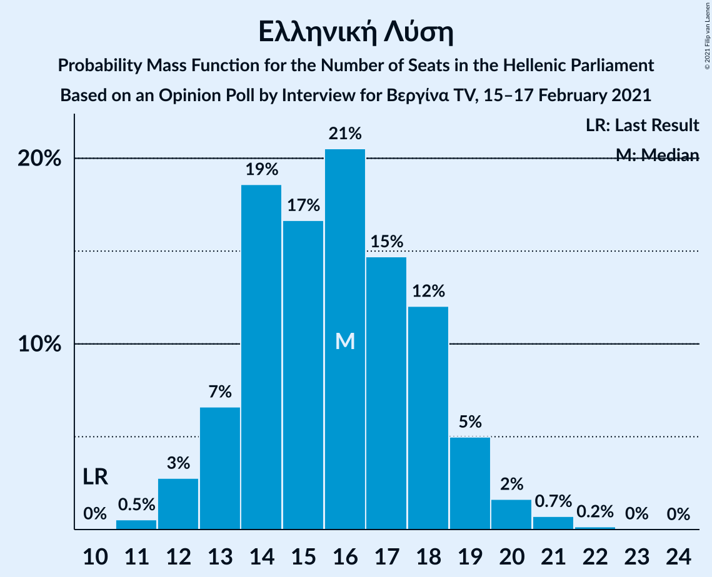
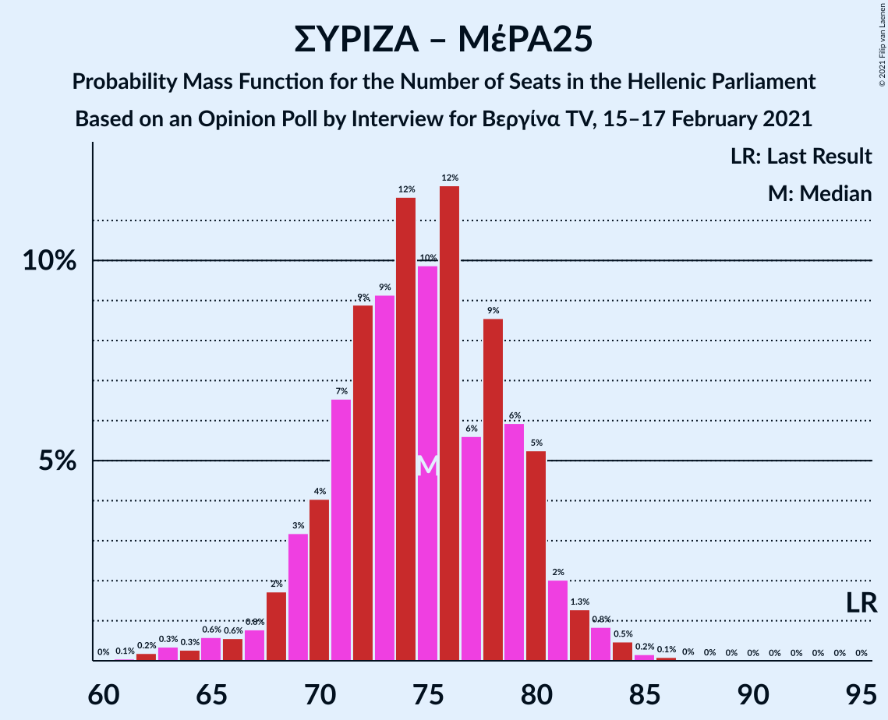

# Opinion Poll by Interview for Βεργίνα TV, 15–17 February 2021

<a href="#voting-intentions">Voting Intentions</a> | <a href="#seats">Seats</a> | <a href="#coalitions">Coalitions</a> | <a href="#technical-information">Technical Information</a>

## Voting Intentions

### Confidence Intervals

| Party | Last Result | Poll Result | 80% Confidence Interval | 90% Confidence Interval | 95% Confidence Interval | 99% Confidence Interval |
|:-----:|:-----------:|:-----------:|:-----------------------:|:-----------------------:|:-----------------------:|:-----------------------:|
| Νέα Δημοκρατία | 39.8% | 43.2% | 41.4–45.1% |40.9–45.6% |40.5–46.1% |39.6–46.9% |
| Συνασπισμός Ριζοσπαστικής Αριστεράς | 31.5% | 23.5% | 22.0–25.1% |21.5–25.6% |21.2–26.0% |20.5–26.8% |
| Κίνημα Αλλαγής | 8.1% | 9.1% | 8.1–10.3% |7.9–10.6% |7.6–10.9% |7.2–11.5% |
| Κομμουνιστικό Κόμμα Ελλάδας | 5.3% | 6.0% | 5.2–7.0% |5.0–7.2% |4.8–7.5% |4.4–8.0% |
| Ελληνική Λύση | 3.7% | 5.7% | 5.0–6.7% |4.7–7.0% |4.5–7.2% |4.2–7.7% |
| Μέτωπο Ευρωπαϊκής Ρεαλιστικής Ανυπακοής | 3.4% | 3.9% | 3.3–4.7% |3.1–5.0% |2.9–5.2% |2.7–5.6% |

*Note:* The poll result column reflects the actual value used in the calculations. Published results may vary slightly, and in addition be rounded to fewer digits.

## Seats

### Confidence Intervals

| Party | Last Result | Median | 80% Confidence Interval | 90% Confidence Interval | 95% Confidence Interval | 99% Confidence Interval |
|:-----:|:-----------:|:------:|:-----------------------:|:-----------------------:|:-----------------------:|:-----------------------:|
| <a href="#νέα-δημοκρατία">Νέα Δημοκρατία</a> | 158 | 168 | 163–173 |162–174 |160–176 |158–178 |
| <a href="#συνασπισμός-ριζοσπαστικής-αριστεράς">Συνασπισμός Ριζοσπαστικής Αριστεράς</a> | 86 | 64 | 60–68 |59–70 |58–71 |56–73 |
| <a href="#κίνημα-αλλαγής">Κίνημα Αλλαγής</a> | 22 | 25 | 22–28 |21–29 |21–29 |20–31 |
| <a href="#κομμουνιστικό-κόμμα-ελλάδας">Κομμουνιστικό Κόμμα Ελλάδας</a> | 15 | 16 | 14–19 |13–20 |13–21 |12–22 |
| <a href="#ελληνική-λύση">Ελληνική Λύση</a> | 10 | 16 | 14–18 |13–19 |12–20 |11–21 |
| <a href="#μέτωπο-ευρωπαϊκής-ρεαλιστικής-ανυπακοής">Μέτωπο Ευρωπαϊκής Ρεαλιστικής Ανυπακοής</a> | 9 | 11 | 9–13 |8–14 |0–14 |0–15 |

### Νέα Δημοκρατία

*For a full overview of the results for this party, see the [Νέα Δημοκρατία](party-νέαδημοκρατία.html) page.*

| Number of Seats | Probability | Accumulated | Special Marks |
|:---------------:|:-----------:|:-----------:|:-------------:|
| 155 | 0% | 100% |  |
| 156 | 0.1% | 99.9% |  |
| 157 | 0.3% | 99.9% |  |
| 158 | 0.3% | 99.6% | Last Result |
| 159 | 0.7% | 99.3% |  |
| 160 | 1.1% | 98.6% |  |
| 161 | 2% | 97% |  |
| 162 | 3% | 95% |  |
| 163 | 5% | 92% |  |
| 164 | 7% | 87% |  |
| 165 | 6% | 80% |  |
| 166 | 9% | 74% |  |
| 167 | 8% | 64% |  |
| 168 | 11% | 56% | Median |
| 169 | 9% | 45% |  |
| 170 | 11% | 36% |  |
| 171 | 6% | 25% |  |
| 172 | 8% | 19% |  |
| 173 | 3% | 11% |  |
| 174 | 4% | 8% |  |
| 175 | 2% | 4% |  |
| 176 | 1.2% | 3% |  |
| 177 | 0.8% | 2% |  |
| 178 | 0.3% | 0.8% |  |
| 179 | 0.2% | 0.4% |  |
| 180 | 0.2% | 0.3% |  |
| 181 | 0.1% | 0.1% |  |
| 182 | 0% | 0% |  |

### Συνασπισμός Ριζοσπαστικής Αριστεράς

*For a full overview of the results for this party, see the [Συνασπισμός Ριζοσπαστικής Αριστεράς](party-συνασπισμόςριζοσπαστικήςαριστεράς.html) page.*

| Number of Seats | Probability | Accumulated | Special Marks |
|:---------------:|:-----------:|:-----------:|:-------------:|
| 54 | 0.1% | 100% |  |
| 55 | 0.2% | 99.9% |  |
| 56 | 0.5% | 99.6% |  |
| 57 | 1.3% | 99.1% |  |
| 58 | 2% | 98% |  |
| 59 | 4% | 96% |  |
| 60 | 6% | 91% |  |
| 61 | 9% | 85% |  |
| 62 | 8% | 76% |  |
| 63 | 11% | 69% |  |
| 64 | 11% | 58% | Median |
| 65 | 15% | 47% |  |
| 66 | 8% | 32% |  |
| 67 | 10% | 24% |  |
| 68 | 5% | 14% |  |
| 69 | 4% | 9% |  |
| 70 | 2% | 6% |  |
| 71 | 2% | 3% |  |
| 72 | 1.0% | 2% |  |
| 73 | 0.3% | 0.6% |  |
| 74 | 0.2% | 0.3% |  |
| 75 | 0.1% | 0.1% |  |
| 76 | 0% | 0.1% |  |
| 77 | 0% | 0% |  |
| 78 | 0% | 0% |  |
| 79 | 0% | 0% |  |
| 80 | 0% | 0% |  |
| 81 | 0% | 0% |  |
| 82 | 0% | 0% |  |
| 83 | 0% | 0% |  |
| 84 | 0% | 0% |  |
| 85 | 0% | 0% |  |
| 86 | 0% | 0% | Last Result |

### Κίνημα Αλλαγής

*For a full overview of the results for this party, see the [Κίνημα Αλλαγής](party-κίνημααλλαγής.html) page.*

| Number of Seats | Probability | Accumulated | Special Marks |
|:---------------:|:-----------:|:-----------:|:-------------:|
| 18 | 0.1% | 100% |  |
| 19 | 0.2% | 99.9% |  |
| 20 | 0.9% | 99.7% |  |
| 21 | 4% | 98.8% |  |
| 22 | 9% | 94% | Last Result |
| 23 | 14% | 85% |  |
| 24 | 14% | 71% |  |
| 25 | 12% | 57% | Median |
| 26 | 14% | 45% |  |
| 27 | 14% | 31% |  |
| 28 | 9% | 16% |  |
| 29 | 5% | 7% |  |
| 30 | 1.4% | 2% |  |
| 31 | 0.6% | 1.0% |  |
| 32 | 0.3% | 0.5% |  |
| 33 | 0.1% | 0.2% |  |
| 34 | 0% | 0% |  |

### Κομμουνιστικό Κόμμα Ελλάδας

*For a full overview of the results for this party, see the [Κομμουνιστικό Κόμμα Ελλάδας](party-κομμουνιστικόκόμμαελλάδας.html) page.*

| Number of Seats | Probability | Accumulated | Special Marks |
|:---------------:|:-----------:|:-----------:|:-------------:|
| 11 | 0.2% | 100% |  |
| 12 | 0.4% | 99.8% |  |
| 13 | 5% | 99.4% |  |
| 14 | 5% | 94% |  |
| 15 | 24% | 89% | Last Result |
| 16 | 16% | 65% | Median |
| 17 | 23% | 49% |  |
| 18 | 12% | 26% |  |
| 19 | 9% | 14% |  |
| 20 | 3% | 5% |  |
| 21 | 2% | 3% |  |
| 22 | 0.4% | 0.6% |  |
| 23 | 0.1% | 0.2% |  |
| 24 | 0% | 0% |  |

### Ελληνική Λύση

*For a full overview of the results for this party, see the [Ελληνική Λύση](party-ελληνικήλύση.html) page.*

| Number of Seats | Probability | Accumulated | Special Marks |
|:---------------:|:-----------:|:-----------:|:-------------:|
| 10 | 0% | 100% | Last Result |
| 11 | 0.5% | 100% |  |
| 12 | 3% | 99.4% |  |
| 13 | 7% | 97% |  |
| 14 | 19% | 90% |  |
| 15 | 17% | 71% |  |
| 16 | 21% | 55% | Median |
| 17 | 15% | 34% |  |
| 18 | 12% | 20% |  |
| 19 | 5% | 8% |  |
| 20 | 2% | 3% |  |
| 21 | 0.7% | 0.9% |  |
| 22 | 0.2% | 0.2% |  |
| 23 | 0% | 0.1% |  |
| 24 | 0% | 0% |  |

### Μέτωπο Ευρωπαϊκής Ρεαλιστικής Ανυπακοής

*For a full overview of the results for this party, see the [Μέτωπο Ευρωπαϊκής Ρεαλιστικής Ανυπακοής](party-μέτωποευρωπαϊκήςρεαλιστικήςανυπακοής.html) page.*

| Number of Seats | Probability | Accumulated | Special Marks |
|:---------------:|:-----------:|:-----------:|:-------------:|
| 0 | 3% | 100% |  |
| 1 | 0% | 97% |  |
| 2 | 0% | 97% |  |
| 3 | 0% | 97% |  |
| 4 | 0% | 97% |  |
| 5 | 0% | 97% |  |
| 6 | 0% | 97% |  |
| 7 | 0% | 97% |  |
| 8 | 4% | 97% |  |
| 9 | 15% | 93% | Last Result |
| 10 | 20% | 78% |  |
| 11 | 24% | 58% | Median |
| 12 | 18% | 34% |  |
| 13 | 11% | 16% |  |
| 14 | 4% | 5% |  |
| 15 | 0.9% | 1.2% |  |
| 16 | 0.2% | 0.3% |  |
| 17 | 0% | 0% |  |

## Coalitions

### Confidence Intervals

| Coalition | Last Result | Median | Majority? | 80% Confidence Interval | 90% Confidence Interval | 95% Confidence Interval | 99% Confidence Interval |
|:---------:|:-----------:|:------:|:---------:|:-----------------------:|:-----------------------:|:-----------------------:|:-----------------------:|
| Νέα Δημοκρατία – Κίνημα Αλλαγής | 180 | 193 | 100% | 188–198 | 186–199 | 186–201 | 183–203 |
| Νέα Δημοκρατία | 158 | 168 | 100% | 163–173 | 162–174 | 160–176 | 158–178 |
| Συνασπισμός Ριζοσπαστικής Αριστεράς – Μέτωπο Ευρωπαϊκής Ρεαλιστικής Ανυπακοής | 95 | 75 | 0% | 70–80 | 69–80 | 67–82 | 63–84 |
| Συνασπισμός Ριζοσπαστικής Αριστεράς | 86 | 64 | 0% | 60–68 | 59–70 | 58–71 | 56–73 |

### Νέα Δημοκρατία – Κίνημα Αλλαγής

| Number of Seats | Probability | Accumulated | Special Marks |
|:---------------:|:-----------:|:-----------:|:-------------:|
| 180 | 0% | 100% | Last Result |
| 181 | 0% | 99.9% |  |
| 182 | 0.2% | 99.9% |  |
| 183 | 0.6% | 99.7% |  |
| 184 | 0.5% | 99.2% |  |
| 185 | 1.0% | 98.7% |  |
| 186 | 4% | 98% |  |
| 187 | 2% | 94% |  |
| 188 | 3% | 92% |  |
| 189 | 9% | 89% |  |
| 190 | 8% | 80% |  |
| 191 | 4% | 72% |  |
| 192 | 14% | 69% |  |
| 193 | 12% | 55% | Median |
| 194 | 5% | 43% |  |
| 195 | 10% | 38% |  |
| 196 | 10% | 27% |  |
| 197 | 4% | 17% |  |
| 198 | 4% | 13% |  |
| 199 | 5% | 9% |  |
| 200 | 2% | 4% |  |
| 201 | 1.0% | 3% |  |
| 202 | 0.7% | 2% |  |
| 203 | 0.5% | 0.9% |  |
| 204 | 0.1% | 0.4% |  |
| 205 | 0.1% | 0.3% |  |
| 206 | 0.1% | 0.2% |  |
| 207 | 0% | 0.1% |  |
| 208 | 0% | 0% |  |

### Νέα Δημοκρατία

| Number of Seats | Probability | Accumulated | Special Marks |
|:---------------:|:-----------:|:-----------:|:-------------:|
| 155 | 0% | 100% |  |
| 156 | 0.1% | 99.9% |  |
| 157 | 0.3% | 99.9% |  |
| 158 | 0.3% | 99.6% | Last Result |
| 159 | 0.7% | 99.3% |  |
| 160 | 1.1% | 98.6% |  |
| 161 | 2% | 97% |  |
| 162 | 3% | 95% |  |
| 163 | 5% | 92% |  |
| 164 | 7% | 87% |  |
| 165 | 6% | 80% |  |
| 166 | 9% | 74% |  |
| 167 | 8% | 64% |  |
| 168 | 11% | 56% | Median |
| 169 | 9% | 45% |  |
| 170 | 11% | 36% |  |
| 171 | 6% | 25% |  |
| 172 | 8% | 19% |  |
| 173 | 3% | 11% |  |
| 174 | 4% | 8% |  |
| 175 | 2% | 4% |  |
| 176 | 1.2% | 3% |  |
| 177 | 0.8% | 2% |  |
| 178 | 0.3% | 0.8% |  |
| 179 | 0.2% | 0.4% |  |
| 180 | 0.2% | 0.3% |  |
| 181 | 0.1% | 0.1% |  |
| 182 | 0% | 0% |  |

### Συνασπισμός Ριζοσπαστικής Αριστεράς – Μέτωπο Ευρωπαϊκής Ρεαλιστικής Ανυπακοής

| Number of Seats | Probability | Accumulated | Special Marks |
|:---------------:|:-----------:|:-----------:|:-------------:|
| 60 | 0% | 100% |  |
| 61 | 0.1% | 99.9% |  |
| 62 | 0.2% | 99.9% |  |
| 63 | 0.3% | 99.7% |  |
| 64 | 0.3% | 99.4% |  |
| 65 | 0.6% | 99.1% |  |
| 66 | 0.6% | 98% |  |
| 67 | 0.8% | 98% |  |
| 68 | 2% | 97% |  |
| 69 | 3% | 95% |  |
| 70 | 4% | 92% |  |
| 71 | 7% | 88% |  |
| 72 | 9% | 82% |  |
| 73 | 9% | 73% |  |
| 74 | 12% | 64% |  |
| 75 | 10% | 52% | Median |
| 76 | 12% | 42% |  |
| 77 | 6% | 30% |  |
| 78 | 9% | 25% |  |
| 79 | 6% | 16% |  |
| 80 | 5% | 10% |  |
| 81 | 2% | 5% |  |
| 82 | 1.3% | 3% |  |
| 83 | 0.8% | 2% |  |
| 84 | 0.5% | 0.8% |  |
| 85 | 0.2% | 0.3% |  |
| 86 | 0.1% | 0.1% |  |
| 87 | 0% | 0.1% |  |
| 88 | 0% | 0% |  |
| 89 | 0% | 0% |  |
| 90 | 0% | 0% |  |
| 91 | 0% | 0% |  |
| 92 | 0% | 0% |  |
| 93 | 0% | 0% |  |
| 94 | 0% | 0% |  |
| 95 | 0% | 0% | Last Result |

### Συνασπισμός Ριζοσπαστικής Αριστεράς

| Number of Seats | Probability | Accumulated | Special Marks |
|:---------------:|:-----------:|:-----------:|:-------------:|
| 54 | 0.1% | 100% |  |
| 55 | 0.2% | 99.9% |  |
| 56 | 0.5% | 99.6% |  |
| 57 | 1.3% | 99.1% |  |
| 58 | 2% | 98% |  |
| 59 | 4% | 96% |  |
| 60 | 6% | 91% |  |
| 61 | 9% | 85% |  |
| 62 | 8% | 76% |  |
| 63 | 11% | 69% |  |
| 64 | 11% | 58% | Median |
| 65 | 15% | 47% |  |
| 66 | 8% | 32% |  |
| 67 | 10% | 24% |  |
| 68 | 5% | 14% |  |
| 69 | 4% | 9% |  |
| 70 | 2% | 6% |  |
| 71 | 2% | 3% |  |
| 72 | 1.0% | 2% |  |
| 73 | 0.3% | 0.6% |  |
| 74 | 0.2% | 0.3% |  |
| 75 | 0.1% | 0.1% |  |
| 76 | 0% | 0.1% |  |
| 77 | 0% | 0% |  |
| 78 | 0% | 0% |  |
| 79 | 0% | 0% |  |
| 80 | 0% | 0% |  |
| 81 | 0% | 0% |  |
| 82 | 0% | 0% |  |
| 83 | 0% | 0% |  |
| 84 | 0% | 0% |  |
| 85 | 0% | 0% |  |
| 86 | 0% | 0% | Last Result |

## Technical Information

### Opinion Poll

+ **Polling firm:** Interview
+ **Commissioner(s):** Βεργίνα TV
+ **Fieldwork period:** 15–17 February 2021

### Calculations

+ **Sample size:** 1205
+ **Simulations done:** 131,072
+ **Error estimate:** 1.34%

