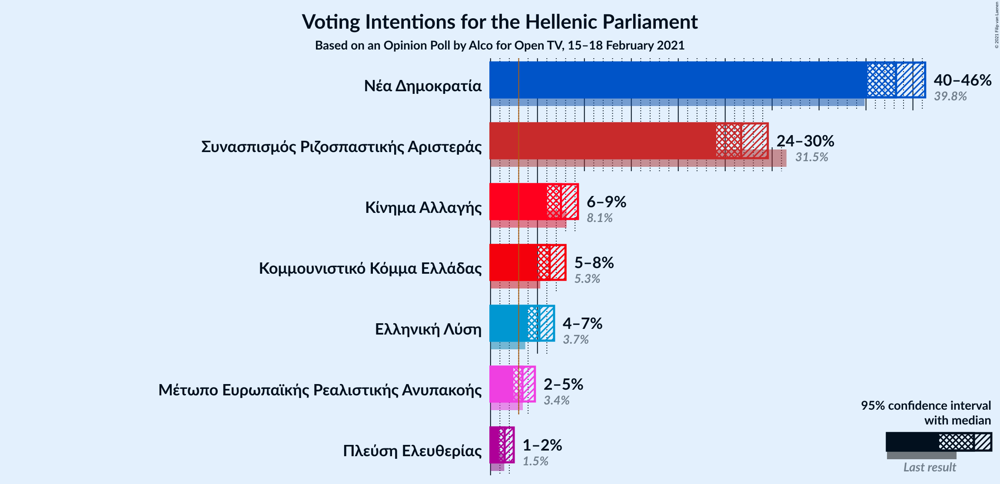
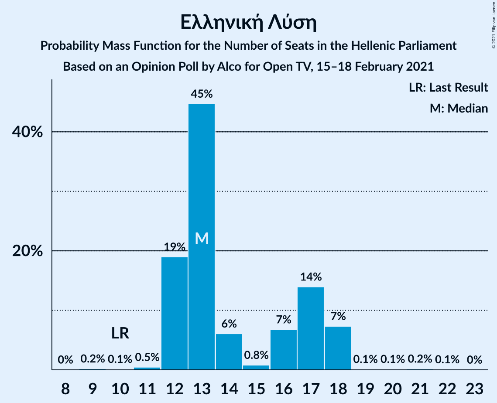
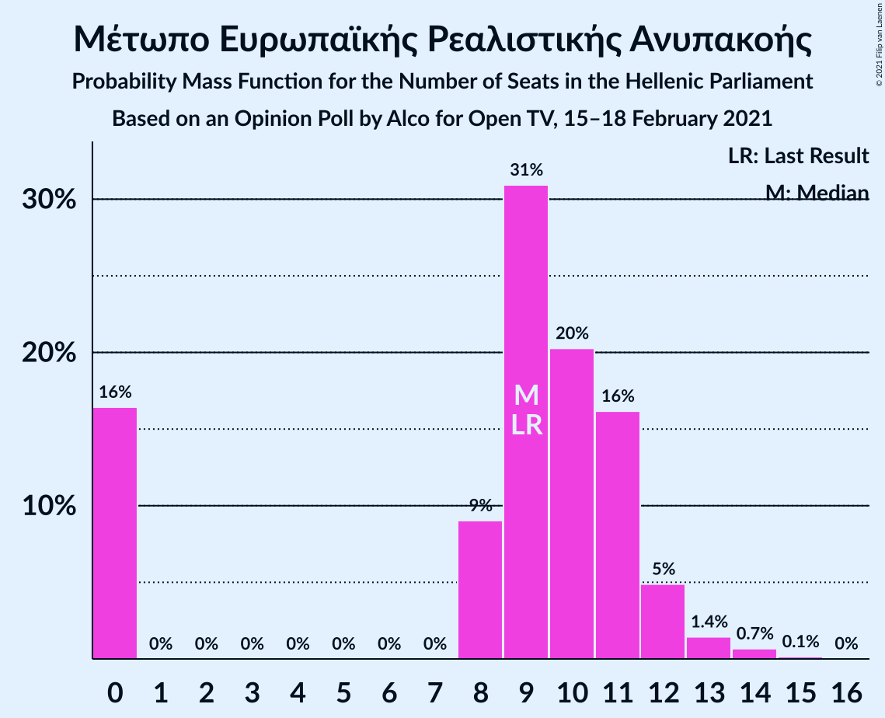
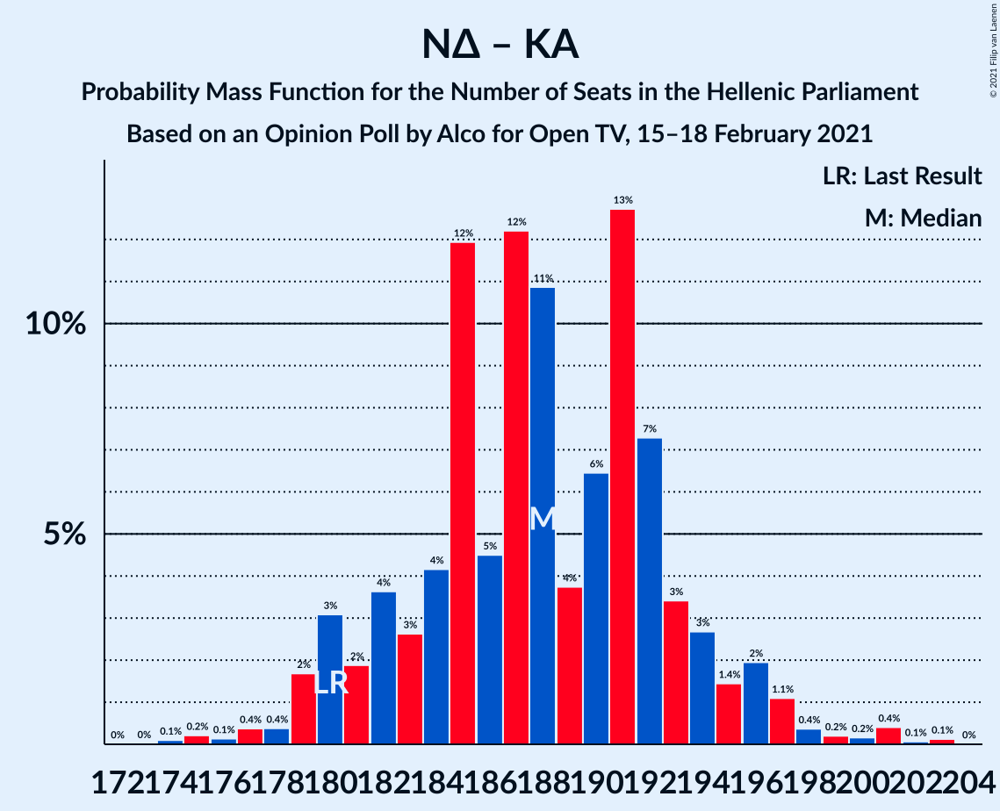

# Opinion Poll by Alco for Open TV, 15–18 February 2021

<a href="#voting-intentions">Voting Intentions</a> | <a href="#seats">Seats</a> | <a href="#coalitions">Coalitions</a> | <a href="#technical-information">Technical Information</a>

## Voting Intentions

### Confidence Intervals

| Party | Last Result | Poll Result | 80% Confidence Interval | 90% Confidence Interval | 95% Confidence Interval | 99% Confidence Interval |
|:-----:|:-----------:|:-----------:|:-----------------------:|:-----------------------:|:-----------------------:|:-----------------------:|
| Νέα Δημοκρατία | 39.8% | 43.2% | 41.2–45.2% |40.6–45.8% |40.2–46.3% |39.2–47.3% |
| Συνασπισμός Ριζοσπαστικής Αριστεράς | 31.5% | 26.7% | 25.0–28.6% |24.5–29.1% |24.1–29.5% |23.2–30.4% |
| Κίνημα Αλλαγής | 8.1% | 7.5% | 6.5–8.7% |6.2–9.0% |6.0–9.3% |5.6–9.9% |
| Κομμουνιστικό Κόμμα Ελλάδας | 5.3% | 6.3% | 5.4–7.4% |5.2–7.7% |5.0–8.0% |4.6–8.6% |
| Ελληνική Λύση | 3.7% | 5.2% | 4.4–6.2% |4.2–6.5% |4.0–6.8% |3.6–7.3% |
| Μέτωπο Ευρωπαϊκής Ρεαλιστικής Ανυπακοής | 3.4% | 3.4% | 2.8–4.3% |2.6–4.5% |2.4–4.7% |2.2–5.2% |
| Πλεύση Ελευθερίας | 1.5% | 1.5% | 1.1–2.1% |1.0–2.3% |0.9–2.5% |0.7–2.8% |

*Note:* The poll result column reflects the actual value used in the calculations. Published results may vary slightly, and in addition be rounded to fewer digits.

## Seats

### Confidence Intervals

| Party | Last Result | Median | 80% Confidence Interval | 90% Confidence Interval | 95% Confidence Interval | 99% Confidence Interval |
|:-----:|:-----------:|:------:|:-----------------------:|:-----------------------:|:-----------------------:|:-----------------------:|
| <a href="#νέα-δημοκρατία">Νέα Δημοκρατία</a> | 158 | 167 | 162–173 |160–174 |159–176 |156–179 |
| <a href="#συνασπισμός-ριζοσπαστικής-αριστεράς">Συνασπισμός Ριζοσπαστικής Αριστεράς</a> | 86 | 72 | 67–77 |66–79 |66–80 |63–83 |
| <a href="#κίνημα-αλλαγής">Κίνημα Αλλαγής</a> | 22 | 21 | 18–23 |17–25 |17–25 |15–27 |
| <a href="#κομμουνιστικό-κόμμα-ελλάδας">Κομμουνιστικό Κόμμα Ελλάδας</a> | 15 | 17 | 15–20 |14–21 |13–21 |13–24 |
| <a href="#ελληνική-λύση">Ελληνική Λύση</a> | 10 | 13 | 12–17 |12–18 |12–18 |11–19 |
| <a href="#μέτωπο-ευρωπαϊκής-ρεαλιστικής-ανυπακοής">Μέτωπο Ευρωπαϊκής Ρεαλιστικής Ανυπακοής</a> | 9 | 9 | 0–11 |0–12 |0–12 |0–14 |
| <a href="#πλεύση-ελευθερίας">Πλεύση Ελευθερίας</a> | 0 | 0 | 0 |0 |0 |0 |

### Νέα Δημοκρατία

*For a full overview of the results for this party, see the [Νέα Δημοκρατία](party-νέαδημοκρατία.html) page.*

| Number of Seats | Probability | Accumulated | Special Marks |
|:---------------:|:-----------:|:-----------:|:-------------:|
| 153 | 0.1% | 100% |  |
| 154 | 0% | 99.9% |  |
| 155 | 0.2% | 99.9% |  |
| 156 | 0.4% | 99.7% |  |
| 157 | 0.9% | 99.4% |  |
| 158 | 0.8% | 98% | Last Result |
| 159 | 0.8% | 98% |  |
| 160 | 2% | 97% |  |
| 161 | 3% | 94% |  |
| 162 | 2% | 91% |  |
| 163 | 7% | 89% |  |
| 164 | 9% | 82% |  |
| 165 | 9% | 73% |  |
| 166 | 9% | 64% |  |
| 167 | 10% | 54% | Median |
| 168 | 3% | 44% |  |
| 169 | 6% | 41% |  |
| 170 | 11% | 35% |  |
| 171 | 8% | 24% |  |
| 172 | 5% | 16% |  |
| 173 | 4% | 11% |  |
| 174 | 3% | 7% |  |
| 175 | 1.4% | 4% |  |
| 176 | 0.8% | 3% |  |
| 177 | 0.9% | 2% |  |
| 178 | 0.5% | 1.2% |  |
| 179 | 0.3% | 0.7% |  |
| 180 | 0.1% | 0.4% |  |
| 181 | 0.1% | 0.2% |  |
| 182 | 0% | 0.2% |  |
| 183 | 0.1% | 0.1% |  |
| 184 | 0% | 0% |  |

### Συνασπισμός Ριζοσπαστικής Αριστεράς

*For a full overview of the results for this party, see the [Συνασπισμός Ριζοσπαστικής Αριστεράς](party-συνασπισμόςριζοσπαστικήςαριστεράς.html) page.*

| Number of Seats | Probability | Accumulated | Special Marks |
|:---------------:|:-----------:|:-----------:|:-------------:|
| 61 | 0.1% | 100% |  |
| 62 | 0.4% | 99.9% |  |
| 63 | 0.4% | 99.5% |  |
| 64 | 0.1% | 99.2% |  |
| 65 | 0.3% | 99.0% |  |
| 66 | 5% | 98.7% |  |
| 67 | 8% | 93% |  |
| 68 | 3% | 85% |  |
| 69 | 2% | 83% |  |
| 70 | 9% | 81% |  |
| 71 | 21% | 72% |  |
| 72 | 8% | 50% | Median |
| 73 | 0.5% | 42% |  |
| 74 | 3% | 42% |  |
| 75 | 13% | 38% |  |
| 76 | 12% | 25% |  |
| 77 | 4% | 13% |  |
| 78 | 3% | 9% |  |
| 79 | 2% | 6% |  |
| 80 | 2% | 4% |  |
| 81 | 1.1% | 2% |  |
| 82 | 0.1% | 1.2% |  |
| 83 | 0.8% | 1.1% |  |
| 84 | 0.2% | 0.3% |  |
| 85 | 0.1% | 0.1% |  |
| 86 | 0% | 0% | Last Result |

### Κίνημα Αλλαγής

*For a full overview of the results for this party, see the [Κίνημα Αλλαγής](party-κίνημααλλαγής.html) page.*

| Number of Seats | Probability | Accumulated | Special Marks |
|:---------------:|:-----------:|:-----------:|:-------------:|
| 14 | 0.1% | 100% |  |
| 15 | 0.6% | 99.9% |  |
| 16 | 1.5% | 99.3% |  |
| 17 | 7% | 98% |  |
| 18 | 6% | 91% |  |
| 19 | 13% | 85% |  |
| 20 | 14% | 72% |  |
| 21 | 28% | 58% | Median |
| 22 | 14% | 30% | Last Result |
| 23 | 8% | 16% |  |
| 24 | 3% | 8% |  |
| 25 | 3% | 5% |  |
| 26 | 1.3% | 2% |  |
| 27 | 0.6% | 0.9% |  |
| 28 | 0.2% | 0.2% |  |
| 29 | 0% | 0% |  |

### Κομμουνιστικό Κόμμα Ελλάδας

*For a full overview of the results for this party, see the [Κομμουνιστικό Κόμμα Ελλάδας](party-κομμουνιστικόκόμμαελλάδας.html) page.*

| Number of Seats | Probability | Accumulated | Special Marks |
|:---------------:|:-----------:|:-----------:|:-------------:|
| 11 | 0.1% | 100% |  |
| 12 | 0.4% | 99.9% |  |
| 13 | 3% | 99.6% |  |
| 14 | 5% | 97% |  |
| 15 | 9% | 92% | Last Result |
| 16 | 19% | 83% |  |
| 17 | 18% | 64% | Median |
| 18 | 19% | 46% |  |
| 19 | 10% | 27% |  |
| 20 | 9% | 17% |  |
| 21 | 6% | 8% |  |
| 22 | 1.2% | 2% |  |
| 23 | 0.5% | 1.0% |  |
| 24 | 0.4% | 0.5% |  |
| 25 | 0% | 0.1% |  |
| 26 | 0% | 0% |  |

### Ελληνική Λύση

*For a full overview of the results for this party, see the [Ελληνική Λύση](party-ελληνικήλύση.html) page.*

| Number of Seats | Probability | Accumulated | Special Marks |
|:---------------:|:-----------:|:-----------:|:-------------:|
| 9 | 0.2% | 100% |  |
| 10 | 0.1% | 99.8% | Last Result |
| 11 | 0.5% | 99.6% |  |
| 12 | 19% | 99.2% |  |
| 13 | 45% | 80% | Median |
| 14 | 6% | 35% |  |
| 15 | 0.8% | 29% |  |
| 16 | 7% | 29% |  |
| 17 | 14% | 22% |  |
| 18 | 7% | 8% |  |
| 19 | 0.1% | 0.5% |  |
| 20 | 0.1% | 0.4% |  |
| 21 | 0.2% | 0.3% |  |
| 22 | 0.1% | 0.1% |  |
| 23 | 0% | 0% |  |

### Μέτωπο Ευρωπαϊκής Ρεαλιστικής Ανυπακοής

*For a full overview of the results for this party, see the [Μέτωπο Ευρωπαϊκής Ρεαλιστικής Ανυπακοής](party-μέτωποευρωπαϊκήςρεαλιστικήςανυπακοής.html) page.*

| Number of Seats | Probability | Accumulated | Special Marks |
|:---------------:|:-----------:|:-----------:|:-------------:|
| 0 | 16% | 100% |  |
| 1 | 0% | 84% |  |
| 2 | 0% | 84% |  |
| 3 | 0% | 84% |  |
| 4 | 0% | 84% |  |
| 5 | 0% | 84% |  |
| 6 | 0% | 84% |  |
| 7 | 0% | 84% |  |
| 8 | 9% | 84% |  |
| 9 | 31% | 75% | Last Result, Median |
| 10 | 20% | 44% |  |
| 11 | 16% | 23% |  |
| 12 | 5% | 7% |  |
| 13 | 1.4% | 2% |  |
| 14 | 0.7% | 0.8% |  |
| 15 | 0.1% | 0.2% |  |
| 16 | 0% | 0% |  |

### Πλεύση Ελευθερίας

*For a full overview of the results for this party, see the [Πλεύση Ελευθερίας](party-πλεύσηελευθερίας.html) page.*

| Number of Seats | Probability | Accumulated | Special Marks |
|:---------------:|:-----------:|:-----------:|:-------------:|
| 0 | 99.9% | 100% | Last Result, Median |
| 1 | 0% | 0.1% |  |
| 2 | 0% | 0.1% |  |
| 3 | 0% | 0.1% |  |
| 4 | 0% | 0.1% |  |
| 5 | 0% | 0.1% |  |
| 6 | 0% | 0.1% |  |
| 7 | 0% | 0.1% |  |
| 8 | 0% | 0.1% |  |
| 9 | 0.1% | 0.1% |  |
| 10 | 0% | 0% |  |

## Coalitions

### Confidence Intervals

| Coalition | Last Result | Median | Majority? | 80% Confidence Interval | 90% Confidence Interval | 95% Confidence Interval | 99% Confidence Interval |
|:---------:|:-----------:|:------:|:---------:|:-----------------------:|:-----------------------:|:-----------------------:|:-----------------------:|
| Νέα Δημοκρατία – Κίνημα Αλλαγής | 180 | 188 | 100% | 182–193 | 180–195 | 179–196 | 177–201 |
| Νέα Δημοκρατία | 158 | 167 | 100% | 162–173 | 160–174 | 159–176 | 156–179 |
| Συνασπισμός Ριζοσπαστικής Αριστεράς – Μέτωπο Ευρωπαϊκής Ρεαλιστικής Ανυπακοής | 95 | 81 | 0% | 75–86 | 74–87 | 70–89 | 69–91 |
| Συνασπισμός Ριζοσπαστικής Αριστεράς | 86 | 72 | 0% | 67–77 | 66–79 | 66–80 | 63–83 |

### Νέα Δημοκρατία – Κίνημα Αλλαγής

| Number of Seats | Probability | Accumulated | Special Marks |
|:---------------:|:-----------:|:-----------:|:-------------:|
| 174 | 0.1% | 100% |  |
| 175 | 0.2% | 99.9% |  |
| 176 | 0.1% | 99.7% |  |
| 177 | 0.4% | 99.5% |  |
| 178 | 0.4% | 99.1% |  |
| 179 | 2% | 98.8% |  |
| 180 | 3% | 97% | Last Result |
| 181 | 2% | 94% |  |
| 182 | 4% | 92% |  |
| 183 | 3% | 88% |  |
| 184 | 4% | 86% |  |
| 185 | 12% | 82% |  |
| 186 | 5% | 70% |  |
| 187 | 12% | 65% |  |
| 188 | 11% | 53% | Median |
| 189 | 4% | 42% |  |
| 190 | 6% | 38% |  |
| 191 | 13% | 32% |  |
| 192 | 7% | 19% |  |
| 193 | 3% | 12% |  |
| 194 | 3% | 9% |  |
| 195 | 1.4% | 6% |  |
| 196 | 2% | 4% |  |
| 197 | 1.1% | 2% |  |
| 198 | 0.4% | 1.4% |  |
| 199 | 0.2% | 1.0% |  |
| 200 | 0.2% | 0.8% |  |
| 201 | 0.4% | 0.6% |  |
| 202 | 0.1% | 0.2% |  |
| 203 | 0.1% | 0.2% |  |
| 204 | 0% | 0% |  |

### Νέα Δημοκρατία

| Number of Seats | Probability | Accumulated | Special Marks |
|:---------------:|:-----------:|:-----------:|:-------------:|
| 153 | 0.1% | 100% |  |
| 154 | 0% | 99.9% |  |
| 155 | 0.2% | 99.9% |  |
| 156 | 0.4% | 99.7% |  |
| 157 | 0.9% | 99.4% |  |
| 158 | 0.8% | 98% | Last Result |
| 159 | 0.8% | 98% |  |
| 160 | 2% | 97% |  |
| 161 | 3% | 94% |  |
| 162 | 2% | 91% |  |
| 163 | 7% | 89% |  |
| 164 | 9% | 82% |  |
| 165 | 9% | 73% |  |
| 166 | 9% | 64% |  |
| 167 | 10% | 54% | Median |
| 168 | 3% | 44% |  |
| 169 | 6% | 41% |  |
| 170 | 11% | 35% |  |
| 171 | 8% | 24% |  |
| 172 | 5% | 16% |  |
| 173 | 4% | 11% |  |
| 174 | 3% | 7% |  |
| 175 | 1.4% | 4% |  |
| 176 | 0.8% | 3% |  |
| 177 | 0.9% | 2% |  |
| 178 | 0.5% | 1.2% |  |
| 179 | 0.3% | 0.7% |  |
| 180 | 0.1% | 0.4% |  |
| 181 | 0.1% | 0.2% |  |
| 182 | 0% | 0.2% |  |
| 183 | 0.1% | 0.1% |  |
| 184 | 0% | 0% |  |

### Συνασπισμός Ριζοσπαστικής Αριστεράς – Μέτωπο Ευρωπαϊκής Ρεαλιστικής Ανυπακοής

| Number of Seats | Probability | Accumulated | Special Marks |
|:---------------:|:-----------:|:-----------:|:-------------:|
| 64 | 0.1% | 100% |  |
| 65 | 0.1% | 99.9% |  |
| 66 | 0% | 99.8% |  |
| 67 | 0% | 99.8% |  |
| 68 | 0% | 99.8% |  |
| 69 | 1.4% | 99.8% |  |
| 70 | 2% | 98% |  |
| 71 | 0.2% | 97% |  |
| 72 | 0.3% | 96% |  |
| 73 | 0.5% | 96% |  |
| 74 | 3% | 96% |  |
| 75 | 5% | 92% |  |
| 76 | 7% | 88% |  |
| 77 | 5% | 81% |  |
| 78 | 5% | 76% |  |
| 79 | 3% | 71% |  |
| 80 | 16% | 68% |  |
| 81 | 15% | 52% | Median |
| 82 | 4% | 37% |  |
| 83 | 2% | 33% |  |
| 84 | 7% | 30% |  |
| 85 | 7% | 23% |  |
| 86 | 8% | 16% |  |
| 87 | 3% | 8% |  |
| 88 | 1.1% | 4% |  |
| 89 | 1.0% | 3% |  |
| 90 | 1.2% | 2% |  |
| 91 | 0.6% | 1.0% |  |
| 92 | 0.2% | 0.4% |  |
| 93 | 0.2% | 0.2% |  |
| 94 | 0% | 0.1% |  |
| 95 | 0% | 0% | Last Result |

### Συνασπισμός Ριζοσπαστικής Αριστεράς

| Number of Seats | Probability | Accumulated | Special Marks |
|:---------------:|:-----------:|:-----------:|:-------------:|
| 61 | 0.1% | 100% |  |
| 62 | 0.4% | 99.9% |  |
| 63 | 0.4% | 99.5% |  |
| 64 | 0.1% | 99.2% |  |
| 65 | 0.3% | 99.0% |  |
| 66 | 5% | 98.7% |  |
| 67 | 8% | 93% |  |
| 68 | 3% | 85% |  |
| 69 | 2% | 83% |  |
| 70 | 9% | 81% |  |
| 71 | 21% | 72% |  |
| 72 | 8% | 50% | Median |
| 73 | 0.5% | 42% |  |
| 74 | 3% | 42% |  |
| 75 | 13% | 38% |  |
| 76 | 12% | 25% |  |
| 77 | 4% | 13% |  |
| 78 | 3% | 9% |  |
| 79 | 2% | 6% |  |
| 80 | 2% | 4% |  |
| 81 | 1.1% | 2% |  |
| 82 | 0.1% | 1.2% |  |
| 83 | 0.8% | 1.1% |  |
| 84 | 0.2% | 0.3% |  |
| 85 | 0.1% | 0.1% |  |
| 86 | 0% | 0% | Last Result |

## Technical Information

### Opinion Poll

+ **Polling firm:** Alco
+ **Commissioner(s):** Open TV
+ **Fieldwork period:** 15–18 February 2021

### Calculations

+ **Sample size:** 1000
+ **Simulations done:** 131,072
+ **Error estimate:** 1.40%

