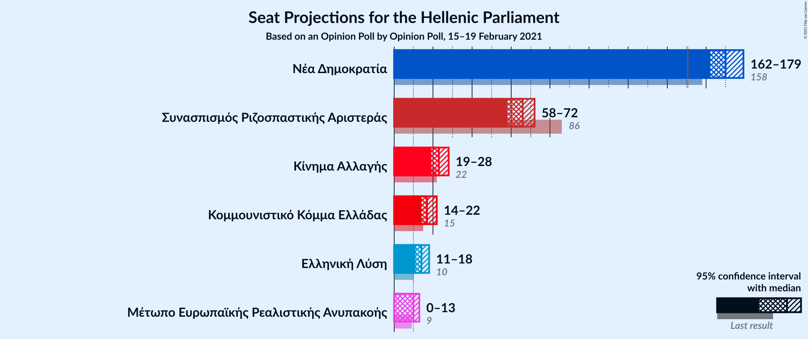
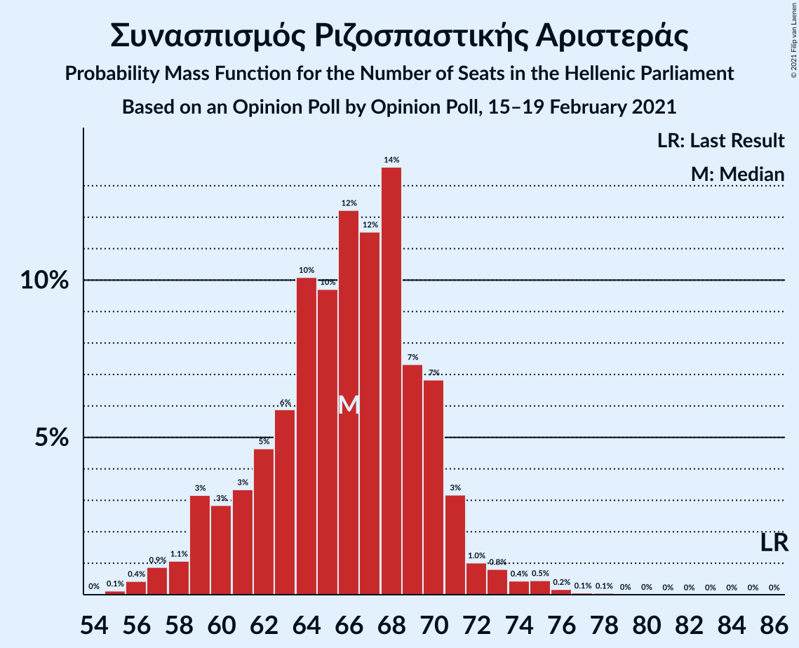
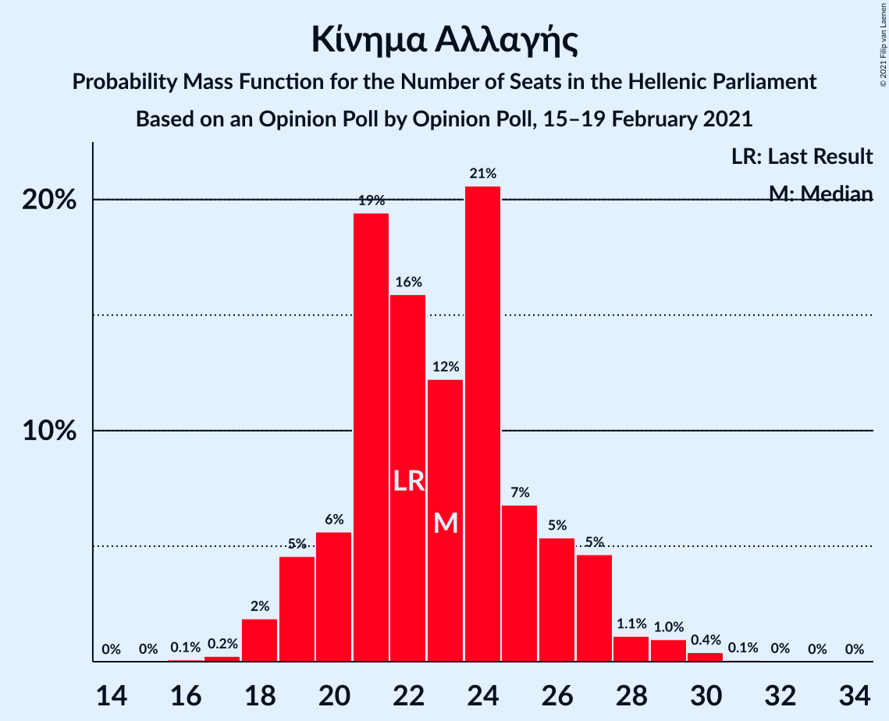
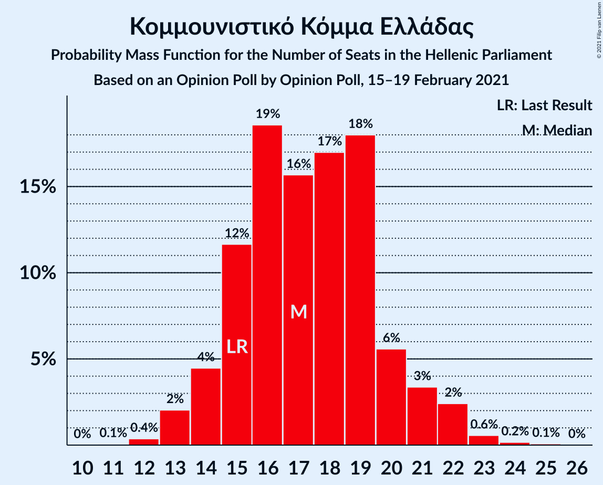
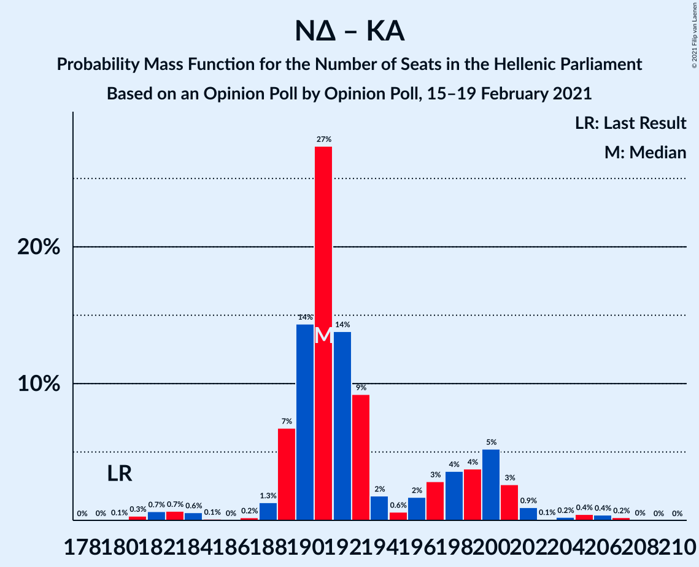

# Opinion Poll by Opinion Poll for Political, 15–19 February 2021

<a href="#voting-intentions">Voting Intentions</a> | <a href="#seats">Seats</a> | <a href="#coalitions">Coalitions</a> | <a href="#technical-information">Technical Information</a>

## Voting Intentions

### Confidence Intervals

| Party | Last Result | Poll Result | 80% Confidence Interval | 90% Confidence Interval | 95% Confidence Interval | 99% Confidence Interval |
|:-----:|:-----------:|:-----------:|:-----------------------:|:-----------------------:|:-----------------------:|:-----------------------:|
| Νέα Δημοκρατία | 39.8% | 46.3% | 44.2–48.3% |43.7–48.9% |43.2–49.4% |42.2–50.3% |
| Συνασπισμός Ριζοσπαστικής Αριστεράς | 31.5% | 25.1% | 23.4–26.9% |22.9–27.5% |22.5–27.9% |21.7–28.8% |
| Κίνημα Αλλαγής | 8.1% | 8.8% | 7.7–10.0% |7.4–10.4% |7.2–10.7% |6.7–11.3% |
| Κομμουνιστικό Κόμμα Ελλάδας | 5.3% | 6.6% | 5.7–7.7% |5.4–8.0% |5.2–8.3% |4.8–8.9% |
| Ελληνική Λύση | 3.7% | 5.5% | 4.7–6.5% |4.4–6.8% |4.2–7.1% |3.9–7.6% |
| Μέτωπο Ευρωπαϊκής Ρεαλιστικής Ανυπακοής | 3.4% | 3.8% | 3.1–4.7% |2.9–4.9% |2.8–5.2% |2.5–5.6% |

*Note:* The poll result column reflects the actual value used in the calculations. Published results may vary slightly, and in addition be rounded to fewer digits.

## Seats

### Confidence Intervals

| Party | Last Result | Median | 80% Confidence Interval | 90% Confidence Interval | 95% Confidence Interval | 99% Confidence Interval |
|:-----:|:-----------:|:------:|:-----------------------:|:-----------------------:|:-----------------------:|:-----------------------:|
| <a href="#νέα-δημοκρατία">Νέα Δημοκρατία</a> | 158 | 170 | 165–176 |164–177 |162–179 |160–182 |
| <a href="#συνασπισμός-ριζοσπαστικής-αριστεράς">Συνασπισμός Ριζοσπαστικής Αριστεράς</a> | 86 | 66 | 61–70 |59–71 |58–72 |56–75 |
| <a href="#κίνημα-αλλαγής">Κίνημα Αλλαγής</a> | 22 | 23 | 20–26 |19–27 |19–28 |18–30 |
| <a href="#κομμουνιστικό-κόμμα-ελλάδας">Κομμουνιστικό Κόμμα Ελλάδας</a> | 15 | 17 | 15–20 |14–21 |14–22 |13–23 |
| <a href="#ελληνική-λύση">Ελληνική Λύση</a> | 10 | 14 | 12–17 |12–18 |11–18 |10–20 |
| <a href="#μέτωπο-ευρωπαϊκής-ρεαλιστικής-ανυπακοής">Μέτωπο Ευρωπαϊκής Ρεαλιστικής Ανυπακοής</a> | 9 | 10 | 8–12 |0–13 |0–13 |0–15 |

### Νέα Δημοκρατία

*For a full overview of the results for this party, see the [Νέα Δημοκρατία](party-νέαδημοκρατία.html) page.*

| Number of Seats | Probability | Accumulated | Special Marks |
|:---------------:|:-----------:|:-----------:|:-------------:|
| 157 | 0.1% | 100% |  |
| 158 | 0.1% | 99.9% | Last Result |
| 159 | 0.2% | 99.8% |  |
| 160 | 0.4% | 99.6% |  |
| 161 | 0.7% | 99.2% |  |
| 162 | 1.3% | 98% |  |
| 163 | 2% | 97% |  |
| 164 | 2% | 95% |  |
| 165 | 4% | 93% |  |
| 166 | 9% | 89% |  |
| 167 | 10% | 80% |  |
| 168 | 7% | 69% |  |
| 169 | 10% | 62% |  |
| 170 | 12% | 52% | Median |
| 171 | 10% | 40% |  |
| 172 | 7% | 30% |  |
| 173 | 5% | 24% |  |
| 174 | 5% | 19% |  |
| 175 | 3% | 14% |  |
| 176 | 4% | 11% |  |
| 177 | 2% | 7% |  |
| 178 | 1.4% | 4% |  |
| 179 | 1.0% | 3% |  |
| 180 | 0.6% | 2% |  |
| 181 | 0.4% | 1.1% |  |
| 182 | 0.4% | 0.7% |  |
| 183 | 0.2% | 0.3% |  |
| 184 | 0.1% | 0.2% |  |
| 185 | 0% | 0.1% |  |
| 186 | 0% | 0.1% |  |
| 187 | 0% | 0% |  |

### Συνασπισμός Ριζοσπαστικής Αριστεράς

*For a full overview of the results for this party, see the [Συνασπισμός Ριζοσπαστικής Αριστεράς](party-συνασπισμόςριζοσπαστικήςαριστεράς.html) page.*

| Number of Seats | Probability | Accumulated | Special Marks |
|:---------------:|:-----------:|:-----------:|:-------------:|
| 54 | 0% | 100% |  |
| 55 | 0.1% | 99.9% |  |
| 56 | 0.4% | 99.8% |  |
| 57 | 0.9% | 99.4% |  |
| 58 | 1.1% | 98.5% |  |
| 59 | 3% | 97% |  |
| 60 | 3% | 94% |  |
| 61 | 3% | 91% |  |
| 62 | 5% | 88% |  |
| 63 | 6% | 83% |  |
| 64 | 10% | 78% |  |
| 65 | 10% | 67% |  |
| 66 | 12% | 58% | Median |
| 67 | 12% | 46% |  |
| 68 | 14% | 34% |  |
| 69 | 7% | 20% |  |
| 70 | 7% | 13% |  |
| 71 | 3% | 6% |  |
| 72 | 1.0% | 3% |  |
| 73 | 0.8% | 2% |  |
| 74 | 0.4% | 1.2% |  |
| 75 | 0.5% | 0.8% |  |
| 76 | 0.2% | 0.3% |  |
| 77 | 0.1% | 0.1% |  |
| 78 | 0.1% | 0.1% |  |
| 79 | 0% | 0% |  |
| 80 | 0% | 0% |  |
| 81 | 0% | 0% |  |
| 82 | 0% | 0% |  |
| 83 | 0% | 0% |  |
| 84 | 0% | 0% |  |
| 85 | 0% | 0% |  |
| 86 | 0% | 0% | Last Result |

### Κίνημα Αλλαγής

*For a full overview of the results for this party, see the [Κίνημα Αλλαγής](party-κίνημααλλαγής.html) page.*

| Number of Seats | Probability | Accumulated | Special Marks |
|:---------------:|:-----------:|:-----------:|:-------------:|
| 16 | 0.1% | 100% |  |
| 17 | 0.2% | 99.9% |  |
| 18 | 2% | 99.6% |  |
| 19 | 5% | 98% |  |
| 20 | 6% | 93% |  |
| 21 | 19% | 88% |  |
| 22 | 16% | 68% | Last Result |
| 23 | 12% | 52% | Median |
| 24 | 21% | 40% |  |
| 25 | 7% | 19% |  |
| 26 | 5% | 13% |  |
| 27 | 5% | 7% |  |
| 28 | 1.1% | 3% |  |
| 29 | 1.0% | 2% |  |
| 30 | 0.4% | 0.5% |  |
| 31 | 0.1% | 0.1% |  |
| 32 | 0% | 0.1% |  |
| 33 | 0% | 0% |  |

### Κομμουνιστικό Κόμμα Ελλάδας

*For a full overview of the results for this party, see the [Κομμουνιστικό Κόμμα Ελλάδας](party-κομμουνιστικόκόμμαελλάδας.html) page.*

| Number of Seats | Probability | Accumulated | Special Marks |
|:---------------:|:-----------:|:-----------:|:-------------:|
| 11 | 0.1% | 100% |  |
| 12 | 0.4% | 99.9% |  |
| 13 | 2% | 99.6% |  |
| 14 | 4% | 98% |  |
| 15 | 12% | 93% | Last Result |
| 16 | 19% | 81% |  |
| 17 | 16% | 63% | Median |
| 18 | 17% | 47% |  |
| 19 | 18% | 30% |  |
| 20 | 6% | 12% |  |
| 21 | 3% | 7% |  |
| 22 | 2% | 3% |  |
| 23 | 0.6% | 0.8% |  |
| 24 | 0.2% | 0.3% |  |
| 25 | 0.1% | 0.1% |  |
| 26 | 0% | 0% |  |

### Ελληνική Λύση

*For a full overview of the results for this party, see the [Ελληνική Λύση](party-ελληνικήλύση.html) page.*

| Number of Seats | Probability | Accumulated | Special Marks |
|:---------------:|:-----------:|:-----------:|:-------------:|
| 9 | 0.1% | 100% |  |
| 10 | 0.8% | 99.9% | Last Result |
| 11 | 4% | 99.1% |  |
| 12 | 9% | 95% |  |
| 13 | 15% | 86% |  |
| 14 | 21% | 71% | Median |
| 15 | 20% | 49% |  |
| 16 | 13% | 29% |  |
| 17 | 10% | 16% |  |
| 18 | 4% | 6% |  |
| 19 | 1.3% | 2% |  |
| 20 | 0.4% | 0.6% |  |
| 21 | 0.1% | 0.2% |  |
| 22 | 0% | 0% |  |

### Μέτωπο Ευρωπαϊκής Ρεαλιστικής Ανυπακοής

*For a full overview of the results for this party, see the [Μέτωπο Ευρωπαϊκής Ρεαλιστικής Ανυπακοής](party-μέτωποευρωπαϊκήςρεαλιστικήςανυπακοής.html) page.*

| Number of Seats | Probability | Accumulated | Special Marks |
|:---------------:|:-----------:|:-----------:|:-------------:|
| 0 | 7% | 100% |  |
| 1 | 0% | 93% |  |
| 2 | 0% | 93% |  |
| 3 | 0% | 93% |  |
| 4 | 0% | 93% |  |
| 5 | 0% | 93% |  |
| 6 | 0% | 93% |  |
| 7 | 0% | 93% |  |
| 8 | 9% | 93% |  |
| 9 | 20% | 84% | Last Result |
| 10 | 23% | 64% | Median |
| 11 | 24% | 41% |  |
| 12 | 10% | 17% |  |
| 13 | 4% | 7% |  |
| 14 | 2% | 2% |  |
| 15 | 0.6% | 0.7% |  |
| 16 | 0.1% | 0.1% |  |
| 17 | 0% | 0% |  |

## Coalitions

### Confidence Intervals

| Coalition | Last Result | Median | Majority? | 80% Confidence Interval | 90% Confidence Interval | 95% Confidence Interval | 99% Confidence Interval |
|:---------:|:-----------:|:------:|:---------:|:-----------------------:|:-----------------------:|:-----------------------:|:-----------------------:|
| Νέα Δημοκρατία – Κίνημα Αλλαγής | 180 | 191 | 100% | 189–200 | 189–201 | 187–201 | 182–206 |
| Νέα Δημοκρατία | 158 | 170 | 100% | 165–176 | 164–177 | 162–179 | 160–182 |
| Συνασπισμός Ριζοσπαστικής Αριστεράς – Μέτωπο Ευρωπαϊκής Ρεαλιστικής Ανυπακοής | 95 | 76 | 0% | 69–80 | 68–81 | 66–82 | 63–85 |
| Συνασπισμός Ριζοσπαστικής Αριστεράς | 86 | 66 | 0% | 61–70 | 59–71 | 58–72 | 56–75 |

### Νέα Δημοκρατία – Κίνημα Αλλαγής

| Number of Seats | Probability | Accumulated | Special Marks |
|:---------------:|:-----------:|:-----------:|:-------------:|
| 180 | 0.1% | 100% | Last Result |
| 181 | 0.3% | 99.9% |  |
| 182 | 0.7% | 99.6% |  |
| 183 | 0.7% | 98.9% |  |
| 184 | 0.6% | 98% |  |
| 185 | 0.1% | 98% |  |
| 186 | 0% | 98% |  |
| 187 | 0.2% | 98% |  |
| 188 | 1.3% | 97% |  |
| 189 | 7% | 96% |  |
| 190 | 14% | 89% |  |
| 191 | 27% | 75% |  |
| 192 | 14% | 48% |  |
| 193 | 9% | 34% | Median |
| 194 | 2% | 25% |  |
| 195 | 0.6% | 23% |  |
| 196 | 2% | 22% |  |
| 197 | 3% | 20% |  |
| 198 | 4% | 18% |  |
| 199 | 4% | 14% |  |
| 200 | 5% | 10% |  |
| 201 | 3% | 5% |  |
| 202 | 0.9% | 2% |  |
| 203 | 0.1% | 1.4% |  |
| 204 | 0.2% | 1.3% |  |
| 205 | 0.4% | 1.1% |  |
| 206 | 0.4% | 0.7% |  |
| 207 | 0.2% | 0.3% |  |
| 208 | 0% | 0.1% |  |
| 209 | 0% | 0% |  |

### Νέα Δημοκρατία

| Number of Seats | Probability | Accumulated | Special Marks |
|:---------------:|:-----------:|:-----------:|:-------------:|
| 157 | 0.1% | 100% |  |
| 158 | 0.1% | 99.9% | Last Result |
| 159 | 0.2% | 99.8% |  |
| 160 | 0.4% | 99.6% |  |
| 161 | 0.7% | 99.2% |  |
| 162 | 1.3% | 98% |  |
| 163 | 2% | 97% |  |
| 164 | 2% | 95% |  |
| 165 | 4% | 93% |  |
| 166 | 9% | 89% |  |
| 167 | 10% | 80% |  |
| 168 | 7% | 69% |  |
| 169 | 10% | 62% |  |
| 170 | 12% | 52% | Median |
| 171 | 10% | 40% |  |
| 172 | 7% | 30% |  |
| 173 | 5% | 24% |  |
| 174 | 5% | 19% |  |
| 175 | 3% | 14% |  |
| 176 | 4% | 11% |  |
| 177 | 2% | 7% |  |
| 178 | 1.4% | 4% |  |
| 179 | 1.0% | 3% |  |
| 180 | 0.6% | 2% |  |
| 181 | 0.4% | 1.1% |  |
| 182 | 0.4% | 0.7% |  |
| 183 | 0.2% | 0.3% |  |
| 184 | 0.1% | 0.2% |  |
| 185 | 0% | 0.1% |  |
| 186 | 0% | 0.1% |  |
| 187 | 0% | 0% |  |

### Συνασπισμός Ριζοσπαστικής Αριστεράς – Μέτωπο Ευρωπαϊκής Ρεαλιστικής Ανυπακοής

| Number of Seats | Probability | Accumulated | Special Marks |
|:---------------:|:-----------:|:-----------:|:-------------:|
| 60 | 0% | 100% |  |
| 61 | 0.2% | 99.9% |  |
| 62 | 0.2% | 99.8% |  |
| 63 | 0.2% | 99.6% |  |
| 64 | 0.6% | 99.3% |  |
| 65 | 0.3% | 98.7% |  |
| 66 | 0.9% | 98% |  |
| 67 | 2% | 97% |  |
| 68 | 3% | 96% |  |
| 69 | 4% | 93% |  |
| 70 | 4% | 89% |  |
| 71 | 3% | 86% |  |
| 72 | 5% | 83% |  |
| 73 | 6% | 78% |  |
| 74 | 8% | 73% |  |
| 75 | 7% | 65% |  |
| 76 | 13% | 58% | Median |
| 77 | 13% | 45% |  |
| 78 | 9% | 31% |  |
| 79 | 10% | 22% |  |
| 80 | 5% | 12% |  |
| 81 | 3% | 7% |  |
| 82 | 2% | 4% |  |
| 83 | 0.8% | 2% |  |
| 84 | 0.6% | 1.2% |  |
| 85 | 0.3% | 0.6% |  |
| 86 | 0.2% | 0.3% |  |
| 87 | 0.1% | 0.1% |  |
| 88 | 0.1% | 0.1% |  |
| 89 | 0% | 0% |  |
| 90 | 0% | 0% |  |
| 91 | 0% | 0% |  |
| 92 | 0% | 0% |  |
| 93 | 0% | 0% |  |
| 94 | 0% | 0% |  |
| 95 | 0% | 0% | Last Result |

### Συνασπισμός Ριζοσπαστικής Αριστεράς

| Number of Seats | Probability | Accumulated | Special Marks |
|:---------------:|:-----------:|:-----------:|:-------------:|
| 54 | 0% | 100% |  |
| 55 | 0.1% | 99.9% |  |
| 56 | 0.4% | 99.8% |  |
| 57 | 0.9% | 99.4% |  |
| 58 | 1.1% | 98.5% |  |
| 59 | 3% | 97% |  |
| 60 | 3% | 94% |  |
| 61 | 3% | 91% |  |
| 62 | 5% | 88% |  |
| 63 | 6% | 83% |  |
| 64 | 10% | 78% |  |
| 65 | 10% | 67% |  |
| 66 | 12% | 58% | Median |
| 67 | 12% | 46% |  |
| 68 | 14% | 34% |  |
| 69 | 7% | 20% |  |
| 70 | 7% | 13% |  |
| 71 | 3% | 6% |  |
| 72 | 1.0% | 3% |  |
| 73 | 0.8% | 2% |  |
| 74 | 0.4% | 1.2% |  |
| 75 | 0.5% | 0.8% |  |
| 76 | 0.2% | 0.3% |  |
| 77 | 0.1% | 0.1% |  |
| 78 | 0.1% | 0.1% |  |
| 79 | 0% | 0% |  |
| 80 | 0% | 0% |  |
| 81 | 0% | 0% |  |
| 82 | 0% | 0% |  |
| 83 | 0% | 0% |  |
| 84 | 0% | 0% |  |
| 85 | 0% | 0% |  |
| 86 | 0% | 0% | Last Result |

## Technical Information

### Opinion Poll

+ **Polling firm:** Opinion Poll
+ **Commissioner(s):** Political
+ **Fieldwork period:** 15–19 February 2021

### Calculations

+ **Sample size:** 1003
+ **Simulations done:** 131,072
+ **Error estimate:** 1.89%

